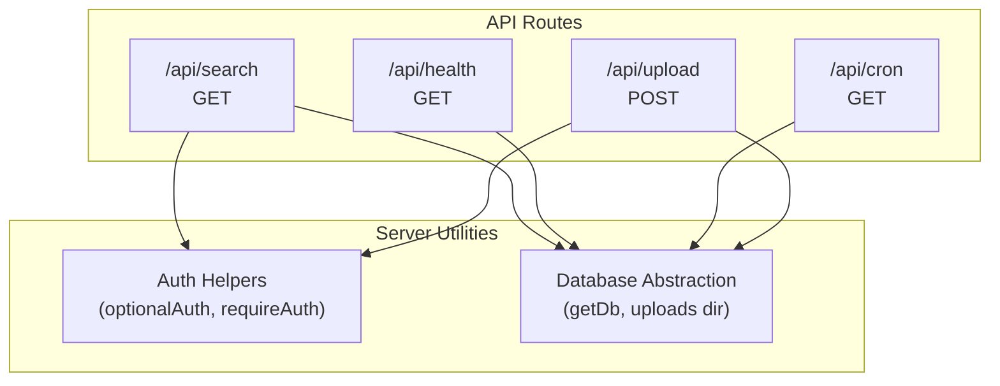
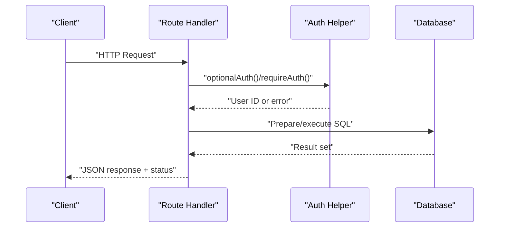
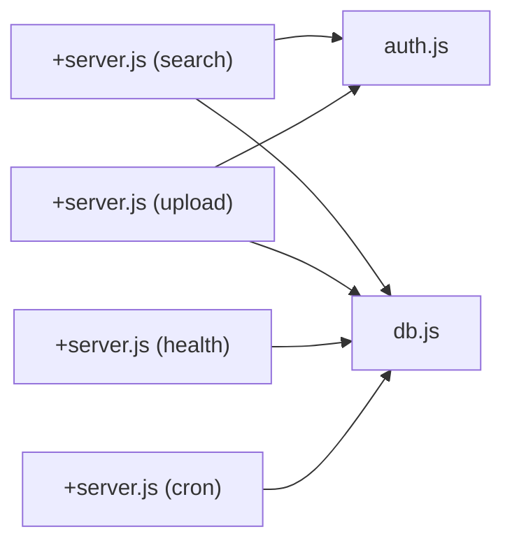

# API Reference

<cite>
**Referenced Files in This Document**
- [frontend/src/routes/api/search/+server.js](file://frontend/src/routes/api/search/+server.js)
- [frontend/src/routes/api/health/+server.js](file://frontend/src/routes/api/health/+server.js)
- [frontend/src/routes/api/cron/+server.js](file://frontend/src/routes/api/cron/+server.js)
- [frontend/src/routes/api/upload/+server.js](file://frontend/src/routes/api/upload/+server.js)
- [frontend/src/lib/server/db.js](file://frontend/src/lib/server/db.js)
- [frontend/src/lib/server/auth.js](file://frontend/src/lib/server/auth.js)
- [frontend/src/hooks.server.js](file://frontend/src/hooks.server.js)
</cite>

## Table of Contents
1. [Introduction](#introduction)
2. [Project Structure](#project-structure)
3. [Core Components](#core-components)
4. [Architecture Overview](#architecture-overview)
5. [Detailed Component Analysis](#detailed-component-analysis)
6. [Dependency Analysis](#dependency-analysis)
7. [Performance Considerations](#performance-considerations)
8. [Troubleshooting Guide](#troubleshooting-guide)
9. [Conclusion](#conclusion)
10. [Appendices](#appendices)

## Introduction
This document provides comprehensive API documentation for the VSocial backend, focusing on SvelteKit server routes that expose REST endpoints. It covers HTTP methods, URL patterns, request/response schemas, authentication requirements, parameter specifications, validation rules, error responses, and operational guidance. Endpoints are grouped by functional domains (search, health, cron maintenance, uploads), and the document includes practical usage notes, client implementation guidelines, and testing methodologies.

## Project Structure
The VSocial API surface is implemented as SvelteKit server routes under the frontend application. Each route module exports HTTP handlers (GET/POST) that process requests, interact with the database via a shared database abstraction, and optionally enforce authentication.

**Diagram sources**
- [frontend/src/routes/api/search/+server.js:1-61](file://frontend/src/routes/api/search/+server.js#L1-L61)
- [frontend/src/routes/api/health/+server.js:1-22](file://frontend/src/routes/api/health/+server.js#L1-L22)
- [frontend/src/routes/api/cron/+server.js:1-32](file://frontend/src/routes/api/cron/+server.js#L1-L32)
- [frontend/src/routes/api/upload/+server.js:1-44](file://frontend/src/routes/api/upload/+server.js#L1-L44)
- [frontend/src/lib/server/db.js](file://frontend/src/lib/server/db.js)
- [frontend/src/lib/server/auth.js](file://frontend/src/lib/server/auth.js)

**Section sources**
- [frontend/src/routes/api/search/+server.js:1-61](file://frontend/src/routes/api/search/+server.js#L1-L61)
- [frontend/src/routes/api/health/+server.js:1-22](file://frontend/src/routes/api/health/+server.js#L1-L22)
- [frontend/src/routes/api/cron/+server.js:1-32](file://frontend/src/routes/api/cron/+server.js#L1-L32)
- [frontend/src/routes/api/upload/+server.js:1-44](file://frontend/src/routes/api/upload/+server.js#L1-L44)

## Core Components
- Authentication helpers:
  - optionalAuth(request): Returns current user ID if present, otherwise null.
  - requireAuth(request): Requires a valid session/token and returns the user ID.
- Database abstraction:
  - getDb(): Provides a database connection handle for prepared statements.
  - getUploadsDir(subfolder): Resolves filesystem path for uploads.

These utilities are used across endpoints to enforce auth and access the database.

**Section sources**
- [frontend/src/lib/server/auth.js](file://frontend/src/lib/server/auth.js)
- [frontend/src/lib/server/db.js](file://frontend/src/lib/server/db.js)

## Architecture Overview
The API is implemented as SvelteKit server routes. Each handler:
- Extracts parameters from the request (URL query for GET, form data for POST).
- Optionally validates authentication.
- Executes database queries using prepared statements.
- Returns JSON responses with appropriate HTTP status codes.

**Diagram sources**
- [frontend/src/routes/api/search/+server.js:1-61](file://frontend/src/routes/api/search/+server.js#L1-L61)
- [frontend/src/routes/api/upload/+server.js:1-44](file://frontend/src/routes/api/upload/+server.js#L1-L44)
- [frontend/src/lib/server/auth.js](file://frontend/src/lib/server/auth.js)
- [frontend/src/lib/server/db.js](file://frontend/src/lib/server/db.js)

## Detailed Component Analysis

### Search API
- Method: GET
- URL: /api/search
- Purpose: Search across users, posts, gigs, and hashtags; also serves trending data when query is empty.

Parameters
- q: string, optional. Search term. If omitted, returns trending data.
- type: enum "all", "users", "posts", "gigs", "hashtags". Defaults to "all".
- page: integer, minimum 1. Defaults to 1.
- limit: integer, minimum 1, maximum 30. Defaults to 15.

Behavior
- If q is empty:
  - Returns trending users, popular hashtags, and popular public posts.
- If q is provided:
  - Filters by type and applies pagination.
  - Users: includes is_following flag when authenticated.
  - Posts: filters by privacy = "public".
  - Gigs: filters by status = "open"; splits tags string into array.
  - Hashtags: matches tag names.

Response Schema (selected fields)
- users: array of user objects (fields vary by authenticated state)
- posts: array of post objects (selected fields)
- gigs: array of gig objects (tags split into array)
- hashtags: array of hashtag objects
- query: string (input)
- type: string (input)

Validation Rules
- limit clamped between 1 and 30.
- page clamped to minimum 1.
- type must be one of the enumerated values.

Authentication
- Optional. When authenticated, adds is_following indicator for users.

Error Responses
- 400 Bad Request: Malformed parameters (implicit via type/page/limit parsing).
- 500 Internal Server Error: Database errors during query execution.

Example Requests
- GET /api/search?q=tech&type=all&page=1&limit=15
- GET /api/search

Example Response (partial)
- {
  "users": [...],
  "posts": [...],
  "gigs": [...],
  "hashtags": [...],
  "query": "tech",
  "type": "all"
}

**Section sources**
- [frontend/src/routes/api/search/+server.js:8-60](file://frontend/src/routes/api/search/+server.js#L8-L60)
- [frontend/src/lib/server/auth.js](file://frontend/src/lib/server/auth.js)

### Health API
- Method: GET
- URL: /api/health
- Purpose: Basic health check including database connectivity.

Response Schema
- status: "ok" or "degraded"
- timestamp: ISO date-time string
- version: semantic version string
- database: "connected" or "disconnected"

Validation Rules
- None.

Authentication
- Not required.

Error Responses
- 200 OK with degraded status when database is unreachable.

Example Request
- GET /api/health

Example Response
- {
  "status": "ok",
  "timestamp": "2025-01-01T00:00:00Z",
  "version": "0.0.1",
  "database": "connected"
}

**Section sources**
- [frontend/src/routes/api/health/+server.js:4-21](file://frontend/src/routes/api/health/+server.js#L4-L21)

### Cron Maintenance API
- Method: GET
- URL: /api/cron?token={secret}
- Purpose: Scheduled cleanup tasks (e.g., removing expired stories and sessions).

Authentication
- Required via Authorization header or token query parameter. Secret is configured via environment variable.

Parameters
- token: string. Bearer token or query param value must match CRON_SECRET.

Behavior
- Validates token against CRON_SECRET.
- Deletes expired stories and sessions.
- Returns counts of affected rows.

Response Schema
- success: boolean
- changes: object with story and session counts

Validation Rules
- Token must match CRON_SECRET.

Error Responses
- 401 Unauthorized: Missing or invalid token.
- 500 Internal Server Error: Database operation failure.

Example Request
- GET /api/cron?token=your_secret
- GET /api/cron with Authorization: Bearer your_secret

Example Response
- {
  "success": true,
  "changes": {
    "stories": 5,
    "sessions": 10
  }
}

**Section sources**
- [frontend/src/routes/api/cron/+server.js:5-31](file://frontend/src/routes/api/cron/+server.js#L5-L31)

### Upload API
- Method: POST
- URL: /api/upload
- Purpose: Upload media files (images, audio, video) with context scoping.

Authentication
- Required. Uses requireAuth to validate session/token.

Parameters (form-data)
- file: binary file. Required. Size limited to 50 MB.
- context: enum "avatar", "cover", "chat", "listing", "post". Defaults to "chat".

Allowed MIME Types
- Images: jpeg, png, webp, gif
- Audio: webm, mp4, mpeg, ogg
- Video: mp4, webm

Response Schema
- success: boolean
- url: string (relative path to uploaded file)
- type: enum "image", "audio", "video"
- mime: string (detected MIME type)
- size: number (bytes)

Validation Rules
- File presence required.
- Size ≤ 50 MB.
- MIME type must be in allowed list.
- context must be one of the enumerated values.

Error Responses
- 400 Bad Request: Missing file, oversized file, or invalid MIME type.
- 401 Unauthorized: Missing or invalid authentication.
- 500 Internal Server Error: Filesystem or database failure.

Example Request
- POST /api/upload with form fields:
  - file: [binary]
  - context: "post"

Example Response
- {
  "success": true,
  "url": "/uploads/posts/123_1700000000_random.webp",
  "type": "image",
  "mime": "image/webp",
  "size": 1048576
}

**Section sources**
- [frontend/src/routes/api/upload/+server.js:17-43](file://frontend/src/routes/api/upload/+server.js#L17-L43)
- [frontend/src/lib/server/auth.js](file://frontend/src/lib/server/auth.js)
- [frontend/src/lib/server/db.js](file://frontend/src/lib/server/db.js)

## Dependency Analysis
- Route handlers depend on:
  - Authentication helpers for session validation.
  - Database abstraction for prepared statements and uploads directory resolution.
- No cross-route dependencies observed among the analyzed endpoints.

**Diagram sources**
- [frontend/src/routes/api/search/+server.js:1-61](file://frontend/src/routes/api/search/+server.js#L1-L61)
- [frontend/src/routes/api/upload/+server.js:1-44](file://frontend/src/routes/api/upload/+server.js#L1-L44)
- [frontend/src/routes/api/health/+server.js:1-22](file://frontend/src/routes/api/health/+server.js#L1-L22)
- [frontend/src/routes/api/cron/+server.js:1-32](file://frontend/src/routes/api/cron/+server.js#L1-L32)
- [frontend/src/lib/server/auth.js](file://frontend/src/lib/server/auth.js)
- [frontend/src/lib/server/db.js](file://frontend/src/lib/server/db.js)

**Section sources**
- [frontend/src/routes/api/search/+server.js:1-61](file://frontend/src/routes/api/search/+server.js#L1-L61)
- [frontend/src/routes/api/upload/+server.js:1-44](file://frontend/src/routes/api/upload/+server.js#L1-L44)
- [frontend/src/routes/api/health/+server.js:1-22](file://frontend/src/routes/api/health/+server.js#L1-L22)
- [frontend/src/routes/api/cron/+server.js:1-32](file://frontend/src/routes/api/cron/+server.js#L1-L32)
- [frontend/src/lib/server/auth.js](file://frontend/src/lib/server/auth.js)
- [frontend/src/lib/server/db.js](file://frontend/src/lib/server/db.js)

## Performance Considerations
- Pagination: Enforce page ≥ 1 and limit ∈ [1..30] to prevent heavy queries.
- Indexing: Ensure database indexes exist on frequently filtered/sorted columns (e.g., usernames, display names, post privacy, hashtag post counts).
- Prepared statements: Used consistently to mitigate injection risks and improve caching.
- File sizes: Limit uploads to 50 MB to control storage and bandwidth usage.
- Trending queries: Use ORDER BY with LIMIT for top-N retrieval; avoid scanning entire tables.

## Troubleshooting Guide
Common Issues and Fixes
- Unauthorized Access
  - Symptom: 401 Unauthorized on protected endpoints.
  - Cause: Missing or invalid Authorization header/token.
  - Fix: Provide a valid bearer token or ensure session is established.

- Invalid or Missing File Upload
  - Symptom: 400 Bad Request on upload.
  - Causes: Missing file field, file size > 50 MB, unsupported MIME type.
  - Fix: Attach a single file with allowed MIME type and size ≤ 50 MB.

- Invalid Search Parameters
  - Symptom: Unexpected empty results or errors.
  - Causes: Unsupported type value or extreme page/limit values.
  - Fix: Use supported type values and keep limit within [1..30].

- Cron Endpoint Failure
  - Symptom: 401 Unauthorized or 500 Internal Server Error.
  - Causes: Missing CRON_SECRET or mismatched token.
  - Fix: Set CRON_SECRET and pass matching token via Authorization header or token query parameter.

- Health Check Degraded
  - Symptom: status "degraded" with database "disconnected".
  - Causes: Database unreachable.
  - Fix: Verify database connectivity and credentials.

**Section sources**
- [frontend/src/routes/api/upload/+server.js:21-29](file://frontend/src/routes/api/upload/+server.js#L21-L29)
- [frontend/src/routes/api/search/+server.js:11-12](file://frontend/src/routes/api/search/+server.js#L11-L12)
- [frontend/src/routes/api/cron/+server.js:11-13](file://frontend/src/routes/api/cron/+server.js#L11-L13)
- [frontend/src/routes/api/health/+server.js:15-18](file://frontend/src/routes/api/health/+server.js#L15-L18)

## Conclusion
The VSocial API exposes focused endpoints for search, health monitoring, scheduled maintenance, and media uploads. Handlers enforce authentication where required, validate inputs, and return structured JSON responses. Clients should adhere to documented parameter constraints, use proper authentication, and implement retry/backoff for transient failures. For production deployments, ensure environment variables (e.g., CRON_SECRET) are configured and monitor health endpoints regularly.

## Appendices

### Endpoint Catalog
- GET /api/search
  - Params: q, type, page, limit
  - Auth: optional
  - Response: aggregated results by type
- GET /api/health
  - Params: none
  - Auth: not required
  - Response: status, timestamp, version, database
- GET /api/cron?token={secret}
  - Params: token
  - Auth: required
  - Response: success, changes
- POST /api/upload
  - Form fields: file, context
  - Auth: required
  - Response: success, url, type, mime, size

### Client Implementation Guidelines
- Authentication
  - Use Authorization: Bearer <token> for protected endpoints.
  - Store tokens securely and refresh as needed.
- Pagination
  - Respect limit bounds and compute next page using page and limit.
- Uploads
  - Validate file size and MIME type client-side before sending.
  - Send multipart/form-data with file and context fields.
- Error Handling
  - Parse JSON error bodies and show user-friendly messages.
  - Retry transient failures with exponential backoff.

### Rate Limiting, Pagination, and Versioning
- Rate Limiting
  - Not implemented at the API level in the analyzed files. Consider adding per-endpoint limits and sliding windows.
- Pagination
  - Implemented via page and limit parameters with enforced bounds.
- Versioning
  - No explicit versioning observed. Consider path-based versioning (/v1/...) or Accept-Version header.

### Security Considerations
- CORS
  - Configure CORS in the SvelteKit adapter/server configuration to restrict origins and methods.
- CSRF
  - Not applicable for stateless APIs; ensure tokens are transmitted over HTTPS.
- Secrets
  - Protect CRON_SECRET and other secrets in environment variables.
- Input Validation
  - Handlers validate inputs; clients should mirror validations to reduce server load.

### API Testing Methodologies
- Unit-style checks
  - Mock database responses and assert JSON shape and status codes.
- End-to-end tests
  - Spin up a test database, seed minimal data, and exercise endpoints with varied inputs.
- Load tests
  - Benchmark search and upload endpoints with realistic concurrency and payload sizes.