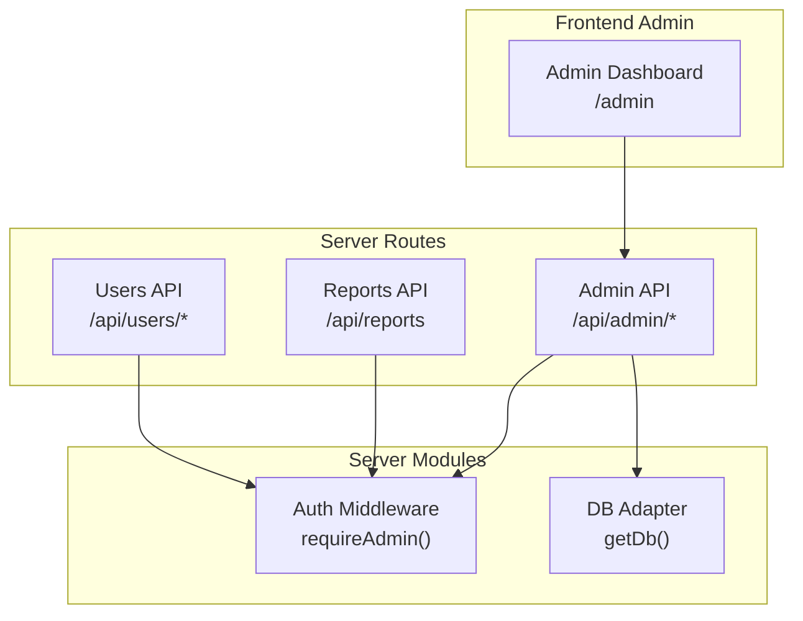
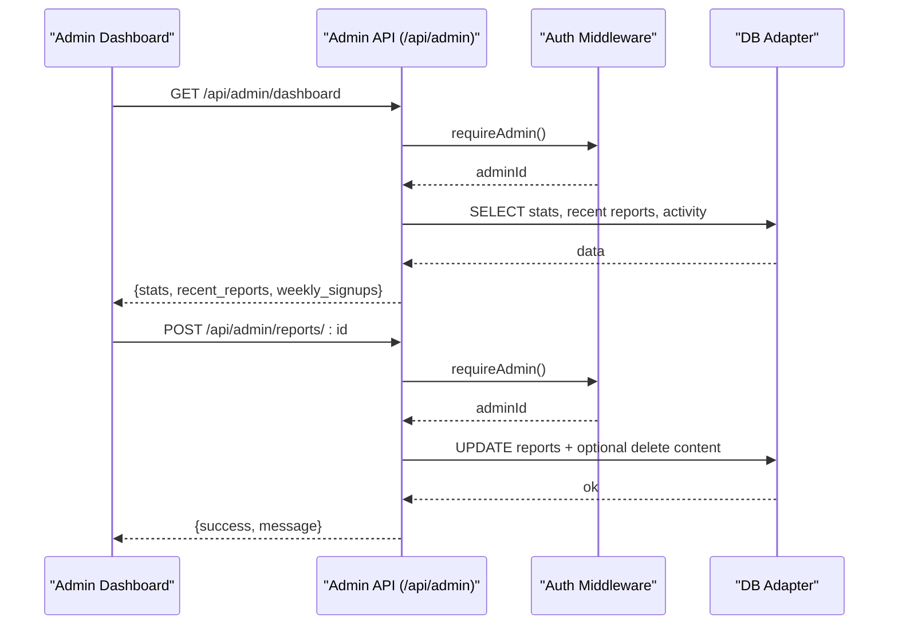
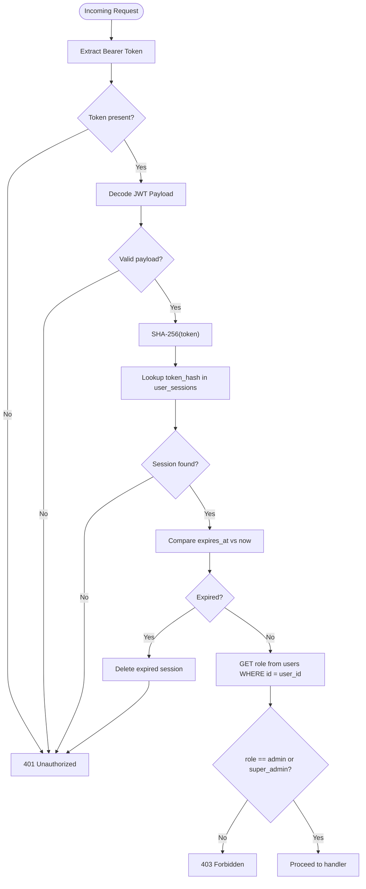
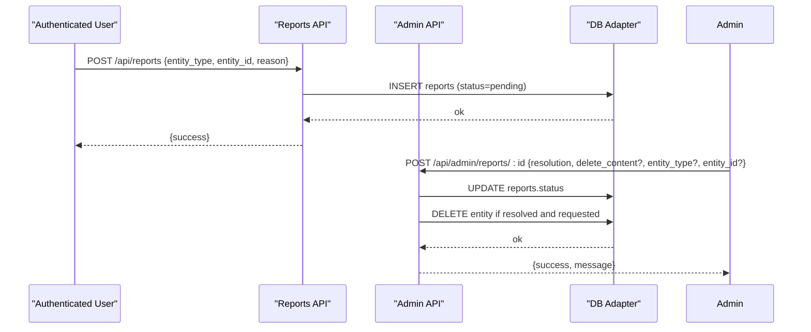
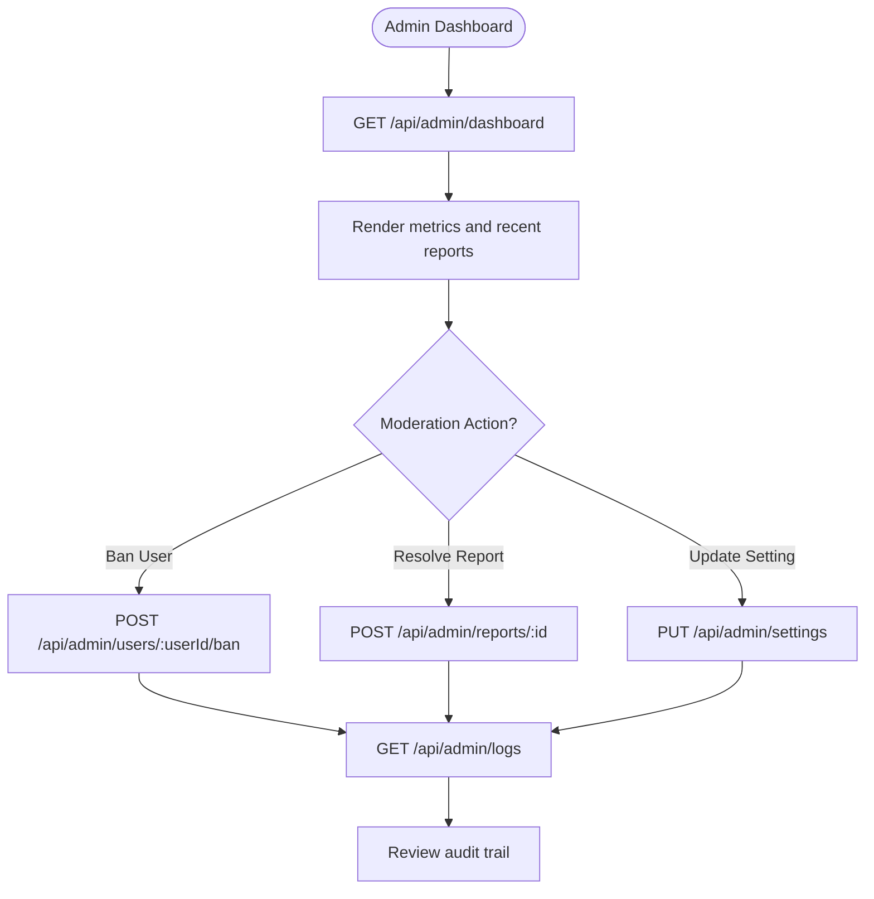
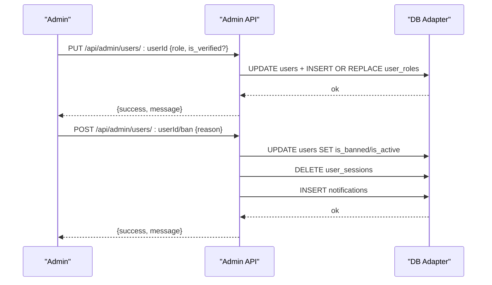
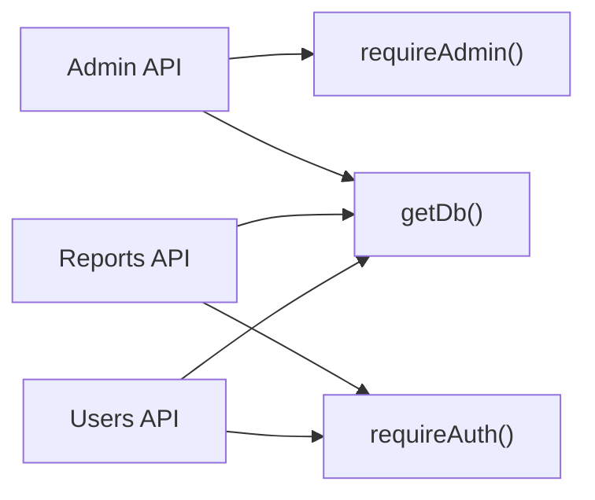

# Administration & Management API

<cite>
**Referenced Files in This Document**
- [admin +server.js](file://frontend/src/routes/api/admin/[...path]/+server.js)
- [auth.js](file://frontend/src/lib/server/auth.js)
- [db.js](file://frontend/src/lib/server/db.js)
- [reports +server.js](file://frontend/src/routes/api/reports/+server.js)
- [users +server.js](file://frontend/src/routes/api/users/[...path]/+server.js)
- [admin dashboard +page.svelte](file://frontend/src/routes/admin/+page.svelte)
</cite>

## Table of Contents
1. [Introduction](#introduction)
2. [Project Structure](#project-structure)
3. [Core Components](#core-components)
4. [Architecture Overview](#architecture-overview)
5. [Detailed Component Analysis](#detailed-component-analysis)
6. [Dependency Analysis](#dependency-analysis)
7. [Performance Considerations](#performance-considerations)
8. [Troubleshooting Guide](#troubleshooting-guide)
9. [Conclusion](#conclusion)

## Introduction
This document provides comprehensive API documentation for VSocial’s administrative and system management endpoints. It covers user moderation tools, content management interfaces, report handling, system settings management, feature toggles, audit logging, and administrative workflow automation. It also outlines permission-based access controls, role management, and operational procedures such as bulk actions, compliance reporting, data exports, backups, and disaster recovery.

## Project Structure
The administrative API is implemented as a SvelteKit server route under the namespace /api/admin. It integrates with a JWT-based authentication middleware and a unified database adapter supporting both @libsql/client and better-sqlite3 drivers. The frontend admin dashboard consumes these endpoints to present dashboards, manage users, review reports, and configure system settings.

**Diagram sources**
- [admin +server.js:1-260](file://frontend/src/routes/api/admin/[...path]/+server.js#L1-L260)
- [auth.js:79-89](file://frontend/src/lib/server/auth.js#L79-L89)
- [db.js:169-172](file://frontend/src/lib/server/db.js#L169-L172)
- [reports +server.js:1-39](file://frontend/src/routes/api/reports/+server.js#L1-L39)
- [users +server.js:1-347](file://frontend/src/routes/api/users/[...path]/+server.js#L1-L347)

**Section sources**
- [admin +server.js:1-260](file://frontend/src/routes/api/admin/[...path]/+server.js#L1-L260)
- [auth.js:1-92](file://frontend/src/lib/server/auth.js#L1-L92)
- [db.js:1-209](file://frontend/src/lib/server/db.js#L1-L209)
- [admin dashboard +page.svelte:1-357](file://frontend/src/routes/admin/+page.svelte#L1-L357)

## Core Components
- Admin API: Centralized administrative endpoints for dashboard metrics, user management, content moderation, report handling, settings, logs, and activity feeds.
- Authentication and Authorization: JWT-based sessions validated against stored tokens; admin-only endpoints enforced via requireAdmin().
- Database Adapter: Unified async interface supporting @libsql/client and better-sqlite3 with transaction support and PRAGMAs configured for durability and performance.
- Reports API: End-user submission of reports; admin API aggregates and resolves reports.
- Users API: User-centric endpoints; admin API extends user management with ban/unban and role updates.

Key capabilities:
- Permission enforcement: requireAdmin() ensures only admins and super_admins can access admin endpoints.
- Bulk operations: paginated listing endpoints enable batch moderation decisions.
- Audit logging: notifications and transactions tables capture administrative actions.
- Compliance reporting: dashboard exposes counts and recent activity suitable for compliance dashboards.

**Section sources**
- [admin +server.js:8-127](file://frontend/src/routes/api/admin/[...path]/+server.js#L8-L127)
- [auth.js:79-89](file://frontend/src/lib/server/auth.js#L79-L89)
- [db.js:117-167](file://frontend/src/lib/server/db.js#L117-L167)

## Architecture Overview
The admin API enforces admin-only access, queries the database for statistics and lists, and performs mutations such as banning users, resolving reports, updating settings, and deleting/restoring content. The Reports API supports user-initiated reports, while the Users API supports user lifecycle operations.

**Diagram sources**
- [admin +server.js:14-43](file://frontend/src/routes/api/admin/[...path]/+server.js#L14-L43)
- [admin +server.js:156-166](file://frontend/src/routes/api/admin/[...path]/+server.js#L156-L166)
- [auth.js:79-89](file://frontend/src/lib/server/auth.js#L79-L89)
- [db.js:169-172](file://frontend/src/lib/server/db.js#L169-L172)

## Detailed Component Analysis

### Admin API Endpoints
- Base path: /api/admin/*
- Authentication: requireAdmin() required for all endpoints.
- Supported actions:
  - GET /api/admin/dashboard
  - GET /api/admin/users?q=&page=&limit=
  - GET /api/admin/reports?status=
  - GET /api/admin/content?type=posts|reels|trash
  - GET /api/admin/settings
  - GET /api/admin/logs
  - GET /api/admin/activity?limit=
  - POST /api/admin/users/:userId/ban
  - POST /api/admin/users/:userId/unban
  - POST /api/admin/reports/:reportId
  - POST /api/admin/settings/toggle
  - PUT /api/admin/settings
  - PUT /api/admin/users/:userId
  - DELETE /api/admin/reports/:reportId
  - DELETE /api/admin/content/post/:id
  - DELETE /api/admin/content/reel/:id
  - DELETE /api/admin/content/trash/:id
  - DELETE /api/admin/users/:userId

Response format:
- Success: { success: true, ...payload }
- Errors: { error: string, message? } with appropriate HTTP status

Pagination and limits:
- Users listing supports q, page, limit with safe defaults and caps.
- Reports listing capped at 50 per request.
- Activity listing capped at 50 per request.

Permissions:
- requireAdmin() validates JWT and checks role=admin or super_admin.

**Section sources**
- [admin +server.js:8-127](file://frontend/src/routes/api/admin/[...path]/+server.js#L8-L127)
- [admin +server.js:129-186](file://frontend/src/routes/api/admin/[...path]/+server.js#L129-L186)
- [admin +server.js:188-222](file://frontend/src/routes/api/admin/[...path]/+server.js#L188-L222)
- [admin +server.js:224-259](file://frontend/src/routes/api/admin/[...path]/+server.js#L224-L259)
- [auth.js:79-89](file://frontend/src/lib/server/auth.js#L79-L89)

### Authentication and Authorization
- requireAuth(): Validates bearer token, decodes payload, checks token hash existence, and expiration.
- optionalAuth(): Same as requireAuth() but returns null if unauthenticated.
- requireAdmin(): Extends requireAuth() and verifies role is admin or super_admin.

**Diagram sources**
- [auth.js:15-44](file://frontend/src/lib/server/auth.js#L15-L44)
- [auth.js:79-89](file://frontend/src/lib/server/auth.js#L79-L89)

**Section sources**
- [auth.js:15-44](file://frontend/src/lib/server/auth.js#L15-L44)
- [auth.js:79-89](file://frontend/src/lib/server/auth.js#L79-L89)

### Database Adapter
- Auto-detection: tries @libsql/client first, falls back to better-sqlite3.
- Unified async API: prepare().run/get/all() returning promises.
- Transactions: transaction(fn) wraps block in BEGIN/COMMIT/ROLLBACK.
- Local DB tuning: WAL mode, foreign keys, busy timeout, cache size, temp store.
- Remote DB tuning: enables foreign keys where supported.

Operational implications:
- Consistent SQL execution across environments.
- Transaction boundaries for atomic operations.
- Tuned PRAGMAs for reliability and performance.

**Section sources**
- [db.js:31-113](file://frontend/src/lib/server/db.js#L31-L113)
- [db.js:117-167](file://frontend/src/lib/server/db.js#L117-L167)
- [db.js:169-172](file://frontend/src/lib/server/db.js#L169-L172)

### Report Handling Workflow
- End-user reports: POST /api/reports creates a pending report for post/comment/user/reel.
- Admin resolution: POST /api/admin/reports/:id updates status to resolved/dismissed; optionally deletes offending content.

**Diagram sources**
- [reports +server.js:10-31](file://frontend/src/routes/api/reports/+server.js#L10-L31)
- [admin +server.js:156-166](file://frontend/src/routes/api/admin/[...path]/+server.js#L156-L166)

**Section sources**
- [reports +server.js:10-31](file://frontend/src/routes/api/reports/+server.js#L10-L31)
- [admin +server.js:156-166](file://frontend/src/routes/api/admin/[...path]/+server.js#L156-L166)

### Content Management Interfaces
- Listing:
  - GET /api/admin/content?type=posts|reels|trash
- Moderation:
  - DELETE /api/admin/content/post/:id soft-deletes post (sets deleted_at)
  - DELETE /api/admin/content/reel/:id hard-deletes reel
  - DELETE /api/admin/content/trash/:id hard-deletes post from trash
  - POST /api/admin/content/trash/:id restores post from trash
- Bulk operations:
  - Paginated GET /api/admin/users with q, page, limit
  - Paginated GET /api/admin/reports with status filter
  - Paginated GET /api/admin/activity with limit cap

**Section sources**
- [admin +server.js:84-95](file://frontend/src/routes/api/admin/[...path]/+server.js#L84-L95)
- [admin +server.js:176-183](file://frontend/src/routes/api/admin/[...path]/+server.js#L176-L183)
- [admin +server.js:237-248](file://frontend/src/routes/api/admin/[...path]/+server.js#L237-L248)

### System Settings Management and Feature Toggles
- Retrieve settings: GET /api/admin/settings returns key/value pairs; values parsed as JSON if possible.
- Toggle single setting: POST /api/admin/settings/toggle {key, value}
- Bulk update settings: PUT /api/admin/settings {key: value, ...}
- Notes:
  - Values are stored in system_settings table with upsert semantics.
  - Feature toggles can be implemented by adding keys to system_settings.

**Section sources**
- [admin +server.js:97-104](file://frontend/src/routes/api/admin/[...path]/+server.js#L97-L104)
- [admin +server.js:168-174](file://frontend/src/routes/api/admin/[...path]/+server.js#L168-L174)
- [admin +server.js:196-202](file://frontend/src/routes/api/admin/[...path]/+server.js#L196-L202)

### Administrative Workflow Automation
- Dashboard metrics: GET /api/admin/dashboard aggregates counts and recent items.
- Activity feed: GET /api/admin/activity provides recent notification-driven events.
- Logs: GET /api/admin/logs retrieves recent transactions joined with user wallets.

**Diagram sources**
- [admin +server.js:14-43](file://frontend/src/routes/api/admin/[...path]/+server.js#L14-L43)
- [admin +server.js:106-124](file://frontend/src/routes/api/admin/[...path]/+server.js#L106-L124)
- [admin +server.js:106-114](file://frontend/src/routes/api/admin/[...path]/+server.js#L106-L114)

**Section sources**
- [admin +server.js:14-43](file://frontend/src/routes/api/admin/[...path]/+server.js#L14-L43)
- [admin +server.js:106-124](file://frontend/src/routes/api/admin/[...path]/+server.js#L106-L124)
- [admin +server.js:106-114](file://frontend/src/routes/api/admin/[...path]/+server.js#L106-L114)

### User Moderation Tools
- Search and list users with pagination and filters.
- Update user roles and verification flags.
- Ban/unban users; bans invalidate sessions and emit notifications.
- Delete users with safety checks preventing deletion of primary admin or self-deletion.

**Diagram sources**
- [admin +server.js:204-219](file://frontend/src/routes/api/admin/[...path]/+server.js#L204-L219)
- [admin +server.js:137-147](file://frontend/src/routes/api/admin/[...path]/+server.js#L137-L147)

**Section sources**
- [admin +server.js:45-68](file://frontend/src/routes/api/admin/[...path]/+server.js#L45-L68)
- [admin +server.js:204-219](file://frontend/src/routes/api/admin/[...path]/+server.js#L204-L219)
- [admin +server.js:137-147](file://frontend/src/routes/api/admin/[...path]/+server.js#L137-L147)
- [admin +server.js:250-256](file://frontend/src/routes/api/admin/[...path]/+server.js#L250-L256)

### Audit Logging and Compliance Reporting
- Audit entries:
  - Notifications table captures admin actions and system events.
  - Transactions table joins with wallets to show financial activity.
- Compliance:
  - Dashboard metrics support regulatory reporting (counts, trends).
  - Activity and logs endpoints provide timelines for audits.

**Section sources**
- [admin +server.js:106-124](file://frontend/src/routes/api/admin/[...path]/+server.js#L106-L124)
- [admin +server.js:106-114](file://frontend/src/routes/api/admin/[...path]/+server.js#L106-L114)

### Data Export, Backup, and Disaster Recovery
- Current endpoints do not expose explicit export or backup endpoints.
- Recommendations:
  - Export: Add endpoints to export user data, reports, and logs in structured formats (CSV/JSON).
  - Backup: Integrate with database driver’s backup mechanisms; expose backup creation and restoration endpoints.
  - DR: Provide disaster recovery endpoints to restore from backups and rehydrate sessions/roles.

[No sources needed since this section provides general guidance]

## Dependency Analysis
- Admin API depends on:
  - requireAdmin() for access control.
  - getDb() for database operations.
- Reports API depends on:
  - requireAuth() for report creators.
  - getDb() for persistence.
- Users API depends on:
  - requireAuth() for most operations.
  - getDb() for user and settings management.

**Diagram sources**
- [admin +server.js:11-13](file://frontend/src/routes/api/admin/[...path]/+server.js#L11-L13)
- [auth.js:15-44](file://frontend/src/lib/server/auth.js#L15-L44)
- [auth.js:79-89](file://frontend/src/lib/server/auth.js#L79-L89)
- [db.js:169-172](file://frontend/src/lib/server/db.js#L169-L172)
- [reports +server.js:10-11](file://frontend/src/routes/api/reports/+server.js#L10-L11)
- [users +server.js:54-66](file://frontend/src/routes/api/users/[...path]/+server.js#L54-L66)

**Section sources**
- [admin +server.js:11-13](file://frontend/src/routes/api/admin/[...path]/+server.js#L11-L13)
- [auth.js:15-44](file://frontend/src/lib/server/auth.js#L15-L44)
- [auth.js:79-89](file://frontend/src/lib/server/auth.js#L79-L89)
- [db.js:169-172](file://frontend/src/lib/server/db.js#L169-L172)
- [reports +server.js:10-11](file://frontend/src/routes/api/reports/+server.js#L10-L11)
- [users +server.js:54-66](file://frontend/src/routes/api/users/[...path]/+server.js#L54-L66)

## Performance Considerations
- Pagination: Enforced limits on listings prevent heavy queries.
- Indexing: Ensure indexes on frequently filtered columns (e.g., reports.status, users.id, notifications.created_at).
- Transactions: Use transaction(fn) for multi-statement writes to maintain consistency.
- Caching: Consider caching dashboard metrics for short TTLs to reduce DB load.

[No sources needed since this section provides general guidance]

## Troubleshooting Guide
Common errors and resolutions:
- 401 Unauthorized: Missing or invalid bearer token; verify token presence and expiration.
- 403 Forbidden: Non-admin attempting admin endpoint; ensure role is admin or super_admin.
- 400 Bad Request: Malformed requests (e.g., missing fields in updates or toggles).
- 404 Not Found: Unknown admin endpoint or resource.

Operational checks:
- Verify database initialization and driver selection.
- Confirm system_settings keys exist and are properly formatted.
- Validate report entity types and IDs.

**Section sources**
- [auth.js:17-41](file://frontend/src/lib/server/auth.js#L17-L41)
- [auth.js:84-86](file://frontend/src/lib/server/auth.js#L84-L86)
- [admin +server.js:169-174](file://frontend/src/routes/api/admin/[...path]/+server.js#L169-L174)
- [reports +server.js:19-21](file://frontend/src/routes/api/reports/+server.js#L19-L21)

## Conclusion
The VSocial administrative API provides a robust foundation for moderation, content management, and system administration. With strict admin-only access, comprehensive audit trails, and flexible settings management, it supports secure and compliant operations. Extending the API with explicit export, backup, and disaster recovery endpoints would further strengthen operational resilience and regulatory compliance.