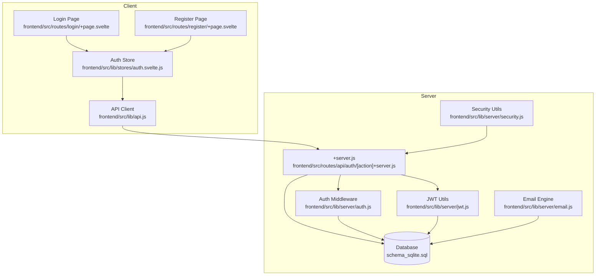
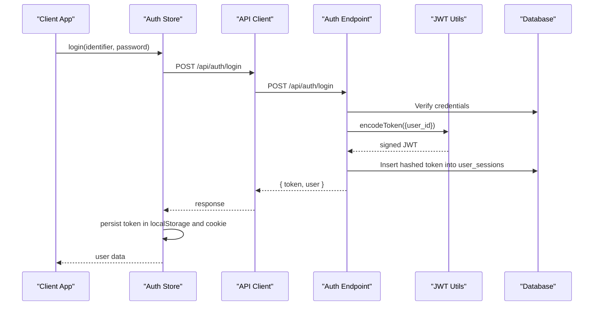
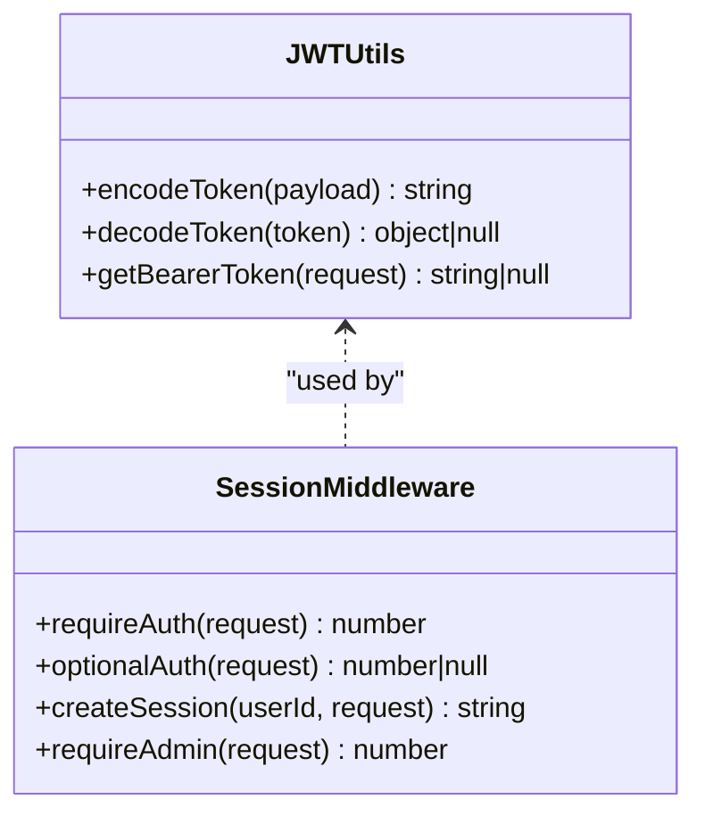
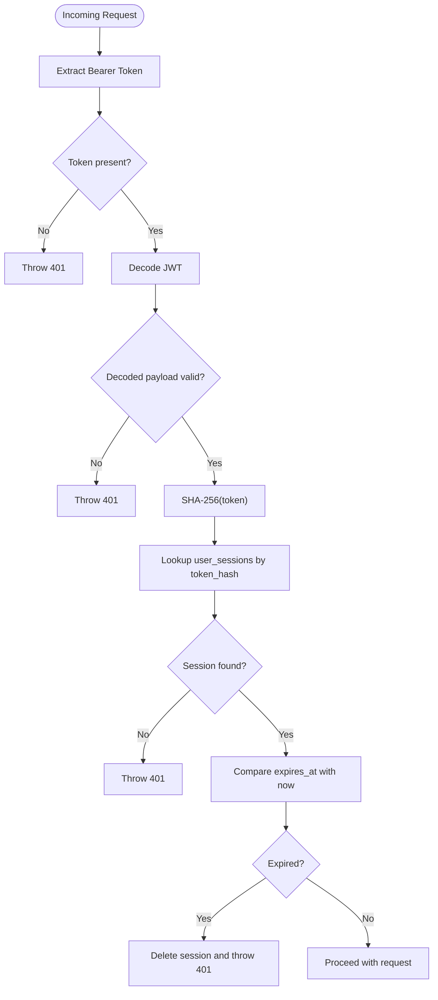
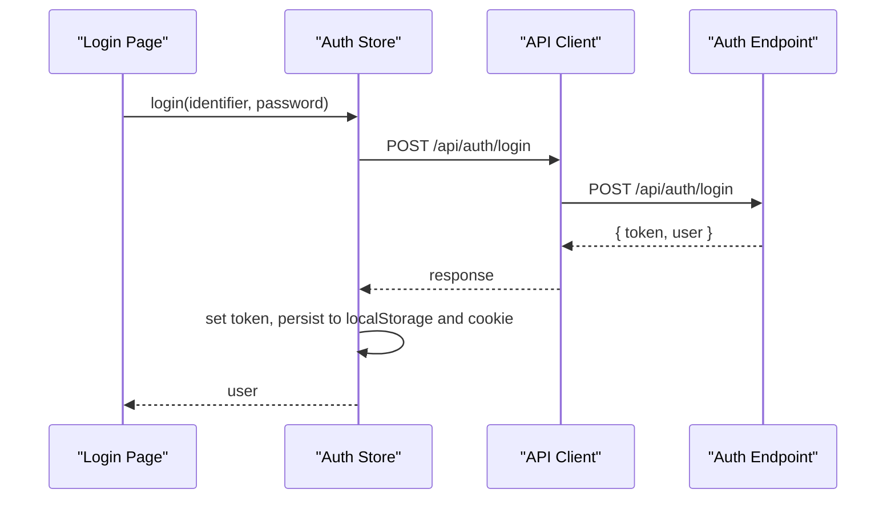
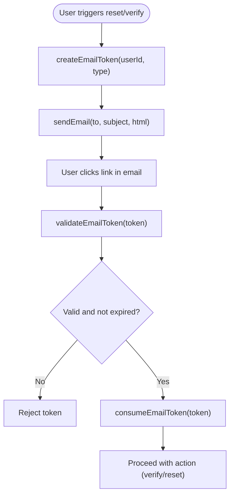
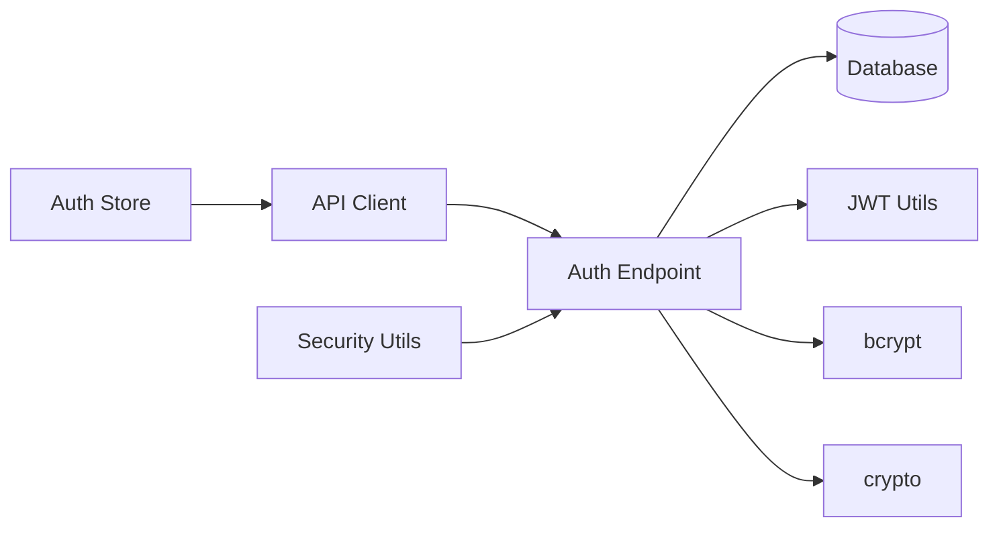

# Authentication API

<cite>
**Referenced Files in This Document**
- [auth.js](file://frontend/src/lib/server/auth.js)
- [jwt.js](file://frontend/src/lib/server/jwt.js)
- [api.js](file://frontend/src/lib/api.js)
- [auth.svelte.js](file://frontend/src/lib/stores/auth.svelte.js)
- [auth +server.js](file://frontend/src/routes/api/auth/[action]+server.js)
- [email.js](file://frontend/src/lib/server/email.js)
- [security.js](file://frontend/src/lib/server/security.js)
- [hooks.server.js](file://frontend/src/hooks.server.js)
- [schema_sqlite.sql](file://schema_sqlite.sql)
- [login +page.svelte](file://frontend/src/routes/login/+page.svelte)
- [register +page.svelte](file://frontend/src/routes/register/+page.svelte)
- [auth.test.js](file://tests/auth.test.js)
</cite>

## Table of Contents
1. [Introduction](#introduction)
2. [Project Structure](#project-structure)
3. [Core Components](#core-components)
4. [Architecture Overview](#architecture-overview)
5. [Detailed Component Analysis](#detailed-component-analysis)
6. [Dependency Analysis](#dependency-analysis)
7. [Performance Considerations](#performance-considerations)
8. [Troubleshooting Guide](#troubleshooting-guide)
9. [Conclusion](#conclusion)

## Introduction
This document provides comprehensive API documentation for VSocial’s authentication system. It covers login, logout, registration, password change, and session management endpoints. It also documents JWT token handling, refresh token mechanisms, multi-factor authentication (MFA) capabilities, and client-side authentication flows. Security considerations such as rate limiting, session expiration, and cookie policies are included, along with best practices for secure token storage.

## Project Structure
The authentication system spans client and server layers:
- Client-side HTTP client and auth store manage tokens and requests.
- Server-side endpoints implement registration, login, logout, and protected routes.
- JWT utilities and session middleware validate tokens and enforce access control.
- Database schema defines user, roles, sessions, and email token tables.
- Email utilities support verification and password reset flows.
- Security utilities provide rate limiting and input validation.

**Diagram sources**
- [api.js:1-350](file://frontend/src/lib/api.js#L1-L350)
- [auth.svelte.js:1-131](file://frontend/src/lib/stores/auth.svelte.js#L1-L131)
- [auth +server.js:1-134](file://frontend/src/routes/api/auth/[action]+server.js#L1-L134)
- [auth.js:1-92](file://frontend/src/lib/server/auth.js#L1-L92)
- [jwt.js:1-45](file://frontend/src/lib/server/jwt.js#L1-L45)
- [email.js:1-101](file://frontend/src/lib/server/email.js#L1-L101)
- [security.js:1-54](file://frontend/src/lib/server/security.js#L1-L54)
- [schema_sqlite.sql:1-702](file://schema_sqlite.sql#L1-L702)

**Section sources**
- [api.js:1-350](file://frontend/src/lib/api.js#L1-L350)
- [auth.svelte.js:1-131](file://frontend/src/lib/stores/auth.svelte.js#L1-L131)
- [auth +server.js:1-134](file://frontend/src/routes/api/auth/[action]+server.js#L1-L134)
- [auth.js:1-92](file://frontend/src/lib/server/auth.js#L1-L92)
- [jwt.js:1-45](file://frontend/src/lib/server/jwt.js#L1-L45)
- [email.js:1-101](file://frontend/src/lib/server/email.js#L1-L101)
- [security.js:1-54](file://frontend/src/lib/server/security.js#L1-L54)
- [schema_sqlite.sql:1-702](file://schema_sqlite.sql#L1-L702)

## Core Components
- API Client: Centralized HTTP client that injects Authorization headers and handles errors.
- Auth Store: Reactive store managing tokens, cookies, and user state.
- Auth Endpoints: Registration, login, logout, and profile retrieval.
- JWT Utilities: Token encoding/decoding and bearer extraction.
- Session Middleware: Validates JWT against hashed token stored in DB.
- Email Engine: Generates and validates tokens for verification/reset flows.
- Security Utilities: Rate limiting and input validation helpers.

**Section sources**
- [api.js:1-350](file://frontend/src/lib/api.js#L1-L350)
- [auth.svelte.js:1-131](file://frontend/src/lib/stores/auth.svelte.js#L1-L131)
- [auth +server.js:1-134](file://frontend/src/routes/api/auth/[action]+server.js#L1-L134)
- [jwt.js:1-45](file://frontend/src/lib/server/jwt.js#L1-L45)
- [auth.js:1-92](file://frontend/src/lib/server/auth.js#L1-L92)
- [email.js:1-101](file://frontend/src/lib/server/email.js#L1-L101)
- [security.js:1-54](file://frontend/src/lib/server/security.js#L1-L54)

## Architecture Overview
The authentication flow integrates client-side token storage with server-side session validation and JWT verification.

**Diagram sources**
- [auth.svelte.js:49-61](file://frontend/src/lib/stores/auth.svelte.js#L49-L61)
- [api.js:20-46](file://frontend/src/lib/api.js#L20-L46)
- [auth +server.js:52-79](file://frontend/src/routes/api/auth/[action]+server.js#L52-L79)
- [jwt.js:19-21](file://frontend/src/lib/server/jwt.js#L19-L21)
- [auth.js:60-74](file://frontend/src/lib/server/auth.js#L60-L74)
- [schema_sqlite.sql:57-68](file://schema_sqlite.sql#L57-L68)

## Detailed Component Analysis

### Authentication Endpoints
- POST /api/auth/register
  - Request body: username, email, password, optional display_name/category.
  - Validation: email format, password length, username pattern, uniqueness.
  - Behavior: Hash password, insert user, assign default role, create session, return token and user.
  - Response: 201 Created with { token, user }.
  - Errors: 400 (validation), 409 (conflict), 500 (server).
- POST /api/auth/login
  - Request body: login (identifier), password.
  - Behavior: Find user by email/username, verify password, update last_seen_at, create session, return token and user.
  - Response: 200 OK with { token, user }.
  - Errors: 400 (missing creds), 401 (invalid creds), 403 (banned), 500 (server).
- POST /api/auth/logout
  - Behavior: Extract Bearer token, hash it, delete matching session from DB.
  - Response: 200 OK with { success: true }.
- GET /api/auth/me
  - Behavior: Require auth, fetch user by ID, return user profile.
  - Response: 200 OK with { user }.
  - Errors: 401 (missing/invalid/expired token), 404 (user not found), 500 (server).
- PUT /api/auth/change-password
  - Request body: currentPassword, newPassword.
  - Behavior: Verify current password, hash new password, update user.
  - Response: 200 OK with { success, message }.
  - Errors: 400 (missing fields), 401 (incorrect current password), 500 (server).

**Section sources**
- [auth +server.js:13-134](file://frontend/src/routes/api/auth/[action]+server.js#L13-L134)
- [auth +server.js:52-79](file://frontend/src/routes/api/auth/[action]+server.js#L52-L79)
- [auth +server.js:93-109](file://frontend/src/routes/api/auth/[action]+server.js#L93-L109)
- [auth +server.js:111-133](file://frontend/src/routes/api/auth/[action]+server.js#L111-L133)

### JWT Token Handling
- Encoding: sign payload with secret and expiry (default 7 days).
- Decoding: verify signature; invalid/expired tokens return null.
- Bearer extraction: parse Authorization header for Bearer token.
- Session creation: encode token, hash it, store in user_sessions with expiry.

**Diagram sources**
- [jwt.js:1-45](file://frontend/src/lib/server/jwt.js#L1-L45)
- [auth.js:1-92](file://frontend/src/lib/server/auth.js#L1-L92)

**Section sources**
- [jwt.js:13-42](file://frontend/src/lib/server/jwt.js#L13-L42)
- [auth.js:15-74](file://frontend/src/lib/server/auth.js#L15-L74)

### Session Management
- Stored in user_sessions with token_hash, IP, User-Agent, and expires_at.
- requireAuth verifies presence of token, decodes it, matches hashed token, checks expiry, deletes expired sessions.
- createSession generates token, hashes it, persists session with 7-day expiry.

**Diagram sources**
- [auth.js:15-44](file://frontend/src/lib/server/auth.js#L15-L44)
- [schema_sqlite.sql:57-68](file://schema_sqlite.sql#L57-L68)

**Section sources**
- [auth.js:15-74](file://frontend/src/lib/server/auth.js#L15-L74)
- [schema_sqlite.sql:57-68](file://schema_sqlite.sql#L57-L68)

### Client-Side Authentication Flow
- API Client: Adds Authorization: Bearer header when token exists; parses JSON and throws on non-OK responses.
- Auth Store: Initializes from localStorage and cookie, persists tokens, exposes reactive getters, and refreshes user data.
- Pages: Login and Register pages orchestrate form submission and navigation.

**Diagram sources**
- [login +page.svelte:42-57](file://frontend/src/routes/login/+page.svelte#L42-L57)
- [auth.svelte.js:49-61](file://frontend/src/lib/stores/auth.svelte.js#L49-L61)
- [api.js:20-46](file://frontend/src/lib/api.js#L20-L46)
- [auth +server.js:52-79](file://frontend/src/routes/api/auth/[action]+server.js#L52-L79)

**Section sources**
- [api.js:20-46](file://frontend/src/lib/api.js#L20-L46)
- [auth.svelte.js:22-88](file://frontend/src/lib/stores/auth.svelte.js#L22-L88)
- [login +page.svelte:42-57](file://frontend/src/routes/login/+page.svelte#L42-L57)
- [register +page.svelte:93-116](file://frontend/src/routes/register/+page.svelte#L93-L116)

### Password Reset and Email Tokens
- Email engine supports generating and validating short-lived tokens for verification/reset links.
- Templates render HTML emails with links pointing to verification/reset pages.
- Token lifecycle: create, validate (expiry check), consume (mark used).

**Diagram sources**
- [email.js:32-58](file://frontend/src/lib/server/email.js#L32-L58)
- [email.js:68-86](file://frontend/src/lib/server/email.js#L68-L86)

**Section sources**
- [email.js:28-58](file://frontend/src/lib/server/email.js#L28-L58)
- [email.js:68-86](file://frontend/src/lib/server/email.js#L68-L86)

### Multi-Factor Authentication (MFA)
- Current implementation supports JWT-based single-factor authentication.
- MFA capabilities (TOTP/WebAuthn) are documented as future enhancements.

**Section sources**
- [Personality & SOUL.md:179-183](file://Personality & SOUL.md#L179-L183)

## Dependency Analysis
- Auth Endpoint depends on:
  - Database for user/session queries.
  - JWT utilities for token signing/verification.
  - Bcrypt for password comparison.
  - Crypto for hashing tokens.
- Auth Store depends on:
  - API client for HTTP calls.
  - LocalStorage and Cookie APIs for persistence.
- Security utilities are used by endpoints for rate limiting and input validation.

**Diagram sources**
- [auth +server.js:1-134](file://frontend/src/routes/api/auth/[action]+server.js#L1-L134)
- [jwt.js:1-45](file://frontend/src/lib/server/jwt.js#L1-L45)
- [auth.svelte.js:1-131](file://frontend/src/lib/stores/auth.svelte.js#L1-L131)
- [api.js:1-350](file://frontend/src/lib/api.js#L1-L350)
- [security.js:1-54](file://frontend/src/lib/server/security.js#L1-L54)

**Section sources**
- [auth +server.js:1-134](file://frontend/src/routes/api/auth/[action]+server.js#L1-L134)
- [auth.svelte.js:1-131](file://frontend/src/lib/stores/auth.svelte.js#L1-L131)
- [api.js:1-350](file://frontend/src/lib/api.js#L1-L350)
- [security.js:1-54](file://frontend/src/lib/server/security.js#L1-L54)

## Performance Considerations
- Token hashing and DB lookups occur on each protected request; ensure indexing on token_hash and user_id.
- Consider rotating long-lived tokens and implementing refresh token rotation for enhanced security.
- Use connection pooling and prepared statements to minimize DB overhead.

[No sources needed since this section provides general guidance]

## Troubleshooting Guide
Common errors and resolutions:
- 400 Bad Request: Validate input fields (email format, password length, username pattern).
- 401 Unauthorized: Ensure Authorization header is present and valid; verify token not expired; confirm session exists in DB.
- 403 Forbidden: Account is banned.
- 404 Not Found: Resource (e.g., user) not found.
- 429 Too Many Requests: Implement client-side retry with exponential backoff; adjust rate limits server-side.
- 5xx Internal Server Error: Inspect server logs and database connectivity.

Operational checks:
- Confirm JWT_SECRET and JWT_EXPIRES_IN environment variables are set.
- Verify database initialization and migrations are applied.
- Ensure CORS and security headers are configured appropriately.

**Section sources**
- [auth +server.js:25-28](file://frontend/src/routes/api/auth/[action]+server.js#L25-L28)
- [auth +server.js:66-70](file://frontend/src/routes/api/auth/[action]+server.js#L66-L70)
- [auth.js:15-44](file://frontend/src/lib/server/auth.js#L15-L44)
- [security.js:12-33](file://frontend/src/lib/server/security.js#L12-L33)
- [hooks.server.js:154-178](file://frontend/src/hooks.server.js#L154-L178)

## Security Considerations
- CSRF Protection: Not implemented in current codebase; recommended to add CSRF tokens for state-changing forms and consider SameSite cookies.
- Rate Limiting: Implemented via in-memory rate limiter; consider moving to Redis for distributed environments.
- Session Expiration: Sessions expire after 7 days; expired sessions are cleaned up on demand.
- Token Storage: Client stores tokens in localStorage and sets a cookie; ensure HTTPS enforcement and secure cookie flags.
- Input Validation: Sanitization and validation helpers available; apply consistently across endpoints.
- Email Tokens: Short expiry (15 minutes) and one-time use reduce risk.

Best Practices:
- Enforce HTTPS in production.
- Rotate secrets regularly.
- Use httpOnly cookies for sensitive tokens.
- Implement MFA (TOTP/WebAuthn) as documented for future enhancements.

**Section sources**
- [security.js:1-54](file://frontend/src/lib/server/security.js#L1-L54)
- [auth.svelte.js:28-46](file://frontend/src/lib/stores/auth.svelte.js#L28-L46)
- [hooks.server.js:109-116](file://frontend/src/hooks.server.js#L109-L116)
- [Personality & SOUL.md:179-189](file://Personality & SOUL.md#L179-L189)

## Conclusion
VSocial’s authentication system provides a robust foundation with JWT-based sessions, server-side validation, and client-side token management. The documented endpoints, schemas, and flows enable secure and scalable user authentication. Future enhancements should focus on CSRF protection, distributed rate limiting, and MFA support to further strengthen security.