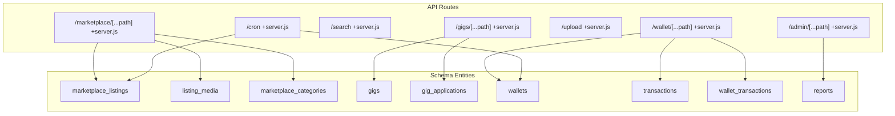
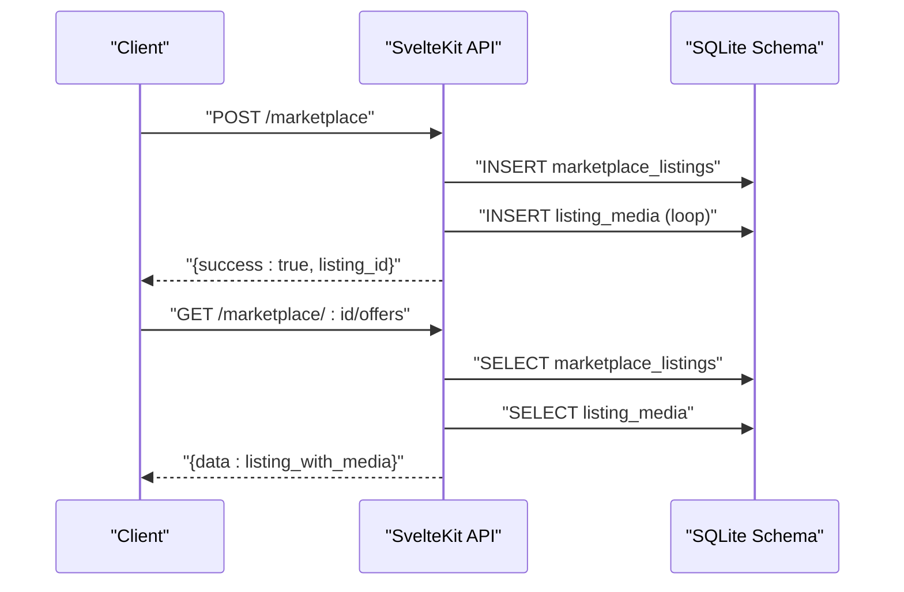
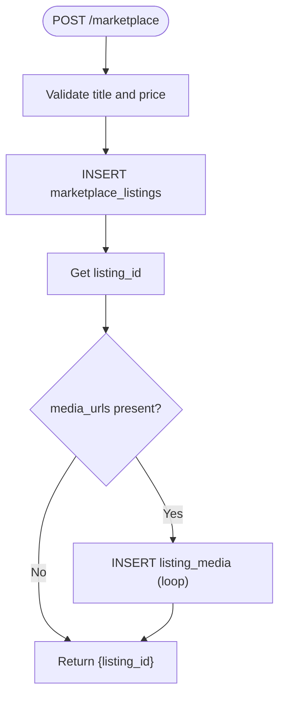
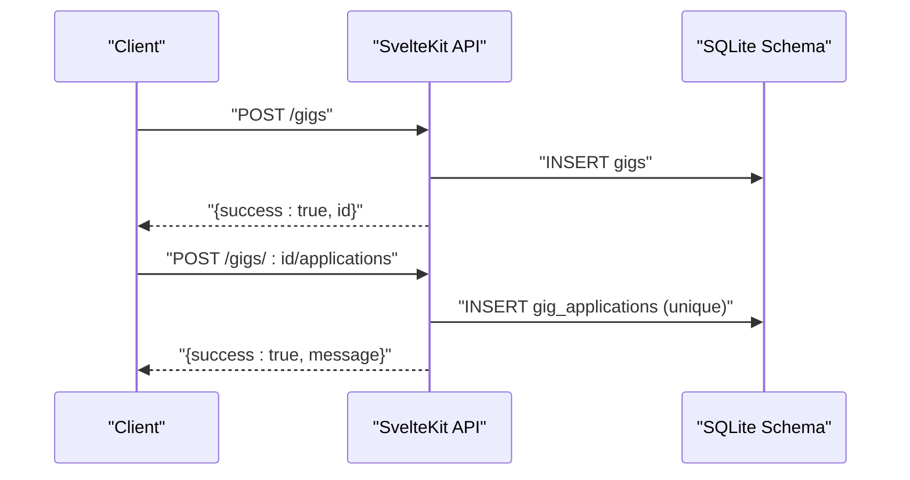
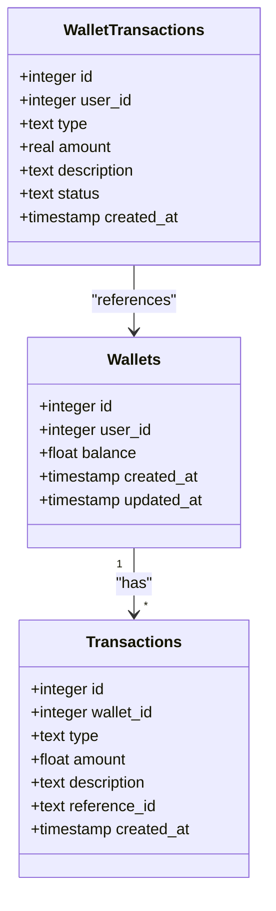
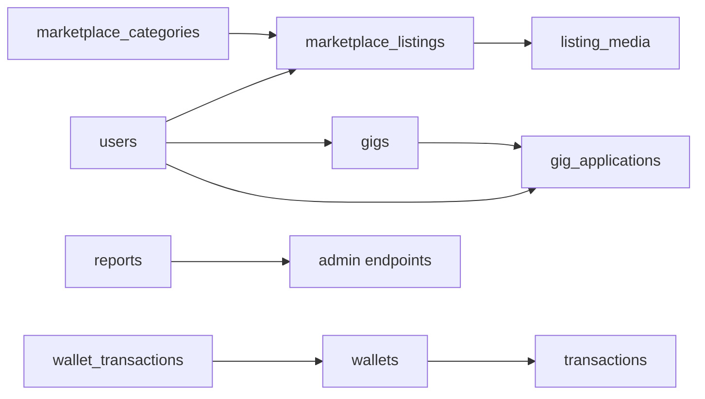

# Marketplace & Gigs API

<cite>
**Referenced Files in This Document**
- [schema_sqlite.sql](file://schema_sqlite.sql)
- [marketplace +server.js](file://frontend/src/routes/api/marketplace/[...path]+server.js)
- [gigs +server.js](file://frontend/src/routes/api/gigs/[...path]+server.js)
- [search +server.js](file://frontend/src/routes/api/search/+server.js)
- [wallet +server.js](file://frontend/src/routes/api/wallet/[...path]+server.js)
- [upload +server.js](file://frontend/src/routes/api/upload/+server.js)
- [admin +server.js](file://frontend/src/routes/api/admin/[...path]+server.js)
- [cron +server.js](file://frontend/src/routes/api/cron/+server.js)
- [api.js](file://frontend/src/lib/api.js)
</cite>

## Table of Contents
1. [Introduction](#introduction)
2. [Project Structure](#project-structure)
3. [Core Components](#core-components)
4. [Architecture Overview](#architecture-overview)
5. [Detailed Component Analysis](#detailed-component-analysis)
6. [Dependency Analysis](#dependency-analysis)
7. [Performance Considerations](#performance-considerations)
8. [Troubleshooting Guide](#troubleshooting-guide)
9. [Conclusion](#conclusion)
10. [Appendices](#appendices)

## Introduction
This document provides comprehensive API documentation for VSocial’s e-commerce and freelance marketplace. It covers:
- Product listing creation, search, and offers workflows
- Gig posting, applications, and status management
- Wallet operations and transaction processing
- Media upload for listings
- Order/offers and review submission endpoints
- Dispute/reporting integration points
- Tax, currency, and international payment considerations

The backend is SvelteKit-based with a SQLite-compatible schema supporting marketplace listings, gigs, wallet transactions, and moderation/reporting.

## Project Structure
The marketplace and gigs functionality is exposed via SvelteKit server routes under frontend/src/routes/api. The database schema defines core entities and relationships.

**Diagram sources**
- [marketplace +server.js:34-126](file://frontend/src/routes/api/marketplace/[...path]+server.js#L34-L126)
- [gigs +server.js](file://frontend/src/routes/api/gigs/[...path]+server.js)
- [search +server.js:1-61](file://frontend/src/routes/api/search/+server.js#L1-L61)
- [wallet +server.js](file://frontend/src/routes/api/wallet/[...path]+server.js)
- [upload +server.js](file://frontend/src/routes/api/upload/+server.js)
- [admin +server.js:1-260](file://frontend/src/routes/api/admin/[...path]+server.js#L1-L260)
- [cron +server.js:1-32](file://frontend/src/routes/api/cron/+server.js#L1-L32)
- [schema_sqlite.sql:314-402](file://schema_sqlite.sql#L314-L402)

**Section sources**
- [schema_sqlite.sql:306-402](file://schema_sqlite.sql#L306-L402)
- [marketplace +server.js:34-126](file://frontend/src/routes/api/marketplace/[...path]+server.js#L34-L126)
- [gigs +server.js](file://frontend/src/routes/api/gigs/[...path]+server.js)
- [search +server.js:1-61](file://frontend/src/routes/api/search/+server.js#L1-L61)
- [wallet +server.js](file://frontend/src/routes/api/wallet/[...path]+server.js)
- [upload +server.js](file://frontend/src/routes/api/upload/+server.js)
- [admin +server.js:1-260](file://frontend/src/routes/api/admin/[...path]+server.js#L1-L260)
- [cron +server.js:1-32](file://frontend/src/routes/api/cron/+server.js#L1-L32)

## Core Components
- Marketplace Listings: CRUD for listings, media association, search, and offers
- Gigs: Posting, application management, and status lifecycle
- Wallet: User wallets, transactions, and wallet transactions
- Search: Unified search across users, posts, gigs, and hashtags
- Upload: Media upload route for listing images
- Admin: Reporting, moderation, and system settings
- Cron: Scheduled cleanup tasks

**Section sources**
- [schema_sqlite.sql:314-402](file://schema_sqlite.sql#L314-L402)
- [marketplace +server.js:34-126](file://frontend/src/routes/api/marketplace/[...path]+server.js#L34-L126)
- [gigs +server.js](file://frontend/src/routes/api/gigs/[...path]+server.js)
- [search +server.js:1-61](file://frontend/src/routes/api/search/+server.js#L1-L61)
- [wallet +server.js](file://frontend/src/routes/api/wallet/[...path]+server.js)
- [upload +server.js](file://frontend/src/routes/api/upload/+server.js)
- [admin +server.js:1-260](file://frontend/src/routes/api/admin/[...path]+server.js#L1-L260)
- [cron +server.js:1-32](file://frontend/src/routes/api/cron/+server.js#L1-L32)

## Architecture Overview
The API follows a REST-like pattern with SvelteKit handlers. Authentication is enforced per endpoint. Data persistence uses SQLite-compatible tables defined in the schema.

**Diagram sources**
- [marketplace +server.js:72-114](file://frontend/src/routes/api/marketplace/[...path]+server.js#L72-L114)
- [schema_sqlite.sql:314-338](file://schema_sqlite.sql#L314-L338)

## Detailed Component Analysis

### Marketplace API
Endpoints for listing creation, retrieval, search, offers, and deletion.

- Base: /marketplace
- Methods:
  - GET /marketplace
    - Returns paginated active listings with associated media thumbnails
    - Query params: page, limit
  - GET /marketplace/:id
    - Returns a single listing with media URLs
  - POST /marketplace
    - Requires authenticated user
    - Body: title, description, price, category_id, condition, media_urls[]
    - Inserts listing and media records
  - POST /marketplace/:id/offers
    - Sends an offer to the listing owner; triggers a notification
  - POST /marketplace/:id/reviews
    - Placeholder for reviews
  - DELETE /marketplace/:id
    - Deletes a listing owned by the authenticated user

**Diagram sources**
- [marketplace +server.js:72-96](file://frontend/src/routes/api/marketplace/[...path]+server.js#L72-L96)

**Section sources**
- [marketplace +server.js:34-126](file://frontend/src/routes/api/marketplace/[...path]+server.js#L34-L126)
- [schema_sqlite.sql:314-338](file://schema_sqlite.sql#L314-L338)

### Gigs API
Endpoints for posting gigs, managing applications, and status.

- Base: /gigs
- Methods:
  - GET /gigs
    - Lists open gigs with pagination and tags normalization
  - GET /gigs/:id
    - Retrieves a gig with seller info
  - POST /gigs
    - Creates a new gig with title, description, category, type, price range, tags, currency, expiry
  - POST /gigs/:id/applications
    - Applies to a gig with a message; ensures uniqueness per user-gig
  - PUT /gigs/:id/status
    - Updates gig status (open/close/expired)
  - PUT /gigs/:id/applications/:applicationId/status
    - Updates application status (pending/accepted/rejected)
  - DELETE /gigs/:id
    - Removes a gig owned by the user

**Diagram sources**
- [gigs +server.js](file://frontend/src/routes/api/gigs/[...path]+server.js)
- [schema_sqlite.sql:377-402](file://schema_sqlite.sql#L377-L402)

**Section sources**
- [gigs +server.js](file://frontend/src/routes/api/gigs/[...path]+server.js)
- [schema_sqlite.sql:377-402](file://schema_sqlite.sql#L377-L402)

### Search API
Unified search across users, posts, gigs, and hashtags with pagination and trending fallback.

- Endpoint: GET /search
- Query params: q (required for search), type (all|users|posts|gigs|hashtags), page, limit
- Behavior:
  - Empty query returns trending users, top hashtags, and popular posts
  - Otherwise filters by type with appropriate SQL queries
  - Gigs tags normalized to arrays

**Section sources**
- [search +server.js:1-61](file://frontend/src/routes/api/search/+server.js#L1-L61)
- [schema_sqlite.sql:377-392](file://schema_sqlite.sql#L377-L392)

### Wallet & Transactions API
Wallet and transaction endpoints for credits and accounting.

- Base: /wallet
- Methods:
  - GET /wallet
    - Returns user wallet summary and transaction history
  - POST /wallet/deposit
    - Adds funds to wallet (payment processor integration placeholder)
  - POST /wallet/withdraw
    - Requests withdrawal (approval/payout pending)
  - POST /wallet/transfer
    - Transfers between users (requires authorization)
  - GET /wallet/transactions
    - Paginated transaction log

**Diagram sources**
- [schema_sqlite.sql:355-371](file://schema_sqlite.sql#L355-L371)

**Section sources**
- [wallet +server.js](file://frontend/src/routes/api/wallet/[...path]+server.js)
- [schema_sqlite.sql:355-371](file://schema_sqlite.sql#L355-L371)

### Media Upload API
Upload endpoint for listing media and other content.

- Endpoint: POST /upload
- Purpose: Accepts uploaded files and returns media URLs for use in listing creation

**Section sources**
- [upload +server.js](file://frontend/src/routes/api/upload/+server.js)

### Admin API
Moderation and system administration endpoints.

- Base: /admin
- Capabilities:
  - Dashboard stats (users, posts, stories, reports, listings, gigs)
  - User management (ban/unban, roles)
  - Reports (resolve/dismiss, delete content)
  - Content moderation (trash restore, delete posts/reels)
  - Settings management (toggle keys)
  - Logs and activity feeds

**Section sources**
- [admin +server.js:1-260](file://frontend/src/routes/api/admin/[...path]+server.js#L1-L260)
- [schema_sqlite.sql:445-453](file://schema_sqlite.sql#L445-L453)

### Cron Jobs
Scheduled maintenance tasks.

- Endpoint: GET /cron?token=...
- Tasks:
  - Cleanup expired stories
  - Cleanup expired sessions
- Requires environment-provided secret token

**Section sources**
- [cron +server.js:1-32](file://frontend/src/routes/api/cron/+server.js#L1-L32)

## Dependency Analysis
- Listing creation depends on category existence and media uploads
- Offers depend on listing ownership and notification delivery
- Gigs rely on applications uniqueness and status transitions
- Wallet operations depend on user identity and transaction logging
- Admin actions depend on strict authorization checks

**Diagram sources**
- [schema_sqlite.sql:314-402](file://schema_sqlite.sql#L314-L402)
- [admin +server.js:1-260](file://frontend/src/routes/api/admin/[...path]+server.js#L1-L260)

**Section sources**
- [schema_sqlite.sql:314-402](file://schema_sqlite.sql#L314-L402)
- [admin +server.js:1-260](file://frontend/src/routes/api/admin/[...path]+server.js#L1-L260)

## Performance Considerations
- Pagination limits: marketplace and search enforce max page sizes to prevent heavy queries
- Indexes: listing and user queries leverage indexes on created timestamps and foreign keys
- Trending fallback: empty search returns curated data to reduce load
- Media batching: listing media insertion uses loops; consider batch inserts for large sets

[No sources needed since this section provides general guidance]

## Troubleshooting Guide
- Unauthorized access: Many endpoints require authentication; ensure tokens are included
- Validation errors: Creating listings requires title and positive price
- Offer errors: Offers must specify a valid positive amount; seller notifications are triggered
- Application conflicts: Duplicate applications are prevented by unique constraint
- Cron access: Token mismatch returns 401; verify environment variable

**Section sources**
- [marketplace +server.js:72-114](file://frontend/src/routes/api/marketplace/[...path]+server.js#L72-L114)
- [gigs +server.js](file://frontend/src/routes/api/gigs/[...path]+server.js)
- [cron +server.js:1-32](file://frontend/src/routes/api/cron/+server.js#L1-L32)

## Conclusion
VSocial’s marketplace and gigs APIs provide a solid foundation for e-commerce listings and freelance services. The schema supports listing/media, gig/application workflows, and wallet accounting. Extending payment processing, tax calculation, and internationalization would integrate cleanly with existing endpoints and database models.

[No sources needed since this section summarizes without analyzing specific files]

## Appendices

### API Reference Summary

- Marketplace
  - GET /marketplace?page=&limit=
  - GET /marketplace/:id
  - POST /marketplace
  - POST /marketplace/:id/offers
  - POST /marketplace/:id/reviews
  - DELETE /marketplace/:id

- Gigs
  - GET /gigs
  - GET /gigs/:id
  - POST /gigs
  - POST /gigs/:id/applications
  - PUT /gigs/:id/status
  - PUT /gigs/:id/applications/:applicationId/status
  - DELETE /gigs/:id

- Search
  - GET /search?q=&type=all&limit=&page=

- Wallet
  - GET /wallet
  - POST /wallet/deposit
  - POST /wallet/withdraw
  - POST /wallet/transfer
  - GET /wallet/transactions

- Upload
  - POST /upload

- Admin
  - GET /admin/dashboard
  - GET /admin/users?q=&page=&limit=
  - POST /admin/users/:id/ban
  - POST /admin/users/:id/unban
  - GET /admin/reports?status=
  - POST /admin/reports/:id
  - GET /admin/content?type=
  - POST /admin/content/trash/:id
  - GET /admin/settings
  - POST /admin/settings/toggle
  - GET /admin/logs
  - GET /admin/activity?limit=

- Cron
  - GET /cron?token=

**Section sources**
- [marketplace +server.js:34-126](file://frontend/src/routes/api/marketplace/[...path]+server.js#L34-L126)
- [gigs +server.js](file://frontend/src/routes/api/gigs/[...path]+server.js)
- [search +server.js:1-61](file://frontend/src/routes/api/search/+server.js#L1-L61)
- [wallet +server.js](file://frontend/src/routes/api/wallet/[...path]+server.js)
- [upload +server.js](file://frontend/src/routes/api/upload/+server.js)
- [admin +server.js:1-260](file://frontend/src/routes/api/admin/[...path]+server.js#L1-L260)
- [cron +server.js:1-32](file://frontend/src/routes/api/cron/+server.js#L1-L32)