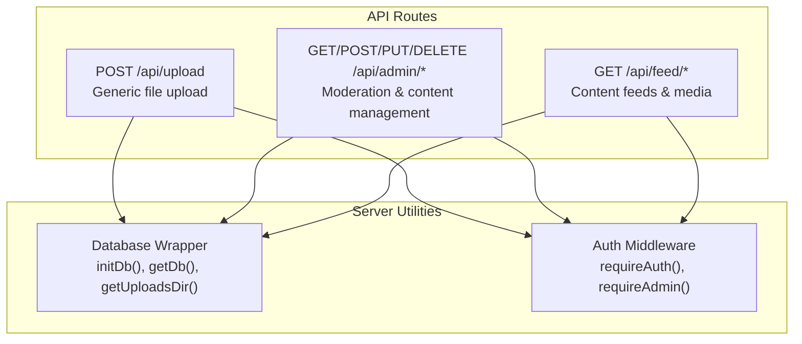
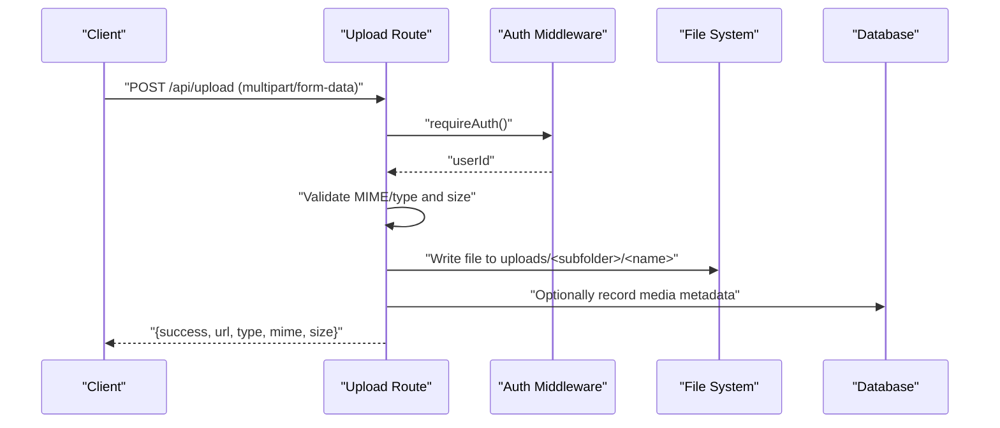
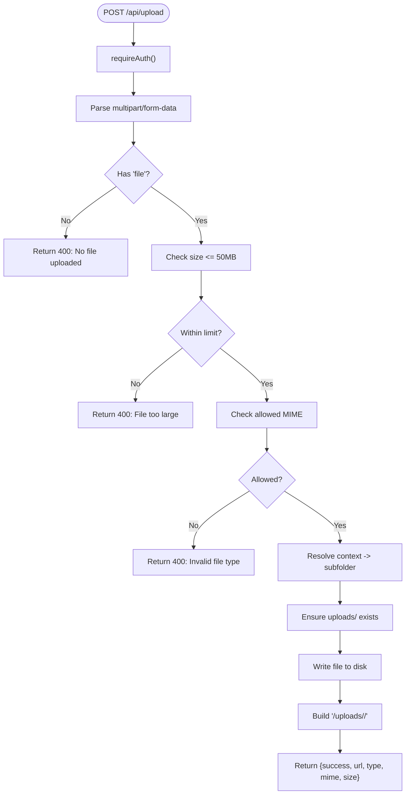
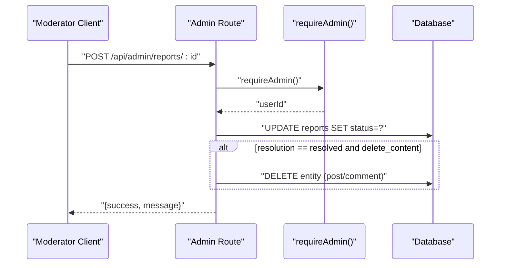
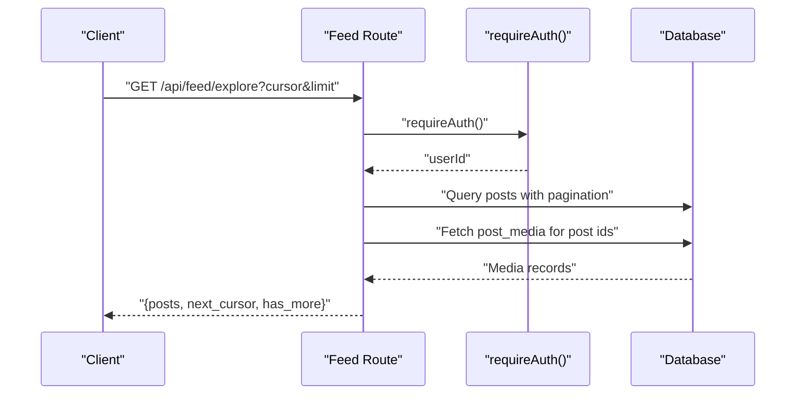
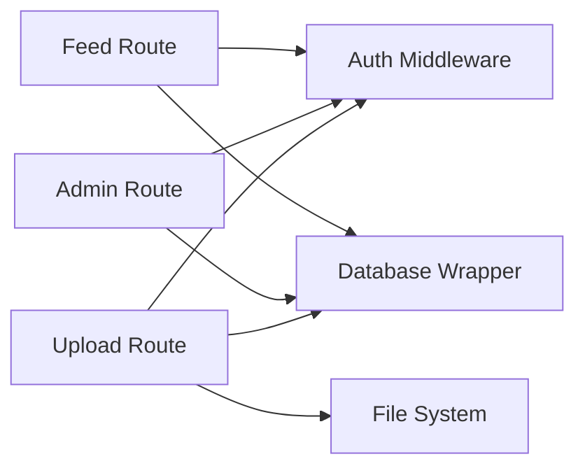

# Media & Content API

<cite>
**Referenced Files in This Document**
- [upload/+server.js](file://frontend/src/routes/api/upload/+server.js)
- [admin/[...path]/+server.js](file://frontend/src/routes/api/admin/[...path]/+server.js)
- [feed/[...path]/+server.js](file://frontend/src/routes/api/feed/[...path]/+server.js)
- [db.js](file://frontend/src/lib/server/db.js)
- [auth.js](file://frontend/src/lib/server/auth.js)
</cite>

## Table of Contents
1. [Introduction](#introduction)
2. [Project Structure](#project-structure)
3. [Core Components](#core-components)
4. [Architecture Overview](#architecture-overview)
5. [Detailed Component Analysis](#detailed-component-analysis)
6. [Dependency Analysis](#dependency-analysis)
7. [Performance Considerations](#performance-considerations)
8. [Troubleshooting Guide](#troubleshooting-guide)
9. [Conclusion](#conclusion)

## Introduction
This document provides comprehensive API documentation for VSocial’s media handling and content management endpoints. It focuses on:
- File upload mechanisms via multipart/form-data
- Media storage and URL generation
- Content moderation workflows (admin endpoints)
- Story and Reel content ingestion patterns
- Media processing pipeline considerations (image optimization, video compression)
- CDN integration patterns
- Content expiration policies, storage management, and cleanup procedures
- Copyright protection, watermarking, and content ownership verification

Where applicable, the document references actual server-side endpoints and utilities to ensure accuracy.

## Project Structure
The media and content APIs are implemented as SvelteKit server routes under the frontend API namespace. Key areas:
- Upload API: generic file upload handler supporting images, audio, and videos
- Admin API: moderation, content management, and system settings
- Feed API: content discovery and media metadata retrieval
- Shared utilities: database abstraction and authentication middleware

**Diagram sources**
- [upload/+server.js:17-43](file://frontend/src/routes/api/upload/+server.js#L17-L43)
- [admin/[...path]/+server.js](file://frontend/src/routes/api/admin/[...path]/+server.js#L8-L127)
- [feed/[...path]/+server.js](file://frontend/src/routes/api/feed/[...path]/+server.js#L47-L217)
- [db.js:117-172](file://frontend/src/lib/server/db.js#L117-L172)
- [auth.js:15-44](file://frontend/src/lib/server/auth.js#L15-L44)

**Section sources**
- [upload/+server.js:1-44](file://frontend/src/routes/api/upload/+server.js#L1-L44)
- [admin/[...path]/+server.js](file://frontend/src/routes/api/admin/[...path]/+server.js#L1-L260)
- [feed/[...path]/+server.js](file://frontend/src/routes/api/feed/[...path]/+server.js#L1-L239)
- [db.js:1-209](file://frontend/src/lib/server/db.js#L1-L209)
- [auth.js:1-92](file://frontend/src/lib/server/auth.js#L1-L92)

## Core Components
- Upload API
  - Endpoint: POST /api/upload
  - Purpose: Accepts multipart/form-data with a file field and optional context; validates MIME type and size; writes to disk; returns URL and metadata
  - Supported contexts: avatar, cover, chat, listing, post; defaults to chat
  - Storage: uploads/<subfolder> where subfolder equals context + 's'
  - Response includes success flag, URL, type (image/audio), MIME, and size
- Admin API
  - Dashboard stats, user management, reports, content listings, settings, logs, and activity
  - Moderation actions: ban/unban users, resolve/dismiss reports, toggle settings, trash/delete content
  - Requires admin privileges
- Feed API
  - Home feed, explore feed, suggested users, and feed preferences
  - Retrieves post media metadata and parses optional embedded metadata blocks
- Database and Auth Utilities
  - Unified database wrapper supporting two drivers with consistent async API
  - Authentication middleware enforcing bearer tokens and session validation
  - Admin enforcement with role checks

**Section sources**
- [upload/+server.js:17-43](file://frontend/src/routes/api/upload/+server.js#L17-L43)
- [admin/[...path]/+server.js](file://frontend/src/routes/api/admin/[...path]/+server.js#L8-L127)
- [feed/[...path]/+server.js](file://frontend/src/routes/api/feed/[...path]/+server.js#L47-L217)
- [db.js:117-172](file://frontend/src/lib/server/db.js#L117-L172)
- [auth.js:15-44](file://frontend/src/lib/server/auth.js#L15-L44)

## Architecture Overview
The media and content APIs follow a layered pattern:
- Route handlers enforce authentication and admin roles
- Database wrapper abstracts SQLite/LibSQL operations
- File system storage persists uploads under uploads/<context>s
- Feed API queries posts and associated media metadata

**Diagram sources**
- [upload/+server.js:17-43](file://frontend/src/routes/api/upload/+server.js#L17-L43)
- [auth.js:15-44](file://frontend/src/lib/server/auth.js#L15-L44)
- [db.js:202-206](file://frontend/src/lib/server/db.js#L202-L206)

## Detailed Component Analysis

### Upload API
- Endpoint: POST /api/upload
- Request
  - Headers: Authorization: Bearer <token>
  - Body: multipart/form-data with fields:
    - file: binary stream (required)
    - context: one of avatar, cover, chat, listing, post (optional; defaults to chat)
- Validation
  - Size limit: 50 MB
  - MIME whitelist: image/jpeg, image/png, image/webp, image/gif, audio/webm, audio/mp4, audio/mpeg, audio/ogg, video/mp4, video/webm
- Storage
  - Directory: uploads/<subfolder> where subfolder = context + 's'
  - Filename: {userId}_{timestamp}_{random}.{ext}
- Response
  - url: "/uploads/<subfolder>/<name>"
  - type: "image" for image/*, otherwise "audio"
  - mime: original MIME type
  - size: file size in bytes

**Diagram sources**
- [upload/+server.js:17-43](file://frontend/src/routes/api/upload/+server.js#L17-L43)
- [db.js:202-206](file://frontend/src/lib/server/db.js#L202-L206)
- [auth.js:15-44](file://frontend/src/lib/server/auth.js#L15-L44)

**Section sources**
- [upload/+server.js:17-43](file://frontend/src/routes/api/upload/+server.js#L17-L43)

### Admin API (Moderation & Content Management)
- Authentication: requireAdmin(request)
- Endpoints
  - GET /api/admin/dashboard
    - Returns counts for users, posts, reels, stories, reports, marketplace listings, gigs, signups
  - GET /api/admin/users?q=&page=&limit=
    - Paginated user listing with optional search
  - GET /api/admin/reports?status=
    - Pending or resolved reports with previews
  - GET /api/admin/content?type=posts|reels|trash
    - Recent posts, reels, or trashed posts
  - GET /api/admin/settings
    - System settings key/value pairs
  - GET /api/admin/logs
    - Recent transactions
  - GET /api/admin/activity?limit=
    - Recent notifications
  - POST /api/admin/users/ban
    - Ban a user; invalidates sessions; sends notification
  - POST /api/admin/users/unban
    - Unban a user
  - POST /api/admin/reports/:id
    - Resolve or dismiss a report; optionally delete content
  - POST /api/admin/settings/toggle
    - Toggle a setting key
  - PUT /api/admin/settings
    - Bulk update settings
  - PUT /api/admin/users/:id
    - Update user fields (role, is_verified)
  - DELETE /api/admin/reports/:id
    - Remove a report
  - DELETE /api/admin/content/post/:id
    - Trash a post (soft delete)
  - DELETE /api/admin/content/reel/:id
    - Hard delete a reel
  - DELETE /api/admin/content/trash/:id
    - Permanently delete a trashed post
  - DELETE /api/admin/users/:id
    - Delete a user account

**Diagram sources**
- [admin/[...path]/+server.js](file://frontend/src/routes/api/admin/[...path]/+server.js#L129-L186)
- [auth.js:79-89](file://frontend/src/lib/server/auth.js#L79-L89)

**Section sources**
- [admin/[...path]/+server.js](file://frontend/src/routes/api/admin/[...path]/+server.js#L8-L259)
- [auth.js:79-89](file://frontend/src/lib/server/auth.js#L79-L89)

### Feed API (Content Retrieval & Media Metadata)
- Authentication: requireAuth(request)
- Endpoints
  - GET /api/feed/preferences
    - Retrieve user feed algorithm and weights
  - GET /api/feed/explore
    - Public explore feed with pagination via cursor and limit
  - GET /api/feed/suggested-users
    - Suggested users for following
  - PUT /api/feed/preferences
    - Update feed algorithm and weights
- Media Retrieval
  - Post media metadata is fetched per post and attached to the response
  - Optional embedded metadata block parsing supports polls and location

**Diagram sources**
- [feed/[...path]/+server.js](file://frontend/src/routes/api/feed/[...path]/+server.js#L75-L107)
- [feed/[...path]/+server.js](file://frontend/src/routes/api/feed/[...path]/+server.js#L35-L45)
- [auth.js:15-44](file://frontend/src/lib/server/auth.js#L15-L44)

**Section sources**
- [feed/[...path]/+server.js](file://frontend/src/routes/api/feed/[...path]/+server.js#L47-L217)

### Media Processing Pipeline (Guidelines)
Note: The current repository implements basic upload and moderation. The following describes recommended pipeline steps for production-grade media processing.

- Image Optimization
  - Resize and compress images during upload or via background jobs
  - Generate multiple variants (thumbnail, preview, full) and store references
- Video Compression and Transcoding
  - Normalize codecs and resolutions; generate thumbnails and HLS/DASH manifests
  - Track job progress and update media records upon completion
- Progress Tracking
  - For large files, implement chunked uploads with resume capability and progress callbacks
  - Store upload sessions with offsets and checksums
- CDN Integration
  - Serve uploads via CDN domain; enable signed URLs for private assets
  - Invalidate cache on deletion or moderation decisions

[No sources needed since this section provides general guidance]

### Content Expiration, Storage, and Cleanup
- Stories
  - The dashboard endpoint queries stories with an expiration filter, indicating a time-based lifecycle
- Posts and Reels
  - Soft-delete mechanism for posts (trashed posts); hard-delete for reels
  - Scheduled cleanup jobs can remove expired or trashed content after retention windows
- Storage Management
  - Maintain separate directories per context; periodically prune orphaned files not linked to DB records
  - Enforce quotas per user to prevent abuse

**Section sources**
- [admin/[...path]/+server.js](file://frontend/src/routes/api/admin/[...path]/+server.js#L18-L94)

### Copyright Protection, Watermarking, and Ownership Verification
- Ownership Verification
  - All endpoints requiring authentication validate bearer tokens and active sessions
  - Admin actions require elevated roles
- Watermarking
  - Optional post-processing step to add watermarks to images/videos during transcoding
- Reporting and Takedown
  - Users can report content; admins can resolve reports and delete offending content
  - Consider integrating with external takedown systems and digital signatures for provenance

**Section sources**
- [auth.js:15-44](file://frontend/src/lib/server/auth.js#L15-L44)
- [admin/[...path]/+server.js](file://frontend/src/routes/api/admin/[...path]/+server.js#L156-L166)

## Dependency Analysis
- Route handlers depend on:
  - Authentication middleware for bearer token validation and admin checks
  - Database wrapper for SQL operations
  - File system utilities for upload directories
- Coupling and Cohesion
  - Upload route encapsulates validation and persistence
  - Admin route centralizes moderation logic
  - Feed route aggregates content and media metadata
- External Dependencies
  - Database drivers (@libsql/client or better-sqlite3)
  - SvelteKit server runtime for request handling

**Diagram sources**
- [upload/+server.js:17-43](file://frontend/src/routes/api/upload/+server.js#L17-L43)
- [admin/[...path]/+server.js](file://frontend/src/routes/api/admin/[...path]/+server.js#L8-L127)
- [feed/[...path]/+server.js](file://frontend/src/routes/api/feed/[...path]/+server.js#L47-L217)
- [auth.js:15-44](file://frontend/src/lib/server/auth.js#L15-L44)
- [db.js:117-172](file://frontend/src/lib/server/db.js#L117-L172)

**Section sources**
- [upload/+server.js:17-43](file://frontend/src/routes/api/upload/+server.js#L17-L43)
- [admin/[...path]/+server.js](file://frontend/src/routes/api/admin/[...path]/+server.js#L8-L127)
- [feed/[...path]/+server.js](file://frontend/src/routes/api/feed/[...path]/+server.js#L47-L217)
- [auth.js:15-44](file://frontend/src/lib/server/auth.js#L15-L44)
- [db.js:117-172](file://frontend/src/lib/server/db.js#L117-L172)

## Performance Considerations
- Uploads
  - Limit file sizes and validate MIME types early to avoid unnecessary I/O
  - Stream uploads to disk when possible to reduce memory footprint
- Database Queries
  - Use indexed joins and paginated cursors for feeds
  - Batch fetch media metadata per post to minimize round trips
- CDN and Caching
  - Serve static uploads via CDN with appropriate cache headers
  - Invalidate caches on moderation actions

[No sources needed since this section provides general guidance]

## Troubleshooting Guide
- Authentication Failures
  - Ensure Authorization header includes a valid bearer token
  - Session expiration triggers 401; clients should refresh or re-authenticate
- Upload Failures
  - Verify file size ≤ 50 MB and MIME type is allowed
  - Confirm uploads/<subfolder> exists or can be created
- Admin Access Denied
  - Admin endpoints require admin or super_admin role
- Database Initialization
  - Ensure database wrapper is initialized before use

**Section sources**
- [auth.js:15-44](file://frontend/src/lib/server/auth.js#L15-L44)
- [upload/+server.js:21-29](file://frontend/src/routes/api/upload/+server.js#L21-L29)
- [admin/[...path]/+server.js](file://frontend/src/routes/api/admin/[...path]/+server.js#L79-L89)
- [db.js:117-172](file://frontend/src/lib/server/db.js#L117-L172)

## Conclusion
VSocial’s media and content APIs provide a solid foundation for uploading, organizing, and moderating user-generated content. The current implementation focuses on secure uploads, admin-driven moderation, and content discovery. Extending with background processing for media optimization and transcoding, robust chunked upload support, and CDN integration will further enhance scalability and user experience.