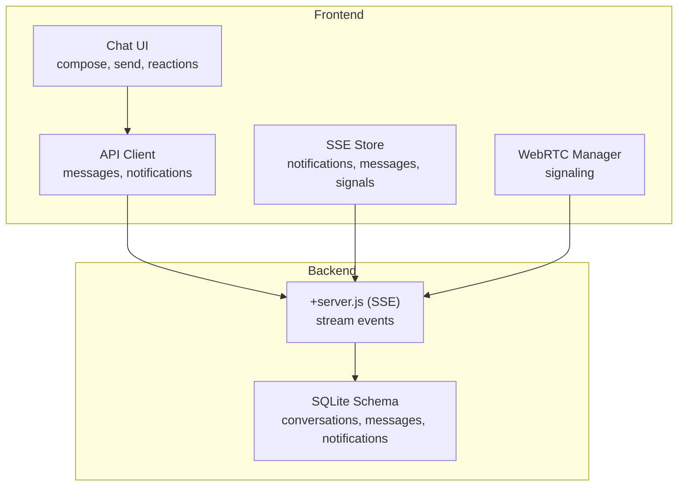
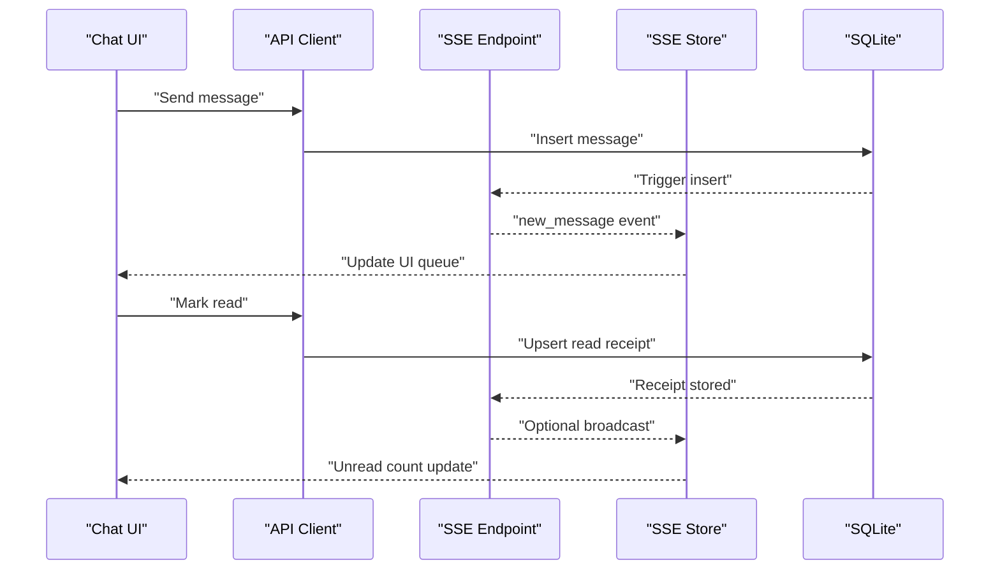
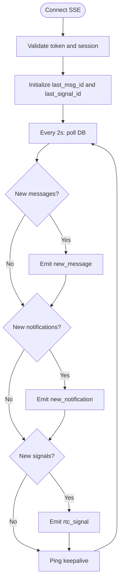
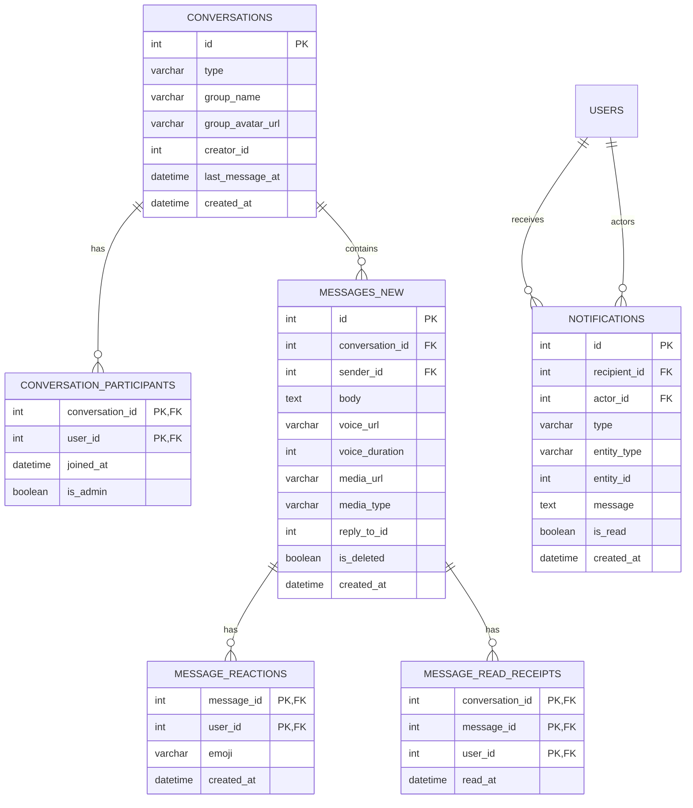
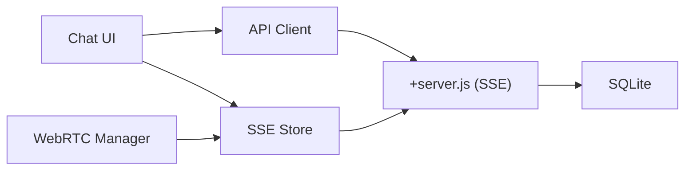

# Messaging & Communication API

<cite>
**Referenced Files in This Document**
- [api.js](file://frontend/src/lib/api.js)
- [sse/+server.js](file://frontend/src/routes/api/sse/+server.js)
- [notifications.svelte.js](file://frontend/src/lib/stores/nofitications.svelte.js)
- [messages/+page.svelte](file://frontend/src/routes/messages/+page.svelte)
- [rtc.js](file://frontend/src/lib/rtc.js)
- [schema_sqlite.sql](file://schema_sqlite.sql)
- [001_schema.sql](file://migrations/001_schema.sql)
- [002_phase2.sql](file://migrations/002_phase2.sql)
</cite>

## Table of Contents
1. [Introduction](#introduction)
2. [Project Structure](#project-structure)
3. [Core Components](#core-components)
4. [Architecture Overview](#architecture-overview)
5. [Detailed Component Analysis](#detailed-component-analysis)
6. [Dependency Analysis](#dependency-analysis)
7. [Performance Considerations](#performance-considerations)
8. [Troubleshooting Guide](#troubleshooting-guide)
9. [Conclusion](#conclusion)

## Introduction
This document describes the messaging and notification systems powering VSocial’s real-time communication. It covers:
- Direct message creation and retrieval
- Group chat management and participation
- Message threading and reactions
- Real-time updates via Server-Sent Events (SSE)
- Notification delivery and subscription management
- Attachment handling, read receipts, typing indicators
- WebRTC signaling for audio/video calls
- Rate limiting, message history, and privacy controls

## Project Structure
The messaging and notification stack spans the frontend API client, SSE endpoint, and database schema:
- Frontend API client exposes endpoints for messages, notifications, and SSE
- SSE endpoint streams real-time updates to connected clients
- Database schema defines conversations, messages, reactions, read receipts, and notifications
- Optional WebRTC signaling is integrated into the SSE pipeline

**Diagram sources**
- [api.js:202-217](file://frontend/src/lib/api.js#L202-L217)
- [sse/+server.js:9-184](file://frontend/src/routes/api/sse/+server.js#L9-L184)
- [notifications.svelte.js:35-144](file://frontend/src/lib/stores/notifications.svelte.js#L35-L144)
- [messages/+page.svelte:226-263](file://frontend/src/routes/messages/+page.svelte#L226-L263)
- [rtc.js:7-45](file://frontend/src/lib/rtc.js#L7-L45)

**Section sources**
- [api.js:202-217](file://frontend/src/lib/api.js#L202-L217)
- [sse/+server.js:9-184](file://frontend/src/routes/api/sse/+server.js#L9-L184)
- [notifications.svelte.js:35-144](file://frontend/src/lib/stores/notifications.svelte.js#L35-L144)
- [messages/+page.svelte:226-263](file://frontend/src/routes/messages/+page.svelte#L226-L263)
- [rtc.js:7-45](file://frontend/src/lib/rtc.js#L7-L45)

## Core Components
- API Client: Provides typed endpoints for conversations, messages, reactions, typing, and notifications.
- SSE Endpoint: Streams new messages, notifications, and WebRTC signals to connected clients.
- SSE Store: Manages SSE connection lifecycle, deduplication, and UI state.
- Chat UI: Handles message composition, attachments, reactions, and typing indicators.
- WebRTC Manager: Manages mesh signaling for audio/video calls.

**Section sources**
- [api.js:202-217](file://frontend/src/lib/api.js#L202-L217)
- [sse/+server.js:63-173](file://frontend/src/routes/api/sse/+server.js#L63-L173)
- [notifications.svelte.js:35-144](file://frontend/src/lib/stores/notifications.svelte.js#L35-L144)
- [messages/+page.svelte:226-263](file://frontend/src/routes/messages/+page.svelte#L226-L263)
- [rtc.js:7-45](file://frontend/src/lib/rtc.js#L7-L45)

## Architecture Overview
The system uses a hybrid model:
- REST-like endpoints for CRUD operations on conversations and messages
- SSE for real-time updates to messages, notifications, and WebRTC signals
- Optional WebRTC mesh signaling delivered via SSE
- Database-backed with explicit read receipts and reactions

**Diagram sources**
- [api.js:202-217](file://frontend/src/lib/api.js#L202-L217)
- [sse/+server.js:85-104](file://frontend/src/routes/api/sse/+server.js#L85-L104)
- [notifications.svelte.js:64-81](file://frontend/src/lib/stores/notifications.svelte.js#L64-L81)

## Detailed Component Analysis

### API Endpoints
- Conversations
  - List: GET /messages/conversations
  - Get: GET /messages/conversations/{id}
  - Create: GET /messages/conversations/user/{user_id}
- Messages
  - List: GET /messages/conversations/{convId}/messages
  - Send: POST /messages/conversations/{convId}/messages
  - Delete: DELETE /messages/{msgId}
  - Mark read: POST /messages/conversations/{convId}/read/{msgId}
  - Typing indicator: POST /messages/conversations/{convId}/typing
  - Reactions: POST /messages/{msgId}/reactions
- Notifications
  - List: GET /users/notifications
  - Mark read: PATCH /users/notifications/{id}/read
  - Mark all read: PATCH /users/notifications/read-all

Notes:
- Attachments are sent via multipart/form-data to the send endpoint; the API client handles uploads.
- Reactions use emoji payloads.

**Section sources**
- [api.js:202-217](file://frontend/src/lib/api.js#L202-L217)

### Real-Time Streaming (SSE)
- Endpoint: GET /api/sse?token={jwt}&last_msg_id={id}
- Emits:
  - event: connected
  - event: new_message
  - event: new_notification
  - event: rtc_signal
- Heartbeat: periodic ping frames
- Auto-disconnect after ~20 minutes of inactivity

**Diagram sources**
- [sse/+server.js:9-184](file://frontend/src/routes/api/sse/+server.js#L9-L184)

**Section sources**
- [sse/+server.js:9-184](file://frontend/src/routes/api/sse/+server.js#L9-L184)

### SSE Store (Frontend)
- Maintains connection with exponential backoff and jitter
- Deduplicates events by ID sets
- Exposes queues for new messages, notifications, and RTC signals
- Provides helpers to mark notifications read and manage unread counts

**Section sources**
- [notifications.svelte.js:35-144](file://frontend/src/lib/stores/notifications.svelte.js#L35-L144)

### Chat UI (Message Composition and Reactions)
- Compose and send messages with optional media attachments
- Trigger typing indicators on keypress
- Apply and remove reactions
- Scroll to bottom and refresh conversation lists after send

**Section sources**
- [messages/+page.svelte:226-263](file://frontend/src/routes/messages/+page.svelte#L226-L263)

### WebRTC Signaling
- Mesh signaling via SSE channel rtc_signal
- ICE candidates and SDP exchanged out-of-band
- Config includes STUN and TURN servers for NAT traversal

**Section sources**
- [rtc.js:7-45](file://frontend/src/lib/rtc.js#L7-L45)
- [sse/+server.js:119-136](file://frontend/src/routes/api/sse/+server.js#L119-L136)

### Database Schema (Messaging & Notifications)
- Conversations and participants define DM and group chats
- Messages include body, media, reply-to, and timestamps
- Reactions and read receipts tracked per message/user
- Notifications table supports actor/recipient/type/message

**Diagram sources**
- [schema_sqlite.sql:235-283](file://schema_sqlite.sql#L235-L283)
- [schema_sqlite.sql:289-299](file://schema_sqlite.sql#L289-L299)

**Section sources**
- [schema_sqlite.sql:235-283](file://schema_sqlite.sql#L235-L283)
- [schema_sqlite.sql:289-299](file://schema_sqlite.sql#L289-L299)

### Group Chat Management
- Conversations table supports type='dm' or 'group'
- Participants table manages membership and admin roles
- Group posts and events are supported in later migrations

**Section sources**
- [schema_sqlite.sql:235-251](file://schema_sqlite.sql#L235-L251)
- [002_phase2.sql:131-202](file://migrations/002_phase2.sql#L131-L202)

### Message Threading and Attachments
- Reply-to references enable threaded replies
- Media metadata stored per message (media_url, media_type)
- Voice notes supported in phase 2

**Section sources**
- [schema_sqlite.sql:254-266](file://schema_sqlite.sql#L254-L266)
- [002_phase2.sql:116-123](file://migrations/002_phase2.sql#L116-L123)

### Read Receipts and Typing Indicators
- Read receipts tracked per conversation/user
- Typing indicators exposed via dedicated endpoint

**Section sources**
- [schema_sqlite.sql:277-283](file://schema_sqlite.sql#L277-L283)
- [api.js:212-216](file://frontend/src/lib/api.js#L212-L216)

### Message Reactions
- Reactions stored with composite primary key (message_id, user_id, emoji)
- API supports posting reactions

**Section sources**
- [schema_sqlite.sql:269-275](file://schema_sqlite.sql#L269-L275)
- [api.js:215](file://frontend/src/lib/api.js#L215)

### Notifications Delivery and Subscription
- SSE emits new_notification events
- Local store maintains unread counts and deduplicates
- Push subscriptions table present for web push

**Section sources**
- [sse/+server.js:106-117](file://frontend/src/routes/api/sse/+server.js#L106-L117)
- [notifications.svelte.js:83-101](file://frontend/src/lib/stores/notifications.svelte.js#L83-L101)
- [schema_sqlite.sql:623-631](file://schema_sqlite.sql#L623-L631)

### Rate Limiting and Spam Prevention
- No explicit rate limiting middleware observed in the analyzed files
- Consider integrating rate limiting at the API gateway or route handlers to protect endpoints such as message send, reactions, and typing indicators

[No sources needed since this section provides general guidance]

### Message History Management
- SSE initializes last_msg_id from latest message per user
- Optional cleanup of old notifications occurs periodically

**Section sources**
- [sse/+server.js:36-57](file://frontend/src/routes/api/sse/+server.js#L36-L57)
- [sse/+server.js:138-149](file://frontend/src/routes/api/sse/+server.js#L138-L149)

### Privacy Controls
- User settings include allow_dms and notify_* toggles
- Blocked users and snoozed users tables support privacy boundaries

**Section sources**
- [schema_sqlite.sql:70-93](file://schema_sqlite.sql#L70-L93)
- [schema_sqlite.sql:497-510](file://schema_sqlite.sql#L497-L510)

## Dependency Analysis
- API Client depends on JWT token storage and fetch wrappers
- SSE Store depends on API client for initial sync and browser EventSource
- SSE Endpoint depends on database sessions and conversation/participant joins
- Chat UI depends on API client and SSE Store
- WebRTC Manager depends on SSE Store for signaling

**Diagram sources**
- [api.js:20-46](file://frontend/src/lib/api.js#L20-L46)
- [sse/+server.js:9-34](file://frontend/src/routes/api/sse/+server.js#L9-L34)
- [notifications.svelte.js:35-58](file://frontend/src/lib/stores/notifications.svelte.js#L35-L58)
- [rtc.js:5](file://frontend/src/lib/rtc.js#L5)

**Section sources**
- [api.js:20-46](file://frontend/src/lib/api.js#L20-L46)
- [sse/+server.js:9-34](file://frontend/src/routes/api/sse/+server.js#L9-L34)
- [notifications.svelte.js:35-58](file://frontend/src/lib/stores/notifications.svelte.js#L35-L58)
- [rtc.js:5](file://frontend/src/lib/rtc.js#L5)

## Performance Considerations
- SSE polling interval is 2 seconds; adjust based on latency vs. battery/network constraints
- Deduplication reduces UI churn; maintain bounded queues for new messages and signals
- Database queries join conversations and participants; ensure appropriate indexes are maintained
- Consider pagination for message lists and limit attachment sizes

[No sources needed since this section provides general guidance]

## Troubleshooting Guide
- SSE connection fails: verify token presence and validity; check session expiry
- Missing events: confirm last_msg_id initialization and SSE loop iteration
- Duplicate events: inspect processed ID sets in SSE Store
- Typing indicator not visible: ensure keypress triggers typing endpoint and UI timeout resets state
- WebRTC signaling failures: verify TURN/STUN configuration and network access

**Section sources**
- [sse/+server.js:9-34](file://frontend/src/routes/api/sse/+server.js#L9-L34)
- [notifications.svelte.js:122-139](file://frontend/src/lib/stores/notifications.svelte.js#L122-L139)
- [messages/+page.svelte:265-277](file://frontend/src/routes/messages/+page.svelte#L265-L277)
- [rtc.js:18-44](file://frontend/src/lib/rtc.js#L18-L44)

## Conclusion
VSocial’s messaging and notification system combines REST endpoints with SSE for real-time updates, robust database modeling for conversations and reactions, and optional WebRTC signaling. The frontend integrates these capabilities into a cohesive chat experience with typing indicators, reactions, and notifications. For production hardening, consider adding rate limiting, optimizing SSE intervals, and enforcing stricter privacy controls around group memberships and DM permissions.