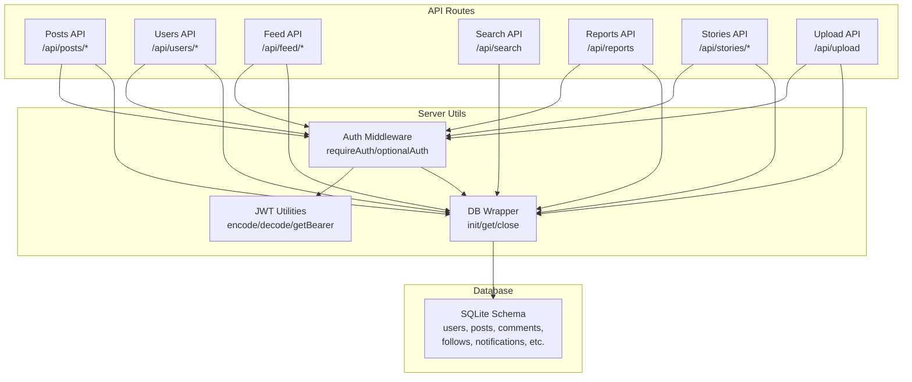
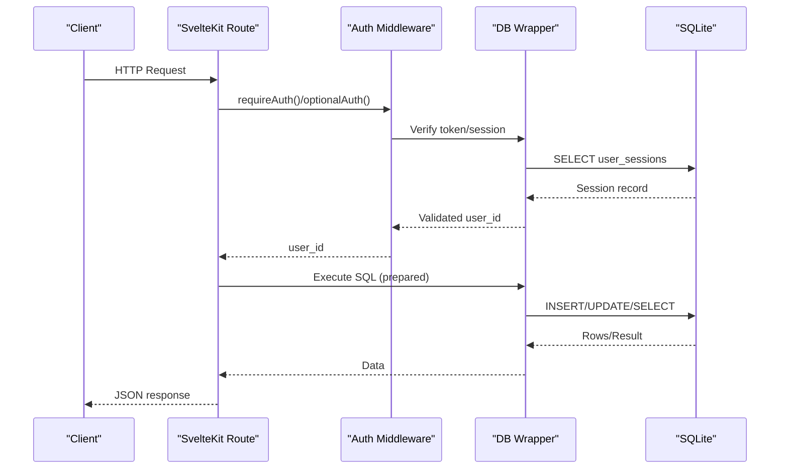
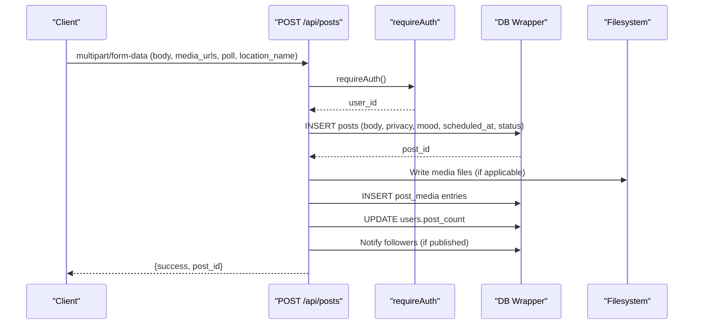
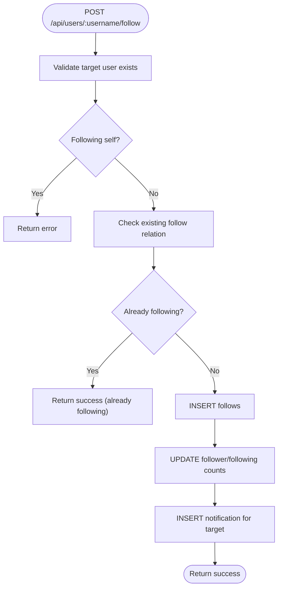
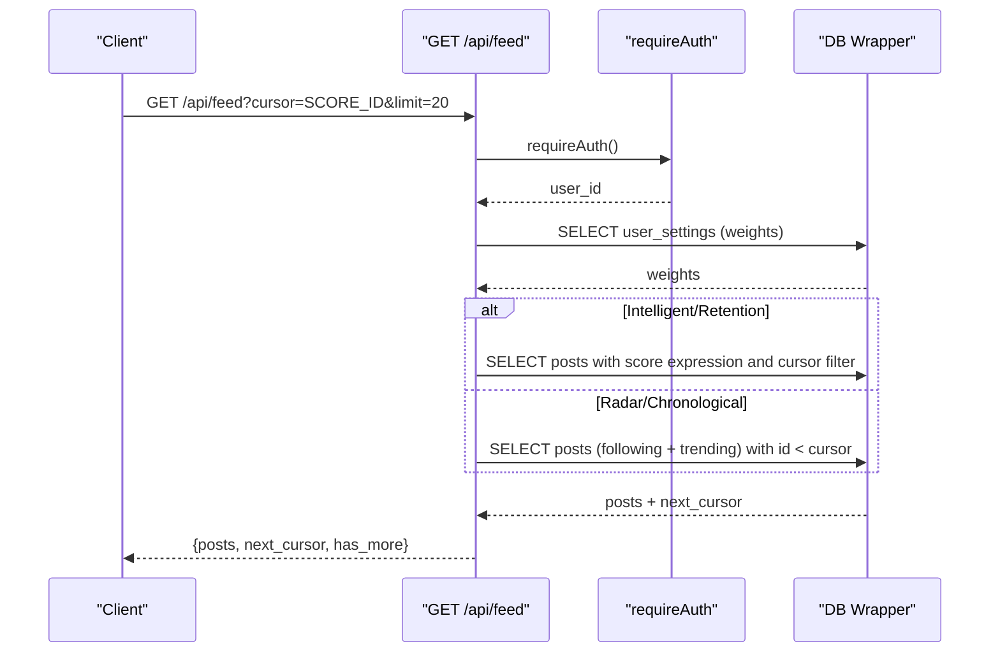
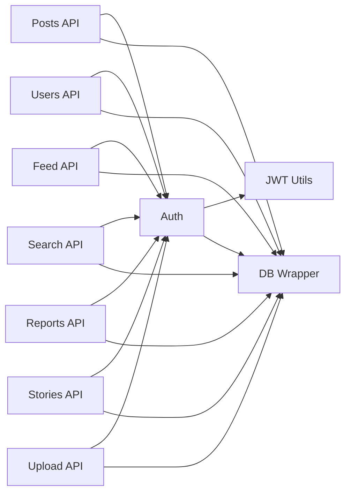

# Social Core API

<cite>
**Referenced Files in This Document**
- [posts +server.js](file://frontend/src/routes/api/posts/[...path]/+server.js)
- [users +server.js](file://frontend/src/routes/api/users/[...path]/+server.js)
- [feed +server.js](file://frontend/src/routes/api/feed/[...path]/+server.js)
- [search +server.js](file://frontend/src/routes/api/search/+server.js)
- [reports +server.js](file://frontend/src/routes/api/reports/+server.js)
- [stories +server.js](file://frontend/src/routes/api/stories/[...path]/+server.js)
- [upload +server.js](file://frontend/src/routes/api/upload/+server.js)
- [db.js](file://frontend/src/lib/server/db.js)
- [auth.js](file://frontend/src/lib/server/auth.js)
- [jwt.js](file://frontend/src/lib/server/jwt.js)
- [schema_sqlite.sql](file://schema_sqlite.sql)
</cite>

## Table of Contents
1. [Introduction](#introduction)
2. [Project Structure](#project-structure)
3. [Core Components](#core-components)
4. [Architecture Overview](#architecture-overview)
5. [Detailed Component Analysis](#detailed-component-analysis)
6. [Dependency Analysis](#dependency-analysis)
7. [Performance Considerations](#performance-considerations)
8. [Troubleshooting Guide](#troubleshooting-guide)
9. [Conclusion](#conclusion)

## Introduction
This document provides comprehensive API documentation for VSocial’s core social networking endpoints. It covers post lifecycle APIs (creation, retrieval, updates, deletion), engagement actions (likes, shares, saves, comments), user profile management (updates, followers/following, privacy), and feed systems (personalized home feed, explore feed, pagination, and preferences). It also outlines search capabilities, media upload utilities, reporting/moderation patterns, and authentication/authorization mechanisms.

## Project Structure
The backend is implemented as SvelteKit server routes organized by domain:
- Posts: `/api/posts/*`
- Users: `/api/users/*`
- Feed: `/api/feed/*`
- Search: `/api/search`
- Reports: `/api/reports`
- Stories: `/api/stories/*`
- Upload: `/api/upload`

These endpoints rely on a unified database abstraction and JWT-based authentication middleware.

**Diagram sources**
- [posts +server.js:1-411](file://frontend/src/routes/api/posts/[...path]/+server.js#L1-L411)
- [users +server.js:1-347](file://frontend/src/routes/api/users/[...path]/+server.js#L1-L347)
- [feed +server.js:1-239](file://frontend/src/routes/api/feed/[...path]/+server.js#L1-L239)
- [search +server.js:1-61](file://frontend/src/routes/api/search/+server.js#L1-L61)
- [reports +server.js:1-39](file://frontend/src/routes/api/reports/+server.js#L1-L39)
- [stories +server.js:1-99](file://frontend/src/routes/api/stories/[...path]/+server.js#L1-L99)
- [upload +server.js:1-44](file://frontend/src/routes/api/upload/+server.js#L1-L44)
- [auth.js:1-92](file://frontend/src/lib/server/auth.js#L1-L92)
- [jwt.js:1-45](file://frontend/src/lib/server/jwt.js#L1-L45)
- [db.js:1-209](file://frontend/src/lib/server/db.js#L1-L209)
- [schema_sqlite.sql:1-702](file://schema_sqlite.sql#L1-L702)

**Section sources**
- [posts +server.js:1-411](file://frontend/src/routes/api/posts/[...path]/+server.js#L1-L411)
- [users +server.js:1-347](file://frontend/src/routes/api/users/[...path]/+server.js#L1-L347)
- [feed +server.js:1-239](file://frontend/src/routes/api/feed/[...path]/+server.js#L1-L239)
- [search +server.js:1-61](file://frontend/src/routes/api/search/+server.js#L1-L61)
- [reports +server.js:1-39](file://frontend/src/routes/api/reports/+server.js#L1-L39)
- [stories +server.js:1-99](file://frontend/src/routes/api/stories/[...path]/+server.js#L1-L99)
- [upload +server.js:1-44](file://frontend/src/routes/api/upload/+server.js#L1-L44)
- [auth.js:1-92](file://frontend/src/lib/server/auth.js#L1-L92)
- [jwt.js:1-45](file://frontend/src/lib/server/jwt.js#L1-L45)
- [db.js:1-209](file://frontend/src/lib/server/db.js#L1-L209)
- [schema_sqlite.sql:1-702](file://schema_sqlite.sql#L1-L702)

## Core Components
- Authentication and Authorization
  - Bearer token extraction and verification
  - Session validation against database
  - Optional and required auth helpers
- Database Abstraction
  - Unified async API wrapping @libsql/client or better-sqlite3
  - Transactions and prepared statements
- Media Upload Utilities
  - File validation by MIME type
  - Safe filesystem writes and URL generation
- Content Metadata and Polls
  - Embedded metadata parsing for posts (polls, location)
- Engagement and Notifications
  - Post reactions, comments, saves, and follow notifications

**Section sources**
- [auth.js:1-92](file://frontend/src/lib/server/auth.js#L1-L92)
- [jwt.js:1-45](file://frontend/src/lib/server/jwt.js#L1-L45)
- [db.js:1-209](file://frontend/src/lib/server/db.js#L1-L209)
- [upload +server.js:1-44](file://frontend/src/routes/api/upload/+server.js#L1-L44)
- [posts +server.js:24-44](file://frontend/src/routes/api/posts/[...path]/+server.js#L24-L44)

## Architecture Overview
The API follows a thin server route pattern with explicit routing per resource. Each route:
- Validates authentication (required or optional)
- Parses request bodies (JSON or multipart/form-data)
- Executes parameterized SQL queries
- Returns structured JSON responses

**Diagram sources**
- [auth.js:15-44](file://frontend/src/lib/server/auth.js#L15-L44)
- [db.js:31-112](file://frontend/src/lib/server/db.js#L31-L112)
- [posts +server.js:96-205](file://frontend/src/routes/api/posts/[...path]/+server.js#L96-L205)

## Detailed Component Analysis

### Posts API
Endpoints:
- POST /api/posts — Create post (supports body/content, media_urls, privacy, mood, scheduled_at, poll, location_name)
- GET /api/posts/:id — Retrieve single post with media and parsed metadata
- PUT /api/posts/:id — Update post content
- DELETE /api/posts/:id — Soft-delete post
- POST /api/posts/:id/like — React to post (supports reaction type)
- DELETE /api/posts/:id/like — Remove like
- POST /api/posts/:id/share — Increment share count
- POST /api/posts/:id/save — Save post
- DELETE /api/posts/:id/save — Unsave post
- GET /api/posts/:id/comments — List comments with user_has_liked for authenticated user
- POST /api/posts/:id/comments — Add comment
- DELETE /api/posts/:id/comments/:commentId — Soft-delete comment
- POST /api/posts/:id/comments/:commentId/like — Like a comment
- POST /api/posts/:id/vote — Vote in poll embedded in post
- POST /api/posts/:id/restore — Restore soft-deleted post (owner only)

Request/Response patterns:
- Authentication: Required for mutation endpoints
- Body formats: JSON or multipart/form-data
- Metadata: Posts may embed polls and locations via a special marker in body

Pagination and filtering:
- Comments are returned ordered by created_at ascending
- Poll voting validates option index and prevents duplicate votes

Engagement metrics:
- Tracks like_count, comment_count, share_count
- Saves tracked in saved_posts
- Notifications triggered for likes, comments, and new posts to followers

Media handling:
- Media URLs stored in post_media table
- Separate upload endpoint supports generic file uploads

Rate limiting and moderation:
- No explicit rate limiting in code
- Reporting endpoint supports moderation workflows

**Section sources**
- [posts +server.js:55-327](file://frontend/src/routes/api/posts/[...path]/+server.js#L55-L327)
- [schema_sqlite.sql:107-184](file://schema_sqlite.sql#L107-L184)

#### Posts API Sequence: Create Post with Media and Poll

**Diagram sources**
- [posts +server.js:119-205](file://frontend/src/routes/api/posts/[...path]/+server.js#L119-L205)
- [db.js:31-112](file://frontend/src/lib/server/db.js#L31-L112)

### Users API
Endpoints:
- GET /api/users/me — Current user profile
- GET /api/users/suggested — Suggested virtual users
- GET /api/users/search — Search users by username/display_name
- GET /api/users/settings — User settings with defaults
- GET /api/users/notifications — Paginated notifications
- GET /api/users/:username — Public profile info
- GET /api/users/:username/followers — Followers list
- GET /api/users/:username/following — Following list
- GET /api/users/:username/posts — User posts with pagination and status filter
- POST /api/users/:username/follow — Follow another user
- POST /api/users/:username/unfollow — Unfollow
- POST /api/users/avatar — Upload avatar
- POST /api/users/cover — Upload cover
- PUT /api/users/profile — Update profile fields
- PUT /api/users/settings — Update settings
- PATCH /api/users/notifications/read-all — Mark all notifications as read
- PATCH /api/users/notifications/:id/read — Mark specific notification as read

Pagination:
- Notifications: page and limit parameters with sane caps
- User posts: page and limit with status filter (active/deleted)

Privacy and visibility:
- Profile includes is_following flag for current user
- Virtual profiles receive enriched metadata

**Section sources**
- [users +server.js:47-193](file://frontend/src/routes/api/users/[...path]/+server.js#L47-L193)
- [schema_sqlite.sql:13-48](file://schema_sqlite.sql#L13-L48)

#### Users API Flow: Follow Another User

**Diagram sources**
- [users +server.js:202-220](file://frontend/src/routes/api/users/[...path]/+server.js#L202-L220)

### Feed API
Endpoints:
- GET /api/feed — Personalized home feed with cursor-based pagination
- GET /api/feed/explore — Explore public posts with cursor-based pagination
- GET /api/feed/preferences — Get feed preferences
- GET /api/feed/suggested-users — Suggested users to follow
- PUT /api/feed/preferences — Update feed preferences

Algorithms:
- Mode selection: intelligent, retention, radar, chronological
- Intelligent mode: weighted scoring combining social graph, popularity, recency, and diversity
- Retention mode: stronger emphasis on popularity and diversity (TikTok-style)
- Radar/chronological: strict chronological mixing of following and trending

Pagination:
- Cursor-based pagination using composite keys (score_id or like_count_id)
- Limit capped to prevent overfetching

**Section sources**
- [feed +server.js:47-217](file://frontend/src/routes/api/feed/[...path]/+server.js#L47-L217)
- [schema_sqlite.sql:70-93](file://schema_sqlite.sql#L70-L93)

#### Feed API Sequence: Home Feed with Cursor

**Diagram sources**
- [feed +server.js:120-214](file://frontend/src/routes/api/feed/[...path]/+server.js#L120-L214)

### Search API
Endpoints:
- GET /api/search — Multi-type search across users, posts, gigs, hashtags
- Supports pagination and type filtering
- Trending defaults when query is empty

**Section sources**
- [search +server.js:8-60](file://frontend/src/routes/api/search/+server.js#L8-L60)

### Reports API
Endpoints:
- POST /api/reports — Create a report for a post, comment, user, or reel
- GET /api/reports — List user’s reports
- Enforces uniqueness of pending reports per entity

**Section sources**
- [reports +server.js:10-38](file://frontend/src/routes/api/reports/+server.js#L10-L38)

### Stories API
Endpoints:
- GET /api/stories/feed — Aggregate active stories by user
- POST /api/stories — Create story with media upload
- POST /api/stories/:id/view — Increment view count
- DELETE /api/stories — Delete own story

**Section sources**
- [stories +server.js:11-99](file://frontend/src/routes/api/stories/[...path]/+server.js#L11-L99)

### Upload API
Endpoints:
- POST /api/upload — Generic file upload with MIME validation and size limits
- Supports context scoping (avatar, cover, chat, listing, post)

**Section sources**
- [upload +server.js:17-43](file://frontend/src/routes/api/upload/+server.js#L17-L43)

## Dependency Analysis
Key internal dependencies:
- All routes depend on authentication middleware
- All routes depend on database wrapper
- Media endpoints depend on filesystem utilities
- Feed preferences depend on user_settings table

**Diagram sources**
- [posts +server.js:17-22](file://frontend/src/routes/api/posts/[...path]/+server.js#L17-L22)
- [users +server.js:10-15](file://frontend/src/routes/api/users/[...path]/+server.js#L10-L15)
- [feed +server.js:9-11](file://frontend/src/routes/api/feed/[...path]/+server.js#L9-L11)
- [search +server.js:4-6](file://frontend/src/routes/api/search/+server.js#L4-L6)
- [reports +server.js:6-8](file://frontend/src/routes/api/reports/+server.js#L6-L8)
- [stories +server.js:4-9](file://frontend/src/routes/api/stories/[...path]/+server.js#L4-L9)
- [upload +server.js:5-9](file://frontend/src/routes/api/upload/+server.js#L5-L9)
- [auth.js:6-9](file://frontend/src/lib/server/auth.js#L6-L9)
- [jwt.js:5-8](file://frontend/src/lib/server/jwt.js#L5-L8)
- [db.js:9-11](file://frontend/src/lib/server/db.js#L9-L11)

**Section sources**
- [auth.js:1-92](file://frontend/src/lib/server/auth.js#L1-L92)
- [db.js:1-209](file://frontend/src/lib/server/db.js#L1-L209)

## Performance Considerations
- Prepared statements and parameter binding are consistently used across endpoints to prevent SQL injection and improve caching.
- Indexes exist on frequently queried columns (e.g., posts by user and created_at, notifications by recipient, sessions by token).
- Cursor-based pagination reduces keyset scanning overhead compared to OFFSET/LIMIT.
- Feed scoring uses a single query with computed scores, avoiding client-side joins.
- Media URLs are stored separately to keep post bodies compact and enable efficient fetching.

[No sources needed since this section provides general guidance]

## Troubleshooting Guide
Common issues and resolutions:
- Unauthorized requests: Ensure Authorization header contains a valid Bearer token and session is active.
- Invalid or expired tokens: Tokens are validated against hashed session records and expiration timestamps.
- Duplicate actions: Many endpoints handle duplicates gracefully (e.g., liking a comment twice returns success).
- Empty payloads: Several endpoints reject empty content or missing files with appropriate error codes.
- Rate limiting: Not implemented in code; consider adding middleware or external rate limiting layer if needed.
- Pagination anomalies: Verify cursor format and limit bounds; feed endpoints enforce minimum/maximum limits.

**Section sources**
- [auth.js:15-44](file://frontend/src/lib/server/auth.js#L15-L44)
- [posts +server.js:312-325](file://frontend/src/routes/api/posts/[...path]/+server.js#L312-L325)
- [feed +server.js:76-107](file://frontend/src/routes/api/feed/[...path]/+server.js#L76-L107)

## Conclusion
VSocial’s API provides a robust foundation for social networking features with clear separation of concerns, strong authentication, and efficient data access patterns. The feed system offers flexible ranking modes with cursor-based pagination, while posts and users APIs support rich engagement and profile management. Extending with rate limiting and moderation automation would further harden the platform for production scale.