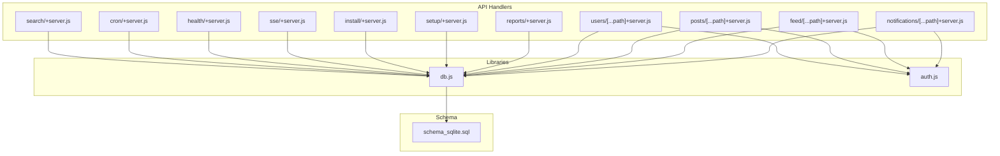
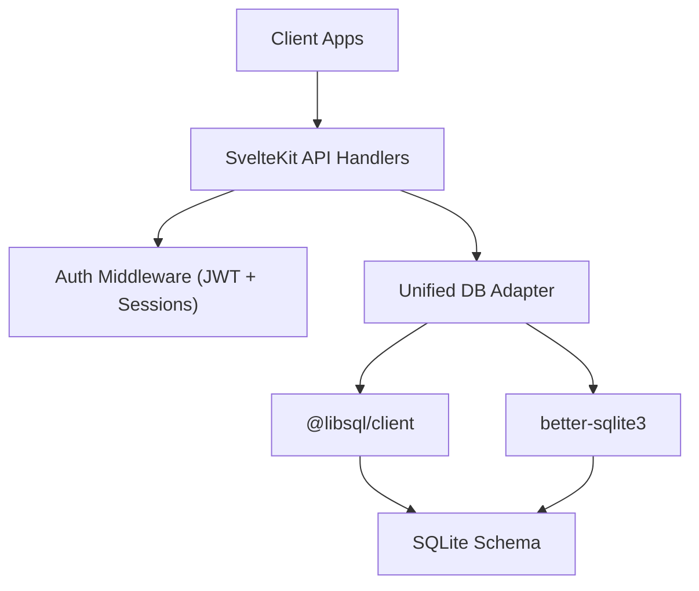
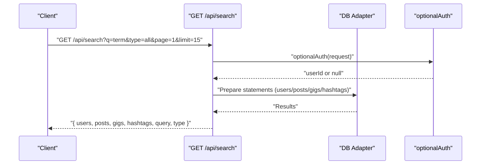
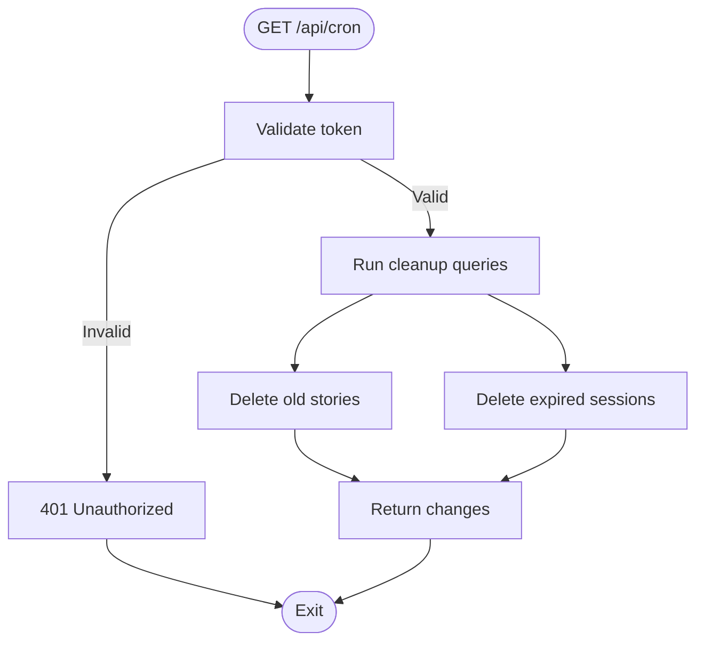
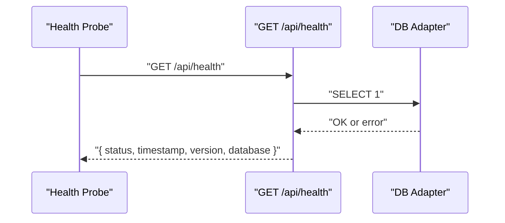
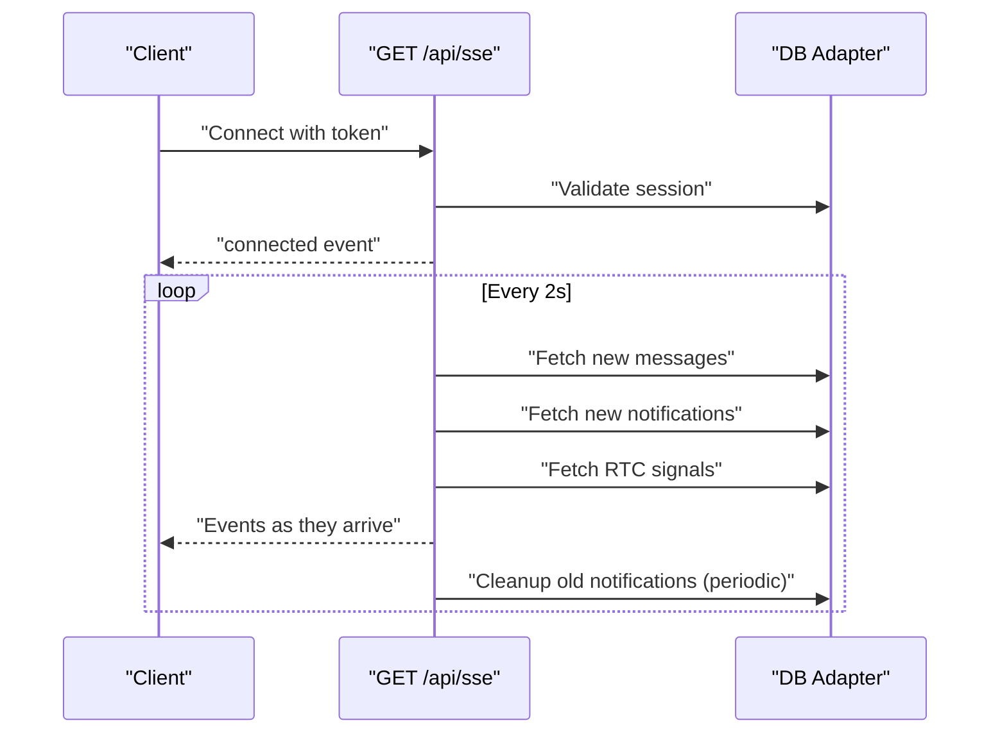
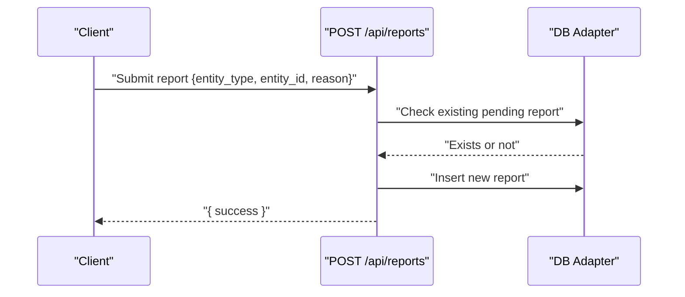
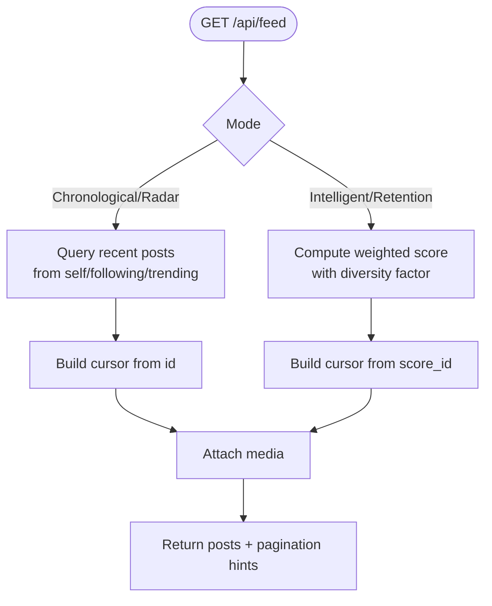
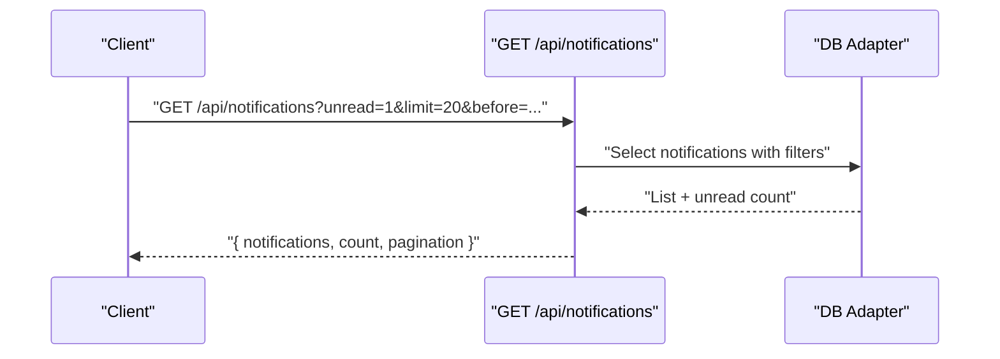
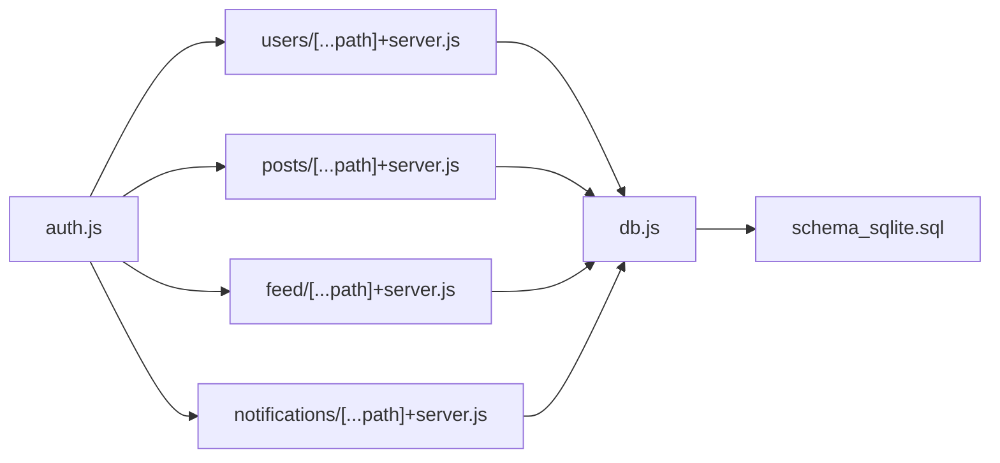

# Utility & Search API

<cite>
**Referenced Files in This Document**
- [search/+server.js](file://frontend/src/routes/api/search/+server.js)
- [cron/+server.js](file://frontend/src/routes/api/cron/+server.js)
- [health/+server.js](file://frontend/src/routes/api/health/+server.js)
- [sse/+server.js](file://frontend/src/routes/api/sse/+server.js)
- [install/+server.js](file://frontend/src/routes/api/install/+server.js)
- [setup/+server.js](file://frontend/src/routes/api/setup/+server.js)
- [reports/+server.js](file://frontend/src/routes/api/reports/+server.js)
- [users/[...path]+server.js](file://frontend/src/routes/api/users/[...path]+server.js)
- [posts/[...path]+server.js](file://frontend/src/routes/api/posts/[...path]+server.js)
- [feed/[...path]+server.js](file://frontend/src/routes/api/feed/[...path]+server.js)
- [notifications/[...path]+server.js](file://frontend/src/routes/api/notifications/[...path]+server.js)
- [db.js](file://frontend/src/lib/server/db.js)
- [auth.js](file://frontend/src/lib/server/auth.js)
- [schema_sqlite.sql](file://schema_sqlite.sql)
</cite>

## Table of Contents
1. [Introduction](#introduction)
2. [Project Structure](#project-structure)
3. [Core Components](#core-components)
4. [Architecture Overview](#architecture-overview)
5. [Detailed Component Analysis](#detailed-component-analysis)
6. [Dependency Analysis](#dependency-analysis)
7. [Performance Considerations](#performance-considerations)
8. [Troubleshooting Guide](#troubleshooting-guide)
9. [Conclusion](#conclusion)

## Introduction
This document describes the Utility and Search API surface for VSocial’s backend endpoints. It covers:
- Search and discovery endpoints for users, posts, gigs, and hashtags
- Cron maintenance operations
- Health monitoring and system status
- Real-time notifications via Server-Sent Events (SSE)
- Installation and setup utilities
- Reporting and moderation endpoints
- Feed algorithms and personalization
- Underlying database abstraction and authentication middleware

The goal is to provide a practical guide for developers integrating with VSocial’s system services, including request/response semantics, parameters, and operational guidance.

## Project Structure
The API surface is organized under frontend/src/routes/api with modular handlers per domain. Supporting libraries include a unified database adapter and authentication utilities.



**Diagram sources**
- [search/+server.js:1-61](file://frontend/src/routes/api/search/+server.js#L1-L61)
- [cron/+server.js:1-32](file://frontend/src/routes/api/cron/+server.js#L1-L32)
- [health/+server.js:1-22](file://frontend/src/routes/api/health/+server.js#L1-L22)
- [sse/+server.js:1-185](file://frontend/src/routes/api/sse/+server.js#L1-L185)
- [install/+server.js:1-175](file://frontend/src/routes/api/install/+server.js#L1-L175)
- [setup/+server.js:1-72](file://frontend/src/routes/api/setup/+server.js#L1-L72)
- [reports/+server.js:1-39](file://frontend/src/routes/api/reports/+server.js#L1-L39)
- [users/[...path]+server.js](file://frontend/src/routes/api/users/[...path]+server.js#L1-L347)
- [posts/[...path]+server.js](file://frontend/src/routes/api/posts/[...path]+server.js#L1-L411)
- [feed/[...path]+server.js](file://frontend/src/routes/api/feed/[...path]+server.js#L1-L239)
- [notifications/[...path]+server.js](file://frontend/src/routes/api/notifications/[...path]+server.js#L1-L75)
- [db.js:1-209](file://frontend/src/lib/server/db.js#L1-L209)
- [auth.js:1-92](file://frontend/src/lib/server/auth.js#L1-L92)
- [schema_sqlite.sql:1-702](file://schema_sqlite.sql#L1-L702)

**Section sources**
- [search/+server.js:1-61](file://frontend/src/routes/api/search/+server.js#L1-L61)
- [cron/+server.js:1-32](file://frontend/src/routes/api/cron/+server.js#L1-L32)
- [health/+server.js:1-22](file://frontend/src/routes/api/health/+server.js#L1-L22)
- [sse/+server.js:1-185](file://frontend/src/routes/api/sse/+server.js#L1-L185)
- [install/+server.js:1-175](file://frontend/src/routes/api/install/+server.js#L1-L175)
- [setup/+server.js:1-72](file://frontend/src/routes/api/setup/+server.js#L1-L72)
- [reports/+server.js:1-39](file://frontend/src/routes/api/reports/+server.js#L1-L39)
- [users/[...path]+server.js](file://frontend/src/routes/api/users/[...path]+server.js#L1-L347)
- [posts/[...path]+server.js](file://frontend/src/routes/api/posts/[...path]+server.js#L1-L411)
- [feed/[...path]+server.js](file://frontend/src/routes/api/feed/[...path]+server.js#L1-L239)
- [notifications/[...path]+server.js](file://frontend/src/routes/api/notifications/[...path]+server.js#L1-L75)
- [db.js:1-209](file://frontend/src/lib/server/db.js#L1-L209)
- [auth.js:1-92](file://frontend/src/lib/server/auth.js#L1-L92)
- [schema_sqlite.sql:1-702](file://schema_sqlite.sql#L1-L702)

## Core Components
- Search API: Full-text search across users, posts, gigs, and hashtags with pagination and type filtering. Supports trending fallback when query is empty.
- Cron Maintenance: Scheduled cleanup of expired stories and sessions using a shared secret.
- Health Monitoring: Basic health endpoint with DB connectivity check and degraded status handling.
- SSE Notifications: Long-lived connections for real-time messages, notifications, and WebRTC signals with periodic cleanup.
- Installation & Setup: Environment checks, driver auto-detection, schema initialization, and initial admin creation.
- Reporting & Moderation: Report submission and listing for content and users.
- Feed Algorithms: Personalized feeds with configurable weights and modes (intelligent, retention, radar, chronological).
- Authentication & Authorization: JWT-based bearer tokens, session validation, and admin enforcement.

**Section sources**
- [search/+server.js:8-60](file://frontend/src/routes/api/search/+server.js#L8-L60)
- [cron/+server.js:5-31](file://frontend/src/routes/api/cron/+server.js#L5-L31)
- [health/+server.js:4-21](file://frontend/src/routes/api/health/+server.js#L4-L21)
- [sse/+server.js:9-184](file://frontend/src/routes/api/sse/+server.js#L9-L184)
- [install/+server.js:45-174](file://frontend/src/routes/api/install/+server.js#L45-L174)
- [setup/+server.js:10-71](file://frontend/src/routes/api/setup/+server.js#L10-L71)
- [reports/+server.js:10-38](file://frontend/src/routes/api/reports/+server.js#L10-L38)
- [feed/[...path]+server.js](file://frontend/src/routes/api/feed/[...path]+server.js#L47-L217)
- [auth.js:15-91](file://frontend/src/lib/server/auth.js#L15-L91)

## Architecture Overview
The API layer delegates to a unified database adapter supporting two drivers (@libsql/client and better-sqlite3). Authentication middleware validates JWTs and session records. The schema defines core domains including users, posts, notifications, marketplace, and system settings.



**Diagram sources**
- [db.js:117-167](file://frontend/src/lib/server/db.js#L117-L167)
- [auth.js:15-44](file://frontend/src/lib/server/auth.js#L15-L44)
- [schema_sqlite.sql:1-702](file://schema_sqlite.sql#L1-L702)

## Detailed Component Analysis

### Search API
- Endpoint: GET /api/search
- Query parameters:
  - q: search term (optional)
  - type: all | users | posts | gigs | hashtags
  - page: pagination page number
  - limit: items per page (bounded)
- Behavior:
  - Empty query returns trending users, top hashtags, and popular posts
  - Otherwise performs LIKE queries against usernames/display names, post bodies, gig titles/descriptions/tags, and hashtag names
  - Adds is_following for authenticated users when searching users
  - Gig tags are split into arrays
- Response keys: users, posts, gigs, hashtags, query, type



**Diagram sources**
- [search/+server.js:8-60](file://frontend/src/routes/api/search/+server.js#L8-L60)
- [auth.js:49-55](file://frontend/src/lib/server/auth.js#L49-L55)

**Section sources**
- [search/+server.js:8-60](file://frontend/src/routes/api/search/+server.js#L8-L60)

### Cron Maintenance
- Endpoint: GET /api/cron
- Authentication: Bearer token or token query param against CRON_SECRET
- Operations:
  - Delete expired stories older than 24 hours
  - Delete expired sessions
- Response: success flag and counts of affected rows



**Diagram sources**
- [cron/+server.js:5-31](file://frontend/src/routes/api/cron/+server.js#L5-L31)

**Section sources**
- [cron/+server.js:5-31](file://frontend/src/routes/api/cron/+server.js#L5-L31)

### Health Monitoring
- Endpoint: GET /api/health
- Behavior:
  - Responds with status, timestamp, and version
  - Attempts a simple DB query to verify connectivity
  - Sets degraded status if DB fails



**Diagram sources**
- [health/+server.js:4-21](file://frontend/src/routes/api/health/+server.js#L4-L21)

**Section sources**
- [health/+server.js:4-21](file://frontend/src/routes/api/health/+server.js#L4-L21)

### Server-Sent Events (SSE)
- Endpoint: GET /api/sse?token=...
- Authentication: Token validated via JWT and session lookup
- Features:
  - Periodic polling (2s intervals) for new messages, notifications, and WebRTC signals
  - Automatic disconnect after ~20 minutes
  - Periodic cleanup of old notifications (~10 minutes)
  - Keepalive pings
- Event types: connected, new_message, new_notification, rtc_signal



**Diagram sources**
- [sse/+server.js:9-184](file://frontend/src/routes/api/sse/+server.js#L9-L184)

**Section sources**
- [sse/+server.js:9-184](file://frontend/src/routes/api/sse/+server.js#L9-L184)

### Installation & Setup Utilities
- Install status/check: GET /api/install/{install,status,check}
- Run installation: POST /api/install/run
  - Auto-detects @libsql/client or better-sqlite3
  - Initializes schema, creates admin user, writes .env, sets install lock
- Setup wizard: GET /api/setup (needsSetup) and POST /api/setup (create super admin, base config, categories)

```mermaid
flowchart TD
A["GET /api/install/status"] --> B["GET /api/install/check"]
B --> C["POST /api/install/run"]
C --> D{"Driver available?"}
D --> |@libsql| E["Init WAL + PRAGMAs + schema"]
D --> |better-sqlite3| F["Init WAL + PRAGMAs + schema"]
E --> G["Seed admin + settings + locks"]
F --> G
G --> H["GET /api/setup -> needsSetup"]
H --> I["POST /api/setup -> create admin + settings"]
```

**Diagram sources**
- [install/+server.js:45-174](file://frontend/src/routes/api/install/+server.js#L45-L174)
- [setup/+server.js:10-71](file://frontend/src/routes/api/setup/+server.js#L10-L71)

**Section sources**
- [install/+server.js:45-174](file://frontend/src/routes/api/install/+server.js#L45-L174)
- [setup/+server.js:10-71](file://frontend/src/routes/api/setup/+server.js#L10-L71)

### Reporting & Moderation
- POST /api/reports: submit a report for a post/comment/user/reel; prevents duplicates for pending reports
- GET /api/reports: list user’s reports (recent)



**Diagram sources**
- [reports/+server.js:10-31](file://frontend/src/routes/api/reports/+server.js#L10-L31)

**Section sources**
- [reports/+server.js:10-38](file://frontend/src/routes/api/reports/+server.js#L10-L38)

### Feed Algorithms
- GET /api/feed (home): personalized feed with configurable algorithm and weights
- GET /api/feed/explore: public feed ordered by popularity
- GET /api/feed/suggested-users: discover users to follow
- PUT /api/feed/preferences: set algorithm and weights

Key behaviors:
- Algorithms: intelligent, retention (TikTok-like), radar, chronological
- Weights: interests, interactions, social, popularity, recency, diversity
- Pagination cursors: numeric or score-based depending on algorithm



**Diagram sources**
- [feed/[...path]+server.js](file://frontend/src/routes/api/feed/[...path]+server.js#L120-L217)

**Section sources**
- [feed/[...path]+server.js](file://frontend/src/routes/api/feed/[...path]+server.js#L47-L238)

### Notifications API
- GET /api/notifications: paginated notifications with unread filter and cursor
- POST /api/notifications/read-all: mark all as read
- POST /api/notifications/:id/read: mark specific as read
- DELETE /api/notifications/:id: delete notification



**Diagram sources**
- [notifications/[...path]+server.js](file://frontend/src/routes/api/notifications/[...path]+server.js#L8-L47)

**Section sources**
- [notifications/[...path]+server.js](file://frontend/src/routes/api/notifications/[...path]+server.js#L8-L75)

### Users API
- GET /api/users/me, suggested, search, settings
- GET /api/users/:username, followers, following, :username/posts
- POST /api/users/:username/follow, avatar, cover
- DELETE /api/users/:username/follow
- PUT /api/users/profile, settings
- PATCH /api/users/notifications/read-all, :id/read

Highlights:
- Followers/following lists
- Post listing with media and metadata parsing
- Avatar/cover uploads to controlled directories

**Section sources**
- [users/[...path]+server.js](file://frontend/src/routes/api/users/[...path]+server.js#L47-L347)

### Posts API
- GET /api/posts/:id, :id/comments
- POST /api/posts/media, , :id/like, :id/share, :id/save, :id/comments
- PUT /api/posts/:id, :id/comments/:commentId
- DELETE /api/posts/:id, :id/save, :id/like, :id/comments/:commentId/like, :id/comments/:commentId

Features:
- Poll voting embedded in post metadata
- Scheduled posts
- Media upload helpers
- Notification triggers for likes and comments

**Section sources**
- [posts/[...path]+server.js](file://frontend/src/routes/api/posts/[...path]+server.js#L55-L411)

## Dependency Analysis
- Database abstraction supports two drivers transparently, enabling local WAL and remote operation.
- Authentication relies on JWT decoding and DB-backed session validation.
- Endpoints depend on the unified adapter for SQL execution and on auth middleware for access control.
- Schema defines core tables and indexes used by search, feed, notifications, and reporting.



**Diagram sources**
- [auth.js:15-91](file://frontend/src/lib/server/auth.js#L15-L91)
- [users/[...path]+server.js](file://frontend/src/routes/api/users/[...path]+server.js#L10-L14)
- [posts/[...path]+server.js](file://frontend/src/routes/api/posts/[...path]+server.js#L17-L22)
- [feed/[...path]+server.js](file://frontend/src/routes/api/feed/[...path]+server.js#L10-L11)
- [notifications/[...path]+server.js](file://frontend/src/routes/api/notifications/[...path]+server.js#L5-L6)
- [db.js:117-167](file://frontend/src/lib/server/db.js#L117-L167)
- [schema_sqlite.sql:1-702](file://schema_sqlite.sql#L1-L702)

**Section sources**
- [db.js:117-167](file://frontend/src/lib/server/db.js#L117-L167)
- [auth.js:15-91](file://frontend/src/lib/server/auth.js#L15-L91)
- [schema_sqlite.sql:1-702](file://schema_sqlite.sql#L1-L702)

## Performance Considerations
- Database tuning:
  - WAL mode enabled for both drivers to improve concurrency
  - PRAGMA settings tuned for synchronous and cache behavior
  - Indexes on frequently filtered columns (e.g., user_sessions, notifications, posts)
- Pagination:
  - Limits enforced per endpoint; cursor-based pagination for feeds
- SSE:
  - Controlled interval and automatic disconnect to prevent resource leaks
- Recommendations:
  - Use appropriate indexes for LIKE queries (currently broad)
  - Consider full-text search if LIKE performance becomes a bottleneck
  - Batch operations where feasible (e.g., notifications cleanup)

[No sources needed since this section provides general guidance]

## Troubleshooting Guide
- Health endpoint returns degraded:
  - Verify DB connectivity and that SELECT 1 succeeds
- SSE connection closes unexpectedly:
  - Confirm token validity and session freshness
  - Check server logs for periodic tick errors
- Cron maintenance not running:
  - Ensure CRON_SECRET is configured and matches token
  - Verify DB cleanup queries succeed
- Installation failures:
  - Confirm driver availability (@libsql/client or better-sqlite3)
  - Check schema file presence and permissions
- Authentication errors:
  - Validate JWT and session existence
  - Confirm token expiration and IP/user-agent storage

**Section sources**
- [health/+server.js:11-18](file://frontend/src/routes/api/health/+server.js#L11-L18)
- [sse/+server.js:156-162](file://frontend/src/routes/api/sse/+server.js#L156-L162)
- [cron/+server.js:11-13](file://frontend/src/routes/api/cron/+server.js#L11-L13)
- [install/+server.js:101-144](file://frontend/src/routes/api/install/+server.js#L101-L144)
- [auth.js:15-44](file://frontend/src/lib/server/auth.js#L15-L44)

## Conclusion
VSocial’s Utility and Search API provides a cohesive set of endpoints for content discovery, personalization, maintenance, and real-time communication. The unified database adapter and authentication middleware enable consistent behavior across drivers and secure access control. For production deployments, monitor health, tune feed weights, and leverage pagination and indexing to maintain responsiveness.