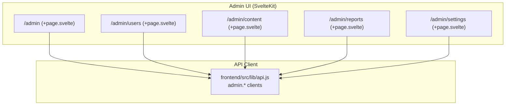
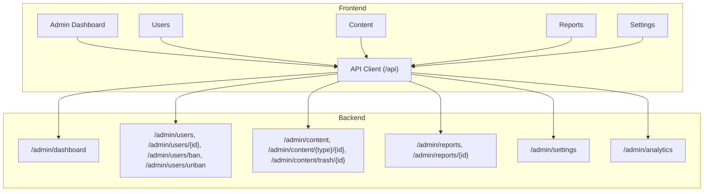
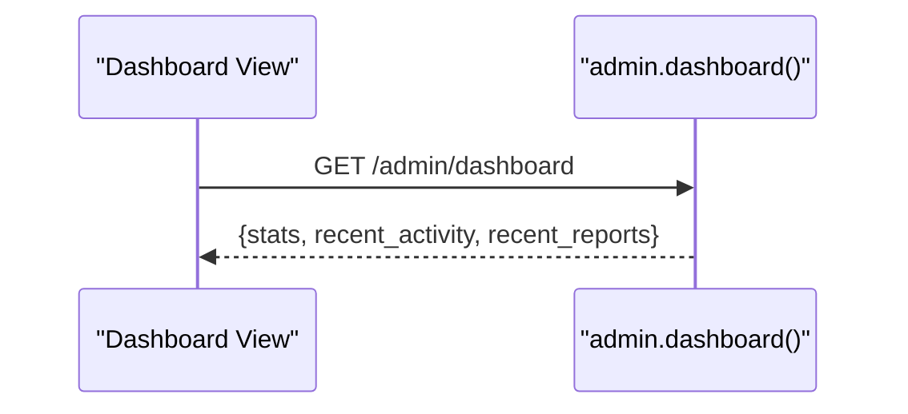
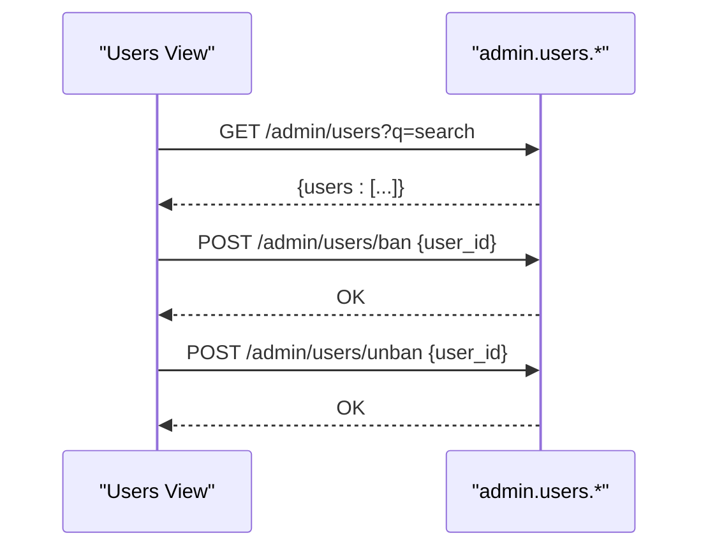
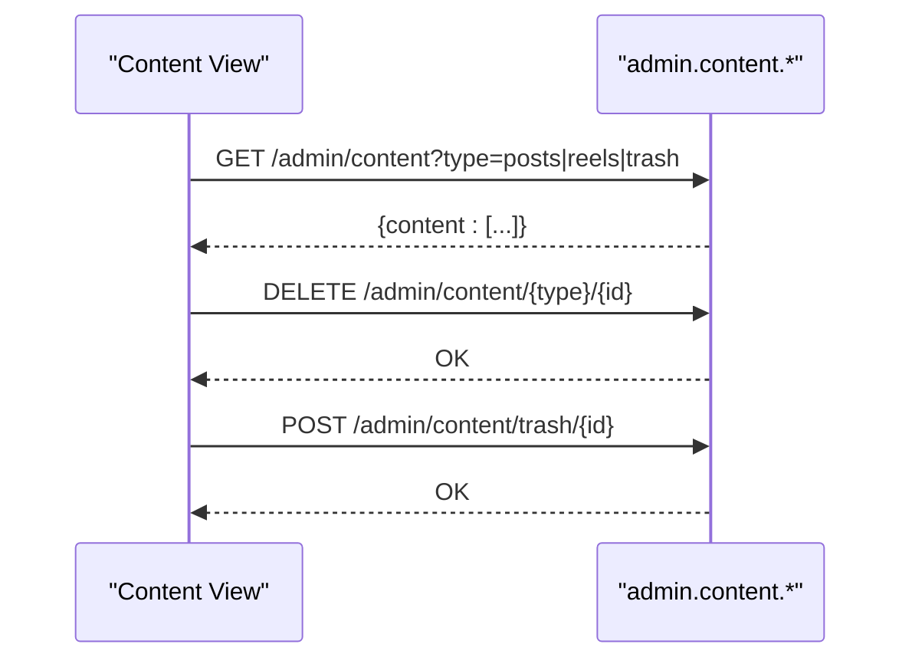
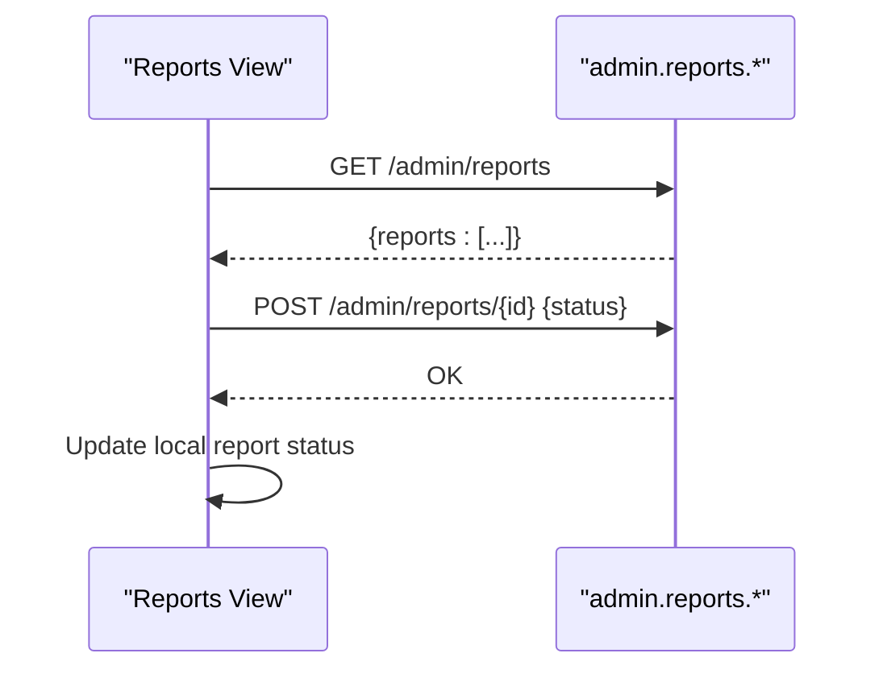
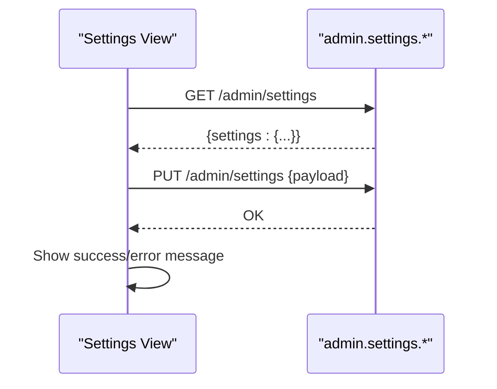
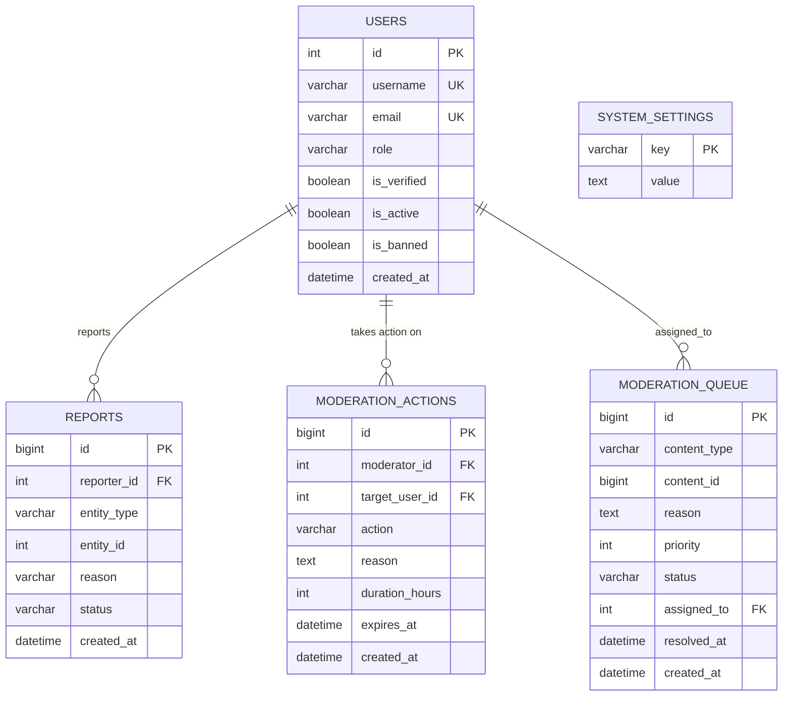
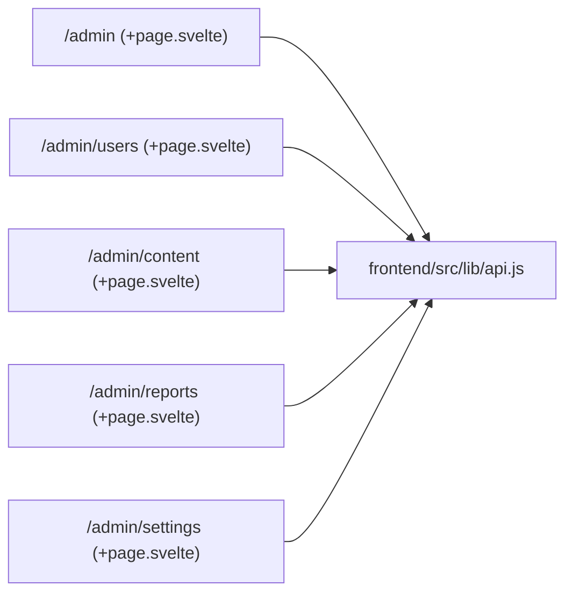

# Administration & Moderation

<cite>
**Referenced Files in This Document**
- [frontend/src/routes/admin/+page.svelte](file://frontend/src/routes/admin/+page.svelte)
- [frontend/src/routes/admin/users/+page.svelte](file://frontend/src/routes/admin/users/+page.svelte)
- [frontend/src/routes/admin/content/+page.svelte](file://frontend/src/routes/admin/content/+page.svelte)
- [frontend/src/routes/admin/reports/+page.svelte](file://frontend/src/routes/admin/reports/+page.svelte)
- [frontend/src/routes/admin/settings/+page.svelte](file://frontend/src/routes/admin/settings/+page.svelte)
- [frontend/src/lib/api.js](file://frontend/src/lib/api.js)
- [schema_sqlite.sql](file://schema_sqlite.sql)
- [migrations/001_schema.sql](file://migrations/001_schema.sql)
- [migrations/002_phase2.sql](file://migrations/002_phase2.sql)
</cite>

## Table of Contents
1. [Introduction](#introduction)
2. [Project Structure](#project-structure)
3. [Core Components](#core-components)
4. [Architecture Overview](#architecture-overview)
5. [Detailed Component Analysis](#detailed-component-analysis)
6. [Dependency Analysis](#dependency-analysis)
7. [Performance Considerations](#performance-considerations)
8. [Troubleshooting Guide](#troubleshooting-guide)
9. [Conclusion](#conclusion)
10. [Appendices](#appendices)

## Introduction
This document explains VSocial’s administrative and moderation tools from both the user interface and backend perspective. It covers:
- Admin dashboard metrics and recent activity/reports
- User management (listing, banning/unbanning)
- Content moderation (posts/reels, trash/restore/delete)
- Report handling (queue, resolution)
- System settings administration
- Backend schema supporting moderation and admin operations
- Practical moderation workflows, appeal processes, and scalability guidance

## Project Structure
The admin experience is implemented as SvelteKit routes under the admin namespace, backed by a centralized API client that maps to backend endpoints. The database schema defines moderation and admin-related domains.

**Diagram sources**
- [frontend/src/routes/admin/+page.svelte:1-357](file://frontend/src/routes/admin/+page.svelte#L1-L357)
- [frontend/src/routes/admin/users/+page.svelte:1-282](file://frontend/src/routes/admin/users/+page.svelte#L1-L282)
- [frontend/src/routes/admin/content/+page.svelte:1-245](file://frontend/src/routes/admin/content/+page.svelte#L1-L245)
- [frontend/src/routes/admin/reports/+page.svelte:1-151](file://frontend/src/routes/admin/reports/+page.svelte#L1-L151)
- [frontend/src/routes/admin/settings/+page.svelte:1-140](file://frontend/src/routes/admin/settings/+page.svelte#L1-L140)
- [frontend/src/lib/api.js:255-287](file://frontend/src/lib/api.js#L255-L287)

**Section sources**
- [frontend/src/routes/admin/+page.svelte:1-357](file://frontend/src/routes/admin/+page.svelte#L1-L357)
- [frontend/src/routes/admin/users/+page.svelte:1-282](file://frontend/src/routes/admin/users/+page.svelte#L1-L282)
- [frontend/src/routes/admin/content/+page.svelte:1-245](file://frontend/src/routes/admin/content/+page.svelte#L1-L245)
- [frontend/src/routes/admin/reports/+page.svelte:1-151](file://frontend/src/routes/admin/reports/+page.svelte#L1-L151)
- [frontend/src/routes/admin/settings/+page.svelte:1-140](file://frontend/src/routes/admin/settings/+page.svelte#L1-L140)
- [frontend/src/lib/api.js:255-287](file://frontend/src/lib/api.js#L255-L287)

## Core Components
- Admin Dashboard: Loads platform metrics, recent activity, and pending reports.
- Users Management: Lists users, supports live search, and toggles ban/unban.
- Content Moderation: Browses posts/reels/trash, deletes content, restores items.
- Reports Queue: Views pending reports and resolves them (dismissed/resolved).
- System Settings: Retrieves and updates global settings (site name, registration, upload limits).

**Section sources**
- [frontend/src/routes/admin/+page.svelte:10-23](file://frontend/src/routes/admin/+page.svelte#L10-L23)
- [frontend/src/routes/admin/users/+page.svelte:14-24](file://frontend/src/routes/admin/users/+page.svelte#L14-L24)
- [frontend/src/routes/admin/content/+page.svelte:15-25](file://frontend/src/routes/admin/content/+page.svelte#L15-L25)
- [frontend/src/routes/admin/reports/+page.svelte:13-23](file://frontend/src/routes/admin/reports/+page.svelte#L13-L23)
- [frontend/src/routes/admin/settings/+page.svelte:15-30](file://frontend/src/routes/admin/settings/+page.svelte#L15-L30)

## Architecture Overview
The admin UI communicates with backend endpoints via a shared API client. The backend schema defines moderation and admin domains (reports, moderation actions, system settings).

**Diagram sources**
- [frontend/src/lib/api.js:255-287](file://frontend/src/lib/api.js#L255-L287)
- [frontend/src/routes/admin/+page.svelte:12-15](file://frontend/src/routes/admin/+page.svelte#L12-L15)
- [frontend/src/routes/admin/users/+page.svelte:17-37](file://frontend/src/routes/admin/users/+page.svelte#L17-L37)
- [frontend/src/routes/admin/content/+page.svelte:46-64](file://frontend/src/routes/admin/content/+page.svelte#L46-L64)
- [frontend/src/routes/admin/reports/+page.svelte:27-37](file://frontend/src/routes/admin/reports/+page.svelte#L27-L37)
- [frontend/src/routes/admin/settings/+page.svelte:37-42](file://frontend/src/routes/admin/settings/+page.svelte#L37-L42)

## Detailed Component Analysis

### Admin Dashboard
- Fetches stats, recent activity, and recent reports.
- Provides quick navigation to reports list.
- Uses a helper to render relative timestamps.

**Diagram sources**
- [frontend/src/lib/api.js](file://frontend/src/lib/api.js#L256)
- [frontend/src/routes/admin/+page.svelte:12-15](file://frontend/src/routes/admin/+page.svelte#L12-L15)

**Section sources**
- [frontend/src/routes/admin/+page.svelte:10-23](file://frontend/src/routes/admin/+page.svelte#L10-L23)
- [frontend/src/lib/api.js](file://frontend/src/lib/api.js#L256)

### Users Management
- Lists users with search-as-you-type (debounced).
- Toggles ban state per user and updates UI reactively.
- Prevents self-ban of protected account.

**Diagram sources**
- [frontend/src/lib/api.js:257-266](file://frontend/src/lib/api.js#L257-L266)
- [frontend/src/routes/admin/users/+page.svelte:17-37](file://frontend/src/routes/admin/users/+page.svelte#L17-L37)

**Section sources**
- [frontend/src/routes/admin/users/+page.svelte:14-52](file://frontend/src/routes/admin/users/+page.svelte#L14-L52)
- [frontend/src/lib/api.js:257-266](file://frontend/src/lib/api.js#L257-L266)

### Content Moderation
- Switches between posts, reels, and trash views.
- Deletes content (moves to trash or permanent deletion depending on type).
- Restores items from trash.

**Diagram sources**
- [frontend/src/lib/api.js:274-281](file://frontend/src/lib/api.js#L274-L281)
- [frontend/src/routes/admin/content/+page.svelte:18-64](file://frontend/src/routes/admin/content/+page.svelte#L18-L64)

**Section sources**
- [frontend/src/routes/admin/content/+page.svelte:15-73](file://frontend/src/routes/admin/content/+page.svelte#L15-L73)
- [frontend/src/lib/api.js:274-281](file://frontend/src/lib/api.js#L274-L281)

### Reports Queue
- Loads pending reports and allows resolving with “dismissed” or “resolved”.
- Updates local state after successful resolution.

**Diagram sources**
- [frontend/src/lib/api.js:267-273](file://frontend/src/lib/api.js#L267-L273)
- [frontend/src/routes/admin/reports/+page.svelte:16-37](file://frontend/src/routes/admin/reports/+page.svelte#L16-L37)

**Section sources**
- [frontend/src/routes/admin/reports/+page.svelte:13-38](file://frontend/src/routes/admin/reports/+page.svelte#L13-L38)
- [frontend/src/lib/api.js:267-273](file://frontend/src/lib/api.js#L267-L273)

### System Settings
- Loads current settings and updates them with a form submission.
- Shows success/error feedback.

**Diagram sources**
- [frontend/src/lib/api.js:282-285](file://frontend/src/lib/api.js#L282-L285)
- [frontend/src/routes/admin/settings/+page.svelte:17-49](file://frontend/src/routes/admin/settings/+page.svelte#L17-L49)

**Section sources**
- [frontend/src/routes/admin/settings/+page.svelte:15-49](file://frontend/src/routes/admin/settings/+page.svelte#L15-L49)
- [frontend/src/lib/api.js:282-285](file://frontend/src/lib/api.js#L282-L285)

### Backend Schema Supporting Admin/Moderation
- Users table includes roles, verification, activity, and ban flags.
- Reports table tracks reported entities and statuses.
- Moderation queue and actions tables support structured moderation workflows.
- System settings table stores global configuration.

**Diagram sources**
- [schema_sqlite.sql:13-48](file://schema_sqlite.sql#L13-L48)
- [schema_sqlite.sql:445-453](file://schema_sqlite.sql#L445-L453)
- [schema_sqlite.sql:459-462](file://schema_sqlite.sql#L459-L462)
- [migrations/001_schema.sql:16-43](file://migrations/001_schema.sql#L16-L43)
- [migrations/001_schema.sql:408-420](file://migrations/001_schema.sql#L408-L420)
- [migrations/001_schema.sql:558-563](file://migrations/001_schema.sql#L558-L563)

**Section sources**
- [schema_sqlite.sql:13-48](file://schema_sqlite.sql#L13-L48)
- [schema_sqlite.sql:445-453](file://schema_sqlite.sql#L445-L453)
- [schema_sqlite.sql:459-462](file://schema_sqlite.sql#L459-L462)
- [migrations/001_schema.sql:16-43](file://migrations/001_schema.sql#L16-L43)
- [migrations/001_schema.sql:408-420](file://migrations/001_schema.sql#L408-L420)
- [migrations/001_schema.sql:558-563](file://migrations/001_schema.sql#L558-L563)

## Dependency Analysis
- Admin UI components depend on a single API client module for all admin endpoints.
- The API client encapsulates auth headers and error handling.
- Backend endpoints are grouped under /admin and mirror UI capabilities.

**Diagram sources**
- [frontend/src/lib/api.js:255-287](file://frontend/src/lib/api.js#L255-L287)
- [frontend/src/routes/admin/+page.svelte:1-50](file://frontend/src/routes/admin/+page.svelte#L1-L50)
- [frontend/src/routes/admin/users/+page.svelte:1-50](file://frontend/src/routes/admin/users/+page.svelte#L1-L50)
- [frontend/src/routes/admin/content/+page.svelte:1-80](file://frontend/src/routes/admin/content/+page.svelte#L1-L80)
- [frontend/src/routes/admin/reports/+page.svelte:1-50](file://frontend/src/routes/admin/reports/+page.svelte#L1-L50)
- [frontend/src/routes/admin/settings/+page.svelte:1-60](file://frontend/src/routes/admin/settings/+page.svelte#L1-L60)

**Section sources**
- [frontend/src/lib/api.js:255-287](file://frontend/src/lib/api.js#L255-L287)

## Performance Considerations
- Debounced search in users management reduces network requests during typing.
- Pagination and filtering parameters are supported by the API client; leverage them on the backend to avoid large payloads.
- Indexes in the schema (e.g., posts, reels, notifications) improve query performance for feeds and moderation queries.
- For large-scale moderation:
  - Batch operations should be implemented on the backend for bulk user actions and content moderation.
  - Asynchronous processing (queues) for heavy tasks (bulk deletions, analytics generation).
  - Caching of frequently accessed dashboards and report summaries.

[No sources needed since this section provides general guidance]

## Troubleshooting Guide
- Authentication failures: Ensure the Bearer token is present in localStorage and attached by the API client.
- Empty responses: The API client checks content-type and throws errors for non-JSON responses.
- Network errors: UI components surface generic errors; inspect browser network tab for status codes.

**Section sources**
- [frontend/src/lib/api.js:12-46](file://frontend/src/lib/api.js#L12-L46)

## Conclusion
VSocial’s admin panel provides a cohesive set of tools for monitoring, user management, content moderation, and system configuration. The UI is thin and relies on a centralized API client, while the backend schema supports robust moderation workflows and settings management. Extending the backend with batch operations and asynchronous queues will further improve scalability for large user bases.

[No sources needed since this section summarizes without analyzing specific files]

## Appendices

### API Endpoint Reference (Admin)
- GET /admin/dashboard
- GET /admin/users?q=search
- GET /admin/users/{id}
- PUT /admin/users/{id}
- POST /admin/users/ban
- POST /admin/users/unban
- GET /admin/content?type=posts|reels|trash
- DELETE /admin/content/{type}/{id}
- POST /admin/content/trash/{id}
- GET /admin/reports
- POST /admin/reports/{id}
- GET /admin/settings
- PUT /admin/settings
- GET /admin/analytics

**Section sources**
- [frontend/src/lib/api.js:256-287](file://frontend/src/lib/api.js#L256-L287)

### Practical Moderation Workflows
- Flagging content: Use content moderation screens to delete or move to trash; restore if needed.
- Resolving reports: Review pending reports and mark as dismissed or resolved.
- User safety: Ban users when necessary; ensure protected accounts cannot be self-banned.
- Appeals: Extend the reports schema to include appeals and escalation fields; add UI to track appeal status.

[No sources needed since this section provides general guidance]

### Scalability Guidance
- Use pagination and filters for users/content/reports lists.
- Offload heavy operations (bulk bans, analytics) to background jobs.
- Add rate limiting and audit logs for admin actions.
- Monitor slow queries and add appropriate indexes for moderation tables.

[No sources needed since this section provides general guidance]