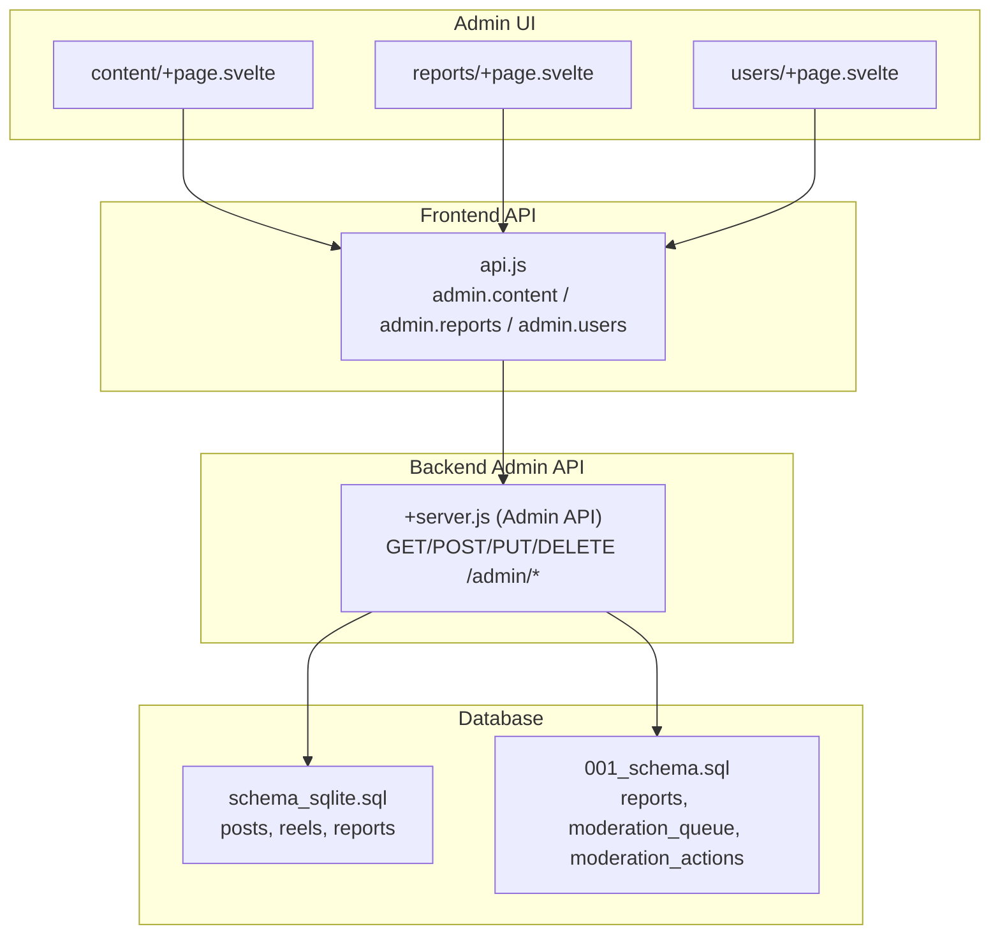
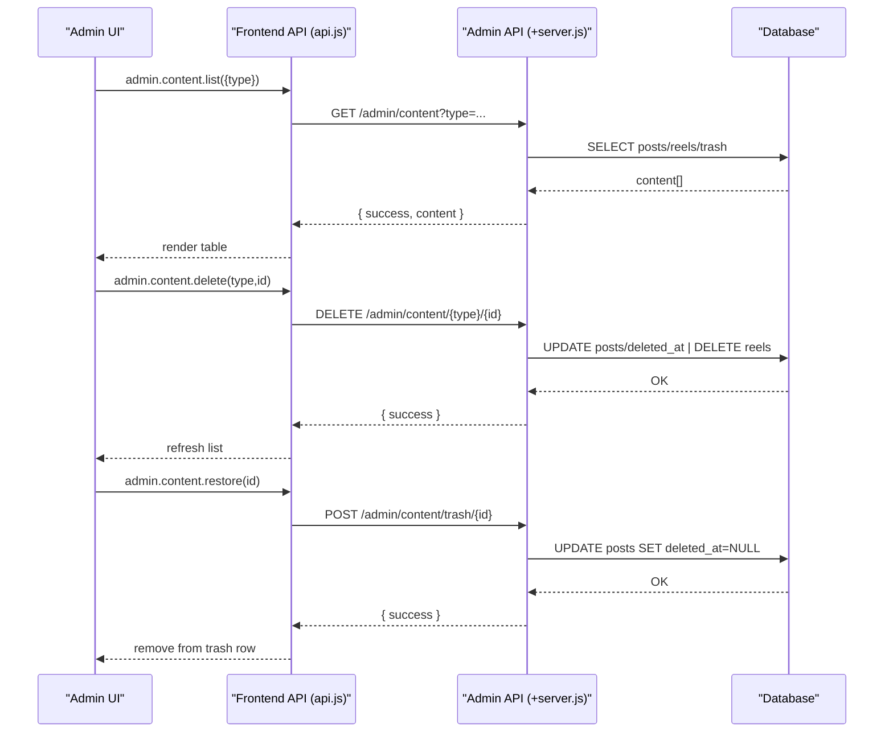
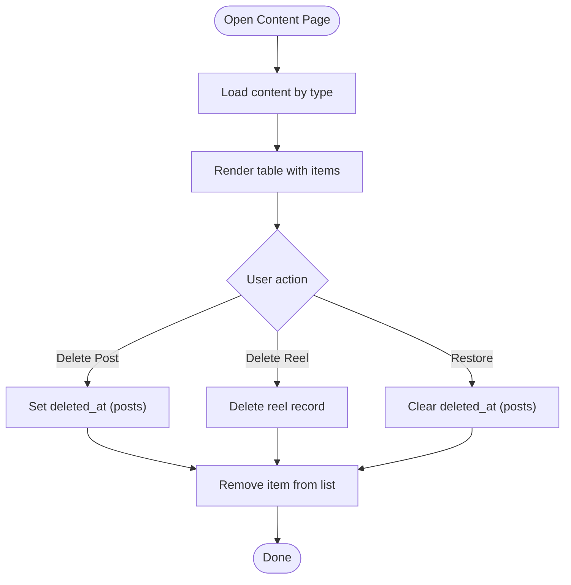
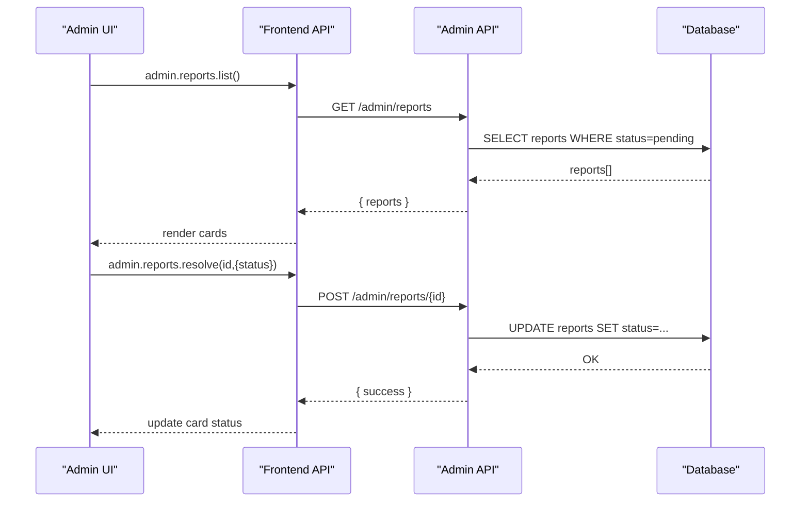
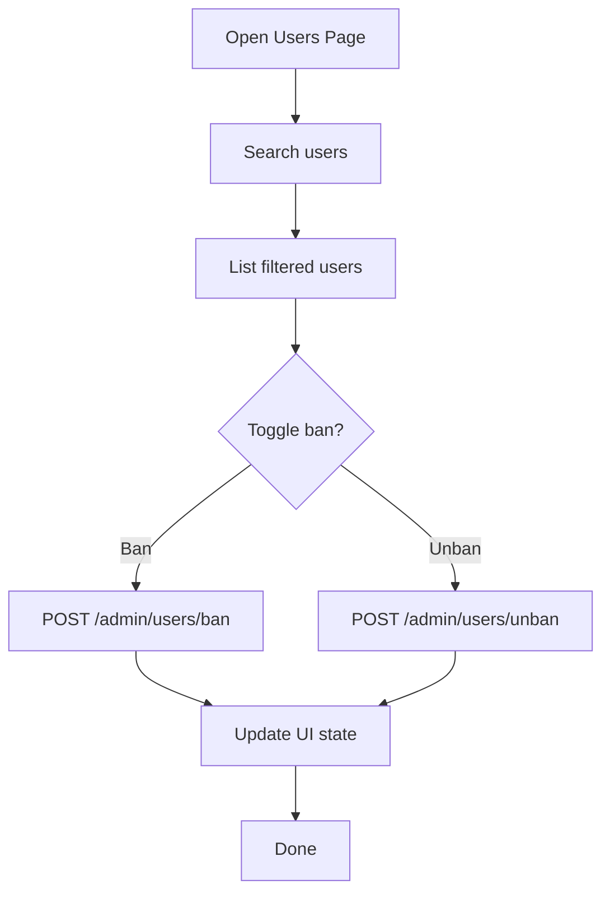
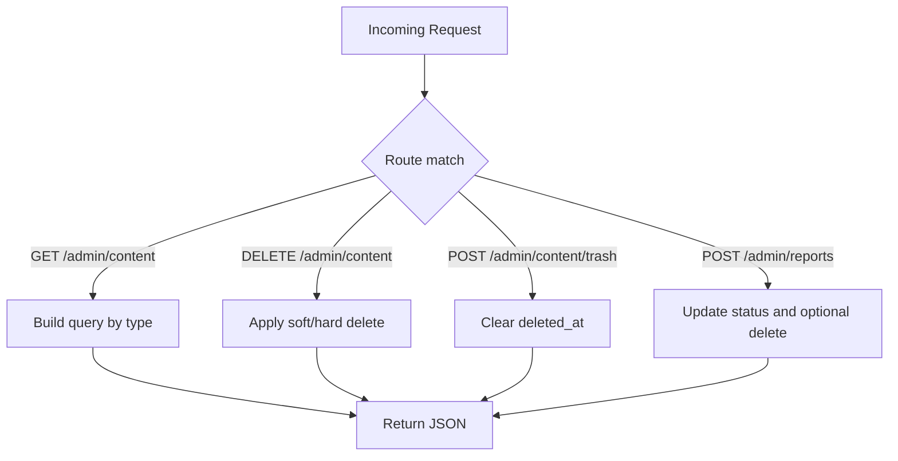
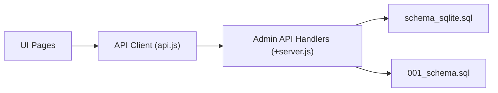

# Content Moderation

<cite>
**Referenced Files in This Document**
- [content/+page.svelte](file://frontend/src/routes/admin/content/+page.svelte)
- [reports/+page.svelte](file://frontend/src/routes/admin/reports/+page.svelte)
- [users/+page.svelte](file://frontend/src/routes/admin/users/+page.svelte)
- [api.js](file://frontend/src/lib/api.js)
- [+server.js (Admin API)](file://frontend/src/routes/api/admin/[...path]/+server.js)
- [schema_sqlite.sql](file://schema_sqlite.sql)
- [001_schema.sql](file://migrations/001_schema.sql)
</cite>

## Table of Contents
1. [Introduction](#introduction)
2. [Project Structure](#project-structure)
3. [Core Components](#core-components)
4. [Architecture Overview](#architecture-overview)
5. [Detailed Component Analysis](#detailed-component-analysis)
6. [Dependency Analysis](#dependency-analysis)
7. [Performance Considerations](#performance-considerations)
8. [Troubleshooting Guide](#troubleshooting-guide)
9. [Conclusion](#conclusion)

## Introduction
This document describes VSocial’s content moderation system with a focus on the administrative content management interface for posts and reels, moderation workflows, and supporting backend APIs. It covers:
- Content filtering and visibility controls
- Removal workflows and trash management
- Moderation dashboard features (sorting, bulk actions, categorization)
- Deletion and restoration processes
- Practical moderation workflows, automated detection, and manual moderation
- Takedown procedures, appeals handling, and content preservation for legal compliance

## Project Structure
The moderation surface area spans:
- Admin UI pages for content, reports, users, and settings
- Frontend API client module exposing typed admin endpoints
- Backend admin API handlers implementing CRUD and moderation actions
- Database schema supporting posts, reels, reports, and moderation metadata



**Diagram sources**
- [content/+page.svelte:1-245](file://frontend/src/routes/admin/content/+page.svelte#L1-L245)
- [reports/+page.svelte:1-151](file://frontend/src/routes/admin/reports/+page.svelte#L1-L151)
- [users/+page.svelte:1-282](file://frontend/src/routes/admin/users/+page.svelte#L1-L282)
- [api.js:253-287](file://frontend/src/lib/api.js#L253-L287)
- [+server.js (Admin API):8-127](file://frontend/src/routes/api/admin/[...path]/+server.js#L8-L127)
- [schema_sqlite.sql:107-125](file://schema_sqlite.sql#L107-L125)
- [schema_sqlite.sql:215-228](file://schema_sqlite.sql#L215-L228)
- [schema_sqlite.sql:445-453](file://schema_sqlite.sql#L445-L453)
- [001_schema.sql:408-451](file://migrations/001_schema.sql#L408-L451)

**Section sources**
- [content/+page.svelte:1-245](file://frontend/src/routes/admin/content/+page.svelte#L1-L245)
- [reports/+page.svelte:1-151](file://frontend/src/routes/admin/reports/+page.svelte#L1-L151)
- [users/+page.svelte:1-282](file://frontend/src/routes/admin/users/+page.svelte#L1-L282)
- [api.js:253-287](file://frontend/src/lib/api.js#L253-L287)
- [+server.js (Admin API):8-127](file://frontend/src/routes/api/admin/[...path]/+server.js#L8-L127)
- [schema_sqlite.sql:107-125](file://schema_sqlite.sql#L107-L125)
- [schema_sqlite.sql:215-228](file://schema_sqlite.sql#L215-L228)
- [schema_sqlite.sql:445-453](file://schema_sqlite.sql#L445-L453)
- [001_schema.sql:408-451](file://migrations/001_schema.sql#L408-L451)

## Core Components
- Admin Content Management Page
  - Lists posts and reels, supports switching views and trash
  - Provides per-item delete and restore actions
  - Uses admin API endpoints for listing, deleting, and restoring content
- Admin Reports Queue
  - Displays pending reports with resolution actions
  - Resolves reports and optionally deletes associated content
- Admin Users Management
  - Supports banning/unbanning users and searching/filtering
- Admin API Client
  - Exposes typed endpoints for content, reports, users, settings, and analytics
- Backend Admin API Handlers
  - Implements listing, deletion, restoration, and report resolution
  - Enforces admin-only access and applies moderation actions
- Database Schema
  - Defines posts, reels, and reports tables
  - Includes moderation-related tables and fields for queue and actions

**Section sources**
- [content/+page.svelte:15-74](file://frontend/src/routes/admin/content/+page.svelte#L15-L74)
- [reports/+page.svelte:13-38](file://frontend/src/routes/admin/reports/+page.svelte#L13-L38)
- [users/+page.svelte:14-44](file://frontend/src/routes/admin/users/+page.svelte#L14-L44)
- [api.js:274-281](file://frontend/src/lib/api.js#L274-L281)
- [+server.js (Admin API):84-95](file://frontend/src/routes/api/admin/[...path]/+server.js#L84-L95)
- [+server.js (Admin API):156-166](file://frontend/src/routes/api/admin/[...path]/+server.js#L156-L166)
- [+server.js (Admin API):176-183](file://frontend/src/routes/api/admin/[...path]/+server.js#L176-L183)
- [schema_sqlite.sql:107-125](file://schema_sqlite.sql#L107-L125)
- [schema_sqlite.sql:215-228](file://schema_sqlite.sql#L215-L228)
- [schema_sqlite.sql:445-453](file://schema_sqlite.sql#L445-L453)
- [001_schema.sql:408-451](file://migrations/001_schema.sql#L408-L451)

## Architecture Overview
The moderation architecture follows a clear separation of concerns:
- UI renders lists and actions
- API client encapsulates HTTP requests and auth
- Backend handlers enforce permissions and operate on database tables
- Database persists content, reports, and moderation state



**Diagram sources**
- [content/+page.svelte:15-74](file://frontend/src/routes/admin/content/+page.svelte#L15-L74)
- [api.js:274-281](file://frontend/src/lib/api.js#L274-L281)
- [+server.js (Admin API):84-95](file://frontend/src/routes/api/admin/[...path]/+server.js#L84-L95)
- [+server.js (Admin API):237-248](file://frontend/src/routes/api/admin/[...path]/+server.js#L237-L248)
- [+server.js (Admin API):176-183](file://frontend/src/routes/api/admin/[...path]/+server.js#L176-L183)

## Detailed Component Analysis

### Admin Content Management Page
Responsibilities:
- Switch between posts, reels, and trash views
- List content with author, preview, date, and engagement metrics
- Delete content (move to trash for posts, permanent delete for reels)
- Restore content from trash

Key behaviors:
- Loading state and empty state handling
- Confirmation modal for destructive actions
- Real-time UI updates after successful operations



**Diagram sources**
- [content/+page.svelte:15-74](file://frontend/src/routes/admin/content/+page.svelte#L15-L74)
- [+server.js (Admin API):84-95](file://frontend/src/routes/api/admin/[...path]/+server.js#L84-L95)
- [+server.js (Admin API):237-248](file://frontend/src/routes/api/admin/[...path]/+server.js#L237-L248)
- [+server.js (Admin API):176-183](file://frontend/src/routes/api/admin/[...path]/+server.js#L176-L183)

**Section sources**
- [content/+page.svelte:15-74](file://frontend/src/routes/admin/content/+page.svelte#L15-L74)
- [+server.js (Admin API):84-95](file://frontend/src/routes/api/admin/[...path]/+server.js#L84-L95)
- [+server.js (Admin API):237-248](file://frontend/src/routes/api/admin/[...path]/+server.js#L237-L248)
- [+server.js (Admin API):176-183](file://frontend/src/routes/api/admin/[...path]/+server.js#L176-L183)

### Admin Reports Queue
Responsibilities:
- Fetch and display pending reports
- Resolve reports as dismissed or resolved
- Optionally delete associated content when resolved



**Diagram sources**
- [reports/+page.svelte:13-38](file://frontend/src/routes/admin/reports/+page.svelte#L13-L38)
- [api.js:267-273](file://frontend/src/lib/api.js#L267-L273)
- [+server.js (Admin API):70-82](file://frontend/src/routes/api/admin/[...path]/+server.js#L70-L82)
- [+server.js (Admin API):156-166](file://frontend/src/routes/api/admin/[...path]/+server.js#L156-L166)

**Section sources**
- [reports/+page.svelte:13-38](file://frontend/src/routes/admin/reports/+page.svelte#L13-L38)
- [api.js:267-273](file://frontend/src/lib/api.js#L267-L273)
- [+server.js (Admin API):70-82](file://frontend/src/routes/api/admin/[...path]/+server.js#L70-L82)
- [+server.js (Admin API):156-166](file://frontend/src/routes/api/admin/[...path]/+server.js#L156-L166)

### Admin Users Management
Responsibilities:
- Search and filter users
- Toggle ban/unban state
- Reflect user status changes immediately



**Diagram sources**
- [users/+page.svelte:14-44](file://frontend/src/routes/admin/users/+page.svelte#L14-L44)
- [api.js:257-266](file://frontend/src/lib/api.js#L257-L266)
- [+server.js (Admin API):137-154](file://frontend/src/routes/api/admin/[...path]/+server.js#L137-L154)

**Section sources**
- [users/+page.svelte:14-44](file://frontend/src/routes/admin/users/+page.svelte#L14-L44)
- [api.js:257-266](file://frontend/src/lib/api.js#L257-L266)
- [+server.js (Admin API):137-154](file://frontend/src/routes/api/admin/[...path]/+server.js#L137-L154)

### Backend Admin API Handlers
Endpoints and behaviors:
- GET /admin/content?type=posts|reels|trash
  - Returns paginated content with author info
- DELETE /admin/content/post/{id}
  - Soft-deletes posts by setting deleted_at
- DELETE /admin/content/reel/{id}
  - Permanently deletes reels
- DELETE /admin/content/trash/{id}
  - Permanently deletes posts in trash
- POST /admin/content/trash/{id}
  - Restores posts by clearing deleted_at
- POST /admin/reports/{id}
  - Updates report status; optionally deletes content when resolved



**Diagram sources**
- [+server.js (Admin API):8-127](file://frontend/src/routes/api/admin/[...path]/+server.js#L8-L127)
- [+server.js (Admin API):224-260](file://frontend/src/routes/api/admin/[...path]/+server.js#L224-L260)
- [+server.js (Admin API):156-166](file://frontend/src/routes/api/admin/[...path]/+server.js#L156-L166)

**Section sources**
- [+server.js (Admin API):8-127](file://frontend/src/routes/api/admin/[...path]/+server.js#L8-L127)
- [+server.js (Admin API):224-260](file://frontend/src/routes/api/admin/[...path]/+server.js#L224-L260)
- [+server.js (Admin API):156-166](file://frontend/src/routes/api/admin/[...path]/+server.js#L156-L166)

### Database Schema and Moderation Tables
Tables involved:
- posts: content with soft-delete via deleted_at
- reels: media content with counts and timestamps
- reports: user-reported content with status
- Additional moderation tables in migration schema:
  - moderation_queue: queued moderation tasks
  - moderation_actions: enforcement actions against users/content
  - banned_users: persistent bans

```mermaid
erDiagram
POSTS {
integer id PK
integer user_id FK
text body
varchar privacy
integer like_count
integer comment_count
integer share_count
boolean is_pinned
boolean is_promoted
float promotion_score
varchar privacy_level
datetime scheduled_at
varchar status
datetime deleted_at
datetime created_at
datetime updated_at
}
REELS {
integer id PK
integer user_id FK
varchar video_url
varchar thumbnail_url
text caption
integer duration_seconds
integer view_count
integer like_count
integer comment_count
integer share_count
boolean is_active
datetime created_at
}
REPORTS {
integer id PK
integer reporter_id FK
varchar entity_type
integer entity_id
text reason
varchar status
datetime created_at
}
MOD_QUEUE {
integer id PK
varchar content_type
integer content_id
text reason
integer priority
varchar status
integer assigned_to FK
datetime resolved_at
datetime created_at
}
MOD_ACTIONS {
integer id PK
integer moderator_id FK
integer target_user_id FK
varchar action
text reason
integer duration_hours
datetime expires_at
datetime created_at
}
BANNED_USERS {
integer user_id PK FK
text reason
integer banned_by FK
datetime banned_at
datetime expires_at
}
POSTS ||--o{ REPORTS : "referenced by"
REELS ||--o{ REPORTS : "referenced by"
USERS ||--o{ REPORTS : "reported by"
USERS ||--o{ MOD_ACTIONS : "performed by"
USERS ||--o{ BANNED_USERS : "banned"
```

**Diagram sources**
- [schema_sqlite.sql:107-125](file://schema_sqlite.sql#L107-L125)
- [schema_sqlite.sql:215-228](file://schema_sqlite.sql#L215-L228)
- [schema_sqlite.sql:445-453](file://schema_sqlite.sql#L445-L453)
- [001_schema.sql:408-451](file://migrations/001_schema.sql#L408-L451)

**Section sources**
- [schema_sqlite.sql:107-125](file://schema_sqlite.sql#L107-L125)
- [schema_sqlite.sql:215-228](file://schema_sqlite.sql#L215-L228)
- [schema_sqlite.sql:445-453](file://schema_sqlite.sql#L445-L453)
- [001_schema.sql:408-451](file://migrations/001_schema.sql#L408-L451)

## Dependency Analysis
- UI depends on the API client for all admin operations
- API client depends on centralized request helper with auth token injection
- Backend handlers depend on database access and admin authentication middleware
- Database schema defines referential integrity and indexes for moderation queries



**Diagram sources**
- [api.js:20-46](file://frontend/src/lib/api.js#L20-L46)
- [+server.js (Admin API):4-11](file://frontend/src/routes/api/admin/[...path]/+server.js#L4-L11)
- [schema_sqlite.sql:107-125](file://schema_sqlite.sql#L107-L125)
- [001_schema.sql:408-451](file://migrations/001_schema.sql#L408-L451)

**Section sources**
- [api.js:20-46](file://frontend/src/lib/api.js#L20-L46)
- [+server.js (Admin API):4-11](file://frontend/src/routes/api/admin/[...path]/+server.js#L4-L11)
- [schema_sqlite.sql:107-125](file://schema_sqlite.sql#L107-L125)
- [001_schema.sql:408-451](file://migrations/001_schema.sql#L408-L451)

## Performance Considerations
- Pagination and limits are enforced in backend handlers to avoid large result sets
- Indexes exist on frequently queried columns (e.g., posts user and created_at, reels user and popularity)
- Sorting defaults to most recent creation time for timely moderation workflows
- Recommendations:
  - Add pagination parameters to content listing endpoints
  - Introduce filters by status, author, and date range
  - Cache recent moderation stats for dashboards

[No sources needed since this section provides general guidance]

## Troubleshooting Guide
Common issues and resolutions:
- Authentication failures
  - Ensure admin-only endpoints are protected and tokens are present
- Empty content lists
  - Verify type parameter and pagination limits
- Delete/restore errors
  - Confirm correct type and IDs; check backend logs for constraint violations
- Report resolution failures
  - Validate report ID and payload; ensure delete_content flag is used appropriately

**Section sources**
- [+server.js (Admin API):11-11](file://frontend/src/routes/api/admin/[...path]/+server.js#L11-L11)
- [+server.js (Admin API):224-260](file://frontend/src/routes/api/admin/[...path]/+server.js#L224-L260)
- [+server.js (Admin API):156-166](file://frontend/src/routes/api/admin/[...path]/+server.js#L156-L166)

## Conclusion
VSocial’s moderation system combines a straightforward admin UI with robust backend endpoints and a clear database model. The current implementation supports:
- Listing and filtering posts and reels
- Deleting and restoring content
- Resolving reports and optionally removing reported content
- Managing user bans

To enhance compliance and scalability, consider adding explicit moderation categories, bulk actions, audit trails, and advanced reporting for legal preservation and appeals workflows.