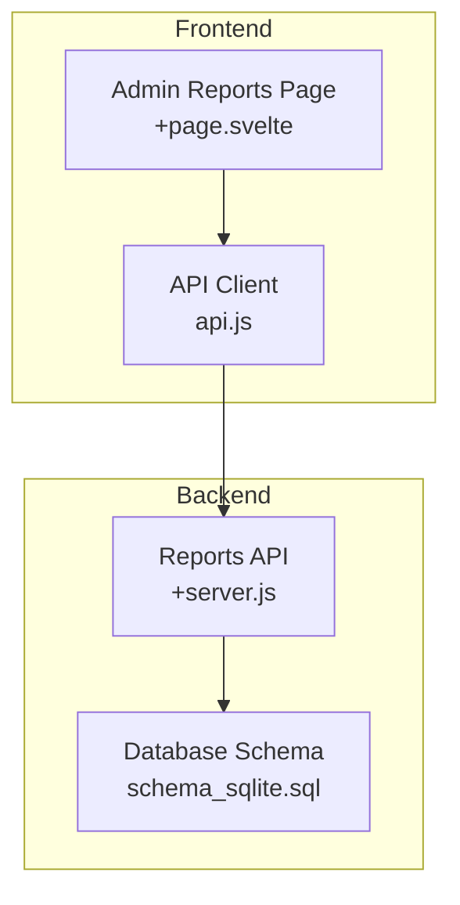
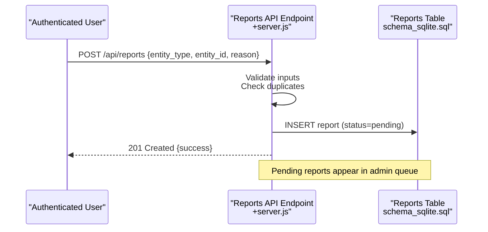
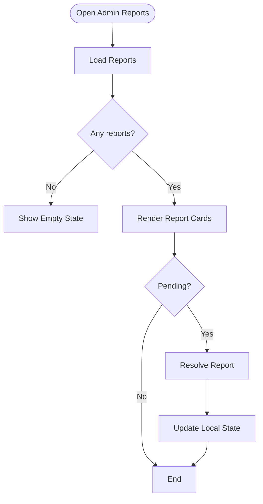
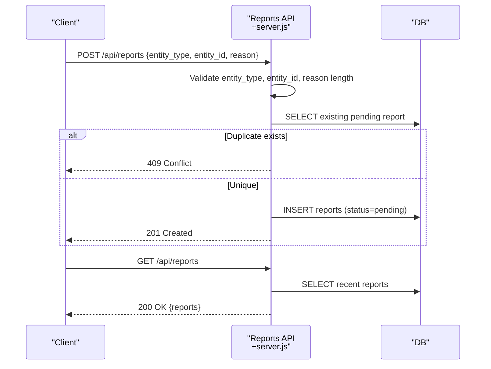
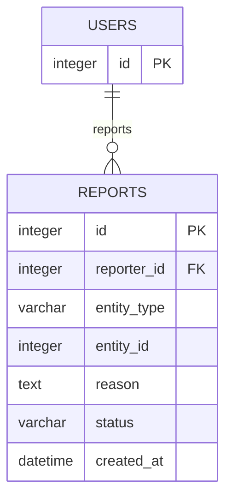
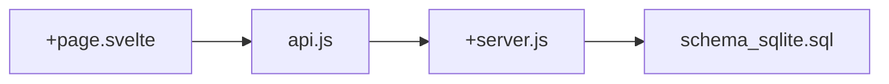

# Report & Appeal System

<cite>
**Referenced Files in This Document**
- [+page.svelte](file://frontend/src/routes/admin/reports/+page.svelte)
- [+server.js](file://frontend/src/routes/api/reports/+server.js)
- [api.js](file://frontend/src/lib/api.js)
- [schema_sqlite.sql](file://schema_sqlite.sql)
- [001_schema.sql](file://migrations/001_schema.sql)
- [002_phase2.sql](file://migrations/002_phase2.sql)
</cite>

## Table of Contents
1. [Introduction](#introduction)
2. [Project Structure](#project-structure)
3. [Core Components](#core-components)
4. [Architecture Overview](#architecture-overview)
5. [Detailed Component Analysis](#detailed-component-analysis)
6. [Dependency Analysis](#dependency-analysis)
7. [Performance Considerations](#performance-considerations)
8. [Troubleshooting Guide](#troubleshooting-guide)
9. [Conclusion](#conclusion)
10. [Appendices](#appendices)

## Introduction
This document describes VSocial's report handling and appeal management system. It explains how users submit reports, how reports are categorized and triaged, how moderators review and act on reports, and how the system tracks outcomes. It also outlines the current state of appeal functionality and provides recommendations for extending the system to support appeals and advanced moderation workflows.

## Project Structure
The report system spans three primary areas:
- Frontend admin interface for moderators to view and resolve reports
- Frontend API client module exposing admin report endpoints
- Backend API endpoints for report creation and listing, and the underlying database schema

**Diagram sources**
- [+page.svelte:1-151](file://frontend/src/routes/admin/reports/+page.svelte#L1-L151)
- [api.js:255-287](file://frontend/src/lib/api.js#L255-L287)
- [+server.js:1-39](file://frontend/src/routes/api/reports/+server.js#L1-L39)
- [schema_sqlite.sql:445-453](file://schema_sqlite.sql#L445-L453)

**Section sources**
- [+page.svelte:1-151](file://frontend/src/routes/admin/reports/+page.svelte#L1-L151)
- [api.js:255-287](file://frontend/src/lib/api.js#L255-L287)
- [+server.js:1-39](file://frontend/src/routes/api/reports/+server.js#L1-L39)
- [schema_sqlite.sql:445-453](file://schema_sqlite.sql#L445-L453)

## Core Components
- Admin Reports UI: Displays pending reports, allows moderators to dismiss or resolve reports, and shows report metadata (entity type/id, reason, reporter).
- Reports API: Handles report creation (POST) and listing (GET) for the authenticated user.
- Database Schema: Defines the reports table with fields for reporter, entity reference, reason, and status.

Key capabilities currently implemented:
- Report submission with validation (entity type, entity id, reason length)
- Prevention of duplicate pending reports by the same user for the same entity
- Listing of user's recent reports
- Admin UI for moderators to view and resolve reports

Planned extensions (not yet implemented):
- Appeal requests for resolved reports
- Escalation workflows
- Automated flagging and triage rules
- Advanced moderation actions (warnings, temporary restrictions, bans)
- Statistics and trend analysis dashboards

**Section sources**
- [+page.svelte:13-38](file://frontend/src/routes/admin/reports/+page.svelte#L13-L38)
- [+server.js:10-38](file://frontend/src/routes/api/reports/+server.js#L10-L38)
- [schema_sqlite.sql:445-453](file://schema_sqlite.sql#L445-L453)

## Architecture Overview
The report lifecycle involves user submission, backend validation and persistence, and moderator review.

**Diagram sources**
- [+server.js:10-31](file://frontend/src/routes/api/reports/+server.js#L10-L31)
- [schema_sqlite.sql:445-453](file://schema_sqlite.sql#L445-L453)

## Detailed Component Analysis

### Admin Reports Interface
The admin page lists pending reports and allows moderators to dismiss or resolve them. It fetches reports via the admin API client and updates the UI state after actions.

**Diagram sources**
- [+page.svelte:9-38](file://frontend/src/routes/admin/reports/+page.svelte#L9-L38)

**Section sources**
- [+page.svelte:1-151](file://frontend/src/routes/admin/reports/+page.svelte#L1-L151)

### Reports API (User)
Handles report creation and retrieval for the authenticated user.

**Diagram sources**
- [+server.js:10-38](file://frontend/src/routes/api/reports/+server.js#L10-L38)

**Section sources**
- [+server.js:1-39](file://frontend/src/routes/api/reports/+server.js#L1-L39)

### Database Schema (Reports)
The reports table captures reporter identity, target entity, reason, and status. It supports indexing on reporter and status for efficient queries.

**Diagram sources**
- [schema_sqlite.sql:445-453](file://schema_sqlite.sql#L445-L453)

**Section sources**
- [schema_sqlite.sql:445-453](file://schema_sqlite.sql#L445-L453)

### Moderation Queue and Actions (Migration Data)
The migration schema defines additional moderation structures that can be leveraged to enhance the report system:
- moderation_queue: central queue for moderation tasks with priority and assignment
- moderation_actions: audit trail of moderator actions against users
- banned_users: records of user bans

These tables provide a foundation for escalation, auditing, and advanced moderation workflows.

**Section sources**
- [001_schema.sql:421-450](file://migrations/001_schema.sql#L421-L450)

## Dependency Analysis
The admin reports UI depends on the API client, which encapsulates base URL and auth headers. The Reports API depends on the database connection and performs validation before persisting reports.

**Diagram sources**
- [+page.svelte:1-39](file://frontend/src/routes/admin/reports/+page.svelte#L1-L39)
- [api.js:255-287](file://frontend/src/lib/api.js#L255-L287)
- [+server.js:1-39](file://frontend/src/routes/api/reports/+server.js#L1-L39)
- [schema_sqlite.sql:445-453](file://schema_sqlite.sql#L445-L453)

**Section sources**
- [+page.svelte:1-39](file://frontend/src/routes/admin/reports/+page.svelte#L1-L39)
- [api.js:255-287](file://frontend/src/lib/api.js#L255-L287)
- [+server.js:1-39](file://frontend/src/routes/api/reports/+server.js#L1-L39)
- [schema_sqlite.sql:445-453](file://schema_sqlite.sql#L445-L453)

## Performance Considerations
- Indexing: Ensure indices on reports(reporter_id) and reports(status) to speed up moderator queues and user report history.
- Pagination: For large histories, implement pagination in the GET /api/reports endpoint.
- Concurrency: Add unique constraints on (reporter_id, entity_type, entity_id, status='pending') to prevent race conditions during duplicate checks.
- Caching: Cache frequently accessed moderation metrics and top violation categories.

## Troubleshooting Guide
Common issues and resolutions:
- Duplicate report submissions: The API prevents duplicate pending reports per user-entity pair. If a user attempts to re-report the same item, they receive a conflict response.
- Validation errors: Ensure entity_type and entity_id are provided and reason meets minimum length. The API returns appropriate error codes for malformed requests.
- Authentication failures: Admin endpoints require a valid bearer token. Verify token presence and validity in local storage.
- UI state not updating: After resolving a report, the UI updates the local state. If it does not reflect changes, check network responses and console logs.

**Section sources**
- [+server.js:19-25](file://frontend/src/routes/api/reports/+server.js#L19-L25)
- [+page.svelte:25-38](file://frontend/src/routes/admin/reports/+page.svelte#L25-L38)

## Conclusion
VSocial's current report system provides a solid foundation: user-friendly submission, backend validation, and a moderator queue for resolution. To mature the system, integrate appeal workflows, escalation paths, automated triage, and comprehensive moderation actions. Add analytics and trend monitoring to guide policy refinement and resource allocation.

## Appendices

### Practical Examples and Policy Guidance
- Common violation types (illustrative): harassment, nudity, spam, impersonation, copyright infringement, illegal activity.
- Moderation thresholds (guidelines):
  - First-time offense: Warning or content removal
  - Repeat offenses: Temporary restriction or temporary ban
  - Severe or repeated violations: Permanent ban
- Evidence evaluation checklist:
  - Content authenticity and context
  - Platform terms alignment
  - Reporter intent and pattern
  - Mitigation steps taken by the reported user
- Decision-making workflows:
  - Review evidence and prior actions
  - Apply policy thresholds consistently
  - Document rationale and actions
  - Notify parties and provide appeal pathways

### Recommendations Based on Report Patterns
- Trend analysis: Track top violation categories, reporter density, and resolution turnaround times to identify spikes and policy gaps.
- Automated flagging: Integrate keyword detection, image recognition, and behavioral scoring to pre-classify reports and raise priority flags.
- Escalation procedures: Route high-priority or cross-platform reports to senior moderators or legal teams.
- Appeals process: Allow users to submit appeals with additional context, escalate to supervisors, and maintain an appeals log for audits.