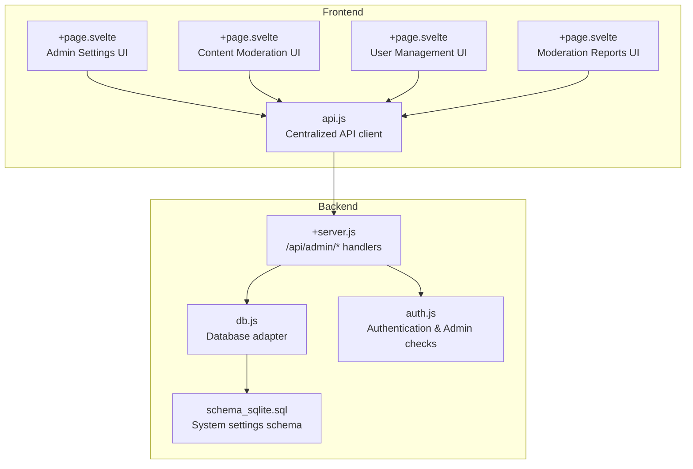
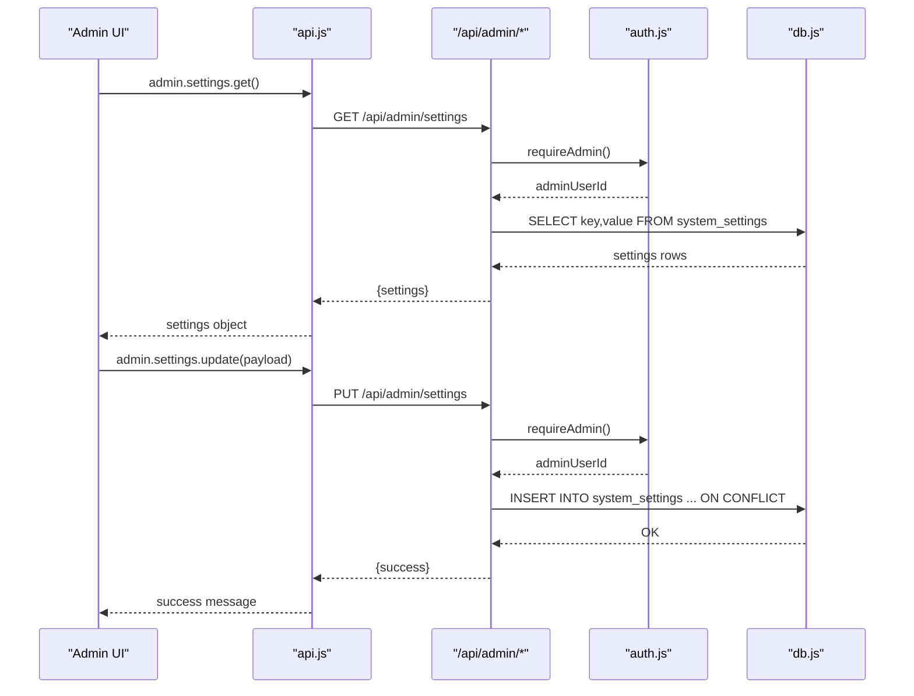
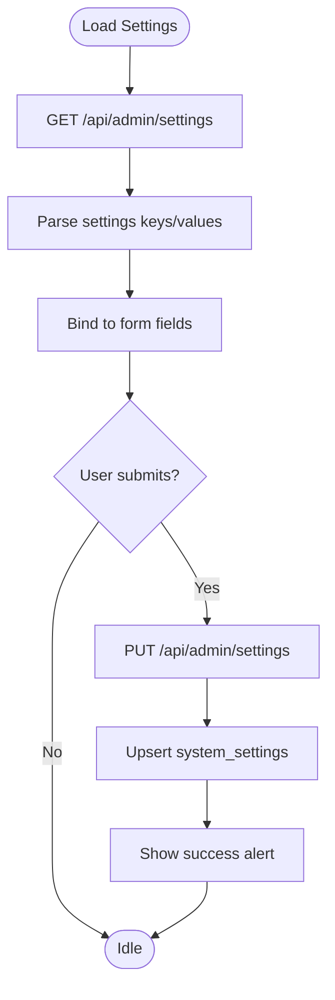
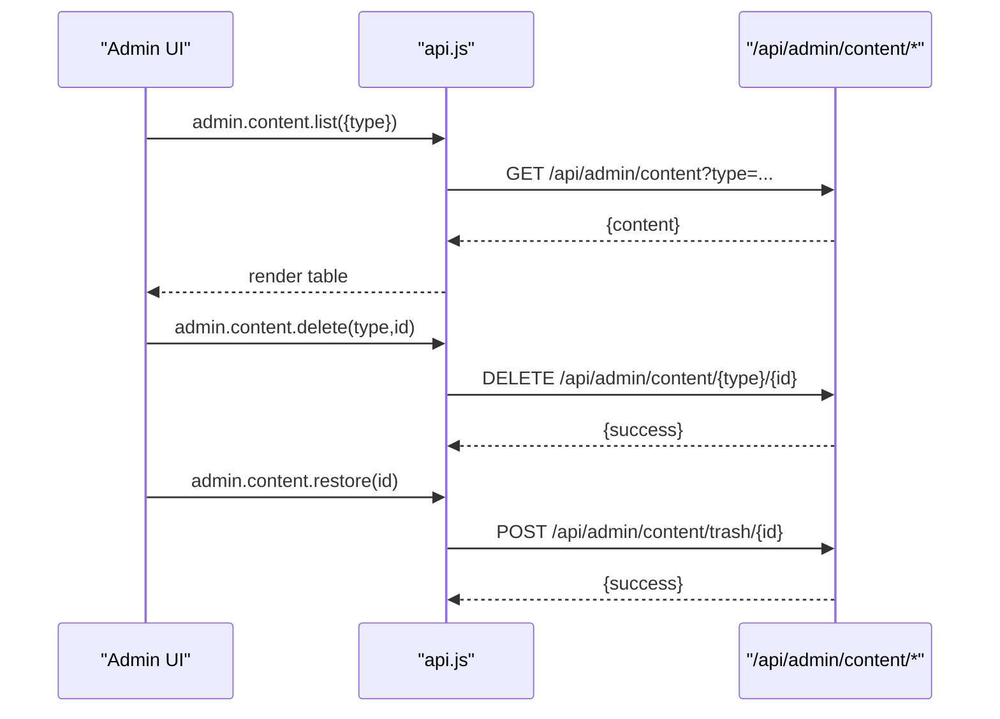
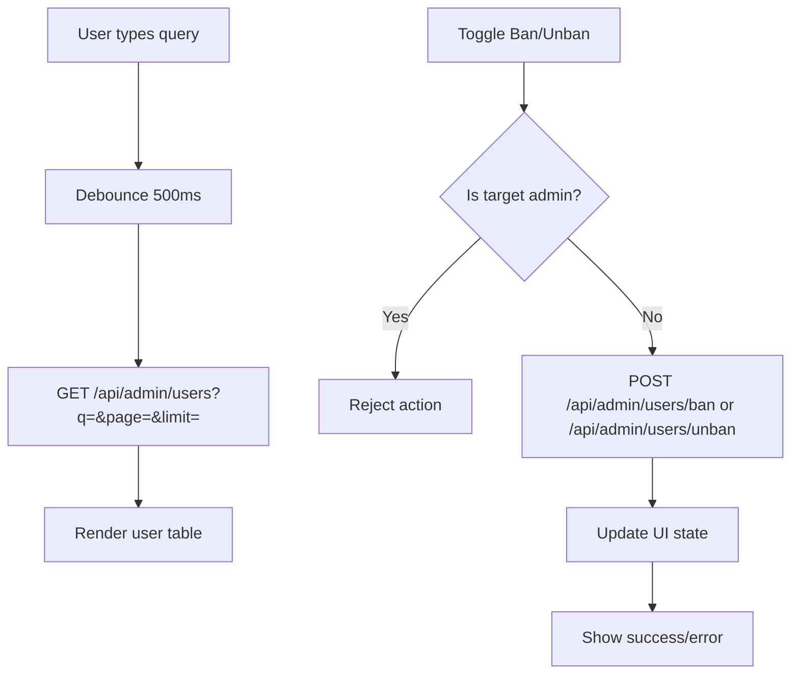
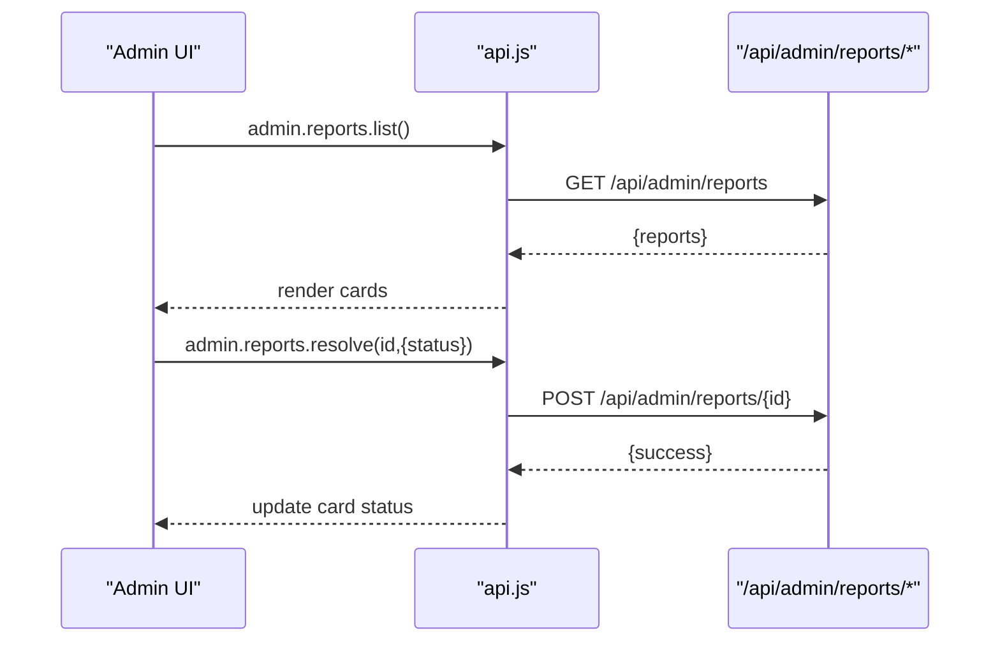
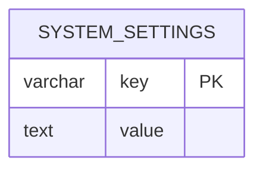
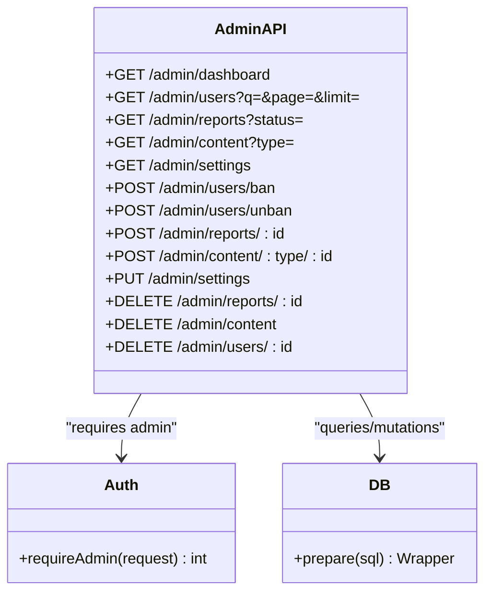
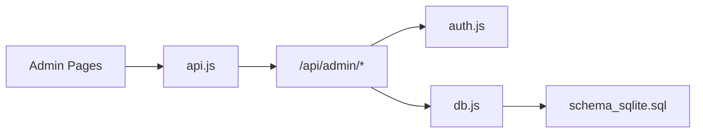

# System Settings & Configuration

<cite>
**Referenced Files in This Document**
- [+page.svelte](file://frontend/src/routes/admin/settings/+page.svelte)
- [+page.svelte](file://frontend/src/routes/admin/content/+page.svelte)
- [+page.svelte](file://frontend/src/routes/admin/users/+page.svelte)
- [+page.svelte](file://frontend/src/routes/admin/reports/+page.svelte)
- [api.js](file://frontend/src/lib/api.js)
- [+server.js](file://frontend/src/routes/api/admin/[...path]+server.js)
- [db.js](file://frontend/src/lib/server/db.js)
- [auth.js](file://frontend/src/lib/server/auth.js)
- [schema_sqlite.sql](file://schema_sqlite.sql)
- [001_schema.sql](file://migrations/001_schema.sql)
- [002_phase2.sql](file://migrations/002_phase2.sql)
</cite>

## Table of Contents
1. [Introduction](#introduction)
2. [Project Structure](#project-structure)
3. [Core Components](#core-components)
4. [Architecture Overview](#architecture-overview)
5. [Detailed Component Analysis](#detailed-component-analysis)
6. [Dependency Analysis](#dependency-analysis)
7. [Performance Considerations](#performance-considerations)
8. [Troubleshooting Guide](#troubleshooting-guide)
9. [Conclusion](#conclusion)
10. [Appendices](#appendices)

## Introduction
This document describes the administrative settings and system configuration interface for VSocial. It covers:
- System-wide configuration options (platform policies, feature toggles, content guidelines, operational parameters)
- The admin settings management UI and its validation behavior
- Content moderation and user administration capabilities
- Health monitoring and reporting endpoints
- Practical examples for configuration changes, system updates, and emergency procedures
- Security and compliance considerations, and integration points for third-party services

## Project Structure
The admin experience is implemented as a SvelteKit application with a dedicated admin routes module and a centralized API client. Backend endpoints are exposed under the /api/admin namespace and backed by a SQLite-compatible schema with optional PostgreSQL migration support.

**Diagram sources**
- [+page.svelte](file://frontend/src/routes/admin/settings/+page.svelte)
- [+page.svelte](file://frontend/src/routes/admin/content/+page.svelte)
- [+page.svelte](file://frontend/src/routes/admin/users/+page.svelte)
- [+page.svelte](file://frontend/src/routes/admin/reports/+page.svelte)
- [api.js](file://frontend/src/lib/api.js)
- [+server.js](file://frontend/src/routes/api/admin/[...path]+server.js)
- [db.js](file://frontend/src/lib/server/db.js)
- [auth.js](file://frontend/src/lib/server/auth.js)
- [schema_sqlite.sql](file://schema_sqlite.sql)

**Section sources**
- [+page.svelte](file://frontend/src/routes/admin/settings/+page.svelte)
- [+page.svelte](file://frontend/src/routes/admin/content/+page.svelte)
- [+page.svelte](file://frontend/src/routes/admin/users/+page.svelte)
- [+page.svelte](file://frontend/src/routes/admin/reports/+page.svelte)
- [api.js](file://frontend/src/lib/api.js)
- [+server.js](file://frontend/src/routes/api/admin/[...path]+server.js)
- [db.js](file://frontend/src/lib/server/db.js)
- [auth.js](file://frontend/src/lib/server/auth.js)
- [schema_sqlite.sql](file://schema_sqlite.sql)

## Core Components
- Admin Settings UI: Loads and persists system settings (site name, registration policy, upload limits) with immediate feedback.
- Content Moderation UI: Lists posts/reels/trash, supports delete and restore actions.
- User Management UI: Lists users, supports ban/unban with state synchronization.
- Moderation Reports UI: Displays pending reports and resolves them.
- API Client: Provides typed admin endpoints for settings, users, content, and reports.
- Admin API: Implements GET/POST/PUT/DELETE handlers for admin operations with admin-only access.
- Database Adapter: Unified driver abstraction supporting @libsql/client and better-sqlite3 with WAL and PRAGMAs.
- Authentication: JWT-based bearer tokens validated against stored sessions; admin role enforcement.
- System Settings Schema: Flat key/value storage for configuration with seed defaults.

**Section sources**
- [+page.svelte](file://frontend/src/routes/admin/settings/+page.svelte)
- [+page.svelte](file://frontend/src/routes/admin/content/+page.svelte)
- [+page.svelte](file://frontend/src/routes/admin/users/+page.svelte)
- [+page.svelte](file://frontend/src/routes/admin/reports/+page.svelte)
- [api.js](file://frontend/src/lib/api.js)
- [+server.js](file://frontend/src/routes/api/admin/[...path]+server.js)
- [db.js](file://frontend/src/lib/server/db.js)
- [auth.js](file://frontend/src/lib/server/auth.js)
- [schema_sqlite.sql](file://schema_sqlite.sql)

## Architecture Overview
The admin UI communicates with the backend via the centralized API client. Admin endpoints enforce authentication and admin privileges, query or mutate data in the database, and return structured responses.

**Diagram sources**
- [api.js](file://frontend/src/lib/api.js)
- [+server.js](file://frontend/src/routes/api/admin/[...path]+server.js)
- [auth.js](file://frontend/src/lib/server/auth.js)
- [db.js](file://frontend/src/lib/server/db.js)

## Detailed Component Analysis

### Admin Settings UI
- Loads initial settings from the backend and binds form controls to reactive state.
- Persists changes via PUT /api/admin/settings with optimistic UX and error feedback.
- Validation: numeric upload size bound to number input; boolean registration toggle; text site name input.

**Diagram sources**
- [+page.svelte](file://frontend/src/routes/admin/settings/+page.svelte)
- [api.js](file://frontend/src/lib/api.js)
- [+server.js](file://frontend/src/routes/api/admin/[...path]+server.js)

**Section sources**
- [+page.svelte](file://frontend/src/routes/admin/settings/+page.svelte)
- [api.js](file://frontend/src/lib/api.js)
- [+server.js](file://frontend/src/routes/api/admin/[...path]+server.js)

### Content Moderation UI
- Switches between posts, reels, and trash views.
- Lists content with metadata and actions to delete or restore.
- Uses admin.content.list, admin.content.delete, and admin.content.restore endpoints.

**Diagram sources**
- [+page.svelte](file://frontend/src/routes/admin/content/+page.svelte)
- [api.js](file://frontend/src/lib/api.js)
- [+server.js](file://frontend/src/routes/api/admin/[...path]+server.js)

**Section sources**
- [+page.svelte](file://frontend/src/routes/admin/content/+page.svelte)
- [api.js](file://frontend/src/lib/api.js)
- [+server.js](file://frontend/src/routes/api/admin/[...path]+server.js)

### User Management UI
- Searches users with debounced input and paginates results.
- Toggles ban state and updates user roles via admin endpoints.
- Prevents banning the primary admin and self-banning.

**Diagram sources**
- [+page.svelte](file://frontend/src/routes/admin/users/+page.svelte)
- [api.js](file://frontend/src/lib/api.js)
- [+server.js](file://frontend/src/routes/api/admin/[...path]+server.js)

**Section sources**
- [+page.svelte](file://frontend/src/routes/admin/users/+page.svelte)
- [api.js](file://frontend/src/lib/api.js)
- [+server.js](file://frontend/src/routes/api/admin/[...path]+server.js)

### Moderation Reports UI
- Lists pending reports with previews and timestamps.
- Resolves reports with “dismissed” or “resolved” statuses.
- Optionally deletes reported content when resolving.

**Diagram sources**
- [+page.svelte](file://frontend/src/routes/admin/reports/+page.svelte)
- [api.js](file://frontend/src/lib/api.js)
- [+server.js](file://frontend/src/routes/api/admin/[...path]+server.js)

**Section sources**
- [+page.svelte](file://frontend/src/routes/admin/reports/+page.svelte)
- [api.js](file://frontend/src/lib/api.js)
- [+server.js](file://frontend/src/routes/api/admin/[...path]+server.js)

### System Settings Schema and Seed Defaults
- Flat key/value table stores configuration entries.
- Seed inserts define default values for site name, registration, upload size, features, maintenance mode, and integrations.

**Diagram sources**
- [schema_sqlite.sql](file://schema_sqlite.sql)
- [001_schema.sql](file://migrations/001_schema.sql)
- [002_phase2.sql](file://migrations/002_phase2.sql)

**Section sources**
- [schema_sqlite.sql](file://schema_sqlite.sql)
- [001_schema.sql](file://migrations/001_schema.sql)
- [002_phase2.sql](file://migrations/002_phase2.sql)

### Admin API Endpoints and Access Control
- Enforces admin-only access using requireAdmin.
- Supports settings CRUD, user CRUD, content moderation, and reports management.
- Uses upsert semantics for settings persistence.

**Diagram sources**
- [+server.js](file://frontend/src/routes/api/admin/[...path]+server.js)
- [auth.js](file://frontend/src/lib/server/auth.js)
- [db.js](file://frontend/src/lib/server/db.js)

**Section sources**
- [+server.js](file://frontend/src/routes/api/admin/[...path]+server.js)
- [auth.js](file://frontend/src/lib/server/auth.js)
- [db.js](file://frontend/src/lib/server/db.js)

## Dependency Analysis
- Frontend depends on a single API client module for all admin endpoints.
- Admin endpoints depend on authentication middleware and database adapter.
- Database adapter abstracts drivers and applies performance PRAGMAs for SQLite/WAL.

**Diagram sources**
- [api.js](file://frontend/src/lib/api.js)
- [+server.js](file://frontend/src/routes/api/admin/[...path]+server.js)
- [auth.js](file://frontend/src/lib/server/auth.js)
- [db.js](file://frontend/src/lib/server/db.js)
- [schema_sqlite.sql](file://schema_sqlite.sql)

**Section sources**
- [api.js](file://frontend/src/lib/api.js)
- [+server.js](file://frontend/src/routes/api/admin/[...path]+server.js)
- [auth.js](file://frontend/src/lib/server/auth.js)
- [db.js](file://frontend/src/lib/server/db.js)
- [schema_sqlite.sql](file://schema_sqlite.sql)

## Performance Considerations
- Database driver abstraction ensures consistent async API across @libsql/client and better-sqlite3.
- SQLite PRAGMAs enable WAL mode, foreign keys, timeouts, and caching for improved concurrency and durability.
- Admin queries use LIMIT clauses and indexed joins to constrain result sizes.

Recommendations:
- Keep system settings small and normalized; avoid storing large JSON blobs.
- Use pagination for user and report listings.
- Monitor DB driver availability and fallback behavior during initialization.

**Section sources**
- [db.js](file://frontend/src/lib/server/db.js)
- [+server.js](file://frontend/src/routes/api/admin/[...path]+server.js)

## Troubleshooting Guide
Common issues and resolutions:
- Unauthorized or forbidden requests: Verify admin credentials and bearer token validity.
- Session expired: Re-authenticate to obtain a new token; sessions expire after 7 days.
- Settings not persisting: Confirm PUT /api/admin/settings payload shape and that keys exist in system_settings.
- Content deletion anomalies: Ensure correct type and ID are passed to DELETE /api/admin/content.

Operational checks:
- Confirm database initialization and schema presence.
- Validate environment variables for DB_URL and auth token.
- Review admin logs endpoint for transaction history.

**Section sources**
- [auth.js](file://frontend/src/lib/server/auth.js)
- [+server.js](file://frontend/src/routes/api/admin/[...path]+server.js)
- [db.js](file://frontend/src/lib/server/db.js)

## Conclusion
The admin settings and configuration interface in VSocial provides a focused set of capabilities for platform-wide configuration, content moderation, user administration, and reporting. The backend enforces strict admin access control and uses a robust database abstraction with performance-oriented PRAGMAs. The UI delivers responsive feedback and straightforward workflows for common administrative tasks.

## Appendices

### Configuration Categories and Examples
- General
  - Site name: string
  - Allow registrations: boolean
  - Max upload size (MB): integer
- Features
  - Reels enabled: boolean
  - Marketplace enabled: boolean
  - Groups enabled: boolean
  - Stories enabled: boolean
- Operational
  - Maintenance mode: boolean
  - Demo mode: boolean
- Integrations
  - Email SMTP host/port/user/pass/from
  - VAPID keys for push notifications
  - OpenAI and Tenor API keys

Example changes:
- Enable/disable a feature: PUT /api/admin/settings with feature key and boolean value.
- Set upload limit: PUT /api/admin/settings with max_upload_size_mb.
- Toggle maintenance mode: PUT /api/admin/settings with maintenance_mode.

Backup/restore:
- Export system settings: GET /api/admin/settings and persist key/value pairs.
- Restore: PUT /api/admin/settings with exported payload.

Emergency procedures:
- Ban a user: POST /api/admin/users/ban with user_id and reason.
- Unban a user: POST /api/admin/users/unban with user_id.
- Delete reported content: POST /api/admin/reports/:id with delete_content and entity details.

Security and compliance:
- Enforce email verification requirement via system setting.
- Audit user sessions and enforce admin-only access to sensitive endpoints.
- Store secrets (SMTP, VAPID, external APIs) in environment variables and avoid committing them to source control.

Integration points:
- Email delivery via SMTP settings.
- Web push notifications via VAPID keys.
- AI and media services via API keys.

**Section sources**
- [schema_sqlite.sql](file://schema_sqlite.sql)
- [+server.js](file://frontend/src/routes/api/admin/[...path]+server.js)
- [auth.js](file://frontend/src/lib/server/auth.js)