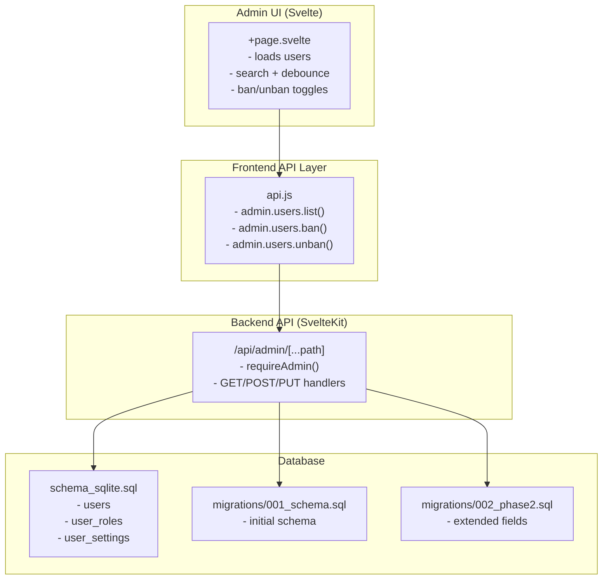
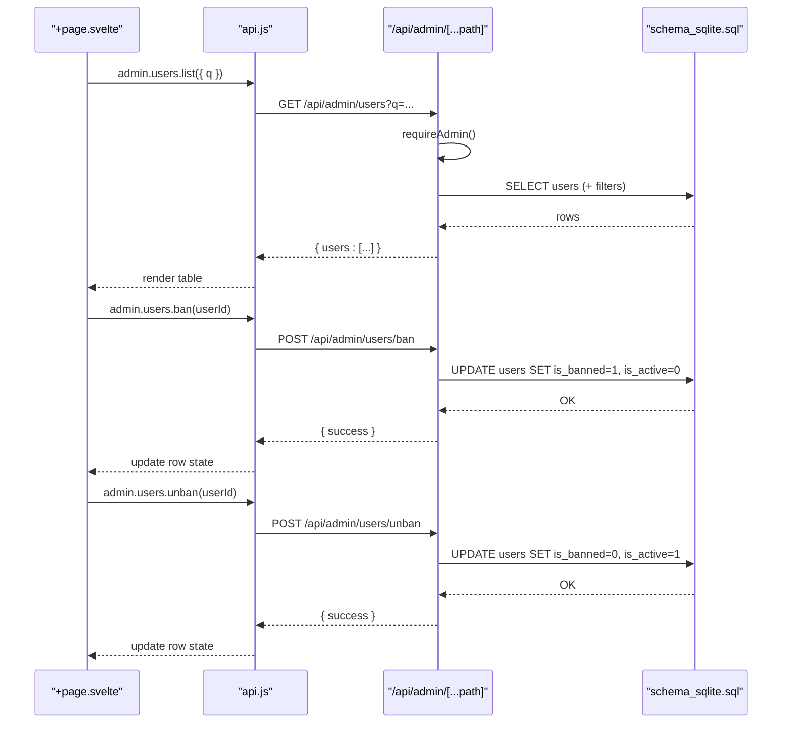
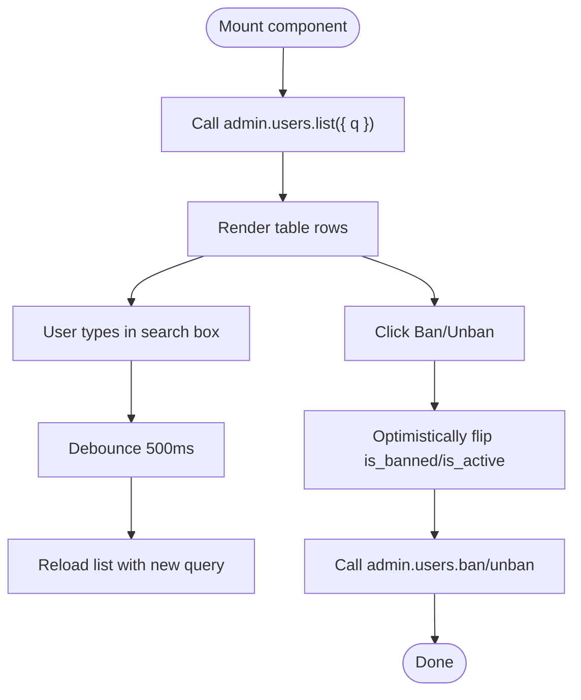
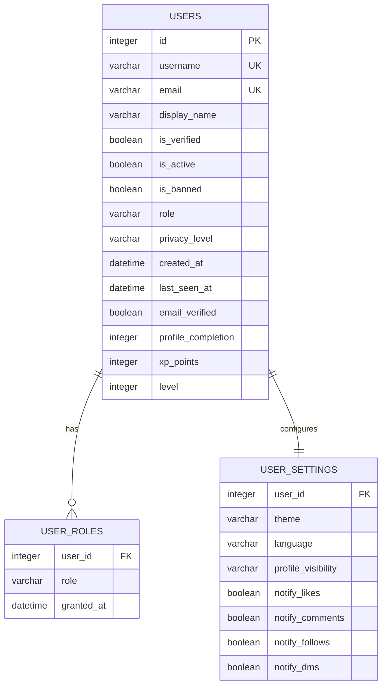
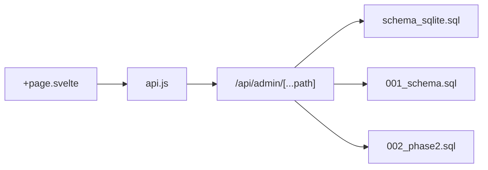

# User Management

<cite>
**Referenced Files in This Document**
- [+page.svelte](file://frontend/src/routes/admin/users/+page.svelte)
- [api.js](file://frontend/src/lib/api.js)
- [admin +server.js](file://frontend/src/routes/api/admin/[...path]+server.js)
- [schema_sqlite.sql](file://schema_sqlite.sql)
- [001_schema.sql](file://migrations/001_schema.sql)
- [002_phase2.sql](file://migrations/002_phase2.sql)
</cite>

## Table of Contents
1. [Introduction](#introduction)
2. [Project Structure](#project-structure)
3. [Core Components](#core-components)
4. [Architecture Overview](#architecture-overview)
5. [Detailed Component Analysis](#detailed-component-analysis)
6. [Dependency Analysis](#dependency-analysis)
7. [Performance Considerations](#performance-considerations)
8. [Troubleshooting Guide](#troubleshooting-guide)
9. [Conclusion](#conclusion)
10. [Appendices](#appendices)

## Introduction
This document describes VSocial’s user management system with a focus on the administrative interface for viewing, searching, and managing user accounts. It covers user profiles, account status controls, role assignments, and bulk user operations. It also documents user verification workflows, account suspension procedures, user activity monitoring, filtering and search capabilities, pagination, moderation actions, account recovery processes, user data management, privacy controls, data export capabilities, and compliance requirements.

## Project Structure
The user management admin UI is implemented as a Svelte page that communicates with a centralized API client. The API client exposes an admin namespace with endpoints for listing, retrieving, updating, banning, and unbanning users. The backend is implemented as a SvelteKit server handler that validates admin privileges and interacts with the database.

**Diagram sources**
- [+page.svelte:1-57](file://frontend/src/routes/admin/users/+page.svelte#L1-L57)
- [api.js:255-287](file://frontend/src/lib/api.js#L255-L287)
- [admin +server.js:1-186](file://frontend/src/routes/api/admin/[...path]+server.js#L1-L186)
- [schema_sqlite.sql:13-48](file://schema_sqlite.sql#L13-L48)
- [001_schema.sql:16-43](file://migrations/001_schema.sql#L16-L43)
- [002_phase2.sql:20-49](file://migrations/002_phase2.sql#L20-L49)

**Section sources**
- [+page.svelte:1-57](file://frontend/src/routes/admin/users/+page.svelte#L1-L57)
- [api.js:255-287](file://frontend/src/lib/api.js#L255-L287)
- [admin +server.js:1-186](file://frontend/src/routes/api/admin/[...path]+server.js#L1-L186)
- [schema_sqlite.sql:13-48](file://schema_sqlite.sql#L13-L48)
- [001_schema.sql:16-43](file://migrations/001_schema.sql#L16-L43)
- [002_phase2.sql:20-49](file://migrations/002_phase2.sql#L20-L49)

## Core Components
- Admin user listing page:
  - Loads users with optional query parameter for search.
  - Debounced search input triggers reloads.
  - Toggle ban/unban per user with immediate UI feedback.
- Frontend API client:
  - Provides typed admin endpoints for users: list, get, update, ban, unban.
- Backend admin API:
  - Enforces admin-only access.
  - Implements user listing, updates (role, verification), and ban/unban actions.
- Database schema:
  - Core user attributes, roles, and related tables support verification, activity, and privacy controls.

**Section sources**
- [+page.svelte:14-52](file://frontend/src/routes/admin/users/+page.svelte#L14-L52)
- [api.js:255-287](file://frontend/src/lib/api.js#L255-L287)
- [admin +server.js:8-186](file://frontend/src/routes/api/admin/[...path]+server.js#L8-L186)
- [schema_sqlite.sql:13-48](file://schema_sqlite.sql#L13-L48)

## Architecture Overview
The admin user management flow connects the UI to the backend and database through a strict request pipeline.

**Diagram sources**
- [+page.svelte:14-44](file://frontend/src/routes/admin/users/+page.svelte#L14-L44)
- [api.js:255-287](file://frontend/src/lib/api.js#L255-L287)
- [admin +server.js:8-186](file://frontend/src/routes/api/admin/[...path]+server.js#L8-L186)
- [schema_sqlite.sql:13-48](file://schema_sqlite.sql#L13-L48)

## Detailed Component Analysis

### Admin User Listing Page
- Responsibilities:
  - Initialize and reload user list on mount.
  - Debounced search input updates query and reloads list.
  - Toggle ban/unban per user with optimistic UI updates and error handling.
- UI behavior:
  - Loading spinner during fetch.
  - Empty state messaging.
  - Status badges for active/inactive/banned.
  - Verified badge indicator.
  - Non-admin protection for self-account.

**Diagram sources**
- [+page.svelte:10-52](file://frontend/src/routes/admin/users/+page.svelte#L10-L52)

**Section sources**
- [+page.svelte:1-145](file://frontend/src/routes/admin/users/+page.svelte#L1-L145)

### Frontend API Client (Admin Namespace)
- Exposes:
  - admin.users.list(params): GET /admin/users with query string.
  - admin.users.get(id): GET /admin/users/:id.
  - admin.users.update(id, data): PUT /admin/users/:id.
  - admin.users.ban(userId[, data]): POST /admin/users/ban.
  - admin.users.unban(userId): POST /admin/users/unban.
- Authentication:
  - Uses Bearer token from localStorage for all requests.

**Section sources**
- [api.js:255-287](file://frontend/src/lib/api.js#L255-L287)

### Backend Admin API Handler
- Access control:
  - requireAdmin(request) ensures only admins can call endpoints.
- Endpoints:
  - GET /api/admin/users: list users with optional query param.
  - POST /api/admin/users/ban: set user is_banned=1 and is_active=0.
  - POST /api/admin/users/unban: set user is_banned=0 and is_active=1.
  - PUT /api/admin/users/:id: update allowed fields (role, is_verified) and sync user_roles.
- Data persistence:
  - Uses prepared statements and inserts/updates in system_settings for toggles.
  - Supports restoring content from trash.

**Section sources**
- [admin +server.js:8-186](file://frontend/src/routes/api/admin/[...path]+server.js#L8-L186)
- [admin +server.js:188-222](file://frontend/src/routes/api/admin/[...path]+server.js#L188-L222)
- [admin +server.js:224-233](file://frontend/src/routes/api/admin/[...path]+server.js#L224-L233)

### Database Schema and Roles
- Core user table:
  - Fields include identity, profile metadata, verification flags, activity flags, roles, privacy, timestamps, and counters.
- Roles:
  - user_roles table supports role assignment and auditing via granted_at.
- Settings and privacy:
  - user_settings table centralizes user preferences affecting visibility and notifications.
- Extended fields:
  - email_verified, profile_completion, xp_points, level added in phase 2 migration.

**Diagram sources**
- [schema_sqlite.sql:13-48](file://schema_sqlite.sql#L13-L48)
- [schema_sqlite.sql:70-93](file://schema_sqlite.sql#L70-L93)
- [002_phase2.sql:20-49](file://migrations/002_phase2.sql#L20-L49)

**Section sources**
- [schema_sqlite.sql:13-48](file://schema_sqlite.sql#L13-L48)
- [schema_sqlite.sql:70-93](file://schema_sqlite.sql#L70-L93)
- [002_phase2.sql:20-49](file://migrations/002_phase2.sql#L20-L49)

## Dependency Analysis
- UI depends on:
  - api.js for HTTP calls.
  - requireAdmin middleware enforced by backend.
- Backend depends on:
  - Database schema for reads/writes.
  - Prepared statements for safety.
- Database depends on:
  - Initial schema and migrations for feature evolution.

**Diagram sources**
- [+page.svelte:1-57](file://frontend/src/routes/admin/users/+page.svelte#L1-L57)
- [api.js:255-287](file://frontend/src/lib/api.js#L255-L287)
- [admin +server.js:1-186](file://frontend/src/routes/api/admin/[...path]+server.js#L1-L186)
- [schema_sqlite.sql:13-48](file://schema_sqlite.sql#L13-L48)
- [001_schema.sql:16-43](file://migrations/001_schema.sql#L16-L43)
- [002_phase2.sql:20-49](file://migrations/002_phase2.sql#L20-L49)

**Section sources**
- [+page.svelte:1-57](file://frontend/src/routes/admin/users/+page.svelte#L1-L57)
- [api.js:255-287](file://frontend/src/lib/api.js#L255-L287)
- [admin +server.js:1-186](file://frontend/src/routes/api/admin/[...path]+server.js#L1-L186)
- [schema_sqlite.sql:13-48](file://schema_sqlite.sql#L13-L48)
- [001_schema.sql:16-43](file://migrations/001_schema.sql#L16-L43)
- [002_phase2.sql:20-49](file://migrations/002_phase2.sql#L20-L49)

## Performance Considerations
- Debounced search:
  - The UI debounces input to reduce network requests during typing.
- Pagination:
  - The backend currently lists users without explicit pagination. For large datasets, introduce limit/offset or cursor-based pagination to avoid heavy payloads.
- Indexing:
  - Ensure database indexes exist on frequently filtered columns (e.g., username, email, created_at) to speed up listing and search.
- Caching:
  - Consider caching inactive or non-changing user metadata on the client to reduce repeated loads.

[No sources needed since this section provides general guidance]

## Troubleshooting Guide
- Authentication failures:
  - Ensure the admin user has a valid Bearer token stored in localStorage. Requests without a token will fail.
- Permission errors:
  - requireAdmin enforces admin-only access. Verify the requesting user has admin privileges.
- Ban/Unban errors:
  - UI displays a localized error message on failure. Confirm backend endpoints are reachable and the user ID exists.
- Search yields no results:
  - Verify the query matches username/email patterns supported by the backend implementation.
- Role updates not reflected:
  - PUT /admin/users/:id updates both users and user_roles. Confirm allowed fields and that role sync occurs.

**Section sources**
- [api.js:12-15](file://frontend/src/lib/api.js#L12-L15)
- [admin +server.js:11-11](file://frontend/src/routes/api/admin/[...path]+server.js#L11-L11)
- [+page.svelte:39-43](file://frontend/src/routes/admin/users/+page.svelte#L39-L43)

## Conclusion
VSocial’s admin user management integrates a reactive UI, a centralized API client, and a secure backend handler with robust database support. The system enables administrators to search, filter, and manage users, including verification, role assignment, and suspension. To scale, implement pagination, optimize database queries, and expand audit logging for compliance.

[No sources needed since this section summarizes without analyzing specific files]

## Appendices

### User Verification Workflows
- Verification flag:
  - The users table includes is_verified and email_verified flags. Administrators can update is_verified via the admin API.
- Email verification tokens:
  - email_tokens table supports email verification lifecycle. While the admin UI focuses on toggling is_verified, the token mechanism underpins verification.

**Section sources**
- [schema_sqlite.sql:13-48](file://schema_sqlite.sql#L13-L48)
- [002_phase2.sql:20-29](file://migrations/002_phase2.sql#L20-L29)

### Account Suspension Procedures
- Suspension toggles:
  - POST /admin/users/ban sets is_banned=1 and is_active=0.
  - POST /admin/users/unban sets is_banned=0 and is_active=1.
- UI behavior:
  - Optimistic UI updates reflect immediate state changes.

**Section sources**
- [api.js:264-265](file://frontend/src/lib/api.js#L264-L265)
- [+page.svelte:26-44](file://frontend/src/routes/admin/users/+page.svelte#L26-L44)

### User Activity Monitoring
- Activity indicators:
  - last_seen_at and created_at fields track user presence and registration date.
- Visibility:
  - is_active and is_banned flags indicate current account status.

**Section sources**
- [schema_sqlite.sql:13-48](file://schema_sqlite.sql#L13-L48)

### User Listing Interface, Filtering, and Search
- Listing:
  - GET /admin/users supports query string parameters for filtering.
- Search:
  - Debounced search input updates the query parameter and reloads the list.
- Pagination:
  - Not implemented in the backend handler; consider adding limit/offset or cursor-based pagination.

**Section sources**
- [api.js:258-260](file://frontend/src/lib/api.js#L258-L260)
- [+page.svelte:14-52](file://frontend/src/routes/admin/users/+page.svelte#L14-L52)
- [admin +server.js:8-186](file://frontend/src/routes/api/admin/[...path]+server.js#L8-L186)

### Bulk User Operations
- Current capability:
  - The admin API supports per-user updates (role, is_verified) and ban/unban actions.
- Bulk enhancements:
  - Extend backend endpoints to accept arrays of user IDs for batch operations and add audit logs.

**Section sources**
- [admin +server.js:204-219](file://frontend/src/routes/api/admin/[...path]+server.js#L204-L219)

### Practical Examples
- Moderation action:
  - Ban a user by calling admin.users.ban(userId). The UI flips is_banned and is_active immediately.
- Account recovery:
  - Unban a user by calling admin.users.unban(userId). The UI flips flags back.
- Role assignment:
  - Update a user’s role via admin.users.update(userId, { role }). The backend writes to user_roles.

**Section sources**
- [+page.svelte:26-44](file://frontend/src/routes/admin/users/+page.svelte#L26-L44)
- [api.js:262-265](file://frontend/src/lib/api.js#L262-L265)
- [admin +server.js:204-219](file://frontend/src/routes/api/admin/[...path]+server.js#L204-L219)

### User Privacy Controls and Compliance
- Privacy settings:
  - user_settings includes profile_visibility and notification preferences.
- Compliance-ready fields:
  - email_verified, is_verified, created_at, last_seen_at, and audit-friendly granted_at timestamps.
- Recommendations:
  - Add data export endpoints for user data portability and retention policies aligned with privacy regulations.

**Section sources**
- [schema_sqlite.sql:70-93](file://schema_sqlite.sql#L70-L93)
- [schema_sqlite.sql:13-48](file://schema_sqlite.sql#L13-L48)
- [002_phase2.sql:46-49](file://migrations/002_phase2.sql#L46-L49)