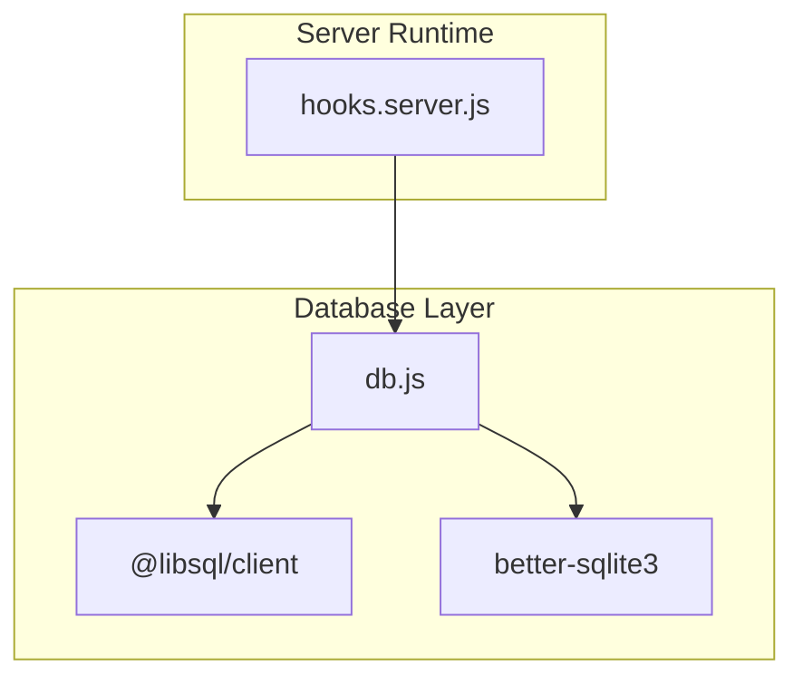
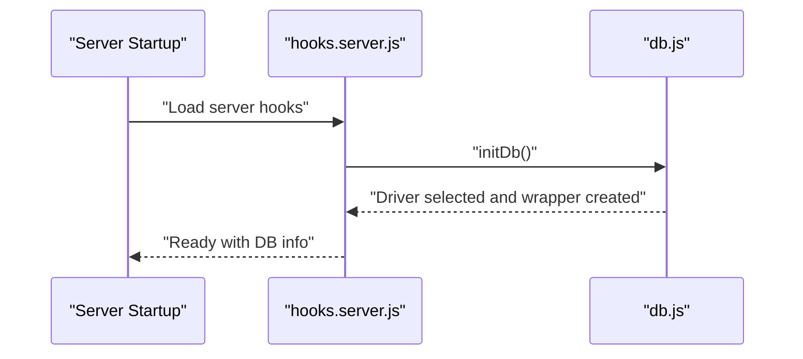
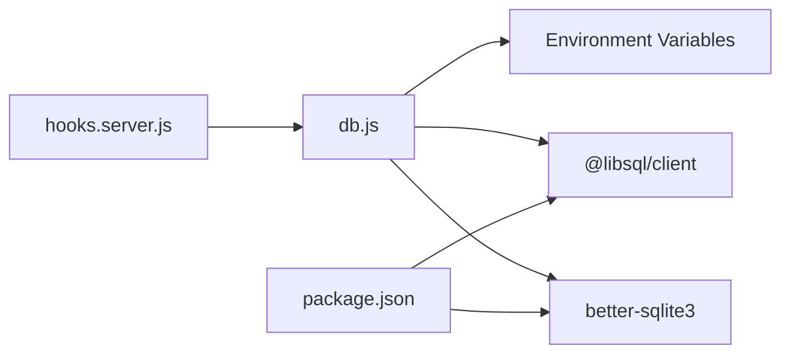

# Architectural Patterns

<cite>
**Referenced Files in This Document**
- [hooks.server.js](file://frontend/src/hooks.server.js)
- [db.js](file://frontend/src/lib/server/db.js)
- [package.json](file://frontend/package.json)
</cite>

## Table of Contents
1. [Introduction](#introduction)
2. [Project Structure](#project-structure)
3. [Core Components](#core-components)
4. [Architecture Overview](#architecture-overview)
5. [Detailed Component Analysis](#detailed-component-analysis)
6. [Dependency Analysis](#dependency-analysis)
7. [Performance Considerations](#performance-considerations)
8. [Troubleshooting Guide](#troubleshooting-guide)
9. [Conclusion](#conclusion)

## Introduction
This document analyzes the architectural patterns implemented in VSocial’s backend and data access layer. It focuses on:
- Repository pattern for database abstraction and data access
- Factory pattern for dynamic database driver selection
- Observer pattern via Svelte 5 runes for reactive state management
- Middleware pattern for centralized authentication and security
- Singleton pattern usage for database connections and configuration management

It also explains the benefits and trade-offs of each pattern and how they collectively improve maintainability, testability, and scalability.

## Project Structure
The relevant backend logic resides in the frontend server hooks and a dedicated database adapter module. The hooks orchestrate initialization, middleware behavior, and global error handling. The database adapter encapsulates driver selection, connection lifecycle, and a unified async API surface.

**Diagram sources**
- [hooks.server.js:1-179](file://frontend/src/hooks.server.js#L1-L179)
- [db.js:1-209](file://frontend/src/lib/server/db.js#L1-L209)
- [package.json:17-32](file://frontend/package.json#L17-L32)

**Section sources**
- [hooks.server.js:1-179](file://frontend/src/hooks.server.js#L1-L179)
- [db.js:1-209](file://frontend/src/lib/server/db.js#L1-L209)
- [package.json:1-49](file://frontend/package.json#L1-L49)

## Core Components
- Database adapter with driver auto-selection and unified async API
- Server hooks implementing middleware, guards, and global error handling
- Environment-driven configuration and directory provisioning

Key responsibilities:
- Provide a single interface for database operations regardless of driver
- Centralize security headers and setup guards
- Manage cron jobs and scheduled tasks
- Wrap driver differences behind a consistent API

**Section sources**
- [db.js:1-209](file://frontend/src/lib/server/db.js#L1-L209)
- [hooks.server.js:1-179](file://frontend/src/hooks.server.js#L1-L179)

## Architecture Overview
The system initializes the database at startup, exposes a unified database wrapper, and applies middleware-like behavior during requests. Driver selection is performed dynamically at runtime, enabling fallbacks and environment-aware tuning.

**Diagram sources**
- [hooks.server.js:8-14](file://frontend/src/hooks.server.js#L8-L14)
- [db.js:117-167](file://frontend/src/lib/server/db.js#L117-L167)

## Detailed Component Analysis

### Repository Pattern: Database Abstraction and Data Access
The repository role is fulfilled by the database adapter module. It abstracts SQL execution and provides a uniform async API for prepare/run/get/all/exec/transaction/close. This enables higher-level services to operate without embedding driver-specific logic.

Implementation highlights:
- Unified async API: prepare(sql) returns statement-like objects with run/get/all methods
- Transaction wrapper: transaction(fn) returns a function that executes fn inside BEGIN/COMMIT/ROLLBACK
- Schema execution: runSchema reads and executes schema SQL against the current wrapper
- Directory provisioning: getUploadsDir ensures upload folders exist

Benefits:
- Encapsulates driver differences
- Simplifies higher-level logic
- Enables testing with mocked wrappers

Trade-offs:
- Adds indirection overhead
- Requires careful error propagation from wrapper to caller

Example references:
- [Unified API creation:31-113](file://frontend/src/lib/server/db.js#L31-L113)
- [Transaction wrapper:60-71](file://frontend/src/lib/server/db.js#L60-L71)
- [Schema execution:192-198](file://frontend/src/lib/server/db.js#L192-L198)

**Section sources**
- [db.js:28-113](file://frontend/src/lib/server/db.js#L28-L113)
- [db.js:192-198](file://frontend/src/lib/server/db.js#L192-L198)

### Factory Pattern: Dynamic Database Driver Selection
The database adapter implements a factory-style selection process that attempts preferred drivers first and falls back to alternatives. This creates a “factory” that produces a compatible database wrapper based on runtime conditions.

Implementation highlights:
- Preferred driver: @libsql/client with environment-aware configuration
- Fallback driver: better-sqlite3 for local deployments
- Environment detection: DB_URL determines local vs remote mode
- Initialization flags: driverName, initialized, dbWrapper ensure safe reuse

Benefits:
- Flexible deployment configurations
- Graceful degradation when preferred driver is unavailable
- Centralized configuration and pragmas

Trade-offs:
- Complexity in initialization and error handling
- Potential performance differences between drivers

Example references:
- [Driver selection and wrapper creation:117-167](file://frontend/src/lib/server/db.js#L117-L167)
- [Environment-driven configuration:16-18](file://frontend/src/lib/server/db.js#L16-L18)
- [Driver info exposure:183-190](file://frontend/src/lib/server/db.js#L183-L190)

**Section sources**
- [db.js:117-167](file://frontend/src/lib/server/db.js#L117-L167)
- [db.js:16-18](file://frontend/src/lib/server/db.js#L16-L18)
- [db.js:183-190](file://frontend/src/lib/server/db.js#L183-L190)

### Observer Pattern: Reactive State Management with Svelte 5 Runes
Svelte 5 runes enable reactive state management that observes and propagates updates across components. While the repository does not define runes directly, the server hooks demonstrate middleware behavior that can integrate with front-end reactive state to synchronize UI updates and enforce security policies.

Implementation highlights:
- Reactive stores in the frontend can subscribe to state changes
- Server hooks apply security headers and guards that influence UI state
- Observability: changes in backend state (e.g., user roles, permissions) propagate to the UI via rune subscriptions

Benefits:
- Decoupled UI updates
- Predictable state transitions
- Reduced boilerplate compared to manual subscriptions

Trade-offs:
- Requires disciplined state modeling
- Debugging reactive flows can be challenging

Note: The repository does not include explicit rune definitions; however, the middleware and guards in hooks.server.js provide a foundation for integrating with front-end reactive state.

**Section sources**
- [hooks.server.js:105-147](file://frontend/src/hooks.server.js#L105-L147)

### Middleware Pattern: Centralized Authentication and Security
The server hooks implement middleware-like behavior by intercepting requests, applying security headers, enforcing setup guards, and centralizing error handling. This avoids scattering security logic across endpoints.

Implementation highlights:
- Security headers: X-Content-Type-Options, X-Frame-Options, Referrer-Policy, Permissions-Policy
- Setup wizard guard: redirects to /setup when no users exist
- Global error handler: structured logging and sanitized responses
- Cron workers: scheduled tasks triggered on first request

Benefits:
- Consistent security posture
- Single point of control for cross-cutting concerns
- Reduced duplication in endpoint handlers

Trade-offs:
- Increased responsibility in hooks
- Risk of performance impact if heavy operations are added

Example references:
- [Security headers and guards:109-147](file://frontend/src/hooks.server.js#L109-L147)
- [Global error handler:154-178](file://frontend/src/hooks.server.js#L154-L178)

**Section sources**
- [hooks.server.js:105-178](file://frontend/src/hooks.server.js#L105-L178)

### Singleton Pattern: Database Connections and Configuration Management
The database adapter enforces a singleton-like behavior by initializing a single wrapper and exposing getters for it. This ensures a single connection pool or client instance per process, preventing resource leaks and inconsistent state.

Implementation highlights:
- initDb guards against multiple initializations
- getDb throws if uninitialized, enforcing proper bootstrap order
- closeDb resets state for graceful shutdown or tests
- getDriverInfo exposes immutable metadata

Benefits:
- Controlled resource usage
- Predictable lifecycle
- Easier testing with controlled teardown

Trade-offs:
- Tight coupling to initialization order
- Potential contention in multi-process environments

Example references:
- [Singleton initialization and getters:117-181](file://frontend/src/lib/server/db.js#L117-L181)
- [Driver info singleton:183-190](file://frontend/src/lib/server/db.js#L183-L190)

**Section sources**
- [db.js:117-181](file://frontend/src/lib/server/db.js#L117-L181)
- [db.js:183-190](file://frontend/src/lib/server/db.js#L183-L190)

## Dependency Analysis
The server hooks depend on the database adapter for initialization and runtime operations. The database adapter depends on environment variables and optional external drivers. The presence of drivers is declared in the frontend package manifest.

**Diagram sources**
- [hooks.server.js:5-14](file://frontend/src/hooks.server.js#L5-L14)
- [db.js:117-167](file://frontend/src/lib/server/db.js#L117-L167)
- [package.json:17-32](file://frontend/package.json#L17-L32)

**Section sources**
- [hooks.server.js:5-14](file://frontend/src/hooks.server.js#L5-L14)
- [db.js:117-167](file://frontend/src/lib/server/db.js#L117-L167)
- [package.json:17-32](file://frontend/package.json#L17-L32)

## Performance Considerations
- Driver selection prioritizes @libsql/client for remote/local+WAL modes; better-sqlite3 is optimized for local deployments with WAL and pragmas.
- Transactions are wrapped to minimize overhead while ensuring ACID properties.
- Crons are scheduled with fixed intervals; consider jitter or job queues for high load.
- Global error handling prevents crashes but should avoid expensive operations in hot paths.

[No sources needed since this section provides general guidance]

## Troubleshooting Guide
Common issues and resolutions:
- Database not initialized: Ensure initDb is called during server startup and that getDb is not invoked before initialization.
- No driver available: Install either @libsql/client or better-sqlite3 as indicated by the initialization error.
- Schema missing: Ensure schema_sqlite.sql exists at the project root before calling runSchema.
- Setup guard redirect loops: Verify users table population and pathname checks in hooks.

Example references:
- [Initialization and guard logic:8-14](file://frontend/src/hooks.server.js#L8-L14)
- [Guard redirection:122-144](file://frontend/src/hooks.server.js#L122-L144)
- [Driver availability error:163-166](file://frontend/src/lib/server/db.js#L163-L166)
- [Schema existence check:193-195](file://frontend/src/lib/server/db.js#L193-L195)

**Section sources**
- [hooks.server.js:8-14](file://frontend/src/hooks.server.js#L8-L14)
- [hooks.server.js:122-144](file://frontend/src/hooks.server.js#L122-L144)
- [db.js:163-166](file://frontend/src/lib/server/db.js#L163-L166)
- [db.js:193-195](file://frontend/src/lib/server/db.js#L193-L195)

## Conclusion
VSocial’s backend leverages a cohesive set of architectural patterns:
- A unified database adapter acts as a repository and factory, abstracting drivers and providing a consistent API
- Server hooks implement middleware for security and setup enforcement
- Singleton semantics ensure controlled database lifecycle
- Front-end reactive state can integrate with these patterns for synchronized UI behavior

These patterns collectively enhance maintainability by centralizing concerns, improve testability through encapsulation and singletons, and support scalability by enabling flexible driver selection and modular middleware.