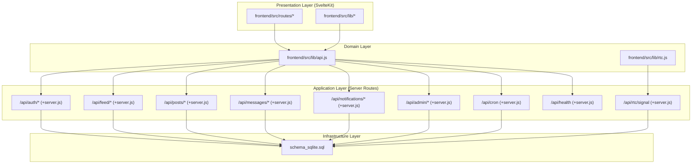
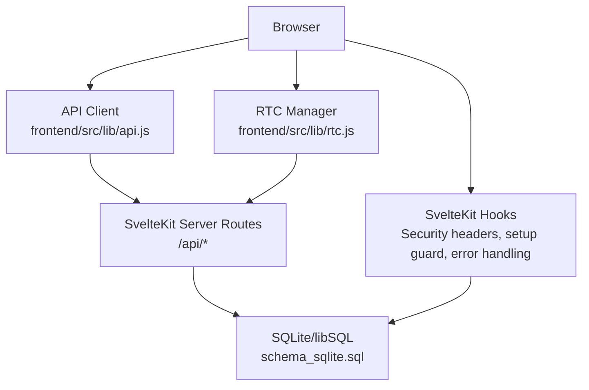
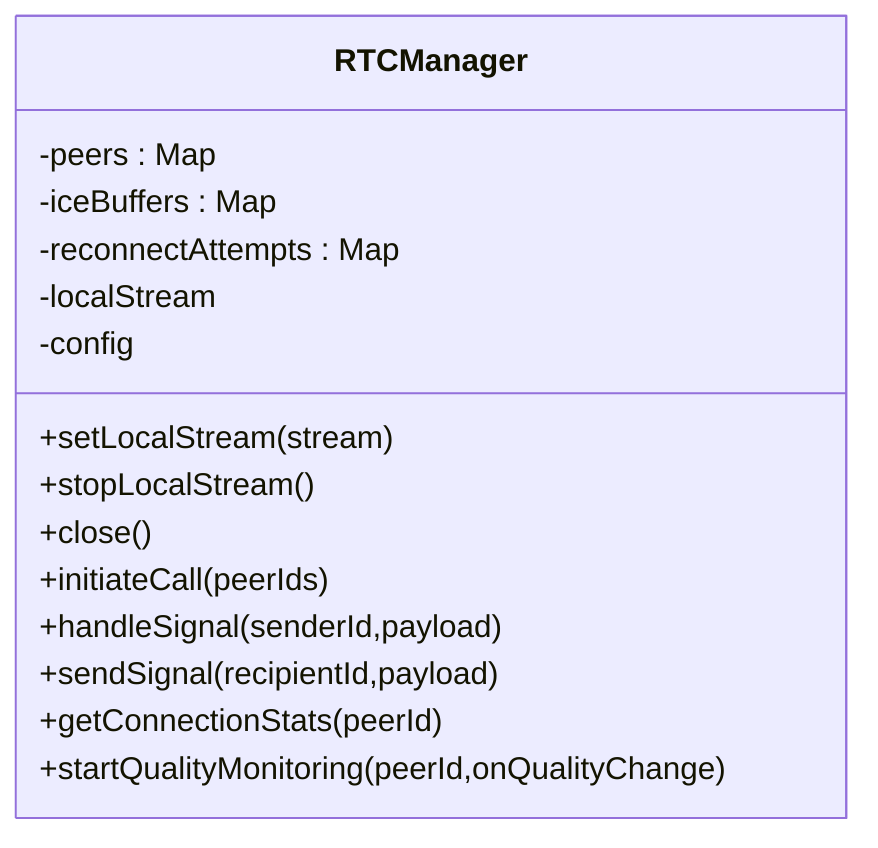
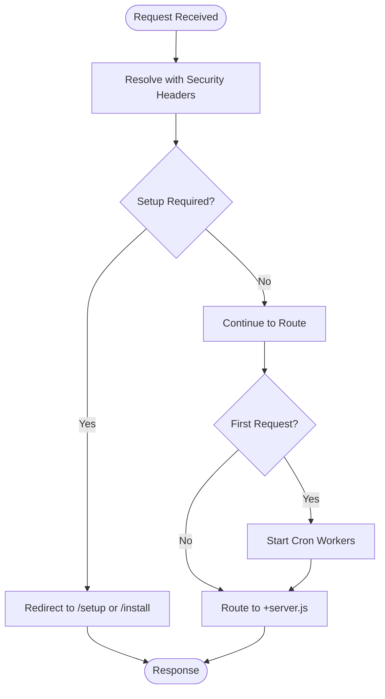
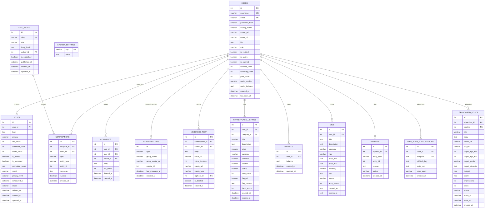
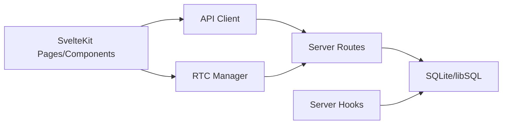
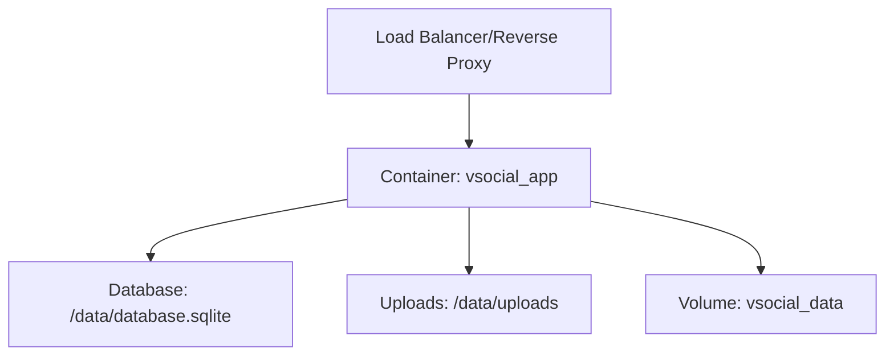

# Architecture & Technology Stack

<cite>
**Referenced Files in This Document**
- [ARCHITECTURE.md](file://ARCHITECTURE.md)
- [frontend/package.json](file://frontend/package.json)
- [docker-compose.yml](file://docker-compose.yml)
- [Dockerfile](file://Dockerfile)
- [frontend/src/hooks.server.js](file://frontend/src/hooks.server.js)
- [frontend/src/lib/api.js](file://frontend/src/lib/api.js)
- [frontend/src/lib/rtc.js](file://frontend/src/lib/rtc.js)
- [schema_sqlite.sql](file://schema_sqlite.sql)
</cite>

## Table of Contents
1. [Introduction](#introduction)
2. [Project Structure](#project-structure)
3. [Core Components](#core-components)
4. [Architecture Overview](#architecture-overview)
5. [Detailed Component Analysis](#detailed-component-analysis)
6. [Dependency Analysis](#dependency-analysis)
7. [Performance Considerations](#performance-considerations)
8. [Security Measures](#security-measures)
9. [Deployment Topology](#deployment-topology)
10. [Technology Decisions, Trade-offs, and Constraints](#technology-decisions-trade-offs-and-constraints)
11. [Troubleshooting Guide](#troubleshooting-guide)
12. [Conclusion](#conclusion)

## Introduction
This document describes the system architecture of VSocial, a social platform built with a modern, layered design. The architecture separates concerns across four layers:
- Presentation (SvelteKit)
- Application (SvelteKit server routes)
- Domain (business logic)
- Infrastructure (database)

It documents the technology stack (Svelte 5, SvelteKit, SQLite/libSQL, JWT authentication, and real-time features), architectural patterns (repository-like persistence, factory-like API client, observer-like event streams), system boundaries, component interactions, and data flows. It also covers scalability, security, and deployment considerations, along with diagrams and references to concrete source files.

## Project Structure
The repository organizes the frontend under a SvelteKit project, with server routes under src/routes/api, a centralized API client, and a WebRTC manager for real-time audio/video. The database schema is defined in a single SQL file, and the runtime is containerized with Docker.

**Diagram sources**
- [frontend/src/lib/api.js:1-350](file://frontend/src/lib/api.js#L1-L350)
- [frontend/src/lib/rtc.js:1-299](file://frontend/src/lib/rtc.js#L1-L299)
- [schema_sqlite.sql:1-702](file://schema_sqlite.sql#L1-L702)

**Section sources**
- [ARCHITECTURE.md:1-94](file://ARCHITECTURE.md#L1-L94)
- [frontend/package.json:1-49](file://frontend/package.json#L1-L49)
- [docker-compose.yml:1-27](file://docker-compose.yml#L1-L27)
- [Dockerfile:1-30](file://Dockerfile#L1-L30)

## Core Components
- Presentation layer: Svelte 5 with SvelteKit routing and layouts, plus hooks for SSR/SSG and global behaviors.
- Application layer: SvelteKit server routes implementing REST endpoints grouped by domain (/api/{domain}/*).
- Domain layer: A centralized API client module that encapsulates HTTP requests and error handling, and a WebRTC manager for real-time audio/video.
- Infrastructure layer: SQLite/libSQL schema with strict indexing and normalization, used via prepared statements.

Key implementation references:
- API client module: [frontend/src/lib/api.js:1-350](file://frontend/src/lib/api.js#L1-L350)
- Real-time manager: [frontend/src/lib/rtc.js:1-299](file://frontend/src/lib/rtc.js#L1-L299)
- Database schema: [schema_sqlite.sql:1-702](file://schema_sqlite.sql#L1-L702)
- Server hooks and cron workers: [frontend/src/hooks.server.js:1-179](file://frontend/src/hooks.server.js#L1-L179)

**Section sources**
- [frontend/src/lib/api.js:1-350](file://frontend/src/lib/api.js#L1-L350)
- [frontend/src/lib/rtc.js:1-299](file://frontend/src/lib/rtc.js#L1-L299)
- [schema_sqlite.sql:1-702](file://schema_sqlite.sql#L1-L702)
- [frontend/src/hooks.server.js:1-179](file://frontend/src/hooks.server.js#L1-L179)

## Architecture Overview
The system follows a layered architecture:
- Presentation: Svelte 5 components and pages, hydrated via SvelteKit’s hybrid SSR/CSR.
- Application: Server routes under /api handle business operations and orchestrate persistence.
- Domain: Business logic is implemented in server routes and validated by the API client.
- Infrastructure: SQLite/libSQL with normalized tables and prepared statements.

**Diagram sources**
- [frontend/src/hooks.server.js:105-179](file://frontend/src/hooks.server.js#L105-L179)
- [frontend/src/lib/api.js:1-350](file://frontend/src/lib/api.js#L1-L350)
- [frontend/src/lib/rtc.js:1-299](file://frontend/src/lib/rtc.js#L1-L299)
- [schema_sqlite.sql:1-702](file://schema_sqlite.sql#L1-L702)

## Detailed Component Analysis

### API Client Module (Domain Layer)
The API client centralizes HTTP calls, token injection, and error handling. It exposes domain-scoped namespaces (auth, feed, posts, users, stories, reels, messages, marketplace, notifications, admin, wallet, gigs, search, market, health).

```mermaid
classDiagram
class ApiClient {
+auth
+feed
+posts
+users
+stories
+reels
+messages
+marketplace
+notifications
+admin
+wallet
+gigs
+search
+market
+health
}
class AuthApi {
+register(data)
+login(data)
+logout()
+me()
+changePassword(data)
}
class FeedApi {
+get(params)
+explore(params)
+preferences.get()
+preferences.update(data)
}
class PostsApi {
+create(data)
+get(id)
+update(id,data)
+delete(id)
+restore(id)
+like(id)
+unlike(id)
+share(id,data)
+save(id)
+unsave(id)
+comments
+uploadMedia(formData)
}
class UsersApi {
+get(username)
+posts(username,params)
+follow(username)
+unfollow(username)
+followers(username,params)
+following(username,params)
+search(query,params)
+updateProfile(data)
+uploadAvatar(fd)
+uploadCover(fd)
+settings.get()
+settings.update(data)
+suggestedCreators()
}
class StoriesApi {
+feed()
+create(fd)
+view(id)
+delete(id)
}
class ReelsApi {
+feed(params)
+get(id)
+create(fd)
+like(id)
+unlike(id)
+view(id)
+delete(id)
+comments
}
class MessagesApi {
+conversations.list()
+conversations.get(id)
+conversations.create(data)
+list(convId,params)
+markRead(convId,msgId)
+send(convId,data)
+delete(msgId)
+react(msgId,emoji)
+typing(convId)
}
class MarketplaceApi {
+list(params)
+get(id)
+create(data)
+update(id,data)
+delete(id)
+offer(id,data)
+review(id,data)
+categories()
+search(query,params)
}
class NotificationsApi {
+list(params)
+read(id)
+readAll()
}
class AdminApi {
+dashboard()
+users.list(params)
+users.get(id)
+users.update(id,data)
+users.ban(userId,data)
+users.unban(userId)
+reports.list(params)
+reports.resolve(id,data)
+content.list(params)
+content.delete(type,id)
+content.restore(id)
+settings.get()
+settings.update(data)
+analytics()
}
class WalletApi {
+balance()
+transactions(params)
+transfer(data)
+tip(data)
+deposit(data)
+withdraw(data)
}
class GigsApi {
+feed(params)
+get(id)
+my()
+create(data)
+update(id,data)
+delete(id)
+apply(id,data)
+applications(id)
}
class SearchApi {
+query(q,params)
+trending()
}
class MarketApi {
+listings()
+jobs()
+offers()
+makeOffer(data)
+acceptOffer(offerId)
+rejectOffer(offerId)
}
class MiscApi {
+health()
}
ApiClient --> AuthApi
ApiClient --> FeedApi
ApiClient --> PostsApi
ApiClient --> UsersApi
ApiClient --> StoriesApi
ApiClient --> ReelsApi
ApiClient --> MessagesApi
ApiClient --> MarketplaceApi
ApiClient --> NotificationsApi
ApiClient --> AdminApi
ApiClient --> WalletApi
ApiClient --> GigsApi
ApiClient --> SearchApi
ApiClient --> MarketApi
ApiClient --> MiscApi
```

**Diagram sources**
- [frontend/src/lib/api.js:1-350](file://frontend/src/lib/api.js#L1-L350)

**Section sources**
- [frontend/src/lib/api.js:1-350](file://frontend/src/lib/api.js#L1-L350)

### RTC Manager (Domain Layer)
The RTC manager encapsulates WebRTC mesh signaling and connection lifecycle, including ICE handling, offer/answer exchange, and quality monitoring.

**Diagram sources**
- [frontend/src/lib/rtc.js:1-299](file://frontend/src/lib/rtc.js#L1-L299)

**Section sources**
- [frontend/src/lib/rtc.js:1-299](file://frontend/src/lib/rtc.js#L1-L299)

### Server Hooks and Cron Workers (Application Layer)
Global hooks enforce security headers, setup guards, and centralized error handling. Cron workers manage scheduled tasks and maintenance.

**Diagram sources**
- [frontend/src/hooks.server.js:105-147](file://frontend/src/hooks.server.js#L105-L147)

**Section sources**
- [frontend/src/hooks.server.js:1-179](file://frontend/src/hooks.server.js#L1-L179)

### Database Schema (Infrastructure Layer)
The schema defines normalized relational tables across domains (users, posts, stories, reels, messaging, notifications, marketplace, wallet, gigs, moderation, system settings, OAuth, privacy/blocking, groups/pages, push subscriptions, sponsored posts, CMS). Indexes and foreign keys support efficient queries and referential integrity.

**Diagram sources**
- [schema_sqlite.sql:1-702](file://schema_sqlite.sql#L1-L702)

**Section sources**
- [schema_sqlite.sql:1-702](file://schema_sqlite.sql#L1-L702)

## Dependency Analysis
- Presentation depends on the API client and RTC manager for network operations and real-time features.
- Application routes depend on the database schema and server hooks for initialization, security, and scheduling.
- The API client encapsulates HTTP transport and error handling, reducing duplication across components.
- The RTC manager encapsulates WebRTC signaling and connection management.

**Diagram sources**
- [frontend/src/lib/api.js:1-350](file://frontend/src/lib/api.js#L1-L350)
- [frontend/src/lib/rtc.js:1-299](file://frontend/src/lib/rtc.js#L1-L299)
- [frontend/src/hooks.server.js:1-179](file://frontend/src/hooks.server.js#L1-L179)
- [schema_sqlite.sql:1-702](file://schema_sqlite.sql#L1-L702)

**Section sources**
- [frontend/src/lib/api.js:1-350](file://frontend/src/lib/api.js#L1-L350)
- [frontend/src/lib/rtc.js:1-299](file://frontend/src/lib/rtc.js#L1-L299)
- [frontend/src/hooks.server.js:1-179](file://frontend/src/hooks.server.js#L1-L179)
- [schema_sqlite.sql:1-702](file://schema_sqlite.sql#L1-L702)

## Performance Considerations
- Hybrid rendering: SvelteKit’s SSR/CSR reduces initial load time and improves SEO.
- Prepared statements: Raw SQL with prepared statements minimizes ORM overhead and avoids hidden latency.
- Indexing: Strategic indexes on foreign keys and frequently queried columns improve query performance.
- Optimistic UI: The API client updates local state immediately and reconciles with backend responses to reduce perceived latency.
- Real-time monitoring: RTC manager periodically gathers connection statistics to assess quality and adapt behavior.

[No sources needed since this section provides general guidance]

## Security Measures
- Security headers: X-Content-Type-Options, X-Frame-Options, Referrer-Policy, Permissions-Policy are set globally.
- Setup guard: Redirects unconfigured clients to setup or install routes.
- JWT-based authentication: Authentication endpoints issue tokens managed via cookies and protected by httpOnly and secure flags.
- Rate limiting and hardening: Express rate limit and Helmet are included in dependencies for protection against common threats.
- Error handling: Centralized error handler masks internal details and logs structured diagnostics.

**Section sources**
- [frontend/src/hooks.server.js:105-179](file://frontend/src/hooks.server.js#L105-L179)
- [frontend/package.json:17-31](file://frontend/package.json#L17-L31)

## Deployment Topology
The application runs in a single container exposing port 3000, with persistent storage mounted for database and uploads. Health checks monitor the /api/health endpoint.

**Diagram sources**
- [docker-compose.yml:1-27](file://docker-compose.yml#L1-L27)
- [Dockerfile:1-30](file://Dockerfile#L1-L30)

**Section sources**
- [docker-compose.yml:1-27](file://docker-compose.yml#L1-L27)
- [Dockerfile:1-30](file://Dockerfile#L1-L30)

## Technology Decisions, Trade-offs, and Constraints
- Svelte 5 and SvelteKit: Enable reactive primitives and hybrid rendering for fast UX and SEO-friendly SSR.
- SQLite/libSQL: Provides embedded, ACID-compliant storage with minimal operational overhead; raw SQL ensures predictability and performance.
- JWT with httpOnly cookies: Centralizes session management and reduces XSS risks.
- Real-time via WebRTC: Mesh signaling with STUN/TURN servers enables low-latency audio/video; ICE restart and exponential backoff improve resilience.
- No ORM: Eliminates abstraction overhead and hidden costs; increases responsibility for SQL correctness and migration discipline.
- Observability: Logging and health checks support operational visibility.

**Section sources**
- [ARCHITECTURE.md:8-94](file://ARCHITECTURE.md#L8-L94)
- [frontend/package.json:17-31](file://frontend/package.json#L17-L31)
- [frontend/src/lib/rtc.js:18-44](file://frontend/src/lib/rtc.js#L18-L44)

## Troubleshooting Guide
- Database initialization failures: The server attempts to initialize the database on startup and logs driver info; failures are surfaced during boot.
- Endpoint timeouts and optimistic UI: The API client performs optimistic updates; if backend calls fail, components can fall back to local state.
- Global error handling: The server’s error handler returns structured 500 responses and logs stack traces for debugging.
- Cron worker anomalies: Logs indicate scheduled publishing, memory notifications, story cleanup, and snooze cleanup; errors are caught and logged.

**Section sources**
- [frontend/src/hooks.server.js:7-14](file://frontend/src/hooks.server.js#L7-L14)
- [frontend/src/hooks.server.js:154-178](file://frontend/src/hooks.server.js#L154-L178)

## Conclusion
VSocial’s architecture cleanly separates presentation, application, domain, and infrastructure concerns. The combination of Svelte 5/SvelteKit, SQLite/libSQL, JWT, and WebRTC yields a performant, real-time social platform with strong security and operational simplicity. The documented patterns and diagrams provide a blueprint for extending functionality while preserving system integrity.