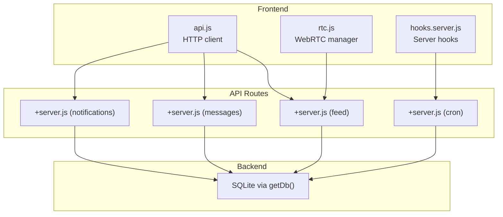
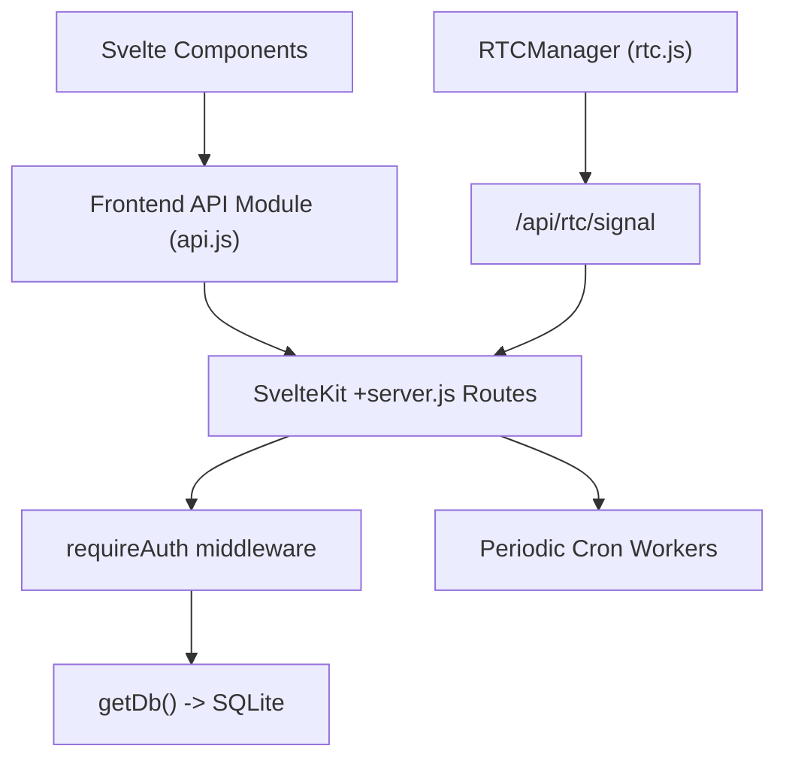
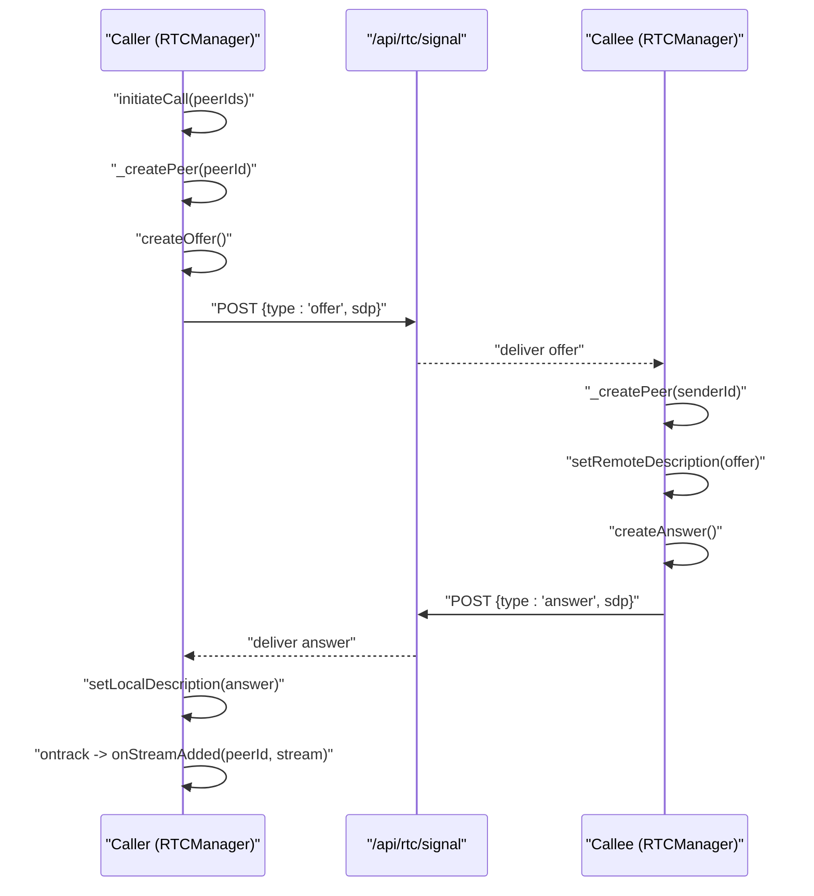
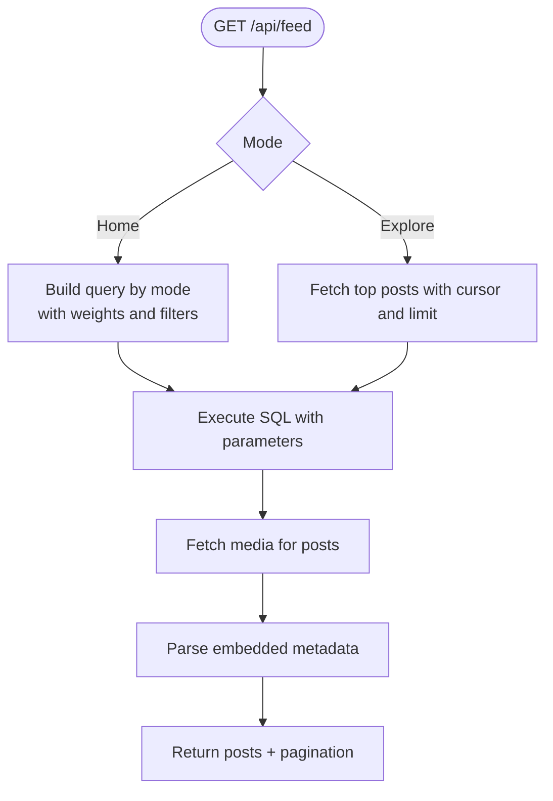
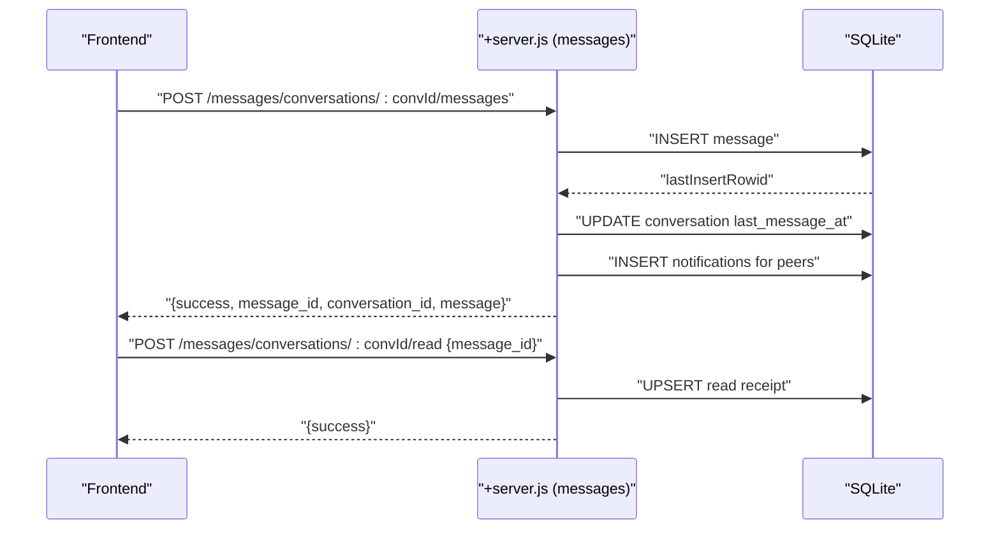
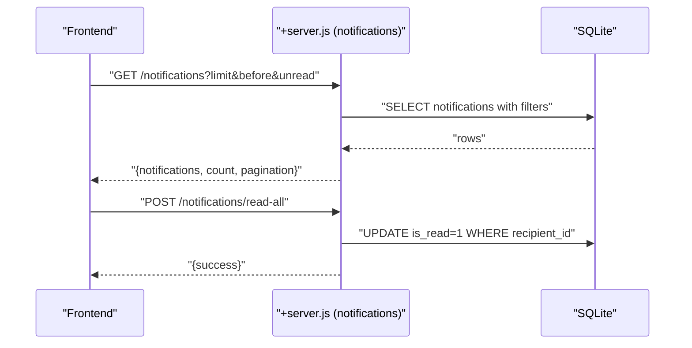
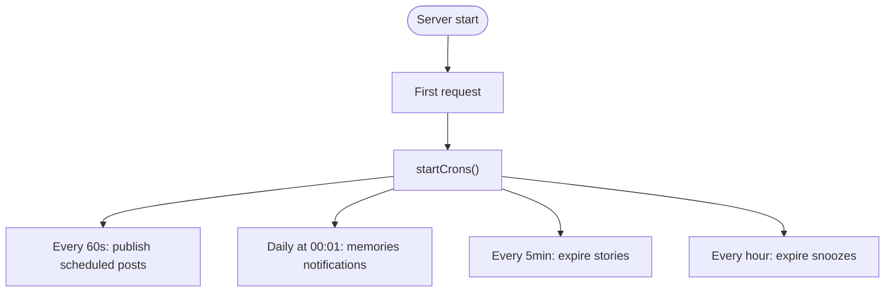
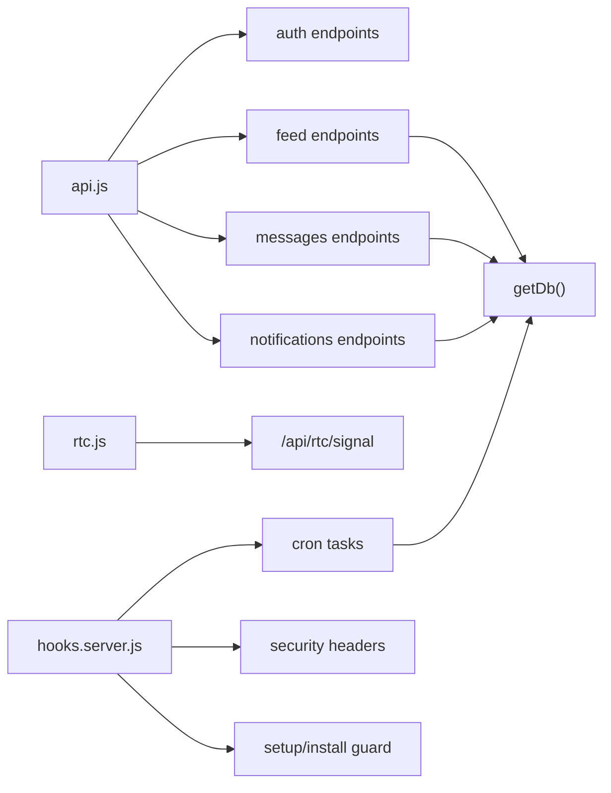

# Data Flow & Communication

<cite>
**Referenced Files in This Document**
- [api.js](file://frontend/src/lib/api.js)
- [rtc.js](file://frontend/src/lib/rtc.js)
- [hooks.server.js](file://frontend/src/hooks.server.js)
- [+server.js (feed)](file://frontend/src/routes/api/feed/[...path]/+server.js)
- [+server.js (messages)](file://frontend/src/routes/api/messages/[...path]/+server.js)
- [+server.js (notifications)](file://frontend/src/routes/api/notifications/[...path]/+server.js)
- [+server.js (cron)](file://frontend/src/routes/api/cron/+server.js)
</cite>

## Table of Contents
1. [Introduction](#introduction)
2. [Project Structure](#project-structure)
3. [Core Components](#core-components)
4. [Architecture Overview](#architecture-overview)
5. [Detailed Component Analysis](#detailed-component-analysis)
6. [Dependency Analysis](#dependency-analysis)
7. [Performance Considerations](#performance-considerations)
8. [Troubleshooting Guide](#troubleshooting-guide)
9. [Conclusion](#conclusion)

## Introduction
This document explains VSocial’s end-to-end data flow and communication patterns. It covers:
- Request-response cycles from frontend components to API routes and database operations
- Real-time messaging and notifications via WebSocket-like signaling and periodic updates
- State synchronization between frontend stores and backend services
- Asynchronous processing for scheduled publishing, daily memories, cleanup, and cron-triggered maintenance
- Error propagation, retry strategies, and failure handling
- Sequence diagrams for common user workflows (posting content, sending messages, real-time interactions)
- Validation, sanitization, and transformation at each communication boundary

## Project Structure
VSocial’s frontend uses SvelteKit with a conventional routes structure. API endpoints live under `/api/*`, organized by domain (feed, posts, messages, notifications, cron). A centralized HTTP client handles authenticated requests and JSON parsing. Server hooks manage security headers, setup guards, and global error handling. Background tasks are implemented as periodic cron workers.

**Diagram sources**
- [api.js:1-350](file://frontend/src/lib/api.js#L1-L350)
- [rtc.js:1-299](file://frontend/src/lib/rtc.js#L1-L299)
- [hooks.server.js:1-179](file://frontend/src/hooks.server.js#L1-L179)
- [+server.js (feed):1-239](file://frontend/src/routes/api/feed/[...path]/+server.js#L1-L239)
- [+server.js (messages):1-241](file://frontend/src/routes/api/messages/[...path]/+server.js#L1-L241)
- [+server.js (notifications):1-75](file://frontend/src/routes/api/notifications/[...path]/+server.js#L1-L75)
- [+server.js (cron):1-32](file://frontend/src/routes/api/cron/+server.js#L1-L32)

**Section sources**
- [api.js:1-350](file://frontend/src/lib/api.js#L1-L350)
- [rtc.js:1-299](file://frontend/src/lib/rtc.js#L1-L299)
- [hooks.server.js:1-179](file://frontend/src/hooks.server.js#L1-L179)
- [+server.js (feed):1-239](file://frontend/src/routes/api/feed/[...path]/+server.js#L1-L239)
- [+server.js (messages):1-241](file://frontend/src/routes/api/messages/[...path]/+server.js#L1-L241)
- [+server.js (notifications):1-75](file://frontend/src/routes/api/notifications/[...path]/+server.js#L1-L75)
- [+server.js (cron):1-32](file://frontend/src/routes/api/cron/+server.js#L1-L32)

## Core Components
- Frontend HTTP client: Centralized fetch wrapper with bearer token injection, JSON parsing, and error normalization.
- API module: Domain-specific namespaces for auth, feed, posts, users, stories, reels, messages, marketplace, notifications, admin, wallet, gigs, search, market, and health.
- Real-time communications: WebRTC mesh manager for audio/video with ICE/SDP signaling via a dedicated endpoint.
- Server hooks: Security headers, setup wizard guard, and global error handler with structured responses.
- API routes: Feed, messages, notifications, and cron endpoints implementing CRUD and specialized queries.
- Cron workers: Periodic tasks for scheduled post publishing, daily memories, expired stories cleanup, and snooze cleanup.

**Section sources**
- [api.js:1-350](file://frontend/src/lib/api.js#L1-L350)
- [rtc.js:1-299](file://frontend/src/lib/rtc.js#L1-L299)
- [hooks.server.js:1-179](file://frontend/src/hooks.server.js#L1-L179)
- [+server.js (feed):1-239](file://frontend/src/routes/api/feed/[...path]/+server.js#L1-L239)
- [+server.js (messages):1-241](file://frontend/src/routes/api/messages/[...path]/+server.js#L1-L241)
- [+server.js (notifications):1-75](file://frontend/src/routes/api/notifications/[...path]/+server.js#L1-L75)
- [+server.js (cron):1-32](file://frontend/src/routes/api/cron/+server.js#L1-L32)

## Architecture Overview
The system separates concerns across layers:
- Presentation: Svelte components and stores
- API Layer: SvelteKit server routes
- Persistence: SQLite accessed via a shared database client
- Real-time: WebRTC signaling and periodic updates for messages and notifications

**Diagram sources**
- [api.js:1-350](file://frontend/src/lib/api.js#L1-L350)
- [rtc.js:1-299](file://frontend/src/lib/rtc.js#L1-L299)
- [+server.js (feed):1-239](file://frontend/src/routes/api/feed/[...path]/+server.js#L1-L239)
- [+server.js (messages):1-241](file://frontend/src/routes/api/messages/[...path]/+server.js#L1-L241)
- [+server.js (notifications):1-75](file://frontend/src/routes/api/notifications/[...path]/+server.js#L1-L75)
- [+server.js (cron):1-32](file://frontend/src/routes/api/cron/+server.js#L1-L32)

## Detailed Component Analysis

### Frontend HTTP Client and API Module
- Provides authenticated fetch helpers and domain-specific namespaces.
- Injects Authorization header from local storage.
- Parses JSON responses and throws normalized errors with HTTP status and optional backend-provided error field.
- Uploads multipart/form-data for media.

Validation and transformation:
- Query parameters are constructed via URLSearchParams.
- Body payloads are stringified before sending.

**Section sources**
- [api.js:1-350](file://frontend/src/lib/api.js#L1-L350)

### Real-Time Messaging (WebRTC Mesh)
The RTC manager coordinates peer-to-peer audio/video:
- Manages peer connections, ICE candidates, and SDP offers/answers.
- Buffers ICE candidates until remote description is set.
- Supports ICE restarts with exponential backoff and a maximum retry threshold.
- Emits events for stream addition/removal and exposes connection quality metrics.

Signaling flow:
- Uses a dedicated endpoint to relay signaling messages between peers.
- Requires a valid bearer token from the current session.

**Diagram sources**
- [rtc.js:78-177](file://frontend/src/lib/rtc.js#L78-L177)
- [rtc.js:251-297](file://frontend/src/lib/rtc.js#L251-L297)

**Section sources**
- [rtc.js:1-299](file://frontend/src/lib/rtc.js#L1-L299)

### Feed API: Home, Explore, Preferences, Suggestions
Key behaviors:
- Authentication enforced per request.
- Home feed supports multiple modes (radar, chronological, intelligent, retention) with weighted scoring.
- Explore feed paginates by cursor and limits.
- Preferences retrieval and updates stored in user settings.
- Suggested users based on follower counts and following relationships.

Data transformation:
- Post bodies may include embedded metadata parsed into structured fields.
- Media attachments aggregated per post.

**Diagram sources**
- [+server.js (feed):47-217](file://frontend/src/routes/api/feed/[...path]/+server.js#L47-L217)

**Section sources**
- [+server.js (feed):1-239](file://frontend/src/routes/api/feed/[...path]/+server.js#L1-L239)

### Messages API: Conversations, Pagination, Read Receipts, Reactions
Endpoints:
- List conversations and DM creation between two users.
- Paginate messages with before/after cursors and reverse ordering when fetching older messages.
- Mark messages as read and persist read receipts.
- Add reactions to messages.

Data validation:
- Enforces participant checks for conversation access.
- Validates presence of message body or attachments.
- Sanitizes whitespace on text fields.

**Diagram sources**
- [+server.js (messages):149-240](file://frontend/src/routes/api/messages/[...path]/+server.js#L149-L240)

**Section sources**
- [+server.js (messages):1-241](file://frontend/src/routes/api/messages/[...path]/+server.js#L1-L241)

### Notifications API: Listing, Marking Read, Bulk Actions
- Lists notifications with cursor-based pagination and unread filtering.
- Supports marking a single notification or all notifications as read.
- Returns unread count and pagination metadata.

**Diagram sources**
- [+server.js (notifications):8-75](file://frontend/src/routes/api/notifications/[...path]/+server.js#L8-L75)

**Section sources**
- [+server.js (notifications):1-75](file://frontend/src/routes/api/notifications/[...path]/+server.js#L1-L75)

### Cron Workers: Scheduled Tasks
Periodic tasks executed on the first request after boot:
- Publish scheduled posts (every minute).
- Daily “Memories” notifications (runs at 00:01).
- Cleanup expired stories (every 5 minutes).
- Cleanup expired snoozes (hourly).

**Diagram sources**
- [hooks.server.js:18-103](file://frontend/src/hooks.server.js#L18-L103)

**Section sources**
- [hooks.server.js:1-179](file://frontend/src/hooks.server.js#L1-L179)

### Server Hooks: Security, Setup Guard, Error Handling
- Sets security headers on all responses.
- Redirects anonymous users to setup or install pages depending on DB state.
- Global error handler logs structured errors and returns sanitized responses to clients.

**Section sources**
- [hooks.server.js:105-179](file://frontend/src/hooks.server.js#L105-L179)

## Dependency Analysis
- Frontend API module depends on the centralized HTTP client and domain-specific endpoints.
- API routes depend on the database client and authentication middleware.
- RTC signaling depends on the API client and requires a valid bearer token.
- Cron workers depend on environment configuration and database client.

**Diagram sources**
- [api.js:1-350](file://frontend/src/lib/api.js#L1-L350)
- [rtc.js:1-299](file://frontend/src/lib/rtc.js#L1-L299)
- [hooks.server.js:1-179](file://frontend/src/hooks.server.js#L1-L179)
- [+server.js (feed):1-239](file://frontend/src/routes/api/feed/[...path]/+server.js#L1-L239)
- [+server.js (messages):1-241](file://frontend/src/routes/api/messages/[...path]/+server.js#L1-L241)
- [+server.js (notifications):1-75](file://frontend/src/routes/api/notifications/[...path]/+server.js#L1-L75)
- [+server.js (cron):1-32](file://frontend/src/routes/api/cron/+server.js#L1-L32)

**Section sources**
- [api.js:1-350](file://frontend/src/lib/api.js#L1-L350)
- [rtc.js:1-299](file://frontend/src/lib/rtc.js#L1-L299)
- [hooks.server.js:1-179](file://frontend/src/hooks.server.js#L1-L179)
- [+server.js (feed):1-239](file://frontend/src/routes/api/feed/[...path]/+server.js#L1-L239)
- [+server.js (messages):1-241](file://frontend/src/routes/api/messages/[...path]/+server.js#L1-L241)
- [+server.js (notifications):1-75](file://frontend/src/routes/api/notifications/[...path]/+server.js#L1-L75)
- [+server.js (cron):1-32](file://frontend/src/routes/api/cron/+server.js#L1-L32)

## Performance Considerations
- Cursor-based pagination reduces overhead and avoids OFFSET.
- Weighted scoring in intelligent feed balances social, popularity, recency, and diversity.
- Batch updates for scheduled publishing minimize repeated writes.
- ICE restarts with exponential backoff reduce signaling overhead during transient failures.
- Limit query sizes (e.g., 50 for feeds, 100 for messages) to cap resource usage.

## Troubleshooting Guide
Common issues and strategies:
- Unauthorized access: Verify bearer token presence and validity; check setup/install redirects.
- Empty or malformed responses: Ensure Content-Type is application/json; normalize error responses.
- ICE failures: Monitor ICE state transitions; leverage ICE restarts and buffer candidates.
- Cron tasks not running: Confirm environment variable availability and first-request trigger.
- Database errors: Inspect structured error logs and return sanitized messages to clients.

**Section sources**
- [api.js:33-46](file://frontend/src/lib/api.js#L33-L46)
- [rtc.js:108-167](file://frontend/src/lib/rtc.js#L108-L167)
- [hooks.server.js:154-178](file://frontend/src/hooks.server.js#L154-L178)
- [+server.js (cron):5-13](file://frontend/src/routes/api/cron/+server.js#L5-L13)

## Conclusion
VSocial’s communication model combines a centralized HTTP client, domain-specific API routes, and robust server hooks. Real-time interactions are handled via WebRTC with resilient signaling and ICE management. Asynchronous tasks keep the platform fresh and tidy. Clear validation, sanitization, and error handling ensure predictable behavior across boundaries.