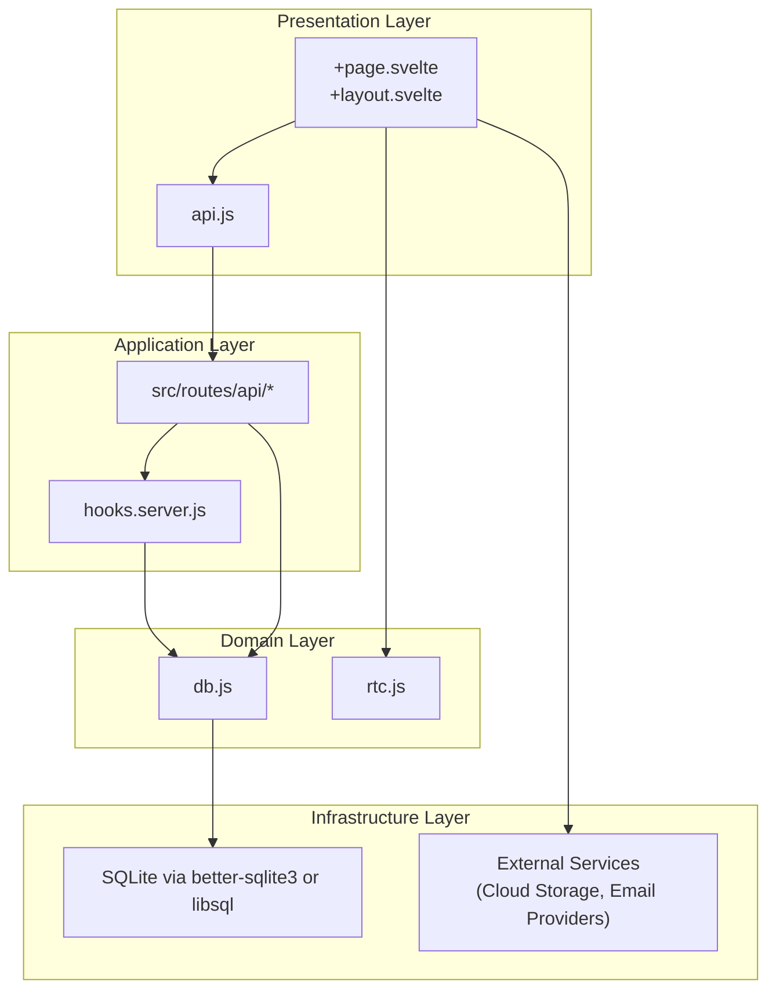
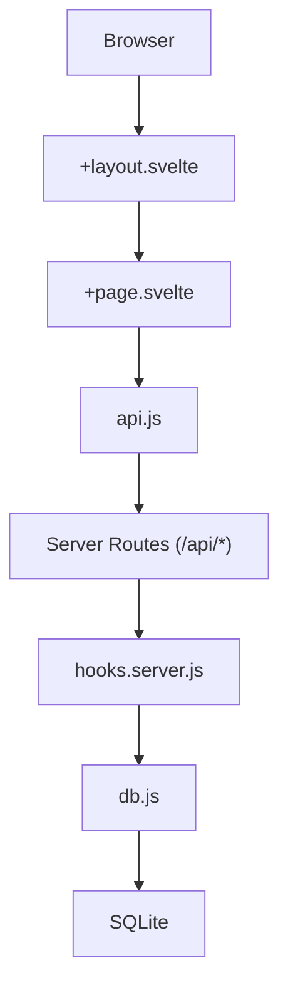
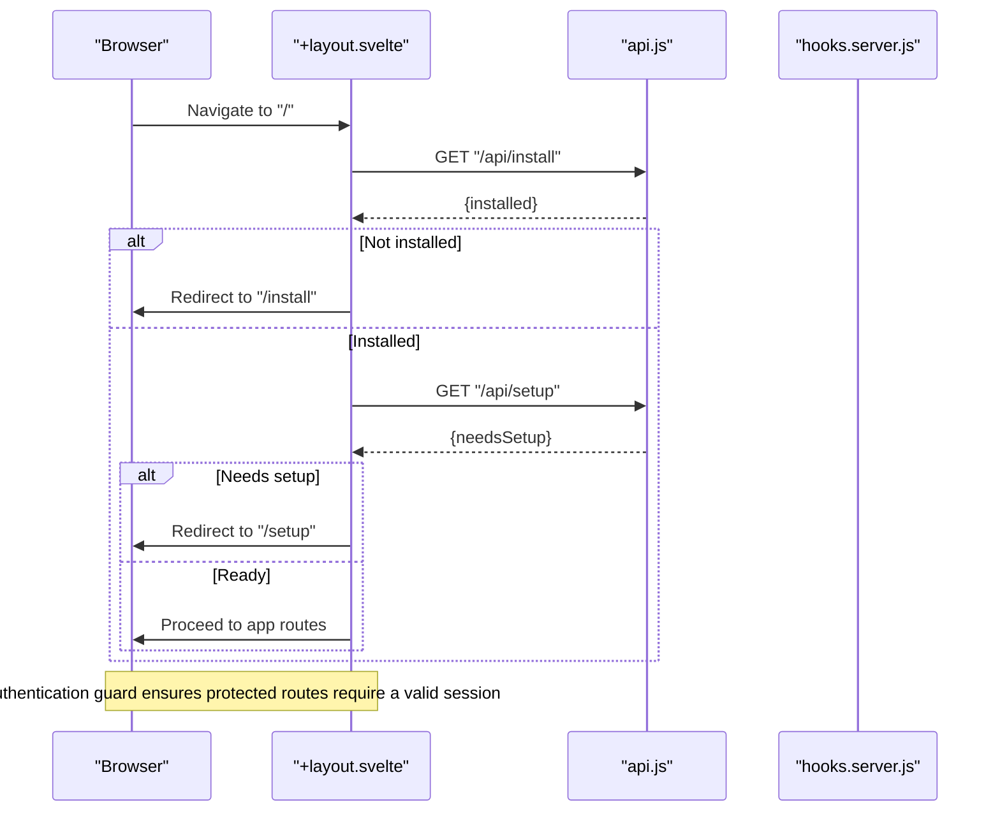
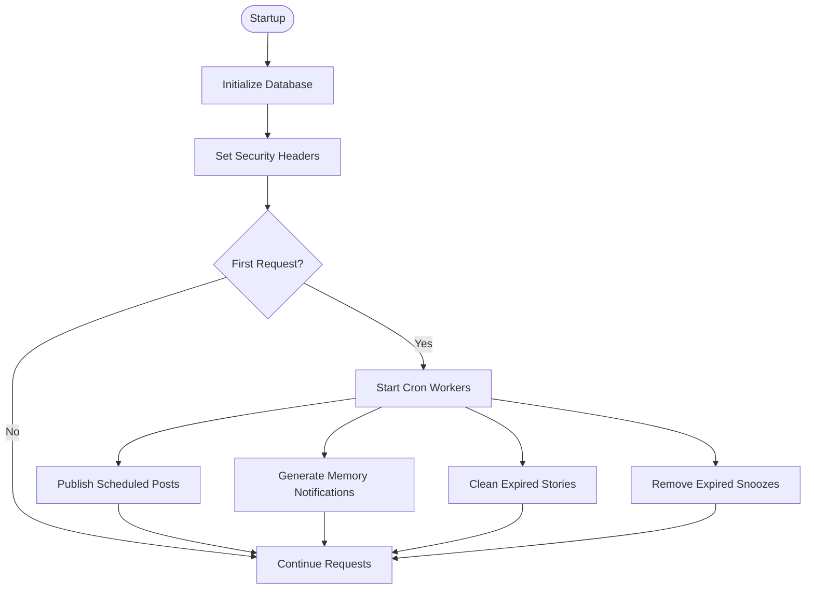
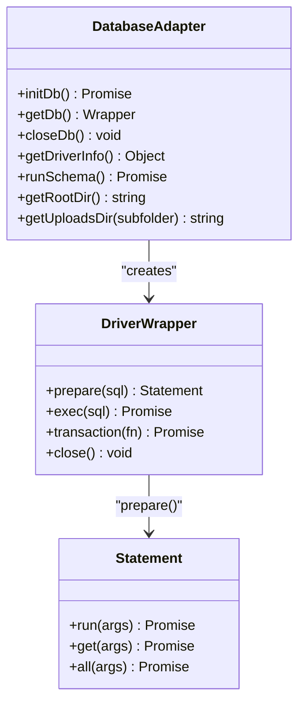
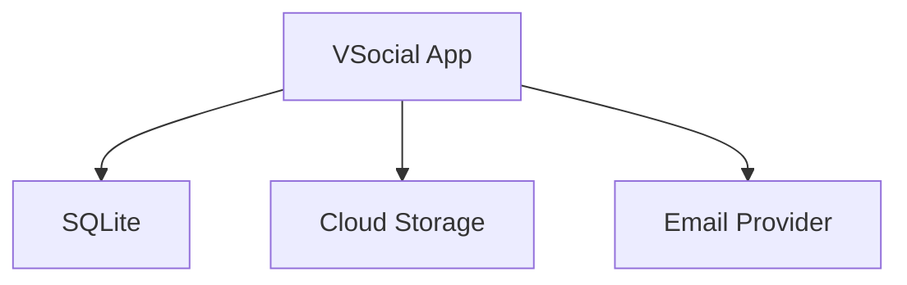
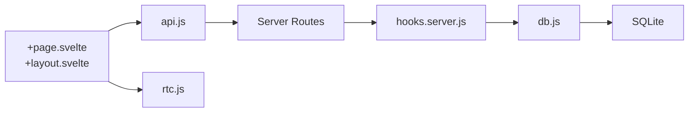
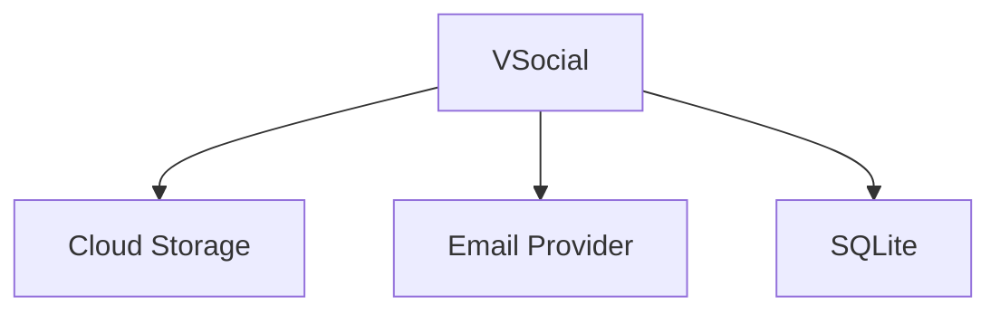

# System Design Overview

<cite>
**Referenced Files in This Document**
- [ARCHITECTURE.md](file://ARCHITECTURE.md)
- [README.md](file://README.md)
- [frontend/package.json](file://frontend/package.json)
- [docker-compose.yml](file://docker-compose.yml)
- [Dockerfile](file://Dockerfile)
- [frontend/src/hooks.server.js](file://frontend/src/hooks.server.js)
- [frontend/src/lib/api.js](file://frontend/src/lib/api.js)
- [frontend/src/lib/rtc.js](file://frontend/src/lib/rtc.js)
- [frontend/src/lib/server/db.js](file://frontend/src/lib/server/db.js)
- [frontend/src/routes/+layout.svelte](file://frontend/src/routes/+layout.svelte)
- [frontend/src/routes/+page.svelte](file://frontend/src/routes/+page.svelte)
- [frontend/svelte.config.js](file://frontend/svelte.config.js)
</cite>

## Table of Contents
1. [Introduction](#introduction)
2. [Project Structure](#project-structure)
3. [Core Components](#core-components)
4. [Architecture Overview](#architecture-overview)
5. [Detailed Component Analysis](#detailed-component-analysis)
6. [Dependency Analysis](#dependency-analysis)
7. [Performance Considerations](#performance-considerations)
8. [Troubleshooting Guide](#troubleshooting-guide)
9. [Conclusion](#conclusion)
10. [Appendices](#appendices)

## Introduction
This document presents a comprehensive system design overview of VSocial, a full-stack social network application. The platform follows a four-layered architecture:
- Presentation Layer (SvelteKit frontend)
- Application Layer (server routes)
- Domain Layer (business logic)
- Infrastructure Layer (database and external services)

It documents system boundaries, component interactions, and data flow patterns. It also explains separation of concerns, modularity principles, and how the layers communicate. Finally, it outlines scalability patterns, load balancing considerations, and microservice boundaries where applicable.

## Project Structure
VSocial’s repository is organized around a single SvelteKit application under the frontend directory. The application exposes server routes under src/routes/api/*, a centralized API client in src/lib/api.js, and a WebRTC manager for real-time communication in src/lib/rtc.js. The database abstraction lives in src/lib/server/db.js, while global server hooks orchestrate initialization, security headers, cron jobs, and error handling.

**Diagram sources**
- [frontend/src/routes/+page.svelte:1-20](file://frontend/src/routes/+page.svelte#L1-L20)
- [frontend/src/routes/+layout.svelte:1-30](file://frontend/src/routes/+layout.svelte#L1-L30)
- [frontend/src/lib/api.js:1-20](file://frontend/src/lib/api.js#L1-L20)
- [frontend/src/hooks.server.js:1-20](file://frontend/src/hooks.server.js#L1-L20)
- [frontend/src/lib/server/db.js:1-20](file://frontend/src/lib/server/db.js#L1-L20)
- [frontend/src/lib/rtc.js:1-10](file://frontend/src/lib/rtc.js#L1-L10)

**Section sources**
- [README.md:22-29](file://README.md#L22-L29)
- [frontend/package.json:17-32](file://frontend/package.json#L17-L32)
- [frontend/svelte.config.js:1-19](file://frontend/svelte.config.js#L1-L19)

## Core Components
- Presentation Layer
  - SvelteKit runtime with Svelte 5 Runes, SSR/CSR hybrid rendering, and a custom UI theme engine.
  - Centralized API client (api.js) encapsulates HTTP requests, authentication, and error handling.
  - Real-time communication via WebRTC mesh manager (rtc.js) for audio/video calls.
- Application Layer
  - Server hooks (hooks.server.js) initialize the database, enforce security headers, guard setup/install flows, and run periodic tasks (cron).
  - Server routes under src/routes/api/* implement REST endpoints for auth, feed, posts, users, stories, reels, messages, marketplace, notifications, admin, wallet, gigs, search, and health checks.
- Domain Layer
  - Database abstraction (db.js) supports both @libsql/client and better-sqlite3 with a unified async API, PRAGMA tuning, and transaction support.
  - Business logic is embedded within server routes and shared helpers, keeping domain logic close to application boundaries.
- Infrastructure Layer
  - SQLite as the primary datastore, configured with WAL mode and pragmas for concurrency and performance.
  - Optional external integrations for cloud storage and email providers (configured via environment variables).

**Section sources**
- [ARCHITECTURE.md:10-24](file://ARCHITECTURE.md#L10-L24)
- [frontend/src/lib/api.js:1-46](file://frontend/src/lib/api.js#L1-L46)
- [frontend/src/lib/rtc.js:1-45](file://frontend/src/lib/rtc.js#L1-L45)
- [frontend/src/hooks.server.js:1-20](file://frontend/src/hooks.server.js#L1-L20)
- [frontend/src/lib/server/db.js:1-26](file://frontend/src/lib/server/db.js#L1-L26)

## Architecture Overview
VSocial employs a layered architecture with clear separation of concerns:
- Presentation Layer handles UI rendering, user interactions, optimistic updates, and real-time media.
- Application Layer manages cross-cutting concerns (security, initialization, scheduling) and exposes REST endpoints.
- Domain Layer encapsulates data access and transactional operations.
- Infrastructure Layer provides persistent storage and optional external service integrations.

**Diagram sources**
- [frontend/src/routes/+layout.svelte:1-30](file://frontend/src/routes/+layout.svelte#L1-L30)
- [frontend/src/routes/+page.svelte:1-20](file://frontend/src/routes/+page.svelte#L1-L20)
- [frontend/src/lib/api.js:1-20](file://frontend/src/lib/api.js#L1-L20)
- [frontend/src/hooks.server.js:1-20](file://frontend/src/hooks.server.js#L1-L20)
- [frontend/src/lib/server/db.js:1-20](file://frontend/src/lib/server/db.js#L1-L20)

## Detailed Component Analysis

### Presentation Layer
- Routing and Shell
  - The application layout orchestrates public/admin/app routes, redirects based on installation and authentication state, and initializes theme and notifications.
- Optimistic UI and Real-time Updates
  - The layout connects to notifications upon authentication and guards against redirect loops during setup/install flows.
- UI Rendering
  - The home page demonstrates reactive state, animations, and mock analytics to illustrate performance characteristics.

**Diagram sources**
- [frontend/src/routes/+layout.svelte:32-93](file://frontend/src/routes/+layout.svelte#L32-L93)
- [frontend/src/lib/api.js:347-347](file://frontend/src/lib/api.js#L347-L347)

**Section sources**
- [frontend/src/routes/+layout.svelte:32-93](file://frontend/src/routes/+layout.svelte#L32-L93)
- [frontend/src/routes/+page.svelte:1-60](file://frontend/src/routes/+page.svelte#L1-L60)

### Application Layer
- Server Hooks
  - Initializes the database on startup, sets security headers, guards setup/install routes, starts cron workers on first request, and provides a global error handler.
- Cron Workers
  - Scheduled tasks include publishing scheduled posts, generating “memories” notifications, cleaning expired stories, and removing expired snoozes.
- Route Exposure
  - The application exposes numerous server routes under src/routes/api/* for auth, feed, posts, users, stories, reels, messages, marketplace, notifications, admin, wallet, gigs, search, SSE, and health checks.

**Diagram sources**
- [frontend/src/hooks.server.js:7-14](file://frontend/src/hooks.server.js#L7-L14)
- [frontend/src/hooks.server.js:105-147](file://frontend/src/hooks.server.js#L105-L147)
- [frontend/src/hooks.server.js:18-103](file://frontend/src/hooks.server.js#L18-L103)

**Section sources**
- [frontend/src/hooks.server.js:1-179](file://frontend/src/hooks.server.js#L1-L179)

### Domain Layer
- Database Abstraction
  - Supports @libsql/client (preferred) and better-sqlite3 (fallback) with a unified async API (prepare/run/get/all/exec/transaction/close).
  - Automatically applies PRAGMA settings for WAL mode, foreign keys, timeouts, and caching.
- Transaction Management
  - Provides a transaction wrapper that begins immediate transactions and safely rolls back on errors.
- Environment and Paths
  - Resolves DB path/url, creates directories if missing, and exposes helpers for uploads and schema execution.

**Diagram sources**
- [frontend/src/lib/server/db.js:117-167](file://frontend/src/lib/server/db.js#L117-L167)
- [frontend/src/lib/server/db.js:31-113](file://frontend/src/lib/server/db.js#L31-L113)
- [frontend/src/lib/server/db.js:78-112](file://frontend/src/lib/server/db.js#L78-L112)

**Section sources**
- [frontend/src/lib/server/db.js:1-209](file://frontend/src/lib/server/db.js#L1-L209)

### Infrastructure Layer
- Database
  - SQLite with WAL mode enabled for concurrent reads and writes. Uses PRAGMA settings for performance and reliability.
- External Services
  - Cloud storage and email providers are integrated via environment variables and libraries present in the dependency graph (e.g., nodemailer, web-push).
- Containerization
  - Dockerfile builds a production image and runs the Node.js server. docker-compose defines health checks and mounts persistent volumes.

**Diagram sources**
- [frontend/package.json:27-31](file://frontend/package.json#L27-L31)
- [docker-compose.yml:1-27](file://docker-compose.yml#L1-L27)
- [Dockerfile:1-30](file://Dockerfile#L1-L30)

**Section sources**
- [ARCHITECTURE.md:20-24](file://ARCHITECTURE.md#L20-L24)
- [frontend/package.json:17-32](file://frontend/package.json#L17-L32)
- [docker-compose.yml:1-27](file://docker-compose.yml#L1-L27)
- [Dockerfile:1-30](file://Dockerfile#L1-L30)

## Dependency Analysis
- Internal Dependencies
  - Presentation Layer depends on the centralized API client (api.js) for all backend interactions.
  - Application Layer depends on server hooks and routes; routes depend on the database abstraction.
  - Domain Layer depends on the database abstraction and optionally on WebRTC for real-time media.
- External Dependencies
  - Database drivers (@libsql/client or better-sqlite3) are selected at runtime.
  - Security and operational libraries (express-rate-limit, helmet) are configured via server hooks.
- Containerization
  - Docker Compose exposes port 3000, sets environment variables for DB path and JWT secret, and defines a health check.

**Diagram sources**
- [frontend/src/lib/api.js:1-20](file://frontend/src/lib/api.js#L1-L20)
- [frontend/src/hooks.server.js:1-20](file://frontend/src/hooks.server.js#L1-L20)
- [frontend/src/lib/server/db.js:1-20](file://frontend/src/lib/server/db.js#L1-L20)
- [frontend/src/lib/rtc.js:1-10](file://frontend/src/lib/rtc.js#L1-L10)

**Section sources**
- [frontend/src/lib/api.js:1-350](file://frontend/src/lib/api.js#L1-L350)
- [frontend/src/hooks.server.js:1-179](file://frontend/src/hooks.server.js#L1-L179)
- [frontend/src/lib/server/db.js:1-209](file://frontend/src/lib/server/db.js#L1-L209)
- [frontend/src/lib/rtc.js:1-299](file://frontend/src/lib/rtc.js#L1-L299)

## Performance Considerations
- Database Concurrency
  - SQLite WAL mode enables concurrent readers and reduces writer contention, aligning with the documented performance goals.
- Build and Runtime
  - SvelteKit adapter-node configuration enables precompression and explicit environment handling for production builds.
- Real-time Media
  - WebRTC mesh networking leverages STUN/TURN servers and includes ICE restart logic and connection quality monitoring.

**Section sources**
- [ARCHITECTURE.md:20-24](file://ARCHITECTURE.md#L20-L24)
- [frontend/svelte.config.js:9-15](file://frontend/svelte.config.js#L9-L15)
- [frontend/src/lib/rtc.js:18-44](file://frontend/src/lib/rtc.js#L18-L44)

## Troubleshooting Guide
- Database Initialization Failures
  - The server logs database driver readiness and throws if neither @libsql/client nor better-sqlite3 is available.
- Global Error Handling
  - A centralized error handler captures unhandled async errors, logs structured details, and returns generic error responses to clients.
- Setup and Installation Guards
  - The layout enforces redirects to installation and setup flows when the database is uninitialized or when setup is incomplete.

**Section sources**
- [frontend/src/lib/server/db.js:117-167](file://frontend/src/lib/server/db.js#L117-L167)
- [frontend/src/hooks.server.js:154-178](file://frontend/src/hooks.server.js#L154-L178)
- [frontend/src/routes/+layout.svelte:42-93](file://frontend/src/routes/+layout.svelte#L42-L93)

## Conclusion
VSocial’s architecture cleanly separates presentation, application, domain, and infrastructure concerns. The SvelteKit frontend interacts with a centralized API client that communicates with server routes. Server hooks manage initialization, security, and scheduling, while the database abstraction provides a unified interface to SQLite. The system is container-ready, with health checks and environment-driven configuration. While the current implementation is monolithic, the modular structure and clear boundaries enable future microservice decomposition along feature domains (e.g., messages, marketplace, wallet) with shared database and external service integrations.

## Appendices
- System Context Diagrams
  - VSocial integrates with external services for cloud storage and email delivery, configured via environment variables and libraries present in the dependency graph.

**Diagram sources**
- [frontend/package.json:27-31](file://frontend/package.json#L27-L31)
- [ARCHITECTURE.md:20-24](file://ARCHITECTURE.md#L20-L24)