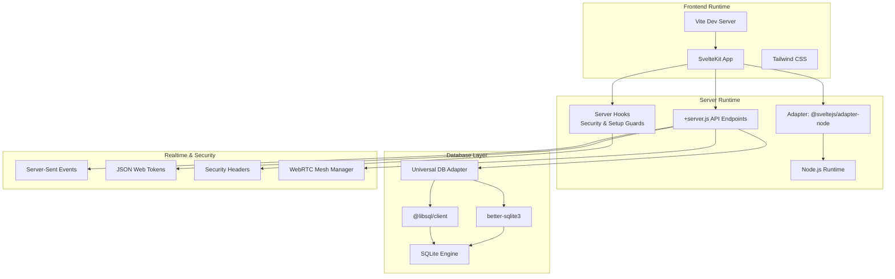
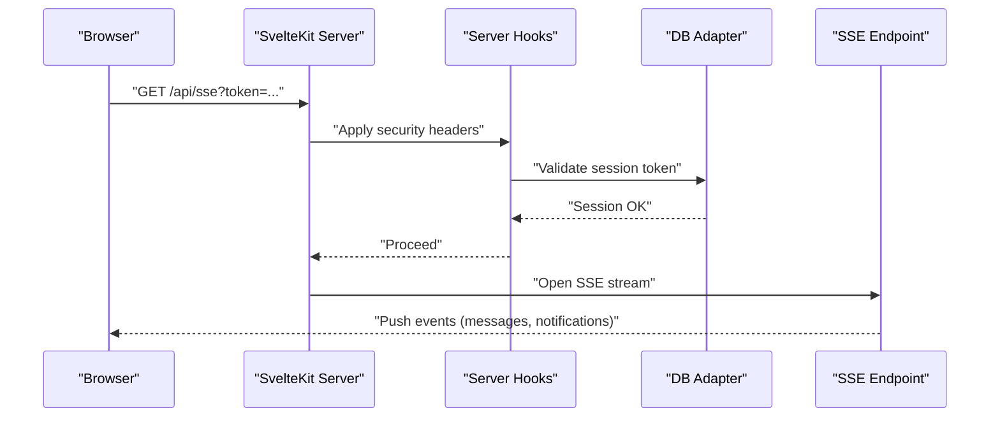
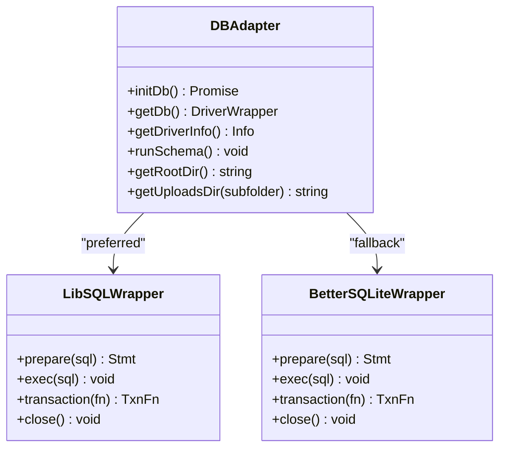
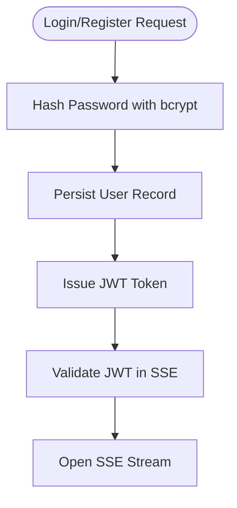
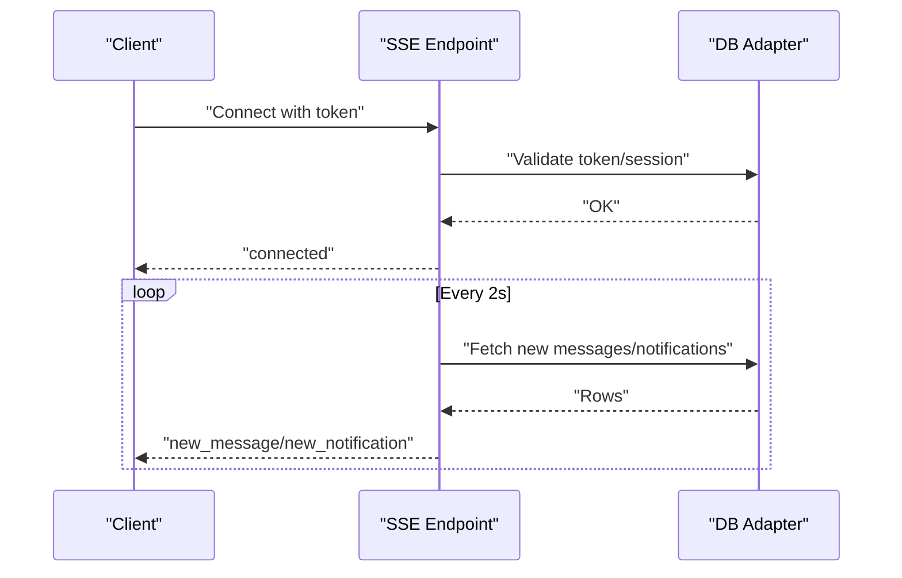
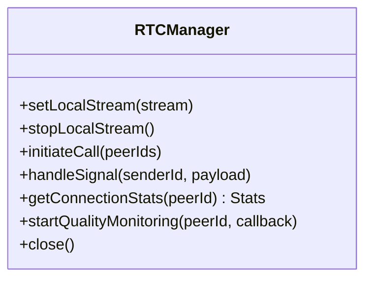
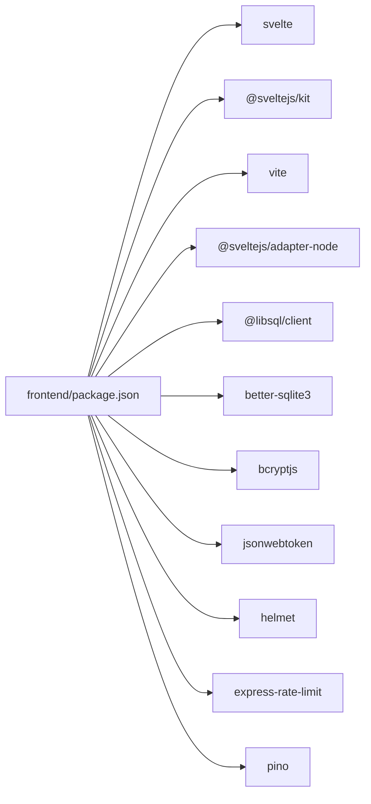

# Technology Stack

<cite>
**Referenced Files in This Document**
- [frontend/package.json](file://frontend/package.json)
- [frontend/svelte.config.js](file://frontend/svelte.config.js)
- [frontend/vite.config.js](file://frontend/vite.config.js)
- [frontend/src/hooks.server.js](file://frontend/src/hooks.server.js)
- [frontend/src/lib/server/db.js](file://frontend/src/lib/server/db.js)
- [frontend/src/lib/stores/auth.svelte.js](file://frontend/src/lib/stores/auth.svelte.js)
- [frontend/src/lib/rtc.js](file://frontend/src/lib/rtc.js)
- [frontend/src/routes/api/sse/+server.js](file://frontend/src/routes/api/sse/+server.js)
- [frontend/src/routes/api/health/+server.js](file://frontend/src/routes/api/health/+server.js)
- [frontend/src/routes/api/setup/+server.js](file://frontend/src/routes/api/setup/+server.js)
- [Dockerfile](file://Dockerfile)
- [docker-compose.yml](file://docker-compose.yml)
</cite>

## Table of Contents
1. [Introduction](#introduction)
2. [Project Structure](#project-structure)
3. [Core Components](#core-components)
4. [Architecture Overview](#architecture-overview)
5. [Detailed Component Analysis](#detailed-component-analysis)
6. [Dependency Analysis](#dependency-analysis)
7. [Performance Considerations](#performance-considerations)
8. [Troubleshooting Guide](#troubleshooting-guide)
9. [Conclusion](#conclusion)
10. [Appendices](#appendices)

## Introduction
This document describes the technology stack powering VSocial, focusing on the frontend (Svelte 5, SvelteKit, Tailwind CSS, Vite), backend (Node.js runtime via SvelteKit adapters), and supporting systems (SQLite and libSQL-compatible databases, authentication, real-time communication, security middleware, and deployment). It also outlines version compatibility, upgrade paths, and the rationale behind key technology choices.

## Project Structure
The repository is organized around a frontend-first SvelteKit application with server-side logic integrated through SvelteKit’s route handlers and hooks. The backend logic is implemented in JavaScript/Node.js using SvelteKit’s adapter for production builds. Database connectivity is abstracted to support both libSQL-compatible clients and local SQLite drivers. Real-time features are implemented via SSE and WebRTC mesh signaling.

**Diagram sources**
- [frontend/svelte.config.js:1-19](file://frontend/svelte.config.js#L1-L19)
- [frontend/vite.config.js:1-14](file://frontend/vite.config.js#L1-L14)
- [frontend/src/hooks.server.js:1-179](file://frontend/src/hooks.server.js#L1-L179)
- [frontend/src/lib/server/db.js:1-209](file://frontend/src/lib/server/db.js#L1-L209)
- [frontend/src/routes/api/sse/+server.js:1-185](file://frontend/src/routes/api/sse/+server.js#L1-L185)
- [frontend/src/lib/stores/auth.svelte.js:1-131](file://frontend/src/lib/stores/auth.svelte.js#L1-L131)
- [frontend/src/lib/rtc.js:1-299](file://frontend/src/lib/rtc.js#L1-L299)

**Section sources**
- [frontend/svelte.config.js:1-19](file://frontend/svelte.config.js#L1-L19)
- [frontend/vite.config.js:1-14](file://frontend/vite.config.js#L1-L14)
- [frontend/src/hooks.server.js:1-179](file://frontend/src/hooks.server.js#L1-L179)

## Core Components
- Frontend framework: Svelte 5 with SvelteKit for routing and SSR/SSG, plus Vite for dev/build.
- Styling: Tailwind CSS configured via SvelteKit.
- Backend runtime: Node.js with SvelteKit adapter for server-side rendering and API endpoints.
- Database: Universal adapter supporting both libSQL-compatible clients and local SQLite via better-sqlite3.
- Authentication: JWT-based sessions with bcrypt for password hashing.
- Real-time: SSE for notifications/messages and WebRTC mesh signaling.
- Security: Helmet-inspired headers and rate limiting; additional security headers applied in server hooks.
- Deployment: Multi-stage Docker images and docker-compose orchestration.

**Section sources**
- [frontend/package.json:17-47](file://frontend/package.json#L17-L47)
- [frontend/svelte.config.js:1-19](file://frontend/svelte.config.js#L1-L19)
- [frontend/src/lib/server/db.js:1-209](file://frontend/src/lib/server/db.js#L1-L209)
- [frontend/src/lib/stores/auth.svelte.js:1-131](file://frontend/src/lib/stores/auth.svelte.js#L1-L131)
- [frontend/src/routes/api/sse/+server.js:1-185](file://frontend/src/routes/api/sse/+server.js#L1-L185)
- [frontend/src/lib/rtc.js:1-299](file://frontend/src/lib/rtc.js#L1-L299)
- [Dockerfile:1-30](file://Dockerfile#L1-L30)
- [docker-compose.yml:1-27](file://docker-compose.yml#L1-L27)

## Architecture Overview
The system uses SvelteKit as the application shell, delegating server-side concerns to Node.js via the adapter. Database operations are abstracted behind a unified interface that supports both remote libSQL-compatible engines and local SQLite. Real-time features are layered on top of traditional HTTP APIs, with SSE for long-lived streams and WebRTC for peer-to-peer media.

**Diagram sources**
- [frontend/src/routes/api/sse/+server.js:1-185](file://frontend/src/routes/api/sse/+server.js#L1-L185)
- [frontend/src/hooks.server.js:105-147](file://frontend/src/hooks.server.js#L105-L147)
- [frontend/src/lib/server/db.js:183-190](file://frontend/src/lib/server/db.js#L183-L190)

## Detailed Component Analysis

### Frontend Stack: Svelte 5, SvelteKit, Tailwind CSS, Vite
- Svelte 5: Uses SvelteKit’s recommended runes mode for reactivity and performance.
- SvelteKit: Provides routing, server hooks, and adapter-based SSR/SSG.
- Tailwind CSS: Integrated via SvelteKit configuration for utility-first styling.
- Vite: Development server and build toolchain for fast iteration and optimized production bundles.

Key configuration highlights:
- SvelteKit adapter configured to Node for server-side rendering and API endpoints.
- Vite plugin for Svelte integrated with allowed hosts and filesystem permissions for uploads.
- Scripts for dev, build, preview, lint, format, and test.

**Section sources**
- [frontend/package.json:6-16](file://frontend/package.json#L6-L16)
- [frontend/svelte.config.js:1-19](file://frontend/svelte.config.js#L1-L19)
- [frontend/vite.config.js:1-14](file://frontend/vite.config.js#L1-L14)

### Backend Stack: Node.js, SvelteKit Routing, and Build Tools
- Node.js runtime: Used for both development and production via the adapter.
- SvelteKit routing: Implemented through +server.js endpoints under src/routes/api/.
- Build pipeline: Vite-driven with SvelteKit plugin; production builds output to build/.

**Section sources**
- [Dockerfile:2,15:2-15](file://Dockerfile#L2-L15)
- [frontend/svelte.config.js:9-15](file://frontend/svelte.config.js#L9-L15)
- [frontend/vite.config.js:1-14](file://frontend/vite.config.js#L1-L14)

### Database Technologies: SQLite and libSQL-Compatible Engines
The database layer provides a unified async API across drivers:
- Preferred: @libsql/client (supports remote engines and local WAL mode).
- Fallback: better-sqlite3 (native, WAL enabled, synchronous tuning).
- Shared API: prepare().run/get/all() returning promises; transaction wrapper; exec for multi-statement scripts.

**Diagram sources**
- [frontend/src/lib/server/db.js:31-113](file://frontend/src/lib/server/db.js#L31-L113)
- [frontend/src/lib/server/db.js:120-167](file://frontend/src/lib/server/db.js#L120-L167)

Operational behavior:
- Auto-initialization on server start with logging of driver and mode.
- Environment-driven configuration for DB_URL and DB_PATH.
- Pragmas tuned for performance and reliability (WAL, foreign keys, timeouts).
- Schema execution from a SQL file during setup.

**Section sources**
- [frontend/src/hooks.server.js:7-14](file://frontend/src/hooks.server.js#L7-L14)
- [frontend/src/lib/server/db.js:16-22](file://frontend/src/lib/server/db.js#L16-L22)
- [frontend/src/lib/server/db.js:120-167](file://frontend/src/lib/server/db.js#L120-L167)
- [frontend/src/routes/api/setup/+server.js:16-71](file://frontend/src/routes/api/setup/+server.js#L16-L71)

### Authentication Libraries: bcryptjs, jsonwebtoken
- bcryptjs: Used for secure password hashing during setup and user registration flows.
- jsonwebtoken: Used for JWT decoding in SSE endpoints to validate sessions.

**Diagram sources**
- [frontend/src/routes/api/setup/+server.js:34-45](file://frontend/src/routes/api/setup/+server.js#L34-L45)
- [frontend/src/routes/api/sse/+server.js:18-24](file://frontend/src/routes/api/sse/+server.js#L18-L24)

**Section sources**
- [frontend/src/routes/api/setup/+server.js:8,34-45](file://frontend/src/routes/api/setup/+server.js#L8,L34-L45)
- [frontend/src/routes/api/sse/+server.js:6,18-24](file://frontend/src/routes/api/sse/+server.js#L6,L18-L24)

### Real-Time Communication: Server-Sent Events (SSE) and WebRTC
- SSE: Long-lived connection for notifications and messages; validates JWT via query parameter and maintains keepalive.
- WebRTC: Mesh-based manager for audio/video with STUN/TURN servers, ICE restarts, and connection quality monitoring.

**Diagram sources**
- [frontend/src/routes/api/sse/+server.js:9-184](file://frontend/src/routes/api/sse/+server.js#L9-L184)

**Diagram sources**
- [frontend/src/lib/rtc.js:7-299](file://frontend/src/lib/rtc.js#L7-L299)

**Section sources**
- [frontend/src/routes/api/sse/+server.js:1-185](file://frontend/src/routes/api/sse/+server.js#L1-L185)
- [frontend/src/lib/rtc.js:1-299](file://frontend/src/lib/rtc.js#L1-L299)

### Security Middleware: Helmet-Inspired Headers and Rate Limiting
- Security headers: Applied in server hooks for X-Content-Type-Options, X-Frame-Options, Referrer-Policy, Permissions-Policy.
- Additional protections: Rate limiting via express-rate-limit and helmet for CSP and frame guards.
- Session validation: JWT decoding and token hash lookup for SSE.

**Section sources**
- [frontend/src/hooks.server.js:109-116](file://frontend/src/hooks.server.js#L109-L116)
- [frontend/package.json:24,25](file://frontend/package.json#L24,L25)
- [frontend/src/routes/api/sse/+server.js:18-24](file://frontend/src/routes/api/sse/+server.js#L18-L24)

### Development Tools, Testing, and Deployment
- Development: Vite dev server, ESLint/Prettier for formatting/linting, Vitest for unit/integration tests.
- Testing: Vitest configured for SvelteKit apps with supertest-style assertions.
- Deployment: Multi-stage Docker image building and running the Node-built app; docker-compose defines service, environment, and volume mounts.

**Section sources**
- [frontend/package.json:6,12,14-15](file://frontend/package.json#L6,L12,L14-L15)
- [Dockerfile:1-30](file://Dockerfile#L1-L30)
- [docker-compose.yml:1-27](file://docker-compose.yml#L1-L27)

## Dependency Analysis
The frontend package declares runtime and dev dependencies for Svelte 5, SvelteKit, Vite, Tailwind, and related tooling. Server-side dependencies include database clients, JWT utilities, bcrypt, helmet, rate limiting, and logging.

**Diagram sources**
- [frontend/package.json:17-47](file://frontend/package.json#L17-L47)

**Section sources**
- [frontend/package.json:17-47](file://frontend/package.json#L17-L47)

## Performance Considerations
- Database tuning: WAL mode, foreign keys, busy_timeout, cache_size, and temp_store are configured for SQLite to improve concurrency and IO.
- Streaming: SSE uses keep-alive headers and periodic polling to minimize overhead while maintaining responsiveness.
- Real-time: WebRTC ICE restarts and exponential backoff reduce connection churn; stats collection enables quality monitoring.
- Build: SvelteKit adapter with precompression and environment prefix for efficient production deployments.

[No sources needed since this section provides general guidance]

## Troubleshooting Guide
- Health checks: Use the health endpoint to verify database connectivity and overall service status.
- Setup guard: If no users exist, requests are redirected to the setup wizard; ensure initial admin creation completes.
- Error handling: Centralized error handler logs structured errors and returns generic messages to clients while preserving DB-specific hints.
- Database initialization: Ensure DB_URL or DB_PATH resolves correctly and that the adapter can load either libSQL client or better-sqlite3.

**Section sources**
- [frontend/src/routes/api/health/+server.js:1-22](file://frontend/src/routes/api/health/+server.js#L1-L22)
- [frontend/src/hooks.server.js:122-144](file://frontend/src/hooks.server.js#L122-L144)
- [frontend/src/hooks.server.js:154-178](file://frontend/src/hooks.server.js#L154-L178)
- [frontend/src/lib/server/db.js:163-167](file://frontend/src/lib/server/db.js#L163-L167)

## Conclusion
VSocial leverages Svelte 5 and SvelteKit for a modern, reactive frontend with robust server-side capabilities. The backend is Node.js-based through SvelteKit’s adapter, with a flexible database abstraction supporting both local and remote engines. Authentication relies on bcrypt and JWT, while real-time features combine SSE and WebRTC. Security is addressed through header policies and rate limiting, and deployment is streamlined via Docker and docker-compose.

[No sources needed since this section summarizes without analyzing specific files]

## Appendices

### Version Compatibility Matrix
- Svelte 5.x: Requires SvelteKit 2.x; validated in project configuration.
- SvelteKit: ^2.57.0 aligns with Svelte 5 runes mode.
- Vite: ^8.0.7 integrates with SvelteKit’s plugin ecosystem.
- Adapter: @sveltejs/adapter-node targets Node.js environments.
- Database clients: @libsql/client preferred; fallback to better-sqlite3 supported.
- Security: helmet ^7.1.0 and express-rate-limit ^7.3.0.

**Section sources**
- [frontend/package.json:33-46](file://frontend/package.json#L33-L46)
- [frontend/package.json:17-32](file://frontend/package.json#L17-L32)
- [frontend/svelte.config.js:1-19](file://frontend/svelte.config.js#L1-L19)

### Upgrade Paths
- Svelte/SvelteKit: Align minor versions; verify runes mode compatibility and adapter updates.
- Vite: Keep in step with SvelteKit’s supported range; test plugins and build outputs.
- Database: Prefer @libsql/client for remote scalability; maintain better-sqlite3 as a fallback for local deployments.
- Security: Regularly update helmet and rate-limiting packages; review header policies after updates.

[No sources needed since this section provides general guidance]