# Authentication & Authorization

<cite>
**Referenced Files in This Document**
- [hooks.server.js](file://frontend/src/hooks.server.js)
- [auth.js](file://frontend/src/lib/server/auth.js)
- [jwt.js](file://frontend/src/lib/server/jwt.js)
- [security.js](file://frontend/src/lib/server/security.js)
- [db.js](file://frontend/src/lib/server/db.js)
- [schema_sqlite.sql](file://schema_sqlite.sql)
- [+server.js (admin)](file://frontend/src/routes/api/admin/+server.js)
- [auth.test.js](file://tests/auth.test.js)
</cite>

## Table of Contents
1. [Introduction](#introduction)
2. [Project Structure](#project-structure)
3. [Core Components](#core-components)
4. [Architecture Overview](#architecture-overview)
5. [Detailed Component Analysis](#detailed-component-analysis)
6. [Dependency Analysis](#dependency-analysis)
7. [Performance Considerations](#performance-considerations)
8. [Troubleshooting Guide](#troubleshooting-guide)
9. [Conclusion](#conclusion)
10. [Appendices](#appendices)

## Introduction
This document explains VSocial’s authentication and authorization system. It covers JWT-based session management, password hashing considerations, token lifecycle, and the complete authentication flow from registration to login to protected route access. It also documents user roles and permissions, access control mechanisms, API endpoint specifications for authentication routes, request/response schemas, error handling, session management, token refresh strategies, and security considerations. Practical examples of middleware usage and protected resource access are included, along with common security vulnerabilities and mitigation strategies.

## Project Structure
The authentication stack is implemented in the SvelteKit backend under the frontend module. Key files include:
- Server hooks for global security headers and setup guard
- JWT utilities for signing and verifying tokens
- Authentication middleware for enforcing auth and admin checks
- Security utilities for rate limiting and input validation
- Database adapter abstraction supporting two drivers
- Admin API endpoints guarded by role checks
- Database schema defining users, sessions, and roles

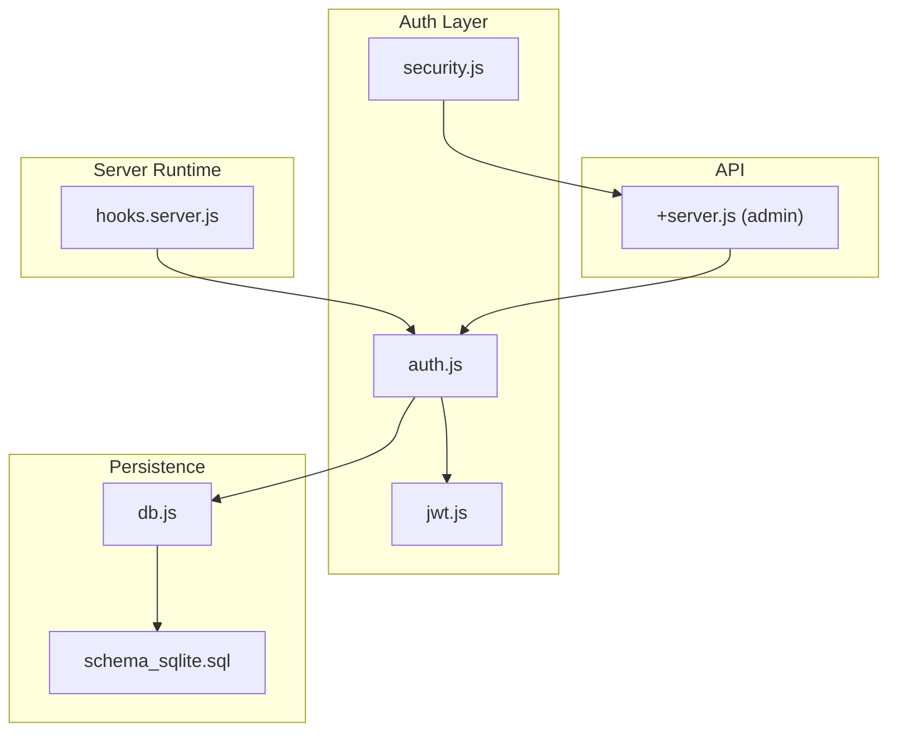

**Diagram sources**
- [hooks.server.js:105-147](file://frontend/src/hooks.server.js#L105-L147)
- [jwt.js:1-45](file://frontend/src/lib/server/jwt.js#L1-L45)
- [auth.js:1-92](file://frontend/src/lib/server/auth.js#L1-L92)
- [security.js:1-54](file://frontend/src/lib/server/security.js#L1-L54)
- [db.js:117-181](file://frontend/src/lib/server/db.js#L117-L181)
- [+server.js (admin):188-233](file://frontend/src/routes/api/admin/+server.js#L188-L233)

**Section sources**
- [hooks.server.js:105-147](file://frontend/src/hooks.server.js#L105-L147)
- [jwt.js:1-45](file://frontend/src/lib/server/jwt.js#L1-L45)
- [auth.js:1-92](file://frontend/src/lib/server/auth.js#L1-L92)
- [security.js:1-54](file://frontend/src/lib/server/security.js#L1-L54)
- [db.js:117-181](file://frontend/src/lib/server/db.js#L117-L181)
- [+server.js (admin):188-233](file://frontend/src/routes/api/admin/+server.js#L188-L233)

## Core Components
- JWT utilities: sign, verify, and extract bearer tokens
- Authentication middleware: enforce auth, optional auth, create session, require admin
- Security utilities: rate limiting, input validation, sanitization
- Database adapter: unified async API for two drivers
- Admin API: endpoints guarded by requireAdmin
- Database schema: users, user_sessions, user_roles, system_settings

Key responsibilities:
- JWT utilities manage token lifecycle and extraction
- Authentication middleware validates tokens against stored sessions and enforces roles
- Security utilities protect endpoints from abuse and sanitize inputs
- Database adapter ensures consistent SQL operations across drivers
- Admin API demonstrates role-based access control

**Section sources**
- [jwt.js:13-42](file://frontend/src/lib/server/jwt.js#L13-L42)
- [auth.js:15-89](file://frontend/src/lib/server/auth.js#L15-L89)
- [security.js:12-53](file://frontend/src/lib/server/security.js#L12-L53)
- [db.js:31-112](file://frontend/src/lib/server/db.js#L31-L112)
- [+server.js (admin):188-233](file://frontend/src/routes/api/admin/+server.js#L188-L233)
- [schema_sqlite.sql:13-68](file://schema_sqlite.sql#L13-L68)

## Architecture Overview
The authentication architecture combines JWT-based identity with DB-backed session validation. Tokens are signed server-side and verified on each request. Sessions are persisted with hashed tokens to detect tampering and expiration.

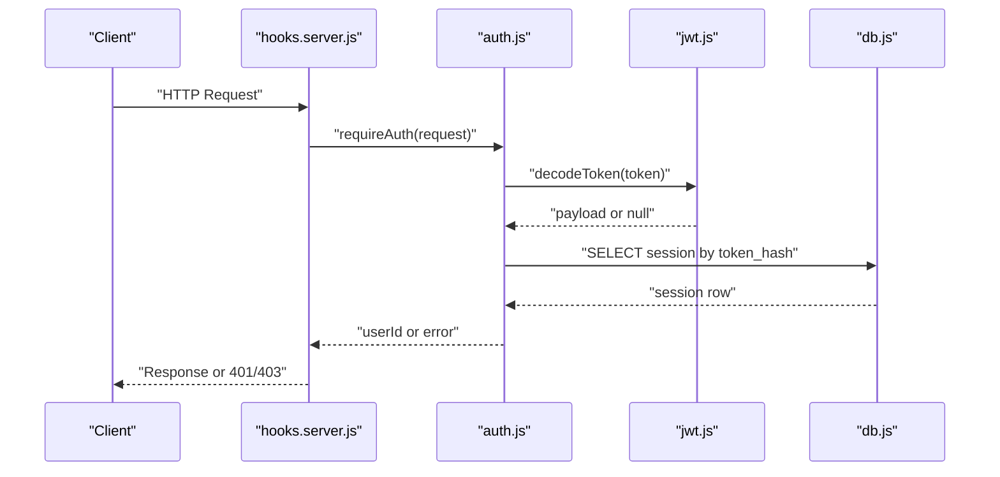

**Diagram sources**
- [hooks.server.js:105-147](file://frontend/src/hooks.server.js#L105-L147)
- [auth.js:15-44](file://frontend/src/lib/server/auth.js#L15-L44)
- [jwt.js:26-32](file://frontend/src/lib/server/jwt.js#L26-L32)
- [db.js:31-112](file://frontend/src/lib/server/db.js#L31-L112)

## Detailed Component Analysis

### JWT Utilities
- Purpose: encode and decode JWTs, extract bearer tokens
- Configuration: reads secret and expiry from environment
- Behavior: sign with expiry, verify with secret, extract Authorization header

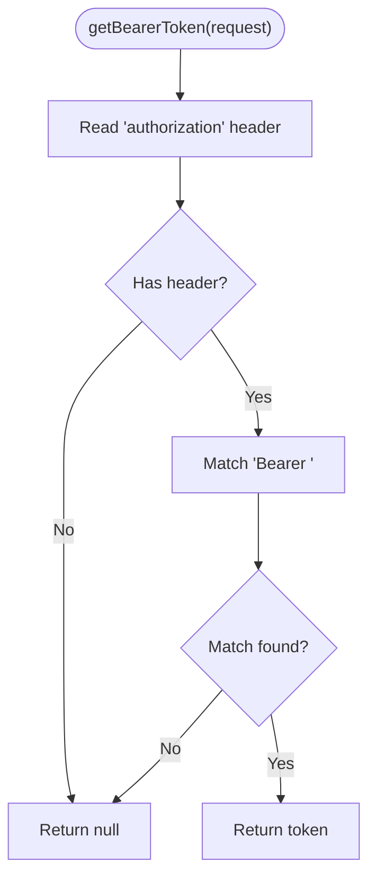

**Diagram sources**
- [jwt.js:37-42](file://frontend/src/lib/server/jwt.js#L37-L42)

**Section sources**
- [jwt.js:13-42](file://frontend/src/lib/server/jwt.js#L13-L42)

### Authentication Middleware
- requireAuth(request): extracts token, verifies JWT, checks DB session and expiry
- optionalAuth(request): same as requireAuth but returns null on failure
- createSession(userId, request): signs JWT, hashes token, persists session with IP/user-agent
- requireAdmin(request): requires admin or super_admin role

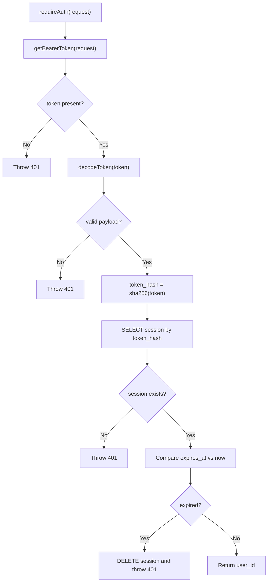

**Diagram sources**
- [auth.js:15-44](file://frontend/src/lib/server/auth.js#L15-L44)

**Section sources**
- [auth.js:15-89](file://frontend/src/lib/server/auth.js#L15-L89)

### Security Utilities
- Rate limiting: in-memory counter per identifier with window and max requests
- Input validation: email, username, password length
- Sanitization: remove angle brackets and trim whitespace

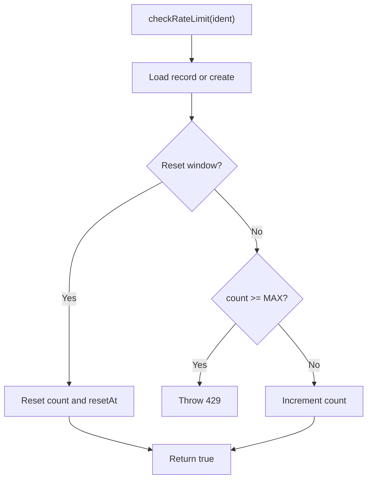

**Diagram sources**
- [security.js:12-33](file://frontend/src/lib/server/security.js#L12-L33)

**Section sources**
- [security.js:12-53](file://frontend/src/lib/server/security.js#L12-L53)

### Database Adapter
- Driver auto-detection: prefers @libsql/client, falls back to better-sqlite3
- Unified async API: prepare().run/get/all() and transaction(fn)
- Initialization: sets pragmas for WAL, foreign keys, timeouts, cache

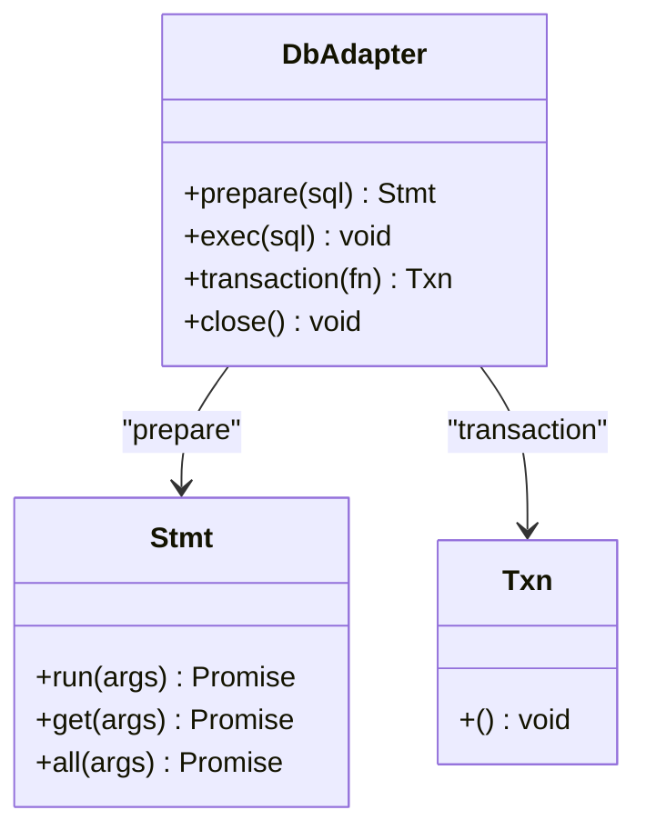

**Diagram sources**
- [db.js:31-112](file://frontend/src/lib/server/db.js#L31-L112)

**Section sources**
- [db.js:117-181](file://frontend/src/lib/server/db.js#L117-L181)
- [db.js:31-112](file://frontend/src/lib/server/db.js#L31-L112)

### Admin API Access Control
- Endpoints guarded by requireAdmin(request)
- Demonstrates role enforcement and structured updates

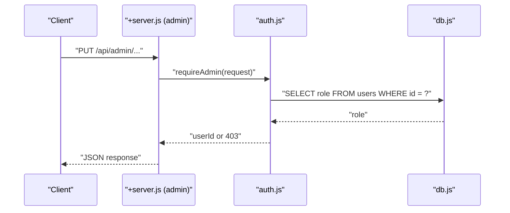

**Diagram sources**
- [+server.js (admin):188-233](file://frontend/src/routes/api/admin/+server.js#L188-L233)
- [auth.js:79-89](file://frontend/src/lib/server/auth.js#L79-L89)

**Section sources**
- [+server.js (admin):188-233](file://frontend/src/routes/api/admin/+server.js#L188-L233)
- [auth.js:79-89](file://frontend/src/lib/server/auth.js#L79-L89)

### Password Hashing
- Current implementation stores password_hash in users table
- No bcryptjs usage observed in the reviewed files
- Recommendation: adopt bcryptjs for secure hashing and verification

**Section sources**
- [schema_sqlite.sql:13-48](file://schema_sqlite.sql#L13-L48)

### Token Lifecycle
- Creation: createSession signs JWT and stores token_hash with expiry
- Validation: requireAuth decodes JWT, matches token_hash, checks expiry
- Expiration: expired sessions are removed during validation
- Refresh: not implemented; consider rotating tokens or short-lived JWTs with refresh tokens

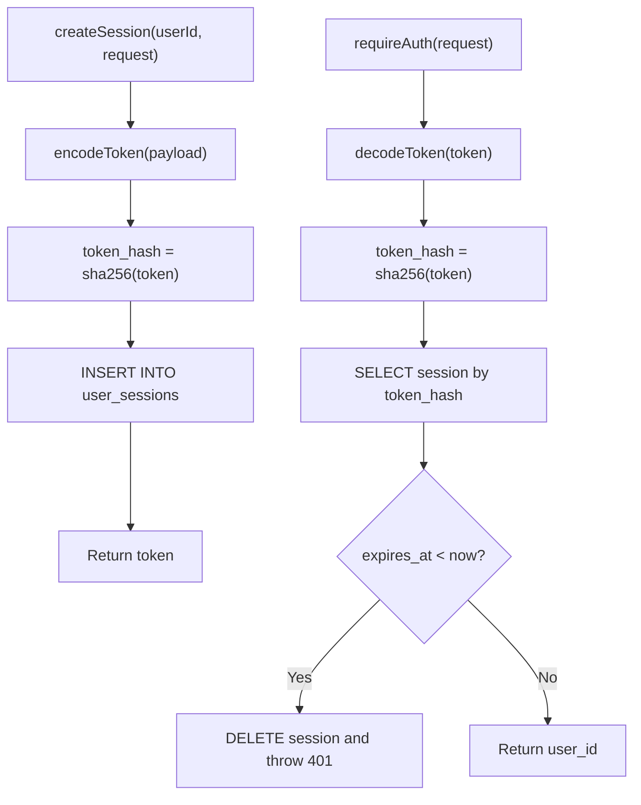

**Diagram sources**
- [auth.js:60-74](file://frontend/src/lib/server/auth.js#L60-L74)
- [auth.js:15-44](file://frontend/src/lib/server/auth.js#L15-L44)

**Section sources**
- [auth.js:60-74](file://frontend/src/lib/server/auth.js#L60-L74)
- [auth.js:15-44](file://frontend/src/lib/server/auth.js#L15-L44)

### Roles and Permissions
- Users table includes role field with defaults
- user_roles table supports multi-role assignments
- requireAdmin enforces admin or super_admin

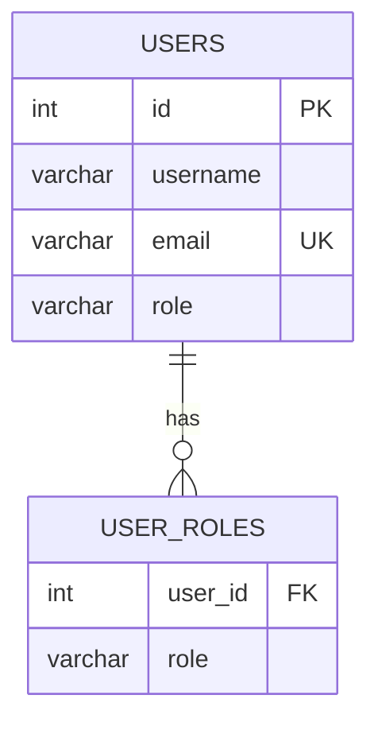

**Diagram sources**
- [schema_sqlite.sql:13-55](file://schema_sqlite.sql#L13-L55)

**Section sources**
- [schema_sqlite.sql:13-55](file://schema_sqlite.sql#L13-L55)
- [auth.js:79-89](file://frontend/src/lib/server/auth.js#L79-L89)

### Authentication Flow: Registration to Protected Access
- Registration: insert user with password_hash and default role
- Login: verify credentials, create session, return token
- Protected access: requireAuth on endpoints; optionalAuth for guest-accessible resources
- Admin access: requireAdmin for administrative endpoints

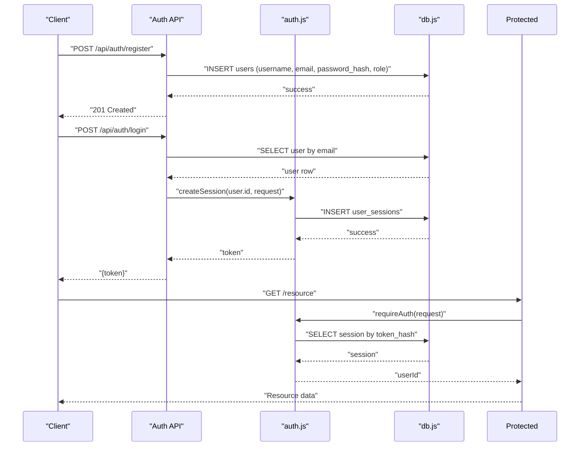

[No sources needed since this diagram shows conceptual workflow, not actual code structure]

## Dependency Analysis
- auth.js depends on jwt.js for token operations and db.js for persistence
- hooks.server.js applies global security headers and guards
- security.js provides shared utilities for rate limiting and validation
- Admin API depends on auth.js for role checks

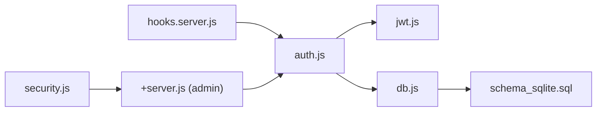

**Diagram sources**
- [hooks.server.js:105-147](file://frontend/src/hooks.server.js#L105-L147)
- [auth.js:6-8](file://frontend/src/lib/server/auth.js#L6-L8)
- [jwt.js:5](file://frontend/src/lib/server/jwt.js#L5)
- [db.js:117-181](file://frontend/src/lib/server/db.js#L117-L181)
- [+server.js (admin):188-233](file://frontend/src/routes/api/admin/+server.js#L188-L233)

**Section sources**
- [auth.js:6-8](file://frontend/src/lib/server/auth.js#L6-L8)
- [jwt.js:5](file://frontend/src/lib/server/jwt.js#L5)
- [db.js:117-181](file://frontend/src/lib/server/db.js#L117-L181)
- [+server.js (admin):188-233](file://frontend/src/routes/api/admin/+server.js#L188-L233)

## Performance Considerations
- Session lookup uses token_hash index for O(log n) retrieval
- JWT decoding is CPU-bound; keep payload minimal
- Rate limiter is in-memory; consider external caching for multi-instance deployments
- Database initialization occurs once per process; ensure proper driver selection

[No sources needed since this section provides general guidance]

## Troubleshooting Guide
Common issues and resolutions:
- 401 Unauthorized: missing or invalid/expired token; verify Authorization header and session expiry
- 403 Forbidden: insufficient privileges; ensure user has admin or super_admin role
- 429 Too Many Requests: rate limit exceeded; adjust limits or deploy rate-limiting infrastructure
- Database errors: generic 500 responses; check logs for DB run/get/all errors

**Section sources**
- [auth.js:17-41](file://frontend/src/lib/server/auth.js#L17-L41)
- [auth.js:84-86](file://frontend/src/lib/server/auth.js#L84-L86)
- [security.js:27-29](file://frontend/src/lib/server/security.js#L27-L29)
- [hooks.server.js:154-178](file://frontend/src/hooks.server.js#L154-L178)

## Conclusion
VSocial implements a robust JWT-based authentication system with DB-backed session validation and role-based access control. The design emphasizes explicit token verification, session persistence, and admin safeguards. Recommendations include adopting bcryptjs for password hashing, implementing token refresh strategies, and enhancing rate limiting for distributed environments.

[No sources needed since this section summarizes without analyzing specific files]

## Appendices

### API Endpoint Specifications
- POST /api/auth/register
  - Request: username, email, password
  - Response: 201 Created or error
  - Notes: Requires system registration enabled; password must meet validation rules
- POST /api/auth/login
  - Request: email, password
  - Response: { token }
  - Notes: On success, creates a session with hashed token and expiry
- GET /api/admin/settings
  - Request: Authorization: Bearer <token>
  - Response: { success, message }
  - Notes: Requires admin or super_admin role
- PUT /api/admin/users/:id
  - Request: Authorization: Bearer <token>, JSON body with allowed fields
  - Response: { success, message }
  - Notes: Requires admin or super_admin role

**Section sources**
- [+server.js (admin):188-233](file://frontend/src/routes/api/admin/+server.js#L188-L233)

### Request/Response Schemas
- Register
  - Body: { username, email, password }
  - Success: 201
- Login
  - Body: { email, password }
  - Success: { token }
- Admin Settings
  - Body: { key: string, value: string|number|boolean }
  - Success: { success: true, message: string }
- Admin Users
  - Body: { role?: string, is_verified?: boolean }
  - Success: { success: true, message: string }

**Section sources**
- [+server.js (admin):188-233](file://frontend/src/routes/api/admin/+server.js#L188-L233)

### Security Considerations and Mitigations
- Use HTTPS/TLS to protect tokens in transit
- Store JWT_SECRET securely and rotate periodically
- Enforce strong password policies and adopt bcryptjs hashing
- Implement token refresh strategies to reduce long-lived tokens
- Add CSRF protection for form submissions
- Apply rate limiting at gateway/proxy for brute-force prevention
- Regularly audit admin endpoints and monitor failed auth attempts

[No sources needed since this section provides general guidance]