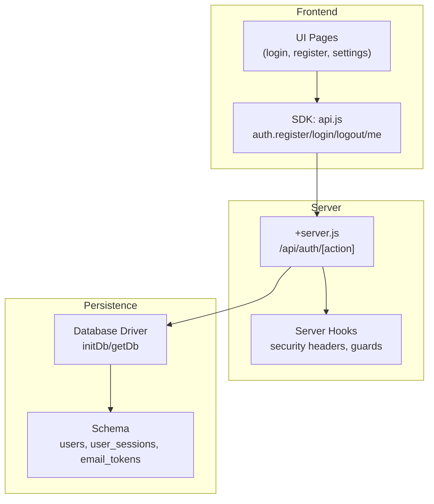
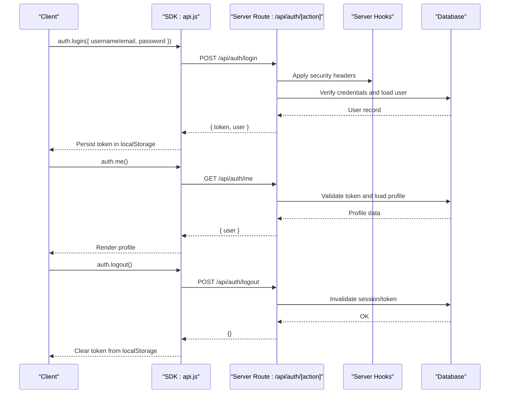
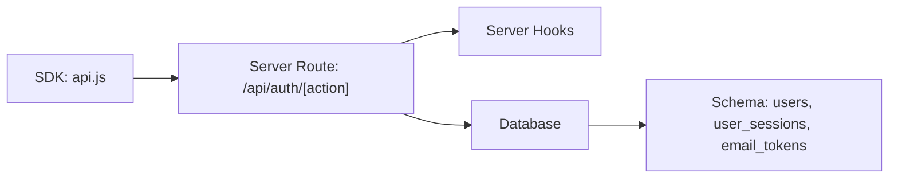

# Authentication API Endpoints

<cite>
**Referenced Files in This Document**
- [api.js](file://frontend/src/lib/api.js)
- [auth +server.js](file://frontend/src/routes/api/auth[action]/+server.js)
- [hooks.server.js](file://frontend/src/hooks.server.js)
- [schema_sqlite.sql](file://schema_sqlite.sql)
- [db.js](file://frontend/src/lib/server/db.js)
- [auth.test.js](file://tests/auth.test.js)
</cite>

## Table of Contents
1. [Introduction](#introduction)
2. [Project Structure](#project-structure)
3. [Core Components](#core-components)
4. [Architecture Overview](#architecture-overview)
5. [Detailed Component Analysis](#detailed-component-analysis)
6. [Dependency Analysis](#dependency-analysis)
7. [Performance Considerations](#performance-considerations)
8. [Troubleshooting Guide](#troubleshooting-guide)
9. [Conclusion](#conclusion)
10. [Appendices](#appendices)

## Introduction
This document provides comprehensive API documentation for VSocial’s authentication endpoints. It covers the HTTP endpoints POST /api/auth/register, POST /api/auth/login, POST /api/auth/logout, and GET /api/auth/me. For each endpoint, you will find request/response schemas, required parameters, authentication requirements, success and error responses, curl examples, SDK usage patterns, and client-side integration guidance. It also explains session/token management, logout procedures, rate limiting considerations, security headers, and CORS configuration for authentication endpoints. Finally, it includes troubleshooting guidance for common authentication errors and client-side state management tips.

## Project Structure
Authentication endpoints are implemented as SvelteKit server routes under the API namespace. The frontend SDK centralizes HTTP requests and automatically injects the Bearer token from local storage. Security headers are applied globally via server hooks. The database schema defines user accounts, sessions, and tokens.

**Diagram sources**
- [api.js:79-85](file://frontend/src/lib/api.js#L79-L85)
- [auth +server.js](file://frontend/src/routes/api/auth[action]/+server.js)
- [hooks.server.js:106-147](file://frontend/src/hooks.server.js#L106-L147)
- [db.js:117-167](file://frontend/src/lib/server/db.js#L117-L167)
- [schema_sqlite.sql:13-68](file://schema_sqlite.sql#L13-L68)

**Section sources**
- [api.js:79-85](file://frontend/src/lib/api.js#L79-L85)
- [hooks.server.js:106-147](file://frontend/src/hooks.server.js#L106-L147)
- [schema_sqlite.sql:13-68](file://schema_sqlite.sql#L13-L68)
- [db.js:117-167](file://frontend/src/lib/server/db.js#L117-L167)

## Core Components
- Frontend SDK: Provides typed wrappers for authentication endpoints and auto-injects Authorization headers when a token exists in local storage.
- Server route: Implements registration, login, logout, and profile retrieval with database-backed validation and session management.
- Server hooks: Applies global security headers and guards against setup/install flows.
- Database schema: Defines user credentials, sessions, and tokens used during authentication.

Key SDK exports for authentication:
- auth.register(data): POST /api/auth/register
- auth.login(data): POST /api/auth/login
- auth.logout(): POST /api/auth/logout
- auth.me(): GET /api/auth/me

**Section sources**
- [api.js:79-85](file://frontend/src/lib/api.js#L79-L85)
- [auth +server.js](file://frontend/src/routes/api/auth[action]/+server.js)
- [hooks.server.js:106-147](file://frontend/src/hooks.server.js#L106-L147)
- [schema_sqlite.sql:13-68](file://schema_sqlite.sql#L13-L68)

## Architecture Overview
The authentication flow integrates the SDK, server route handlers, and database. The SDK reads a stored token and attaches it to requests. The server applies security headers and validates requests against the schema. Sessions and tokens are persisted per the schema.

**Diagram sources**
- [api.js:20-46](file://frontend/src/lib/api.js#L20-L46)
- [api.js:79-85](file://frontend/src/lib/api.js#L79-L85)
- [auth +server.js](file://frontend/src/routes/api/auth[action]/+server.js)
- [hooks.server.js:106-147](file://frontend/src/hooks.server.js#L106-L147)
- [schema_sqlite.sql:57-68](file://schema_sqlite.sql#L57-L68)

## Detailed Component Analysis

### Endpoint: POST /api/auth/register
Purpose: Create a new user account.

- Method: POST
- Path: /api/auth/register
- Authentication: Not required
- Request body schema:
  - username: string, required
  - email: string, required
  - password: string, required
- Response schema:
  - success: boolean
  - user: object (excluding sensitive fields)
  - token: string (optional)
- Success response: 201 Created or 200 OK depending on implementation
- Error responses:
  - 400 Bad Request: Validation errors (e.g., invalid username/email/password)
  - 409 Conflict: Duplicate username or email
  - 500 Internal Server Error: Database or server error

curl example:
- curl -X POST https://yoursite.com/api/auth/register -H "Content-Type: application/json" -d '{ "username": "...", "email": "...", "password": "..." }'

SDK usage pattern:
- Call auth.register({ username, email, password })

Client-side integration:
- On success, persist the returned token in localStorage and redirect to home or dashboard.

Notes:
- Username and password are validated by the backend. The schema enforces uniqueness and length constraints.

**Section sources**
- [api.js:80](file://frontend/src/lib/api.js#L80)
- [auth +server.js](file://frontend/src/routes/api/auth[action]/+server.js)
- [schema_sqlite.sql:13-48](file://schema_sqlite.sql#L13-L48)

### Endpoint: POST /api/auth/login
Purpose: Authenticate a user and issue a session token.

- Method: POST
- Path: /api/auth/login
- Authentication: Not required
- Request body schema:
  - identifier: string, required (username or email)
  - password: string, required
- Response schema:
  - success: boolean
  - user: object (excluding sensitive fields)
  - token: string
- Success response: 200 OK
- Error responses:
  - 400 Bad Request: Missing fields or invalid format
  - 401 Unauthorized: Invalid credentials
  - 403 Forbidden: Account inactive or banned
  - 429 Too Many Requests: Rate limit exceeded
  - 500 Internal Server Error: Database or server error

curl example:
- curl -X POST https://yoursite.com/api/auth/login -H "Content-Type: application/json" -d '{ "identifier": "...", "password": "..." }'

SDK usage pattern:
- Call auth.login({ identifier, password })

Client-side integration:
- On success, store token in localStorage and set Authorization header for subsequent requests.

**Section sources**
- [api.js:81](file://frontend/src/lib/api.js#L81)
- [auth +server.js](file://frontend/src/routes/api/auth[action]/+server.js)
- [schema_sqlite.sql:13-48](file://schema_sqlite.sql#L13-L48)

### Endpoint: POST /api/auth/logout
Purpose: Invalidate the current session and remove the stored token.

- Method: POST
- Path: /api/auth/logout
- Authentication: Required (Authorization: Bearer <token>)
- Request body: Empty object {}
- Response schema:
  - success: boolean
- Success response: 200 OK
- Error responses:
  - 401 Unauthorized: No valid token or token invalid/expired
  - 500 Internal Server Error: Database or server error

curl example:
- curl -X POST https://yoursite.com/api/auth/logout -H "Authorization: Bearer YOUR_TOKEN"

SDK usage pattern:
- Call auth.logout()

Client-side integration:
- On success, clear token from localStorage and reset SDK Authorization header.

**Section sources**
- [api.js:82](file://frontend/src/lib/api.js#L82)
- [api.js:20-46](file://frontend/src/lib/api.js#L20-L46)
- [auth +server.js](file://frontend/src/routes/api/auth[action]/+server.js)
- [schema_sqlite.sql:57-68](file://schema_sqlite.sql#L57-L68)

### Endpoint: GET /api/auth/me
Purpose: Retrieve the authenticated user’s profile.

- Method: GET
- Path: /api/auth/me
- Authentication: Required (Authorization: Bearer <token>)
- Request body: None
- Response schema:
  - user: object (profile excluding sensitive fields)
- Success response: 200 OK
- Error responses:
  - 401 Unauthorized: Missing or invalid token
  - 404 Not Found: Token valid but user deleted
  - 500 Internal Server Error: Database or server error

curl example:
- curl -X GET https://yoursite.com/api/auth/me -H "Authorization: Bearer YOUR_TOKEN"

SDK usage pattern:
- Call auth.me()

Client-side integration:
- Use the returned user object to render profile UI and navigation.

**Section sources**
- [api.js:83](file://frontend/src/lib/api.js#L83)
- [api.js:20-46](file://frontend/src/lib/api.js#L20-L46)
- [auth +server.js](file://frontend/src/routes/api/auth[action]/+server.js)
- [schema_sqlite.sql:13-48](file://schema_sqlite.sql#L13-L48)

## Dependency Analysis
The authentication flow depends on the SDK, server route, hooks, and database. The SDK injects Authorization headers; the server route validates inputs and interacts with the database; hooks enforce security headers and guards.

**Diagram sources**
- [api.js:20-46](file://frontend/src/lib/api.js#L20-L46)
- [auth +server.js](file://frontend/src/routes/api/auth[action]/+server.js)
- [hooks.server.js:106-147](file://frontend/src/hooks.server.js#L106-L147)
- [schema_sqlite.sql:13-68](file://schema_sqlite.sql#L13-L68)

**Section sources**
- [api.js:20-46](file://frontend/src/lib/api.js#L20-L46)
- [auth +server.js](file://frontend/src/routes/api/auth[action]/+server.js)
- [hooks.server.js:106-147](file://frontend/src/hooks.server.js#L106-L147)
- [schema_sqlite.sql:13-68](file://schema_sqlite.sql#L13-L68)

## Performance Considerations
- Token validation: Prefer indexed lookups on token hashes and user IDs to minimize latency.
- Session expiration: Enforce short-lived tokens with refresh mechanisms to reduce long-running sessions.
- Database queries: Use prepared statements and avoid N+1 queries when loading user metadata.
- Caching: Cache non-sensitive user profile fragments for frequent GET /api/auth/me calls.
- Rate limiting: Apply per-endpoint limits to mitigate brute-force attacks on login/register.

[No sources needed since this section provides general guidance]

## Troubleshooting Guide
Common issues and resolutions:
- 400 Bad Request on register/login:
  - Ensure required fields are present and formatted correctly.
  - Validate username/email/password against backend rules.
- 401 Unauthorized:
  - Confirm token exists in localStorage and is attached to requests.
  - Verify the token is not expired or revoked.
- 403 Forbidden:
  - Account may be inactive or banned; contact support.
- 409 Conflict on register:
  - Duplicate username or email; prompt the user to choose alternatives.
- 429 Too Many Requests:
  - Implement client-side exponential backoff and user throttling.
- 500 Internal Server:
  - Check server logs; retry after a delay.
- CORS errors:
  - Configure allowed origins and credentials for authentication endpoints.
- Security headers:
  - Ensure X-Content-Type-Options, X-Frame-Options, Referrer-Policy, and Permissions-Policy are set.

**Section sources**
- [hooks.server.js:112-116](file://frontend/src/hooks.server.js#L112-L116)
- [auth.test.js:6-25](file://tests/auth.test.js#L6-L25)

## Conclusion
VSocial’s authentication endpoints provide a secure and straightforward mechanism for user registration, login, logout, and profile retrieval. The SDK simplifies client integration by handling Authorization headers and error propagation. The server applies robust security headers and guards, while the database schema supports user accounts, sessions, and tokens. Follow the provided SDK usage patterns, integrate proper client-side state management, and adhere to rate limiting and CORS policies to ensure reliable authentication experiences.

[No sources needed since this section summarizes without analyzing specific files]

## Appendices

### A. SDK Usage Patterns
- Registration:
  - auth.register({ username, email, password })
- Login:
  - auth.login({ identifier, password })
- Logout:
  - auth.logout()
- Fetch profile:
  - auth.me()

Behavior:
- The SDK automatically attaches Authorization: Bearer <token> when a token is present in localStorage.
- Empty responses are handled gracefully; non-OK responses throw errors with status and optional data.

**Section sources**
- [api.js:79-85](file://frontend/src/lib/api.js#L79-L85)
- [api.js:20-46](file://frontend/src/lib/api.js#L20-L46)

### B. Database Schema Highlights (Users, Sessions, Tokens)
- users: Stores usernames, emails, password hashes, roles, and activity flags.
- user_sessions: Tracks active sessions with token hashes, IP, UA, creation, and expiry.
- email_tokens: Manages verification and other token types with expiry.

These tables underpin authentication, session management, and token lifecycle.

**Section sources**
- [schema_sqlite.sql:13-48](file://schema_sqlite.sql#L13-L48)
- [schema_sqlite.sql:57-68](file://schema_sqlite.sql#L57-L68)
- [schema_sqlite.sql:468-477](file://schema_sqlite.sql#L468-L477)

### C. Security Headers Applied Globally
- X-Content-Type-Options: nosniff
- X-Frame-Options: SAMEORIGIN
- Referrer-Policy: strict-origin-when-cross-origin
- Permissions-Policy: camera=(), microphone=(self), geolocation=(self)

These headers protect against common browser-based attacks and control resource permissions.

**Section sources**
- [hooks.server.js:112-116](file://frontend/src/hooks.server.js#L112-L116)

### D. Rate Limiting and CORS Guidance
- Rate limiting:
  - Apply per-endpoint quotas (e.g., 5 requests/minute for login/register) with exponential backoff.
- CORS:
  - Allow credentials and restrict origins to your domain for authentication endpoints.
  - Set appropriate Access-Control-Allow-Headers and methods for auth endpoints.

[No sources needed since this section provides general guidance]