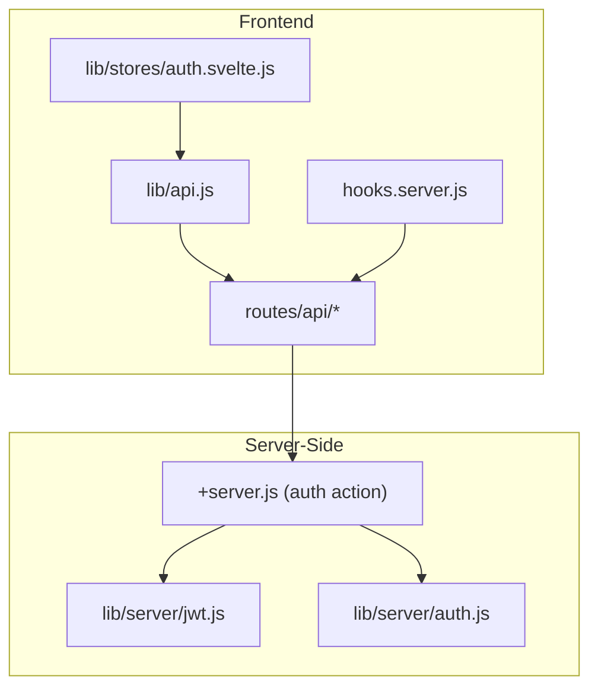
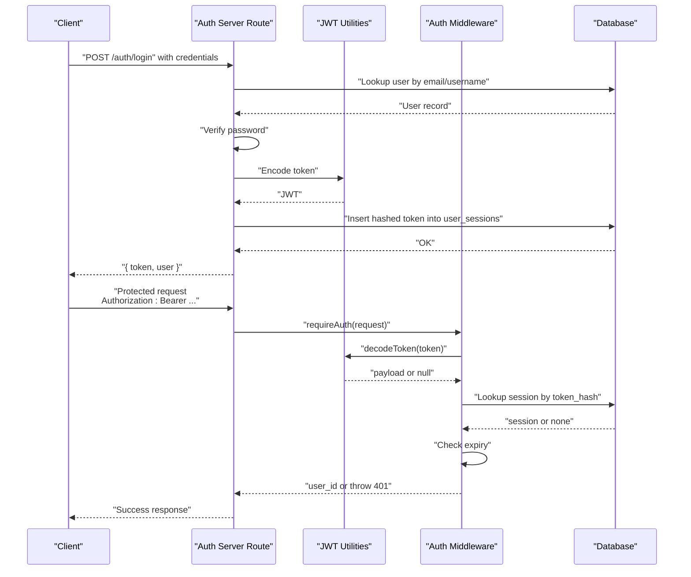
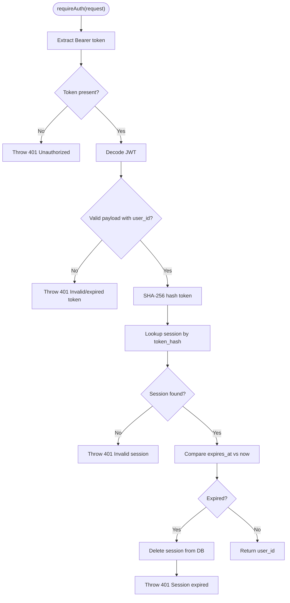
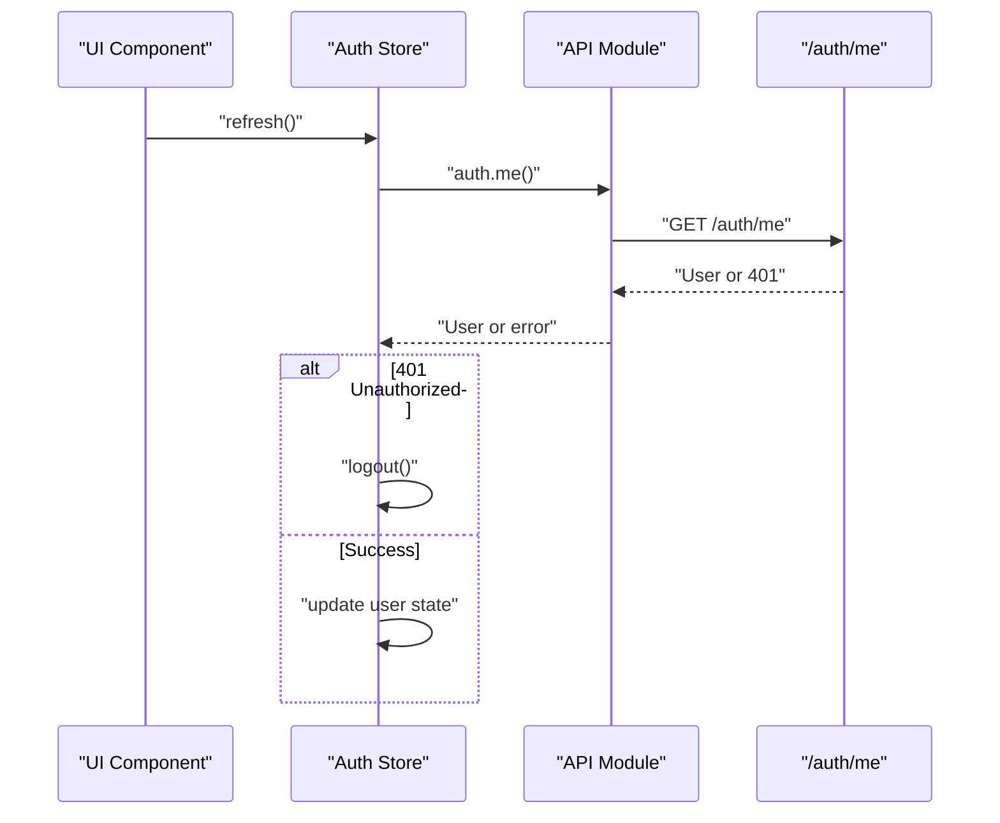
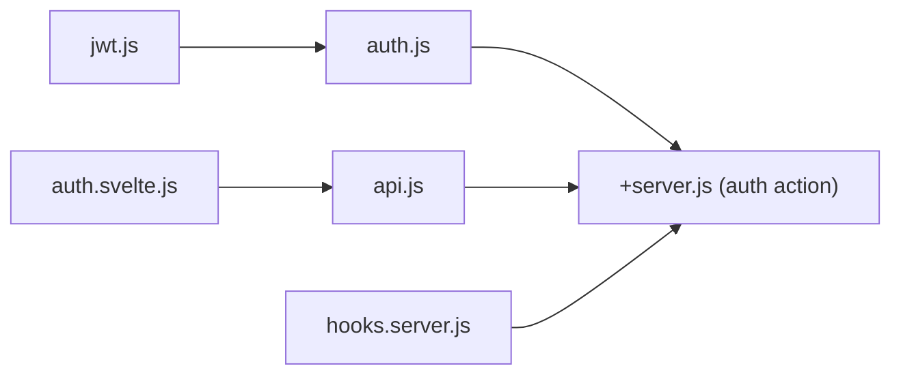

# Authentication Flow & Middleware

<cite>
**Referenced Files in This Document**
- [hooks.server.js](file://frontend/src/hooks.server.js)
- [auth.js](file://frontend/src/lib/server/auth.js)
- [jwt.js](file://frontend/src/lib/server/jwt.js)
- [+server.js (auth action)](file://frontend/src/routes/api/auth[action]/+server.js)
- [api.js](file://frontend/src/lib/api.js)
- [auth.svelte.js](file://frontend/src/lib/stores/auth.svelte.js)
- [auth.test.js](file://tests/auth.test.js)
</cite>

## Table of Contents
1. [Introduction](#introduction)
2. [Project Structure](#project-structure)
3. [Core Components](#core-components)
4. [Architecture Overview](#architecture-overview)
5. [Detailed Component Analysis](#detailed-component-analysis)
6. [Dependency Analysis](#dependency-analysis)
7. [Performance Considerations](#performance-considerations)
8. [Troubleshooting Guide](#troubleshooting-guide)
9. [Conclusion](#conclusion)

## Introduction
This document explains VSocial’s authentication flow and middleware implementation. It covers the complete lifecycle from user registration and login to session validation, and documents the requireAuth and optionalAuth middleware functions. It also describes how bearer tokens are extracted, validated, and verified against stored sessions, along with error handling, unauthorized responses, and practical examples for protecting API endpoints and routes. Additional topics include token expiration handling, session cleanup, and security considerations.

## Project Structure
The authentication system spans three primary areas:
- Frontend server hooks for global behavior and error handling
- Backend JWT utilities and authentication middleware
- Authentication server routes for registration, login, logout, and profile retrieval
- Frontend API utilities and auth store for client-side token management and session refresh

**Diagram sources**
- [hooks.server.js:105-147](file://frontend/src/hooks.server.js#L105-L147)
- [jwt.js:1-45](file://frontend/src/lib/server/jwt.js#L1-L45)
- [auth.js:1-92](file://frontend/src/lib/server/auth.js#L1-L92)
- [+server.js (auth action):55-86](file://frontend/src/routes/api/auth[action]/+server.js#L55-L86)
- [api.js:51-83](file://frontend/src/lib/api.js#L51-L83)
- [auth.svelte.js:92-130](file://frontend/src/lib/stores/auth.svelte.js#L92-L130)

**Section sources**
- [hooks.server.js:105-147](file://frontend/src/hooks.server.js#L105-L147)
- [jwt.js:1-45](file://frontend/src/lib/server/jwt.js#L1-L45)
- [auth.js:1-92](file://frontend/src/lib/server/auth.js#L1-L92)
- [+server.js (auth action):55-86](file://frontend/src/routes/api/auth[action]/+server.js#L55-L86)
- [api.js:51-83](file://frontend/src/lib/api.js#L51-L83)
- [auth.svelte.js:92-130](file://frontend/src/lib/stores/auth.svelte.js#L92-L130)

## Core Components
- JWT utilities: encode, decode, and Bearer token extraction
- Authentication middleware: requireAuth, optionalAuth, requireAdmin, and session creation
- Authentication server route: registration, login, logout, and profile retrieval
- Frontend API utilities and auth store: token storage, refresh logic, and error handling
- Global server hooks: security headers, setup guard, and global error handling

Key responsibilities:
- requireAuth validates presence of Bearer token, verifies JWT signature and payload, checks DB-stored session existence and expiry, and returns the associated user ID
- optionalAuth wraps requireAuth to permit missing or invalid tokens by returning null
- createSession generates a JWT and persists a hashed token in the database with expiry
- The auth server route orchestrates user lookup, credential verification, last seen update, session creation, and logout cleanup

**Section sources**
- [jwt.js:19-42](file://frontend/src/lib/server/jwt.js#L19-L42)
- [auth.js:15-44](file://frontend/src/lib/server/auth.js#L15-L44)
- [auth.js:49-55](file://frontend/src/lib/server/auth.js#L49-L55)
- [auth.js:60-74](file://frontend/src/lib/server/auth.js#L60-L74)
- [+server.js (auth action):55-86](file://frontend/src/routes/api/auth[action]/+server.js#L55-L86)
- [api.js:79-83](file://frontend/src/lib/api.js#L79-L83)
- [auth.svelte.js:92-130](file://frontend/src/lib/stores/auth.svelte.js#L92-L130)

## Architecture Overview
The authentication architecture enforces bearer token-based authentication with database-backed session validation. The flow integrates frontend and backend components to ensure secure, stateless token verification and robust session lifecycle management.

**Diagram sources**
- [+server.js (auth action):55-86](file://frontend/src/routes/api/auth[action]/+server.js#L55-L86)
- [jwt.js:19-32](file://frontend/src/lib/server/jwt.js#L19-L32)
- [auth.js:15-44](file://frontend/src/lib/server/auth.js#L15-L44)

## Detailed Component Analysis

### JWT Utilities
Responsibilities:
- Encode a signed JWT with configured secret and expiry
- Decode and verify JWT, returning null on failure
- Extract Bearer token from Authorization header

Security considerations:
- Uses a configurable secret and expiry window
- Robust extraction via regex to prevent malformed headers

**Section sources**
- [jwt.js:13-14](file://frontend/src/lib/server/jwt.js#L13-L14)
- [jwt.js:19-32](file://frontend/src/lib/server/jwt.js#L19-L32)
- [jwt.js:37-42](file://frontend/src/lib/server/jwt.js#L37-L42)

### Authentication Middleware
Functions:
- requireAuth: extracts Bearer token, decodes JWT, validates session existence and expiry, and returns user ID
- optionalAuth: attempts requireAuth and returns null on failure
- createSession: encodes JWT and inserts hashed token into user_sessions with expiry
- requireAdmin: ensures authenticated user has admin privileges

Processing logic:
- Token extraction and decoding
- Session lookup by SHA-256 hash of token
- Expiry check and cleanup
- Role enforcement for administrative endpoints

**Diagram sources**
- [auth.js:15-44](file://frontend/src/lib/server/auth.js#L15-L44)

**Section sources**
- [auth.js:15-44](file://frontend/src/lib/server/auth.js#L15-L44)
- [auth.js:49-55](file://frontend/src/lib/server/auth.js#L49-L55)
- [auth.js:60-74](file://frontend/src/lib/server/auth.js#L60-L74)
- [auth.js:79-89](file://frontend/src/lib/server/auth.js#L79-L89)

### Authentication Server Route
Endpoints:
- POST /auth/register: registers a new user (not covered in detail here)
- POST /auth/login: authenticates user, updates last seen, creates session, returns token and user
- POST /auth/logout: deletes current session by hashing incoming token
- GET /auth/me: returns authenticated user profile (client-side handled by API store)

Behavior highlights:
- Credential validation and ban checks
- Last seen timestamp update on successful login
- Session creation and sensitive fields removal before response

**Section sources**
- [+server.js (auth action):55-86](file://frontend/src/routes/api/auth[action]/+server.js#L55-L86)

### Frontend API Utilities and Auth Store
- API helpers: centralized HTTP requests with automatic Bearer inclusion when available
- Auth store: manages token, user state, initialization, login/register/logout, and refresh logic
- Refresh flow: calls /auth/me and logs out on 401 responses

**Diagram sources**
- [auth.svelte.js:92-130](file://frontend/src/lib/stores/auth.svelte.js#L92-L130)
- [api.js:79-83](file://frontend/src/lib/api.js#L79-L83)

**Section sources**
- [api.js:51-83](file://frontend/src/lib/api.js#L51-L83)
- [auth.svelte.js:92-130](file://frontend/src/lib/stores/auth.svelte.js#L92-L130)

### Global Server Hooks
- Security headers: X-Content-Type-Options, X-Frame-Options, Referrer-Policy, Permissions-Policy
- Setup wizard guard: redirects to setup/install when appropriate
- Global error handler: structured logging and sanitized error responses

**Section sources**
- [hooks.server.js:109-116](file://frontend/src/hooks.server.js#L109-L116)
- [hooks.server.js:122-144](file://frontend/src/hooks.server.js#L122-L144)
- [hooks.server.js:154-178](file://frontend/src/hooks.server.js#L154-L178)

## Dependency Analysis
The authentication stack exhibits clear separation of concerns:
- JWT utilities depend on environment configuration and jsonwebtoken
- Authentication middleware depends on JWT utilities and database access
- Authentication server route depends on middleware, database, and bcrypt for password comparison
- Frontend API and store depend on middleware for token handling and on server routes for authentication operations

**Diagram sources**
- [jwt.js:5-11](file://frontend/src/lib/server/jwt.js#L5-L11)
- [auth.js:6-9](file://frontend/src/lib/server/auth.js#L6-L9)
- [+server.js (auth action):55-86](file://frontend/src/routes/api/auth[action]/+server.js#L55-L86)
- [api.js:79-83](file://frontend/src/lib/api.js#L79-L83)
- [auth.svelte.js:92-130](file://frontend/src/lib/stores/auth.svelte.js#L92-L130)
- [hooks.server.js:105-147](file://frontend/src/hooks.server.js#L105-L147)

**Section sources**
- [jwt.js:5-11](file://frontend/src/lib/server/jwt.js#L5-L11)
- [auth.js:6-9](file://frontend/src/lib/server/auth.js#L6-L9)
- [+server.js (auth action):55-86](file://frontend/src/routes/api/auth[action]/+server.js#L55-L86)
- [api.js:79-83](file://frontend/src/lib/api.js#L79-L83)
- [auth.svelte.js:92-130](file://frontend/src/lib/stores/auth.svelte.js#L92-L130)
- [hooks.server.js:105-147](file://frontend/src/hooks.server.js#L105-L147)

## Performance Considerations
- Token hashing: SHA-256 hashing of tokens for session lookup is efficient and reduces collision risk
- Session expiry: periodic cleanup of expired sessions improves lookup performance
- Caching: consider caching recent token hashes for high-frequency endpoints if needed
- Database indexing: ensure token_hash and expires_at are indexed for optimal query performance
- Token lifetime: short-lived tokens reduce validation overhead; long-lived tokens improve UX but increase session maintenance

## Troubleshooting Guide
Common issues and resolutions:
- Missing Authorization header: requireAuth throws 401; ensure clients send Bearer token
- Invalid or expired token: decode fails or payload lacks user_id; regenerate token via login
- Session not found: token_hash mismatch or deleted session; re-login to create a new session
- Expired session: session exists but expired_at < now; delete session and prompt re-authentication
- Global errors: the global error handler sanitizes responses and logs detailed server-side errors

Practical checks:
- Verify JWT_SECRET and JWT_EXPIRES_IN environment variables
- Confirm database connectivity and table schemas for users and user_sessions
- Inspect server logs for detailed error traces during authentication failures

**Section sources**
- [auth.js:15-44](file://frontend/src/lib/server/auth.js#L15-L44)
- [hooks.server.js:154-178](file://frontend/src/hooks.server.js#L154-L178)

## Conclusion
VSocial’s authentication system combines bearer token-based identity with database-backed session validation. The requireAuth and optionalAuth middleware provide robust protection for server routes, while the auth server route handles user lifecycle operations securely. The frontend API and auth store coordinate token management and session refresh. Together, these components deliver a secure, maintainable, and extensible authentication framework suitable for production deployment.