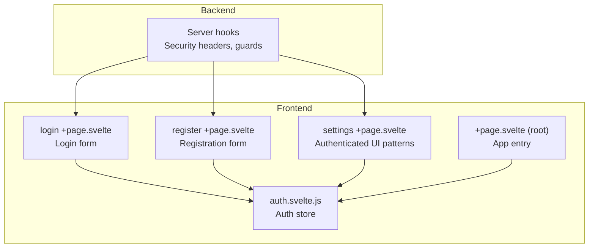
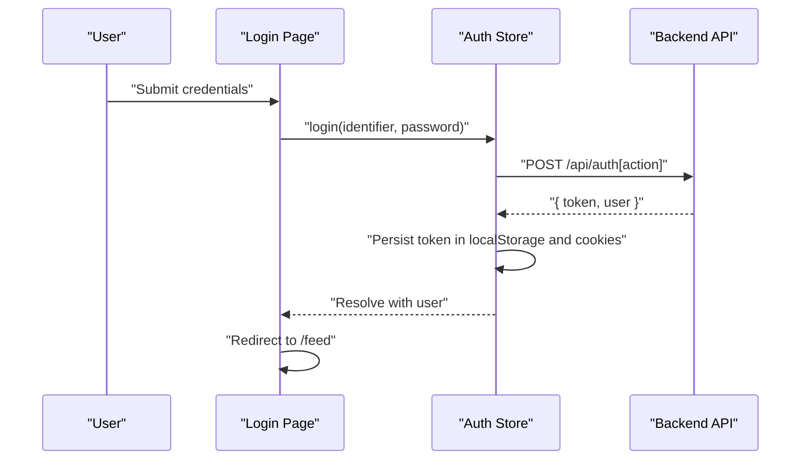
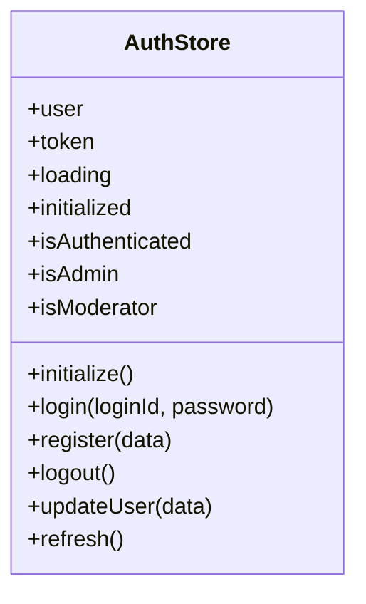
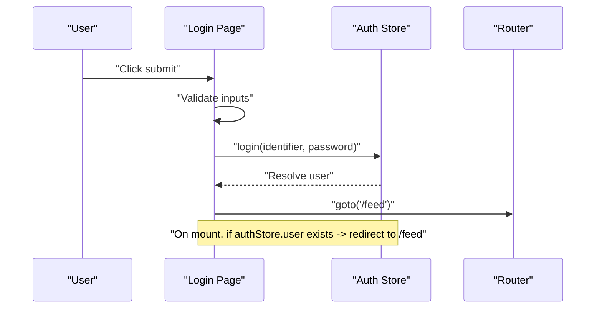
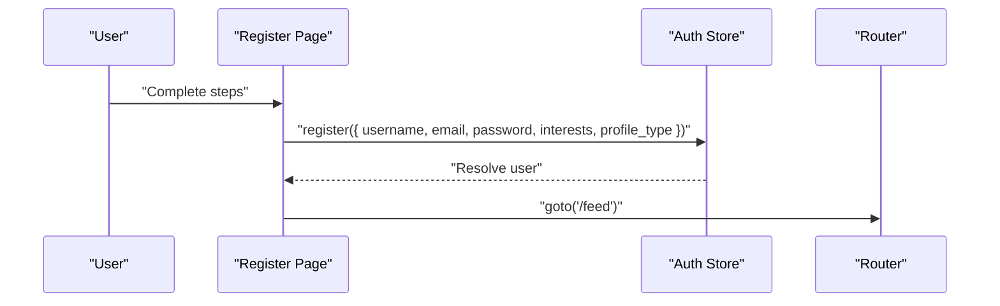
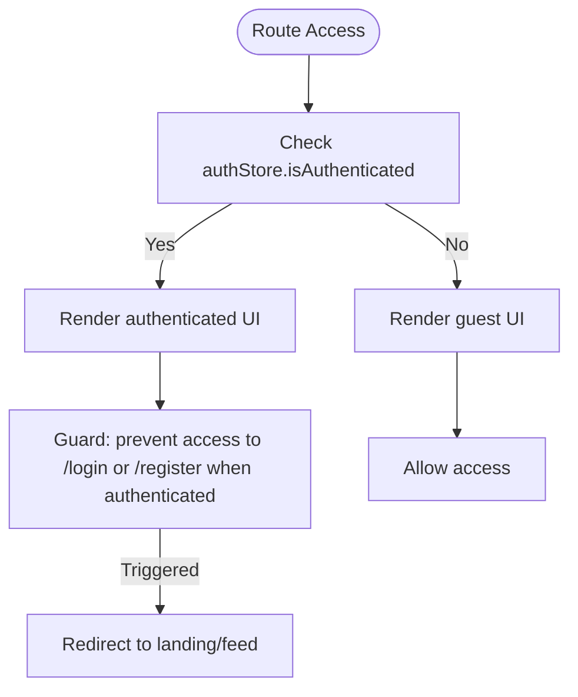
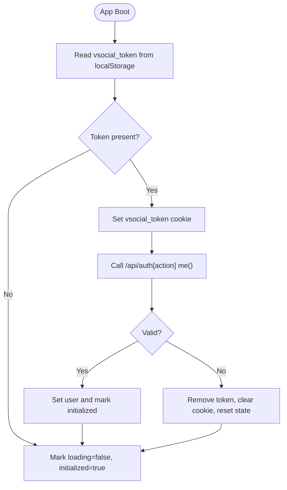
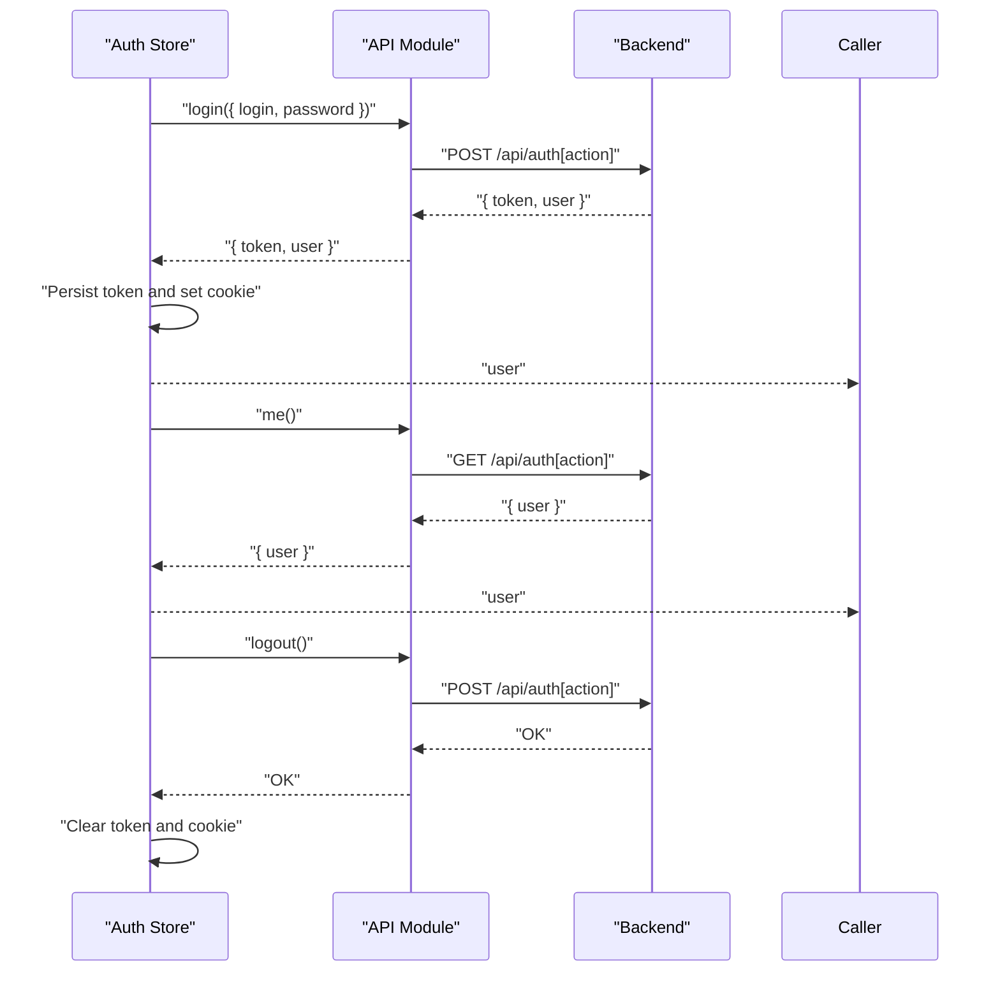
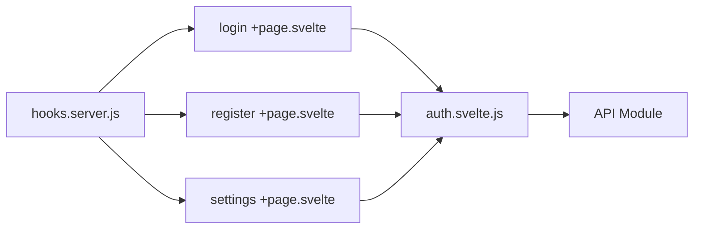

# Frontend Authentication Integration

<cite>
**Referenced Files in This Document**
- [auth.svelte.js](file://frontend/src/lib/stores/auth.svelte.js)
- [login +page.svelte](file://frontend/src/routes/login/+page.svelte)
- [register +page.svelte](file://frontend/src/routes/register/+page.svelte)
- [settings +page.svelte](file://frontend/src/routes/settings/+page.svelte)
- [+page.svelte (root)](file://frontend/src/routes/+page.svelte)
- [hooks.server.js](file://frontend/src/hooks.server.js)
- [README.md](file://README.md)
</cite>

## Table of Contents
1. [Introduction](#introduction)
2. [Project Structure](#project-structure)
3. [Core Components](#core-components)
4. [Architecture Overview](#architecture-overview)
5. [Detailed Component Analysis](#detailed-component-analysis)
6. [Dependency Analysis](#dependency-analysis)
7. [Performance Considerations](#performance-considerations)
8. [Troubleshooting Guide](#troubleshooting-guide)
9. [Conclusion](#conclusion)
10. [Appendices](#appendices)

## Introduction
This document explains the frontend authentication integration in VSocial, focusing on the Svelte 5 store-based authentication state management, client-side flows, persistence, and integration with backend endpoints. It covers reactive user data, session tracking, automatic token handling, protected routing patterns, conditional UI rendering, and operational guidance for extending authentication with third-party providers.

## Project Structure
The authentication system spans three primary areas:
- Stores: Centralized reactive state for user, token, roles, and initialization/loading flags
- Pages: Login and registration forms that drive auth actions via the store
- Settings: Demonstrates authenticated UI patterns and store-driven updates

**Diagram sources**
- [auth.svelte.js:1-131](file://frontend/src/lib/stores/auth.svelte.js#L1-L131)
- [login +page.svelte:1-390](file://frontend/src/routes/login/+page.svelte#L1-L390)
- [register +page.svelte:1-700](file://frontend/src/routes/register/+page.svelte#L1-L700)
- [settings +page.svelte:1-1257](file://frontend/src/routes/settings/+page.svelte#L1-L1257)
- [+page.svelte (root):1-200](file://frontend/src/routes/+page.svelte#L1-L200)
- [hooks.server.js:105-147](file://frontend/src/hooks.server.js#L105-L147)

**Section sources**
- [auth.svelte.js:1-131](file://frontend/src/lib/stores/auth.svelte.js#L1-L131)
- [login +page.svelte:1-390](file://frontend/src/routes/login/+page.svelte#L1-L390)
- [register +page.svelte:1-700](file://frontend/src/routes/register/+page.svelte#L1-L700)
- [settings +page.svelte:1-1257](file://frontend/src/routes/settings/+page.svelte#L1-L1257)
- [+page.svelte (root):1-200](file://frontend/src/routes/+page.svelte#L1-L200)
- [hooks.server.js:105-147](file://frontend/src/hooks.server.js#L105-L147)

## Core Components
- Auth store: Provides reactive getters and actions for user, token, initialization, login, register, logout, refresh, and user updates
- Login page: Drives login flow and redirects on success
- Registration page: Drives multi-step registration and redirects on success
- Settings page: Demonstrates authenticated UI rendering and store-driven updates
- Root page: Entry point for app bootstrapping and initial auth hydration
- Server hooks: Security headers and setup wizard guard

Key store capabilities:
- Reactive user, token, loading, and initialization state
- Role-derived flags (admin, moderator)
- LocalStorage-backed token persistence and cookie synchronization
- Automatic token propagation to backend API layer
- Graceful error handling and cleanup on invalidation

**Section sources**
- [auth.svelte.js:8-131](file://frontend/src/lib/stores/auth.svelte.js#L8-L131)
- [login +page.svelte:42-62](file://frontend/src/routes/login/+page.svelte#L42-L62)
- [register +page.svelte:93-117](file://frontend/src/routes/register/+page.svelte#L93-L117)
- [settings +page.svelte:1-260](file://frontend/src/routes/settings/+page.svelte#L1-L260)
- [+page.svelte (root):1-200](file://frontend/src/routes/+page.svelte#L1-L200)
- [hooks.server.js:105-147](file://frontend/src/hooks.server.js#L105-L147)

## Architecture Overview
The authentication architecture combines a Svelte 5 store with page-level flows and server-side protections. The store hydrates from persisted storage on app boot, exposes reactive state to components, and coordinates with backend endpoints for login, registration, logout, and profile refresh.

**Diagram sources**
- [login +page.svelte:42-62](file://frontend/src/routes/login/+page.svelte#L42-L62)
- [auth.svelte.js:52-61](file://frontend/src/lib/stores/auth.svelte.js#L52-L61)

**Section sources**
- [auth.svelte.js:22-47](file://frontend/src/lib/stores/auth.svelte.js#L22-L47)
- [login +page.svelte:21-25](file://frontend/src/routes/login/+page.svelte#L21-L25)
- [auth.svelte.js:52-61](file://frontend/src/lib/stores/auth.svelte.js#L52-L61)

## Detailed Component Analysis

### Auth Store Implementation
The store encapsulates:
- Private reactive state for user, token, loading, and initialization
- Derived flags for authentication and role checks
- Initialization routine that restores session from localStorage and validates with backend
- Login/register flows that persist tokens and synchronize cookies
- Logout with cleanup and backend call
- User update and refresh helpers

**Diagram sources**
- [auth.svelte.js:8-131](file://frontend/src/lib/stores/auth.svelte.js#L8-L131)

**Section sources**
- [auth.svelte.js:8-131](file://frontend/src/lib/stores/auth.svelte.js#L8-L131)

### Login Flow
- Validates input and disables submission when invalid or loading
- Calls store.login with trimmed identifier and password
- On success, navigates to feed; on error, displays localized message
- Redirects automatically if user is already authenticated

**Diagram sources**
- [login +page.svelte:42-62](file://frontend/src/routes/login/+page.svelte#L42-L62)
- [login +page.svelte:21-25](file://frontend/src/routes/login/+page.svelte#L21-L25)

**Section sources**
- [login +page.svelte:8-62](file://frontend/src/routes/login/+page.svelte#L8-L62)

### Registration Flow
- Multi-step form with derived validations per step
- On completion, constructs payload and calls store.register
- Persists token and navigates to feed on success

**Diagram sources**
- [register +page.svelte:93-117](file://frontend/src/routes/register/+page.svelte#L93-L117)
- [auth.svelte.js:66-75](file://frontend/src/lib/stores/auth.svelte.js#L66-L75)

**Section sources**
- [register +page.svelte:9-117](file://frontend/src/routes/register/+page.svelte#L9-L117)

### Protected Route Guards and Conditional Rendering
- Login and registration pages redirect authenticated users away from auth routes
- Settings page demonstrates authenticated UI sections and store-driven updates
- Server hooks enforce setup wizard guard and basic security headers

**Diagram sources**
- [login +page.svelte:21-25](file://frontend/src/routes/login/+page.svelte#L21-L25)
- [register +page.svelte:67-70](file://frontend/src/routes/register/+page.svelte#L67-L70)
- [settings +page.svelte:1-260](file://frontend/src/routes/settings/+page.svelte#L1-L260)
- [hooks.server.js:122-144](file://frontend/src/hooks.server.js#L122-L144)

**Section sources**
- [login +page.svelte:21-25](file://frontend/src/routes/login/+page.svelte#L21-L25)
- [register +page.svelte:67-70](file://frontend/src/routes/register/+page.svelte#L67-L70)
- [settings +page.svelte:1-260](file://frontend/src/routes/settings/+page.svelte#L1-L260)
- [hooks.server.js:122-144](file://frontend/src/hooks.server.js#L122-L144)

### Token Persistence and Cookie Synchronization
- On login/register/logout, the store writes/updates the vsocial_token in localStorage and sets a corresponding cookie
- On app initialization, the store reads the token from localStorage, sets the cookie, and validates with the backend

**Diagram sources**
- [auth.svelte.js:22-47](file://frontend/src/lib/stores/auth.svelte.js#L22-L47)
- [auth.svelte.js:52-88](file://frontend/src/lib/stores/auth.svelte.js#L52-L88)

**Section sources**
- [auth.svelte.js:22-47](file://frontend/src/lib/stores/auth.svelte.js#L22-L47)
- [auth.svelte.js:52-88](file://frontend/src/lib/stores/auth.svelte.js#L52-L88)

### Integration with Backend Authentication Endpoints
- The store delegates network operations to a centralized API module
- Endpoints used:
  - POST /api/auth[action] for login and registration
  - GET /api/auth[action] for fetching current user
  - POST /api/auth[action] for logout
- Error propagation:
  - On unauthorized refresh, the store triggers logout and rethrows the error
  - UI surfaces user-friendly messages from thrown errors

**Diagram sources**
- [auth.svelte.js:52-88](file://frontend/src/lib/stores/auth.svelte.js#L52-L88)

**Section sources**
- [auth.svelte.js:52-88](file://frontend/src/lib/stores/auth.svelte.js#L52-L88)

### Authentication-Aware Component Patterns
- Conditional rendering based on authStore.isAuthenticated and role flags
- Updating user data in the store after successful profile edits
- Using derived values for computed UI states (e.g., step validity)

Examples:
- Login page uses $state and $derived to manage form state and enable/disable controls
- Settings page conditionally loads and saves preferences based on authenticated state

**Section sources**
- [login +page.svelte:8-62](file://frontend/src/routes/login/+page.svelte#L8-L62)
- [settings +page.svelte:73-124](file://frontend/src/routes/settings/+page.svelte#L73-L124)
- [settings +page.svelte:127-147](file://frontend/src/routes/settings/+page.svelte#L127-L147)

## Dependency Analysis
- Pages depend on the auth store for reactive state and actions
- The store depends on the API module for backend communication
- Server hooks influence navigation and protect routes during setup

**Diagram sources**
- [login +page.svelte:5](file://frontend/src/routes/login/+page.svelte#L5)
- [register +page.svelte:5](file://frontend/src/routes/register/+page.svelte#L5)
- [settings +page.svelte:4](file://frontend/src/routes/settings/+page.svelte#L4)
- [auth.svelte.js:6](file://frontend/src/lib/stores/auth.svelte.js#L6)
- [hooks.server.js:105-147](file://frontend/src/hooks.server.js#L105-L147)

**Section sources**
- [login +page.svelte:5](file://frontend/src/routes/login/+page.svelte#L5)
- [register +page.svelte:5](file://frontend/src/routes/register/+page.svelte#L5)
- [settings +page.svelte:4](file://frontend/src/routes/settings/+page.svelte#L4)
- [auth.svelte.js:6](file://frontend/src/lib/stores/auth.svelte.js#L6)
- [hooks.server.js:105-147](file://frontend/src/hooks.server.js#L105-L147)

## Performance Considerations
- Minimize unnecessary re-renders by relying on Svelte 5 runes for fine-grained reactivity
- Defer heavy computations to derived values and keep store state minimal
- Persist tokens locally to avoid repeated backend calls on app boot
- Batch UI updates after store mutations to reduce layout thrashing

## Troubleshooting Guide
Common issues and resolutions:
- Stuck loading on boot: Verify localStorage availability and token presence; ensure the store’s initialize routine completes
- Unauthorized errors after refresh: The store automatically logs out on 401 during refresh; re-authenticate
- Persistent login despite logout: Confirm cookie removal and localStorage cleanup in the store’s logout routine
- Navigation loops: Ensure guards redirect authenticated users away from login/register pages

Operational tips:
- Inspect vsocial_token in localStorage and cookies to confirm persistence
- Monitor server hook guards for unexpected redirects to setup/install routes
- Use error banners in login/register pages to surface actionable messages

**Section sources**
- [auth.svelte.js:102-113](file://frontend/src/lib/stores/auth.svelte.js#L102-L113)
- [auth.svelte.js:80-88](file://frontend/src/lib/stores/auth.svelte.js#L80-L88)
- [login +page.svelte:52-56](file://frontend/src/routes/login/+page.svelte#L52-L56)
- [register +page.svelte:111-116](file://frontend/src/routes/register/+page.svelte#L111-L116)
- [hooks.server.js:122-144](file://frontend/src/hooks.server.js#L122-L144)

## Conclusion
VSocial’s frontend authentication integrates a Svelte 5 store with page-level flows and server-side protections. The store centralizes reactive state, persists tokens securely, and coordinates with backend endpoints. Pages leverage the store for guarded navigation, conditional rendering, and seamless user experiences. Extending the system—such as adding third-party providers—should preserve the store’s interface while adapting the API layer and login/register flows accordingly.

## Appendices

### Browser Storage Considerations
- Token storage: localStorage and HttpOnly-safe cookies synchronized by the store
- Cookie attributes: path=/, SameSite=Strict, 7-day max-age for persistent sessions
- Cleanup: On logout and invalidation, both localStorage and cookies are cleared

**Section sources**
- [auth.svelte.js:28-46](file://frontend/src/lib/stores/auth.svelte.js#L28-L46)
- [auth.svelte.js:56-59](file://frontend/src/lib/stores/auth.svelte.js#L56-L59)
- [auth.svelte.js:84-88](file://frontend/src/lib/stores/auth.svelte.js#L84-L88)

### Token Refresh Strategies
- On app boot, the store attempts to validate the persisted token via a backend call
- During runtime, refresh can be invoked to reload user data; on 401, the store logs out and rethrows

**Section sources**
- [auth.svelte.js:22-47](file://frontend/src/lib/stores/auth.svelte.js#L22-L47)
- [auth.svelte.js:102-113](file://frontend/src/lib/stores/auth.svelte.js#L102-L113)

### Offline Authentication Scenarios
- If localStorage is unavailable, the store remains functional but cannot persist tokens across sessions
- On invalid tokens, the store clears state and cookies, preventing stale sessions

**Section sources**
- [auth.svelte.js:37-46](file://frontend/src/lib/stores/auth.svelte.js#L37-L46)

### Extending Authentication Functionality
- Add provider-specific flows by introducing new actions in the store (e.g., loginWithProvider)
- Keep the store’s reactive getters and persistence mechanisms unchanged
- Update login/register pages to expose provider options and adapt form handling
- Ensure server hooks remain compatible with new auth endpoints

[No sources needed since this section provides general guidance]