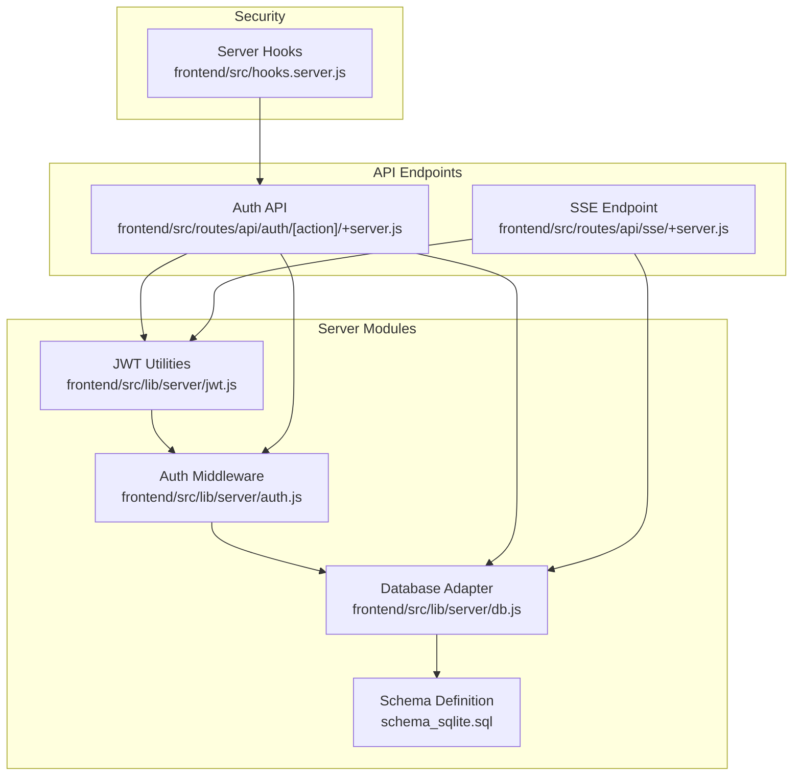
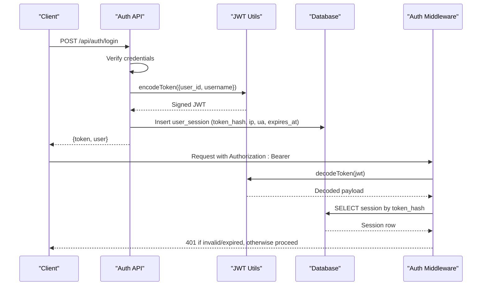
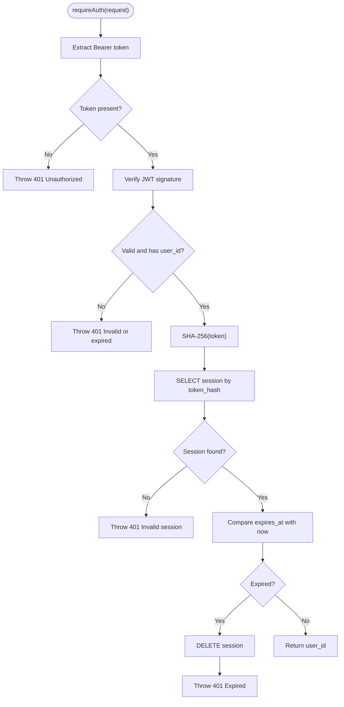
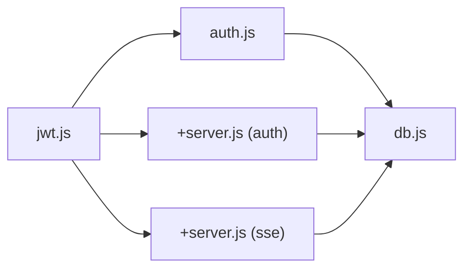

# JWT Token Management

<cite>
**Referenced Files in This Document**
- [jwt.js](file://frontend/src/lib/server/jwt.js)
- [auth.js](file://frontend/src/lib/server/auth.js)
- [+server.js](file://frontend/src/routes/api/auth/[action]/+server.js)
- [+server.js](file://frontend/src/routes/api/sse/+server.js)
- [db.js](file://frontend/src/lib/server/db.js)
- [schema_sqlite.sql](file://schema_sqlite.sql)
- [hooks.server.js](file://frontend/src/hooks.server.js)
- [package.json](file://frontend/package.json)
</cite>

## Table of Contents
1. [Introduction](#introduction)
2. [Project Structure](#project-structure)
3. [Core Components](#core-components)
4. [Architecture Overview](#architecture-overview)
5. [Detailed Component Analysis](#detailed-component-analysis)
6. [Dependency Analysis](#dependency-analysis)
7. [Performance Considerations](#performance-considerations)
8. [Troubleshooting Guide](#troubleshooting-guide)
9. [Conclusion](#conclusion)

## Introduction
This document explains JWT token management in VSocial, covering encoding and decoding, payload structure, cryptographic signing, and lifecycle management. It documents how tokens are created during login/registration, validated via middleware, stored persistently for session verification, and handled in real-time contexts. It also outlines security headers applied at the server level, and provides troubleshooting guidance for common JWT-related issues.

## Project Structure
JWT-related logic is implemented in the backend server code:
- Token utilities and bearer extraction live in a dedicated JWT module
- Authentication middleware validates tokens against database-backed sessions
- API endpoints create tokens upon successful authentication
- Real-time endpoints (SSE) validate tokens differently due to transport constraints
- Database schema defines persistent session storage
- Server hooks apply security headers globally

**Diagram sources**
- [jwt.js](file://frontend/src/lib/server/jwt.js)
- [auth.js](file://frontend/src/lib/server/auth.js)
- [+server.js](file://frontend/src/routes/api/auth/[action]/+server.js)
- [+server.js](file://frontend/src/routes/api/sse/+server.js)
- [db.js](file://frontend/src/lib/server/db.js)
- [schema_sqlite.sql](file://schema_sqlite.sql)
- [hooks.server.js](file://frontend/src/hooks.server.js)

**Section sources**
- [jwt.js](file://frontend/src/lib/server/jwt.js)
- [auth.js](file://frontend/src/lib/server/auth.js)
- [+server.js](file://frontend/src/routes/api/auth/[action]/+server.js)
- [+server.js](file://frontend/src/routes/api/sse/+server.js)
- [db.js](file://frontend/src/lib/server/db.js)
- [schema_sqlite.sql](file://schema_sqlite.sql)
- [hooks.server.js](file://frontend/src/hooks.server.js)

## Core Components
- JWT Utilities: Provides token encoding, decoding, and Bearer header parsing
- Auth Middleware: Validates tokens and ensures session existence/expiry
- Session Storage: Persists token hashes with metadata and expiry
- Auth API: Creates tokens on login/register and invalidates sessions on logout
- SSE Endpoint: Validates tokens via query parameter due to SSE transport limitations
- Database Adapter: Unified interface for SQLite/LibSQL with transaction support
- Security Headers: Applied globally via server hooks

Key responsibilities:
- Encoding/Decoding: Uses a secret from environment variables with an expiry claim
- Validation: Verifies signature and payload, then cross-checks DB-stored session
- Expiry Handling: Enforces expiry at both JWT and session levels
- Session Persistence: Stores SHA-256 hash of the token for fast lookup and revocation

**Section sources**
- [jwt.js](file://frontend/src/lib/server/jwt.js)
- [auth.js](file://frontend/src/lib/server/auth.js)
- [schema_sqlite.sql](file://schema_sqlite.sql)
- [+server.js](file://frontend/src/routes/api/auth/[action]/+server.js)
- [+server.js](file://frontend/src/routes/api/sse/+server.js)
- [db.js](file://frontend/src/lib/server/db.js)
- [hooks.server.js](file://frontend/src/hooks.server.js)

## Architecture Overview
The JWT lifecycle spans three primary flows:
- Login/Register: On successful credentials verification, a signed JWT is created and a hashed session is inserted into the database
- Protected Endpoints: Middleware extracts the Bearer token, verifies it, and checks the session record for validity and expiry
- SSE Streams: Tokens are passed via query parameter; verified similarly using the same JWT and session checks

**Diagram sources**
- [+server.js](file://frontend/src/routes/api/auth/[action]/+server.js)
- [jwt.js](file://frontend/src/lib/server/jwt.js)
- [auth.js](file://frontend/src/lib/server/auth.js)
- [db.js](file://frontend/src/lib/server/db.js)

## Detailed Component Analysis

### JWT Utilities
Responsibilities:
- Load secret and expiry from environment
- Sign payloads into JWTs with expiry
- Verify JWTs and return null on failure
- Extract Bearer token from Authorization header

Implementation highlights:
- Secret and expiry are loaded from environment variables
- Signing uses HS256 by default via the library
- Verification wraps the underlying call and normalizes errors to null

Security considerations:
- Secret must be strong and rotated periodically
- Expiry should be set appropriately for the application’s risk model

**Section sources**
- [jwt.js](file://frontend/src/lib/server/jwt.js)

### Authentication Middleware
Responsibilities:
- Extract Bearer token from request headers
- Verify JWT signature and decode payload
- Compute SHA-256 hash of the token
- Lookup session in database by token hash
- Compare expiry timestamps and reject expired sessions
- Return user ID on success or throw 401/403

Processing logic:

**Diagram sources**
- [auth.js](file://frontend/src/lib/server/auth.js)

**Section sources**
- [auth.js](file://frontend/src/lib/server/auth.js)

### Session Storage Schema
The session table persists token hashes and related metadata:
- Fields: id, user_id, token_hash, ip_address, user_agent, created_at, expires_at
- Indexes: token_hash and user_id for efficient lookup
- Foreign key: user_id references users table with cascade delete

Implications:
- Token revocation is immediate by deleting the session row
- Sessions can be pruned by expiry checks in middleware
- IP and UA can be used for anomaly detection if desired

**Section sources**
- [schema_sqlite.sql](file://schema_sqlite.sql)

### Auth API Endpoints
Responsibilities:
- Registration: Validates input, hashes password, inserts user, creates session, returns token and user
- Login: Validates credentials, updates last seen, creates session, returns token and user
- Logout: Computes token hash and deletes session if token provided
- Profile: Requires authentication and returns user data

Lifecycle specifics:
- Token payload includes user_id and username (empty placeholder in current implementation)
- Expiry is set server-side when creating the session
- Session metadata includes IP and User-Agent

**Section sources**
- [+server.js](file://frontend/src/routes/api/auth/[action]/+server.js)
- [auth.js](file://frontend/src/lib/server/auth.js)

### SSE Endpoint Token Validation
Due to SSE transport constraints, tokens are passed via query parameter:
- Reads token from URL query
- Verifies JWT signature and payload
- Looks up session by token hash and checks expiry
- Streams events or error frames accordingly

Security note:
- Prefer HTTPS to protect token in query string
- Consider rotating tokens per connection if sensitive

**Section sources**
- [+server.js](file://frontend/src/routes/api/sse/+server.js)
- [jwt.js](file://frontend/src/lib/server/jwt.js)
- [db.js](file://frontend/src/lib/server/db.js)

### Database Adapter
Provides unified async API for SQLite/LibSQL:
- Wraps drivers into a consistent interface
- Supports transactions and prepared statements
- Initializes pragmas for performance and safety

Relevance to JWT:
- Used by auth middleware and API endpoints to store/retrieve sessions
- Ensures ACID guarantees for session writes and reads

**Section sources**
- [db.js](file://frontend/src/lib/server/db.js)

### Security Headers
Applied globally via server hooks:
- X-Content-Type-Options: nosniff
- X-Frame-Options: SAMEORIGIN
- Referrer-Policy: strict-origin-when-cross-origin
- Permissions-Policy: camera=(), microphone=(self), geolocation=(self)

These headers improve defense-in-depth against common web attacks and complement JWT-based authentication.

**Section sources**
- [hooks.server.js](file://frontend/src/hooks.server.js)

## Dependency Analysis
JWT utilities are consumed by:
- Auth middleware for validation
- Auth API for token creation
- SSE endpoint for validation (query parameter variant)

Database adapter is consumed by:
- Auth middleware for session lookup
- Auth API for session insertion/deletion

**Diagram sources**
- [jwt.js](file://frontend/src/lib/server/jwt.js)
- [auth.js](file://frontend/src/lib/server/auth.js)
- [+server.js](file://frontend/src/routes/api/auth/[action]/+server.js)
- [+server.js](file://frontend/src/routes/api/sse/+server.js)
- [db.js](file://frontend/src/lib/server/db.js)

**Section sources**
- [jwt.js](file://frontend/src/lib/server/jwt.js)
- [auth.js](file://frontend/src/lib/server/auth.js)
- [+server.js](file://frontend/src/routes/api/auth/[action]/+server.js)
- [+server.js](file://frontend/src/routes/api/sse/+server.js)
- [db.js](file://frontend/src/lib/server/db.js)

## Performance Considerations
- Token hashing: SHA-256 computation is lightweight compared to DB round-trips
- Index usage: token_hash index enables O(log n) session lookup
- Expiry checks: two-layer expiry (JWT and DB) avoids unnecessary DB queries for malformed tokens
- Transport differences: SSE uses query params; prefer Authorization header for standard APIs to avoid header restrictions

## Troubleshooting Guide
Common issues and resolutions:
- Missing Authorization header: Middleware throws 401; ensure clients send Bearer token
- Invalid or expired JWT: Verification fails; regenerate token after login
- Session not found: Indicates token mismatch or deletion; re-authenticate
- Expired session: Middleware deletes stale session and throws 401; renew token
- SSE token errors: Verify token presence and validity in query string; ensure HTTPS
- Environment misconfiguration: Missing JWT_SECRET or JWT_EXPIRES_IN; set in .env and restart

Operational tips:
- Monitor 401/403 rates to detect token leakage or misuse
- Rotate secrets periodically and invalidate sessions centrally if compromised
- Consider adding jti (token ID) to payload and store jti-to-user mapping for advanced revocation

**Section sources**
- [auth.js](file://frontend/src/lib/server/auth.js)
- [+server.js](file://frontend/src/routes/api/auth/[action]/+server.js)
- [+server.js](file://frontend/src/routes/api/sse/+server.js)
- [jwt.js](file://frontend/src/lib/server/jwt.js)

## Conclusion
VSocial implements a robust JWT-based authentication system with:
- Strong cryptographic signing using HS256
- Persistent session storage keyed by token hash for fast validation and revocation
- Clear separation of concerns between token utilities, middleware, and API endpoints
- Transport-aware validation (headers vs. query params)
- Global security headers for improved resilience

This design balances simplicity, security, and maintainability while supporting real-time features like SSE.