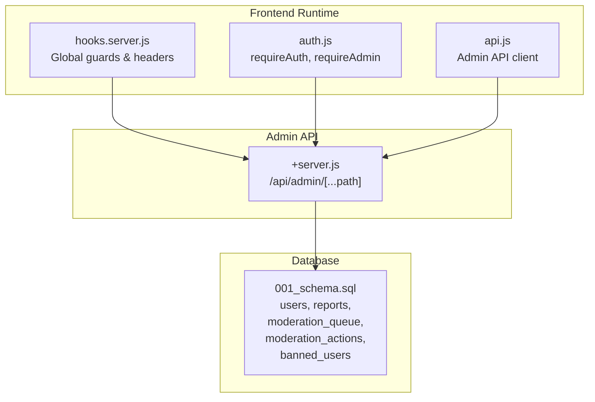
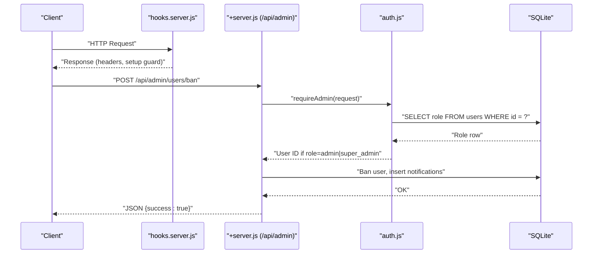
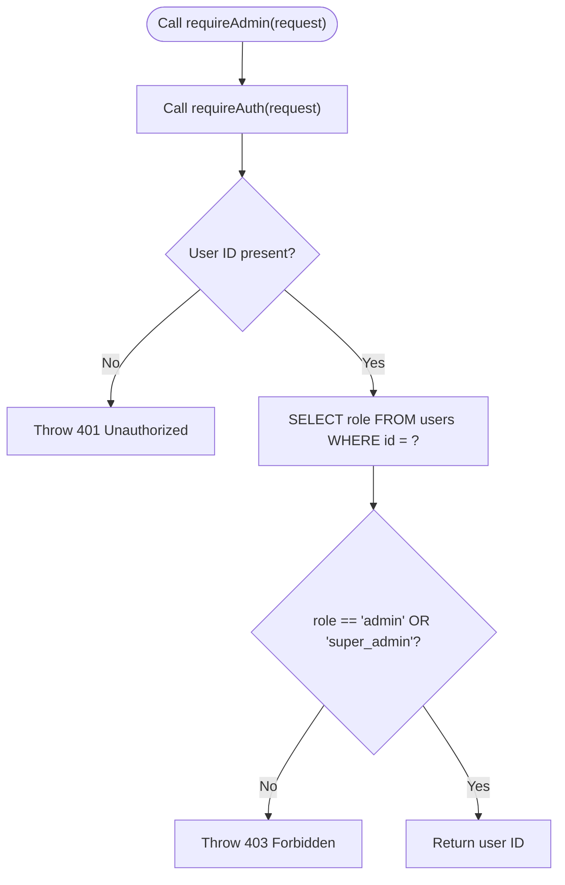
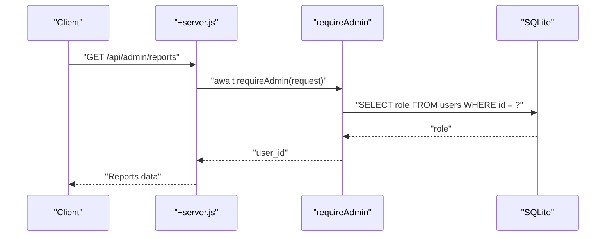
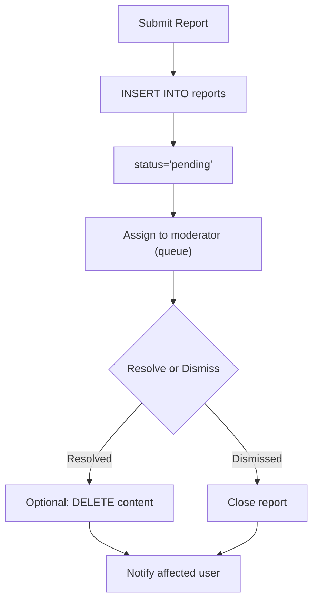
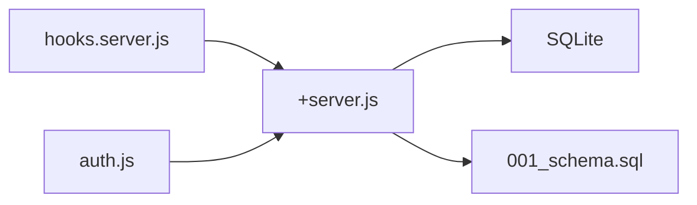

# User Roles & Permissions

<cite>
**Referenced Files in This Document**
- [hooks.server.js](file://frontend/src/hooks.server.js)
- [auth.js](file://frontend/src/lib/server/auth.js)
- [admin_api_server.js](file://frontend/src/routes/api/admin/[...path]/+server.js)
- [api.js](file://frontend/src/lib/api.js)
- [001_schema.sql](file://migrations/001_schema.sql)
</cite>

## Table of Contents
1. [Introduction](#introduction)
2. [Project Structure](#project-structure)
3. [Core Components](#core-components)
4. [Architecture Overview](#architecture-overview)
5. [Detailed Component Analysis](#detailed-component-analysis)
6. [Dependency Analysis](#dependency-analysis)
7. [Performance Considerations](#performance-considerations)
8. [Troubleshooting Guide](#troubleshooting-guide)
9. [Conclusion](#conclusion)
10. [Appendices](#appendices)

## Introduction
This document explains VSocial’s user role-based access control system. It covers the role hierarchy, permission checking mechanisms, role validation processes, and administrative access controls. It also documents the requireAdmin function implementation, role-based route protection, examples of role-specific API endpoints, content moderation workflows, administrative privileges, role assignment procedures, permission inheritance, and security boundaries between user tiers. Guidance is included for extending the role system and implementing custom permission checks.

## Project Structure
The role and permission system spans several areas:
- Frontend server hooks enforce global protections and security headers.
- Authentication utilities provide session validation and role checks.
- Admin API endpoints enforce admin-only access via requireAdmin.
- Client-side API module exposes admin endpoints for the UI.
- Database schema defines moderation and user-related tables supporting the role system.



**Diagram sources**
- [hooks.server.js:105-147](file://frontend/src/hooks.server.js#L105-L147)
- [auth.js:79-89](file://frontend/src/lib/server/auth.js#L79-L89)
- [admin_api_server.js:1-198](file://frontend/src/routes/api/admin/[...path]/+server.js#L1-L198)
- [api.js:255-287](file://frontend/src/lib/api.js#L255-L287)
- [001_schema.sql:409-447](file://migrations/001_schema.sql#L409-L447)

**Section sources**
- [hooks.server.js:105-147](file://frontend/src/hooks.server.js#L105-L147)
- [auth.js:79-89](file://frontend/src/lib/server/auth.js#L79-L89)
- [admin_api_server.js:1-198](file://frontend/src/routes/api/admin/[...path]/+server.js#L1-L198)
- [api.js:255-287](file://frontend/src/lib/api.js#L255-L287)
- [001_schema.sql:409-447](file://migrations/001_schema.sql#L409-L447)

## Core Components
- Role hierarchy
  - Standard user: basic platform access.
  - Moderator: can moderate content and review reports.
  - Admin: can manage users, content, reports, and system settings.
  - Super Admin: can perform all administrative actions including sensitive operations.
- Permission checking
  - requireAdmin enforces admin/super_admin access for protected admin endpoints.
  - requireAuth validates sessions and extracts the current user ID.
- Administrative access controls
  - Admin endpoints under /api/admin/[...path] are guarded by requireAdmin.
  - Admin actions include user management, content moderation, and system toggles.

**Section sources**
- [auth.js:79-89](file://frontend/src/lib/server/auth.js#L79-L89)
- [admin_api_server.js:8-12](file://frontend/src/routes/api/admin/[...path]/+server.js#L8-L12)
- [admin_api_server.js:188-194](file://frontend/src/routes/api/admin/[...path]/+server.js#L188-L194)

## Architecture Overview
The role and permission enforcement architecture integrates frontend hooks, authentication utilities, and admin API handlers. The flow ensures that only authenticated users with sufficient roles can access admin endpoints.



**Diagram sources**
- [hooks.server.js:105-147](file://frontend/src/hooks.server.js#L105-L147)
- [admin_api_server.js:149-154](file://frontend/src/routes/api/admin/[...path]/+server.js#L149-L154)
- [auth.js:79-89](file://frontend/src/lib/server/auth.js#L79-L89)

## Detailed Component Analysis

### Role Hierarchy and Permission Model
- Users table supports a role field used to determine access level.
- Moderation tables support moderation workflows and actions.
- Super Admin can perform all admin functions; Admin can manage users, content, and settings.

```mermaid
classDiagram
class User {
+int id
+string role
}
class Report {
+int id
+int reporter_id
+string status
}
class ModerationQueue {
+int id
+string content_type
+int content_id
+string status
}
class ModerationActions {
+int id
+int moderator_id
+int target_user_id
+string action
}
class BannedUsers {
+int user_id
}
User ||--o{ Report : "reports"
User ||--o{ ModerationActions : "moderates"
User ||--o{ ModerationQueue : "assigned_to"
User ||--|| BannedUsers : "banned"
```

**Diagram sources**
- [001_schema.sql:409-447](file://migrations/001_schema.sql#L409-L447)

**Section sources**
- [001_schema.sql:409-447](file://migrations/001_schema.sql#L409-L447)

### requireAdmin Implementation
- Validates the current session via requireAuth.
- Queries the user record and checks that role equals admin or super_admin.
- Throws a 403 error if the user lacks sufficient privilege.
- Returns the authenticated user ID on success.



**Diagram sources**
- [auth.js:79-89](file://frontend/src/lib/server/auth.js#L79-L89)

**Section sources**
- [auth.js:79-89](file://frontend/src/lib/server/auth.js#L79-L89)

### Role-Based Route Protection
- All admin endpoints under /api/admin/[...path] call requireAdmin before processing requests.
- This ensures only authorized administrators can perform privileged operations.



**Diagram sources**
- [admin_api_server.js:8-12](file://frontend/src/routes/api/admin/[...path]/+server.js#L8-L12)
- [auth.js:79-89](file://frontend/src/lib/server/auth.js#L79-L89)

**Section sources**
- [admin_api_server.js:8-12](file://frontend/src/routes/api/admin/[...path]/+server.js#L8-L12)
- [admin_api_server.js:188-194](file://frontend/src/routes/api/admin/[...path]/+server.js#L188-L194)

### Role-Specific API Endpoints
- Admin dashboard metrics retrieval.
- User management: list, get, update, ban, unban.
- Reports management: list, resolve (with optional content deletion).
- Content moderation: trash listing and restoration.
- System settings: get and batch update; toggle individual keys.
- Analytics endpoint.

These endpoints are exposed via the client-side admin API module and backed by the admin server handler.

**Section sources**
- [admin_api_server.js:14-22](file://frontend/src/routes/api/admin/[...path]/+server.js#L14-L22)
- [admin_api_server.js:149-154](file://frontend/src/routes/api/admin/[...path]/+server.js#L149-L154)
- [admin_api_server.js:156-166](file://frontend/src/routes/api/admin/[...path]/+server.js#L156-L166)
- [admin_api_server.js:176-183](file://frontend/src/routes/api/admin/[...path]/+server.js#L176-L183)
- [admin_api_server.js:196-198](file://frontend/src/routes/api/admin/[...path]/+server.js#L196-L198)
- [api.js:255-287](file://frontend/src/lib/api.js#L255-L287)

### Content Moderation Workflows
- Reports are stored with status and reviewed_by linkage.
- Moderation queue tracks content requiring review and assigns moderators.
- Moderation actions record moderator decisions and durations.
- Banned users table records bans and who performed them.



**Diagram sources**
- [001_schema.sql:409-447](file://migrations/001_schema.sql#L409-L447)
- [admin_api_server.js:156-166](file://frontend/src/routes/api/admin/[...path]/+server.js#L156-L166)

**Section sources**
- [001_schema.sql:409-447](file://migrations/001_schema.sql#L409-L447)
- [admin_api_server.js:156-166](file://frontend/src/routes/api/admin/[...path]/+server.js#L156-L166)

### Administrative Privileges
- Ban/unban users and notify affected users.
- Resolve reports and optionally delete offending content.
- Toggle system settings and update settings in bulk.
- Restore deleted posts from trash.

**Section sources**
- [admin_api_server.js:149-154](file://frontend/src/routes/api/admin/[...path]/+server.js#L149-L154)
- [admin_api_server.js:156-166](file://frontend/src/routes/api/admin/[...path]/+server.js#L156-L166)
- [admin_api_server.js:168-174](file://frontend/src/routes/api/admin/[...path]/+server.js#L168-L174)
- [admin_api_server.js:176-183](file://frontend/src/routes/api/admin/[...path]/+server.js#L176-L183)

### Role Assignment Procedures and Permission Inheritance
- Role assignment is enforced by the requireAdmin function, which checks the role field against admin and super_admin.
- Permission inheritance is implicit: super_admin inherits all admin privileges and can perform sensitive operations.
- No explicit inheritance model is implemented in code; access is determined solely by the role field.

**Section sources**
- [auth.js:79-89](file://frontend/src/lib/server/auth.js#L79-L89)

### Security Boundaries Between Tiers
- Standard users cannot access admin endpoints; requireAdmin throws 403 for insufficient roles.
- Moderators are not automatically granted admin access; admin endpoints remain protected.
- Super Admin can perform all admin functions, but still requires a valid session.

**Section sources**
- [auth.js:79-89](file://frontend/src/lib/server/auth.js#L79-L89)
- [admin_api_server.js:8-12](file://frontend/src/routes/api/admin/[...path]/+server.js#L8-L12)

### Extending the Role System and Custom Permission Checks
- Add new roles in the users table and define their privileges in requireAdmin or introduce a dedicated permission matrix.
- Implement granular permission checks by adding a permissions lookup table and checking capabilities per endpoint.
- Introduce middleware similar to requireAdmin to gate endpoints based on custom permission sets.

[No sources needed since this section provides general guidance]

## Dependency Analysis
The admin API depends on authentication utilities and the database schema. The frontend hooks provide global protections and security headers.



**Diagram sources**
- [hooks.server.js:105-147](file://frontend/src/hooks.server.js#L105-L147)
- [auth.js:79-89](file://frontend/src/lib/server/auth.js#L79-L89)
- [admin_api_server.js:1-198](file://frontend/src/routes/api/admin/[...path]/+server.js#L1-L198)
- [001_schema.sql:409-447](file://migrations/001_schema.sql#L409-L447)

**Section sources**
- [hooks.server.js:105-147](file://frontend/src/hooks.server.js#L105-L147)
- [auth.js:79-89](file://frontend/src/lib/server/auth.js#L79-L89)
- [admin_api_server.js:1-198](file://frontend/src/routes/api/admin/[...path]/+server.js#L1-L198)
- [001_schema.sql:409-447](file://migrations/001_schema.sql#L409-L447)

## Performance Considerations
- Session validation and role checks are lightweight; ensure database indexes exist on users(id) and user_sessions(token_hash) for optimal performance.
- Batch updates to system settings reduce round-trips.
- Avoid excessive polling of admin endpoints; use server-sent events or notifications where appropriate.

[No sources needed since this section provides general guidance]

## Troubleshooting Guide
- 401 Unauthorized: Session missing or expired; prompt the user to log in again.
- 403 Forbidden: Insufficient role; the user must be admin or super_admin.
- Endpoint not found: Verify the action path under /api/admin/[...path].
- Database errors: The global error handler surfaces generic messages; inspect server logs for details.

**Section sources**
- [auth.js:79-89](file://frontend/src/lib/server/auth.js#L79-L89)
- [admin_api_server.js:185](file://frontend/src/routes/api/admin/[...path]/+server.js#L185)
- [hooks.server.js:154-178](file://frontend/src/hooks.server.js#L154-L178)

## Conclusion
VSocial’s role-based access control centers on a simple but effective model: requireAdmin gates admin endpoints, ensuring only admin and super_admin users can perform privileged operations. The system leverages database-backed roles and supports moderation workflows through dedicated tables. Extending the system involves adding roles and permission checks while maintaining clear separation between user tiers.

[No sources needed since this section summarizes without analyzing specific files]

## Appendices
- Client-side admin API module exposes endpoints for dashboards, users, reports, content, settings, and analytics.

**Section sources**
- [api.js:255-287](file://frontend/src/lib/api.js#L255-L287)