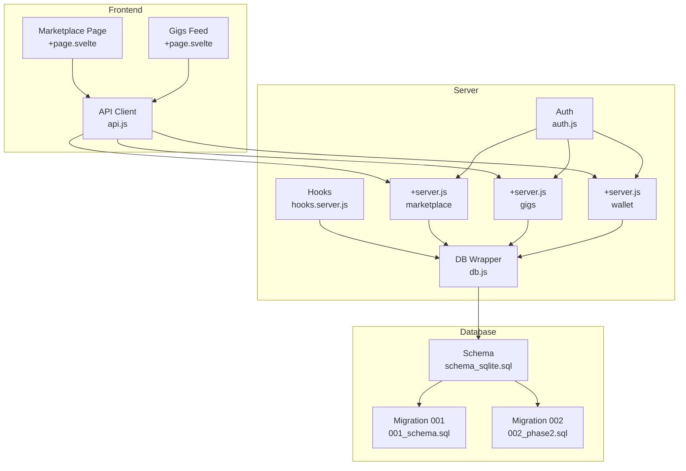
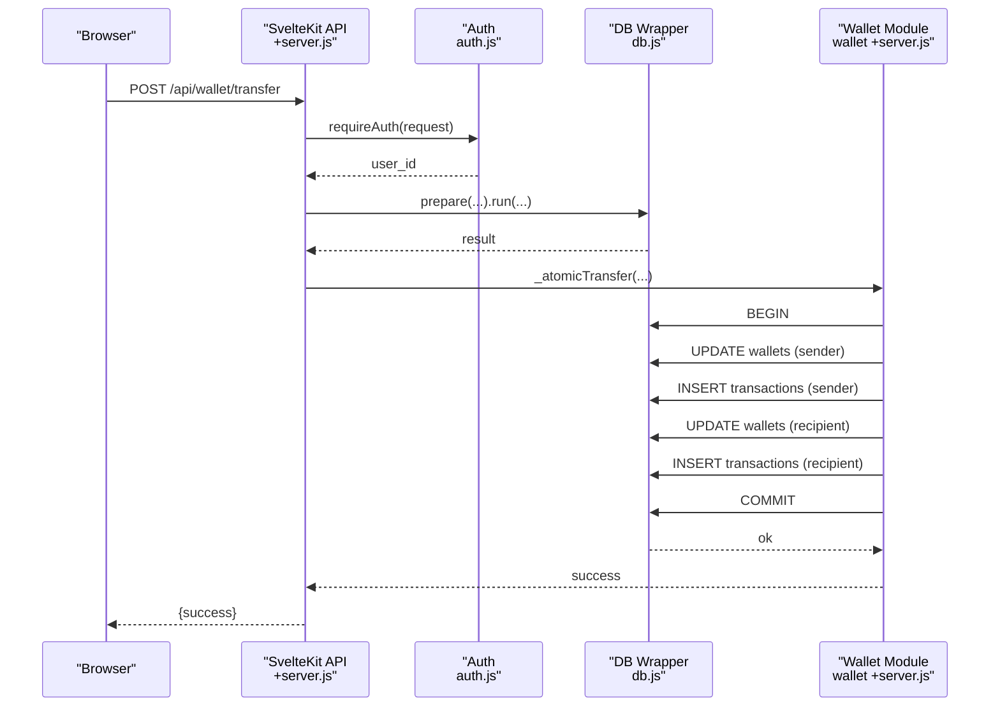
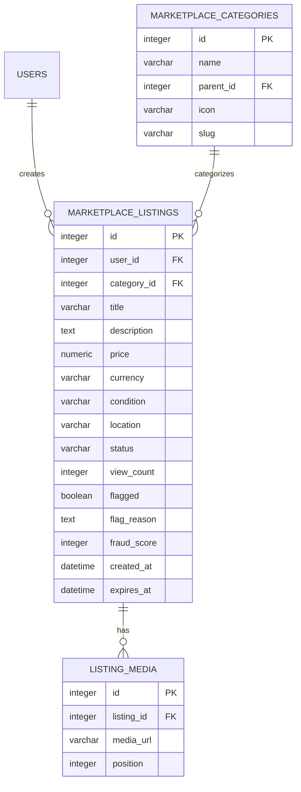
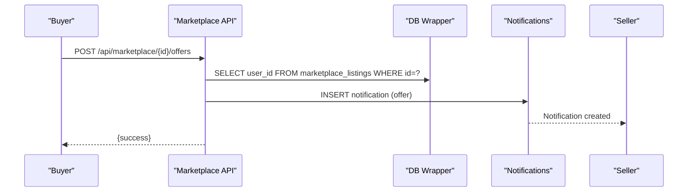
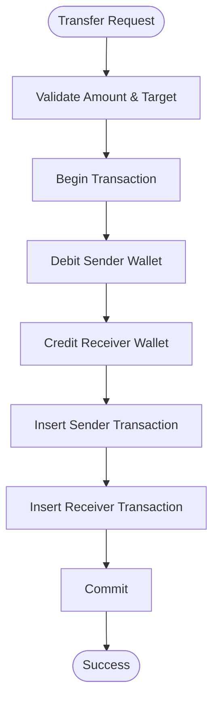
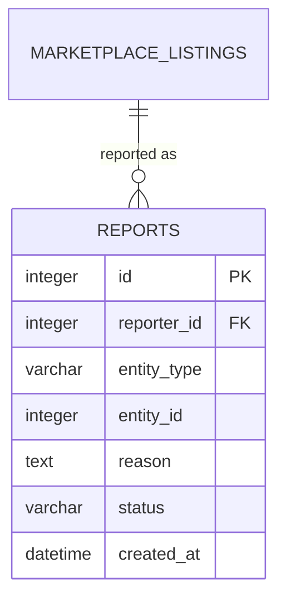
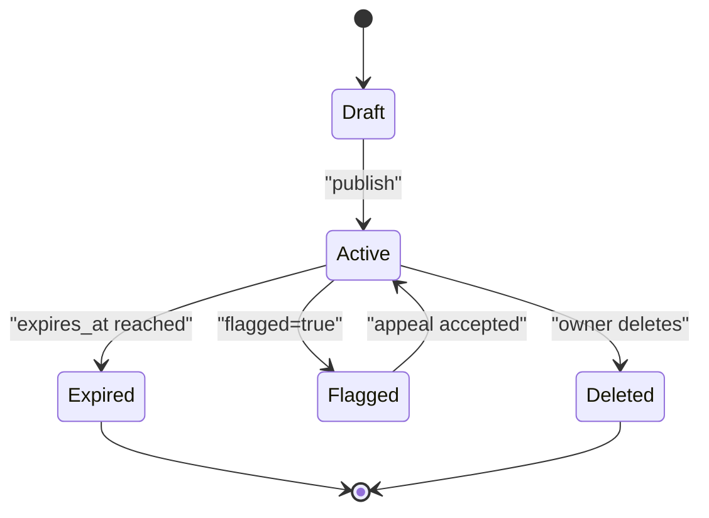
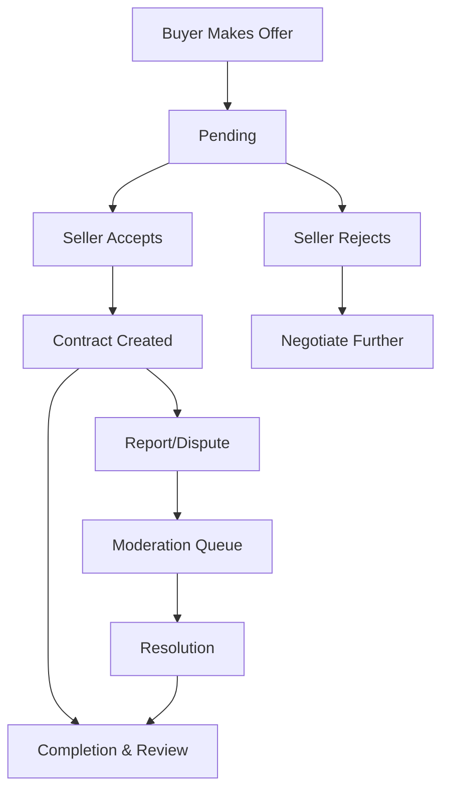
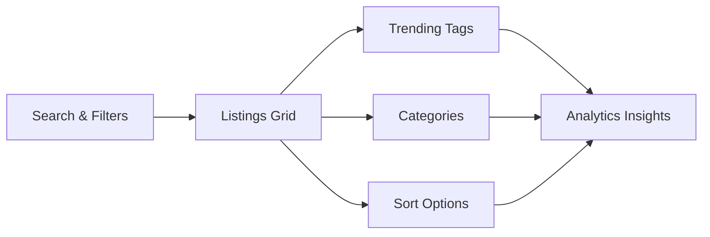
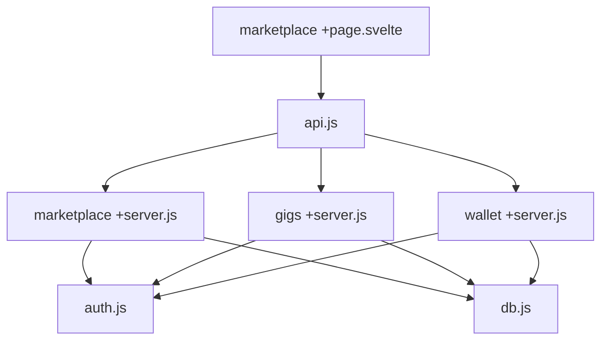

# Commerce & Marketplace Models

<cite>
**Referenced Files in This Document**
- [schema_sqlite.sql](file://schema_sqlite.sql)
- [001_schema.sql](file://migrations/001_schema.sql)
- [002_phase2.sql](file://migrations/002_phase2.sql)
- [marketplace +server.js](file://frontend/src/routes/api/marketplace/[...path]/+server.js)
- [gigs +server.js](file://frontend/src/routes/api/gigs/[...path]/+server.js)
- [wallet +server.js](file://frontend/src/routes/api/wallet/[...path]/+server.js)
- [db.js](file://frontend/src/lib/server/db.js)
- [auth.js](file://frontend/src/lib/server/auth.js)
- [api.js](file://frontend/src/lib/api.js)
- [marketplace +page.svelte](file://frontend/src/routes/marketplace/+page.svelte)
- [hooks.server.js](file://frontend/src/hooks.server.js)
</cite>

## Table of Contents
1. [Introduction](#introduction)
2. [Project Structure](#project-structure)
3. [Core Components](#core-components)
4. [Architecture Overview](#architecture-overview)
5. [Detailed Component Analysis](#detailed-component-analysis)
6. [Dependency Analysis](#dependency-analysis)
7. [Performance Considerations](#performance-considerations)
8. [Troubleshooting Guide](#troubleshooting-guide)
9. [Conclusion](#conclusion)
10. [Appendices](#appendices)

## Introduction
This document describes VSocial’s commerce and marketplace models, covering marketplace categories, listings, the legacy gig board, and transaction systems. It documents product catalog management, pricing structures, and inventory handling, along with freelancer gig creation, application management, and offer systems. It also details wallet architecture, transaction processing, and payment workflows, listing lifecycle from creation to expiration, moderation flags and quality scoring, offer negotiation, contract management, and dispute resolution mechanisms. Finally, it outlines commission calculations, fee structures, revenue sharing models, and examples of marketplace analytics, trending products, and recommendation algorithms.

## Project Structure
The marketplace and commerce functionality spans:
- Backend API endpoints under the frontend routes for marketplace, gigs, and wallet
- Frontend UI components and API clients for browsing, posting, and interacting with listings and gigs
- Database schema and migrations defining marketplace categories, listings, offers, wallets, and transactions
- Shared server utilities for database abstraction and authentication



**Diagram sources**
- [marketplace +page.svelte](file://frontend/src/routes/marketplace/+page.svelte)
- [api.js](file://frontend/src/lib/api.js)
- [hooks.server.js](file://frontend/src/hooks.server.js)
- [auth.js](file://frontend/src/lib/server/auth.js)
- [db.js](file://frontend/src/lib/server/db.js)
- [marketplace +server.js](file://frontend/src/routes/api/marketplace/[...path]/+server.js)
- [gigs +server.js](file://frontend/src/routes/api/gigs/[...path]/+server.js)
- [wallet +server.js](file://frontend/src/routes/api/wallet/[...path]/+server.js)
- [schema_sqlite.sql](file://schema_sqlite.sql)
- [001_schema.sql](file://migrations/001_schema.sql)
- [002_phase2.sql](file://migrations/002_phase2.sql)

**Section sources**
- [marketplace +page.svelte](file://frontend/src/routes/marketplace/+page.svelte)
- [api.js](file://frontend/src/lib/api.js)
- [hooks.server.js](file://frontend/src/hooks.server.js)
- [auth.js](file://frontend/src/lib/server/auth.js)
- [db.js](file://frontend/src/lib/server/db.js)
- [marketplace +server.js](file://frontend/src/routes/api/marketplace/[...path]/+server.js)
- [gigs +server.js](file://frontend/src/routes/api/gigs/[...path]/+server.js)
- [wallet +server.js](file://frontend/src/routes/api/wallet/[...path]/+server.js)
- [schema_sqlite.sql](file://schema_sqlite.sql)
- [001_schema.sql](file://migrations/001_schema.sql)
- [002_phase2.sql](file://migrations/002_phase2.sql)

## Core Components
- Marketplace categories and listings: hierarchical categories, listing metadata, media, and lifecycle fields
- Offers and negotiations: buyer offers with optional messages and expiration
- Wallet and transactions: atomic transfers, deposits, withdrawals, and transaction records
- Freelancer gigs and applications: creation, filtering, and application management
- Moderation and reporting: flags, fraud scores, and reporting queues
- Analytics and recommendations: trending and discovery signals

**Section sources**
- [schema_sqlite.sql](file://schema_sqlite.sql)
- [marketplace +server.js](file://frontend/src/routes/api/marketplace/[...path]/+server.js)
- [wallet +server.js](file://frontend/src/routes/api/wallet/[...path]/+server.js)
- [gigs +server.js](file://frontend/src/routes/api/gigs/[...path]/+server.js)
- [002_phase2.sql](file://migrations/002_phase2.sql)

## Architecture Overview
The system uses a thin SvelteKit server where API endpoints are implemented in +server.js files. Requests are authenticated via bearer tokens validated against stored sessions. Database operations are executed through a unified wrapper supporting both @libsql/client and better-sqlite3 drivers. Transactions are wrapped in explicit transactions to maintain consistency.



**Diagram sources**
- [wallet +server.js](file://frontend/src/routes/api/wallet/[...path]/+server.js)
- [auth.js](file://frontend/src/lib/server/auth.js)
- [db.js](file://frontend/src/lib/server/db.js)

**Section sources**
- [wallet +server.js](file://frontend/src/routes/api/wallet/[...path]/+server.js)
- [auth.js](file://frontend/src/lib/server/auth.js)
- [db.js](file://frontend/src/lib/server/db.js)

## Detailed Component Analysis

### Marketplace Categories and Listings
- Categories: hierarchical taxonomy with name, slug, and optional icon
- Listings: title, description, price, currency, condition, location, status, view count, flags, fraud score, timestamps, and expiration
- Media: per-listing images stored separately with ordering
- API: CRUD operations, search, pagination, and offer submission



**Diagram sources**
- [schema_sqlite.sql](file://schema_sqlite.sql)

**Section sources**
- [schema_sqlite.sql](file://schema_sqlite.sql)
- [marketplace +server.js](file://frontend/src/routes/api/marketplace/[...path]/+server.js)

### Offers and Negotiation
- Offers: buyers propose amounts with optional messages and expiration
- Notifications: seller receives a notification when an offer is made
- Status tracking: offers tracked with pending/accepted/rejected semantics



**Diagram sources**
- [marketplace +server.js](file://frontend/src/routes/api/marketplace/[...path]/+server.js)
- [schema_sqlite.sql](file://schema_sqlite.sql)

**Section sources**
- [marketplace +server.js](file://frontend/src/routes/api/marketplace/[...path]/+server.js)
- [schema_sqlite.sql](file://schema_sqlite.sql)
- [002_phase2.sql](file://migrations/002_phase2.sql)

### Wallet and Transaction Processing
- Atomic transfers: debits and credits performed in a single transaction to prevent race conditions
- Wallets: per-user balances with automatic creation on first transaction
- Transactions: separate ledger entries for each debit/credit with descriptions and references
- Endpoints: balance, transactions, transfers, tips, deposits, withdrawals



**Diagram sources**
- [wallet +server.js](file://frontend/src/routes/api/wallet/[...path]/+server.js)
- [schema_sqlite.sql](file://schema_sqlite.sql)

**Section sources**
- [wallet +server.js](file://frontend/src/routes/api/wallet/[...path]/+server.js)
- [schema_sqlite.sql](file://schema_sqlite.sql)

### Freelancer Gigs and Applications
- Gigs: title, description, category, type (e.g., commission), min/max price, tags, status, application counter
- Applications: bidirectional uniqueness constraint to prevent duplicate applications
- Filtering: category, type, free-text search
- Ownership: edits/deletes restricted to gig owners

```mermaid
classDiagram
class Gigs {
+integer id
+integer user_id
+string title
+string description
+string category
+string type
+float price_min
+float price_max
+string currency
+string tags
+string status
+integer apply_count
+datetime created_at
+datetime expires_at
}
class GigApplications {
+integer id
+integer gig_id
+integer user_id
+string message
+string status
+datetime created_at
}
Gigs ||--o{ GigApplications : "applied to"
```

**Diagram sources**
- [schema_sqlite.sql](file://schema_sqlite.sql)

**Section sources**
- [gigs +server.js](file://frontend/src/routes/api/gigs/[...path]/+server.js)
- [schema_sqlite.sql](file://schema_sqlite.sql)

### Moderation Flags and Quality Scoring
- Listing flags: boolean flag with reason and fraud score
- Reporting: generic report entity with status and resolution
- Moderation queue: prioritized handling of reported content



**Diagram sources**
- [schema_sqlite.sql](file://schema_sqlite.sql)
- [001_schema.sql](file://migrations/001_schema.sql)

**Section sources**
- [schema_sqlite.sql](file://schema_sqlite.sql)
- [001_schema.sql](file://migrations/001_schema.sql)

### Listing Lifecycle and Expiration
- Creation: authenticated users post listings with media
- Visibility: active listings appear in feeds and searches
- Expiration: listings expire after a fixed period
- Deletion: owners can remove their listings



**Diagram sources**
- [schema_sqlite.sql](file://schema_sqlite.sql)
- [marketplace +server.js](file://frontend/src/routes/api/marketplace/[...path]/+server.js)

**Section sources**
- [schema_sqlite.sql](file://schema_sqlite.sql)
- [marketplace +server.js](file://frontend/src/routes/api/marketplace/[...path]/+server.js)

### Contract Management and Dispute Resolution
- Offers: optional expiration and message; sellers can accept/reject
- Disputes: reporting and moderation queue for unresolved issues
- Recommendations: future extension points for dispute resolution workflows



**Diagram sources**
- [marketplace +server.js](file://frontend/src/routes/api/marketplace/[...path]/+server.js)
- [002_phase2.sql](file://migrations/002_phase2.sql)

**Section sources**
- [marketplace +server.js](file://frontend/src/routes/api/marketplace/[...path]/+server.js)
- [002_phase2.sql](file://migrations/002_phase2.sql)

### Commission Calculations, Fees, and Revenue Sharing
- Current schema lacks dedicated commission/fee tables and fields
- Revenue sharing and marketplace fees would require extension of wallet and transaction models
- Recommendation: introduce marketplace_commissions and revenue_sharing tables to track platform cut and creator earnings

[No sources needed since this section proposes future extensions]

### Analytics, Trending Products, and Recommendations
- Trending: trending hashtags and promotion orders exist in the schema
- Discovery: category-based filtering and search in marketplace
- Recommendations: UI supports sorting and filtering; backend could expose trending endpoints



**Diagram sources**
- [marketplace +page.svelte](file://frontend/src/routes/marketplace/+page.svelte)
- [schema_sqlite.sql](file://schema_sqlite.sql)

**Section sources**
- [marketplace +page.svelte](file://frontend/src/routes/marketplace/+page.svelte)
- [schema_sqlite.sql](file://schema_sqlite.sql)

## Dependency Analysis
- API endpoints depend on shared database and authentication utilities
- Frontend relies on centralized API client for all backend calls
- Database schema defines referential integrity across marketplace, gigs, and wallet domains



**Diagram sources**
- [marketplace +server.js](file://frontend/src/routes/api/marketplace/[...path]/+server.js)
- [gigs +server.js](file://frontend/src/routes/api/gigs/[...path]/+server.js)
- [wallet +server.js](file://frontend/src/routes/api/wallet/[...path]/+server.js)
- [auth.js](file://frontend/src/lib/server/auth.js)
- [db.js](file://frontend/src/lib/server/db.js)
- [api.js](file://frontend/src/lib/api.js)
- [marketplace +page.svelte](file://frontend/src/routes/marketplace/+page.svelte)

**Section sources**
- [marketplace +server.js](file://frontend/src/routes/api/marketplace/[...path]/+server.js)
- [gigs +server.js](file://frontend/src/routes/api/gigs/[...path]/+server.js)
- [wallet +server.js](file://frontend/src/routes/api/wallet/[...path]/+server.js)
- [auth.js](file://frontend/src/lib/server/auth.js)
- [db.js](file://frontend/src/lib/server/db.js)
- [api.js](file://frontend/src/lib/api.js)
- [marketplace +page.svelte](file://frontend/src/routes/marketplace/+page.svelte)

## Performance Considerations
- Database driver selection: @libsql/client preferred for remote/local WAL modes; fallback to better-sqlite3
- Indexes: ensure appropriate indexes on listing status, category, and timestamps for fast queries
- Pagination: enforce limits and offsets to avoid heavy scans
- Transactions: keep atomic operations small to reduce contention
- Caching: consider caching popular categories and trending items

[No sources needed since this section provides general guidance]

## Troubleshooting Guide
- Authentication failures: missing or invalid bearer token, expired session
- Database errors: unified error handling wraps low-level driver errors
- Transaction failures: insufficient funds, race conditions, or constraint violations

**Section sources**
- [auth.js](file://frontend/src/lib/server/auth.js)
- [hooks.server.js](file://frontend/src/hooks.server.js)
- [wallet +server.js](file://frontend/src/routes/api/wallet/[...path]/+server.js)

## Conclusion
VSocial’s marketplace and commerce models provide a solid foundation for digital asset trading, freelance services, and peer-to-peer payments. The schema supports listings, offers, and wallet transactions, while the frontend enables discovery and interaction. Future enhancements should focus on formalizing commission and revenue sharing, expanding moderation workflows, and integrating robust analytics and recommendation systems.

## Appendices

### API Surface Summary
- Marketplace
  - GET /api/marketplace/categories
  - GET /api/marketplace/search?q=&page=&limit=
  - GET /api/marketplace/:id
  - GET /api/marketplace?page=&limit=
  - POST /api/marketplace (create)
  - POST /api/marketplace/:id/offers (send offer)
  - DELETE /api/marketplace/:id (delete own listing)
- Gigs
  - GET /api/gigs/:id
  - GET /api/gigs?my|mine
  - GET /api/gigs?category=&type=&q=
  - POST /api/gigs (create)
  - POST /api/gigs/:id/apply (apply)
  - PUT /api/gigs/:id (update)
  - DELETE /api/gigs/:id (delete)
- Wallet
  - GET /api/wallet (balance)
  - GET /api/wallet/transactions?page=&limit=
  - POST /api/wallet/transfer
  - POST /api/wallet/tip
  - POST /api/wallet/deposit
  - POST /api/wallet/withdraw

**Section sources**
- [marketplace +server.js](file://frontend/src/routes/api/marketplace/[...path]/+server.js)
- [gigs +server.js](file://frontend/src/routes/api/gigs/[...path]/+server.js)
- [wallet +server.js](file://frontend/src/routes/api/wallet/[...path]/+server.js)
- [api.js](file://frontend/src/lib/api.js)