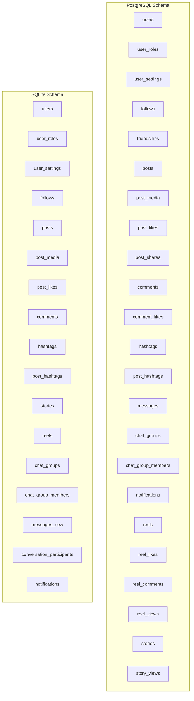
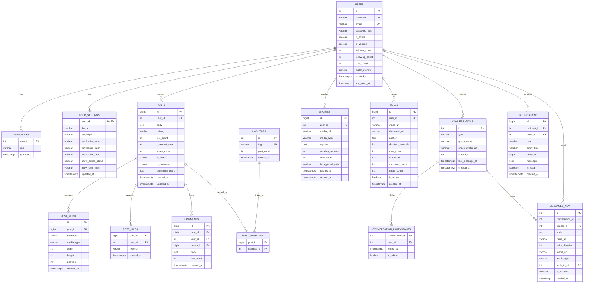
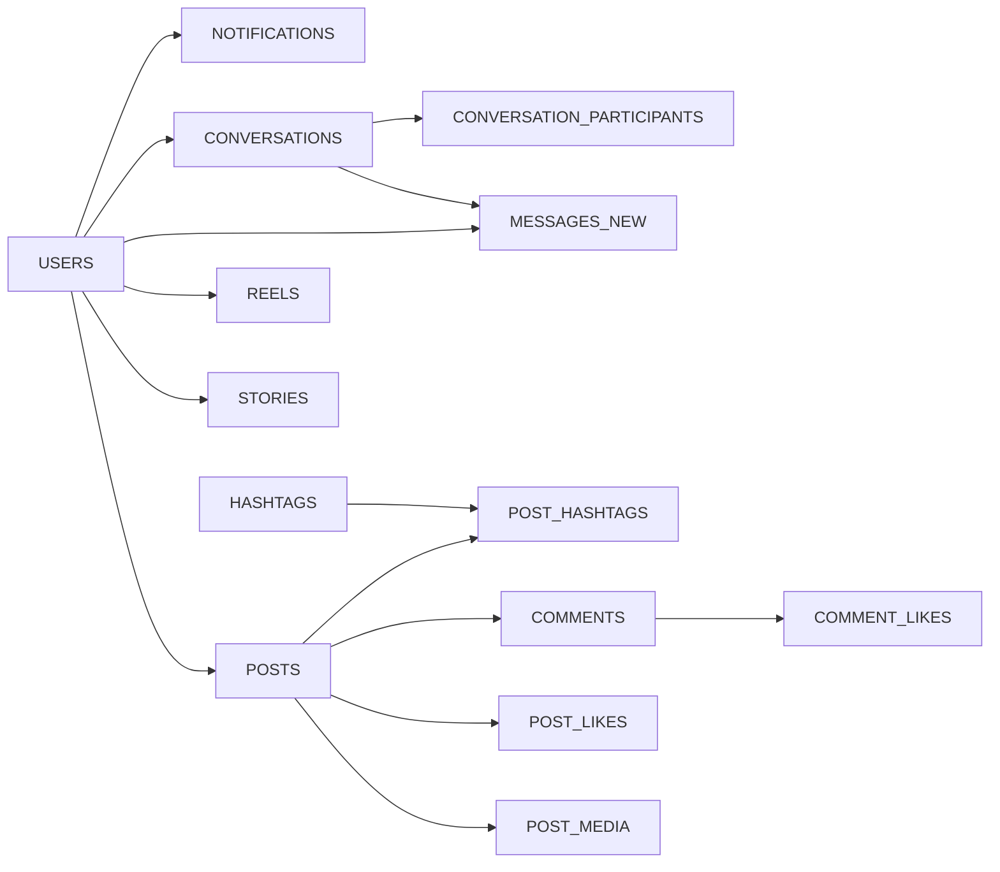

# Core Entity Models

<cite>
**Referenced Files in This Document**
- [001_schema.sql](file://migrations/001_schema.sql)
- [002_phase2.sql](file://migrations/002_phase2.sql)
- [schema_sqlite.sql](file://schema_sqlite.sql)
</cite>

## Table of Contents
1. [Introduction](#introduction)
2. [Project Structure](#project-structure)
3. [Core Components](#core-components)
4. [Architecture Overview](#architecture-overview)
5. [Detailed Component Analysis](#detailed-component-analysis)
6. [Dependency Analysis](#dependency-analysis)
7. [Performance Considerations](#performance-considerations)
8. [Troubleshooting Guide](#troubleshooting-guide)
9. [Conclusion](#conclusion)
10. [Appendices](#appendices)

## Introduction
This document describes VSocial’s core entity models with emphasis on Users, Posts, Stories, Messages, and Conversations. It consolidates schema definitions, constraints, indexes, and business rules from the PostgreSQL and SQLite migration files. It also outlines authentication and roles, post lifecycle and engagement, story expiration and highlights, messaging threading and delivery, validation rules, defaults, and common query patterns. The goal is to provide a practical yet precise guide for developers and product stakeholders.

## Project Structure
The core schema is defined in two migration sets:
- PostgreSQL schema with row-level security policies and advanced indexing
- SQLite-compatible schema for local/libSQL environments

Key domains relevant to this document:
- Users and authentication
- Posts and engagement
- Stories and highlights
- Reels
- Messaging and conversations
- Notifications
- Marketplace (contextual for media and listings)

**Diagram sources**
- [001_schema.sql:16-686](file://migrations/001_schema.sql#L16-L686)
- [schema_sqlite.sql:13-702](file://schema_sqlite.sql#L13-L702)

**Section sources**
- [001_schema.sql:1-686](file://migrations/001_schema.sql#L1-L686)
- [schema_sqlite.sql:1-702](file://schema_sqlite.sql#L1-L702)

## Core Components
This section summarizes each entity’s fields, constraints, defaults, and indexes. References to exact schema lines are included for traceability.

- Users
  - Fields: id, username, email, password_hash, display_name, avatar_url, cover_url, bio, location, website, education, workplace, phone, birth_date, gender, relationship_status, is_virtual, is_verified, is_active, follower_count, following_count, post_count, wallet_credits, privacy_level, created_at, last_seen_at
  - Constraints: Unique username and email; defaults for booleans and counters; privacy-aware fields
  - Indexes: username trigram, email, created_at
  - Roles: user_roles table with composite primary key (user_id, role)
  - Settings: user_settings per user with defaults and preferences
  - Blocks: user_blocks table for blocking relationships
  - Interests: user_interests and interest_categories for personalization
  - Follows: follows table with composite primary key
  - Friendships: friendships with status and timestamps
  - RLS: row-level security enabled; policies restrict access to self or related records

- Posts
  - Fields: id, user_id, body, privacy, like_count, comment_count, share_count, is_pinned, is_promoted, promotion_score, created_at, updated_at
  - Additional fields (phase 2): mood, privacy_level, scheduled_at, status, deleted_at
  - Constraints: foreign key to users; defaults for counts and flags
  - Indexes: user-created ordering; public visibility filtering; scheduled and status indexes
  - Engagement: post_likes, post_shares, comments, comment_likes
  - Media: post_media with position and metadata
  - Hashtags: hashtags and post_hashtags many-to-many
  - Mentions: post_mentions linking posts to users

- Stories
  - Fields: id, user_id, media_url, media_type, caption, duration_seconds, view_count, background_color, expires_at, created_at
  - Constraints: foreign key to users; default expiry of 24 hours
  - Indexes: user and active/expiry filters
  - Highlights: story_highlights and story_highlight_items for curated collections

- Reels
  - Fields: id, user_id, video_url, thumbnail_url, caption, duration_seconds, view_count, like_count, comment_count, share_count, is_active, created_at
  - Indexes: user ordering and popularity ranking
  - Views partitioned by date for scalability

- Messages and Conversations
  - Conversations: id, type, group_name, group_avatar_url, creator_id, last_message_at, created_at
  - Participants: conversation_participants with admin flag
  - Messages: messages_new with reply threading, media, voice, reactions, read receipts
  - Constraints: either DM or Group target via check constraint
  - Indexes: conversation-time ordering

- Notifications
  - Fields: id, recipient_id, actor_id, type, entity_type, entity_id, message, is_read, created_at
  - Index: recipient-read-created ordering

**Section sources**
- [001_schema.sql:16-482](file://migrations/001_schema.sql#L16-L482)
- [002_phase2.sql:12-126](file://migrations/002_phase2.sql#L12-L126)
- [schema_sqlite.sql:13-284](file://schema_sqlite.sql#L13-L284)

## Architecture Overview
The schema supports:
- Identity and permissions via users, user_roles, and RLS
- Content lifecycle via posts, comments, likes, shares, and media
- Storytelling with stories and highlights
- Social interactions with follows, friendships, and notifications
- Private/group messaging with conversations and participants
- Scalable analytics with views and engagement tables

**Diagram sources**
- [001_schema.sql:16-482](file://migrations/001_schema.sql#L16-L482)
- [schema_sqlite.sql:13-284](file://schema_sqlite.sql#L13-L284)

## Detailed Component Analysis

### Users
- Purpose: Identity, authentication, roles, settings, blocks, interests, and relationships
- Authentication data: password_hash stored; optional OAuth accounts in phase 2
- Role management: user_roles with composite primary key; defaults to “user”
- Profile fields: display_name, avatar_url, cover_url, bio, contact info, demographics, privacy_level
- Activity counters: follower/following/post counts; wallet_credits
- Privacy and verification: is_verified, is_active, privacy_level
- Relationships: follows, friendships, notifications, posts, messages, settings, blocks, interests
- RLS: policy allows users to access their own records

Typical queries:
- Fetch user profile by username/email
- List followers/following
- Update profile settings and privacy
- Assign/remove roles

**Section sources**
- [001_schema.sql:16-80](file://migrations/001_schema.sql#L16-L80)
- [002_phase2.sql:31-43](file://migrations/002_phase2.sql#L31-L43)
- [schema_sqlite.sql:13-48](file://schema_sqlite.sql#L13-L48)

### Posts
- Purpose: User-generated content with lifecycle and engagement
- Lifecycle: draft/scheduled/published/deleted states; scheduled_at and status fields added in phase 2
- Engagement: like_count, comment_count, share_count; post_likes, post_shares, comments, comment_likes
- Media: post_media with type, dimensions, and position
- Hashtags: many-to-many via post_hashtags; hashtag creation and counting
- Mentions: post_mentions linking to tagged users
- Privacy: privacy and privacy_level fields; public index optimized for feed retrieval

Common patterns:
- Feed aggregation by user_feeds (not detailed here)
- Retrieve posts by user with created_at ordering
- Search posts by hashtag or mentions
- Publish/update/delete posts

**Section sources**
- [001_schema.sql:114-204](file://migrations/001_schema.sql#L114-L204)
- [002_phase2.sql:12-18](file://migrations/002_phase2.sql#L12-L18)
- [schema_sqlite.sql:107-184](file://schema_sqlite.sql#L107-L184)

### Stories
- Purpose: Time-bound ephemeral content with expiration
- Expiration: expires_at defaults to 24 hours; active stories filtered by expiry
- Highlights: story_highlights and story_highlight_items for curated collections
- Views: story_views tracks who viewed which story

Common patterns:
- Create story with media and caption
- List active stories for a user/feed
- Build highlights from multiple stories
- Track view counts and viewer identity

**Section sources**
- [001_schema.sql:210-231](file://migrations/001_schema.sql#L210-L231)
- [002_phase2.sql:76-95](file://migrations/002_phase2.sql#L76-L95)
- [schema_sqlite.sql:197-208](file://schema_sqlite.sql#L197-L208)

### Reels
- Purpose: Short-form video content with engagement metrics
- Fields: video_url, thumbnail_url, caption, duration, counts for views/likes/comments/shares
- Indexes: user ordering and popularity ranking
- Views: partitioned by viewed_at for performance

Common patterns:
- Upload and process video with metadata
- Retrieve popular reels
- Track views and engagement

**Section sources**
- [001_schema.sql:237-276](file://migrations/001_schema.sql#L237-L276)
- [schema_sqlite.sql:215-228](file://schema_sqlite.sql#L215-L228)

### Messages and Conversations
- Conversations: support DMs and group chats; includes creator and last_message_at
- Participants: conversation_participants with admin flag and join timestamps
- Messages: threaded replies, media, voice, reactions, read receipts
- Constraints: mutual exclusivity between DM and group targets
- Indexes: conversation-time ordering for efficient pagination

Common patterns:
- Create conversation and add participants
- Send/read messages with reactions
- Archive conversations (phase 2)
- Manage group membership and roles

**Section sources**
- [001_schema.sql:282-332](file://migrations/001_schema.sql#L282-L332)
- [schema_sqlite.sql:235-283](file://schema_sqlite.sql#L235-L283)
- [002_phase2.sql](file://migrations/002_phase2.sql#L125)

### Notifications
- Purpose: Event-driven alerts for user actions
- Fields: recipient, actor, type, entity reference, read status, timestamp
- Index: recipient, read status, created_at for efficient retrieval

Common patterns:
- Insert notification on like/comment/follow
- Mark as read and paginate unread notifications

**Section sources**
- [001_schema.sql:338-350](file://migrations/001_schema.sql#L338-L350)
- [schema_sqlite.sql:289-299](file://schema_sqlite.sql#L289-L299)

## Dependency Analysis
- Foreign keys define strong referential integrity across entities
- Composite primary keys enforce uniqueness for relationships (e.g., follows, friendships, post_hashtags)
- Indexes optimize frequent queries (user feeds, comments, messages, notifications)
- Partitioning (reel_views) improves write scalability for time-series data
- RLS policies protect sensitive data at the row level

**Diagram sources**
- [001_schema.sql:16-482](file://migrations/001_schema.sql#L16-L482)
- [schema_sqlite.sql:13-284](file://schema_sqlite.sql#L13-L284)

**Section sources**
- [001_schema.sql:16-482](file://migrations/001_schema.sql#L16-L482)
- [schema_sqlite.sql:13-284](file://schema_sqlite.sql#L13-L284)

## Performance Considerations
- Indexes
  - Users: username trigram, email, created_at
  - Posts: user-created ordering, public visibility filter, scheduled/status
  - Comments: post-time ordering
  - Messages: DM and group indexes
  - Stories: user-expiry and active-expiry
  - Reels: user and popularity
  - Notifications: recipient-read-created
- Partitioning
  - Reel views partitioned by viewed_at to manage growth
- Defaults and counters
  - Pre-initialized counters reduce runtime updates and improve read performance
- RLS overhead
  - Policies add minimal checks; ensure app sets current user context

[No sources needed since this section provides general guidance]

## Troubleshooting Guide
- Authentication failures
  - Verify password_hash presence and correct hashing strategy
  - Check email tokens and OAuth accounts for external sign-in
- Authorization errors
  - Confirm RLS policies and current user context setting
  - Ensure user_roles grants appropriate permissions
- Missing data in feeds
  - Validate user_feeds entries and scoring logic
  - Confirm post status and privacy settings
- Message delivery issues
  - Check conversation membership and message constraints
  - Verify read receipts and reactions tables
- Story visibility problems
  - Confirm expires_at and active story filters
  - Review highlight item associations

**Section sources**
- [001_schema.sql:601-642](file://migrations/001_schema.sql#L601-L642)
- [002_phase2.sql:20-43](file://migrations/002_phase2.sql#L20-L43)
- [schema_sqlite.sql:57-68](file://schema_sqlite.sql#L57-L68)

## Conclusion
The VSocial schema establishes robust foundations for identity, content, stories, reels, and messaging. It balances flexibility with performance via targeted indexes, partitioning, and defaults. RLS and role management provide strong privacy controls. The phase 2 additions expand capabilities for scheduling, OAuth, highlights, and group features. Together, these models enable scalable social experiences with clear relationships and optimized query paths.

[No sources needed since this section summarizes without analyzing specific files]

## Appendices

### Validation Rules and Defaults
- Users
  - Required: username, email, password_hash
  - Defaults: is_virtual=false, is_verified=false, is_active=true, follower/following/post counts=0, wallet_credits=0.00
- Posts
  - Required: body, user_id
  - Defaults: privacy="public", counts=0, pinned/promoted=false, promotion_score=0.0
  - Phase 2: mood, privacy_level="public", status="published"
- Stories
  - Required: media_url, user_id
  - Defaults: media_type="image", duration_seconds=5, view_count=0, expires_at=24 hours
- Reels
  - Required: video_url, user_id
  - Defaults: is_active=true, counts=0
- Messages
  - Required: body or media_url or voice_url
  - Constraint: exactly one of DM or Group target
  - Defaults: is_deleted=false
- Conversations
  - Defaults: type="dm"

**Section sources**
- [001_schema.sql:16-482](file://migrations/001_schema.sql#L16-L482)
- [002_phase2.sql:12-126](file://migrations/002_phase2.sql#L12-L126)
- [schema_sqlite.sql:13-284](file://schema_sqlite.sql#L13-L284)

### Common Query Patterns
- Get a user’s posts ordered by recency
  - Filter by user_id and created_at DESC
- Fetch public posts for feed
  - Filter by privacy='public' and created_at DESC
- Count likes per post
  - Aggregate post_likes grouped by post_id
- List comments for a post
  - Filter by post_id and order by created_at
- Find stories for a user that are still active
  - Filter by user_id and expires_at > now
- Retrieve recent messages in a conversation
  - Filter by conversation_id and order by created_at DESC
- Notifications unread count
  - Filter by recipient_id, is_read=false, order by created_at DESC

**Section sources**
- [001_schema.sql:129-131](file://migrations/001_schema.sql#L129-L131)
- [001_schema.sql](file://migrations/001_schema.sql#L171)
- [001_schema.sql:223-224](file://migrations/001_schema.sql#L223-L224)
- [001_schema.sql:323-324](file://migrations/001_schema.sql#L323-L324)
- [schema_sqlite.sql](file://schema_sqlite.sql#L126)
- [schema_sqlite.sql](file://schema_sqlite.sql#L167)
- [schema_sqlite.sql](file://schema_sqlite.sql#L209)
- [schema_sqlite.sql](file://schema_sqlite.sql#L267)
- [schema_sqlite.sql](file://schema_sqlite.sql#L299)