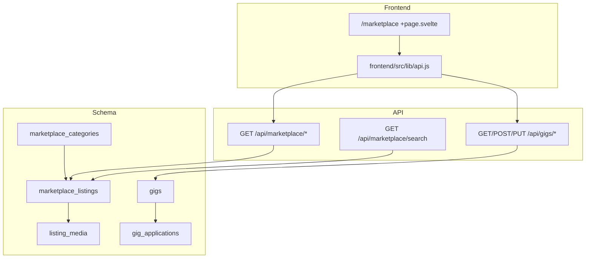
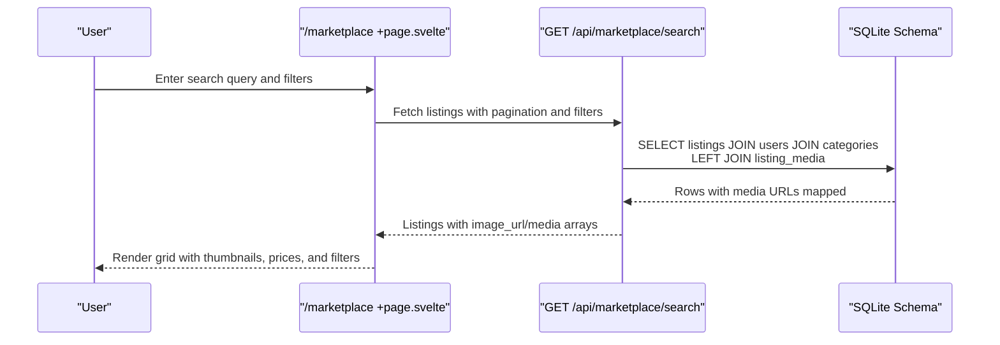
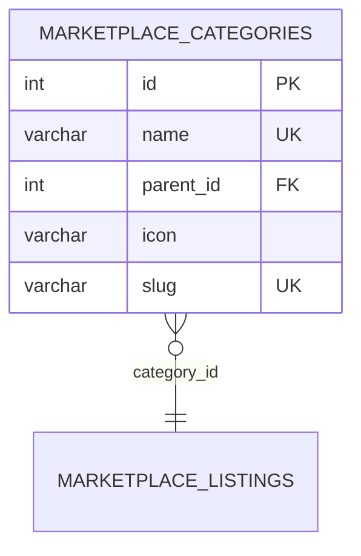
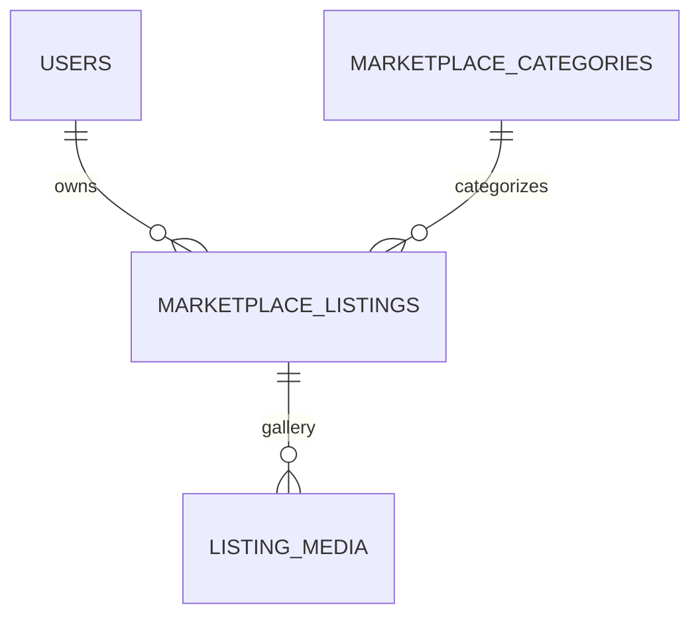
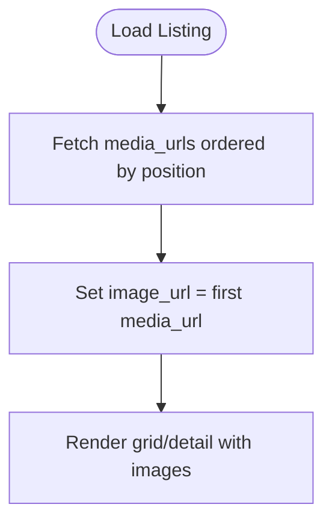
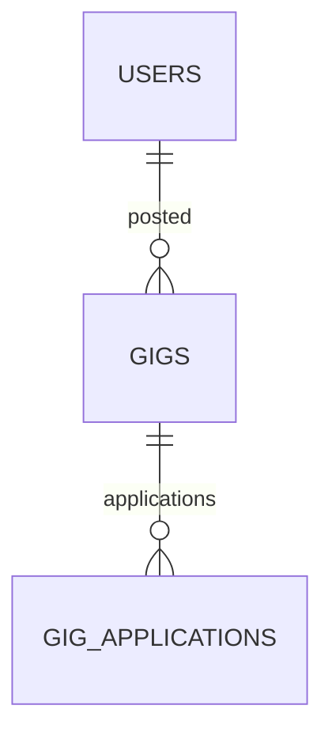
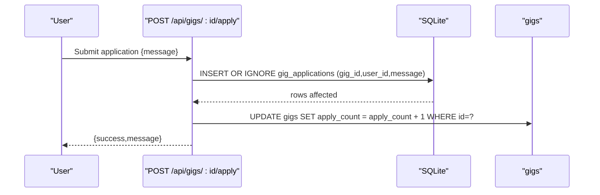
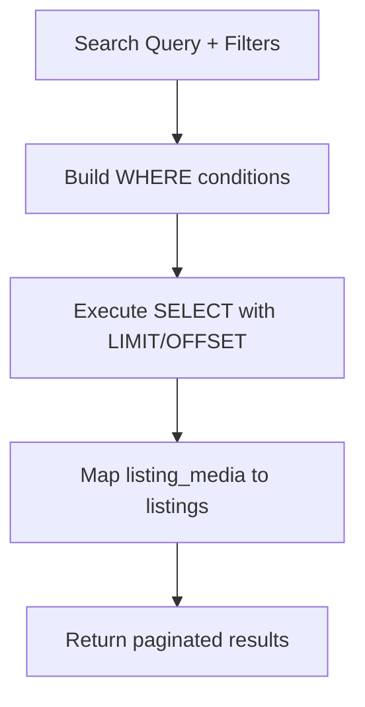
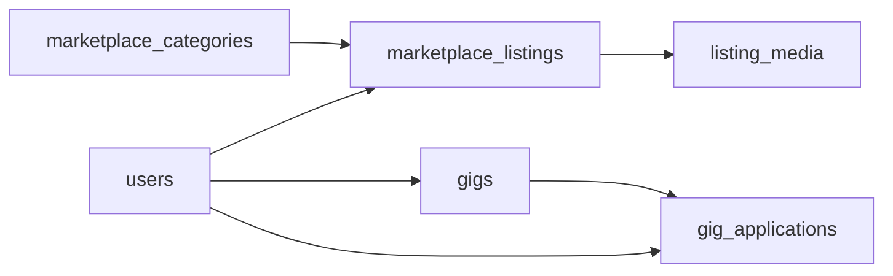

# Marketplace & Gigs Model

<cite>
**Referenced Files in This Document**
- [schema_sqlite.sql](file://schema_sqlite.sql)
- [001_schema.sql](file://migrations/001_schema.sql)
- [002_phase2.sql](file://migrations/002_phase2.sql)
- [marketplace +server.js](file://frontend/src/routes/api/marketplace/[...path]+server.js)
- [gigs +server.js](file://frontend/src/routes/api/gigs/[...path]+server.js)
- [marketplace +page.svelte](file://frontend/src/routes/marketplace/+page.svelte)
- [api.js](file://frontend/src/lib/api.js)
</cite>

## Table of Contents
1. [Introduction](#introduction)
2. [Project Structure](#project-structure)
3. [Core Components](#core-components)
4. [Architecture Overview](#architecture-overview)
5. [Detailed Component Analysis](#detailed-component-analysis)
6. [Dependency Analysis](#dependency-analysis)
7. [Performance Considerations](#performance-considerations)
8. [Troubleshooting Guide](#troubleshooting-guide)
9. [Conclusion](#conclusion)

## Introduction
This document describes the Marketplace and Freelance Gigs model implemented in the repository. It covers:
- Marketplace categories hierarchy and categorization
- Marketplace listings with user ownership, category linkage, pricing, condition, location, status, views, and expiration
- Listing media gallery support
- Freelance gigs with title, description, category/type, pricing range, application lifecycle, and expiration
- Gig applications workflow for bid management and candidate screening
- Business rules for moderation, pricing validation, application status tracking, and integration touchpoints with payments/wallets
- Search and filtering capabilities, category management, and marketplace analytics

## Project Structure
The Marketplace domain spans schema definitions, API endpoints, and frontend UI:
- Schema: marketplace_categories, marketplace_listings, listing_media, gigs, gig_applications
- API: marketplace endpoints for listing retrieval, search, and media association; gigs endpoints for feed, CRUD, and applications
- UI: marketplace browsing, filters, and creation flow

**Diagram sources**
- [schema_sqlite.sql:306-402](file://schema_sqlite.sql#L306-L402)
- [marketplace +server.js:34-60](file://frontend/src/routes/api/marketplace/[...path]+server.js#L34-L60)
- [gigs +server.js:8-48](file://frontend/src/routes/api/gigs/[...path]+server.js#L8-L48)
- [marketplace +page.svelte:33-810](file://frontend/src/routes/marketplace/+page.svelte#L33-L810)
- [api.js:230-238](file://frontend/src/lib/api.js#L230-L238)

**Section sources**
- [schema_sqlite.sql:306-402](file://schema_sqlite.sql#L306-L402)
- [marketplace +server.js:34-60](file://frontend/src/routes/api/marketplace/[...path]+server.js#L34-L60)
- [gigs +server.js:8-48](file://frontend/src/routes/api/gigs/[...path]+server.js#L8-L48)
- [marketplace +page.svelte:33-810](file://frontend/src/routes/marketplace/+page.svelte#L33-L810)
- [api.js:230-238](file://frontend/src/lib/api.js#L230-L238)

## Core Components
- marketplace_categories: hierarchical taxonomy with parent-child relations, icons, and slugs
- marketplace_listings: product/service listings owned by users, linked to categories, with pricing, condition, location, status, view counts, flags, and expiration
- listing_media: per-listing image/video gallery with ordering
- gigs: freelance service offerings with category/type, price range, tags, status, application counters, and expiration
- gig_applications: candidate applications with message, status, and uniqueness per gig-user pair

Key schema highlights:
- marketplace_categories: self-referencing parent_id, unique name/slug
- marketplace_listings: foreign keys to users and categories; default status, timestamps, and expiration
- listing_media: ordered media per listing
- gigs: flexible pricing range and tags; status and expiration
- gig_applications: unique constraint prevents duplicate applications

**Section sources**
- [schema_sqlite.sql:306-338](file://schema_sqlite.sql#L306-L338)
- [schema_sqlite.sql:377-402](file://schema_sqlite.sql#L377-L402)
- [001_schema.sql:356-402](file://migrations/001_schema.sql#L356-L402)
- [002_phase2.sql:266-272](file://migrations/002_phase2.sql#L266-L272)

## Architecture Overview
High-level flow:
- Users browse marketplace listings and gigs via the frontend
- Frontend calls API endpoints under /api/marketplace and /api/gigs
- APIs query the SQLite schema and return structured data
- Moderation and reporting are supported by separate tables

**Diagram sources**
- [marketplace +page.svelte:33-810](file://frontend/src/routes/marketplace/+page.svelte#L33-L810)
- [marketplace +server.js:34-60](file://frontend/src/routes/api/marketplace/[...path]+server.js#L34-L60)
- [schema_sqlite.sql:314-338](file://schema_sqlite.sql#L314-L338)

## Detailed Component Analysis

### Marketplace Categories
- Hierarchical taxonomy with optional parent_id linking to the same table
- Unique constraints on name and slug enable safe navigation and SEO-friendly URLs
- Slugs support category-aware routing and filtering

**Diagram sources**
- [schema_sqlite.sql:306-312](file://schema_sqlite.sql#L306-L312)

**Section sources**
- [schema_sqlite.sql:306-312](file://schema_sqlite.sql#L306-L312)
- [001_schema.sql:356-362](file://migrations/001_schema.sql#L356-L362)

### Marketplace Listings
- Owned by users; linked to categories; supports pricing, currency, condition, location
- Status field controls visibility; default active
- View count tracking; flagged flagging with reason and fraud scoring
- Expiration handled via expires_at timestamp
- Media gallery via listing_media table with position ordering

**Diagram sources**
- [schema_sqlite.sql:314-338](file://schema_sqlite.sql#L314-L338)

**Section sources**
- [schema_sqlite.sql:314-338](file://schema_sqlite.sql#L314-L338)
- [001_schema.sql:364-392](file://migrations/001_schema.sql#L364-L392)

### Listing Media Gallery
- One listing can have multiple media entries
- Position determines order; first media is exposed as image_url for quick previews
- Used by marketplace listing detail and grid views

**Diagram sources**
- [marketplace +server.js:40-54](file://frontend/src/routes/api/marketplace/[...path]+server.js#L40-L54)
- [schema_sqlite.sql:333-338](file://schema_sqlite.sql#L333-L338)

**Section sources**
- [marketplace +server.js:40-54](file://frontend/src/routes/api/marketplace/[...path]+server.js#L40-L54)
- [schema_sqlite.sql:333-338](file://schema_sqlite.sql#L333-L338)

### Gigs System
- Freelance service offerings with category and type
- Flexible pricing range (min/max) and optional tags
- Status tracking (open/closed) and expiration
- Application counter maintained for visibility

**Diagram sources**
- [schema_sqlite.sql:377-392](file://schema_sqlite.sql#L377-L392)

**Section sources**
- [schema_sqlite.sql:377-392](file://schema_sqlite.sql#L377-L392)
- [001_schema.sql:377-392](file://migrations/001_schema.sql#L377-L392)

### Gig Applications Workflow
- Candidates apply to open gigs; uniqueness prevents duplicate applications
- Applications include a message and status (default pending)
- Sellers can view applications for their own gigs
- Application insertion increments the gig’s apply_count

**Diagram sources**
- [gigs +server.js:58-78](file://frontend/src/routes/api/gigs/[...path]+server.js#L58-L78)
- [schema_sqlite.sql:394-402](file://schema_sqlite.sql#L394-L402)

**Section sources**
- [gigs +server.js:58-78](file://frontend/src/routes/api/gigs/[...path]+server.js#L58-L78)
- [schema_sqlite.sql:394-402](file://schema_sqlite.sql#L394-L402)

### Search and Filtering
- Marketplace search: full-text-like LIKE queries on title/description
- Pagination: page and limit parameters with enforced bounds
- Marketplace filters in UI: category, price range, and sorting (recent, price asc, price desc)
- Gigs feed: category, type, and text search (title/description/tags)

**Diagram sources**
- [marketplace +server.js:34-60](file://frontend/src/routes/api/marketplace/[...path]+server.js#L34-L60)
- [marketplace +page.svelte:50-64](file://frontend/src/routes/marketplace/+page.svelte#L50-L64)

**Section sources**
- [marketplace +server.js:34-60](file://frontend/src/routes/api/marketplace/[...path]+server.js#L34-L60)
- [marketplace +page.svelte:50-64](file://frontend/src/routes/marketplace/+page.svelte#L50-L64)
- [gigs +server.js:37-47](file://frontend/src/routes/api/gigs/[...path]+server.js#L37-L47)

### Business Rules and Validation
- Pricing validation
  - marketplace_listings.price stored as numeric with two decimals
  - gigs.price_min/price_max stored as real; ensure min <= max in client-side logic
- Application lifecycle
  - Applications accepted only for open gigs
  - Candidate cannot apply to their own gig
  - Unique application per gig-user pair
- Moderation and safety
  - flagged flag and flag_reason for listings
  - fraud_score for risk scoring
  - reports table exists for moderation queue
- Expiration
  - marketplace_listings.expires_at set to 30 days from creation
  - gigs.expires_at stored as text; enforce validity in API/UI
- Payments and wallets
  - Wallet and transaction tables exist for credits/balance
  - Payment integration would leverage these tables; not implemented in referenced endpoints

**Section sources**
- [schema_sqlite.sql:314-338](file://schema_sqlite.sql#L314-L338)
- [schema_sqlite.sql:377-402](file://schema_sqlite.sql#L377-L402)
- [gigs +server.js:60-68](file://frontend/src/routes/api/gigs/[...path]+server.js#L60-L68)
- [001_schema.sql:377-381](file://migrations/001_schema.sql#L377-L381)
- [002_phase2.sql:266-272](file://migrations/002_phase2.sql#L266-L272)

### API Surface and Usage
- Marketplace
  - GET /api/marketplace/search?q=&page=&limit=
  - GET /api/marketplace/:id
  - GET /api/marketplace (catalog with pagination)
- Gigs
  - GET /api/gigs/:id
  - GET /api/gigs?category=&type=&q=&page=&limit=
  - POST /api/gigs (create)
  - POST /api/gigs/:id/apply (apply)
  - PUT /api/gigs/:id (update)
  - GET /api/gigs/my (own gigs)
  - GET /api/gigs/:id/applications (applications for own gigs)

Frontend helpers:
- marketplace.search(query, params)
- marketplace.categories()
- gigs.feed(params), gigs.create(data), gigs.apply(id, data)

**Section sources**
- [marketplace +server.js:34-60](file://frontend/src/routes/api/marketplace/[...path]+server.js#L34-L60)
- [gigs +server.js:8-48](file://frontend/src/routes/api/gigs/[...path]+server.js#L8-L48)
- [gigs +server.js:50-80](file://frontend/src/routes/api/gigs/[...path]+server.js#L50-L80)
- [api.js:230-238](file://frontend/src/lib/api.js#L230-L238)
- [api.js:307-319](file://frontend/src/lib/api.js#L307-L319)

## Dependency Analysis
- marketplace_listings depends on users (owner) and marketplace_categories (optional)
- listing_media depends on marketplace_listings
- gigs depends on users; gig_applications depends on both users and gigs
- UI depends on API endpoints for data and actions

**Diagram sources**
- [schema_sqlite.sql:314-402](file://schema_sqlite.sql#L314-L402)

**Section sources**
- [schema_sqlite.sql:314-402](file://schema_sqlite.sql#L314-L402)

## Performance Considerations
- Indexes
  - marketplace_listings: category/status created_at, user_id, flagged
  - listing_offers: seller_id/status, listing_id/status
- Pagination limits
  - Enforced bounds prevent heavy queries
- Media mapping
  - Single pass to collect media per listing reduces round-trips
- Recommendations
  - Add GIN index on listing text fields for full-text search if needed
  - Consider materialized aggregates for popular category counts
  - Cache hot listings for homepage feeds

[No sources needed since this section provides general guidance]

## Troubleshooting Guide
- Listing not found
  - Verify ID and status; ensure listing is active and not expired
- Application errors
  - Gig must be open; user cannot apply to their own gig; unique constraint prevents duplicates
- Search yields no results
  - Confirm query length and filters; check pagination parameters
- Media missing
  - Ensure listing has at least one listing_media record; image_url falls back to first media

**Section sources**
- [marketplace +server.js:45-55](file://frontend/src/routes/api/marketplace/[...path]+server.js#L45-L55)
- [gigs +server.js:60-68](file://frontend/src/routes/api/gigs/[...path]+server.js#L60-L68)

## Conclusion
The Marketplace and Gigs subsystem provides a robust foundation for e-commerce and freelance services:
- Clear taxonomy and listings with rich metadata and media
- Practical moderation flags and reporting infrastructure
- Flexible gigs with application management and pricing ranges
- Well-defined API endpoints and UI integration for search, filters, and creation
- Room for enhancements such as advanced search indexing, payment integrations, and analytics dashboards