# Messaging & Conversation Model

<cite>
**Referenced Files in This Document**
- [schema_sqlite.sql](file://schema_sqlite.sql)
- [001_schema.sql](file://migrations/001_schema.sql)
- [002_phase2.sql](file://migrations/002_phase2.sql)
- [messages +server.js](file://frontend/src/routes/api/messages/[...path]+server.js)
- [db.js](file://frontend/src/lib/server/db.js)
- [auth.js](file://frontend/src/lib/server/auth.js)
- [+page.svelte](file://frontend/src/routes/messages/+page.svelte)
- [rtc.js](file://frontend/src/lib/rtc.js)
</cite>

## Table of Contents
1. [Introduction](#introduction)
2. [Project Structure](#project-structure)
3. [Core Components](#core-components)
4. [Architecture Overview](#architecture-overview)
5. [Detailed Component Analysis](#detailed-component-analysis)
6. [Dependency Analysis](#dependency-analysis)
7. [Performance Considerations](#performance-considerations)
8. [Troubleshooting Guide](#troubleshooting-guide)
9. [Conclusion](#conclusion)

## Introduction
This document describes the messaging and conversation system in Vsocial, focusing on the domain model and runtime behavior for conversations, participants, messages, reactions, and read receipts. It explains how direct messages and group conversations are modeled, how participants join and manage permissions, how messages are stored with rich content and threading, and how read receipts and reactions are tracked. It also covers lifecycle management, indexing strategies for efficient retrieval, privacy and row-level security, and integration with real-time communication patterns such as WebRTC signaling.

## Project Structure
The messaging domain spans two primary schema sources:
- A pure SQLite-compatible schema used by the frontend runtime and development stack
- A PostgreSQL migration schema used for production environments

The frontend API routes implement the server-side logic for conversations, message retrieval, sending, reactions, and read receipts. The client-side SvelteKit page integrates with the API and WebRTC for real-time audio/video.

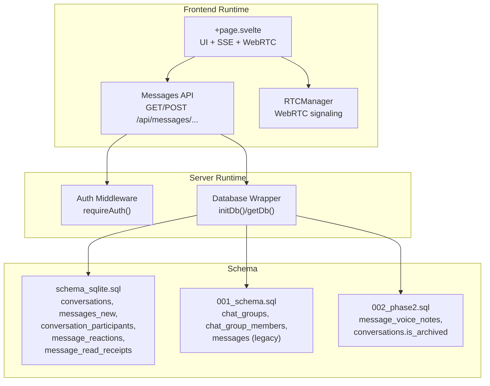

**Diagram sources**
- [schema_sqlite.sql:235-283](file://schema_sqlite.sql#L235-L283)
- [001_schema.sql:282-321](file://migrations/001_schema.sql#L282-L321)
- [002_phase2.sql:116-126](file://migrations/002_phase2.sql#L116-L126)
- [messages +server.js:1-240](file://frontend/src/routes/api/messages/[...path]+server.js#L1-L240)
- [db.js:117-198](file://frontend/src/lib/server/db.js#L117-L198)
- [auth.js:15-44](file://frontend/src/lib/server/auth.js#L15-L44)

**Section sources**
- [schema_sqlite.sql:235-283](file://schema_sqlite.sql#L235-L283)
- [001_schema.sql:282-321](file://migrations/001_schema.sql#L282-L321)
- [002_phase2.sql:116-126](file://migrations/002_phase2.sql#L116-L126)
- [messages +server.js:1-240](file://frontend/src/routes/api/messages/[...path]+server.js#L1-L240)
- [db.js:117-198](file://frontend/src/lib/server/db.js#L117-L198)
- [auth.js:15-44](file://frontend/src/lib/server/auth.js#L15-L44)

## Core Components
- conversations: Stores DM and group conversations with type classification, creator tracking, and last message timestamp.
- conversation_participants: Many-to-many relationship between users and conversations with join timestamps and admin flags.
- messages_new: Rich content messages with text, media, voice, reply threading, and deletion handling.
- message_reactions: Emoji reactions per message with uniqueness per user-message.
- message_read_receipts: Tracks per-user read positions per conversation.

These tables are indexed for efficient retrieval and grouped by domain in the schema files.

**Section sources**
- [schema_sqlite.sql:235-283](file://schema_sqlite.sql#L235-L283)

## Architecture Overview
The messaging architecture combines a REST-like API with real-time capabilities:
- REST endpoints for CRUD operations on conversations and messages
- SSE-driven real-time updates for new messages and WebRTC signals
- WebRTC manager for audio/video calls with SDP/ICE signaling

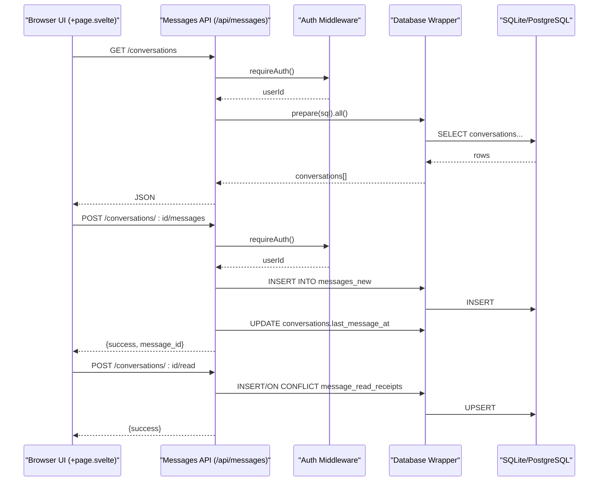

**Diagram sources**
- [messages +server.js:24-147](file://frontend/src/routes/api/messages/[...path]+server.js#L24-L147)
- [messages +server.js:149-239](file://frontend/src/routes/api/messages/[...path]+server.js#L149-L239)
- [auth.js:15-44](file://frontend/src/lib/server/auth.js#L15-L44)
- [db.js:31-112](file://frontend/src/lib/server/db.js#L31-L112)

## Detailed Component Analysis

### Conversations and Participants
- Type classification: conversations.type distinguishes DM and group.
- Group metadata: group_name, group_avatar_url, creator_id.
- Lifecycle: created implicitly for DMs; group conversations are managed separately in the PostgreSQL schema.
- Last message tracking: conversations.last_message_at is updated on new messages.
- Participants: conversation_participants links users to conversations with joined_at and is_admin flags.

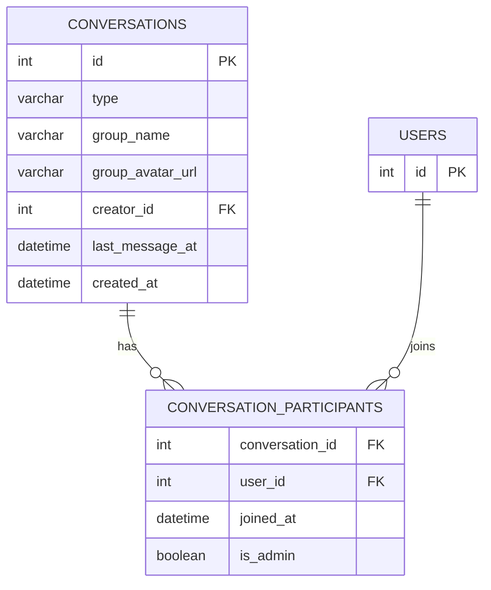

**Diagram sources**
- [schema_sqlite.sql:235-251](file://schema_sqlite.sql#L235-L251)

**Section sources**
- [schema_sqlite.sql:235-251](file://schema_sqlite.sql#L235-L251)
- [messages +server.js:8-22](file://frontend/src/routes/api/messages/[...path]+server.js#L8-L22)

### Messages and Rich Content
- Rich content: body, media_url/media_type, voice_url/voice_duration.
- Threading: reply_to_id supports nested replies.
- Deletion: is_deleted toggles visibility.
- Ordering: messages_new.created_at DESC per conversation.

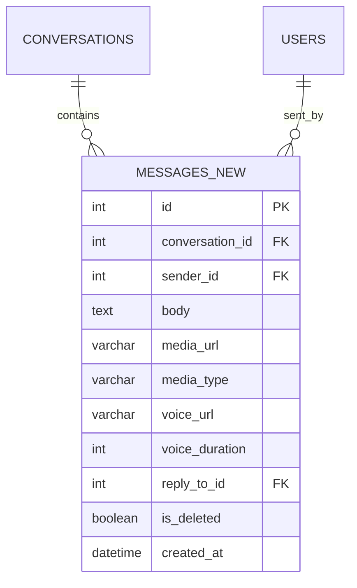

**Diagram sources**
- [schema_sqlite.sql:254-266](file://schema_sqlite.sql#L254-L266)

**Section sources**
- [schema_sqlite.sql:254-266](file://schema_sqlite.sql#L254-L266)
- [messages +server.js:155-179](file://frontend/src/routes/api/messages/[...path]+server.js#L155-L179)

### Reactions and Read Receipts
- Reactions: message_reactions records emoji per user per message; uniqueness enforced by composite primary key.
- Read receipts: message_read_receipts tracks per-user read positions per conversation; upsert semantics maintain latest read.

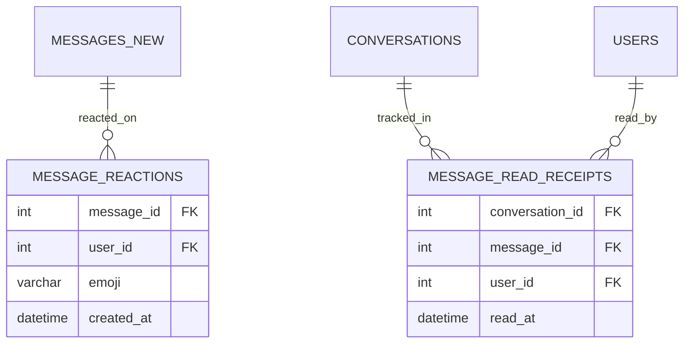

**Diagram sources**
- [schema_sqlite.sql:269-283](file://schema_sqlite.sql#L269-L283)

**Section sources**
- [schema_sqlite.sql:269-283](file://schema_sqlite.sql#L269-L283)
- [messages +server.js:206-218](file://frontend/src/routes/api/messages/[...path]+server.js#L206-L218)
- [messages +server.js:188-204](file://frontend/src/routes/api/messages/[...path]+server.js#L188-L204)

### Real-Time Communication Patterns
- SSE-driven updates: The client listens for new messages and RTC signals via notifications store.
- WebRTC signaling: RTCManager handles SDP offers/answers and ICE candidates; signals are sent via POST /api/rtc/signal.

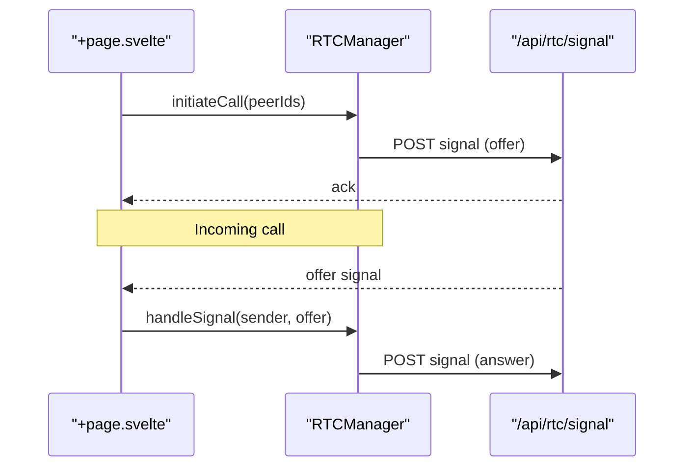

**Diagram sources**
- [+page.svelte:403-481](file://frontend/src/routes/messages/+page.svelte#L403-L481)
- [rtc.js:78-177](file://frontend/src/lib/rtc.js#L78-L177)

**Section sources**
- [+page.svelte:72-126](file://frontend/src/routes/messages/+page.svelte#L72-L126)
- [+page.svelte:403-522](file://frontend/src/routes/messages/+page.svelte#L403-L522)
- [rtc.js:78-177](file://frontend/src/lib/rtc.js#L78-L177)

### API Workflows

#### Get Conversations
- Endpoint: GET /api/messages/conversations
- Behavior: Lists conversations for the authenticated user, enriching with peer info for DMs and group metadata for groups.

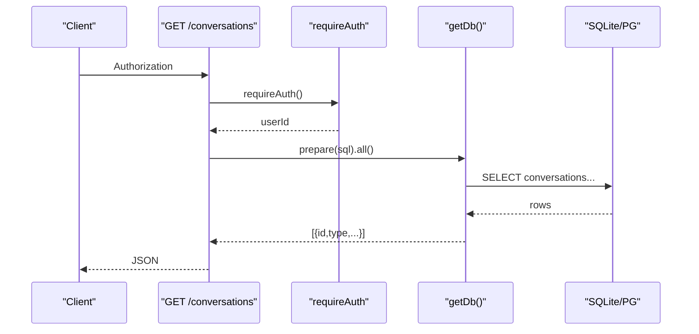

**Diagram sources**
- [messages +server.js:24-65](file://frontend/src/routes/api/messages/[...path]+server.js#L24-L65)
- [auth.js:15-44](file://frontend/src/lib/server/auth.js#L15-L44)
- [db.js:31-112](file://frontend/src/lib/server/db.js#L31-L112)

#### Send Message
- Endpoint: POST /api/messages/conversations/:convId/messages
- Behavior: Validates participant, inserts message, updates conversation last_message_at, and emits notifications.

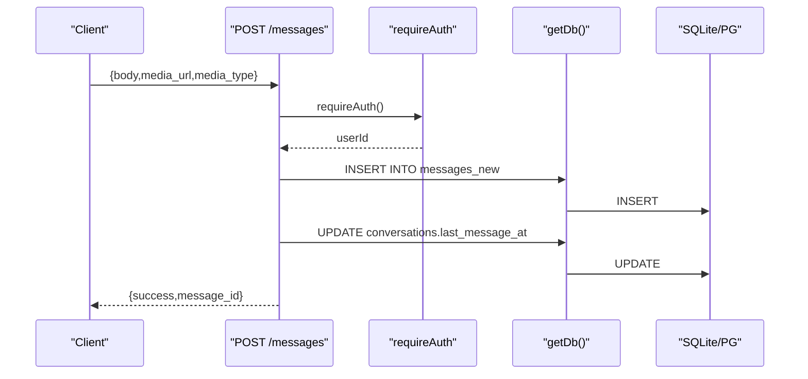

**Diagram sources**
- [messages +server.js:149-179](file://frontend/src/routes/api/messages/[...path]+server.js#L149-L179)
- [auth.js:15-44](file://frontend/src/lib/server/auth.js#L15-L44)
- [db.js:31-112](file://frontend/src/lib/server/db.js#L31-L112)

#### Mark Read
- Endpoint: POST /api/messages/conversations/:convId/read
- Behavior: Upserts message_read_receipts with latest read message_id and read_at timestamp.

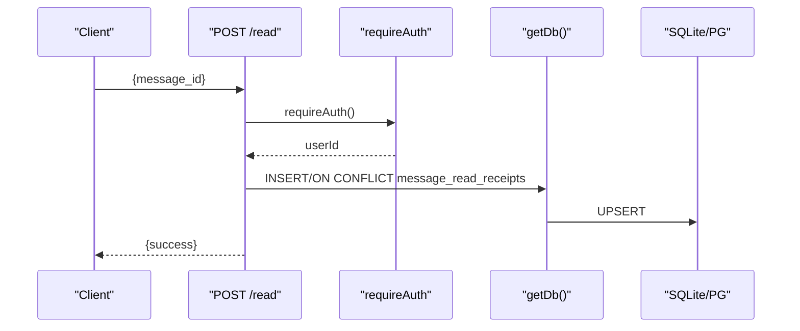

**Diagram sources**
- [messages +server.js:188-204](file://frontend/src/routes/api/messages/[...path]+server.js#L188-L204)
- [auth.js:15-44](file://frontend/src/lib/server/auth.js#L15-L44)
- [db.js:31-112](file://frontend/src/lib/server/db.js#L31-L112)

#### React to Message
- Endpoint: POST /api/messages/:msgId/reactions
- Behavior: Inserts emoji reaction for the authenticated user; duplicates are ignored by constraint.

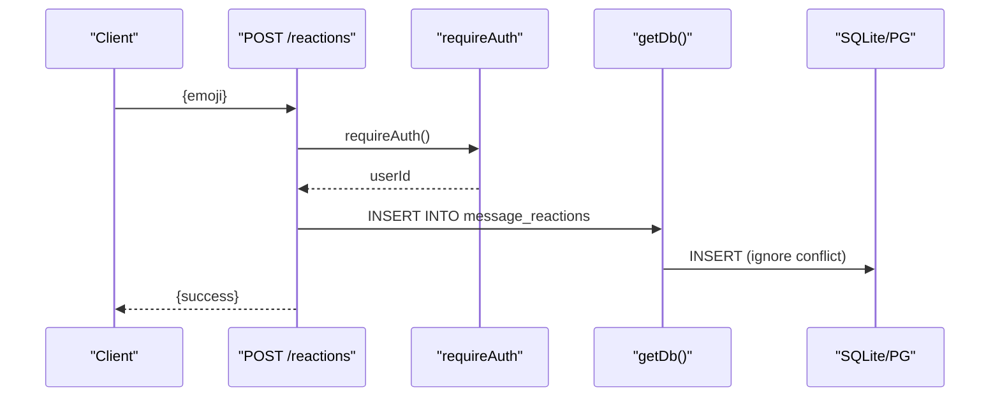

**Diagram sources**
- [messages +server.js:206-218](file://frontend/src/routes/api/messages/[...path]+server.js#L206-L218)
- [auth.js:15-44](file://frontend/src/lib/server/auth.js#L15-L44)
- [db.js:31-112](file://frontend/src/lib/server/db.js#L31-L112)

## Dependency Analysis
- Frontend API depends on authentication middleware and database wrapper.
- Database wrapper abstracts driver differences (@libsql/client or better-sqlite3).
- Messaging tables depend on users and conversations; reactions and read receipts depend on messages and users.

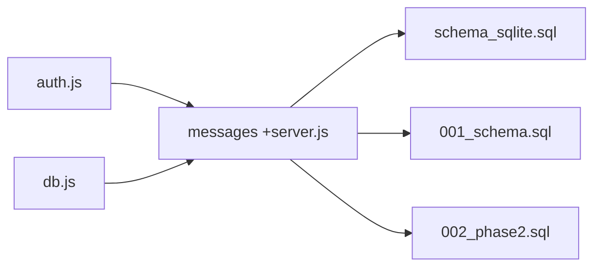

**Diagram sources**
- [auth.js:15-44](file://frontend/src/lib/server/auth.js#L15-L44)
- [db.js:31-112](file://frontend/src/lib/server/db.js#L31-L112)
- [messages +server.js:1-240](file://frontend/src/routes/api/messages/[...path]+server.js#L1-L240)
- [schema_sqlite.sql:235-283](file://schema_sqlite.sql#L235-L283)
- [001_schema.sql:282-321](file://migrations/001_schema.sql#L282-L321)
- [002_phase2.sql:116-126](file://migrations/002_phase2.sql#L116-L126)

**Section sources**
- [auth.js:15-44](file://frontend/src/lib/server/auth.js#L15-L44)
- [db.js:31-112](file://frontend/src/lib/server/db.js#L31-L112)
- [messages +server.js:1-240](file://frontend/src/routes/api/messages/[...path]+server.js#L1-L240)

## Performance Considerations
- Indexing for message retrieval:
  - messages_new(conversation_id, created_at DESC) ensures efficient pagination and reverse chronological ordering.
  - conversation_participants(user_id) supports quick membership checks.
- Cursor-based pagination:
  - The API uses before/after cursors to avoid OFFSET and improve scalability.
- Upsert semantics:
  - Read receipts use INSERT ... ON CONFLICT to minimize write contention.
- Driver tuning:
  - The database wrapper sets pragmas for WAL, foreign keys, and cache sizes to optimize SQLite performance.

**Section sources**
- [schema_sqlite.sql:267](file://schema_sqlite.sql#L267)
- [schema_sqlite.sql:252](file://schema_sqlite.sql#L252)
- [messages +server.js:80-144](file://frontend/src/routes/api/messages/[...path]+server.js#L80-L144)
- [messages +server.js:197-201](file://frontend/src/routes/api/messages/[...path]+server.js#L197-L201)
- [db.js:124-153](file://frontend/src/lib/server/db.js#L124-L153)

## Troubleshooting Guide
- Authentication failures:
  - requireAuth throws 401 if token is missing, invalid, or expired; sessions are validated against user_sessions.
- Authorization errors:
  - Accessing conversations requires membership; the API checks conversation_participants and returns 403 otherwise.
- Database connectivity:
  - The wrapper supports both @libsql/client and better-sqlite3; initialization logs indicate which driver is active.
- WebRTC signaling:
  - RTCManager buffers ICE candidates until remote description is set; ICE restart attempts are retried with exponential backoff.

**Section sources**
- [auth.js:15-44](file://frontend/src/lib/server/auth.js#L15-L44)
- [messages +server.js:77-78](file://frontend/src/routes/api/messages/[...path]+server.js#L77-L78)
- [db.js:117-167](file://frontend/src/lib/server/db.js#L117-L167)
- [rtc.js:138-167](file://frontend/src/lib/rtc.js#L138-L167)

## Conclusion
The messaging system in Vsocial is built around a clear relational model with rich content support, robust participant management, and efficient indexing for scalable retrieval. The API enforces authentication and authorization, while the client integrates real-time updates and WebRTC signaling. Privacy is reinforced through row-level security policies in the PostgreSQL schema and strict access checks in the API. Together, these components deliver a modern, secure, and performant messaging experience.