# Notifications & System Model

<cite>
**Referenced Files in This Document**
- [schema_sqlite.sql](file://schema_sqlite.sql)
- [001_schema.sql](file://migrations/001_schema.sql)
- [002_phase2.sql](file://migrations/002_phase2.sql)
- [notifications +page.svelte](file://frontend/src/routes/notifications/+page.svelte)
- [notifications +server.js](file://frontend/src/routes/api/notifications/[...path]+server.js)
- [email.js](file://frontend/src/lib/server/email.js)
- [oauth.js](file://frontend/src/lib/server/oauth.js)
- [admin settings +page.svelte](file://frontend/src/routes/admin/settings/+page.svelte)
</cite>

## Table of Contents
1. [Introduction](#introduction)
2. [Project Structure](#project-structure)
3. [Core Components](#core-components)
4. [Architecture Overview](#architecture-overview)
5. [Detailed Component Analysis](#detailed-component-analysis)
6. [Dependency Analysis](#dependency-analysis)
7. [Performance Considerations](#performance-considerations)
8. [Troubleshooting Guide](#troubleshooting-guide)
9. [Conclusion](#conclusion)

## Introduction
This document provides comprehensive documentation for the Notifications and System domain of the platform, focusing on:
- Notifications table with recipient tracking, actor references, type categorization, entity linking, and read status management
- System settings for global configuration management with key-value pairs and feature toggles
- Email tokens system for authentication and verification workflows
- OAuth accounts for third-party authentication integration
- User blocking and snoozing for privacy management
- Web push subscriptions for browser notification support
- Sponsored posts for advertising system

It also covers indexing strategies for efficient notification delivery, privacy controls, spam prevention, and system configuration management.

## Project Structure
The Notifications and System model spans database schema definitions, migration scripts, and frontend API/UI components:
- Database schema and indexes are defined in SQL files
- Frontend routes expose APIs for notifications and settings
- Server-side modules implement email token lifecycle and OAuth flows
- UI components manage notification grouping, filtering, and read/unread states

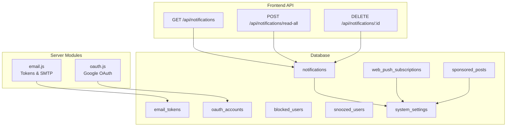

**Diagram sources**
- [schema_sqlite.sql:289-299](file://schema_sqlite.sql#L289-L299)
- [schema_sqlite.sql:468-491](file://schema_sqlite.sql#L468-L491)
- [schema_sqlite.sql:497-510](file://schema_sqlite.sql#L497-L510)
- [schema_sqlite.sql:623-631](file://schema_sqlite.sql#L623-L631)
- [schema_sqlite.sql:633-653](file://schema_sqlite.sql#L633-L653)
- [schema_sqlite.sql:459-462](file://schema_sqlite.sql#L459-L462)
- [notifications +server.js:8-47](file://frontend/src/routes/api/notifications/[...path]+server.js#L8-L47)
- [email.js:32-58](file://frontend/src/lib/server/email.js#L32-L58)
- [oauth.js:45-92](file://frontend/src/lib/server/oauth.js#L45-L92)

**Section sources**
- [schema_sqlite.sql:289-299](file://schema_sqlite.sql#L289-L299)
- [schema_sqlite.sql:459-462](file://schema_sqlite.sql#L459-L462)
- [schema_sqlite.sql:468-491](file://schema_sqlite.sql#L468-L491)
- [schema_sqlite.sql:497-510](file://schema_sqlite.sql#L497-L510)
- [schema_sqlite.sql:623-631](file://schema_sqlite.sql#L623-L631)
- [schema_sqlite.sql:633-653](file://schema_sqlite.sql#L633-L653)
- [notifications +server.js:8-47](file://frontend/src/routes/api/notifications/[...path]+server.js#L8-L47)
- [email.js:32-58](file://frontend/src/lib/server/email.js#L32-L58)
- [oauth.js:45-92](file://frontend/src/lib/server/oauth.js#L45-L92)

## Core Components
This section documents each core component with its schema, relationships, and operational behavior.

### Notifications
- Purpose: Store user-centric activity alerts with actor attribution, type categorization, optional entity linkage, and read status.
- Key attributes:
  - recipient_id: user who receives the notification
  - actor_id: user who triggered the notification
  - type: categorization (e.g., like, comment, follow, mention, system)
  - entity_type/entity_id: optional linkage to a post/comment/etc.
  - message: human-readable text
  - is_read: boolean indicating read status
  - created_at: timestamp
- Indexing strategy:
  - Composite index on (recipient_id, is_read, created_at DESC) ensures efficient retrieval and pagination by newest unread-first ordering.
- Frontend behavior:
  - Fetch paginated notifications with optional unread filter and cursor-based pagination
  - Mark individual or all notifications as read
  - Delete specific notifications
  - Group multiple recent notifications of the same type within a time window for UX

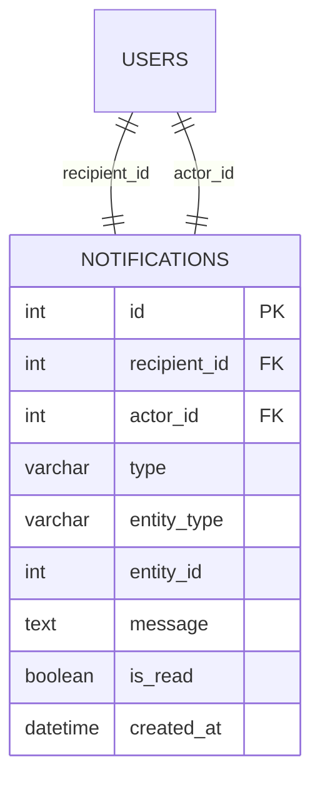

**Diagram sources**
- [schema_sqlite.sql:289-299](file://schema_sqlite.sql#L289-L299)

**Section sources**
- [schema_sqlite.sql:289-299](file://schema_sqlite.sql#L289-L299)
- [001_schema.sql:338-350](file://migrations/001_schema.sql#L338-L350)
- [002_phase2.sql:17-18](file://migrations/002_phase2.sql#L17-L18)
- [notifications +server.js:8-47](file://frontend/src/routes/api/notifications/[...path]+server.js#L8-L47)
- [notifications +page.svelte:12-58](file://frontend/src/routes/notifications/+page.svelte#L12-L58)

### System Settings
- Purpose: Global configuration key-value store with feature toggles and operational flags.
- Key attributes:
  - key: unique identifier for the setting
  - value: textual representation of the setting
- Seed data includes site name, registration policy, upload limits, feature flags, maintenance mode, OAuth enablement, and SMTP configuration.
- Operational usage:
  - Email transport initialization reads SMTP host/port/user/pass
  - OAuth providers read client credentials from settings
  - UI exposes admin settings editing

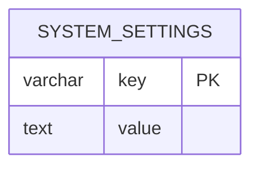

**Diagram sources**
- [schema_sqlite.sql:459-462](file://schema_sqlite.sql#L459-L462)
- [001_schema.sql:558-563](file://migrations/001_schema.sql#L558-L563)
- [001_schema.sql:676-683](file://migrations/001_schema.sql#L676-L683)

**Section sources**
- [schema_sqlite.sql:459-462](file://schema_sqlite.sql#L459-L462)
- [001_schema.sql:558-563](file://migrations/001_schema.sql#L558-L563)
- [001_schema.sql:676-683](file://migrations/001_schema.sql#L676-L683)
- [email.js:9-26](file://frontend/src/lib/server/email.js#L9-L26)
- [oauth.js:47-48](file://frontend/src/lib/server/oauth.js#L47-L48)
- [admin settings +page.svelte:15-30](file://frontend/src/routes/admin/settings/+page.svelte#L15-L30)

### Email Tokens
- Purpose: Secure, single-use tokens for email verification and password reset workflows.
- Key attributes:
  - user_id: associated user
  - token: unique token value
  - type: token category (e.g., verify)
  - used: boolean flag to prevent reuse
  - created_at/expires_at: lifecycle timestamps
- Lifecycle:
  - Creation generates a secure token with expiry (~15 minutes)
  - Validation checks existence, unused status, and expiration
  - Consumption marks token as used after successful operation
- SMTP integration:
  - Transport initialized from system settings
  - Emails rendered with templated HTML and sent via configured SMTP

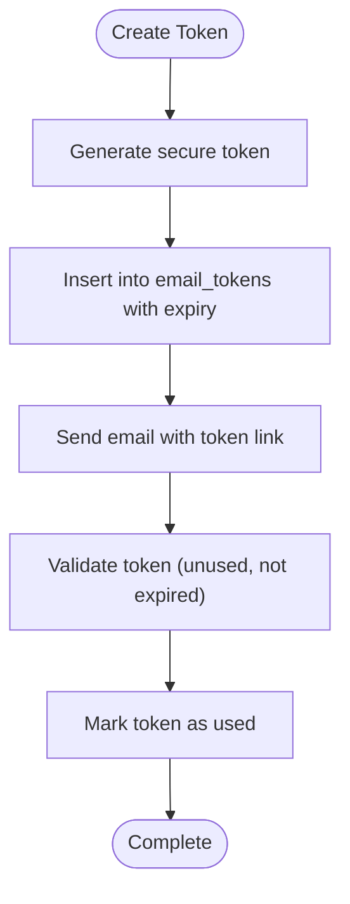

**Diagram sources**
- [schema_sqlite.sql:468-477](file://schema_sqlite.sql#L468-L477)
- [email.js:32-58](file://frontend/src/lib/server/email.js#L32-L58)

**Section sources**
- [schema_sqlite.sql:468-477](file://schema_sqlite.sql#L468-L477)
- [email.js:32-58](file://frontend/src/lib/server/email.js#L32-L58)
- [email.js:88-100](file://frontend/src/lib/server/email.js#L88-L100)

### OAuth Accounts
- Purpose: Third-party authentication integration (e.g., Google).
- Key attributes:
  - provider/provider_uid: external identity
  - user_id: local account association
  - tokens: access and refresh tokens
  - profile fields: email, display name, avatar
- Flow:
  - Redirect to provider authorization URL
  - Exchange authorization code for tokens
  - Fetch user profile
  - Link to existing user by email or create new user
  - Persist OAuth account record
  - Issue session token

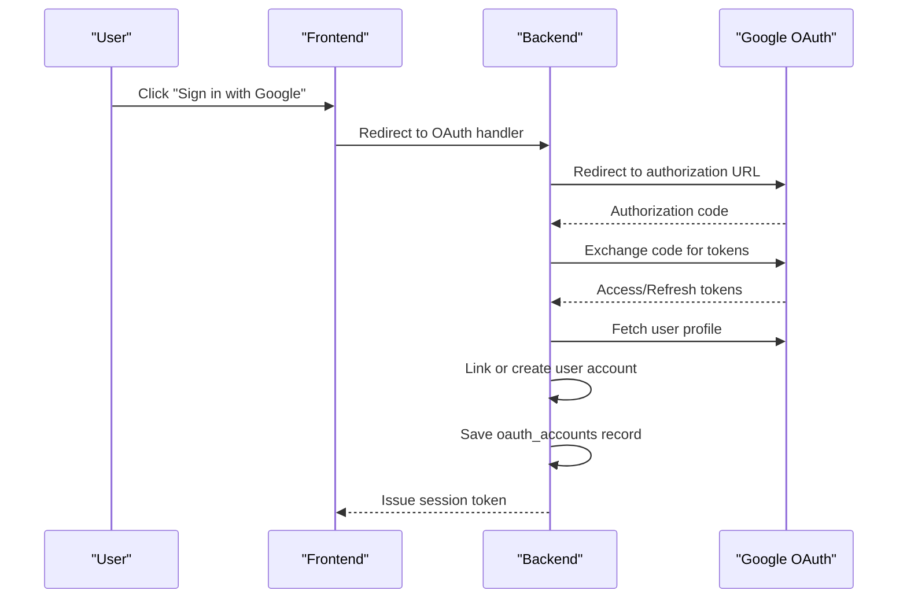

**Diagram sources**
- [schema_sqlite.sql:479-491](file://schema_sqlite.sql#L479-L491)
- [oauth.js:45-92](file://frontend/src/lib/server/oauth.js#L45-L92)

**Section sources**
- [schema_sqlite.sql:479-491](file://schema_sqlite.sql#L479-L491)
- [oauth.js:45-92](file://frontend/src/lib/server/oauth.js#L45-L92)

### Blocked Users
- Purpose: Privacy control allowing users to block others.
- Key attributes:
  - blocker_id/blocked_id: pair of users
  - created_at: timestamp
- Indexing:
  - Separate indexes on blocker_id and blocked_id for efficient queries

**Section sources**
- [schema_sqlite.sql:497-502](file://schema_sqlite.sql#L497-L502)
- [002_phase2.sql:61-62](file://migrations/002_phase2.sql#L61-L62)

### Snoozed Users
- Purpose: Temporary suppression of notifications from specific users.
- Key attributes:
  - snoozer_id/snoozed_id: pair of users
  - snoozed_until: expiration timestamp
  - created_at: timestamp

**Section sources**
- [schema_sqlite.sql:504-510](file://schema_sqlite.sql#L504-L510)
- [002_phase2.sql:64-70](file://migrations/002_phase2.sql#L64-L70)

### Web Push Subscriptions
- Purpose: Browser push notification subscription records for web clients.
- Key attributes:
  - user_id: subscriber
  - endpoint/p256dh_key/auth_key: VAPID/WebPush parameters
  - user_agent: client identification
  - created_at: timestamp
- Indexing:
  - Index on user_id for efficient lookup

**Section sources**
- [schema_sqlite.sql:623-631](file://schema_sqlite.sql#L623-L631)
- [002_phase2.sql:208-217](file://migrations/002_phase2.sql#L208-L217)

### Sponsored Posts
- Purpose: Advertising system with targeting, budgeting, and analytics.
- Key attributes:
  - advertiser_id/post_id/title/body/media_url/cta_url
  - targeting: age range, gender, interests
  - budget/spent/impressions/clicks/status
  - timing: starts_at/ends_at
  - created_at/updated_at
- Indexing:
  - Active campaigns index on (status, starts_at, ends_at)

**Section sources**
- [schema_sqlite.sql:633-653](file://schema_sqlite.sql#L633-L653)
- [002_phase2.sql:223-244](file://migrations/002_phase2.sql#L223-L244)

## Architecture Overview
The Notifications and System domain integrates database storage, frontend APIs, and server-side modules:

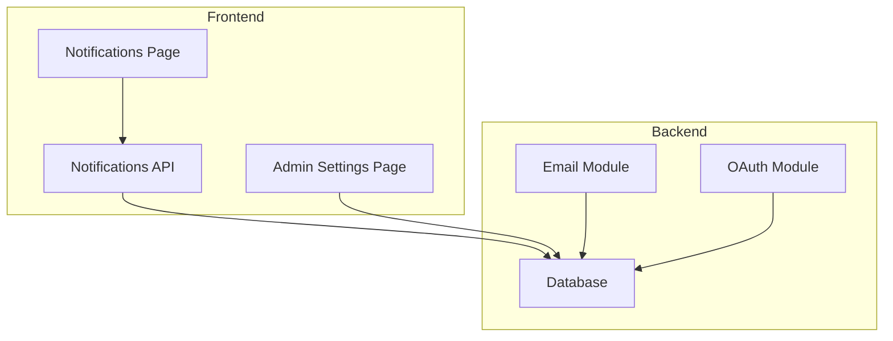

**Diagram sources**
- [notifications +page.svelte:1-322](file://frontend/src/routes/notifications/+page.svelte#L1-L322)
- [notifications +server.js:1-75](file://frontend/src/routes/api/notifications/[...path]+server.js#L1-L75)
- [admin settings +page.svelte:1-122](file://frontend/src/routes/admin/settings/+page.svelte#L1-L122)
- [email.js:1-100](file://frontend/src/lib/server/email.js#L1-L100)
- [oauth.js:1-92](file://frontend/src/lib/server/oauth.js#L1-L92)

## Detailed Component Analysis

### Notifications API Workflow
The Notifications API supports listing, marking as read, and deleting notifications with cursor-based pagination and unread filtering.

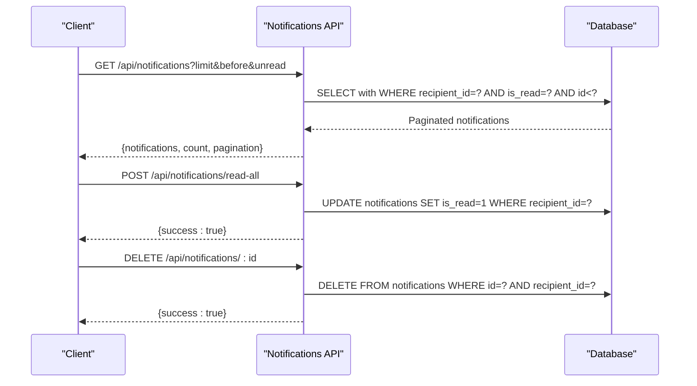

**Diagram sources**
- [notifications +server.js:8-47](file://frontend/src/routes/api/notifications/[...path]+server.js#L8-L47)
- [notifications +server.js:49-74](file://frontend/src/routes/api/notifications/[...path]+server.js#L49-L74)

**Section sources**
- [notifications +server.js:8-47](file://frontend/src/routes/api/notifications/[...path]+server.js#L8-L47)
- [notifications +server.js:49-74](file://frontend/src/routes/api/notifications/[...path]+server.js#L49-L74)
- [notifications +page.svelte:112-131](file://frontend/src/routes/notifications/+page.svelte#L112-L131)

### Email Token Lifecycle
End-to-end flow for creating, validating, consuming, and sending emails with tokens.

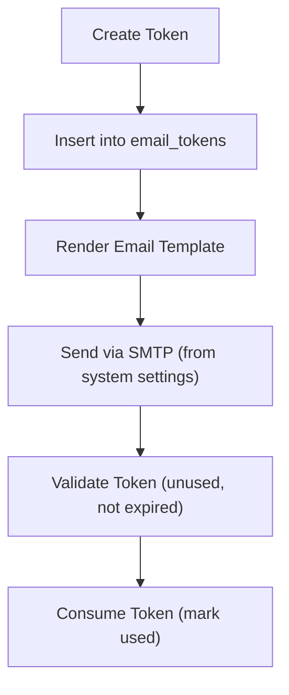

**Diagram sources**
- [email.js:32-58](file://frontend/src/lib/server/email.js#L32-L58)
- [email.js:88-100](file://frontend/src/lib/server/email.js#L88-L100)
- [schema_sqlite.sql:468-477](file://schema_sqlite.sql#L468-L477)

**Section sources**
- [email.js:32-58](file://frontend/src/lib/server/email.js#L32-L58)
- [email.js:88-100](file://frontend/src/lib/server/email.js#L88-L100)
- [schema_sqlite.sql:468-477](file://schema_sqlite.sql#L468-L477)

### OAuth Account Integration
Google OAuth flow including authorization, token exchange, profile retrieval, and account linking.

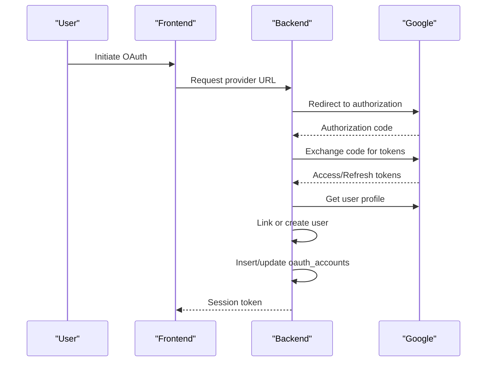

**Diagram sources**
- [oauth.js:45-92](file://frontend/src/lib/server/oauth.js#L45-L92)
- [schema_sqlite.sql:479-491](file://schema_sqlite.sql#L479-L491)

**Section sources**
- [oauth.js:45-92](file://frontend/src/lib/server/oauth.js#L45-L92)
- [schema_sqlite.sql:479-491](file://schema_sqlite.sql#L479-L491)

### Privacy Controls: Blocking and Snoozing
Blocking prevents notifications and interactions; snoozing suppresses notifications until a specified time.

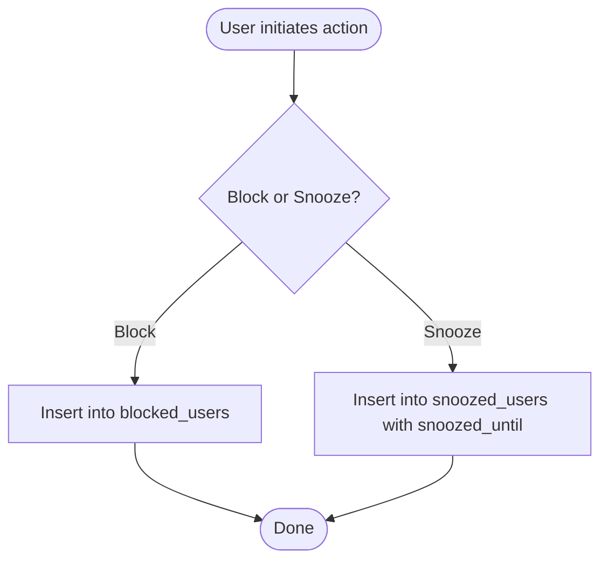

**Diagram sources**
- [schema_sqlite.sql:497-510](file://schema_sqlite.sql#L497-L510)
- [002_phase2.sql:55-70](file://migrations/002_phase2.sql#L55-L70)

**Section sources**
- [schema_sqlite.sql:497-510](file://schema_sqlite.sql#L497-L510)
- [002_phase2.sql:55-70](file://migrations/002_phase2.sql#L55-L70)

### Web Push Subscriptions Management
Browser push subscription storage and indexing for efficient user lookups.

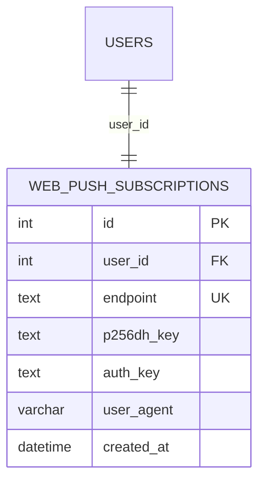

**Diagram sources**
- [schema_sqlite.sql:623-631](file://schema_sqlite.sql#L623-L631)

**Section sources**
- [schema_sqlite.sql:623-631](file://schema_sqlite.sql#L623-L631)
- [002_phase2.sql:208-217](file://migrations/002_phase2.sql#L208-L217)

### Sponsored Posts Ad Server
Advertising records with targeting, budgeting, and performance metrics.

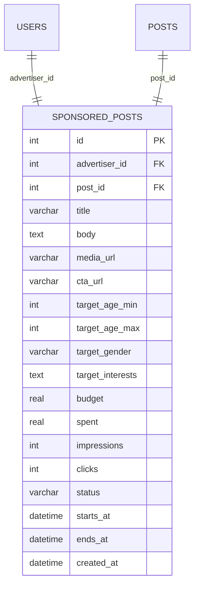

**Diagram sources**
- [schema_sqlite.sql:633-653](file://schema_sqlite.sql#L633-L653)

**Section sources**
- [schema_sqlite.sql:633-653](file://schema_sqlite.sql#L633-L653)
- [002_phase2.sql:223-244](file://migrations/002_phase2.sql#L223-L244)

## Dependency Analysis
Key dependencies and relationships across components:

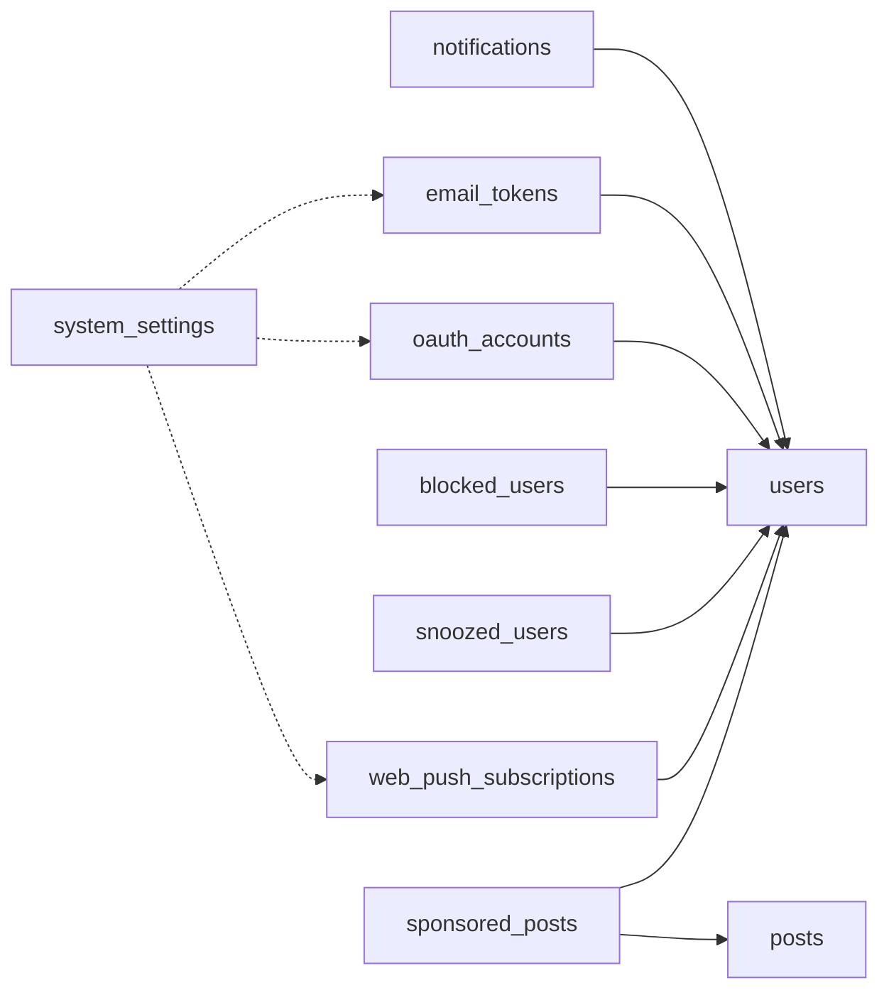

**Diagram sources**
- [schema_sqlite.sql:289-299](file://schema_sqlite.sql#L289-L299)
- [schema_sqlite.sql:468-491](file://schema_sqlite.sql#L468-L491)
- [schema_sqlite.sql:497-510](file://schema_sqlite.sql#L497-L510)
- [schema_sqlite.sql:623-653](file://schema_sqlite.sql#L623-L653)

**Section sources**
- [schema_sqlite.sql:289-299](file://schema_sqlite.sql#L289-L299)
- [schema_sqlite.sql:468-491](file://schema_sqlite.sql#L468-L491)
- [schema_sqlite.sql:497-510](file://schema_sqlite.sql#L497-L510)
- [schema_sqlite.sql:623-653](file://schema_sqlite.sql#L623-L653)

## Performance Considerations
- Notification retrieval:
  - Use the composite index on (recipient_id, is_read, created_at DESC) to efficiently paginate unread-first lists
  - Cursor-based pagination minimizes offset scans
- Email tokens:
  - Index on (token, used) accelerates validation and consumption
  - Short expiry reduces stale token overhead
- OAuth accounts:
  - Index on user_id enables fast lookup for session binding
- Push subscriptions:
  - Index on user_id supports quick per-user subscription retrieval
- Sponsored posts:
  - Index on (status, starts_at, ends_at) optimizes active campaign queries
- System settings:
  - Keep frequently accessed keys cached at startup to avoid repeated DB reads

[No sources needed since this section provides general guidance]

## Troubleshooting Guide
- Notifications not appearing:
  - Verify recipient_id matches current user
  - Confirm unread filter is not hiding results
  - Check cursor pagination parameters
- Cannot mark notifications as read:
  - Ensure request is authenticated and recipient_id matches
  - Confirm notification exists and belongs to the user
- Email verification failures:
  - Confirm SMTP settings are present in system_settings
  - Check token validity and expiration
  - Validate email transport initialization
- OAuth sign-in errors:
  - Verify provider client credentials in system_settings
  - Ensure callback URLs match configuration
  - Check token exchange and profile retrieval responses
- Blocking/Snoozing not effective:
  - Confirm entries exist in blocked_users/snoozed_users
  - Validate snoozed_until has not passed

**Section sources**
- [notifications +server.js:8-47](file://frontend/src/routes/api/notifications/[...path]+server.js#L8-L47)
- [notifications +server.js:49-74](file://frontend/src/routes/api/notifications/[...path]+server.js#L49-L74)
- [email.js:9-26](file://frontend/src/lib/server/email.js#L9-L26)
- [email.js:41-58](file://frontend/src/lib/server/email.js#L41-L58)
- [oauth.js:47-50](file://frontend/src/lib/server/oauth.js#L47-L50)
- [schema_sqlite.sql:497-510](file://schema_sqlite.sql#L497-L510)
- [schema_sqlite.sql:504-510](file://schema_sqlite.sql#L504-L510)

## Conclusion
The Notifications and System model provides a robust foundation for user communication, privacy controls, authentication, and advertising. Proper indexing, modular server-side logic, and frontend UX patterns ensure scalable and maintainable operations across the platform.