# Posts & Content Model

<cite>
**Referenced Files in This Document**
- [schema_sqlite.sql](file://schema_sqlite.sql)
- [001_schema.sql](file://migrations/001_schema.sql)
- [002_phase2.sql](file://migrations/002_phase2.sql)
- [+server.js (Posts API)](file://frontend/src/routes/api/posts/[...path]/+server.js)
- [+server.js (Feed API)](file://frontend/src/routes/api/feed/[...path]/+server.js)
- [api.js](file://frontend/src/lib/api.js)
- [db.js](file://frontend/src/lib/server/db.js)
- [auth.js](file://frontend/src/lib/server/auth.js)
</cite>

## Table of Contents
1. [Introduction](#introduction)
2. [Project Structure](#project-structure)
3. [Core Components](#core-components)
4. [Architecture Overview](#architecture-overview)
5. [Detailed Component Analysis](#detailed-component-analysis)
6. [Dependency Analysis](#dependency-analysis)
7. [Performance Considerations](#performance-considerations)
8. [Troubleshooting Guide](#troubleshooting-guide)
9. [Conclusion](#conclusion)

## Introduction
This document describes the Posts and related content model in VSocial, focusing on the core entities and their relationships:
- posts: main content container with engagement metrics, privacy, scheduling, and status
- post_media: multi-media attachment records
- post_likes and post_reactions: user engagement tracking
- comments: hierarchical comment system with parent-child relationships and soft-deletion
- comment_reactions: per-comment reactions
- saved_posts: user content preservation

It also covers indexing strategies, foreign key relationships, cascading operations, and query patterns for timeline construction and engagement analytics.

## Project Structure
The posts model spans schema definitions, migrations, and server-side API handlers:
- Schema and indexes are defined in the schema files
- Additional columns and indexes are introduced via phase 2 migration
- Server APIs implement CRUD, reactions, comments, and timeline queries

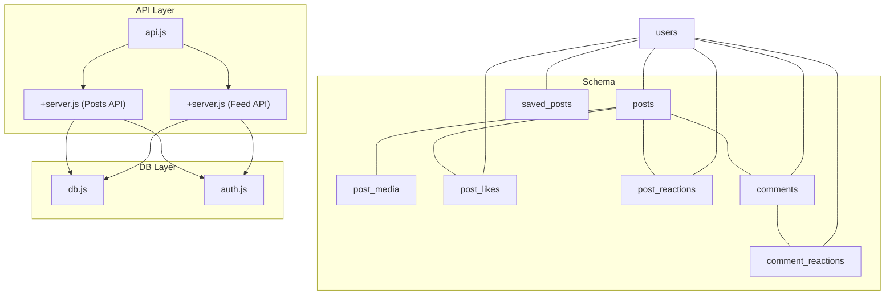

**Diagram sources**
- [schema_sqlite.sql:107-184](file://schema_sqlite.sql#L107-L184)
- [+server.js (Posts API):1-411](file://frontend/src/routes/api/posts/[...path]/+server.js#L1-L411)
- [+server.js (Feed API):1-228](file://frontend/src/routes/api/feed/[...path]/+server.js#L1-L228)
- [api.js:108-131](file://frontend/src/lib/api.js#L108-L131)
- [db.js:1-209](file://frontend/src/lib/server/db.js#L1-L209)
- [auth.js:1-92](file://frontend/src/lib/server/auth.js#L1-L92)

**Section sources**
- [schema_sqlite.sql:107-184](file://schema_sqlite.sql#L107-L184)
- [002_phase2.sql:12-18](file://migrations/002_phase2.sql#L12-L18)
- [+server.js (Posts API):1-411](file://frontend/src/routes/api/posts/[...path]/+server.js#L1-L411)
- [+server.js (Feed API):1-228](file://frontend/src/routes/api/feed/[...path]/+server.js#L1-L228)
- [api.js:108-131](file://frontend/src/lib/api.js#L108-L131)
- [db.js:1-209](file://frontend/src/lib/server/db.js#L1-L209)
- [auth.js:1-92](file://frontend/src/lib/server/auth.js#L1-L92)

## Core Components
- posts: primary content record with user ownership, body, privacy, engagement counters, scheduling, status, and timestamps
- post_media: attachments linked to posts with media_url, media_type, dimensions, and ordering
- post_likes: legacy table for likes keyed by post_id and user_id
- post_reactions: flexible reactions table keyed by post_id and user_id
- comments: hierarchical comments with parent_id, body, like_count, and soft-deletion
- comment_reactions: per-comment reactions keyed by comment_id and user_id
- saved_posts: user-post bookmarks

Key constraints and indexes:
- Foreign keys cascade deletes from users to posts, comments, and reactions
- Indexes optimize user-centric queries, scheduled posts, and public feeds
- Composite primary keys enforce uniqueness for reactions and saved posts

**Section sources**
- [schema_sqlite.sql:107-184](file://schema_sqlite.sql#L107-L184)
- [001_schema.sql:114-197](file://migrations/001_schema.sql#L114-L197)
- [002_phase2.sql:12-18](file://migrations/002_phase2.sql#L12-L18)

## Architecture Overview
The posts model integrates with the feed algorithm and API layer:
- Timeline construction uses user settings and follows/friends filters
- Engagement analytics leverage counters and reaction tables
- Media aggregation is performed per post

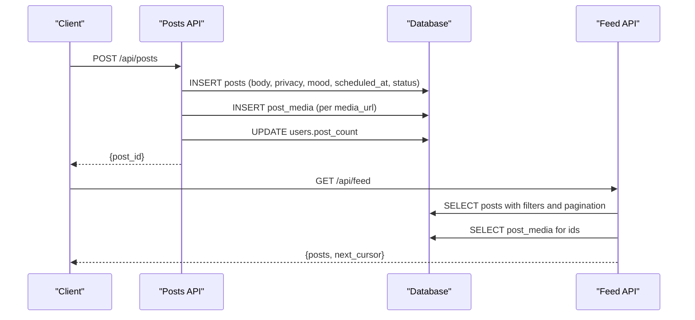

**Diagram sources**
- [+server.js (Posts API):119-205](file://frontend/src/routes/api/posts/[...path]/+server.js#L119-L205)
- [+server.js (Feed API):135-214](file://frontend/src/routes/api/feed/[...path]/+server.js#L135-L214)

## Detailed Component Analysis

### posts
- Fields: user_id, body, privacy, like_count, comment_count, share_count, is_pinned, is_promoted, promotion_score, mood, privacy_level, scheduled_at, status, deleted_at, created_at, updated_at
- Indexes: user_id with created_at desc; scheduled_at with status = 'scheduled'; status with created_at desc
- Cascading: ON DELETE CASCADE from users(id)
- Status lifecycle: published vs scheduled; restoration sets deleted_at to NULL

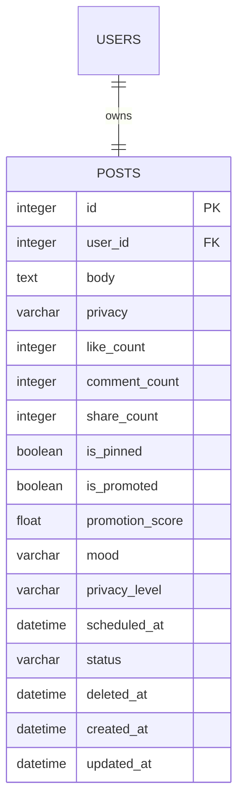

**Diagram sources**
- [schema_sqlite.sql:107-125](file://schema_sqlite.sql#L107-L125)
- [002_phase2.sql:12-18](file://migrations/002_phase2.sql#L12-L18)

**Section sources**
- [schema_sqlite.sql:107-125](file://schema_sqlite.sql#L107-L125)
- [002_phase2.sql:12-18](file://migrations/002_phase2.sql#L12-L18)

### post_media
- Purpose: attach images/videos to posts with ordering
- Fields: post_id, media_url, media_type, width, height, position, created_at
- Indexes: none explicitly declared; relies on primary key and FK
- Cascading: ON DELETE CASCADE from posts(id)

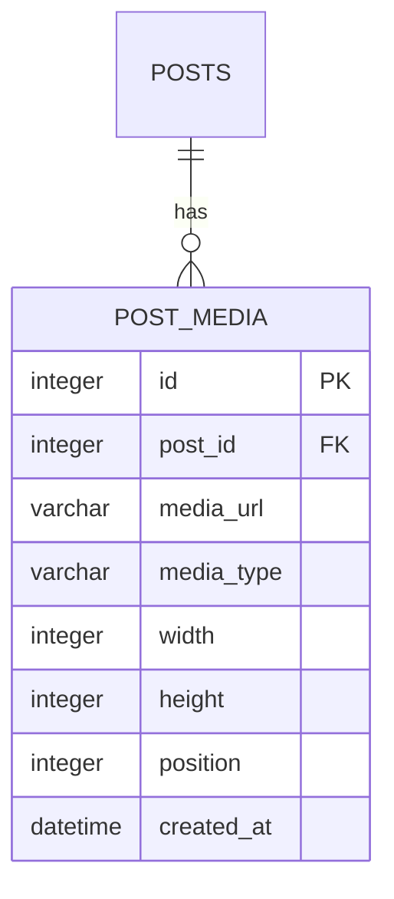

**Diagram sources**
- [schema_sqlite.sql:128-137](file://schema_sqlite.sql#L128-L137)

**Section sources**
- [schema_sqlite.sql:128-137](file://schema_sqlite.sql#L128-L137)

### post_likes and post_reactions
- post_likes: legacy table with composite PK (post_id, user_id)
- post_reactions: flexible reactions table with composite PK (post_id, user_id)
- Cascading: ON DELETE CASCADE from posts(id) and users(id)
- Usage: increment like_count on insert; decrement on delete

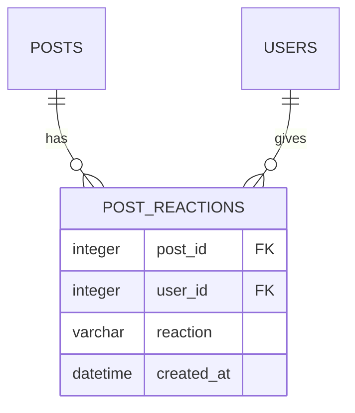

**Diagram sources**
- [schema_sqlite.sql:139-155](file://schema_sqlite.sql#L139-L155)

**Section sources**
- [schema_sqlite.sql:139-155](file://schema_sqlite.sql#L139-L155)

### comments and comment_reactions
- comments: hierarchical with parent_id referencing self; soft-deleted via deleted_at
- comment_reactions: per-comment reactions keyed by comment_id and user_id
- Cascading: ON DELETE CASCADE from posts(id), users(id), and comments(id)

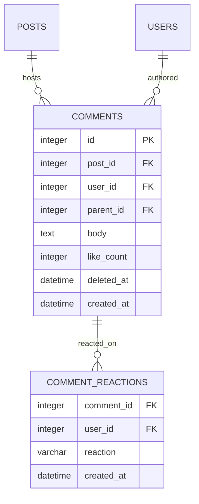

**Diagram sources**
- [schema_sqlite.sql:157-177](file://schema_sqlite.sql#L157-L177)

**Section sources**
- [schema_sqlite.sql:157-177](file://schema_sqlite.sql#L157-L177)

### saved_posts
- Purpose: bookmark posts for users
- Fields: user_id, post_id, saved_at
- Indexes: none explicitly declared; relies on composite PK
- Cascading: ON DELETE CASCADE from users(id) and posts(id)

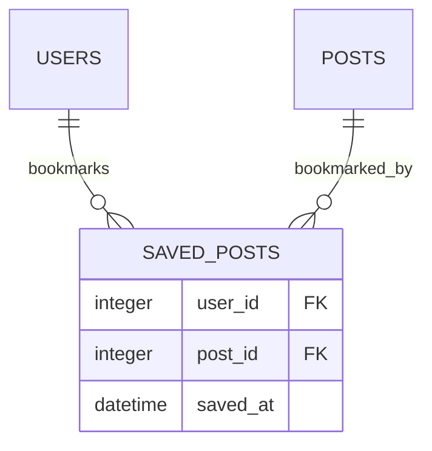

**Diagram sources**
- [schema_sqlite.sql:179-184](file://schema_sqlite.sql#L179-L184)

**Section sources**
- [schema_sqlite.sql:179-184](file://schema_sqlite.sql#L179-L184)

### Timeline Construction and Engagement Analytics
- Feed API constructs timelines using:
  - Public explore feed: sorts by like_count desc
  - Personal feed: applies user preferences (interests, interactions, social, popularity, recency, diversity) and pagination cursors
- Engagement analytics:
  - Increment/decrement counters on reactions and comments
  - Track user_liked and user_saved flags in feed queries

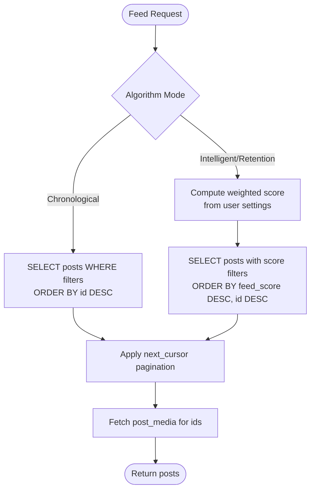

**Diagram sources**
- [+server.js (Feed API):135-214](file://frontend/src/routes/api/feed/[...path]/+server.js#L135-L214)

**Section sources**
- [+server.js (Feed API):135-214](file://frontend/src/routes/api/feed/[...path]/+server.js#L135-L214)

### API Workflows

#### Create Post
- Accepts multipart/form-data or JSON
- Supports scheduled posts (future publish)
- Inserts post_media entries
- Updates user.post_count
- Notifies followers on immediate publish

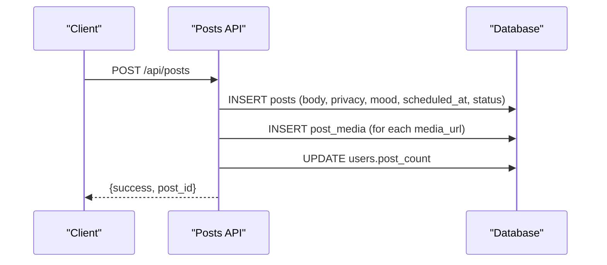

**Diagram sources**
- [+server.js (Posts API):119-205](file://frontend/src/routes/api/posts/[...path]/+server.js#L119-L205)

**Section sources**
- [+server.js (Posts API):119-205](file://frontend/src/routes/api/posts/[...path]/+server.js#L119-L205)

#### Like/Unlike Post
- Upsert reaction with reaction type
- Update like_count accordingly
- Insert notification for post owner

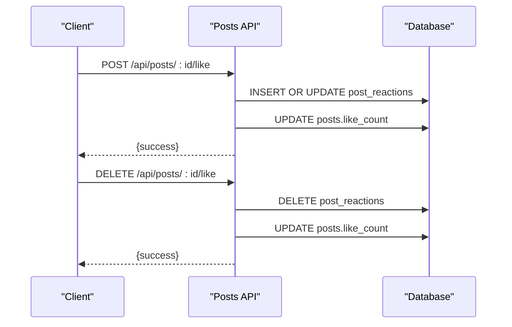

**Diagram sources**
- [+server.js (Posts API):248-268](file://frontend/src/routes/api/posts/[...path]/+server.js#L248-L268)

**Section sources**
- [+server.js (Posts API):248-268](file://frontend/src/routes/api/posts/[...path]/+server.js#L248-L268)

#### Add Comment and Nested Comments
- Supports parent_id for hierarchical replies
- Increments post.comment_count
- Soft-deletes comments via deleted_at

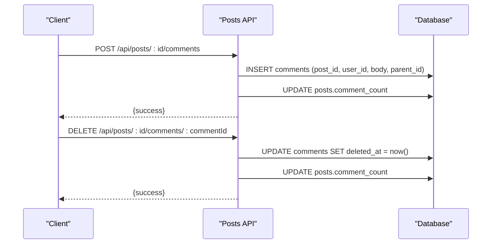

**Diagram sources**
- [+server.js (Posts API):282-300](file://frontend/src/routes/api/posts/[...path]/+server.js#L282-L300)
- [+server.js (Posts API):390-397](file://frontend/src/routes/api/posts/[...path]/+server.js#L390-L397)

**Section sources**
- [+server.js (Posts API):282-300](file://frontend/src/routes/api/posts/[...path]/+server.js#L282-L300)
- [+server.js (Posts API):390-397](file://frontend/src/routes/api/posts/[...path]/+server.js#L390-L397)

## Dependency Analysis
- Foreign keys define strong ownership and cascading behavior
- Indexes optimize frequent queries:
  - posts(user_id, created_at DESC)
  - posts(scheduled_at) filtered by status
  - posts(status, created_at DESC)
  - comments(post_id, created_at)
  - post_likes(user_id)
- API layer depends on unified database wrapper supporting both @libsql/client and better-sqlite3

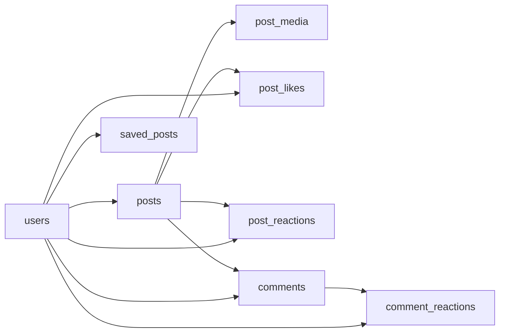

**Diagram sources**
- [schema_sqlite.sql:107-184](file://schema_sqlite.sql#L107-L184)

**Section sources**
- [schema_sqlite.sql:107-184](file://schema_sqlite.sql#L107-L184)
- [001_schema.sql:114-197](file://migrations/001_schema.sql#L114-L197)
- [002_phase2.sql:12-18](file://migrations/002_phase2.sql#L12-L18)

## Performance Considerations
- Indexes
  - posts(user_id, created_at DESC): supports user-centric feeds and pagination
  - posts(scheduled_at) with status filter: efficient scheduled post retrieval
  - posts(status, created_at DESC): fast public/explore sorting
  - comments(post_id, created_at): efficient comment threads
  - post_likes(user_id): efficient per-user reaction checks
- Aggregation
  - Fetch post_media in bulk per post set to minimize round-trips
  - Use cursors for scalable pagination
- Concurrency
  - Unified DB wrapper ensures consistent async semantics across drivers
  - Transactions can be used for multi-statement consistency where needed

[No sources needed since this section provides general guidance]

## Troubleshooting Guide
- Authentication failures
  - Ensure bearer token is present and session is valid
  - Verify token hash exists and not expired
- Unauthorized operations
  - Deleting or updating posts requires ownership
  - Deleting comments requires ownership or post ownership
- Reaction conflicts
  - post_reactions uses composite PK; upsert handles duplicates gracefully
- Scheduled posts
  - Future scheduled_at sets status to scheduled; ensure time is in future
- Deleted content visibility
  - posts.deleted_at prevents display; use restore endpoint to reset

**Section sources**
- [auth.js:15-44](file://frontend/src/lib/server/auth.js#L15-L44)
- [+server.js (Posts API):399-407](file://frontend/src/routes/api/posts/[...path]/+server.js#L399-L407)
- [+server.js (Posts API):390-397](file://frontend/src/routes/api/posts/[...path]/+server.js#L390-L397)
- [+server.js (Posts API):148-157](file://frontend/src/routes/api/posts/[...path]/+server.js#L148-L157)

## Conclusion
The posts model in VSocial provides a robust foundation for content creation, engagement tracking, and discovery:
- Strong referential integrity with cascading deletes
- Flexible reaction system supporting multiple reaction types
- Hierarchical comments with soft-deletion for moderation
- Efficient indexing and query patterns for timelines and analytics
- Clear API boundaries for CRUD, reactions, comments, and saved posts

Future enhancements could include:
- Denormalized engagement counts for read-heavy scenarios
- Materialized views or caching for popular timelines
- Enhanced moderation hooks around deleted_at and status transitions