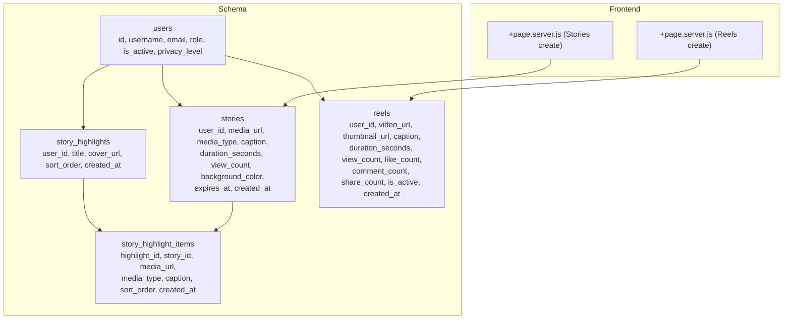
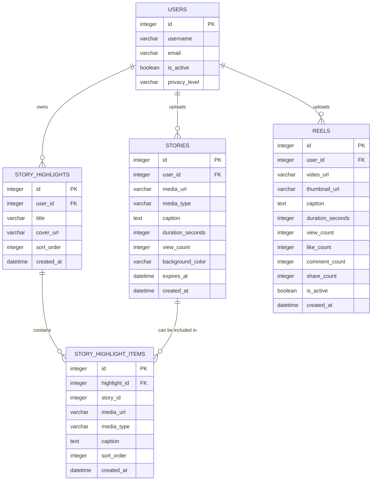
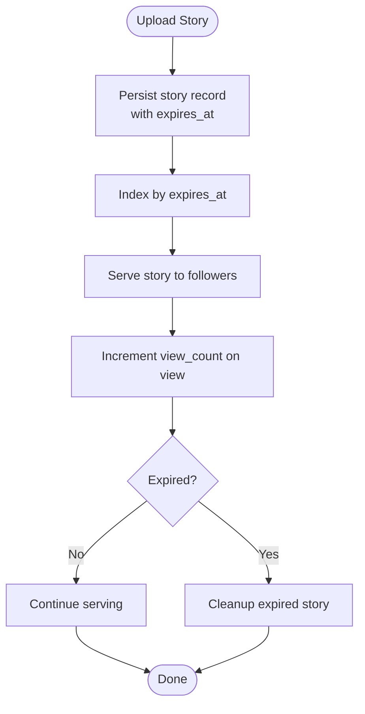
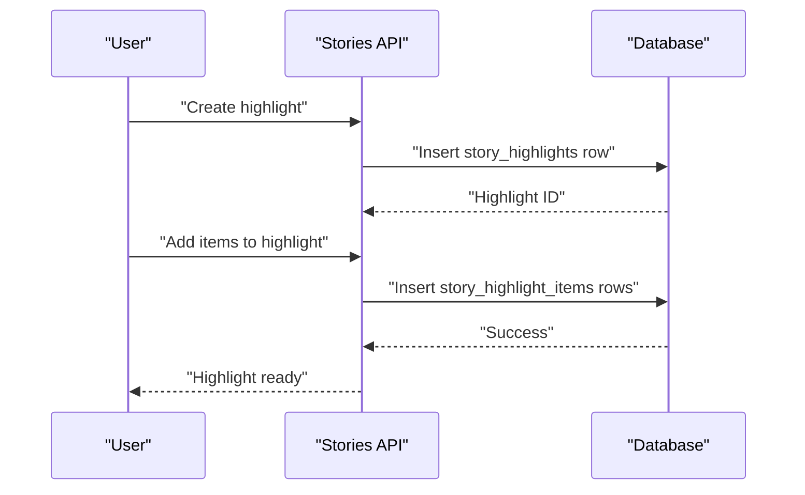
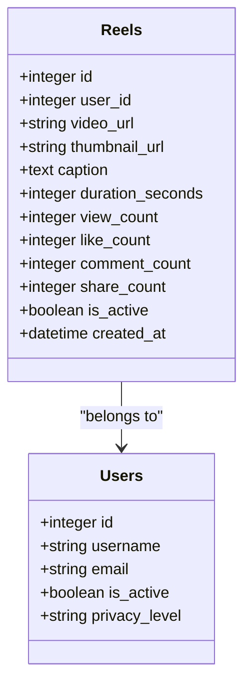
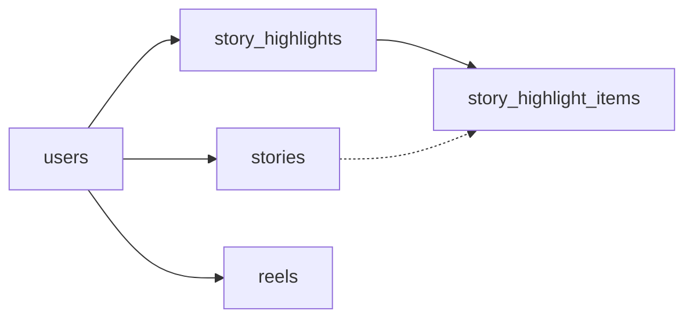

# Stories & Reels Model

<cite>
**Referenced Files in This Document**
- [schema_sqlite.sql](file://schema_sqlite.sql)
- [001_schema.sql](file://migrations/001_schema.sql)
- [002_phase2.sql](file://migrations/002_phase2.sql)
- [+page.server.js (Stories create)](file://frontend/src/routes/stories/create/+page.server.js)
- [+page.server.js (Reels create)](file://frontend/src/routes/reels/create/+page.server.js)
</cite>

## Table of Contents
1. [Introduction](#introduction)
2. [Project Structure](#project-structure)
3. [Core Components](#core-components)
4. [Architecture Overview](#architecture-overview)
5. [Detailed Component Analysis](#detailed-component-analysis)
6. [Dependency Analysis](#dependency-analysis)
7. [Performance Considerations](#performance-considerations)
8. [Troubleshooting Guide](#troubleshooting-guide)
9. [Conclusion](#conclusion)

## Introduction
This document describes the Stories and Reels content models implemented in the platform’s schema. It covers table structures, relationships, indexing strategies, expiration mechanisms, highlight organization, and integration points with user following and privacy controls. It also outlines media processing workflows, query patterns for feeds, and storage considerations for ephemeral content.

## Project Structure
The Stories and Reels domain spans the database schema and frontend creation pages:
- Database schema defines core tables, indexes, and relationships for stories, reels, and highlights.
- Frontend routes provide creation pages for Stories and Reels.

**Diagram sources**
- [schema_sqlite.sql:197-230](file://schema_sqlite.sql#L197-L230)
- [schema_sqlite.sql:516-534](file://schema_sqlite.sql#L516-L534)
- [+page.server.js (Stories create):1-3](file://frontend/src/routes/stories/create/+page.server.js#L1-L3)
- [+page.server.js (Reels create):1-3](file://frontend/src/routes/reels/create/+page.server.js#L1-L3)

**Section sources**
- [schema_sqlite.sql:197-230](file://schema_sqlite.sql#L197-L230)
- [schema_sqlite.sql:516-534](file://schema_sqlite.sql#L516-L534)
- [+page.server.js (Stories create):1-3](file://frontend/src/routes/stories/create/+page.server.js#L1-L3)
- [+page.server.js (Reels create):1-3](file://frontend/src/routes/reels/create/+page.server.js#L1-L3)

## Core Components
- stories: Ephemeral media items uploaded by users with automatic expiration.
- story_highlights: Collections that group related stories into highlight sets.
- story_highlight_items: Individual items inside a highlight set.
- reels: Persistent video content with engagement metrics and activation flag.

Key attributes and defaults:
- stories: user_id, media_url, media_type (default image), caption, duration_seconds (default 5), view_count (default 0), background_color, expires_at (default +1 day), created_at.
- story_highlights: user_id, title, cover_url, sort_order, created_at.
- story_highlight_items: highlight_id, story_id, media_url, media_type, caption, sort_order, created_at.
- reels: user_id, video_url, thumbnail_url, caption, duration_seconds, view_count (default 0), like_count (default 0), comment_count (default 0), share_count (default 0), is_active (default 1), created_at.

**Section sources**
- [schema_sqlite.sql:197-230](file://schema_sqlite.sql#L197-L230)
- [schema_sqlite.sql:516-534](file://schema_sqlite.sql#L516-L534)

## Architecture Overview
Stories and Reels are separate domains with distinct lifecycles:
- Stories are ephemeral with an automatic expiration timestamp and indexes optimized for active/expiring content.
- Reels are persistent with engagement metrics and an activation flag for visibility control.
- Highlights organize stories into curated collections.

**Diagram sources**
- [schema_sqlite.sql:197-230](file://schema_sqlite.sql#L197-L230)
- [schema_sqlite.sql:516-534](file://schema_sqlite.sql#L516-L534)

## Detailed Component Analysis

### Stories Model
Purpose:
- Store user-generated ephemeral media with automatic expiration.
- Track basic metadata and view counts.

Attributes and defaults:
- user_id: Foreign key to users.
- media_url: Path or URL to the media asset.
- media_type: Typically image or video; default image.
- caption: Optional textual content.
- duration_seconds: Default 5 seconds for typical story playback.
- view_count: Incremented on views.
- background_color: Optional UI hint for presentation.
- expires_at: Default set to 24 hours after creation.
- created_at: Timestamp of creation.

Indexes:
- Active/expiry index optimized for queries filtering by expiration.

Expiration mechanism:
- Expiration is enforced by storing expires_at and using indexes to efficiently filter active/expiring stories.

Privacy and visibility:
- Stories are associated with a user; downstream privacy logic can leverage user privacy settings and following relationships.

Integration with user following:
- Feed retrieval can join stories with user following relationships to present stories from followed users.

Media processing workflow:
- Creation endpoint uploads media and persists metadata with expires_at.
- Delivery pipeline serves media URLs while honoring privacy and expiration.

**Diagram sources**
- [schema_sqlite.sql:197-209](file://schema_sqlite.sql#L197-L209)

**Section sources**
- [schema_sqlite.sql:197-209](file://schema_sqlite.sql#L197-L209)

### Story Highlights System
Purpose:
- Allow users to organize stories into highlight sets (collections) for permanent access.

Entities:
- story_highlights: Collection metadata (title, cover, sort order).
- story_highlight_items: Items within a highlight, linking to either a story or duplicating media metadata.

Relationships:
- Each highlight belongs to a user.
- Each item belongs to a highlight and optionally references a story.
- Items maintain media_url/media_type/caption for portability if the original story is removed.

**Diagram sources**
- [schema_sqlite.sql:516-534](file://schema_sqlite.sql#L516-L534)

**Section sources**
- [schema_sqlite.sql:516-534](file://schema_sqlite.sql#L516-L534)

### Reels Model
Purpose:
- Store persistent video content with engagement metrics and activation control.

Attributes and defaults:
- user_id: Foreign key to users.
- video_url: Path or URL to the video asset.
- thumbnail_url: Optional preview image.
- caption: Optional textual content.
- duration_seconds: Video length in seconds.
- view_count, like_count, comment_count, share_count: Engagement metrics.
- is_active: Visibility toggle; default enabled.
- created_at: Timestamp of creation.

Indexes:
- Index on user_id and created_at for reverse chronological retrieval.
- Additional indexes may exist for popular sorting (see migration).

**Diagram sources**
- [schema_sqlite.sql:215-229](file://schema_sqlite.sql#L215-L229)

**Section sources**
- [schema_sqlite.sql:215-229](file://schema_sqlite.sql#L215-L229)

### Media Processing Workflows
- Stories:
  - Upload media and persist metadata with expires_at.
  - Serve media URLs respecting privacy and expiration.
  - Increment view_count per view.
- Reels:
  - Upload video and optional thumbnail.
  - Maintain engagement metrics.
  - Respect is_active flag for visibility.

Storage optimization:
- Use CDN-backed media_url/thumbnail_url.
- Archive or delete expired stories after expiration.
- Compress thumbnails and optimize video delivery.

Privacy considerations:
- Honor user privacy_level and following relationships.
- Block or hide content from blocked users.
- Respect user settings for DMs and visibility.

**Section sources**
- [schema_sqlite.sql:197-230](file://schema_sqlite.sql#L197-L230)
- [schema_sqlite.sql:516-534](file://schema_sqlite.sql#L516-L534)

## Dependency Analysis
- stories depends on users for ownership.
- story_highlights depends on users for ownership.
- story_highlight_items depends on story_highlights and optionally on stories.
- reels depends on users for ownership.

**Diagram sources**
- [schema_sqlite.sql:197-230](file://schema_sqlite.sql#L197-L230)
- [schema_sqlite.sql:516-534](file://schema_sqlite.sql#L516-L534)

**Section sources**
- [schema_sqlite.sql:197-230](file://schema_sqlite.sql#L197-L230)
- [schema_sqlite.sql:516-534](file://schema_sqlite.sql#L516-L534)

## Performance Considerations
- Stories:
  - Use expires_at index to quickly filter active/expiring stories.
  - Partition or batch cleanup of expired records.
  - Cache recent stories per user to reduce repeated queries.
- Reels:
  - Use user_id + created_at index for reverse-chronological feeds.
  - Consider popularity-based indexes for trending reels.
  - Offload media delivery to CDN to reduce database load.
- Highlights:
  - Sort by sort_order for deterministic presentation.
  - Denormalize minimal media metadata in highlight_items for resilience against story deletion.

[No sources needed since this section provides general guidance]

## Troubleshooting Guide
Common issues and resolutions:
- Story not appearing in feed:
  - Verify expires_at is in the future and stories index is intact.
  - Confirm user privacy settings and following relationships.
- Expired story still visible:
  - Ensure cleanup job runs and removes expired records.
  - Check expires_at calculation and timezone handling.
- Highlight item missing media:
  - Confirm media_url/media_type/caption are populated in highlight_items.
  - Verify fallback logic when original story is deleted.
- Reel not visible:
  - Check is_active flag and user visibility settings.
  - Validate video_url accessibility and thumbnail_url presence.

**Section sources**
- [schema_sqlite.sql:197-230](file://schema_sqlite.sql#L197-L230)
- [schema_sqlite.sql:516-534](file://schema_sqlite.sql#L516-L534)

## Conclusion
Stories and Reels are modeled to support ephemeral and persistent media respectively, with clear separation of concerns and robust indexing for performance. Highlights enable curation around ephemeral content. Privacy and activation flags provide control over visibility, while media processing and CDN delivery optimize performance and storage costs.