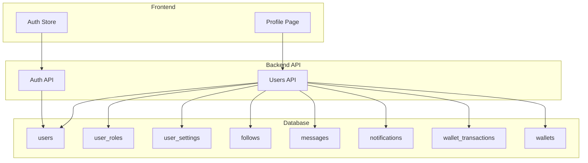
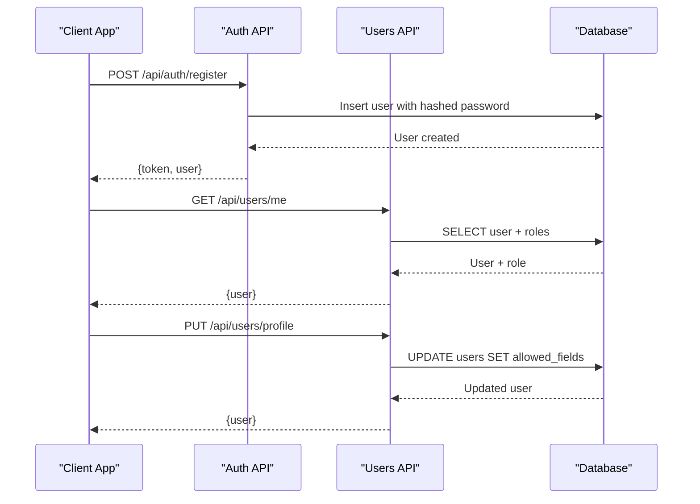
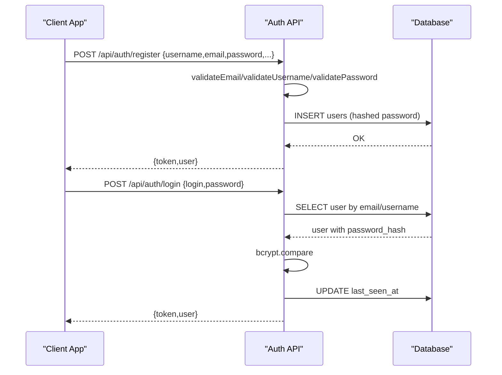
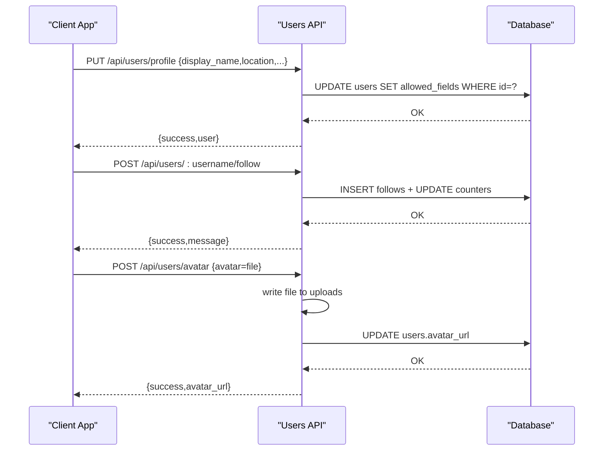
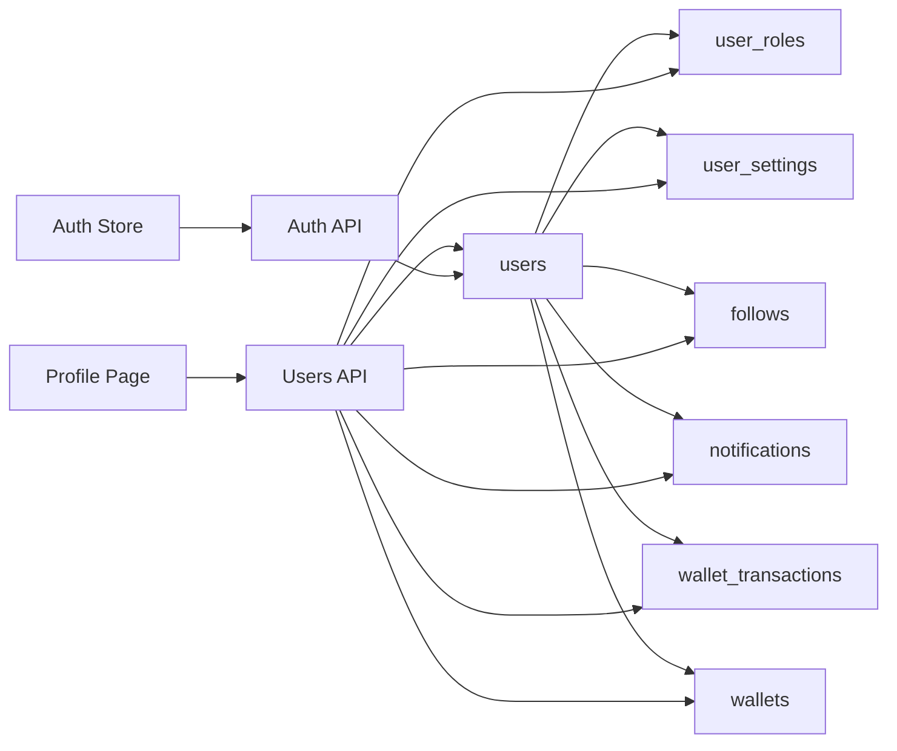

# Users Model

<cite>
**Referenced Files in This Document**
- [001_schema.sql](file://migrations/001_schema.sql)
- [002_phase2.sql](file://migrations/002_phase2.sql)
- [schema_sqlite.sql](file://schema_sqlite.sql)
- [+server.js (Users API)](file://frontend/src/routes/api/users/[...path]/+server.js)
- [+server.js (Auth API)](file://frontend/src/routes/api/auth/[action]/+server.js)
- [security.js](file://frontend/src/lib/server/security.js)
- [auth.svelte.js](file://frontend/src/lib/stores/auth.svelte.js)
- [+page.svelte (Profile Page)](file://frontend/src/routes/u/[username]/+page.svelte)
</cite>

## Table of Contents
1. [Introduction](#introduction)
2. [Project Structure](#project-structure)
3. [Core Components](#core-components)
4. [Architecture Overview](#architecture-overview)
5. [Detailed Component Analysis](#detailed-component-analysis)
6. [Dependency Analysis](#dependency-analysis)
7. [Performance Considerations](#performance-considerations)
8. [Troubleshooting Guide](#troubleshooting-guide)
9. [Conclusion](#conclusion)

## Introduction
This document provides comprehensive documentation for the Users entity model in the Vsocial platform. It covers the user profile schema, authentication data, verification flags, activity tracking, statistics counters, privacy settings, gamification elements, roles and permissions, account status management, and profile completion tracking. It also documents validation rules, unique constraints, defaults, indexing strategy, and common user management operations.

## Project Structure
The Users model spans multiple layers:
- Database schema: PostgreSQL and SQLite schemas define the core user table and related entities.
- Backend API: Users API endpoints handle retrieval, updates, follow/unfollow, avatar/cover uploads, and settings.
- Frontend integration: Profile pages consume user data and drive user actions.
- Authentication: Registration, login, and session management integrate with the Users model.



**Diagram sources**
- [001_schema.sql:16-48](file://migrations/001_schema.sql#L16-L48)
- [+server.js (Users API):47-193](file://frontend/src/routes/api/users/[...path]/+server.js#L47-L193)
- [+server.js (Auth API):13-86](file://frontend/src/routes/api/auth/[action]/+server.js#L13-L86)

**Section sources**
- [001_schema.sql:16-48](file://migrations/001_schema.sql#L16-L48)
- [schema_sqlite.sql:13-48](file://schema_sqlite.sql#L13-L48)
- [+server.js (Users API):47-193](file://frontend/src/routes/api/users/[...path]/+server.js#L47-L193)
- [+server.js (Auth API):13-86](file://frontend/src/routes/api/auth/[action]/+server.js#L13-L86)

## Core Components
The Users model defines the primary user entity and related tables supporting roles, settings, and relationships.

- Core user table fields:
  - Identity: id, username, email, password_hash
  - Profile: display_name, avatar_url, cover_url, bio, location, website, education, workplace, phone, birth_date, gender, relationship_status, category
  - Verification: is_verified, email_verified
  - Activity: is_active, is_banned, last_seen_at
  - Statistics: follower_count, following_count, post_count, wallet_credits, wallet_balance
  - Privacy: privacy_level, profile_visibility
  - Gamification: xp_points, level
  - Additional: is_virtual, created_at

- Supporting tables:
  - user_roles: role assignments per user
  - user_settings: per-user preferences and visibility controls
  - follows: follower-following relationships
  - notifications: user-centric notifications
  - wallet_transactions and wallets: monetization and credits

Validation and constraints:
- Unique constraints: username, email
- Defaults: privacy_level, created_at, last_seen_at, counters, flags
- Indexes: username (GIN trigram), email, created_at; additional indexes on relationships and derived metrics

**Section sources**
- [001_schema.sql:16-48](file://migrations/001_schema.sql#L16-L48)
- [001_schema.sql:49-66](file://migrations/001_schema.sql#L49-L66)
- [001_schema.sql:90-109](file://migrations/001_schema.sql#L90-L109)
- [001_schema.sql:45-47](file://migrations/001_schema.sql#L45-L47)
- [002_phase2.sql:46-49](file://migrations/002_phase2.sql#L46-L49)
- [schema_sqlite.sql:13-48](file://schema_sqlite.sql#L13-L48)
- [schema_sqlite.sql:50-55](file://schema_sqlite.sql#L50-L55)
- [schema_sqlite.sql:70-93](file://schema_sqlite.sql#L70-L93)
- [schema_sqlite.sql:95-101](file://schema_sqlite.sql#L95-L101)

## Architecture Overview
The Users model integrates with authentication, notifications, messaging, and monetization subsystems. The backend exposes REST-like endpoints for user operations, while the frontend consumes these endpoints to render profiles and manage user interactions.



**Diagram sources**
- [+server.js (Auth API):18-40](file://frontend/src/routes/api/auth/[action]/+server.js#L18-L40)
- [+server.js (Auth API):55-79](file://frontend/src/routes/api/auth/[action]/+server.js#L55-L79)
- [+server.js (Users API):54-67](file://frontend/src/routes/api/users/[...path]/+server.js#L54-L67)
- [+server.js (Users API):291-309](file://frontend/src/routes/api/users/[...path]/+server.js#L291-L309)

## Detailed Component Analysis

### Users Entity Fields and Constraints
- Identity and authentication:
  - username: unique, length limits enforced by validation
  - email: unique, validated format
  - password_hash: securely stored hash
- Profile attributes:
  - display_name, bio, location, website, education, workplace, phone, birth_date, gender, relationship_status, category
- Verification and status:
  - is_verified, email_verified flags
  - is_active, is_banned for account lifecycle
- Activity and stats:
  - last_seen_at timestamp updated on activity
  - follower_count, following_count, post_count
  - wallet_credits (monetary credits), wallet_balance (balance)
- Privacy and visibility:
  - privacy_level (e.g., public)
  - profile_visibility (from user_settings)
- Gamification:
  - xp_points, level
- Additional:
  - is_virtual for VTuber profiles
  - created_at timestamp

Constraints and defaults:
- Unique: username, email
- Defaults: privacy_level, timestamps, counters, flags
- Indexes: username (GIN trigram), email, created_at; additional indexes on relationships

**Section sources**
- [001_schema.sql:16-48](file://migrations/001_schema.sql#L16-L48)
- [001_schema.sql:45-47](file://migrations/001_schema.sql#L45-L47)
- [002_phase2.sql:46-49](file://migrations/002_phase2.sql#L46-L49)
- [schema_sqlite.sql:13-48](file://schema_sqlite.sql#L13-L48)

### Roles and Permissions System
- user_roles table associates users with roles, enabling permission-based access control.
- The Users API merges user-defined role with role from user_roles for effective permissions.

```mermaid
classDiagram
class Users {
+int id
+string username
+string email
+string password_hash
+string display_name
+string avatar_url
+string cover_url
+string bio
+string location
+string website
+string education
+string workplace
+string phone
+date birth_date
+string gender
+string relationship_status
+boolean is_verified
+boolean is_active
+boolean is_banned
+int follower_count
+int following_count
+int post_count
+decimal wallet_credits
+string privacy_level
+timestamp last_seen_at
+int xp_points
+int level
}
class UserRoles {
+int user_id
+string role
+timestamp granted_at
}
Users ||--o{ UserRoles : "has roles"
```

**Diagram sources**
- [001_schema.sql:16-48](file://migrations/001_schema.sql#L16-L48)
- [001_schema.sql:49-54](file://migrations/001_schema.sql#L49-L54)

**Section sources**
- [001_schema.sql:49-54](file://migrations/001_schema.sql#L49-L54)
- [+server.js (Users API):301-308](file://frontend/src/routes/api/users/[...path]/+server.js#L301-L308)

### Authentication and Session Management
- Registration validates email format, username pattern, and password length, then hashes the password and creates a user.
- Login verifies credentials against password_hash, checks ban status, updates last_seen_at, and creates a session token.
- Frontend auth store persists token and user data.



**Diagram sources**
- [+server.js (Auth API):18-40](file://frontend/src/routes/api/auth/[action]/+server.js#L18-L40)
- [+server.js (Auth API):55-79](file://frontend/src/routes/api/auth/[action]/+server.js#L55-L79)
- [security.js:35-53](file://frontend/src/lib/server/security.js#L35-L53)

**Section sources**
- [+server.js (Auth API):18-40](file://frontend/src/routes/api/auth/[action]/+server.js#L18-L40)
- [+server.js (Auth API):55-79](file://frontend/src/routes/api/auth/[action]/+server.js#L55-L79)
- [security.js:35-53](file://frontend/src/lib/server/security.js#L35-L53)
- [auth.svelte.js:52-75](file://frontend/src/lib/stores/auth.svelte.js#L52-L75)

### Profile Management Operations
- Retrieve own profile: GET /api/users/me
- Update profile: PUT /api/users/profile (allowed fields include display_name, bio, location, website, category, privacy_level, gender, birth_date)
- Retrieve public profile: GET /api/users/:username
- Search users: GET /api/users/search?q=...
- Follow/Unfollow: POST/DELETE /api/users/:username/follow
- Upload avatar/cover: POST /api/users/avatar, POST /api/users/cover



**Diagram sources**
- [+server.js (Users API):291-309](file://frontend/src/routes/api/users/[...path]/+server.js#L291-L309)
- [+server.js (Users API):202-220](file://frontend/src/routes/api/users/[...path]/+server.js#L202-L220)
- [+server.js (Users API):222-254](file://frontend/src/routes/api/users/[...path]/+server.js#L222-L254)

**Section sources**
- [+server.js (Users API):47-193](file://frontend/src/routes/api/users/[...path]/+server.js#L47-L193)
- [+server.js (Users API):291-309](file://frontend/src/routes/api/users/[...path]/+server.js#L291-L309)
- [+server.js (Users API):202-220](file://frontend/src/routes/api/users/[...path]/+server.js#L202-L220)
- [+server.js (Users API):222-254](file://frontend/src/routes/api/users/[...path]/+server.js#L222-L254)

### Validation Rules and Indexing Strategy
- Validation:
  - Email format validation
  - Username pattern validation (alphanumeric and underscore, length bounds)
  - Password minimum length validation
- Indexing:
  - GIN trigram index on username for fuzzy search
  - Index on email for fast lookup
  - Index on created_at for chronological queries
  - Additional indexes on relationships and derived metrics

**Section sources**
- [security.js:35-53](file://frontend/src/lib/server/security.js#L35-L53)
- [001_schema.sql:45-47](file://migrations/001_schema.sql#L45-L47)
- [001_schema.sql:97](file://migrations/001_schema.sql#L97)
- [001_schema.sql:108](file://migrations/001_schema.sql#L108)

### Typical User Data Structures and Common Queries
- Typical user object returned by GET /api/users/me includes identity, profile, stats, privacy, and role.
- Typical user object returned by GET /api/users/:username includes public profile fields plus is_following indicator.
- Common queries:
  - Get user by username or id
  - List followers/following
  - Paginated posts with media aggregation
  - Search users by username or display_name

**Section sources**
- [+server.js (Users API):54-67](file://frontend/src/routes/api/users/[...path]/+server.js#L54-L67)
- [+server.js (Users API):170-190](file://frontend/src/routes/api/users/[...path]/+server.js#L170-L190)
- [+server.js (Users API):114-132](file://frontend/src/routes/api/users/[...path]/+server.js#L114-L132)
- [+server.js (Users API):134-167](file://frontend/src/routes/api/users/[...path]/+server.js#L134-L167)

## Dependency Analysis
The Users model interacts with several domain tables and APIs. The Users API orchestrates reads/writes to users, user_roles, user_settings, follows, notifications, and wallet-related tables.



**Diagram sources**
- [001_schema.sql:16-48](file://migrations/001_schema.sql#L16-L48)
- [001_schema.sql:49-66](file://migrations/001_schema.sql#L49-L66)
- [+server.js (Users API):47-193](file://frontend/src/routes/api/users/[...path]/+server.js#L47-L193)
- [+server.js (Auth API):13-86](file://frontend/src/routes/api/auth/[action]/+server.js#L13-L86)

**Section sources**
- [001_schema.sql:16-48](file://migrations/001_schema.sql#L16-L48)
- [001_schema.sql:49-66](file://migrations/001_schema.sql#L49-L66)
- [+server.js (Users API):47-193](file://frontend/src/routes/api/users/[...path]/+server.js#L47-L193)
- [+server.js (Auth API):13-86](file://frontend/src/routes/api/auth/[action]/+server.js#L13-L86)

## Performance Considerations
- Use GIN trigram index on username for efficient fuzzy search and autocomplete.
- Leverage indexes on email and created_at to optimize lookups and chronological queries.
- Apply pagination and limit clauses for lists (followers, following, posts).
- Keep profile updates minimal by allowing only permitted fields to reduce write contention.

## Troubleshooting Guide
- Registration errors:
  - Missing required fields or invalid format cause 400 responses.
  - Duplicate username or email triggers constraint violations.
- Login errors:
  - Incorrect credentials or banned accounts return 401/403.
  - Ensure last_seen_at is updated upon successful login.
- Profile operations:
  - PUT /api/users/profile requires at least one valid field; otherwise returns 400.
  - Follow/Unfollow prevents self-follow and updates counters atomically.
- Frontend integration:
  - Profile page fallback handles missing users gracefully.
  - Auth store manages token persistence and user state synchronization.

**Section sources**
- [+server.js (Auth API):18-40](file://frontend/src/routes/api/auth/[action]/+server.js#L18-L40)
- [+server.js (Auth API):55-79](file://frontend/src/routes/api/auth/[action]/+server.js#L55-L79)
- [+server.js (Users API):291-309](file://frontend/src/routes/api/users/[...path]/+server.js#L291-L309)
- [+server.js (Users API):202-220](file://frontend/src/routes/api/users/[...path]/+server.js#L202-L220)
- [+page.svelte (Profile Page):49-91](file://frontend/src/routes/u/[username]/+page.svelte#L49-L91)
- [auth.svelte.js:52-75](file://frontend/src/lib/stores/auth.svelte.js#L52-L75)

## Conclusion
The Users model in Vsocial is designed to support a rich social platform with robust authentication, privacy controls, activity tracking, and monetization features. The schema enforces strong constraints and indexes for performance, while the backend APIs provide a cohesive set of operations for profile management, authentication, and user interactions. The frontend integrates seamlessly with these APIs to deliver a responsive user experience.