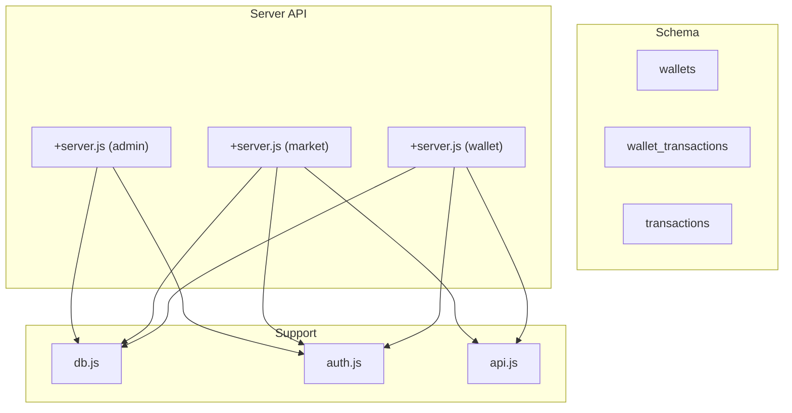
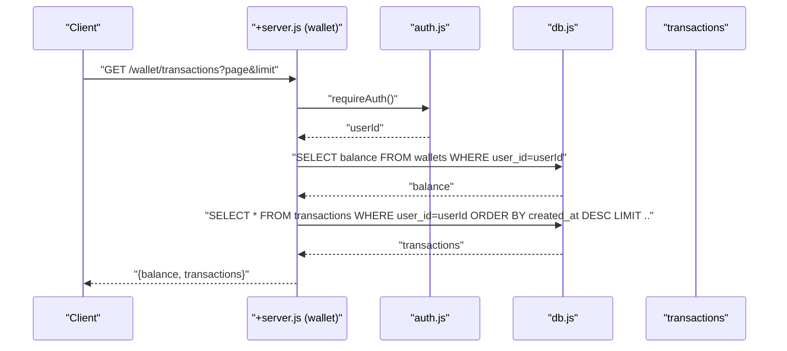
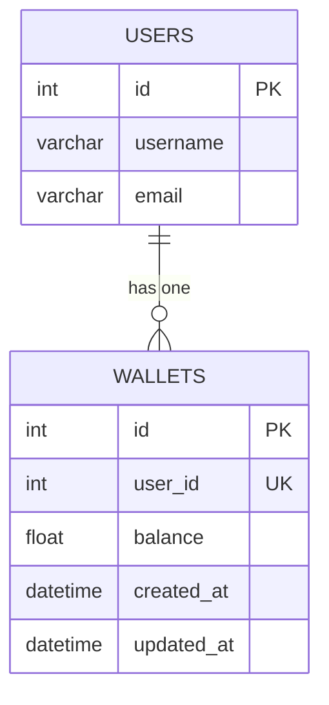
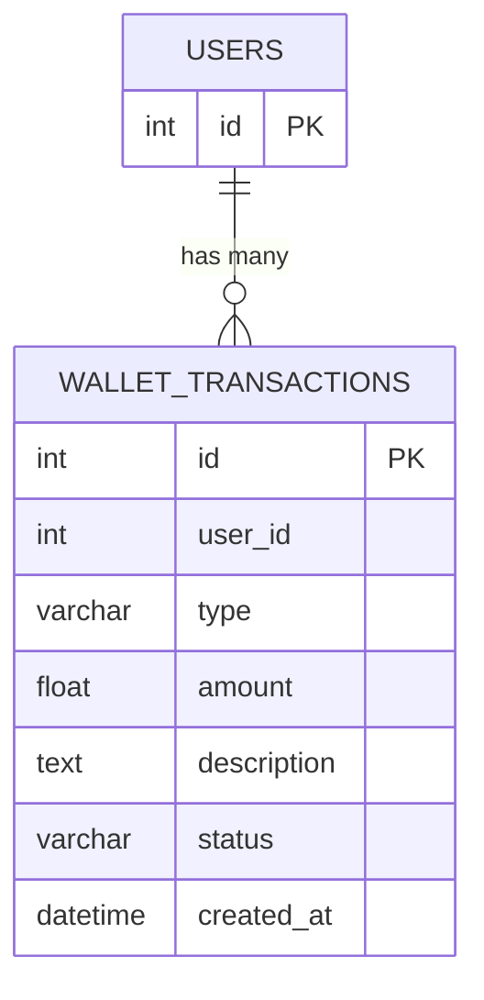
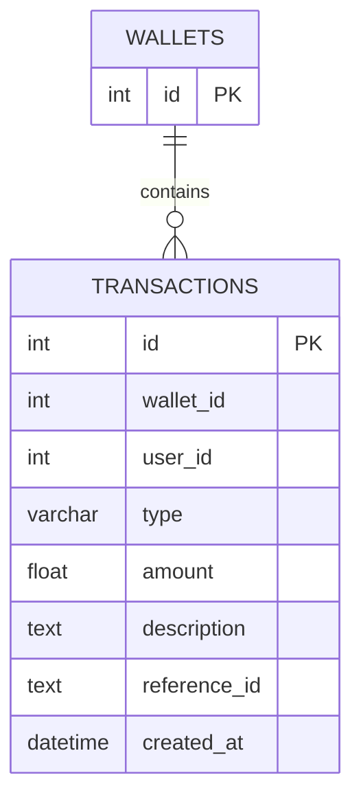
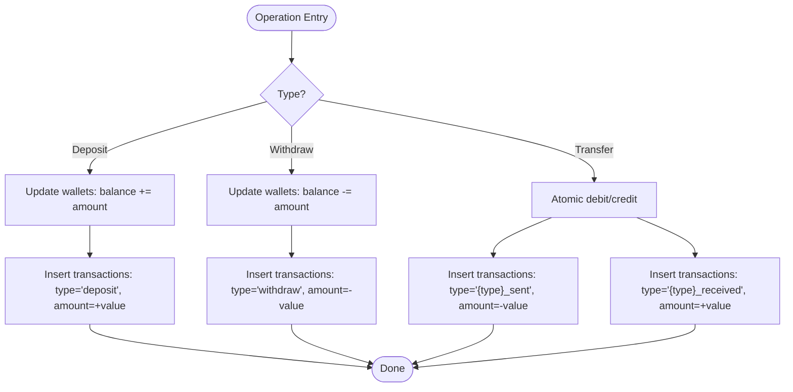
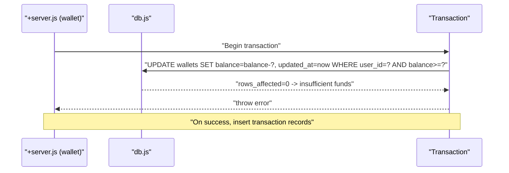
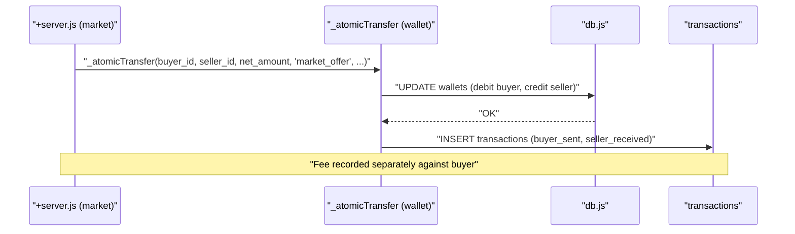
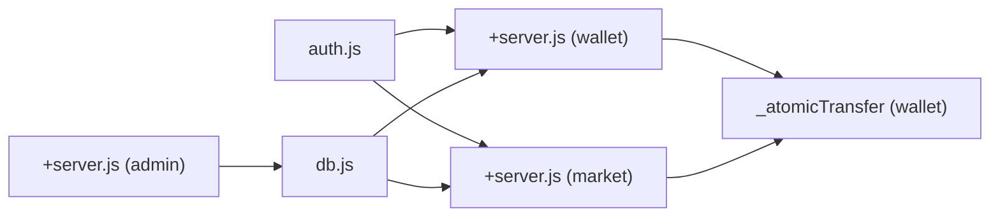

# Wallet & Transactions Model

<cite>
**Referenced Files in This Document**
- [schema_sqlite.sql](file://schema_sqlite.sql)
- [001_schema.sql](file://migrations/001_schema.sql)
- [002_phase2.sql](file://migrations/002_phase2.sql)
- [+server.js (wallet)](file://frontend/src/routes/api/wallet/[...path]+server.js)
- [+server.js (market)](file://frontend/src/routes/api/market/[...path]+server.js)
- [+server.js (admin)](file://frontend/src/routes/api/admin/[...path]+server.js)
- [db.js](file://frontend/src/lib/server/db.js)
- [auth.js](file://frontend/src/lib/server/auth.js)
- [api.js](file://frontend/src/lib/api.js)
</cite>

## Table of Contents
1. [Introduction](#introduction)
2. [Project Structure](#project-structure)
3. [Core Components](#core-components)
4. [Architecture Overview](#architecture-overview)
5. [Detailed Component Analysis](#detailed-component-analysis)
6. [Dependency Analysis](#dependency-analysis)
7. [Performance Considerations](#performance-considerations)
8. [Troubleshooting Guide](#troubleshooting-guide)
9. [Conclusion](#conclusion)
10. [Appendices](#appendices)

## Introduction
This document describes the Wallet and Transaction system used by the platform. It covers the wallets table for per-user balances, the wallet_transactions table for per-user transaction history, and the transactions table for detailed financial records with reference linkage and audit trail capabilities. It also documents transaction types, balance calculation semantics, funding and withdrawal mechanics, security considerations, validation rules, reconciliation procedures, and query patterns for reporting and analytics. Integration points with marketplace offers and administrative auditing are included.

## Project Structure
The wallet system spans schema definitions and server-side API endpoints:
- Schema defines three core tables: wallets, wallet_transactions, and transactions.
- API endpoints implement deposit, withdrawal, transfers, and transaction history retrieval.
- Administrative endpoints expose transaction logs for audit and reconciliation.
- Database adapter and authentication utilities underpin secure, transactional operations.

**Diagram sources**
- [schema_sqlite.sql:344-371](file://schema_sqlite.sql#L344-L371)
- [+server.js (wallet):1-112](file://frontend/src/routes/api/wallet/[...path]+server.js#L1-L112)
- [+server.js (market):1-134](file://frontend/src/routes/api/market/[...path]+server.js#L1-L134)
- [+server.js (admin):106-114](file://frontend/src/routes/api/admin/[...path]+server.js#L106-L114)
- [db.js:1-209](file://frontend/src/lib/server/db.js#L1-L209)
- [auth.js:1-92](file://frontend/src/lib/server/auth.js#L1-L92)
- [api.js:290-303](file://frontend/src/lib/api.js#L290-L303)

**Section sources**
- [schema_sqlite.sql:344-371](file://schema_sqlite.sql#L344-L371)
- [+server.js (wallet):1-112](file://frontend/src/routes/api/wallet/[...path]+server.js#L1-L112)
- [+server.js (market):1-134](file://frontend/src/routes/api/market/[...path]+server.js#L1-L134)
- [+server.js (admin):106-114](file://frontend/src/routes/api/admin/[...path]+server.js#L106-L114)
- [db.js:1-209](file://frontend/src/lib/server/db.js#L1-L209)
- [auth.js:1-92](file://frontend/src/lib/server/auth.js#L1-L92)
- [api.js:290-303](file://frontend/src/lib/api.js#L290-L303)

## Core Components
- wallets: Per-user balance storage with unique user_id, balance, and timestamps.
- wallet_transactions: Per-user transaction history with type, amount, description, status, and timestamps.
- transactions: Detailed financial records linked to wallets, with type, amount, description, reference_id, and timestamps.

Key behaviors:
- Balance is stored as a floating-point number in wallets.
- wallet_transactions records per-user entries for funding and withdrawals.
- transactions records per-wallet entries for all financial movements, enabling audit trails.

**Section sources**
- [schema_sqlite.sql:344-371](file://schema_sqlite.sql#L344-L371)

## Architecture Overview
The wallet system is implemented as a layered service:
- Presentation/API: SvelteKit endpoints handle requests for balance, transactions, deposits, withdrawals, and transfers.
- Business logic: Atomic operations enforce balance checks and update both wallets and transactions.
- Persistence: Unified database adapter supports both local and remote drivers with transaction support.
- Security: Authentication middleware validates sessions and scopes access.

**Diagram sources**
- [+server.js (wallet):32-53](file://frontend/src/routes/api/wallet/[...path]+server.js#L32-L53)
- [auth.js:15-44](file://frontend/src/lib/server/auth.js#L15-L44)
- [db.js:31-112](file://frontend/src/lib/server/db.js#L31-L112)

## Detailed Component Analysis

### Wallets Table
- Purpose: Store per-user balance and timestamps.
- Relationships: user_id is unique and references users.
- Balance semantics: Floating-point balance; updated atomically with timestamp updates.
- Initialization: On first access, a wallet row is inserted with zero balance if missing.

**Diagram sources**
- [schema_sqlite.sql:355-361](file://schema_sqlite.sql#L355-L361)

**Section sources**
- [schema_sqlite.sql:355-361](file://schema_sqlite.sql#L355-L361)
- [+server.js (wallet):38-42](file://frontend/src/routes/api/wallet/[...path]+server.js#L38-L42)

### Wallet Transactions Table
- Purpose: Per-user transaction history for funding and withdrawals.
- Fields: type, amount, description, status, created_at.
- Indexing: user_id with descending created_at for efficient pagination.

**Diagram sources**
- [schema_sqlite.sql:344-353](file://schema_sqlite.sql#L344-L353)

**Section sources**
- [schema_sqlite.sql:344-353](file://schema_sqlite.sql#L344-L353)
- [+server.js (wallet):48-51](file://frontend/src/routes/api/wallet/[...path]+server.js#L48-L51)

### Transactions Table
- Purpose: Detailed financial records with wallet linkage and reference_id for auditability.
- Fields: wallet_id, type, amount, description, reference_id, created_at.
- Linkage: wallet_id references wallets; user_id is also recorded for convenience.

**Diagram sources**
- [schema_sqlite.sql:363-371](file://schema_sqlite.sql#L363-L371)

**Section sources**
- [schema_sqlite.sql:363-371](file://schema_sqlite.sql#L363-L371)
- [+server.js (admin):107-114](file://frontend/src/routes/api/admin/[...path]+server.js#L107-L114)

### Transaction Types and Status Management
- Funding: Deposit operations insert a positive amount into the wallet and a corresponding transaction record.
- Withdrawals: Withdraw operations insert a negative amount into the wallet and a corresponding transaction record.
- Transfers: Atomic transfer function ensures debits and credits occur together, generating two transaction records per direction.
- Status: wallet_transactions includes a status field; transactions records are typically created as completed.

**Diagram sources**
- [+server.js (wallet):83-109](file://frontend/src/routes/api/wallet/[...path]+server.js#L83-L109)
- [+server.js (wallet):8-30](file://frontend/src/routes/api/wallet/[...path]+server.js#L8-L30)

**Section sources**
- [+server.js (wallet):8-30](file://frontend/src/routes/api/wallet/[...path]+server.js#L8-L30)
- [+server.js (wallet):83-109](file://frontend/src/routes/api/wallet/[...path]+server.js#L83-L109)

### Balance Calculations and Validation
- Balance checks: Withdrawals and transfers validate sufficient funds before updating.
- Atomicity: All financial updates occur inside database transactions to prevent race conditions.
- Timestamps: updated_at is refreshed on each balance change for audit trail freshness.

**Diagram sources**
- [+server.js (wallet):100-108](file://frontend/src/routes/api/wallet/[...path]+server.js#L100-L108)
- [db.js:60-71](file://frontend/src/lib/server/db.js#L60-L71)

**Section sources**
- [+server.js (wallet):100-108](file://frontend/src/routes/api/wallet/[...path]+server.js#L100-L108)
- [db.js:60-71](file://frontend/src/lib/server/db.js#L60-L71)

### Funding Mechanisms (Deposits)
- Validation: Amount must be greater than zero and below configured maximum.
- Execution: Updates existing wallet balance or inserts a new wallet row; creates a transaction record.

**Section sources**
- [+server.js (wallet):83-95](file://frontend/src/routes/api/wallet/[...path]+server.js#L83-L95)

### Withdrawal Processes
- Validation: Amount must be greater than zero; sufficient funds checked.
- Execution: Decrements balance and records a transaction with negative amount.

**Section sources**
- [+server.js (wallet):97-109](file://frontend/src/routes/api/wallet/[...path]+server.js#L97-L109)

### Transfer and Marketplace Integration
- Atomic transfer: Ensures both sender and receiver balances update consistently; inserts two transaction records per direction.
- Marketplace offers: Accepting an offer invokes atomic transfer for net proceeds to the seller and collects a platform fee, recording both the transfer and fee transactions.

**Diagram sources**
- [+server.js (market):102-124](file://frontend/src/routes/api/market/[...path]+server.js#L102-L124)
- [+server.js (wallet):8-30](file://frontend/src/routes/api/wallet/[...path]+server.js#L8-L30)
- [db.js:60-71](file://frontend/src/lib/server/db.js#L60-L71)

**Section sources**
- [+server.js (market):102-124](file://frontend/src/routes/api/market/[...path]+server.js#L102-L124)
- [+server.js (wallet):8-30](file://frontend/src/routes/api/wallet/[...path]+server.js#L8-L30)

### Security Considerations
- Authentication: All endpoints require a valid session token; unauthorized access returns 401.
- Authorization: Endpoints operate on behalf of the authenticated user; administrative endpoints restrict access to authorized roles.
- Prepared statements: All database queries use prepared statements to prevent injection.
- Session management: Tokens are hashed and stored with expiration checks.

**Section sources**
- [auth.js:15-44](file://frontend/src/lib/server/auth.js#L15-L44)
- [auth.js:79-89](file://frontend/src/lib/server/auth.js#L79-L89)
- [db.js:31-112](file://frontend/src/lib/server/db.js#L31-L112)

### Reconciliation Procedures
- Audit logs: Administrative endpoint retrieves recent transactions with user context for review.
- Reference linkage: Transactions include reference_id to correlate with external operations (e.g., marketplace offer IDs).
- Balance verification: Compare aggregated transaction amounts against wallet balances for periodic reconciliation.

**Section sources**
- [+server.js (admin):106-114](file://frontend/src/routes/api/admin/[...path]+server.js#L106-L114)
- [schema_sqlite.sql:369-370](file://schema_sqlite.sql#L369-L370)

### Query Patterns and Analytics
- Balance and transaction history: Paginated retrieval by user_id ordered by created_at.
- Administrative logs: Join transactions with wallets and users for audit views.
- Marketplace analytics: Use reference_id to tie transactions to offer lifecycle.

**Section sources**
- [+server.js (wallet):48-51](file://frontend/src/routes/api/wallet/[...path]+server.js#L48-L51)
- [+server.js (admin):106-114](file://frontend/src/routes/api/admin/[...path]+server.js#L106-L114)

## Dependency Analysis
- API endpoints depend on the database adapter for SQL execution and transactions.
- Authentication middleware validates requests before wallet operations.
- Marketplace module reuses the wallet’s atomic transfer utility for secure payments.
- Administrative endpoints depend on transaction and wallet joins for auditability.

**Diagram sources**
- [auth.js:15-44](file://frontend/src/lib/server/auth.js#L15-L44)
- [+server.js (wallet):1-112](file://frontend/src/routes/api/wallet/[...path]+server.js#L1-L112)
- [+server.js (market):1-134](file://frontend/src/routes/api/market/[...path]+server.js#L1-L134)
- [db.js:1-209](file://frontend/src/lib/server/db.js#L1-L209)
- [+server.js (admin):106-114](file://frontend/src/routes/api/admin/[...path]+server.js#L106-L114)

**Section sources**
- [auth.js:15-44](file://frontend/src/lib/server/auth.js#L15-L44)
- [+server.js (wallet):1-112](file://frontend/src/routes/api/wallet/[...path]+server.js#L1-L112)
- [+server.js (market):1-134](file://frontend/src/routes/api/market/[...path]+server.js#L1-L134)
- [db.js:1-209](file://frontend/src/lib/server/db.js#L1-L209)
- [+server.js (admin):106-114](file://frontend/src/routes/api/admin/[...path]+server.js#L106-L114)

## Performance Considerations
- Indexing: wallet_transactions indexed by user_id and created_at; wallets indexed by user_id.
- Pagination: Limits applied to transaction history queries to control payload sizes.
- WAL mode: Database adapter enables WAL for improved concurrency and durability.
- Transactions: All financial updates occur inside transactions to avoid partial writes.

[No sources needed since this section provides general guidance]

## Troubleshooting Guide
Common issues and resolutions:
- Insufficient funds during withdrawal or transfer: Verify wallet balance and retry with a valid amount.
- Race conditions: The atomic transfer and transactional updates mitigate concurrent access issues.
- Session errors: Ensure a valid, non-expired token is provided; expired sessions are removed from storage.
- Administrative access denied: Confirm role requirements for privileged endpoints.

**Section sources**
- [+server.js (wallet):100-108](file://frontend/src/routes/api/wallet/[...path]+server.js#L100-L108)
- [auth.js:33-41](file://frontend/src/lib/server/auth.js#L33-L41)
- [db.js:60-71](file://frontend/src/lib/server/db.js#L60-L71)

## Conclusion
The Wallet and Transaction system provides a robust, auditable foundation for financial operations. It enforces balance safety via atomic updates, supports diverse transaction types, and integrates cleanly with marketplace workflows. Administrative logging and indexing enable effective monitoring and reporting. Adhering to the documented validation rules and operational patterns ensures correctness and reliability.

## Appendices

### API Surface for Wallet Operations
- GET /wallet: Retrieve current balance.
- GET /wallet/transactions?page&limit: Retrieve paginated transaction history.
- POST /wallet/deposit: Add funds to wallet.
- POST /wallet/withdraw: Remove funds from wallet.
- POST /wallet/transfer: Send funds to another user.

**Section sources**
- [api.js:292-302](file://frontend/src/lib/api.js#L292-L302)
- [+server.js (wallet):32-111](file://frontend/src/routes/api/wallet/[...path]+server.js#L32-L111)

### Database Schema References
- wallets: user_id, balance, created_at, updated_at.
- wallet_transactions: user_id, type, amount, description, status, created_at.
- transactions: wallet_id, user_id, type, amount, description, reference_id, created_at.

**Section sources**
- [schema_sqlite.sql:344-371](file://schema_sqlite.sql#L344-L371)