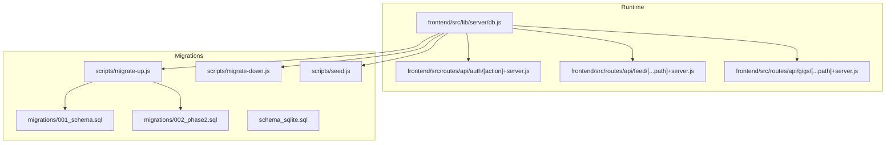
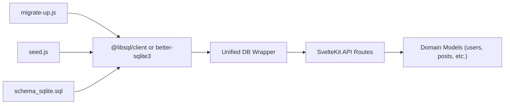

# Database Design & Schema

<cite>
**Referenced Files in This Document**
- [001_schema.sql](file://migrations/001_schema.sql)
- [002_phase2.sql](file://migrations/002_phase2.sql)
- [schema_sqlite.sql](file://schema_sqlite.sql)
- [migrate-up.js](file://scripts/migrate-up.js)
- [migrate-down.js](file://scripts/migrate-down.js)
- [seed.js](file://scripts/seed.js)
- [db.js](file://frontend/src/lib/server/db.js)
- [auth +server.js](file://frontend/src/routes/api/auth/[action]+server.js)
- [feed +server.js](file://frontend/src/routes/api/feed/[...path]+server.js)
- [gigs +server.js](file://frontend/src/routes/api/gigs/[...path]+server.js)
</cite>

## Table of Contents
1. [Introduction](#introduction)
2. [Project Structure](#project-structure)
3. [Core Components](#core-components)
4. [Architecture Overview](#architecture-overview)
5. [Detailed Component Analysis](#detailed-component-analysis)
6. [Dependency Analysis](#dependency-analysis)
7. [Performance Considerations](#performance-considerations)
8. [Troubleshooting Guide](#troubleshooting-guide)
9. [Conclusion](#conclusion)
10. [Appendices](#appendices)

## Introduction
This document provides comprehensive database design and schema documentation for VSocial. It covers entity relationships, field definitions, data types, primary/foreign keys, indexes, constraints, validation and business rules enforced at the database level, data access patterns, caching strategies, performance characteristics, data lifecycle and retention, migration and versioning, and security and privacy controls. The schema is implemented using two variants:
- PostgreSQL-based schema with row-level security and advanced indexing (primary migration set)
- SQLite-compatible schema for local/edge deployments (used by the application’s runtime adapter)

## Project Structure
The database schema is maintained via SQL migration files and a lightweight runtime adapter that supports both @libsql/client and better-sqlite3 drivers. Migrations are applied via Node scripts, and seed data is inserted programmatically.



**Diagram sources**
- [db.js:117-167](file://frontend/src/lib/server/db.js#L117-L167)
- [migrate-up.js:9-54](file://scripts/migrate-up.js#L9-L54)
- [migrate-down.js:11-40](file://scripts/migrate-down.js#L11-L40)
- [seed.js:7-55](file://scripts/seed.js#L7-L55)
- [001_schema.sql:1-686](file://migrations/001_schema.sql#L1-L686)
- [002_phase2.sql:1-272](file://migrations/002_phase2.sql#L1-L272)
- [schema_sqlite.sql:1-702](file://schema_sqlite.sql#L1-L702)

**Section sources**
- [db.js:117-167](file://frontend/src/lib/server/db.js#L117-L167)
- [migrate-up.js:9-54](file://scripts/migrate-up.js#L9-L54)
- [migrate-down.js:11-40](file://scripts/migrate-down.js#L11-L40)
- [seed.js:7-55](file://scripts/seed.js#L7-L55)

## Core Components
This section outlines the core relational models and their roles across VSocial’s domains.

- Users and Identity
  - Stores user profiles, credentials, roles, settings, blocks, interests, and activity metrics.
  - Enforces uniqueness on username and email; maintains counters for followers, following, and posts.
  - Supports OAuth accounts and email verification flags.

- Posts and Content
  - Core post entity with privacy, engagement metrics, scheduling, and status.
  - Media attachments per post, likes, shares, comments, mentions, and saved posts.
  - Hashtags tagging and association tables.

- Stories and Reels
  - Stories with expiration and view tracking.
  - Reels with media, counts, and partitioned views for analytics.

- Messaging and Chat
  - Conversations (direct and group), participants, messages, reactions, and read receipts.
  - Constraints ensure messages target either a direct user or a group.

- Notifications
  - Notification records per recipient with actor, type, and entity linkage.

- Marketplace and Gig Listings
  - Categories, listings, media, offers, and auction/bidding enhancements.
  - Gigs domain for freelance services with applications.

- Moderation and Safety
  - Reports, moderation queue, actions, and banned users.

- Wallet and Transactions
  - Credit transactions and wallet balances for monetization.

- System Settings and Feeds
  - Global settings, trending hashtags, and user feed scoring.

**Section sources**
- [001_schema.sql:16-48](file://migrations/001_schema.sql#L16-L48)
- [001_schema.sql:114-127](file://migrations/001_schema.sql#L114-L127)
- [001_schema.sql:210-231](file://migrations/001_schema.sql#L210-L231)
- [001_schema.sql:237-276](file://migrations/001_schema.sql#L237-L276)
- [001_schema.sql:303-332](file://migrations/001_schema.sql#L303-L332)
- [001_schema.sql:338-348](file://migrations/001_schema.sql#L338-L348)
- [001_schema.sql:364-402](file://migrations/001_schema.sql#L364-L402)
- [001_schema.sql:408-450](file://migrations/001_schema.sql#L408-L450)
- [001_schema.sql:456-465](file://migrations/001_schema.sql#L456-L465)
- [001_schema.sql:509-523](file://migrations/001_schema.sql#L509-L523)
- [002_phase2.sql:20-43](file://migrations/002_phase2.sql#L20-L43)
- [002_phase2.sql:76-95](file://migrations/002_phase2.sql#L76-L95)
- [002_phase2.sql:131-181](file://migrations/002_phase2.sql#L131-L181)
- [002_phase2.sql:183-202](file://migrations/002_phase2.sql#L183-L202)
- [002_phase2.sql:223-243](file://migrations/002_phase2.sql#L223-L243)

## Architecture Overview
The database architecture centers around:
- PostgreSQL-first schema with row-level security for sensitive tables
- SQLite-compatible schema for local deployments
- Unified adapter supporting @libsql/client and better-sqlite3
- Migration runner enforcing ordered application of SQL files
- Seed script initializing system settings and categories

```mermaid
erDiagram
USERS {
int id PK
varchar username UK
varchar email UK
varchar password_hash
varchar display_name
varchar avatar_url
varchar cover_url
text bio
varchar location
varchar website
varchar education
varchar workplace
varchar phone
date birth_date
varchar gender
varchar relationship_status
boolean is_virtual
boolean is_verified
boolean is_active
int follower_count
int following_count
int post_count
numeric wallet_credits
varchar privacy_level
timestamptz created_at
timestamptz last_seen_at
}
USER_ROLES {
int user_id FK
varchar role
timestamptz granted_at
}
USER_SETTINGS {
int user_id PK,FK
varchar theme
varchar language
boolean notification_email
boolean notification_push
boolean notification_dms
boolean show_online_status
varchar allow_dms_from
timestamptz updated_at
}
POSTS {
bigint id PK
int user_id FK
text body
varchar privacy
int like_count
int comment_count
int share_count
boolean is_pinned
boolean is_promoted
float promotion_score
timestamptz created_at
timestamptz updated_at
}
POST_MEDIA {
int id PK
bigint post_id FK
varchar media_url
varchar media_type
int width
int height
int position
timestamptz created_at
}
POST_LIKES {
bigint post_id FK
int user_id FK
varchar reaction
timestamptz created_at
}
COMMENTS {
bigint id PK
bigint post_id FK
int user_id FK
bigint parent_id FK
text body
int like_count
timestamptz created_at
}
HASHTAGS {
int id PK
varchar tag UK
int post_count
timestamptz created_at
}
POST_HASHTAGS {
bigint post_id FK
int hashtag_id FK
}
POST_MENTIONS {
bigint post_id FK
int mentioned_user_id FK
}
SAVED_POSTS {
int user_id FK
bigint post_id FK
timestamptz saved_at
}
STORIES {
bigint id PK
int user_id FK
varchar media_url
varchar media_type
text caption
int duration_seconds
int view_count
varchar background_color
timestamptz expires_at
timestamptz created_at
}
STORY_VIEWS {
bigint story_id FK
int viewer_id FK
timestamptz viewed_at
}
REELS {
bigint id PK
int user_id FK
varchar video_url
varchar thumbnail_url
text caption
int duration_seconds
int view_count
int like_count
int comment_count
int share_count
boolean is_active
timestamptz created_at
}
REEL_VIEWS {
bigint reel_id FK
int user_id FK
timestamptz viewed_at
}
CHAT_GROUPS {
int id PK
varchar name
text description
varchar avatar_url
int creator_id FK
boolean is_encrypted
int max_members
timestamptz created_at
}
CHAT_GROUP_MEMBERS {
int group_id FK
int user_id FK
varchar role
timestamptz joined_at
bigint last_read_message_id
boolean is_muted
}
MESSAGES {
bigint id PK
int sender_id FK
int receiver_id FK
int group_id FK
text body
varchar voice_url
int voice_duration
varchar media_url
varchar media_type
bigint reply_to_id FK
boolean is_deleted
timestamptz created_at
timestamptz read_at
}
MESSAGE_REACTIONS {
bigint message_id FK
int user_id FK
varchar emoji
timestamptz created_at
}
NOTIFICATIONS {
bigint id PK
int recipient_id FK
int actor_id FK
varchar type
varchar entity_type
bigint entity_id
text message
boolean is_read
timestamptz created_at
}
MARKETPLACE_CATEGORIES {
int id PK
varchar name UK
int parent_id FK
varchar icon
varchar slug UK
}
MARKETPLACE_LISTINGS {
bigint id PK
int user_id FK
int category_id FK
varchar title
text description
numeric price
varchar currency
varchar condition
varchar location
varchar status
int view_count
boolean flagged
text flag_reason
int fraud_score
timestamptz created_at
timestamptz expires_at
}
LISTING_MEDIA {
int id PK
bigint listing_id FK
varchar media_url
int position
}
LISTING_OFFERS {
bigint id PK
bigint listing_id FK
int buyer_id FK
int seller_id FK
numeric offer_price
text message
varchar status
timestamptz created_at
timestamptz expires_at
}
REPORTS {
bigint id PK
int reporter_id FK
varchar content_type
bigint content_id
varchar reason
text description
varchar status
int reviewed_by FK
timestamptz reviewed_at
timestamptz created_at
}
MODERATION_QUEUE {
bigint id PK
varchar content_type
bigint content_id
text reason
int priority
varchar status
int assigned_to FK
timestamptz resolved_at
timestamptz created_at
}
MODERATION_ACTIONS {
bigint id PK
int moderator_id FK
int target_user_id FK
varchar action
text reason
int duration_hours
timestamptz expires_at
timestamptz created_at
}
BANNED_USERS {
int user_id PK,FK
text reason
int banned_by FK
timestamptz banned_at
timestamptz expires_at
}
CREDIT_TRANSACTIONS {
bigint id PK
int user_id FK
numeric amount
varchar type
text description
varchar reference_id
numeric balance_after
timestamptz created_at
}
AD_CAMPAIGNS {
int id PK
int user_id FK
varchar name
varchar type
varchar target_url
varchar media_url
numeric budget_credits
numeric spent_credits
int impression_count
int click_count
varchar status
timestamptz starts_at
timestamptz ends_at
timestamptz created_at
}
AD_IMPRESSIONS {
bigint id PK
int campaign_id FK
int user_id FK
varchar ip_hash
boolean clicked
timestamptz created_at
}
PROMOTION_ORDERS {
bigint id PK
int user_id FK
varchar content_type
bigint content_id
numeric credits_spent
float boost_multiplier
varchar status
timestamptz starts_at
timestamptz ends_at
}
USER_FEEDS {
int user_id FK
bigint post_id FK
float score
timestamptz computed_at
}
TRENDING_HASHTAGS {
int hashtag_id PK,FK
float trend_score
timestamptz computed_at
}
EVENTS {
bigint id PK
int host_id FK
varchar title
text description
varchar cover_url
varchar location
boolean is_online
varchar event_url
timestamptz starts_at
timestamptz ends_at
int max_attendees
int attendee_count
varchar status
timestamptz created_at
}
EVENT_ATTENDEES {
bigint event_id FK
int user_id FK
varchar status
timestamptz registered_at
}
SYSTEM_SETTINGS {
varchar key PK
text value
text description
timestamptz updated_at
}
INSTALL_LOG {
int id PK
int step
varchar status
text message
timestamptz created_at
}
VIRTUAL_PROFILES {
int id PK
int user_id UK FK
varchar character_name
varchar character_type
text lore
jsonb traits
int follower_count
timestamptz created_at
}
VIRTUAL_ASSETS {
int id PK
int profile_id FK
varchar asset_type
varchar asset_url
boolean is_active
timestamptz created_at
}
USERS ||--o{ USER_ROLES : "has"
USERS ||--o{ USER_SETTINGS : "has"
USERS ||--o{ POSTS : "writes"
POSTS ||--o{ POST_MEDIA : "contains"
POSTS ||--o{ POST_LIKES : "receives"
POSTS ||--o{ COMMENTS : "hosts"
POSTS ||--o{ POST_HASHTAGS : "tagged_by"
POSTS ||--o{ POST_MENTIONS : "mentions"
USERS ||--o{ SAVED_POSTS : "saved"
USERS ||--o{ STORIES : "creates"
STORIES ||--o{ STORY_VIEWS : "viewed_by"
USERS ||--o{ REELS : "creates"
REELS ||--o{ REEL_VIEWS : "viewed_by"
USERS ||--o{ CHAT_GROUPS : "creates"
CHAT_GROUPS ||--o{ CHAT_GROUP_MEMBERS : "includes"
USERS ||--o{ MESSAGES : "sends"
CHAT_GROUPS ||--o{ MESSAGES : "hosts"
USERS ||--o{ NOTIFICATIONS : "receives"
MARKETPLACE_CATEGORIES ||--o{ MARKETPLACE_LISTINGS : "contains"
USERS ||--o{ MARKETPLACE_LISTINGS : "lists"
MARKETPLACE_LISTINGS ||--o{ LISTING_MEDIA : "shows"
MARKETPLACE_LISTINGS ||--o{ LISTING_OFFERS : "receives"
USERS ||--o{ REPORTS : "files"
USERS ||--o{ MODERATION_ACTIONS : "takes"
USERS ||--o{ CREDIT_TRANSACTIONS : "involved_in"
USERS ||--o{ AD_CAMPAIGNS : "runs"
AD_CAMPAIGNS ||--o{ AD_IMPRESSIONS : "records"
USERS ||--o{ PROMOTION_ORDERS : "places"
USERS ||--o{ USER_FEEDS : "scores"
HASHTAGS ||--o{ POST_HASHTAGS : "tagged"
USERS ||--o{ EVENTS : "hosts"
EVENTS ||--o{ EVENT_ATTENDEES : "attends"
USERS ||--o{ VIRTUAL_PROFILES : "owns"
VIRTUAL_PROFILES ||--o{ VIRTUAL_ASSETS : "owns"
```

**Diagram sources**
- [001_schema.sql:16-48](file://migrations/001_schema.sql#L16-L48)
- [001_schema.sql:114-127](file://migrations/001_schema.sql#L114-L127)
- [001_schema.sql:210-231](file://migrations/001_schema.sql#L210-L231)
- [001_schema.sql:237-276](file://migrations/001_schema.sql#L237-L276)
- [001_schema.sql:303-332](file://migrations/001_schema.sql#L303-L332)
- [001_schema.sql:338-348](file://migrations/001_schema.sql#L338-L348)
- [001_schema.sql:356-402](file://migrations/001_schema.sql#L356-L402)
- [001_schema.sql:408-450](file://migrations/001_schema.sql#L408-L450)
- [001_schema.sql:456-491](file://migrations/001_schema.sql#L456-L491)
- [001_schema.sql:493-503](file://migrations/001_schema.sql#L493-L503)
- [001_schema.sql:509-523](file://migrations/001_schema.sql#L509-L523)
- [001_schema.sql:529-552](file://migrations/001_schema.sql#L529-L552)
- [001_schema.sql:558-571](file://migrations/001_schema.sql#L558-L571)
- [001_schema.sql:577-595](file://migrations/001_schema.sql#L577-L595)

## Detailed Component Analysis

### Users and Identity
- Fields: identifiers, credentials, profile metadata, counters, privacy, timestamps.
- Keys: primary key on id; unique constraints on username and email; composite primary keys on junction tables.
- Indexes: usernames with trigram operator; email; created_at; follow/friendship status.
- Policies: row-level security enabled; policy restricts access to self for users, settings, transactions; messages and notifications scoped to recipients.

**Section sources**
- [001_schema.sql:16-48](file://migrations/001_schema.sql#L16-L48)
- [001_schema.sql:49-80](file://migrations/001_schema.sql#L49-L80)
- [001_schema.sql:90-109](file://migrations/001_schema.sql#L90-L109)
- [001_schema.sql:601-642](file://migrations/001_schema.sql#L601-L642)

### Posts and Content
- Posts: privacy, engagement metrics, scheduling, status, timestamps.
- Media: per-post media with type, dimensions, position.
- Engagement: likes, comments, mentions, saved posts, hashtags.
- Indexes: user+created_at; public visibility; likes user; comments post.

**Section sources**
- [001_schema.sql:114-127](file://migrations/001_schema.sql#L114-L127)
- [001_schema.sql:132-141](file://migrations/001_schema.sql#L132-L141)
- [001_schema.sql:143-149](file://migrations/001_schema.sql#L143-L149)
- [001_schema.sql:161-178](file://migrations/001_schema.sql#L161-L178)
- [001_schema.sql:180-197](file://migrations/001_schema.sql#L180-L197)
- [001_schema.sql:129-131](file://migrations/001_schema.sql#L129-L131)
- [001_schema.sql](file://migrations/001_schema.sql#L151)

### Stories and Reels
- Stories: expiration window, view tracking.
- Reels: media, counts, partitioned views by viewed_at for analytics.

**Section sources**
- [001_schema.sql:210-231](file://migrations/001_schema.sql#L210-L231)
- [001_schema.sql:237-276](file://migrations/001_schema.sql#L237-L276)

### Messaging and Chat
- Conversations and participants; messages with reply-to and reactions; read receipts.
- Constraint ensures exclusive targeting of direct or group messaging.

**Section sources**
- [001_schema.sql:282-332](file://migrations/001_schema.sql#L282-L332)
- [001_schema.sql:323-324](file://migrations/001_schema.sql#L323-L324)

### Notifications
- Per-user notifications with actor, type, entity linkage, read state.

**Section sources**
- [001_schema.sql:338-350](file://migrations/001_schema.sql#L338-L350)

### Marketplace and Gigs
- Categories, listings, media, offers; auction/bidding enhancements.
- Gigs: listings with tags, applications, and owner permissions.

**Section sources**
- [001_schema.sql:356-402](file://migrations/001_schema.sql#L356-L402)
- [002_phase2.sql:266-271](file://migrations/002_phase2.sql#L266-L271)
- [002_phase2.sql:377-402](file://migrations/002_phase2.sql#L377-L402)

### Moderation and Safety
- Reports, moderation queue, actions, and bans.

**Section sources**
- [001_schema.sql:408-450](file://migrations/001_schema.sql#L408-L450)

### Wallet and Transactions
- Credit transactions and monetization features.

**Section sources**
- [001_schema.sql:456-465](file://migrations/001_schema.sql#L456-L465)

### System Settings and Feeds
- Global settings and intelligent feed scoring.

**Section sources**
- [001_schema.sql:558-571](file://migrations/001_schema.sql#L558-L571)
- [001_schema.sql:509-523](file://migrations/001_schema.sql#L509-L523)

## Dependency Analysis
- Driver abstraction: The adapter auto-selects @libsql/client or better-sqlite3, exposing a unified async API.
- Migration orchestration: Ordered application of SQL files with a migration tracking table.
- Seed data: Initialization of categories and system settings.
- API access patterns: Auth, feed, and gigs APIs query and mutate schema-defined entities.



**Diagram sources**
- [db.js:31-112](file://frontend/src/lib/server/db.js#L31-L112)
- [migrate-up.js:9-54](file://scripts/migrate-up.js#L9-L54)
- [seed.js:7-55](file://scripts/seed.js#L7-L55)
- [schema_sqlite.sql:1-702](file://schema_sqlite.sql#L1-L702)

**Section sources**
- [db.js:117-167](file://frontend/src/lib/server/db.js#L117-L167)
- [migrate-up.js:9-54](file://scripts/migrate-up.js#L9-L54)
- [seed.js:7-55](file://scripts/seed.js#L7-L55)

## Performance Considerations
- Indexing strategy
  - Users: trigram GIN index on username; unique on email; created_at.
  - Posts: composite index on user+created_at; partial index on public posts; scheduled posts.
  - Comments: post+created_at.
  - Messages: DM and group indexes; constraints for exclusive targets.
  - Stories: user+expires_at; active stories partial index.
  - Reels: user+created_at; popularity ordering.
  - Marketplace: category+status+created_at; user; flagged partial index.
  - Feed: user+score.
- Partitioning
  - Reel views partitioned by viewed_at to manage time-series growth.
- WAL and pragmas
  - Journal mode WAL, foreign keys ON, busy_timeout, cache_size, temp_store configured for performance.
- Query patterns
  - Feed algorithms compute scores client-side and paginate via cursors.
  - Post media fetched in batch per feed page.

**Section sources**
- [001_schema.sql:45-47](file://migrations/001_schema.sql#L45-L47)
- [001_schema.sql:129-131](file://migrations/001_schema.sql#L129-L131)
- [001_schema.sql](file://migrations/001_schema.sql#L171)
- [001_schema.sql:223-224](file://migrations/001_schema.sql#L223-L224)
- [001_schema.sql:252-253](file://migrations/001_schema.sql#L252-L253)
- [001_schema.sql:383-385](file://migrations/001_schema.sql#L383-L385)
- [001_schema.sql](file://migrations/001_schema.sql#L517)
- [002_phase2.sql:17-18](file://migrations/002_phase2.sql#L17-L18)
- [db.js:124-133](file://frontend/src/lib/server/db.js#L124-L133)
- [feed +server.js:173-204](file://frontend/src/routes/api/feed/[...path]+server.js#L173-L204)

## Troubleshooting Guide
- Migration failures
  - The migration runner logs errors per file and exits on failure; verify SQL syntax and dependencies.
- Rollback strategy
  - Downgrade requires companion .down.sql files; missing files are skipped with warnings.
- Seed errors
  - Seed script uses upsert semantics; errors are caught and ignored to avoid blocking.
- Authentication and sessions
  - Session tokens are hashed and stored; logout deletes matching session entries.
- Feed pagination
  - Cursor-based pagination uses score/id tuples; malformed cursors are handled gracefully.

**Section sources**
- [migrate-up.js:43-50](file://scripts/migrate-up.js#L43-L50)
- [migrate-down.js:27-36](file://scripts/migrate-down.js#L27-L36)
- [seed.js:28-32](file://scripts/seed.js#L28-L32)
- [auth +server.js:81-88](file://frontend/src/routes/api/auth/[action]+server.js#L81-L88)
- [feed +server.js:167-171](file://frontend/src/routes/api/feed/[...path]+server.js#L167-L171)

## Conclusion
VSocial’s database schema is designed around a cohesive set of relational models spanning identity, content, messaging, commerce, moderation, and monetization. The PostgreSQL-first schema emphasizes strong referential integrity, row-level security, and performance indexes, while the SQLite-compatible variant enables portable deployment. Migrations and seeds provide robust versioning and initialization. Access patterns leverage efficient queries and cursored pagination, with clear constraints and policies ensuring data integrity and user privacy.

## Appendices

### Data Lifecycle, Retention, and Archival
- Stories: automatic expiry after 24 hours; partial index on active stories.
- Marketplace listings: default expiry after 30 days; flagged listings indexed separately.
- Reel views: partitioned by viewed_at to facilitate time-bound pruning.
- System settings: global toggles for enabling/disabling features and upload limits.

**Section sources**
- [001_schema.sql](file://migrations/001_schema.sql#L219)
- [001_schema.sql](file://migrations/001_schema.sql#L380)
- [001_schema.sql](file://migrations/001_schema.sql#L276)
- [001_schema.sql:567-571](file://migrations/001_schema.sql#L567-L571)

### Data Validation and Business Rules
- Domain-level constraints
  - Unique usernames and emails; privacy levels; statuses for posts/listings; boolean flags for moderation and encryption.
  - Message target constraint ensures exclusive DM vs group messaging.
- Application-level validations
  - Auth endpoints enforce credential checks, password length, and uniqueness.
  - Feed preferences and pagination; gigs application and ownership checks.

**Section sources**
- [001_schema.sql:18-42](file://migrations/001_schema.sql#L18-L42)
- [001_schema.sql:317-321](file://migrations/001_schema.sql#L317-L321)
- [auth +server.js:25-28](file://frontend/src/routes/api/auth/[action]+server.js#L25-L28)
- [gigs +server.js:58-67](file://frontend/src/routes/api/gigs/[...path]+server.js#L58-L67)

### Security and Privacy Controls
- Row-level security policies for users, messages, notifications, credit transactions, user settings, and friendships.
- Session token hashing and secure deletion on logout.
- OAuth account storage with provider-specific identifiers and tokens.

**Section sources**
- [001_schema.sql:601-642](file://migrations/001_schema.sql#L601-L642)
- [auth +server.js:81-88](file://frontend/src/routes/api/auth/[action]+server.js#L81-L88)
- [002_phase2.sql:31-43](file://migrations/002_phase2.sql#L31-L43)

### Sample Data Structures
- Users: profile fields, counters, privacy, timestamps.
- Posts: body, privacy, engagement metrics, scheduling, status.
- Marketplace listings: title, description, price, condition, location, status, expiry.
- Gigs: title, description, category, type, pricing, tags, status, apply_count.

**Section sources**
- [001_schema.sql:16-48](file://migrations/001_schema.sql#L16-L48)
- [001_schema.sql:114-127](file://migrations/001_schema.sql#L114-L127)
- [001_schema.sql:364-381](file://migrations/001_schema.sql#L364-L381)
- [002_phase2.sql:377-392](file://migrations/002_phase2.sql#L377-L392)