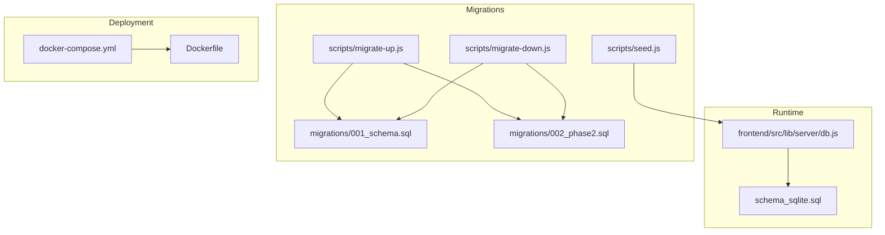
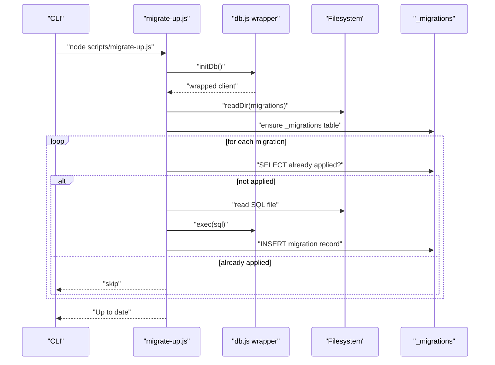
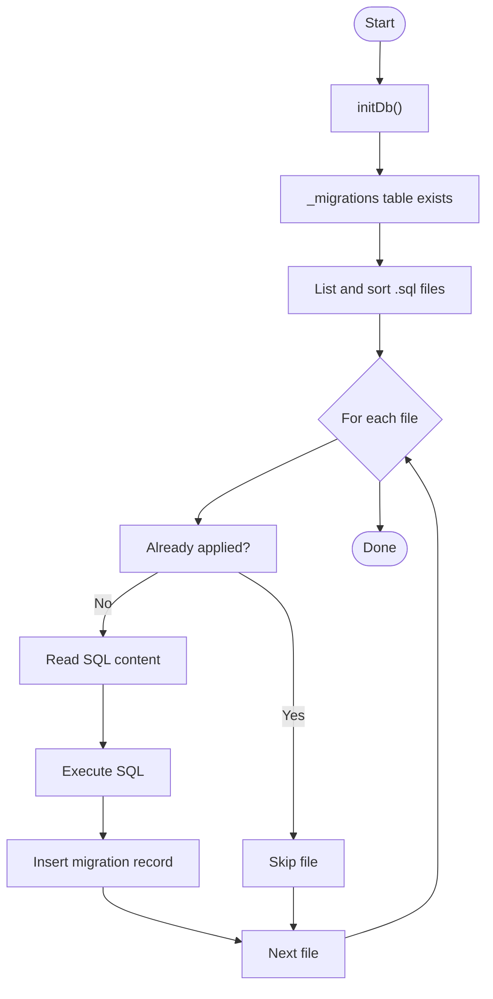
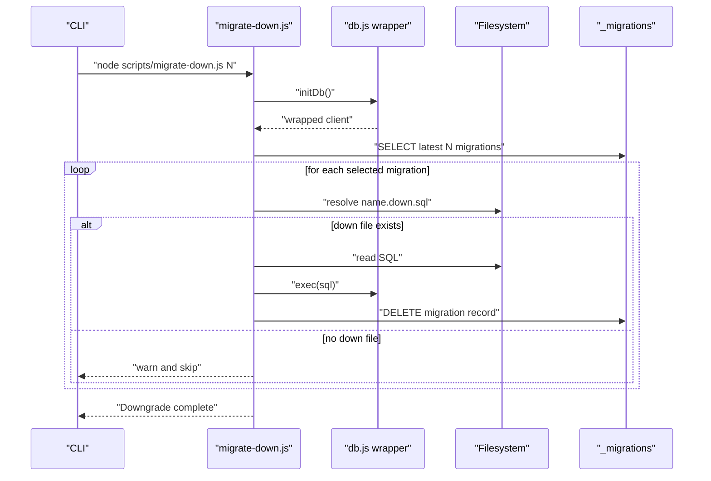
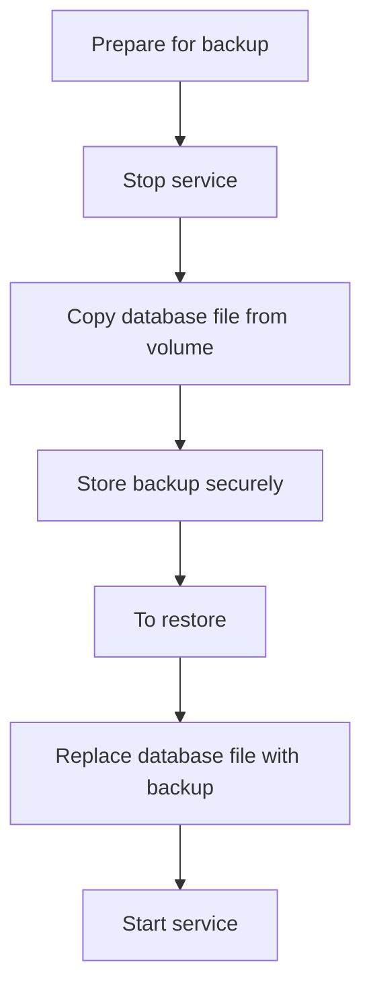
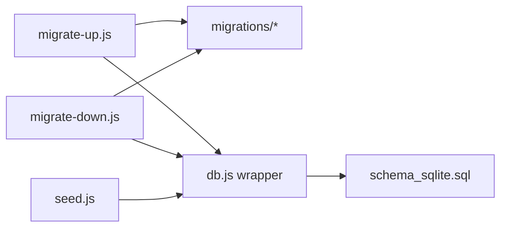

# Database Migration & Management

<cite>
**Referenced Files in This Document**
- [migrations/001_schema.sql](file://migrations/001_schema.sql)
- [migrations/002_phase2.sql](file://migrations/002_phase2.sql)
- [scripts/migrate-up.js](file://scripts/migrate-up.js)
- [scripts/migrate-down.js](file://scripts/migrate-down.js)
- [scripts/seed.js](file://scripts/seed.js)
- [schema_sqlite.sql](file://schema_sqlite.sql)
- [frontend/src/lib/server/db.js](file://frontend/src/lib/server/db.js)
- [docker-compose.yml](file://docker-compose.yml)
- [Dockerfile](file://Dockerfile)
- [frontend/check_db.cjs](file://frontend/check_db.cjs)
- [update_db.js](file://update_db.js)
</cite>

## Table of Contents
1. [Introduction](#introduction)
2. [Project Structure](#project-structure)
3. [Core Components](#core-components)
4. [Architecture Overview](#architecture-overview)
5. [Detailed Component Analysis](#detailed-component-analysis)
6. [Dependency Analysis](#dependency-analysis)
7. [Performance Considerations](#performance-considerations)
8. [Troubleshooting Guide](#troubleshooting-guide)
9. [Conclusion](#conclusion)
10. [Appendices](#appendices)

## Introduction
This document describes VSocial’s database migration and management procedures. It covers the migration system architecture, version control, rollback mechanisms, schema evolution patterns, data transformation procedures, backward compatibility maintenance, execution and dependency management, error handling, backup and restoration, disaster recovery, performance monitoring and maintenance, deployment and zero-downtime strategies, and troubleshooting for common migration and corruption issues.

## Project Structure
The database-related assets are organized as follows:
- migrations: SQL migration files that define schema versions and domain extensions
- scripts: Node-based migration runners for applying and reverting migrations
- schema_sqlite.sql: Complete SQLite-compatible schema used by the application runtime
- frontend/src/lib/server/db.js: Unified database adapter supporting both @libsql/client and better-sqlite3
- docker-compose.yml and Dockerfile: Containerized deployment configuration
- Utility scripts for diagnostics and incremental updates

**Diagram sources**
- [frontend/src/lib/server/db.js:1-209](file://frontend/src/lib/server/db.js#L1-L209)
- [schema_sqlite.sql:1-702](file://schema_sqlite.sql#L1-L702)
- [scripts/migrate-up.js:1-57](file://scripts/migrate-up.js#L1-L57)
- [scripts/migrate-down.js:1-43](file://scripts/migrate-down.js#L1-L43)
- [scripts/seed.js:1-61](file://scripts/seed.js#L1-L61)
- [migrations/001_schema.sql:1-686](file://migrations/001_schema.sql#L1-L686)
- [migrations/002_phase2.sql:1-272](file://migrations/002_phase2.sql#L1-L272)
- [docker-compose.yml:1-27](file://docker-compose.yml#L1-L27)
- [Dockerfile:1-30](file://Dockerfile#L1-L30)

**Section sources**
- [frontend/src/lib/server/db.js:1-209](file://frontend/src/lib/server/db.js#L1-L209)
- [schema_sqlite.sql:1-702](file://schema_sqlite.sql#L1-L702)
- [scripts/migrate-up.js:1-57](file://scripts/migrate-up.js#L1-L57)
- [scripts/migrate-down.js:1-43](file://scripts/migrate-down.js#L1-L43)
- [scripts/seed.js:1-61](file://scripts/seed.js#L1-L61)
- [migrations/001_schema.sql:1-686](file://migrations/001_schema.sql#L1-L686)
- [migrations/002_phase2.sql:1-272](file://migrations/002_phase2.sql#L1-L272)
- [docker-compose.yml:1-27](file://docker-compose.yml#L1-L27)
- [Dockerfile:1-30](file://Dockerfile#L1-L30)

## Core Components
- Migration runners
  - Up runner: discovers migration files, applies them in order, and records completion in a dedicated migration log table
  - Down runner: reverts the most recent N migrations by executing companion .down.sql files and updating the migration log
- Migration log table: tracks applied migrations to prevent duplicates and enable downgrade
- Schema definition: SQLite-compatible schema used by the runtime and seeding utilities
- Database adapter: auto-detects and wraps either @libsql/client (preferred) or better-sqlite3, exposing a unified async API and enabling WAL mode for local deployments
- Seeder: inserts initial system settings and marketplace categories

Key responsibilities:
- Version control and ordering: migrations are sorted lexicographically by filename
- Idempotency: up runner skips already-applied migrations; seed uses INSERT ... ON CONFLICT semantics
- Rollback readiness: requires companion .down.sql files for each migration
- Driver abstraction: consistent transaction and error handling across drivers

**Section sources**
- [scripts/migrate-up.js:13-51](file://scripts/migrate-up.js#L13-L51)
- [scripts/migrate-down.js:15-37](file://scripts/migrate-down.js#L15-L37)
- [scripts/seed.js:27-52](file://scripts/seed.js#L27-L52)
- [frontend/src/lib/server/db.js:117-167](file://frontend/src/lib/server/db.js#L117-L167)
- [schema_sqlite.sql:6-7](file://schema_sqlite.sql#L6-L7)

## Architecture Overview
The migration system integrates runtime database initialization, migration execution, and optional schema enforcement. The diagram below maps the actual components and their interactions during migration execution.

**Diagram sources**
- [scripts/migrate-up.js:9-54](file://scripts/migrate-up.js#L9-L54)
- [frontend/src/lib/server/db.js:117-167](file://frontend/src/lib/server/db.js#L117-L167)

**Section sources**
- [scripts/migrate-up.js:1-57](file://scripts/migrate-up.js#L1-L57)
- [frontend/src/lib/server/db.js:1-209](file://frontend/src/lib/server/db.js#L1-L209)

## Detailed Component Analysis

### Migration Execution Engine
- Discovery and ordering: reads migrations directory, filters .sql files, sorts filenames
- Idempotency: checks migration log before applying
- Atomicity: executes each migration script as a single transaction block
- Logging: records applied migrations with timestamps
- Error handling: exits immediately on failure with detailed error messages

**Diagram sources**
- [scripts/migrate-up.js:22-51](file://scripts/migrate-up.js#L22-L51)

**Section sources**
- [scripts/migrate-up.js:1-57](file://scripts/migrate-up.js#L1-L57)

### Rollback Mechanism
- Down runner selects the N most recent migrations from the log
- For each selected migration, looks for a companion .down.sql file
- Executes the down script and removes the migration record
- Continues until N migrations are reverted or no companion file exists

**Diagram sources**
- [scripts/migrate-down.js:9-39](file://scripts/migrate-down.js#L9-L39)

**Section sources**
- [scripts/migrate-down.js:1-43](file://scripts/migrate-down.js#L1-L43)

### Schema Evolution Patterns
- Domain-driven migrations: new capabilities are introduced via ALTER TABLE and CREATE TABLE statements grouped by functional domains
- Index coverage: adds composite and partial indexes to optimize queries for common filters and time windows
- Data enrichment: extends existing tables with new columns (e.g., privacy levels, scheduling, verification flags)
- Compatibility: maintains backward compatibility by adding optional columns and default values

Examples of evolution patterns visible in the migration files:
- Adding columns with defaults and indexes for performance
- Creating new domain tables (e.g., messaging enhancements, groups, pages)
- Introducing specialized indexes for scheduled posts and active content

**Section sources**
- [migrations/001_schema.sql:11-686](file://migrations/001_schema.sql#L11-L686)
- [migrations/002_phase2.sql:12-272](file://migrations/002_phase2.sql#L12-L272)

### Data Transformation Procedures
- Incremental updates: small scripts can add missing tables or columns when upgrading an existing database
- Seed data: populates initial system settings and marketplace categories with conflict handling to avoid duplication

Practical examples:
- Adding a missing reactions table to legacy databases
- Inserting seed rows with ON CONFLICT semantics

**Section sources**
- [update_db.js:1-14](file://update_db.js#L1-L14)
- [scripts/seed.js:14-52](file://scripts/seed.js#L14-L52)

### Backward Compatibility Maintenance
- Optional columns: new fields are added with defaults to preserve existing data
- Conflict-safe seeding: uses INSERT ... ON CONFLICT to avoid errors on repeated runs
- Graceful fallback: database adapter supports two drivers, ensuring operation under varied environments

**Section sources**
- [migrations/002_phase2.sql:12-49](file://migrations/002_phase2.sql#L12-L49)
- [scripts/seed.js:27-51](file://scripts/seed.js#L27-L51)
- [frontend/src/lib/server/db.js:120-167](file://frontend/src/lib/server/db.js#L120-L167)

### Migration Dependencies and Ordering
- Filename-based ordering: migrations are applied in lexicographic order of filenames
- Companion files: down migrations rely on .down.sql files named after the up migration
- Idempotent application: the migration log prevents reapplication of the same migration

Operational guidance:
- Name new migration files with a numeric prefix followed by a descriptive label
- Provide a corresponding .down.sql file for each up migration to enable safe rollbacks

**Section sources**
- [scripts/migrate-up.js:29-31](file://scripts/migrate-up.js#L29-L31)
- [scripts/migrate-down.js:20-25](file://scripts/migrate-down.js#L20-L25)

### Error Handling Strategies
- Immediate failure on migration errors: the up runner exits with a non-zero code upon encountering an error
- Detailed logging: prints the failing file and error message for quick diagnosis
- Transactional boundaries: each migration is executed as a single transaction block; the adapter supports transaction wrappers

**Section sources**
- [scripts/migrate-up.js:43-50](file://scripts/migrate-up.js#L43-L50)
- [frontend/src/lib/server/db.js:60-71](file://frontend/src/lib/server/db.js#L60-L71)

### Database Backup, Restoration, and Disaster Recovery
- Local SQLite storage: the application uses a SQLite database file whose path is configurable via environment variables
- Volume-backed persistence: Docker Compose mounts a persistent volume for the data directory, ensuring durability across container restarts
- Recommended backup procedure:
  - Stop the service
  - Copy the database file from the mounted volume path
  - Store the copy securely offsite
- Restoration procedure:
  - Replace the database file with the backup copy
  - Restart the service
- Disaster recovery:
  - Use the schema file to recreate the database structure if the data file becomes corrupted
  - Apply migrations to bring the schema to the desired version

**Diagram sources**
- [docker-compose.yml:15-16](file://docker-compose.yml#L15-L16)
- [frontend/src/lib/server/db.js:16-22](file://frontend/src/lib/server/db.js#L16-L22)

**Section sources**
- [docker-compose.yml:15-16](file://docker-compose.yml#L15-L16)
- [frontend/src/lib/server/db.js:16-22](file://frontend/src/lib/server/db.js#L16-L22)

### Deployment, Zero-Downtime, and Production Safety
- Driver selection: prefers @libsql/client for remote connectivity and prebuilt support; falls back to better-sqlite3 for local deployments
- WAL mode: enables Write-Ahead Logging for improved concurrency and durability in local deployments
- Health checks: Docker Compose defines a healthcheck to monitor the API endpoint
- Production safety:
  - Always run migrations before starting the service
  - Prefer rolling upgrades with minimal downtime by coordinating with the application lifecycle
  - Keep backups prior to major schema changes

**Section sources**
- [frontend/src/lib/server/db.js:120-167](file://frontend/src/lib/server/db.js#L120-L167)
- [docker-compose.yml:18-23](file://docker-compose.yml#L18-L23)
- [Dockerfile:1-30](file://Dockerfile#L1-L30)

## Dependency Analysis
The migration system depends on:
- Filesystem for discovering migration files
- Database adapter for executing SQL and managing transactions
- Migration log table for tracking applied migrations
- Environment configuration for database path and driver selection

**Diagram sources**
- [scripts/migrate-up.js:22-51](file://scripts/migrate-up.js#L22-L51)
- [scripts/migrate-down.js:19-37](file://scripts/migrate-down.js#L19-L37)
- [scripts/seed.js:5-9](file://scripts/seed.js#L5-L9)
- [frontend/src/lib/server/db.js:192-198](file://frontend/src/lib/server/db.js#L192-L198)

**Section sources**
- [scripts/migrate-up.js:1-57](file://scripts/migrate-up.js#L1-L57)
- [scripts/migrate-down.js:1-43](file://scripts/migrate-down.js#L1-L43)
- [scripts/seed.js:1-61](file://scripts/seed.js#L1-L61)
- [frontend/src/lib/server/db.js:1-209](file://frontend/src/lib/server/db.js#L1-L209)

## Performance Considerations
- Index coverage: migrations introduce indexes for common filters (e.g., scheduled posts, active content)
- Partitioning: advanced partitioning strategies can be considered for high-volume tables (e.g., views)
- WAL and pragmas: local deployments benefit from WAL mode and tuned pragmas for concurrency and durability
- Monitoring: track slow queries and index usage; periodically review and adjust indexes based on workload

[No sources needed since this section provides general guidance]

## Troubleshooting Guide
Common issues and resolutions:
- Migration fails with an error:
  - Review the error message printed by the up runner to identify the failing migration and SQL statement
  - Fix the migration or its prerequisites, then rerun the up runner
- Migration already applied:
  - The up runner skips already-applied migrations; verify the migration log table and filenames
- No down file found:
  - The down runner warns and skips migrations without companion .down.sql files; create the missing down file
- Database not initialized:
  - Ensure initDb() is called before running migrations or accessing the database
- Driver not available:
  - Install @libsql/client or better-sqlite3 as indicated by the initialization logs
- Schema mismatch:
  - Use the schema file to recreate the database structure, then reapply migrations
- Diagnose missing tables:
  - Use the provided diagnostic script to inspect table definitions in the database

**Section sources**
- [scripts/migrate-up.js:43-50](file://scripts/migrate-up.js#L43-L50)
- [scripts/migrate-down.js:22-25](file://scripts/migrate-down.js#L22-L25)
- [frontend/src/lib/server/db.js:163-167](file://frontend/src/lib/server/db.js#L163-L167)
- [frontend/check_db.cjs:1-4](file://frontend/check_db.cjs#L1-L4)
- [update_db.js:1-14](file://update_db.js#L1-L14)

## Conclusion
VSocial’s migration system provides a robust, driver-agnostic framework for evolving the database schema safely. By leveraging ordered migrations, a migration log, and companion down scripts, teams can confidently manage schema changes, maintain backward compatibility, and recover from failures. Combined with WAL mode, health checks, and volume-backed persistence, the system supports reliable production deployments and operational continuity.

## Appendices
- Migration file naming convention: use numeric prefixes followed by a descriptive label (e.g., 001_initial.sql, 002_add_features.sql)
- Down migration requirement: always pair an up migration with a .down.sql file to enable rollbacks
- Seed data: use the seeder to populate initial configuration and categories; it handles conflicts gracefully

[No sources needed since this section provides general guidance]