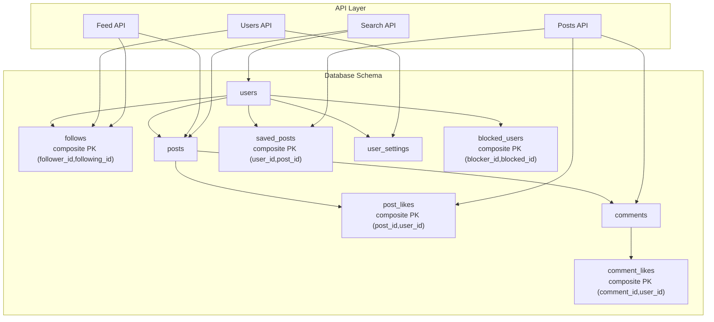
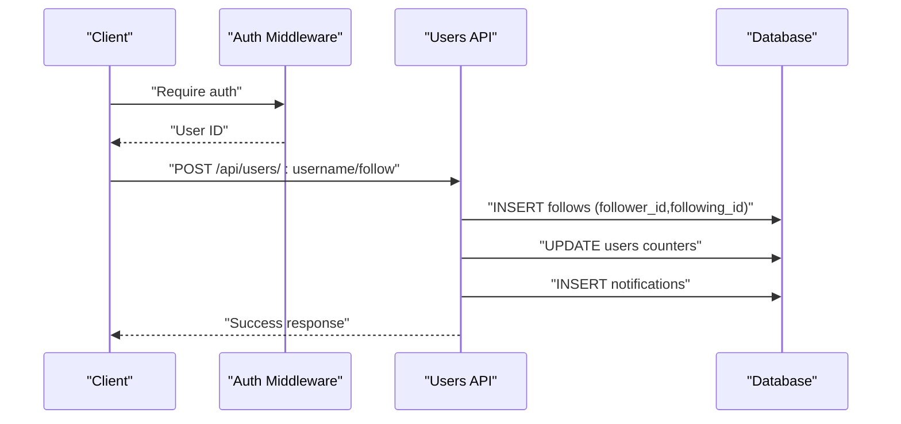
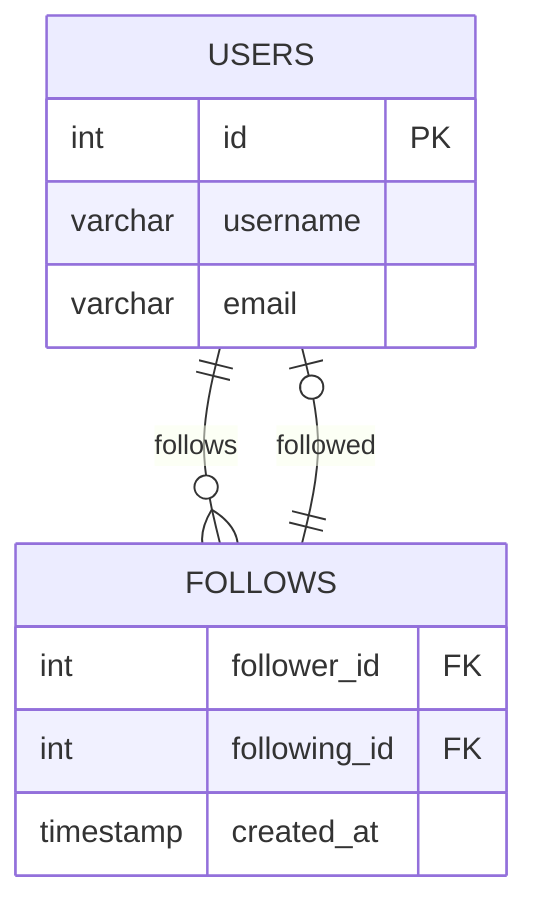
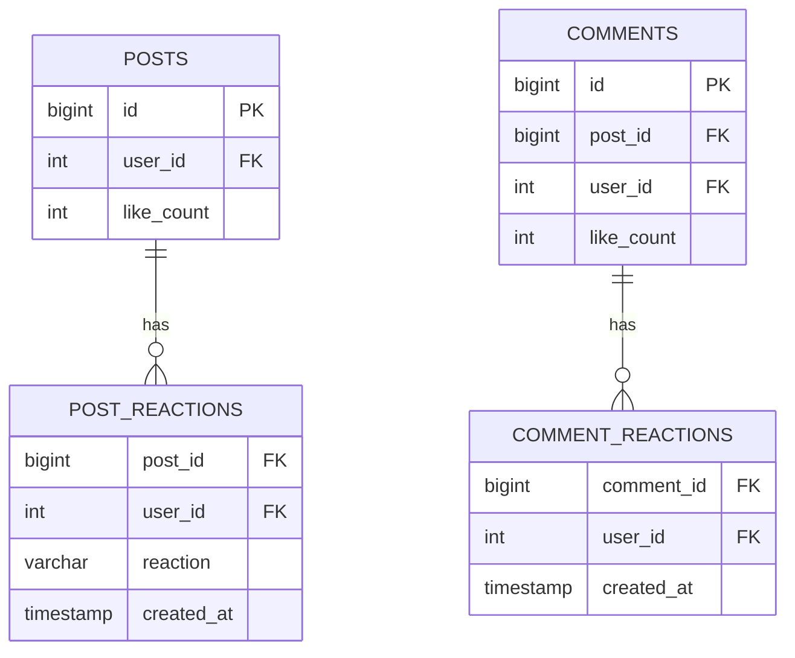
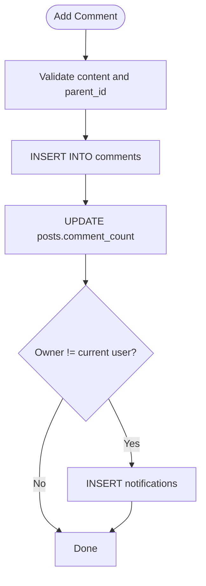
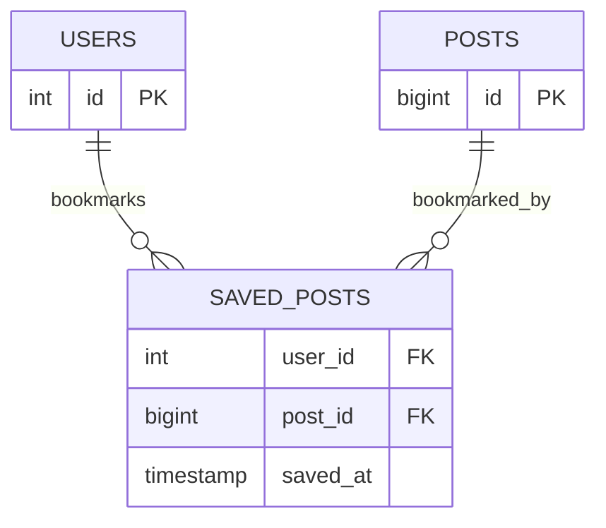
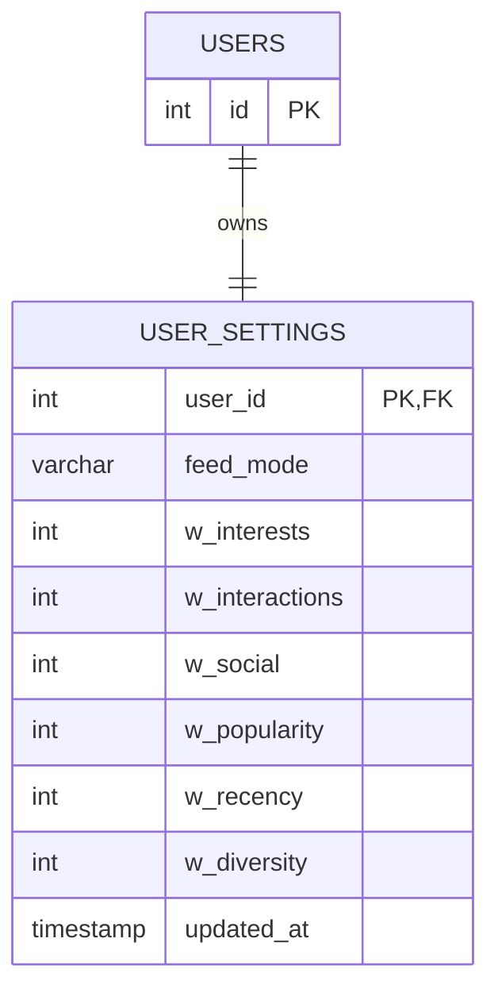
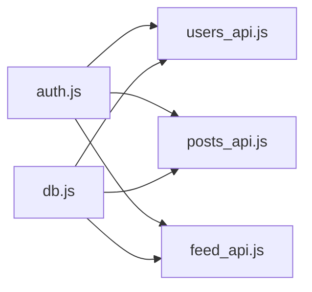

# Relationship & Association Models

<cite>
**Referenced Files in This Document**
- [001_schema.sql](file://migrations/001_schema.sql)
- [002_phase2.sql](file://migrations/002_phase2.sql)
- [schema_sqlite.sql](file://schema_sqlite.sql)
- [users_api.js](file://frontend/src/routes/api/users/[...path]/+server.js)
- [posts_api.js](file://frontend/src/routes/api/posts/[...path]/+server.js)
- [feed_api.js](file://frontend/src/routes/api/feed/[...path]/+server.js)
- [search_api.js](file://frontend/src/routes/api/search/+server.js)
- [db.js](file://frontend/src/lib/server/db.js)
- [auth.js](file://frontend/src/lib/server/auth.js)
</cite>

## Table of Contents
1. [Introduction](#introduction)
2. [Project Structure](#project-structure)
3. [Core Components](#core-components)
4. [Architecture Overview](#architecture-overview)
5. [Detailed Component Analysis](#detailed-component-analysis)
6. [Dependency Analysis](#dependency-analysis)
7. [Performance Considerations](#performance-considerations)
8. [Troubleshooting Guide](#troubleshooting-guide)
9. [Conclusion](#conclusion)

## Introduction
This document explains VSocial’s relationship and association models: follows, likes, comments, saved posts, and user settings. It covers many-to-many relationships, junction tables, composite primary keys, privacy-aware constraints, and the mechanics of social graph management. It also documents reaction systems for posts and comments, engagement tracking, bookmarking, saved content management, and user preferences. Finally, it outlines relationship constraints, cascading operations, data consistency measures, and practical examples of complex queries with performance optimization techniques.

## Project Structure
The relationship models are defined in the database schema and consumed by SvelteKit API routes. The backend uses a thin database abstraction layer and JWT-based authentication to enforce row-level security and privacy.

**Diagram sources**
- [001_schema.sql:90-204](file://migrations/001_schema.sql#L90-L204)
- [users_api.js:114-132](file://frontend/src/routes/api/users/[...path]/+server.js#L114-L132)
- [posts_api.js:248-280](file://frontend/src/routes/api/posts/[...path]/+server.js#L248-L280)
- [feed_api.js:120-214](file://frontend/src/routes/api/feed/[...path]/+server.js#L120-L214)
- [search_api.js:25-55](file://frontend/src/routes/api/search/+server.js#L25-L55)

**Section sources**
- [001_schema.sql:90-204](file://migrations/001_schema.sql#L90-L204)
- [users_api.js:114-132](file://frontend/src/routes/api/users/[...path]/+server.js#L114-L132)
- [posts_api.js:248-280](file://frontend/src/routes/api/posts/[...path]/+server.js#L248-L280)
- [feed_api.js:120-214](file://frontend/src/routes/api/feed/[...path]/+server.js#L120-L214)
- [search_api.js:25-55](file://frontend/src/routes/api/search/+server.js#L25-L55)

## Core Components
- Many-to-many follows: junction table with composite primary key and cascading deletes.
- Reaction system for posts and comments: separate junction tables with composite primary keys and counters on parent entities.
- Saved posts: bookmarking via composite primary key.
- User settings: per-user preferences for feed algorithm and weights.
- Privacy-aware constraints: row-level security policies and privacy filters in queries.

Key schema elements:
- Composite primary keys: follows, post_likes, comment_likes, saved_posts, blocked_users.
- Cascading deletes: foreign keys configured to maintain referential integrity.
- Indexes: optimized lookups for user feeds, notifications, and privacy filtering.

**Section sources**
- [001_schema.sql:90-204](file://migrations/001_schema.sql#L90-L204)
- [001_schema.sql:56-66](file://migrations/001_schema.sql#L56-L66)
- [001_schema.sql:601-642](file://migrations/001_schema.sql#L601-L642)
- [schema_sqlite.sql:95-101](file://schema_sqlite.sql#L95-L101)
- [schema_sqlite.sql:139-145](file://schema_sqlite.sql#L139-L145)
- [schema_sqlite.sql:169-177](file://schema_sqlite.sql#L169-L177)
- [schema_sqlite.sql:179-184](file://schema_sqlite.sql#L179-L184)

## Architecture Overview
The backend exposes REST-like endpoints that manipulate relationship records and counters. Authentication ensures only authorized users can modify relationships. Row-level security policies restrict sensitive tables to owners or involved parties.

**Diagram sources**
- [users_api.js:202-220](file://frontend/src/routes/api/users/[...path]/+server.js#L202-L220)
- [auth.js:15-44](file://frontend/src/lib/server/auth.js#L15-L44)

**Section sources**
- [users_api.js:202-220](file://frontend/src/routes/api/users/[...path]/+server.js#L202-L220)
- [auth.js:15-44](file://frontend/src/lib/server/auth.js#L15-L44)

## Detailed Component Analysis

### Follows and Social Graph Management
- Model: Many-to-many via junction table with composite primary key (follower_id, following_id).
- Constraints: Foreign keys to users with cascading deletes to keep graph consistent.
- Index: Nonclustered index on following_id for efficient reverse lookups.
- Privacy-aware: Follows are visible to both parties; blocking prevents follow attempts.

**Diagram sources**
- [001_schema.sql:90-95](file://migrations/001_schema.sql#L90-L95)
- [001_schema.sql:97](file://migrations/001_schema.sql#L97)

Follow/unfollow mechanics:
- POST /api/users/:username/follow inserts a record if not present, increments counters, and sends a notification.
- DELETE /api/users/:username/follow removes the record and decrements counters.

Privacy-awareness:
- Blocked users cannot follow each other; blocked lists prevent visibility and interactions.

**Section sources**
- [001_schema.sql:90-95](file://migrations/001_schema.sql#L90-L95)
- [001_schema.sql:97](file://migrations/001_schema.sql#L97)
- [001_schema.sql:68-73](file://migrations/001_schema.sql#L68-L73)
- [users_api.js:202-220](file://frontend/src/routes/api/users/[...path]/+server.js#L202-L220)
- [users_api.js:266-278](file://frontend/src/routes/api/users/[...path]/+server.js#L266-L278)

### Likes and Reactions
- Post reactions: junction table with composite primary key (post_id, user_id) and a counter on posts.
- Comment reactions: junction table with composite primary key (comment_id, user_id) and a counter on comments.
- Reaction types: configurable (e.g., “like”) with updates on change.

**Diagram sources**
- [001_schema.sql:143-149](file://migrations/001_schema.sql#L143-L149)
- [001_schema.sql:173-178](file://migrations/001_schema.sql#L173-L178)
- [schema_sqlite.sql:139-155](file://schema_sqlite.sql#L139-L155)
- [schema_sqlite.sql:169-177](file://schema_sqlite.sql#L169-L177)

Engagement tracking:
- Increment/decrement counters on insert/delete.
- Notifications generated when a post/comment is liked by another user.

Sentiment analysis:
- Not implemented in the schema; reactions are stored as-is. Future extensions could add sentiment scoring via external services.

**Section sources**
- [001_schema.sql:143-149](file://migrations/001_schema.sql#L143-L149)
- [001_schema.sql:173-178](file://migrations/001_schema.sql#L173-L178)
- [schema_sqlite.sql:139-155](file://schema_sqlite.sql#L139-L155)
- [schema_sqlite.sql:169-177](file://schema_sqlite.sql#L169-L177)
- [posts_api.js:248-268](file://frontend/src/routes/api/posts/[...path]/+server.js#L248-L268)
- [posts_api.js:312-325](file://frontend/src/routes/api/posts/[...path]/+server.js#L312-L325)

### Comments and Nested Threads
- Comments are linked to posts and can be nested via parent_id.
- Comment reactions tracked separately with composite primary key.
- Counters maintained on parent post.

**Diagram sources**
- [001_schema.sql:161-169](file://migrations/001_schema.sql#L161-L179)
- [schema_sqlite.sql:157-167](file://schema_sqlite.sql#L157-L167)
- [posts_api.js:282-300](file://frontend/src/routes/api/posts/[...path]/+server.js#L282-L300)

**Section sources**
- [001_schema.sql:161-169](file://migrations/001_schema.sql#L161-L179)
- [schema_sqlite.sql:157-167](file://schema_sqlite.sql#L157-L167)
- [posts_api.js:282-300](file://frontend/src/routes/api/posts/[...path]/+server.js#L282-L300)

### Saved Posts and Bookmarking
- Bookmarking implemented via junction table with composite primary key (user_id, post_id).
- API endpoints support save/unsave operations.

**Diagram sources**
- [001_schema.sql:199-204](file://migrations/001_schema.sql#L199-L204)
- [schema_sqlite.sql:179-184](file://schema_sqlite.sql#L179-L184)

**Section sources**
- [001_schema.sql:199-204](file://migrations/001_schema.sql#L199-L204)
- [schema_sqlite.sql:179-184](file://schema_sqlite.sql#L179-L184)
- [posts_api.js:276-280](file://frontend/src/routes/api/posts/[...path]/+server.js#L276-L280)

### User Settings and Preferences
- Single-row settings per user with defaults and update timestamps.
- Feed preferences include algorithm mode and weighted factors for intelligent feed.

**Diagram sources**
- [001_schema.sql:56-66](file://migrations/001_schema.sql#L56-L66)
- [schema_sqlite.sql:70-93](file://schema_sqlite.sql#L70-L93)

**Section sources**
- [001_schema.sql:56-66](file://migrations/001_schema.sql#L56-L66)
- [schema_sqlite.sql:70-93](file://schema_sqlite.sql#L70-L93)
- [feed_api.js:53-72](file://frontend/src/routes/api/feed/[...path]/+server.js#L53-L72)
- [feed_api.js:219-238](file://frontend/src/routes/api/feed/[...path]/+server.js#L219-L238)

### Privacy-Aware Relationships
- Row-level security policies restrict access to sensitive tables.
- Privacy filters in queries ensure only public or permitted content is shown.
- Blocking prevents interactions and visibility.

**Section sources**
- [001_schema.sql:601-642](file://migrations/001_schema.sql#L601-L642)
- [001_schema.sql:68-73](file://migrations/001_schema.sql#L68-L73)
- [users_api.js:76-86](file://frontend/src/routes/api/users/[...path]/+server.js#L76-L86)
- [search_api.js:25-55](file://frontend/src/routes/api/search/+server.js#L25-L55)

## Dependency Analysis
- API routes depend on the database abstraction layer for prepared statements and transactions.
- Authentication middleware validates sessions and injects user context.
- Privacy and security rely on database policies and explicit WHERE clauses.

**Diagram sources**
- [auth.js:15-44](file://frontend/src/lib/server/auth.js#L15-L44)
- [db.js:169-172](file://frontend/src/lib/server/db.js#L169-L172)
- [users_api.js:54-67](file://frontend/src/routes/api/users/[...path]/+server.js#L54-L67)
- [posts_api.js:55-70](file://frontend/src/routes/api/posts/[...path]/+server.js#L55-L70)
- [feed_api.js:47-51](file://frontend/src/routes/api/feed/[...path]/+server.js#L47-L51)

**Section sources**
- [auth.js:15-44](file://frontend/src/lib/server/auth.js#L15-L44)
- [db.js:169-172](file://frontend/src/lib/server/db.js#L169-L172)
- [users_api.js:54-67](file://frontend/src/routes/api/users/[...path]/+server.js#L54-L67)
- [posts_api.js:55-70](file://frontend/src/routes/api/posts/[...path]/+server.js#L55-L70)
- [feed_api.js:47-51](file://frontend/src/routes/api/feed/[...path]/+server.js#L47-L51)

## Performance Considerations
- Composite primary keys prevent duplicates and enable fast lookups for relationships.
- Indexes on frequently filtered columns (e.g., following_id, post_id, created_at) improve query performance.
- Prepared statements and batched operations reduce overhead.
- Feed algorithms compute scores client-side and paginate using cursors to minimize scans.
- WAL mode and foreign keys enabled for consistency and speed.

Practical tips:
- Use EXPLAIN QUERY PLAN to analyze slow queries.
- Prefer EXISTS or JOINs with LIMIT for presence checks (e.g., is_following).
- Batch counters updates (e.g., increment/decrement) in transactions where possible.

[No sources needed since this section provides general guidance]

## Troubleshooting Guide
Common issues and resolutions:
- Duplicate follow entries: composite primary key prevents insertion; check for existing records before insert.
- Unauthorized actions: ensure requireAuth is used; verify user_id matches resource ownership.
- Privacy violations: confirm row-level security policies and WHERE clauses for public/private content.
- Counter inconsistencies: verify increment/decrement logic on insert/delete; handle edge cases (e.g., negative counts).

**Section sources**
- [users_api.js:208-210](file://frontend/src/routes/api/users/[...path]/+server.js#L208-L210)
- [users_api.js:271-272](file://frontend/src/routes/api/users/[...path]/+server.js#L271-L272)
- [posts_api.js:252-256](file://frontend/src/routes/api/posts/[...path]/+server.js#L252-L256)
- [posts_api.js:370-374](file://frontend/src/routes/api/posts/[...path]/+server.js#L370-L374)

## Conclusion
VSocial’s relationship models are designed around normalized relational tables with composite primary keys to enforce uniqueness and integrity. The API layer cleanly separates concerns: authentication, privacy enforcement, and data manipulation. Reaction systems, saved posts, and user preferences are implemented efficiently with counters and indexes. The result is a scalable foundation for social graph management, engagement tracking, and personalized feeds.