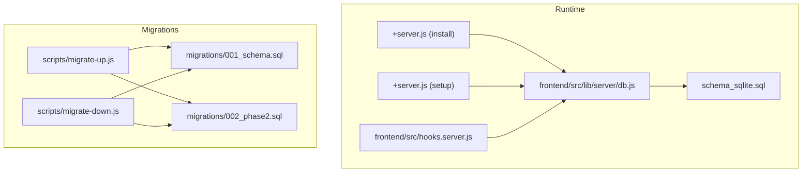
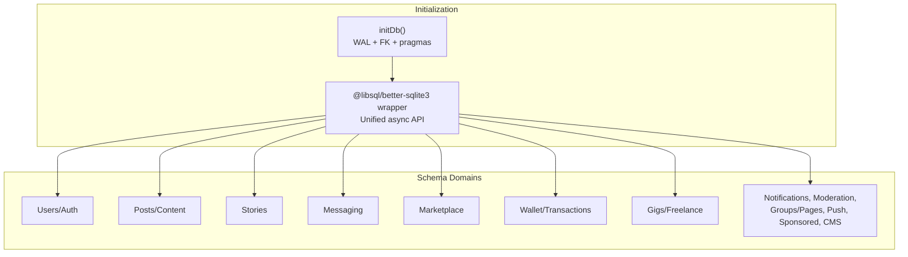
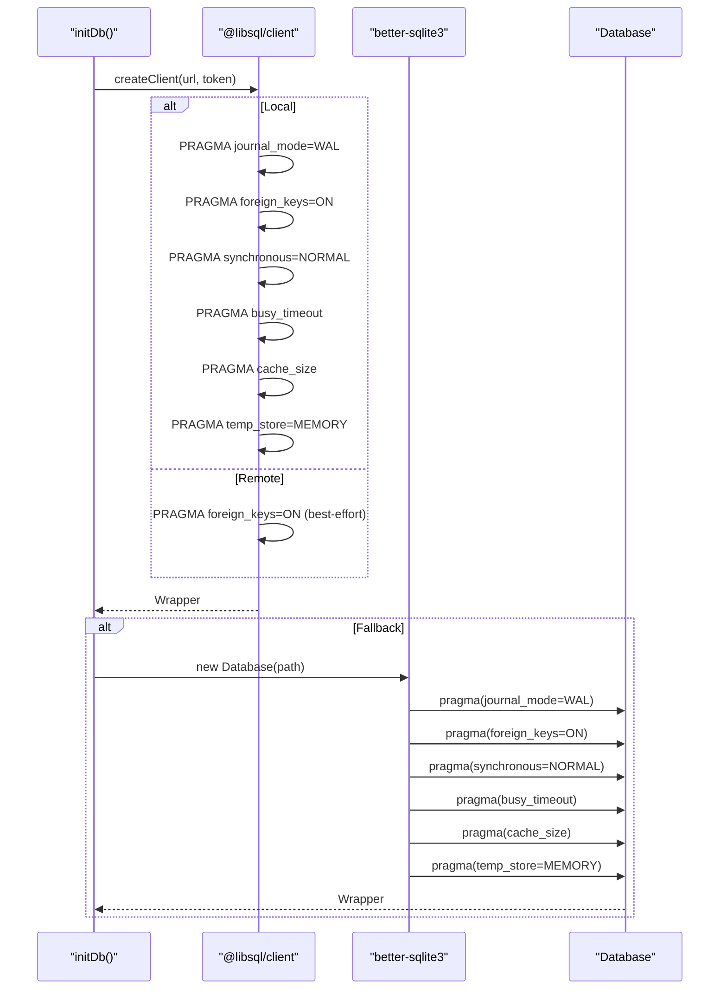
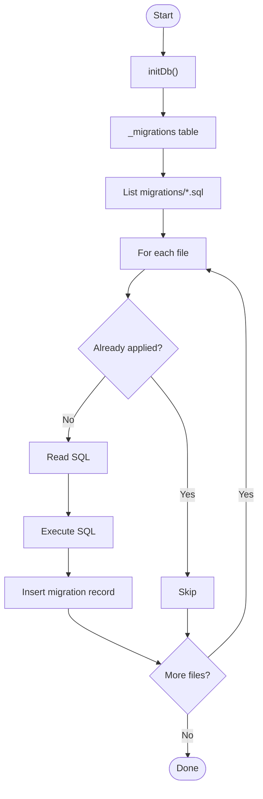
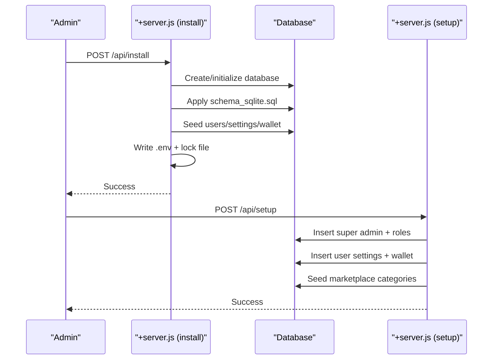
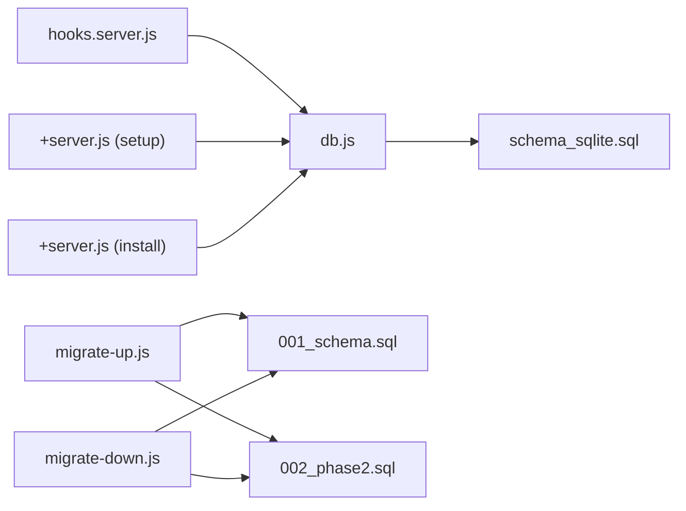

# Schema Overview & Architecture

<cite>
**Referenced Files in This Document**
- [schema_sqlite.sql](file://schema_sqlite.sql)
- [001_schema.sql](file://migrations/001_schema.sql)
- [002_phase2.sql](file://migrations/002_phase2.sql)
- [db.js](file://frontend/src/lib/server/db.js)
- [hooks.server.js](file://frontend/src/hooks.server.js)
- [+server.js (setup)](file://frontend/src/routes/api/setup/+server.js)
- [+server.js (install)](file://frontend/src/routes/api/install/+server.js)
- [migrate-up.js](file://scripts/migrate-up.js)
- [migrate-down.js](file://scripts/migrate-down.js)
</cite>

## Table of Contents
1. [Introduction](#introduction)
2. [Project Structure](#project-structure)
3. [Core Components](#core-components)
4. [Architecture Overview](#architecture-overview)
5. [Detailed Component Analysis](#detailed-component-analysis)
6. [Dependency Analysis](#dependency-analysis)
7. [Performance Considerations](#performance-considerations)
8. [Troubleshooting Guide](#troubleshooting-guide)
9. [Conclusion](#conclusion)
10. [Appendices](#appendices)

## Introduction
This document presents the VSocial database schema overview and architectural design. It explains the overall database structure, domain organization, and table relationships. It documents the libSQL/SQLite compatibility approach and engine-specific optimizations, details the modular domain-based organization (Users/Auth, Posts/Content, Stories, Messaging, Marketplace, Wallet, Gigs, etc.), indexing strategies, foreign key constraints, and referential integrity enforcement. It also covers database initialization settings, WAL mode configuration, foreign key enforcement, architectural diagrams showing domain boundaries and inter-domain relationships, performance considerations, scalability limitations, and migration strategy.

## Project Structure
The database layer is implemented with a unified adapter that supports both libSQL and SQLite drivers. Initialization sets up WAL mode, foreign keys, and other pragmas. The schema is defined in a single SQLite-compatible SQL file, while migrations demonstrate PostgreSQL-compatible schema and policies for comparison.

Key elements:
- Driver auto-detection and initialization with WAL and foreign key enforcement
- Single-schema SQLite file for runtime use
- Migration scripts for PostgreSQL baseline and phase-2 enhancements
- Installation and setup APIs that bootstrap the database and seed data



**Diagram sources**
- [db.js:117-167](file://frontend/src/lib/server/db.js#L117-L167)
- [schema_sqlite.sql:1-702](file://schema_sqlite.sql#L1-L702)
- [+server.js (setup):1-72](file://frontend/src/routes/api/setup/+server.js#L1-L72)
- [+server.js (install):1-175](file://frontend/src/routes/api/install/+server.js#L1-L175)
- [hooks.server.js:1-179](file://frontend/src/hooks.server.js#L1-L179)
- [001_schema.sql:1-686](file://migrations/001_schema.sql#L1-L686)
- [002_phase2.sql:1-272](file://migrations/002_phase2.sql#L1-L272)
- [migrate-up.js:1-57](file://scripts/migrate-up.js#L1-L57)
- [migrate-down.js:1-43](file://scripts/migrate-down.js#L1-L43)

**Section sources**
- [db.js:117-167](file://frontend/src/lib/server/db.js#L117-L167)
- [schema_sqlite.sql:1-702](file://schema_sqlite.sql#L1-L702)
- [001_schema.sql:1-686](file://migrations/001_schema.sql#L1-L686)
- [002_phase2.sql:1-272](file://migrations/002_phase2.sql#L1-L272)
- [hooks.server.js:1-179](file://frontend/src/hooks.server.js#L1-L179)
- [migrate-up.js:1-57](file://scripts/migrate-up.js#L1-L57)
- [migrate-down.js:1-43](file://scripts/migrate-down.js#L1-L43)

## Core Components
- Database adapter and initialization
  - Auto-detects @libsql/client or better-sqlite3
  - Enables WAL mode, foreign keys, synchronous, busy timeout, cache size, and temp store
  - Provides unified async API for prepare/run/get/all/exec/transaction/close
- Schema and seeding
  - SQLite-compatible schema with domain blocks, indexes, and seed data
  - Separate PostgreSQL migration baseline and phase-2 enhancements
- Installation and setup
  - Install API creates database, applies schema, seeds initial data, writes .env, and lock file
  - Setup API bootstraps super admin and system settings
- Migration runner
  - Applies migration files sequentially and tracks applied migrations
  - Supports downgrade by reading .down.sql files per migration

**Section sources**
- [db.js:117-167](file://frontend/src/lib/server/db.js#L117-L167)
- [db.js:192-198](file://frontend/src/lib/server/db.js#L192-L198)
- [schema_sqlite.sql:1-702](file://schema_sqlite.sql#L1-L702)
- [001_schema.sql:1-686](file://migrations/001_schema.sql#L1-L686)
- [002_phase2.sql:1-272](file://migrations/002_phase2.sql#L1-L272)
- [+server.js (install):60-175](file://frontend/src/routes/api/install/+server.js#L60-L175)
- [+server.js (setup):16-72](file://frontend/src/routes/api/setup/+server.js#L16-L72)
- [migrate-up.js:1-57](file://scripts/migrate-up.js#L1-L57)
- [migrate-down.js:1-43](file://scripts/migrate-down.js#L1-L43)

## Architecture Overview
The database architecture centers on a unified adapter that ensures compatibility with both libSQL and SQLite. Initialization routines enforce WAL mode and foreign key constraints. The schema organizes functionality into modular domains with explicit indexes and referential integrity. Migrations provide a controlled evolution path, while installation and setup APIs streamline bootstrap.



**Diagram sources**
- [db.js:117-167](file://frontend/src/lib/server/db.js#L117-L167)
- [schema_sqlite.sql:10-702](file://schema_sqlite.sql#L10-L702)

## Detailed Component Analysis

### Domain Model Overview
The schema defines 17 distinct domains covering users, authentication, content, stories, messaging, notifications, marketplace, wallet, gigs, moderation, system settings, OAuth, privacy/blocking, highlights/check-ins, groups/pages, push notifications, sponsored posts, and CMS pages. Each domain encapsulates related tables with appropriate foreign keys and indexes.

```mermaid
erDiagram
USERS {
int id PK
varchar username UK
varchar email UK
varchar password_hash
varchar role
boolean is_active
boolean is_verified
boolean is_banned
int follower_count
int following_count
int post_count
numeric wallet_credits
real wallet_balance
varchar privacy_level
datetime created_at
datetime last_seen_at
}
USER_SESSIONS {
int id PK
int user_id FK
text token_hash
varchar ip_address
varchar user_agent
datetime created_at
datetime expires_at
}
USER_SETTINGS {
int user_id PK FK
varchar theme
varchar language
boolean notification_email
boolean notification_push
boolean notification_dms
varchar feed_mode
varchar profile_visibility
varchar allow_dms
datetime updated_at
}
POSTS {
int id PK
int user_id FK
text body
varchar privacy
int like_count
int comment_count
int share_count
boolean is_pinned
boolean is_promoted
float promotion_score
varchar mood
varchar privacy_level
datetime scheduled_at
varchar status
datetime deleted_at
datetime created_at
datetime updated_at
}
COMMENTS {
int id PK
int post_id FK
int user_id FK
int parent_id FK
text body
int like_count
datetime deleted_at
datetime created_at
}
MESSAGES_NEW {
int id PK
int conversation_id FK
int sender_id FK
text body
varchar voice_url
int voice_duration
varchar media_url
varchar media_type
int reply_to_id FK
boolean is_deleted
datetime created_at
}
CONVERSATIONS {
int id PK
varchar type
varchar group_name
varchar group_avatar_url
int creator_id FK
datetime last_message_at
datetime created_at
}
CONVERSATION_PARTICIPANTS {
int conversation_id PK FK
int user_id PK FK
datetime joined_at
boolean is_admin
}
WALLET_TRANSACTIONS {
int id PK
int user_id FK
varchar type
real amount
text description
varchar status
datetime created_at
}
WALLETS {
int id PK
int user_id UK FK
real balance
datetime created_at
datetime updated_at
}
MARKETPLACE_CATEGORIES {
int id PK
varchar name UK
int parent_id FK
varchar icon
varchar slug UK
}
MARKETPLACE_LISTINGS {
int id PK
int user_id FK
int category_id FK
varchar title
text description
numeric price
varchar currency
varchar condition
varchar location
varchar status
int view_count
boolean flagged
text flag_reason
int fraud_score
datetime created_at
datetime expires_at
}
GIGS {
int id PK
int user_id FK
text title
text description
varchar category
varchar type
real price_min
real price_max
varchar currency
text tags
varchar status
int apply_count
datetime created_at
datetime expires_at
}
REPORTS {
int id PK
int reporter_id FK
varchar entity_type
int entity_id
text reason
varchar status
datetime created_at
}
SYSTEM_SETTINGS {
varchar key PK
text value
}
EMAIL_TOKENS {
int id PK
int user_id FK
varchar token UK
varchar type
boolean used
datetime created_at
datetime expires_at
}
OAUTH_ACCOUNTS {
int id PK
int user_id FK
varchar provider
varchar provider_uid
varchar email
varchar display_name
varchar avatar_url
text access_token
text refresh_token
datetime created_at
}
BLOCKED_USERS {
int blocker_id PK FK
int blocked_id PK FK
datetime created_at
}
STORY_HIGHLIGHTS {
int id PK
int user_id FK
varchar title
varchar cover_url
int sort_order
datetime created_at
}
GROUPS {
int id PK
varchar name
varchar slug UK
text description
varchar avatar_url
varchar cover_url
varchar privacy
int creator_id FK
int member_count
boolean is_active
datetime created_at
}
GROUP_MEMBERS {
int group_id PK FK
int user_id PK FK
varchar role
datetime joined_at
}
WEB_PUSH_SUBSCRIPTIONS {
int id PK
int user_id FK
text endpoint UK
text p256dh_key
text auth_key
varchar user_agent
datetime created_at
}
SPONSORED_POSTS {
int id PK
int advertiser_id FK
int post_id FK
varchar title
text body
varchar media_url
varchar cta_url
int target_age_min
int target_age_max
varchar target_gender
text target_interests
real budget
real spent
int impressions
int clicks
varchar status
datetime starts_at
datetime ends_at
datetime created_at
}
CMS_PAGES {
int id PK
varchar slug UK
varchar title
text body_html
int author_id FK
boolean is_published
datetime published_at
datetime created_at
datetime updated_at
}
USERS ||--o{ USER_SESSIONS : "has"
USERS ||--o{ USER_SETTINGS : "has"
USERS ||--o{ POSTS : "creates"
USERS ||--o{ COMMENTS : "writes"
USERS ||--o{ MESSAGES_NEW : "sends"
USERS ||--o{ WALLET_TRANSACTIONS : "initiates"
USERS ||--o{ WALLETS : "owns"
USERS ||--o{ MARKETPLACE_LISTINGS : "lists"
USERS ||--o{ GIGS : "posts"
USERS ||--o{ REPORTS : "files"
USERS ||--o{ EMAIL_TOKENS : "has"
USERS ||--o{ OAUTH_ACCOUNTS : "integrates"
USERS ||--o{ BLOCKED_USERS : "blocks"
USERS ||--o{ STORY_HIGHLIGHTS : "creates"
USERS ||--o{ GROUPS : "creates"
USERS ||--o{ GROUP_MEMBERS : "joins"
USERS ||--o{ WEB_PUSH_SUBSCRIPTIONS : "subscribes"
USERS ||--o{ SPONSORED_POSTS : "advertises"
USERS ||--o{ CMS_PAGES : "authors"
POSTS ||--o{ COMMENTS : "contains"
POSTS ||--o{ WALLET_TRANSACTIONS : "can reference"
POSTS ||--o{ SPONSORED_POSTS : "targets"
CONVERSATIONS ||--o{ MESSAGES_NEW : "hosts"
CONVERSATIONS ||--o{ CONVERSATION_PARTICIPANTS : "includes"
MARKETPLACE_CATEGORIES ||--o{ MARKETPLACE_LISTINGS : "classifies"
```

**Diagram sources**
- [schema_sqlite.sql:13-702](file://schema_sqlite.sql#L13-L702)

**Section sources**
- [schema_sqlite.sql:10-702](file://schema_sqlite.sql#L10-L702)

### Indexing Strategies
Indexes are strategically placed to optimize frequent queries:
- Sessions: token_hash, user_id
- Follows: following_id
- Posts: user_id with created_at DESC, scheduled_at with status filter, status with created_at DESC
- Comments: post_id with created_at
- Conversations: participant lookup
- Messages: conversation with created_at DESC
- Notifications: recipient with is_read and created_at DESC
- Marketplace: category, user, flagged
- Wallet: user with created_at DESC
- OAuth: user_id
- Blocked/snoozed: blocker_id, blocked_id
- Story highlights: user_id with sort_order
- Check-ins: user_id with created_at DESC
- Groups: slug, members user_id
- Group posts/events: group_id with created_at/date
- Push subscriptions: user_id
- Sponsored posts: status with starts/ends
- Auction/offers: seller and listing with status

These indexes align with typical read patterns for feeds, messaging, commerce, and administrative queries.

**Section sources**
- [schema_sqlite.sql:67-101](file://schema_sqlite.sql#L67-L101)
- [schema_sqlite.sql:126-167](file://schema_sqlite.sql#L126-L167)
- [schema_sqlite.sql:252-283](file://schema_sqlite.sql#L252-L283)
- [schema_sqlite.sql:353-371](file://schema_sqlite.sql#L353-L371)
- [schema_sqlite.sql:44-68](file://schema_sqlite.sql#L44-L68)
- [schema_sqlite.sql:184-191](file://schema_sqlite.sql#L184-L191)
- [schema_sqlite.sql:252-283](file://schema_sqlite.sql#L252-L283)
- [schema_sqlite.sql:353-371](file://schema_sqlite.sql#L353-L371)
- [schema_sqlite.sql:44-68](file://schema_sqlite.sql#L44-L68)
- [schema_sqlite.sql:184-191](file://schema_sqlite.sql#L184-L191)
- [schema_sqlite.sql:252-283](file://schema_sqlite.sql#L252-L283)
- [schema_sqlite.sql:353-371](file://schema_sqlite.sql#L353-L371)
- [schema_sqlite.sql:44-68](file://schema_sqlite.sql#L44-L68)
- [schema_sqlite.sql:184-191](file://schema_sqlite.sql#L184-L191)
- [schema_sqlite.sql:252-283](file://schema_sqlite.sql#L252-L283)
- [schema_sqlite.sql:353-371](file://schema_sqlite.sql#L353-L371)
- [schema_sqlite.sql:44-68](file://schema_sqlite.sql#L44-L68)
- [schema_sqlite.sql:184-191](file://schema_sqlite.sql#L184-L191)
- [schema_sqlite.sql:252-283](file://schema_sqlite.sql#L252-L283)
- [schema_sqlite.sql:353-371](file://schema_sqlite.sql#L353-L371)
- [schema_sqlite.sql:44-68](file://schema_sqlite.sql#L44-L68)
- [schema_sqlite.sql:184-191](file://schema_sqlite.sql#L184-L191)
- [schema_sqlite.sql:252-283](file://schema_sqlite.sql#L252-L283)
- [schema_sqlite.sql:353-371](file://schema_sqlite.sql#L353-L371)
- [schema_sqlite.sql:44-68](file://schema_sqlite.sql#L44-L68)
- [schema_sqlite.sql:184-191](file://schema_sqlite.sql#L184-L191)
- [schema_sqlite.sql:252-283](file://schema_sqlite.sql#L252-L283)
- [schema_sqlite.sql](file://schema_sqlite.sql#L353-L......)

### Foreign Keys and Referential Integrity
Foreign keys are defined consistently across domains to maintain referential integrity:
- Users referenced by posts, comments, sessions, settings, wallet, marketplace listings, gigs, reports, OAuth/email tokens, blocked lists, story highlights, groups, push subscriptions, sponsored posts, CMS pages
- Posts referenced by comments, reactions, likes, saved posts, sponsored posts
- Conversations referenced by messages and participants
- Marketplace categories referenced by listings
- Wallets referenced by transactions
- Groups referenced by members and posts/events
- Pages referenced by followers
- OAuth accounts and email tokens reference users

Constraints ensure cascading deletes and set-null behaviors where appropriate to preserve data consistency.

**Section sources**
- [schema_sqlite.sql:50-68](file://schema_sqlite.sql#L50-L68)
- [schema_sqlite.sql:107-125](file://schema_sqlite.sql#L107-L125)
- [schema_sqlite.sql:157-177](file://schema_sqlite.sql#L157-L177)
- [schema_sqlite.sql:235-251](file://schema_sqlite.sql#L235-L251)
- [schema_sqlite.sql:254-266](file://schema_sqlite.sql#L254-L266)
- [schema_sqlite.sql:314-331](file://schema_sqlite.sql#L314-L331)
- [schema_sqlite.sql:355-361](file://schema_sqlite.sql#L355-L361)
- [schema_sqlite.sql:377-392](file://schema_sqlite.sql#L377-L392)
- [schema_sqlite.sql:445-453](file://schema_sqlite.sql#L445-L453)
- [schema_sqlite.sql:479-491](file://schema_sqlite.sql#L479-L491)
- [schema_sqlite.sql:497-510](file://schema_sqlite.sql#L497-L510)
- [schema_sqlite.sql:516-534](file://schema_sqlite.sql#L516-L534)
- [schema_sqlite.sql:550-570](file://schema_sqlite.sql#L550-L570)
- [schema_sqlite.sql:598-617](file://schema_sqlite.sql#L598-L617)
- [schema_sqlite.sql:623-631](file://schema_sqlite.sql#L623-L631)
- [schema_sqlite.sql:633-653](file://schema_sqlite.sql#L633-L653)
- [schema_sqlite.sql:655-665](file://schema_sqlite.sql#L655-L665)

### libSQL/SQLite Compatibility and Engine Optimizations
- Driver auto-detection: @libsql/client preferred; better-sqlite3 fallback
- WAL mode enabled for concurrency and durability
- Foreign keys enforced for referential integrity
- Additional pragmas: synchronous NORMAL, busy_timeout, cache_size, temp_store MEMORY
- Remote vs local differences: remote engines may require separate FK enablement
- The adapter normalizes API across drivers, exposing async prepare/run/get/all/exec/transaction/close



**Diagram sources**
- [db.js:120-167](file://frontend/src/lib/server/db.js#L120-L167)

**Section sources**
- [db.js:120-167](file://frontend/src/lib/server/db.js#L120-L167)

### Database Initialization Settings and WAL Mode
- WAL mode is configured during initialization for both drivers
- Foreign keys are enabled to enforce referential integrity
- Busy timeout and cache tuning improve concurrent access and performance
- Temp storage in memory reduces disk I/O overhead

**Section sources**
- [db.js:124-153](file://frontend/src/lib/server/db.js#L124-L153)

### Migration Strategy
- Migration runner applies migration files in order and records applied migrations
- Downgrade requires companion .down.sql files per migration
- PostgreSQL baseline and phase-2 migrations illustrate schema evolution and additional indexes/policies



**Diagram sources**
- [migrate-up.js:13-51](file://scripts/migrate-up.js#L13-L51)

**Section sources**
- [migrate-up.js:1-57](file://scripts/migrate-up.js#L1-L57)
- [migrate-down.js:1-43](file://scripts/migrate-down.js#L1-L43)
- [001_schema.sql:1-686](file://migrations/001_schema.sql#L1-L686)
- [002_phase2.sql:1-272](file://migrations/002_phase2.sql#L1-L272)

### Installation and Setup
- Install API detects drivers, creates database, applies schema, seeds data, writes .env, and creates an install lock
- Setup API validates inputs, hashes passwords, inserts super admin, roles, settings, and wallet, and seeds marketplace categories
- Hooks guard ensure setup/install flows are followed before serving application routes



**Diagram sources**
- [+server.js (install):60-175](file://frontend/src/routes/api/install/+server.js#L60-L175)
- [+server.js (setup):16-72](file://frontend/src/routes/api/setup/+server.js#L16-L72)

**Section sources**
- [+server.js (install):60-175](file://frontend/src/routes/api/install/+server.js#L60-L175)
- [+server.js (setup):16-72](file://frontend/src/routes/api/setup/+server.js#L16-L72)
- [hooks.server.js:122-144](file://frontend/src/hooks.server.js#L122-L144)

## Dependency Analysis
The runtime depends on the database adapter for all persistence operations. The adapter depends on either libSQL or SQLite drivers. Installation and setup depend on the adapter to initialize and seed the database. Migrations depend on the adapter to apply schema changes.



**Diagram sources**
- [hooks.server.js:1-179](file://frontend/src/hooks.server.js#L1-L179)
- [db.js:1-209](file://frontend/src/lib/server/db.js#L1-L209)
- [schema_sqlite.sql:1-702](file://schema_sqlite.sql#L1-L702)
- [+server.js (setup):1-72](file://frontend/src/routes/api/setup/+server.js#L1-L72)
- [+server.js (install):1-175](file://frontend/src/routes/api/install/+server.js#L1-L175)
- [001_schema.sql:1-686](file://migrations/001_schema.sql#L1-L686)
- [002_phase2.sql:1-272](file://migrations/002_phase2.sql#L1-L272)
- [migrate-up.js:1-57](file://scripts/migrate-up.js#L1-L57)
- [migrate-down.js:1-43](file://scripts/migrate-down.js#L1-L43)

**Section sources**
- [hooks.server.js:1-179](file://frontend/src/hooks.server.js#L1-L179)
- [db.js:1-209](file://frontend/src/lib/server/db.js#L1-L209)
- [schema_sqlite.sql:1-702](file://schema_sqlite.sql#L1-L702)
- [+server.js (setup):1-72](file://frontend/src/routes/api/setup/+server.js#L1-L72)
- [+server.js (install):1-175](file://frontend/src/routes/api/install/+server.js#L1-L175)
- [001_schema.sql:1-686](file://migrations/001_schema.sql#L1-L686)
- [002_phase2.sql:1-272](file://migrations/002_phase2.sql#L1-L272)
- [migrate-up.js:1-57](file://scripts/migrate-up.js#L1-L57)
- [migrate-down.js:1-43](file://scripts/migrate-down.js#L1-L43)

## Performance Considerations
- Concurrency and durability: WAL mode improves read concurrency and crash safety
- Foreign keys: ensure data integrity but may impact write performance slightly
- Indexes: targeted indexes accelerate common queries (feeds, messaging, commerce)
- Pragmas: synchronous NORMAL, busy_timeout, cache_size, and temp_store MEMORY tune performance characteristics
- Scalability limitations: SQLite is optimized for single-writer scenarios; consider sharding or offloading heavy analytics

[No sources needed since this section provides general guidance]

## Troubleshooting Guide
Common issues and remedies:
- Driver availability: ensure @libsql/client or better-sqlite3 is installed; the adapter logs fallback attempts
- WAL mode and foreign keys: verify initialization executed successfully; check logs for driver selection
- Migration failures: inspect migration runner logs; confirm migration files exist and are ordered
- Installation problems: verify .env creation, lock file presence, and schema application
- Error handling: generic error handler returns structured responses for DB-related errors

**Section sources**
- [db.js:163-167](file://frontend/src/lib/server/db.js#L163-L167)
- [hooks.server.js:154-178](file://frontend/src/hooks.server.js#L154-L178)
- [migrate-up.js:47-50](file://scripts/migrate-up.js#L47-L50)
- [+server.js (install):139-144](file://frontend/src/routes/api/install/+server.js#L139-L144)

## Conclusion
VSocial’s database architecture leverages a unified adapter to support both libSQL and SQLite, enabling portability and performance through WAL mode and tuned pragmas. The schema is organized into modular domains with deliberate indexing and foreign key constraints to ensure data integrity and efficient query performance. The installation and migration tooling streamlines bootstrap and evolution, while the setup APIs provide secure onboarding for administrators.

[No sources needed since this section summarizes without analyzing specific files]

## Appendices

### Appendix A: Domain-to-Tables Reference
- Users/Auth: users, user_roles, user_sessions, user_settings, email_tokens, oauth_accounts
- Posts/Content: posts, post_media, post_likes, post_reactions, comments, comment_reactions, saved_posts, hashtags
- Stories: stories, story_highlights, story_highlight_items
- Messaging: conversations, conversation_participants, messages_new, message_reactions, message_read_receipts
- Marketplace: marketplace_categories, marketplace_listings, listing_media
- Wallet/Transactions: wallet_transactions, wallets, transactions
- Gigs/Freelance: gigs, gig_applications
- Moderation: reports
- System Settings: system_settings
- Privacy/Blocking: blocked_users, snoozed_users
- Groups/Pages: groups, group_members, group_posts, group_events, pages, page_followers
- Push/Sponsored/CMS: web_push_subscriptions, sponsored_posts, cms_pages

**Section sources**
- [schema_sqlite.sql:10-702](file://schema_sqlite.sql#L10-L702)