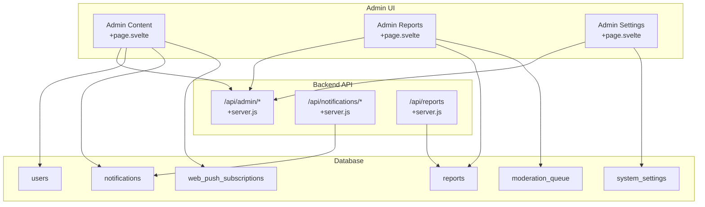
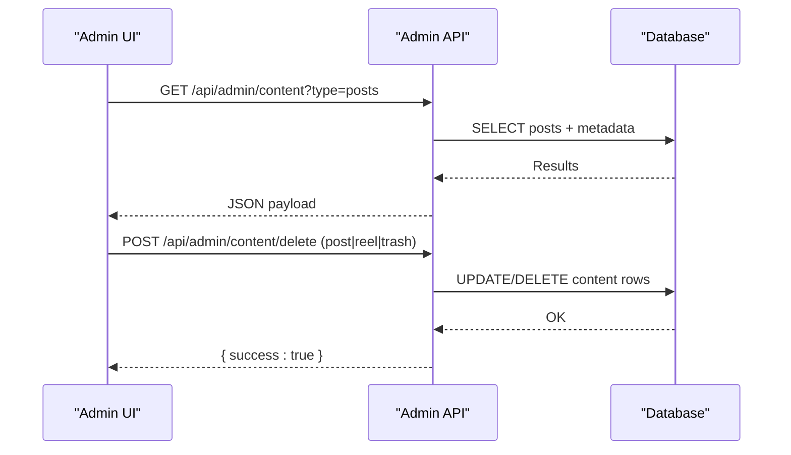
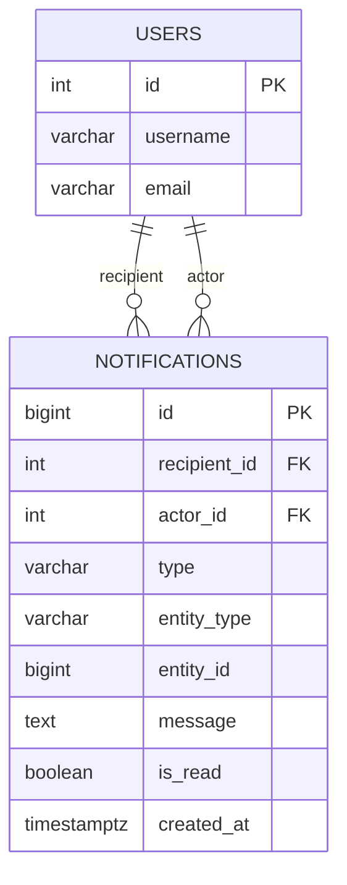
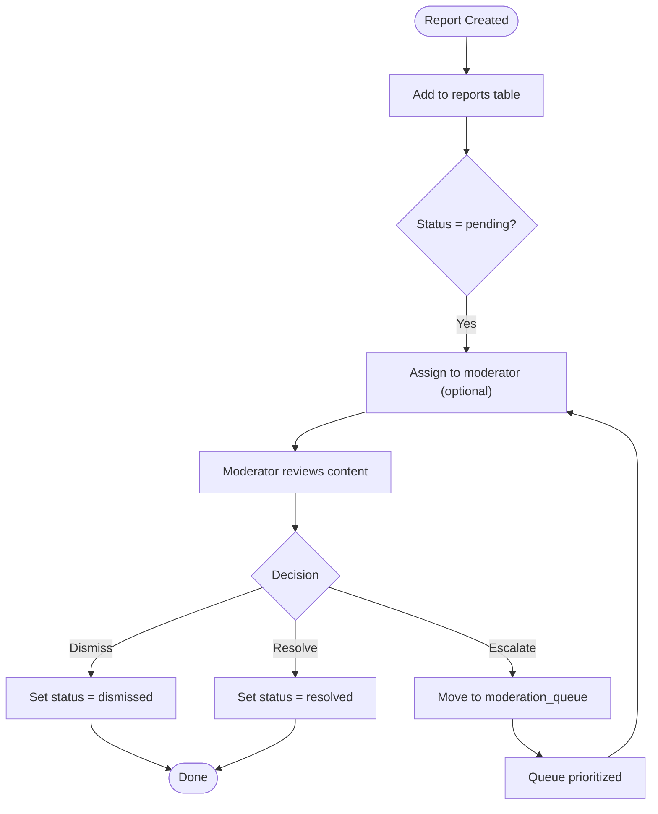
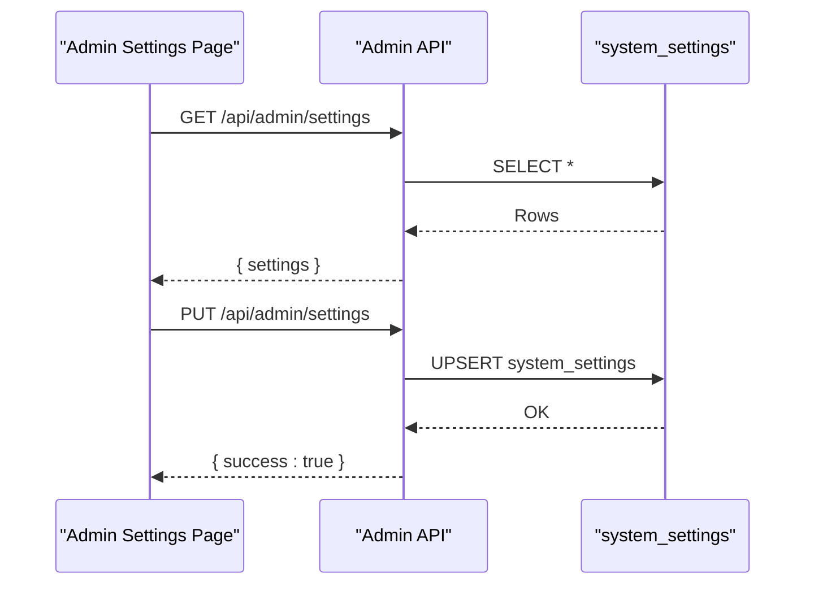
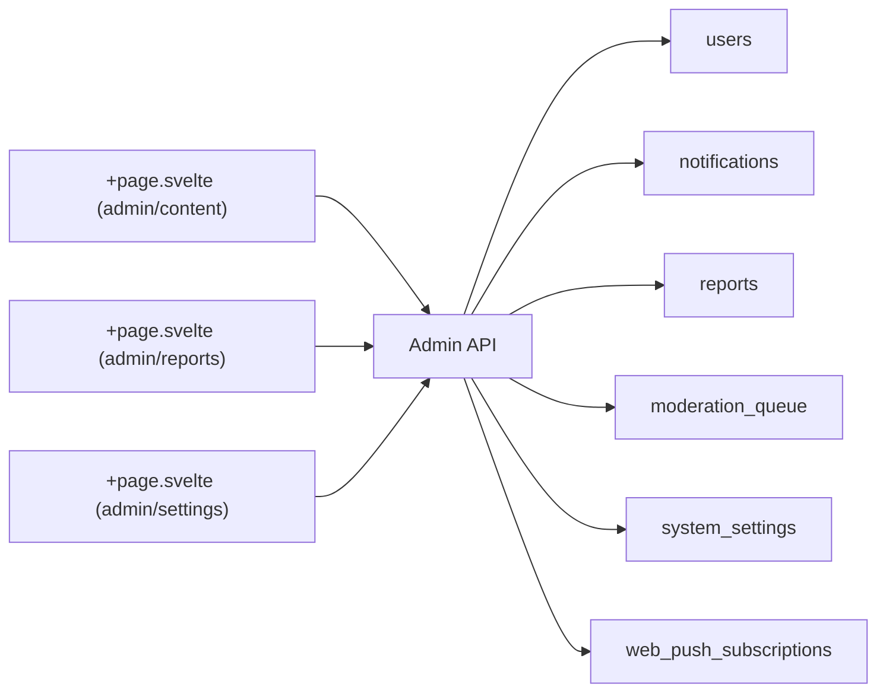

# System & Administrative Models

<cite>
**Referenced Files in This Document**
- [ARCHITECTURE.md](file://ARCHITECTURE.md)
- [README.md](file://README.md)
- [001_schema.sql](file://migrations/001_schema.sql)
- [002_phase2.sql](file://migrations/002_phase2.sql)
- [schema_sqlite.sql](file://schema_sqlite.sql)
- [+page.svelte (admin/content)](file://frontend/src/routes/admin/content/+page.svelte)
- [+page.svelte (admin/reports)](file://frontend/src/routes/admin/reports/+page.svelte)
- [+page.svelte (admin/settings)](file://frontend/src/routes/admin/settings/+page.svelte)
</cite>

## Table of Contents
1. [Introduction](#introduction)
2. [Project Structure](#project-structure)
3. [Core Components](#core-components)
4. [Architecture Overview](#architecture-overview)
5. [Detailed Component Analysis](#detailed-component-analysis)
6. [Dependency Analysis](#dependency-analysis)
7. [Performance Considerations](#performance-considerations)
8. [Troubleshooting Guide](#troubleshooting-guide)
9. [Conclusion](#conclusion)
10. [Appendices](#appendices)

## Introduction
This document describes VSocial’s system and administrative models with a focus on notifications, reports, moderation tools, and system settings. It also covers user preference management, push notification subscriptions, web push protocol support, spam detection and content filtering mechanisms, and operational guidance for monitoring and maintenance.

## Project Structure
The repository is a SvelteKit-based full-stack application with a SQLite/libSQL backend. Administrative features are exposed via dedicated admin pages and API routes, while the database schema defines core models for users, notifications, moderation, marketplace, and system settings.



**Diagram sources**
- [+page.svelte (admin/content)](file://frontend/src/routes/admin/content/+page.svelte)
- [+page.svelte (admin/reports)](file://frontend/src/routes/admin/reports/+page.svelte)
- [+page.svelte (admin/settings)](file://frontend/src/routes/admin/settings/+page.svelte)
- [001_schema.sql](file://migrations/001_schema.sql)
- [002_phase2.sql](file://migrations/002_phase2.sql)
- [schema_sqlite.sql](file://schema_sqlite.sql)

**Section sources**
- [README.md:12-21](file://README.md#L12-L21)
- [ARCHITECTURE.md:65-94](file://ARCHITECTURE.md#L65-L94)

## Core Components
- Notifications: A centralized activity log with typed entries and read-state tracking, supporting grouping and asynchronous read actions.
- Reporting and Moderation: A structured reporting queue and moderation queue with statuses and assignment tracking.
- System Settings: Global configuration stored as key-value pairs with descriptions and timestamps.
- Push Subscriptions: Web Push subscriptions per user for browser-based notifications.
- User Preferences: Per-user settings controlling notification channels and feed behavior.

**Section sources**
- [ARCHITECTURE.md:45-49](file://ARCHITECTURE.md#L45-L49)
- [001_schema.sql:338-348](file://migrations/001_schema.sql#L338-L348)
- [001_schema.sql:408-431](file://migrations/001_schema.sql#L408-L431)
- [001_schema.sql:558-563](file://migrations/001_schema.sql#L558-L563)
- [002_phase2.sql:208-216](file://migrations/002_phase2.sql#L208-L216)
- [schema_sqlite.sql:70-93](file://schema_sqlite.sql#L70-L93)

## Architecture Overview
The admin subsystem integrates frontend pages with backend API routes and the relational schema. Admin pages fetch and mutate data through API endpoints backed by the schema-defined tables. Notifications and reports are central to user engagement and platform safety.



**Diagram sources**
- [+page.svelte (admin/content)](file://frontend/src/routes/admin/content/+page.svelte)
- [001_schema.sql](file://migrations/001_schema.sql)

## Detailed Component Analysis

### Notifications Model
- Purpose: Track user-centric activity (likes, comments, follows, mentions, system).
- Schema highlights:
  - recipients, actors, type, entity reference, message, read-state, timestamps.
  - Index on recipient and read-state for efficient retrieval.
- Frontend behavior:
  - Filtering tabs (All, Mentions, Likes, Followers, System).
  - Optimistic UI updates for mark-as-read operations against the notifications API.



**Diagram sources**
- [001_schema.sql:338-348](file://migrations/001_schema.sql#L338-L348)
- [001_schema.sql:619-623](file://migrations/001_schema.sql#L619-L623)

**Section sources**
- [ARCHITECTURE.md:72-79](file://ARCHITECTURE.md#L72-L79)
- [001_schema.sql:338-348](file://migrations/001_schema.sql#L338-L348)
- [001_schema.sql:619-623](file://migrations/001_schema.sql#L619-L623)

### Reporting and Moderation Tools
- Reports: Structured records with reporter, content reference, reason, and status.
- Moderation Queue: Priority-based queue for content review with assignment and resolution tracking.
- Admin UI:
  - List pending reports with quick-resolve actions.
  - Content moderation interface supports deletion and restoration.



**Diagram sources**
- [001_schema.sql:408-431](file://migrations/001_schema.sql#L408-L431)

**Section sources**
- [+page.svelte (admin/reports)](file://frontend/src/routes/admin/reports/+page.svelte)
- [+page.svelte (admin/content)](file://frontend/src/routes/admin/content/+page.svelte)
- [001_schema.sql:408-431](file://migrations/001_schema.sql#L408-L431)

### System Settings Management
- Purpose: Centralize platform-wide configuration (feature flags, limits, integrations).
- Schema: key/value pairs with optional descriptions and timestamps.
- Admin UI: Fetch current settings, toggle flags (e.g., registration), adjust limits (e.g., upload size), and persist changes.



**Diagram sources**
- [+page.svelte (admin/settings)](file://frontend/src/routes/admin/settings/+page.svelte)
- [001_schema.sql:558-563](file://migrations/001_schema.sql#L558-L563)

**Section sources**
- [+page.svelte (admin/settings)](file://frontend/src/routes/admin/settings/+page.svelte)
- [001_schema.sql:558-563](file://migrations/001_schema.sql#L558-L563)
- [schema_sqlite.sql:680-701](file://schema_sqlite.sql#L680-L701)

### Push Notification Subscriptions and Web Push Protocol
- Purpose: Enable browser-based push notifications for logged-in users.
- Schema: Subscription endpoints with keys and user agent metadata.
- Implementation: Admin UI surfaces subscription management; backend APIs handle CRUD operations and delivery orchestration.

```mermaid
classDiagram
class WebPushSubscription {
+int id
+int user_id
+text endpoint
+text p256dh_key
+text auth_key
+varchar user_agent
+datetime created_at
}
class Users {
+int id
+varchar username
}
Users ||--o{ WebPushSubscription : "has"
```

**Diagram sources**
- [002_phase2.sql:208-216](file://migrations/002_phase2.sql#L208-L216)

**Section sources**
- [002_phase2.sql:208-216](file://migrations/002_phase2.sql#L208-L216)

### User Preference Management
- Scope: Theme, language, notification channels (email, push, DMs), feed weights and modes, privacy visibility, and DM preferences.
- Persistence: Stored in user_settings keyed by user_id.
- Impact: Influences notification delivery, feed ranking, and user experience.

**Section sources**
- [schema_sqlite.sql:70-93](file://schema_sqlite.sql#L70-L93)
- [001_schema.sql:56-66](file://migrations/001_schema.sql#L56-L66)

### Spam Detection and Content Filtering
- Mechanisms observed:
  - Marketplace listing flags and fraud scoring.
  - Blocked/snoozed user relationships.
  - Moderation queue for escalated content.
- Recommendations:
  - Integrate keyword filters and ML-based classifiers.
  - Enforce rate limits and content similarity checks.
  - Periodic audits of flagged content and user behavior.

**Section sources**
- [001_schema.sql:364-381](file://migrations/001_schema.sql#L364-L381)
- [002_phase2.sql:55-70](file://migrations/002_phase2.sql#L55-L70)
- [001_schema.sql:421-431](file://migrations/001_schema.sql#L421-L431)

## Dependency Analysis
Administrative features depend on:
- Admin UI pages invoking admin API routes.
- Admin API routes interacting with the schema-defined tables.
- Notifications and reports being tightly coupled to user and content entities.



**Diagram sources**
- [+page.svelte (admin/content)](file://frontend/src/routes/admin/content/+page.svelte)
- [+page.svelte (admin/reports)](file://frontend/src/routes/admin/reports/+page.svelte)
- [+page.svelte (admin/settings)](file://frontend/src/routes/admin/settings/+page.svelte)
- [001_schema.sql](file://migrations/001_schema.sql)

**Section sources**
- [001_schema.sql](file://migrations/001_schema.sql)

## Performance Considerations
- Indexes: Ensure recipient/read/timestamp indexes are leveraged for notification queries.
- Pagination: Implement pagination for admin lists (content, reports).
- Asynchronous processing: Offload heavy moderation tasks to background workers.
- Caching: Cache frequently accessed system settings and user preferences.

## Troubleshooting Guide
- Notifications not appearing:
  - Verify recipient permissions and row-level security policies.
  - Confirm read-state updates via optimistic UI and backend sync.
- Reports stuck:
  - Check moderation queue assignments and status transitions.
  - Validate reporter and content references.
- Settings not applying:
  - Confirm admin API writes to system_settings and cache invalidation.
- Push subscriptions failing:
  - Validate endpoint uniqueness and key correctness.
  - Check browser compatibility and user consent.

**Section sources**
- [001_schema.sql:619-623](file://migrations/001_schema.sql#L619-L623)
- [+page.svelte (admin/reports)](file://frontend/src/routes/admin/reports/+page.svelte)
- [+page.svelte (admin/settings)](file://frontend/src/routes/admin/settings/+page.svelte)
- [002_phase2.sql:208-216](file://migrations/002_phase2.sql#L208-L216)

## Conclusion
VSocial’s administrative model centers on robust notifications, a structured reporting and moderation pipeline, configurable system settings, and web push subscriptions. The schema and admin UI provide a strong foundation for safe, scalable operations with room to enhance spam detection and automated moderation.

## Appendices
- Monitoring checklist:
  - Daily report volume and resolution SLA.
  - Notification delivery latency and read rates.
  - System setting change audit logs.
  - Push subscription health metrics.
- Maintenance procedures:
  - Weekly moderation queue triage.
  - Monthly pruning of old notifications and logs.
  - Quarterly review of spam detection thresholds.