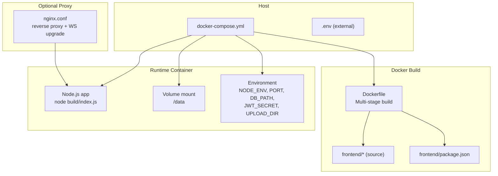
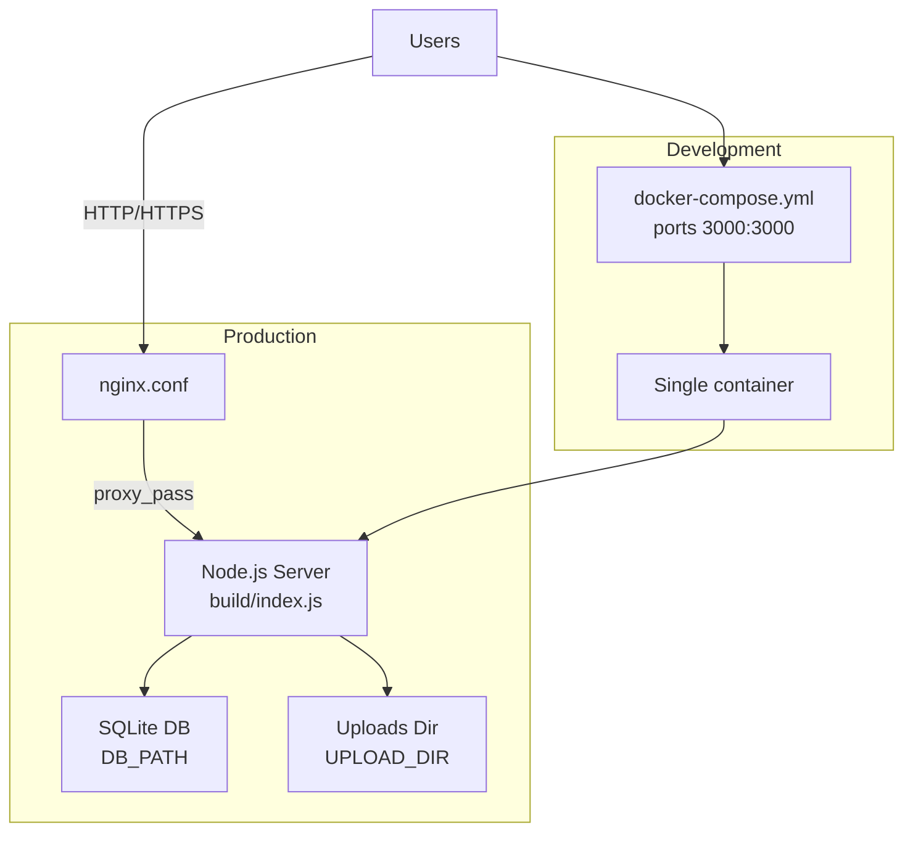
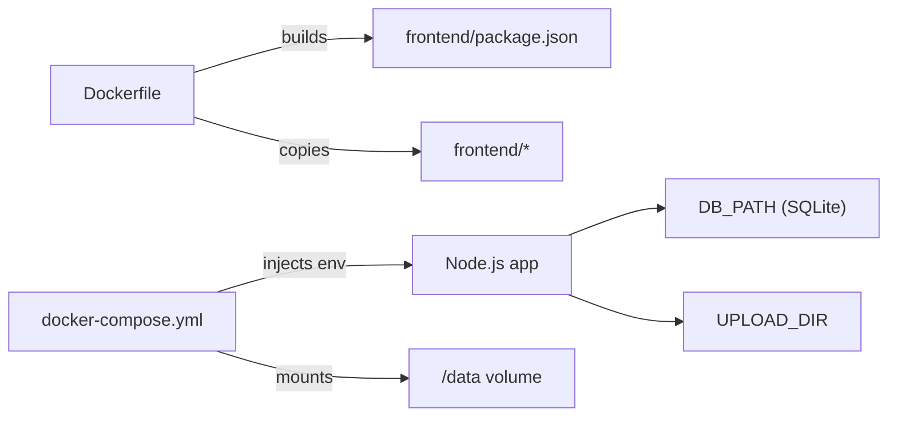

# Containerization & Docker

<cite>
**Referenced Files in This Document**
- [Dockerfile](file://Dockerfile)
- [docker-compose.yml](file://docker-compose.yml)
- [nginx.conf](file://nginx.conf)
- [frontend/package.json](file://frontend/package.json)
- [frontend/src/hooks.server.js](file://frontend/src/hooks.server.js)
- [frontend/src/lib/server/db.js](file://frontend/src/lib/server/db.js)
- [schema_sqlite.sql](file://schema_sqlite.sql)
- [README.md](file://README.md)
</cite>

## Table of Contents
1. [Introduction](#introduction)
2. [Project Structure](#project-structure)
3. [Core Components](#core-components)
4. [Architecture Overview](#architecture-overview)
5. [Detailed Component Analysis](#detailed-component-analysis)
6. [Dependency Analysis](#dependency-analysis)
7. [Performance Considerations](#performance-considerations)
8. [Troubleshooting Guide](#troubleshooting-guide)
9. [Conclusion](#conclusion)
10. [Appendices](#appendices)

## Introduction
This document provides comprehensive Docker containerization guidance for VSocial. It explains the current multi-stage build process, base image choices, and layer optimization strategies. It also documents best practices for Dockerfiles, security hardening, resource limits, networking, volume mounting, environment injection, and operational differences between local development and production. Guidance is grounded in the repository’s existing Dockerfile, docker-compose configuration, and application behavior.

## Project Structure
VSocial’s containerization relies on:
- A multi-stage Dockerfile that builds the SvelteKit frontend and runs the Node.js server in a minimal runtime.
- A docker-compose service that defines environment variables, volumes, port mapping, and health checks.
- An optional nginx reverse proxy configuration for production-grade HTTP handling and WebSocket upgrades.

**Diagram sources**
- [Dockerfile:1-30](file://Dockerfile#L1-L30)
- [docker-compose.yml:1-27](file://docker-compose.yml#L1-L27)
- [nginx.conf:1-19](file://nginx.conf#L1-L19)

**Section sources**
- [Dockerfile:1-30](file://Dockerfile#L1-L30)
- [docker-compose.yml:1-27](file://docker-compose.yml#L1-L27)
- [README.md:89-95](file://README.md#L89-L95)

## Core Components
- Multi-stage Dockerfile
  - Stage 1 (builder): Installs Node.js dependencies and builds the SvelteKit frontend.
  - Stage 2 (runner): Copies only the built artifacts and runtime dependencies into a minimal Node.js Alpine image.
- docker-compose service
  - Maps host port 3000 to container port 3000.
  - Injects environment variables for runtime configuration.
  - Mounts a named volume for persistent data (/data).
  - Adds a health check against the application’s health endpoint.
- Optional nginx reverse proxy
  - Passes through HTTP/1.1, enables WebSocket upgrades, and forwards essential headers.

Key implications:
- The application expects a SQLite database path via an environment variable and writes uploads to a configurable directory.
- The server listens on a configurable port and exposes a health endpoint.

**Section sources**
- [Dockerfile:1-30](file://Dockerfile#L1-L30)
- [docker-compose.yml:3-27](file://docker-compose.yml#L3-L27)
- [nginx.conf:1-19](file://nginx.conf#L1-L19)
- [frontend/src/lib/server/db.js:16-22](file://frontend/src/lib/server/db.js#L16-L22)

## Architecture Overview
The containerized runtime architecture supports two primary modes:
- Direct container-to-internet (single container with Node.js server).
- Reverse-proxy mode (nginx in front of the Node.js server).

**Diagram sources**
- [docker-compose.yml:3-27](file://docker-compose.yml#L3-L27)
- [nginx.conf:8-17](file://nginx.conf#L8-L17)
- [frontend/src/lib/server/db.js:16-22](file://frontend/src/lib/server/db.js#L16-L22)

## Detailed Component Analysis

### Multi-Stage Docker Build
- Base images
  - Uses node:20-alpine for both stages to minimize attack surface and image size.
- Build stage
  - Copies package manifests, installs dependencies, copies source, and builds the frontend.
- Runtime stage
  - Copies only the built output and runtime dependencies into a fresh node:20-alpine container.
  - Sets production environment and exposes port 3000.
  - Runs the server using the built entrypoint.

Best-practice alignment:
- Minimal base image for runtime.
- Layer reuse by copying manifests first and installing dependencies before source.
- Single command to start the server.

Recommendations for improvement:
- Add a non-root user and drop unnecessary capabilities.
- Pin dependency versions and rebuild layers intentionally.
- Consider a dedicated health check script inside the container.

**Section sources**
- [Dockerfile:1-30](file://Dockerfile#L1-L30)

### docker-compose Service Configuration
- Ports
  - Host:3000 -> Container:3000.
- Environment variables
  - NODE_ENV, PORT, DB_PATH, JWT_SECRET, UPLOAD_DIR injected from compose and external secrets.
- Volumes
  - Named volume mounted at /data to persist database and uploads.
- Health check
  - Probes the application’s health endpoint over localhost.

Operational notes:
- Ensure JWT_SECRET is provided via environment or secrets management.
- Persist /data to survive container recreation.

**Section sources**
- [docker-compose.yml:3-27](file://docker-compose.yml#L3-L27)

### Application Startup and Database Path Resolution
- The server initializes the database on startup and determines whether it is local or remote based on the configured URL.
- For local deployments, it ensures WAL mode and related pragmas are applied.
- Uploads are stored under a configurable directory resolved from the project root.

Security and correctness:
- Validates and creates directories for DB and uploads if missing.
- Supports both file-based and remote database URLs.

**Section sources**
- [frontend/src/hooks.server.js:7-14](file://frontend/src/hooks.server.js#L7-L14)
- [frontend/src/lib/server/db.js:16-22](file://frontend/src/lib/server/db.js#L16-L22)
- [frontend/src/lib/server/db.js:20-22](file://frontend/src/lib/server/db.js#L20-L22)
- [frontend/src/lib/server/db.js:202-206](file://frontend/src/lib/server/db.js#L202-L206)

### Reverse Proxy (nginx)
- Enables WebSocket upgrades for real-time features.
- Forwards essential headers for proper client identification and protocol detection.
- Disables proxy buffering for streaming-like behavior.

Operational guidance:
- Place nginx in front of the Node.js server in production for TLS termination and improved resilience.
- Ensure the upstream proxy_pass matches the container’s listening address and port.

**Section sources**
- [nginx.conf:6-17](file://nginx.conf#L6-L17)

### Health Checks and Readiness
- The compose health check probes the application’s health endpoint.
- The server exposes an API route for health checks.

Operational guidance:
- Monitor health status in orchestration platforms.
- Ensure the health endpoint remains reachable behind a reverse proxy.

**Section sources**
- [docker-compose.yml:18-23](file://docker-compose.yml#L18-L23)

## Dependency Analysis
- Dockerfile depends on frontend build scripts and package manifests.
- docker-compose depends on environment variables and volume definitions.
- The application depends on database initialization and environment-driven configuration.

**Diagram sources**
- [Dockerfile:7-12](file://Dockerfile#L7-L12)
- [frontend/package.json:6-16](file://frontend/package.json#L6-L16)
- [docker-compose.yml:9-16](file://docker-compose.yml#L9-L16)
- [frontend/src/lib/server/db.js:16-22](file://frontend/src/lib/server/db.js#L16-L22)

**Section sources**
- [Dockerfile:7-12](file://Dockerfile#L7-L12)
- [frontend/package.json:6-16](file://frontend/package.json#L6-L16)
- [docker-compose.yml:9-16](file://docker-compose.yml#L9-L16)
- [frontend/src/lib/server/db.js:16-22](file://frontend/src/lib/server/db.js#L16-L22)

## Performance Considerations
- Image size and attack surface
  - Using node:20-alpine reduces footprint and vulnerabilities.
- Build reproducibility
  - Copy manifest files before source to leverage layer caching during rebuilds.
- Runtime efficiency
  - Keep the server process single-threaded and avoid unnecessary background tasks in containers.
- Database tuning
  - The application configures SQLite pragmas for local deployments; ensure appropriate storage I/O and disk performance in the container environment.

[No sources needed since this section provides general guidance]

## Troubleshooting Guide
Common issues and remedies:
- Port conflicts
  - Ensure host port 3000 is free or change mapping in compose.
- Missing environment variables
  - Provide JWT_SECRET and other required variables; verify compose environment block.
- Volume permissions
  - On Linux hosts, ensure the container user can write to the mounted /data directory.
- Health check failures
  - Verify the health endpoint is reachable from within the container network.
- Database connectivity
  - Confirm DB_PATH resolves correctly and the database file is writable.
- Reverse proxy WebSocket issues
  - Ensure nginx upgrades headers are forwarded and the upstream address matches the container’s listening interface.

**Section sources**
- [docker-compose.yml:7-16](file://docker-compose.yml#L7-L16)
- [frontend/src/lib/server/db.js:16-22](file://frontend/src/lib/server/db.js#L16-L22)
- [nginx.conf:10-16](file://nginx.conf#L10-L16)

## Conclusion
VSocial’s containerization leverages a concise multi-stage Dockerfile and a straightforward docker-compose service. The design emphasizes a minimal runtime image, explicit environment-driven configuration, and a persistent volume for data. For production, adding a reverse proxy, non-root user, and stricter health/readiness checks further improves reliability and security.

[No sources needed since this section summarizes without analyzing specific files]

## Appendices

### Practical Examples: Local Development vs Production Containers
- Local development
  - Use docker-compose to run the single container locally with mapped ports and environment variables loaded from .env.
  - Recommended for iterative development and quick feedback loops.
- Production
  - Deploy behind nginx for TLS termination, WebSocket upgrades, and request forwarding.
  - Use a non-root user, read-only root filesystem, and minimal capabilities in the container runtime.
  - Configure resource limits (CPU/memory) and restart policies aligned with your platform.

**Section sources**
- [README.md:89-95](file://README.md#L89-L95)
- [docker-compose.yml:3-27](file://docker-compose.yml#L3-L27)
- [nginx.conf:1-19](file://nginx.conf#L1-L19)

### Dockerfile Best Practices and Security Hardening
- Build best practices
  - Keep layers deterministic by ordering COPY/ADD and RUN commands to maximize cache hits.
  - Prefer multi-stage builds to exclude dev dependencies from the runtime image.
- Security hardening
  - Run as a non-root user with a dedicated UID/GID.
  - Drop unnecessary Linux capabilities and enable read-only root filesystem.
  - Scan images regularly and pin base image digests.
- Resource limits
  - Set CPU and memory constraints in compose or orchestrator to prevent noisy-neighbor problems.

[No sources needed since this section provides general guidance]

### Networking, Volumes, and Environment Injection
- Networking
  - Expose only necessary ports; use a reverse proxy for inbound traffic.
  - Ensure internal DNS resolution works between containers when scaling.
- Volumes
  - Mount /data for database and uploads persistence; ensure correct ownership and permissions.
- Environment injection
  - Use compose environment blocks for sensitive values; inject via secrets or external secret managers in production.

**Section sources**
- [docker-compose.yml:7-16](file://docker-compose.yml#L7-L16)
- [frontend/src/lib/server/db.js:16-22](file://frontend/src/lib/server/db.js#L16-L22)

### Container Registry, Scanning, and Vulnerability Management
- Registry
  - Push images to a private or public registry with immutable tags.
- Scanning
  - Integrate image scanning in CI/CD to detect known vulnerabilities.
- Patching and rotation
  - Establish a cadence for updating base images and dependencies; rotate secrets regularly.

[No sources needed since this section provides general guidance]

### Debugging Techniques
- Inspect container logs and health status.
- Exec into the container to validate environment variables and file system mounts.
- Temporarily disable health checks during deployment to avoid premature restarts.
- Verify WebSocket upgrades and proxy headers when using nginx.

**Section sources**
- [docker-compose.yml:18-23](file://docker-compose.yml#L18-L23)
- [nginx.conf:10-16](file://nginx.conf#L10-L16)