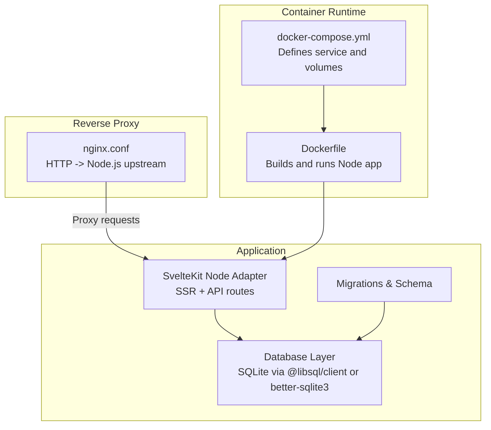
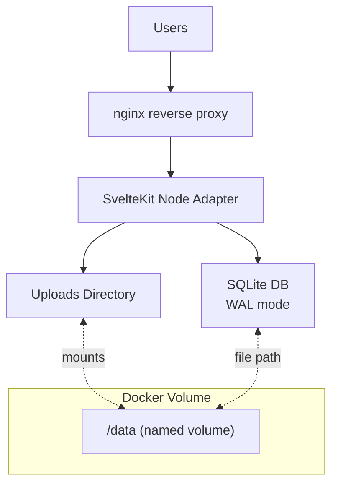
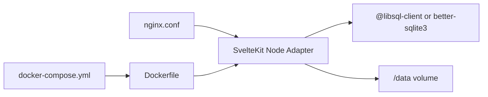
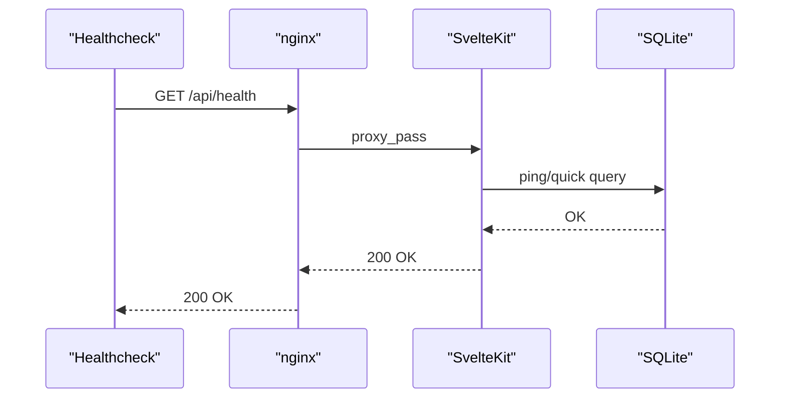

# Deployment & DevOps

<cite>
**Referenced Files in This Document**
- [Dockerfile](file://Dockerfile)
- [docker-compose.yml](file://docker-compose.yml)
- [nginx.conf](file://nginx.conf)
- [README.md](file://README.md)
- [ARCHITECTURE.md](file://ARCHITECTURE.md)
- [frontend/package.json](file://frontend/package.json)
- [frontend/svelte.config.js](file://frontend/svelte.config.js)
- [frontend/vite.config.js](file://frontend/vite.config.js)
- [frontend/src/lib/server/db.js](file://frontend/src/lib/server/db.js)
- [frontend/src/hooks.server.js](file://frontend/src/hooks.server.js)
- [scripts/migrate-up.js](file://scripts/migrate-up.js)
- [migrations/001_schema.sql](file://migrations/001_schema.sql)
</cite>

## Table of Contents
1. [Introduction](#introduction)
2. [Project Structure](#project-structure)
3. [Core Components](#core-components)
4. [Architecture Overview](#architecture-overview)
5. [Detailed Component Analysis](#detailed-component-analysis)
6. [Dependency Analysis](#dependency-analysis)
7. [Performance Considerations](#performance-considerations)
8. [Troubleshooting Guide](#troubleshooting-guide)
9. [Conclusion](#conclusion)
10. [Appendices](#appendices)

## Introduction
This document provides comprehensive deployment and DevOps guidance for VSocial. It covers containerization with Docker, orchestration via Docker Compose, production-ready runtime configuration, environment variable management, SSL/TLS and reverse proxy setup with nginx, CI/CD considerations, automated testing integration, deployment automation, production hardening, monitoring and logging, scalability and load balancing, disaster recovery, backups, database maintenance, and operational observability.

## Project Structure
VSocial is a SvelteKit-based full-stack application with a Node.js adapter and SQLite backend. The repository includes:
- A single-stage Dockerfile for building and running the application
- A Docker Compose definition for local and production-like orchestration
- An nginx configuration for reverse proxying HTTP traffic to the Node.js server
- SvelteKit configuration for Node adapter builds
- Database initialization and migration scripts
- Environment-driven configuration for database and uploads

**Diagram sources**
- [Dockerfile:1-30](file://Dockerfile#L1-L30)
- [docker-compose.yml:1-27](file://docker-compose.yml#L1-L27)
- [nginx.conf:1-19](file://nginx.conf#L1-L19)
- [frontend/svelte.config.js:1-19](file://frontend/svelte.config.js#L1-L19)
- [frontend/src/lib/server/db.js:1-209](file://frontend/src/lib/server/db.js#L1-L209)
- [scripts/migrate-up.js:1-57](file://scripts/migrate-up.js#L1-L57)
- [migrations/001_schema.sql:1-686](file://migrations/001_schema.sql#L1-L686)

**Section sources**
- [README.md:89-95](file://README.md#L89-L95)
- [Dockerfile:1-30](file://Dockerfile#L1-L30)
- [docker-compose.yml:1-27](file://docker-compose.yml#L1-L27)
- [frontend/svelte.config.js:1-19](file://frontend/svelte.config.js#L1-L19)
- [frontend/src/lib/server/db.js:16-22](file://frontend/src/lib/server/db.js#L16-L22)

## Core Components
- Containerization: Multi-stage Docker build produces a minimal runtime image exposing port 3000 and launching the built Node.js server.
- Orchestration: Docker Compose defines a service with environment variables for database path, JWT secret, and uploads directory, plus a named volume for persistence.
- Reverse Proxy: nginx forwards HTTP traffic to the Node.js server, enabling WebSocket upgrades and preserving client IPs and protocol.
- Application: SvelteKit with Node adapter, database auto-initialization, and cron-based maintenance tasks.
- Database: SQLite-backed with dual-driver support (@libsql/client preferred, better-sqlite3 fallback), WAL mode enabled locally, and migrations managed by a dedicated script.

**Section sources**
- [Dockerfile:14-29](file://Dockerfile#L14-L29)
- [docker-compose.yml:3-27](file://docker-compose.yml#L3-L27)
- [nginx.conf:8-18](file://nginx.conf#L8-L18)
- [frontend/src/lib/server/db.js:117-167](file://frontend/src/lib/server/db.js#L117-L167)
- [scripts/migrate-up.js:9-56](file://scripts/migrate-up.js#L9-L56)

## Architecture Overview
The production runtime comprises:
- nginx as the front-line reverse proxy
- One or more Node.js containers running the SvelteKit application
- A persistent volume for database and uploads
- Optional external database via libSQL client

**Diagram sources**
- [nginx.conf:2-18](file://nginx.conf#L2-L18)
- [docker-compose.yml:15-16](file://docker-compose.yml#L15-L16)
- [frontend/src/lib/server/db.js:16-22](file://frontend/src/lib/server/db.js#L16-L22)

## Detailed Component Analysis

### Containerization Strategy
- Build stage: Installs Node dependencies and builds the SvelteKit app.
- Runtime stage: Minimal Node 20 Alpine image with production environment variables and exposed port 3000.
- Entrypoint: Starts the built server using the Node adapter.

Best practices:
- Pin base images to specific versions.
- Use non-root user for runtime.
- Add healthchecks and resource limits.
- Separate build and runtime stages to reduce attack surface.

**Section sources**
- [Dockerfile:1-30](file://Dockerfile#L1-L30)
- [frontend/package.json:10](file://frontend/package.json#L10)
- [frontend/svelte.config.js:10-14](file://frontend/svelte.config.js#L10-L14)

### Docker Compose Orchestration
- Service: Builds from repository root, publishes port 3000, sets NODE_ENV and PORT, injects JWT secret, and mounts a named volume at /data.
- Healthcheck: Probes the internal health endpoint to assess readiness.
- Persistence: Named volume ensures continuity of database and uploads across deployments.

Operational tips:
- Externalize secrets via environment files or secret managers.
- Scale horizontally behind a load balancer.
- Use restart policies aligned with uptime requirements.

**Section sources**
- [docker-compose.yml:3-27](file://docker-compose.yml#L3-L27)

### Reverse Proxy with nginx
- Listens on port 80 and proxies to localhost:3000.
- Enables WebSocket upgrades for real-time features.
- Preserves client IP and protocol headers for accurate logging and security enforcement.

Hardening suggestions:
- Add TLS termination with certificates.
- Enforce rate limiting and security headers.
- Restrict allowed hosts and enable HTTP/2.

**Section sources**
- [nginx.conf:1-19](file://nginx.conf#L1-L19)

### Environment Variable Management
Key variables:
- NODE_ENV: production
- PORT: 3000
- DB_PATH: path to SQLite file inside the container
- DATABASE_URL: libSQL-compatible URL (supports remote databases)
- DATABASE_AUTH_TOKEN: optional auth token for remote databases
- JWT_SECRET: signing key for session cookies
- UPLOAD_DIR: uploads directory path inside the container

Recommendations:
- Store secrets externally and mount them securely.
- Use distinct secrets per environment.
- Validate presence of required variables at startup.

**Section sources**
- [docker-compose.yml:9-14](file://docker-compose.yml#L9-L14)
- [frontend/src/lib/server/db.js:16-18](file://frontend/src/lib/server/db.js#L16-L18)

### SSL/TLS Configuration
- Current nginx config listens on port 80 without TLS.
- Recommended steps:
  - Obtain certificates via ACME or a trusted CA.
  - Configure HTTPS listener and redirect HTTP to HTTPS.
  - Set strong cipher suites and security headers.
  - Enable OCSP stapling and HSTS.

[No sources needed since this section provides general guidance]

### Database Initialization and Migrations
- The server initializes the database on startup and applies migrations via a dedicated script.
- Migrations are stored as SQL files and tracked in a dedicated table.
- The migration runner reads SQL files, executes them, and records completion.

Operational notes:
- Ensure the database file path is writable and persisted.
- For production, consider running migrations at deploy time or via a separate job.
- Monitor migration failures and maintain rollback procedures.

**Section sources**
- [frontend/src/hooks.server.js:7-14](file://frontend/src/hooks.server.js#L7-L14)
- [scripts/migrate-up.js:9-56](file://scripts/migrate-up.js#L9-L56)
- [migrations/001_schema.sql:1-686](file://migrations/001_schema.sql#L1-L686)

### Real-Time Features and WebSocket Support
- nginx preserves upgrade headers for WebSocket connections.
- The application uses SvelteKit API routes and likely SSE/RTC endpoints.

Production considerations:
- Ensure sticky sessions if scaling horizontally.
- Use connection pooling and timeouts appropriate for real-time workloads.

**Section sources**
- [nginx.conf:11-12](file://nginx.conf#L11-L12)

### CI/CD Pipeline Considerations
- Build: Use the provided Dockerfile to produce a reproducible image.
- Test: Integrate unit tests and E2E checks before pushing images.
- Release: Tag images with semantic versions and push to a registry.
- Deploy: Roll out with rolling updates and health checks.
- Secrets: Inject secrets at runtime via environment variables or secret managers.

[No sources needed since this section provides general guidance]

### Automated Testing Integration
- Unit tests are supported via Vitest.
- Integrate test execution in CI jobs before image builds.
- Optionally run database migrations in CI for schema validation.

**Section sources**
- [frontend/package.json:14](file://frontend/package.json#L14)
- [README.md:97-103](file://README.md#L97-L103)

### Deployment Automation
- Automate image builds and pushes using CI.
- Use declarative infrastructure (Compose or Kubernetes) to manage rollout.
- Implement canary releases and rollback strategies.

[No sources needed since this section provides general guidance]

### Monitoring and Logging
- Application logs: Capture stdout/stderr from the Node process.
- Access logs: Enable nginx access logging for traffic visibility.
- Metrics: Expose Prometheus metrics from the application if desired.
- Alerting: Monitor container health, disk usage, and error rates.

[No sources needed since this section provides general guidance]

### Scalability and Load Balancing
- Horizontal scaling: Run multiple instances behind a load balancer.
- Sticky sessions: Required for real-time features; consider session affinity.
- Stateless design: Keep sessions and stateless where possible.
- CDN: Offload static assets and media to a CDN.

[No sources needed since this section provides general guidance]

### Disaster Recovery Planning
- Backup strategy: Regular snapshots of the /data volume and database file.
- Restore procedure: Validate backups periodically and practice restoration.
- Failover: Consider a secondary region with synchronized storage.
- DR drills: Conduct periodic failover simulations.

[No sources needed since this section provides general guidance]

## Dependency Analysis
The application depends on:
- SvelteKit Node adapter for SSR and API routing
- Database drivers (@libsql/client or better-sqlite3) with WAL mode
- nginx for reverse proxying and WebSocket upgrades
- Docker and Docker Compose for containerization and orchestration

**Diagram sources**
- [nginx.conf:1-19](file://nginx.conf#L1-L19)
- [docker-compose.yml:1-27](file://docker-compose.yml#L1-L27)
- [Dockerfile:1-30](file://Dockerfile#L1-L30)
- [frontend/src/lib/server/db.js:117-167](file://frontend/src/lib/server/db.js#L117-L167)

**Section sources**
- [frontend/svelte.config.js:1-19](file://frontend/svelte.config.js#L1-L19)
- [frontend/src/lib/server/db.js:1-209](file://frontend/src/lib/server/db.js#L1-L209)
- [docker-compose.yml:1-27](file://docker-compose.yml#L1-L27)

## Performance Considerations
- Database tuning: WAL mode and pragmas are configured for SQLite; ensure adequate I/O and disk performance.
- Static assets: Serve via nginx or CDN to reduce application load.
- Compression: Enable gzip or Brotli in nginx for smaller payloads.
- Caching: Use browser caching headers and CDN caching for immutable assets.
- Resource limits: Set CPU/memory limits in Docker to prevent noisy neighbors.

[No sources needed since this section provides general guidance]

## Troubleshooting Guide
Common issues and remedies:
- Database initialization failures: Verify DB_PATH/DATABASE_URL and permissions; ensure migrations ran successfully.
- Health check failures: Confirm the health endpoint responds and container is reachable on the expected port.
- Uploads missing: Ensure UPLOAD_DIR is writable and mounted to the named volume.
- WebSocket disconnects: Validate nginx upgrade headers and firewall rules.

**Section sources**
- [frontend/src/hooks.server.js:7-14](file://frontend/src/hooks.server.js#L7-L14)
- [docker-compose.yml:18-23](file://docker-compose.yml#L18-L23)
- [frontend/src/lib/server/db.js:202-206](file://frontend/src/lib/server/db.js#L202-L206)

## Conclusion
VSocial’s deployment model is straightforward and container-first. By leveraging Docker, Docker Compose, and nginx, you can achieve a secure, scalable, and observable production setup. Strengthen it with proper secrets management, TLS, monitoring, and robust backup and disaster recovery procedures.

## Appendices

### A. Environment Variables Reference
- NODE_ENV: production
- PORT: 3000
- DB_PATH: SQLite file path inside container
- DATABASE_URL: libSQL-compatible URL (file: or remote)
- DATABASE_AUTH_TOKEN: optional auth token for remote databases
- JWT_SECRET: signing key for session cookies
- UPLOAD_DIR: uploads directory path inside container

**Section sources**
- [docker-compose.yml:9-14](file://docker-compose.yml#L9-L14)
- [frontend/src/lib/server/db.js:16-18](file://frontend/src/lib/server/db.js#L16-L18)

### B. Health Endpoint Flow

**Diagram sources**
- [docker-compose.yml:18-23](file://docker-compose.yml#L18-L23)
- [nginx.conf:8-18](file://nginx.conf#L8-L18)