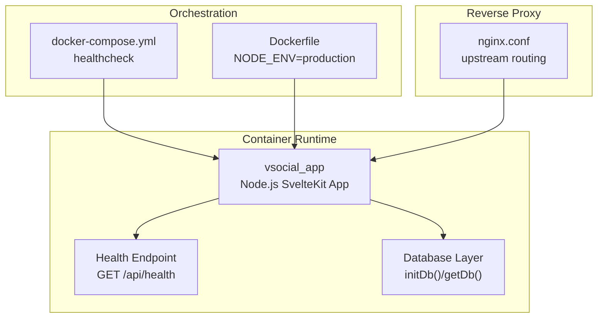
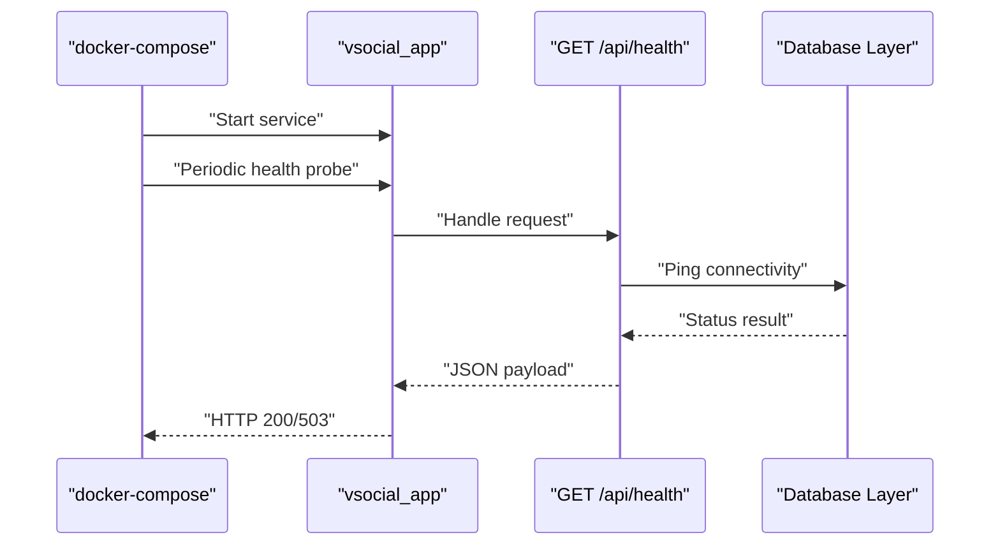
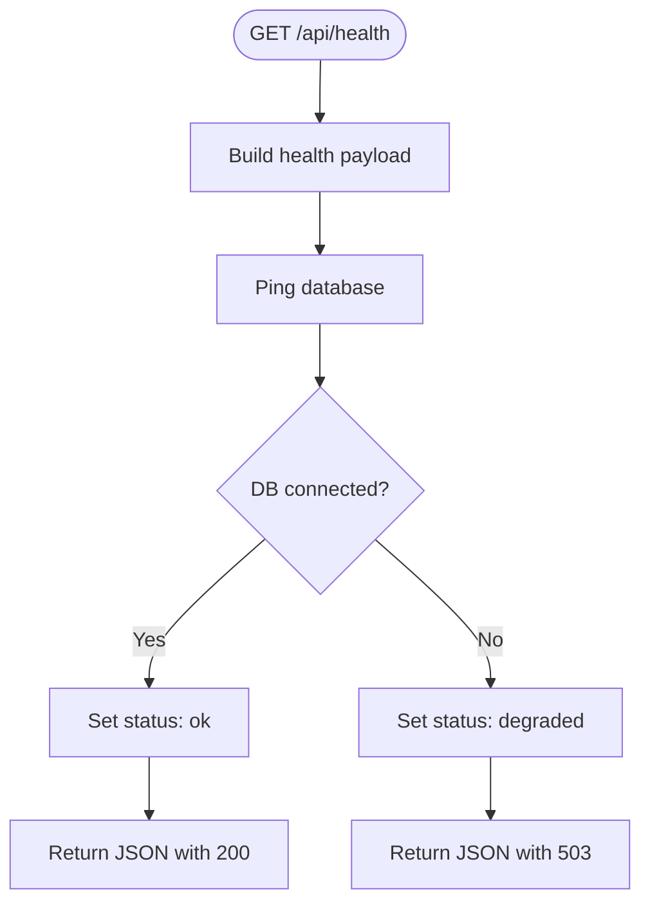
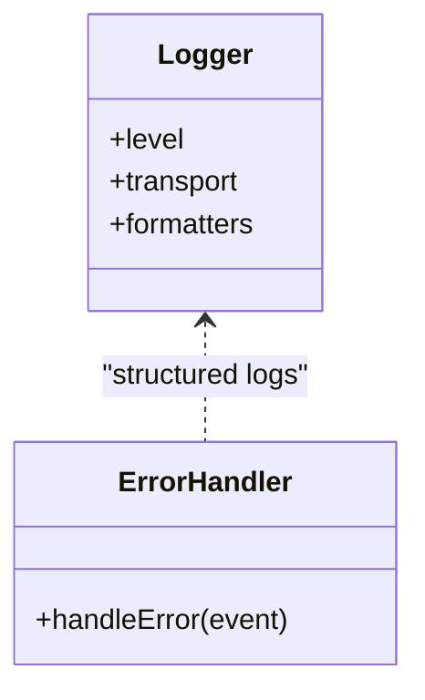
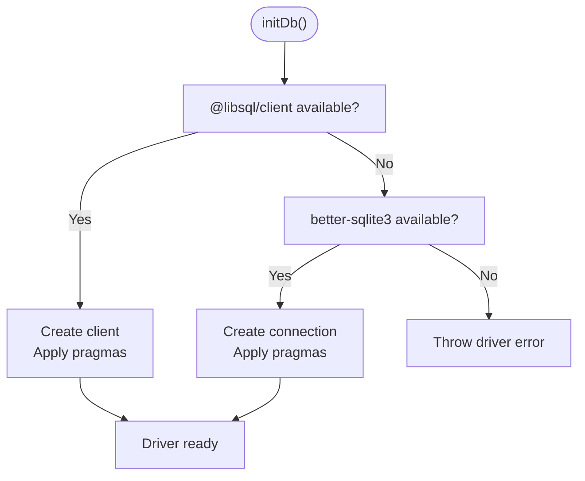
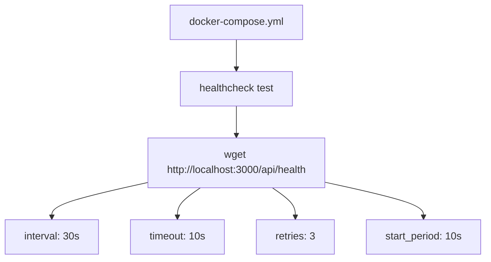
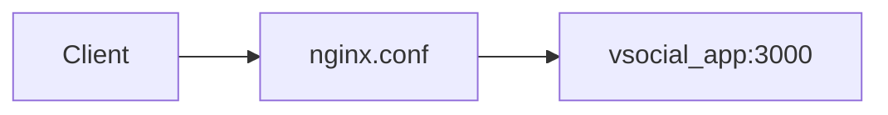
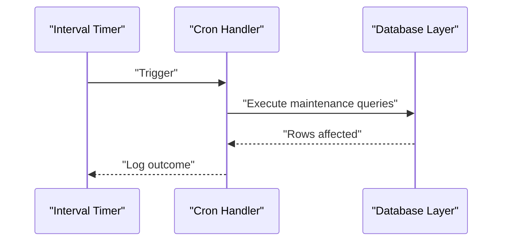
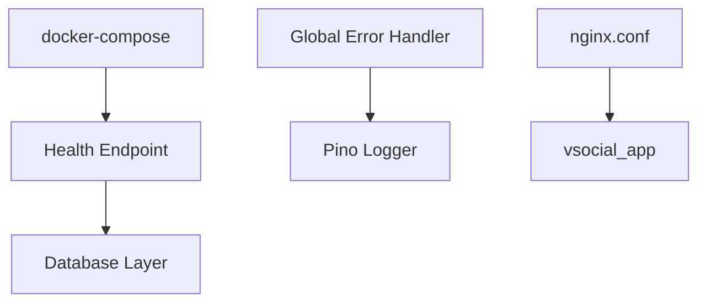

# Monitoring & Logging

<cite>
**Referenced Files in This Document**
- [docker-compose.yml](file://docker-compose.yml)
- [Dockerfile](file://Dockerfile)
- [nginx.conf](file://nginx.conf)
- [frontend/src/lib/server/logger.js](file://frontend/src/lib/server/logger.js)
- [frontend/src/hooks.server.js](file://frontend/src/hooks.server.js)
- [frontend/src/lib/server/db.js](file://frontend/src/lib/server/db.js)
- [frontend/src/routes/api/health/+server.js](file://frontend/src/routes/api/health/+server.js)
- [frontend/src/routes/api/cron/+server.js](file://frontend/src/routes/api/cron/+server.js)
</cite>

## Table of Contents
1. [Introduction](#introduction)
2. [Project Structure](#project-structure)
3. [Core Components](#core-components)
4. [Architecture Overview](#architecture-overview)
5. [Detailed Component Analysis](#detailed-component-analysis)
6. [Dependency Analysis](#dependency-analysis)
7. [Performance Considerations](#performance-considerations)
8. [Troubleshooting Guide](#troubleshooting-guide)
9. [Conclusion](#conclusion)
10. [Appendices](#appendices)

## Introduction
This document provides comprehensive monitoring and logging guidance for the VSocial production deployment. It covers health check endpoints, system metrics collection, performance monitoring strategies, structured logging, log aggregation and rotation, alerting configuration, error tracking, incident response, distributed tracing, profiling, bottleneck identification, backup verification, disaster recovery testing, and reliability measurements. The content is grounded in the repository’s actual implementation and Docker orchestration.

## Project Structure
The monitoring and logging stack spans the SvelteKit backend, containerization, and reverse proxy configuration:
- Health endpoint exposed under the SvelteKit API surface
- Structured logging via Pino configured in the server runtime
- Database initialization and diagnostics integrated into boot and hooks
- Container health checks orchestrated via docker-compose
- Reverse proxy configuration for upstream routing and readiness

**Diagram sources**
- [docker-compose.yml:1-27](file://docker-compose.yml#L1-L27)
- [Dockerfile:1-30](file://Dockerfile#L1-L30)
- [frontend/src/routes/api/health/+server.js:1-22](file://frontend/src/routes/api/health/+server.js#L1-L22)
- [frontend/src/lib/server/db.js:117-167](file://frontend/src/lib/server/db.js#L117-L167)
- [nginx.conf](file://nginx.conf)

**Section sources**
- [docker-compose.yml:1-27](file://docker-compose.yml#L1-L27)
- [Dockerfile:1-30](file://Dockerfile#L1-L30)
- [frontend/src/routes/api/health/+server.js:1-22](file://frontend/src/routes/api/health/+server.js#L1-L22)
- [frontend/src/lib/server/db.js:117-167](file://frontend/src/lib/server/db.js#L117-L167)
- [nginx.conf](file://nginx.conf)

## Core Components
- Health endpoint: Returns application and database connectivity status with appropriate HTTP codes.
- Structured logging: Pino-based logger with production-friendly JSON output and optional pretty printing in development.
- Database diagnostics: Bootstraps database drivers, applies SQLite pragmas, and exposes driver info.
- Container health checks: docker-compose healthcheck probes the health endpoint at regular intervals.
- Global error handling: Centralized error capture and controlled responses to prevent crashes and leaks.
- Cron maintenance: Scheduled tasks for cleanup and publishing, logged for observability.

**Section sources**
- [frontend/src/routes/api/health/+server.js:1-22](file://frontend/src/routes/api/health/+server.js#L1-L22)
- [frontend/src/lib/server/logger.js:1-27](file://frontend/src/lib/server/logger.js#L1-L27)
- [frontend/src/lib/server/db.js:117-167](file://frontend/src/lib/server/db.js#L117-L167)
- [docker-compose.yml:18-23](file://docker-compose.yml#L18-L23)
- [frontend/src/hooks.server.js:154-178](file://frontend/src/hooks.server.js#L154-L178)
- [frontend/src/routes/api/cron/+server.js:1-31](file://frontend/src/routes/api/cron/+server.js#L1-L31)

## Architecture Overview
The monitoring architecture integrates health checks, logs, and database diagnostics with container orchestration and reverse proxy routing.

**Diagram sources**
- [docker-compose.yml:18-23](file://docker-compose.yml#L18-L23)
- [frontend/src/routes/api/health/+server.js:1-22](file://frontend/src/routes/api/health/+server.js#L1-L22)
- [frontend/src/lib/server/db.js:117-167](file://frontend/src/lib/server/db.js#L117-L167)

## Detailed Component Analysis

### Health Endpoint
The health endpoint performs:
- Application metadata (status, timestamp, version)
- Database connectivity check
- Degraded status propagation when DB fails
- HTTP 200 OK or 503 Service Unavailable based on health

**Diagram sources**
- [frontend/src/routes/api/health/+server.js:1-22](file://frontend/src/routes/api/health/+server.js#L1-L22)

**Section sources**
- [frontend/src/routes/api/health/+server.js:1-22](file://frontend/src/routes/api/health/+server.js#L1-L22)

### Structured Logging
Logging is implemented with Pino:
- Environment-driven log level
- Optional pretty transport in development
- Consistent level formatting
- Used in global error handler for structured error logs

**Diagram sources**
- [frontend/src/lib/server/logger.js:1-27](file://frontend/src/lib/server/logger.js#L1-L27)
- [frontend/src/hooks.server.js:154-178](file://frontend/src/hooks.server.js#L154-L178)

**Section sources**
- [frontend/src/lib/server/logger.js:1-27](file://frontend/src/lib/server/logger.js#L1-L27)
- [frontend/src/hooks.server.js:154-178](file://frontend/src/hooks.server.js#L154-L178)

### Database Diagnostics and Initialization
The database layer:
- Initializes drivers (@libsql/client preferred, fallback to better-sqlite3)
- Applies SQLite pragmas for performance and reliability
- Exposes driver info and schema execution helpers
- Logs readiness and driver selection

**Diagram sources**
- [frontend/src/lib/server/db.js:117-167](file://frontend/src/lib/server/db.js#L117-L167)

**Section sources**
- [frontend/src/lib/server/db.js:117-167](file://frontend/src/lib/server/db.js#L117-L167)

### Container Health Checks
docker-compose defines:
- Health check command probing the health endpoint
- Interval, timeout, retries, and start period
- Ensures container restart policy and volume mounts

**Diagram sources**
- [docker-compose.yml:18-23](file://docker-compose.yml#L18-L23)

**Section sources**
- [docker-compose.yml:1-27](file://docker-compose.yml#L1-L27)

### Reverse Proxy Routing
nginx forwards traffic to the Node.js application and can be extended to support:
- Readiness/liveness probes
- Request tracing headers
- Access logging for downstream analytics

**Diagram sources**
- [nginx.conf](file://nginx.conf)

**Section sources**
- [nginx.conf](file://nginx.conf)

### Cron Maintenance and Observability
Scheduled tasks include:
- Publishing scheduled posts
- Generating “un día como hoy” memories
- Cleaning expired stories and snoozed users
- Logging outcomes for operational visibility

**Diagram sources**
- [frontend/src/hooks.server.js:18-103](file://frontend/src/hooks.server.js#L18-L103)
- [frontend/src/routes/api/cron/+server.js:1-31](file://frontend/src/routes/api/cron/+server.js#L1-L31)

**Section sources**
- [frontend/src/hooks.server.js:18-103](file://frontend/src/hooks.server.js#L18-L103)
- [frontend/src/routes/api/cron/+server.js:1-31](file://frontend/src/routes/api/cron/+server.js#L1-L31)

## Dependency Analysis
Key dependencies and their roles:
- Health endpoint depends on database connectivity
- Structured logging is used in error handling
- Container health checks depend on the health endpoint
- Reverse proxy depends on the application being reachable

**Diagram sources**
- [frontend/src/routes/api/health/+server.js:1-22](file://frontend/src/routes/api/health/+server.js#L1-L22)
- [frontend/src/lib/server/db.js:117-167](file://frontend/src/lib/server/db.js#L117-L167)
- [frontend/src/hooks.server.js:154-178](file://frontend/src/hooks.server.js#L154-L178)
- [docker-compose.yml:18-23](file://docker-compose.yml#L18-L23)
- [nginx.conf](file://nginx.conf)

**Section sources**
- [frontend/src/routes/api/health/+server.js:1-22](file://frontend/src/routes/api/health/+server.js#L1-L22)
- [frontend/src/lib/server/db.js:117-167](file://frontend/src/lib/server/db.js#L117-L167)
- [frontend/src/hooks.server.js:154-178](file://frontend/src/hooks.server.js#L154-L178)
- [docker-compose.yml:1-27](file://docker-compose.yml#L1-L27)
- [nginx.conf](file://nginx.conf)

## Performance Considerations
- Database tuning: WAL mode, foreign keys, busy timeout, cache size, and temp store are applied during initialization to improve concurrency and reduce contention.
- Health checks: Configure intervals and timeouts to balance responsiveness and overhead.
- Logging throughput: Use JSON output in production to enable efficient log parsing and aggregation.
- Reverse proxy: Offload TLS termination and buffering at the proxy to reduce application load.

[No sources needed since this section provides general guidance]

## Troubleshooting Guide
Common scenarios and actions:
- Health endpoint returns degraded: Verify database connectivity and initialization logs.
- Frequent 503 responses: Inspect database driver availability and initialization errors.
- Error logs missing: Confirm LOG_LEVEL and logger transport configuration.
- Cron jobs not running: Check cron secrets and scheduling intervals.
- Container restart loops: Review healthcheck configuration and startup logs.

**Section sources**
- [frontend/src/routes/api/health/+server.js:1-22](file://frontend/src/routes/api/health/+server.js#L1-L22)
- [frontend/src/lib/server/db.js:117-167](file://frontend/src/lib/server/db.js#L117-L167)
- [frontend/src/lib/server/logger.js:1-27](file://frontend/src/lib/server/logger.js#L1-L27)
- [frontend/src/hooks.server.js:18-103](file://frontend/src/hooks.server.js#L18-L103)
- [docker-compose.yml:18-23](file://docker-compose.yml#L18-L23)

## Conclusion
VSocial’s production monitoring and logging rely on a concise but effective stack: a dedicated health endpoint, structured logging with Pino, robust database initialization and diagnostics, containerized health checks, and a configurable reverse proxy. Extending this foundation with centralized log aggregation, alerting rules, distributed tracing, and performance profiling will deliver comprehensive observability and reliability for production deployments.

[No sources needed since this section summarizes without analyzing specific files]

## Appendices

### Practical Examples and Integration Notes
- Health dashboard: Surface the health endpoint response in a simple UI card to visualize application and DB status.
- Custom metrics: Track cron job outcomes and DB query counts by instrumenting the cron handlers and database wrapper methods.
- Alerting configuration:
  - Target: docker-compose healthcheck failures and degraded health endpoint responses
  - Thresholds: Consecutive failures, sustained degraded periods
  - Channels: Email, Slack, PagerDuty
- Error tracking: Ship structured logs to a log aggregation platform; filter by level and error patterns.
- Incident response:
  - Define escalation tiers for healthcheck failures and DB connectivity issues
  - Automate remediation steps (restart container, retry DB init)
  - Document rollback procedures for failed updates

[No sources needed since this section provides general guidance]