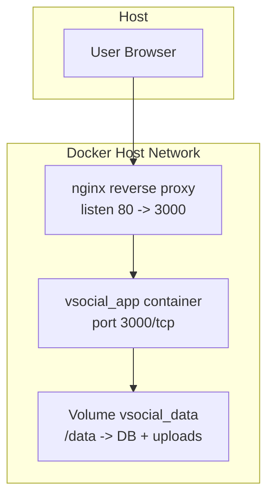
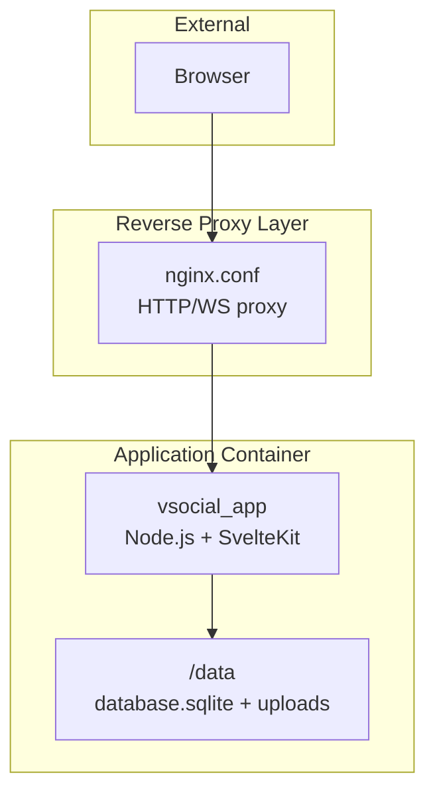
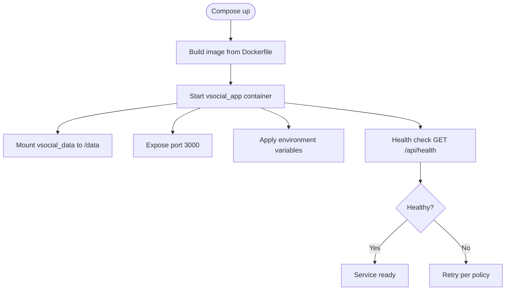
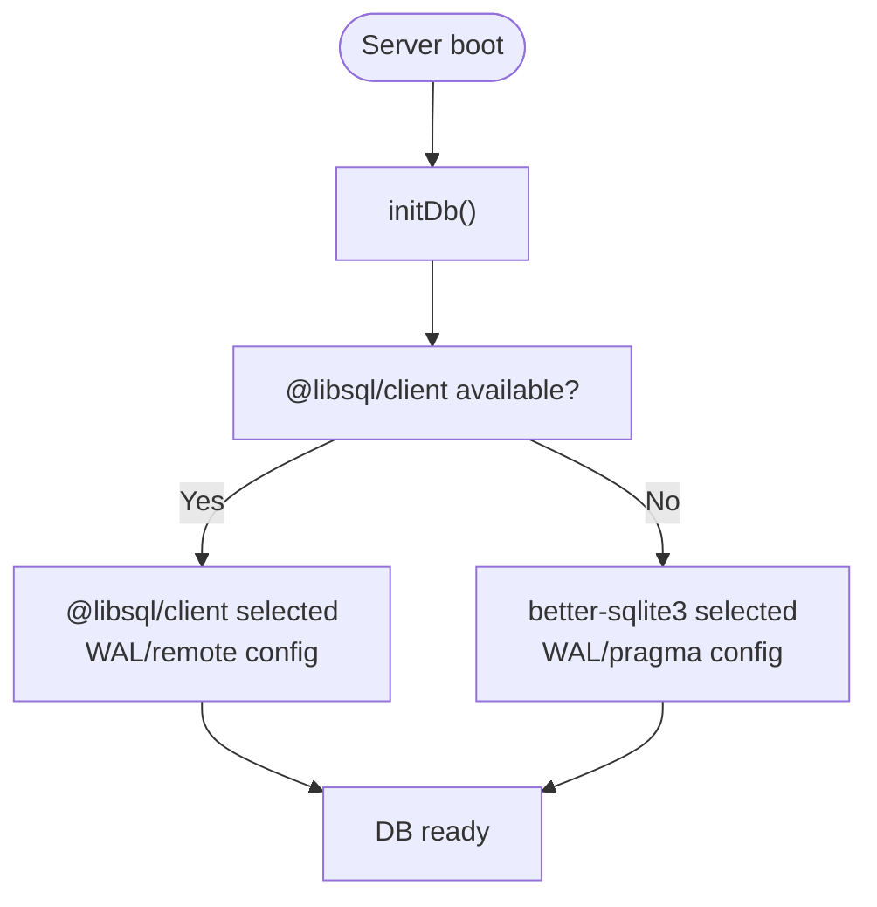
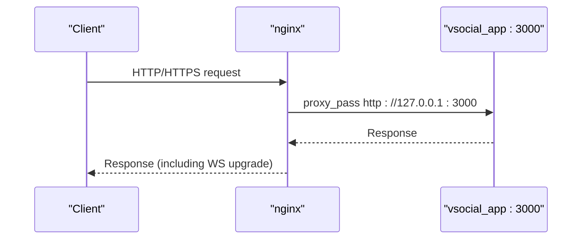
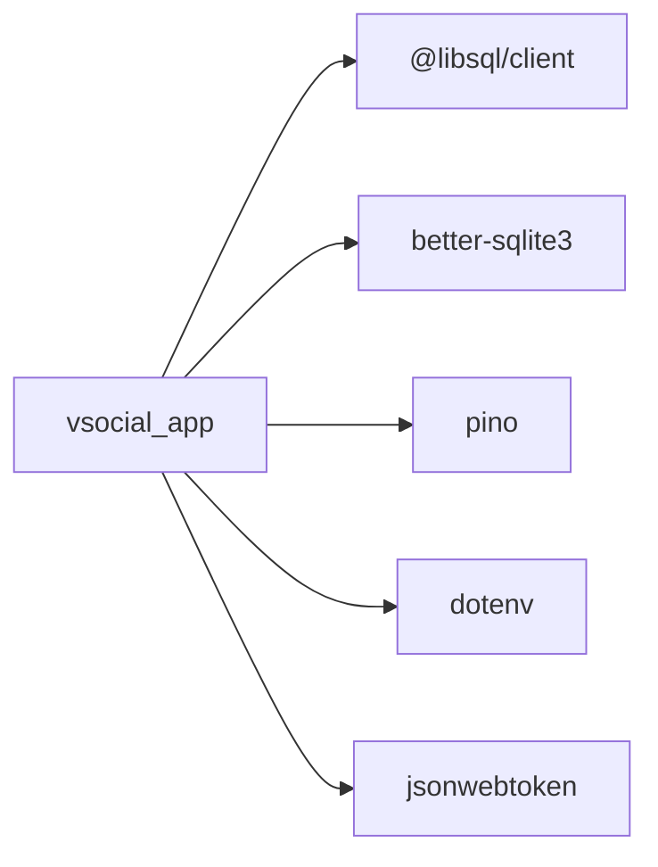

# Orchestration & Docker Compose

<cite>
**Referenced Files in This Document**
- [docker-compose.yml](file://docker-compose.yml)
- [Dockerfile](file://Dockerfile)
- [nginx.conf](file://nginx.conf)
- [README.md](file://README.md)
- [ARCHITECTURE.md](file://ARCHITECTURE.md)
- [frontend/src/lib/server/db.js](file://frontend/src/lib/server/db.js)
- [frontend/src/lib/server/logger.js](file://frontend/src/lib/server/logger.js)
- [frontend/src/lib/server/jwt.js](file://frontend/src/lib/server/jwt.js)
- [frontend/src/hooks.server.js](file://frontend/src/hooks.server.js)
- [frontend/src/routes/api/health/+server.js](file://frontend/src/routes/api/health/+server.js)
- [frontend/src/routes/api/install/+server.js](file://frontend/src/routes/api/install/+server.js)
- [frontend/package.json](file://frontend/package.json)
- [frontend/vite.config.js](file://frontend/vite.config.js)
- [schema_sqlite.sql](file://schema_sqlite.sql)
- [scripts/seed.js](file://scripts/seed.js)
</cite>

## Table of Contents
1. [Introduction](#introduction)
2. [Project Structure](#project-structure)
3. [Core Components](#core-components)
4. [Architecture Overview](#architecture-overview)
5. [Detailed Component Analysis](#detailed-component-analysis)
6. [Dependency Analysis](#dependency-analysis)
7. [Performance Considerations](#performance-considerations)
8. [Troubleshooting Guide](#troubleshooting-guide)
9. [Conclusion](#conclusion)
10. [Appendices](#appendices)

## Introduction
This document provides comprehensive Docker Compose orchestration guidance for deploying VSocial in development and production environments. It explains service definitions, networks, inter-service communication, environment-specific compose files, scaling strategies, database setup, reverse proxy configuration, volume management, secrets handling, configuration templating, and operational practices such as health checks, restart policies, logs aggregation, and monitoring integration.

## Project Structure
The repository includes a minimal but complete Docker-based stack:
- A single primary service builds from the root Dockerfile and exposes port 3000.
- A persistent volume mounts a data directory for database and uploads.
- An optional nginx reverse proxy configuration is provided for HTTP/WS passthrough.
- Environment variables are injected via Docker Compose and consumed by the application runtime.

**Diagram sources**
- [docker-compose.yml:3-26](file://docker-compose.yml#L3-L26)
- [nginx.conf:2-18](file://nginx.conf#L2-L18)

**Section sources**
- [docker-compose.yml:1-27](file://docker-compose.yml#L1-L27)
- [Dockerfile:1-30](file://Dockerfile#L1-L30)
- [nginx.conf:1-19](file://nginx.conf#L1-L19)

## Core Components
- vsocial service
  - Built from the repository root using the provided Dockerfile.
  - Exposes port 3000 and binds to host port 3000.
  - Persists data under /data (database.sqlite and uploads).
  - Health-checked via the /api/health endpoint.
  - Restart policy set to unless-stopped.
- Volume vsocial_data
  - Named volume ensuring persistence of database and uploads across container recreation.
- Reverse Proxy (nginx)
  - Optional standalone nginx.conf configured to proxy HTTP and WebSocket upgrades to the app on localhost:3000.

Key environment variables used by the service:
- NODE_ENV=production
- PORT=3000
- DB_PATH=/data/database.sqlite
- JWT_SECRET (required secret)
- UPLOAD_DIR=/data/uploads

Operational notes:
- The application initializes the database on startup and runs periodic cron tasks.
- Health endpoint validates connectivity to the underlying database abstraction.

**Section sources**
- [docker-compose.yml:3-26](file://docker-compose.yml#L3-L26)
- [Dockerfile:19-29](file://Dockerfile#L19-L29)
- [frontend/src/routes/api/health/+server.js:1-22](file://frontend/src/routes/api/health/+server.js#L1-L22)
- [frontend/src/lib/server/db.js:117-167](file://frontend/src/lib/server/db.js#L117-L167)

## Architecture Overview
The deployment architecture centers on a single-container application with a reverse proxy option and a persistent volume for data. The application embeds a Node.js runtime and serves a SvelteKit-built frontend in production mode.

**Diagram sources**
- [nginx.conf:2-18](file://nginx.conf#L2-L18)
- [docker-compose.yml:3-26](file://docker-compose.yml#L3-L26)

## Detailed Component Analysis

### vsocial Service Definition
- Build context: repository root (Dockerfile).
- Ports: 3000 exposed and mapped to host.
- Environment:
  - NODE_ENV=production
  - PORT=3000
  - DB_PATH=/data/database.sqlite
  - JWT_SECRET (external secret)
  - UPLOAD_DIR=/data/uploads
- Volumes: vsocial_data mounted to /data.
- Restart policy: unless-stopped.
- Health check: GET /api/health via wget spider inside the container.

**Diagram sources**
- [docker-compose.yml:3-26](file://docker-compose.yml#L3-L26)
- [frontend/src/routes/api/health/+server.js:1-22](file://frontend/src/routes/api/health/+server.js#L1-L22)

**Section sources**
- [docker-compose.yml:3-26](file://docker-compose.yml#L3-L26)
- [Dockerfile:1-30](file://Dockerfile#L1-L30)

### Database Service Setup
- Driver selection: The application auto-selects between @libsql/client and better-sqlite3 at runtime.
- Local mode: When DB_URL is a file path, the app enables WAL and related pragmas for performance.
- Remote mode: When DB_URL points to a remote libsql endpoint, it configures appropriate pragmas and auth.
- Initialization: Database initialization occurs during server boot via hooks.
- Schema: The schema is defined in schema_sqlite.sql and applied by the installation flow and seeding script.

**Diagram sources**
- [frontend/src/lib/server/db.js:117-167](file://frontend/src/lib/server/db.js#L117-L167)
- [schema_sqlite.sql:1-10](file://schema_sqlite.sql#L1-L10)

**Section sources**
- [frontend/src/lib/server/db.js:1-209](file://frontend/src/lib/server/db.js#L1-L209)
- [schema_sqlite.sql:1-702](file://schema_sqlite.sql#L1-L702)

### Reverse Proxy Configuration
- The included nginx.conf listens on port 80 and proxies to http://127.0.0.1:3000.
- It preserves WebSocket upgrade headers and standard proxy headers.
- This is suitable for exposing the service behind a reverse proxy or load balancer.

**Diagram sources**
- [nginx.conf:2-18](file://nginx.conf#L2-L18)

**Section sources**
- [nginx.conf:1-19](file://nginx.conf#L1-L19)

### Volume Management
- A named volume vsocial_data persists data under /data.
- The application writes database.sqlite and uploads to /data.
- This ensures continuity across container rebuilds and updates.

**Section sources**
- [docker-compose.yml:15-16](file://docker-compose.yml#L15-L16)
- [frontend/src/lib/server/db.js:16-22](file://frontend/src/lib/server/db.js#L16-L22)

### Secrets Management
- JWT_SECRET is passed into the container via environment variables.
- Recommended practice: Use Docker Compose secrets or external secret managers to avoid committing secrets to version control.

**Section sources**
- [docker-compose.yml:13-13](file://docker-compose.yml#L13-L13)
- [frontend/src/lib/server/jwt.js:13-14](file://frontend/src/lib/server/jwt.js#L13-L14)

### Configuration Templating and Environment Variables
- The application reads DB_PATH, DATABASE_URL, DATABASE_AUTH_TOKEN, JWT_SECRET, and UPLOAD_DIR from environment variables.
- Logging level is controlled via LOG_LEVEL.
- The Dockerfile sets NODE_ENV and PORT for the production runtime.

**Section sources**
- [frontend/src/lib/server/db.js:16-18](file://frontend/src/lib/server/db.js#L16-L18)
- [frontend/src/lib/server/logger.js:9-10](file://frontend/src/lib/server/logger.js#L9-L10)
- [Dockerfile:19-20](file://Dockerfile#L19-L20)
- [docker-compose.yml:9-14](file://docker-compose.yml#L9-L14)

### Service Dependencies and Startup Order
- The vsocial service does not declare explicit dependencies in the provided compose file.
- Database initialization occurs on first request or during boot via hooks.
- For production deployments, consider adding a lightweight database service (e.g., a dedicated SQLite container or a managed libsql endpoint) and configure DATABASE_URL accordingly.

**Section sources**
- [frontend/src/hooks.server.js:7-14](file://frontend/src/hooks.server.js#L7-L14)
- [frontend/src/lib/server/db.js:117-167](file://frontend/src/lib/server/db.js#L117-L167)

### Health Checks and Restart Policies
- Health check probes the /api/health endpoint using wget spider.
- Restart policy is unless-stopped to ensure automatic recovery after failures.

**Section sources**
- [docker-compose.yml:18-23](file://docker-compose.yml#L18-L23)
- [frontend/src/routes/api/health/+server.js:1-22](file://frontend/src/routes/api/health/+server.js#L1-L22)

### Scaling Strategies
- Current compose defines a single vsocial service.
- To scale horizontally, deploy multiple instances behind a load balancer and ensure shared storage for uploads if needed.
- For database scalability, prefer a managed libsql endpoint or a clustered relational database rather than a single-file SQLite.

[No sources needed since this section provides general guidance]

## Dependency Analysis
The application’s runtime dependencies relevant to orchestration include:
- @libsql/client and better-sqlite3 for database access.
- pino for structured logging.
- dotenv for environment variable loading.
- jsonwebtoken for JWT handling.

**Diagram sources**
- [frontend/package.json:17-32](file://frontend/package.json#L17-L32)

**Section sources**
- [frontend/package.json:1-49](file://frontend/package.json#L1-L49)
- [frontend/src/lib/server/db.js:1-209](file://frontend/src/lib/server/db.js#L1-L209)

## Performance Considerations
- Database tuning: When using local SQLite, WAL mode and pragmas are enabled automatically. For higher concurrency, consider migrating to a managed database.
- Uploads: Store uploads on persistent volume or object storage for durability and scalability.
- Reverse proxy: Enable gzip/HTTP/2 at the proxy layer if TLS termination is handled externally.
- Logging: Use structured logs and rotate them outside the container to prevent disk pressure.

[No sources needed since this section provides general guidance]

## Troubleshooting Guide
Common issues and resolutions:
- Health check failing
  - Verify /api/health responds and database is reachable.
  - Confirm DB_PATH and JWT_SECRET are set correctly.
- Database connection errors
  - Ensure the database file exists under /data and permissions are correct.
  - If using a remote libsql endpoint, confirm DATABASE_URL and DATABASE_AUTH_TOKEN.
- Port conflicts
  - Change host port mapping in docker-compose.yml if 3000 is in use.
- Reverse proxy not upgrading WebSocket
  - Confirm proxy_set_header Upgrade and Connection are present and correct.
- Logs not visible
  - Check container logs via docker compose logs.
  - Ensure LOG_LEVEL is set appropriately.

Operational references:
- Health endpoint and status mapping.
- Database initialization and driver selection.
- Logging configuration.

**Section sources**
- [frontend/src/routes/api/health/+server.js:1-22](file://frontend/src/routes/api/health/+server.js#L1-L22)
- [frontend/src/lib/server/db.js:117-167](file://frontend/src/lib/server/db.js#L117-L167)
- [frontend/src/lib/server/logger.js:9-26](file://frontend/src/lib/server/logger.js#L9-L26)

## Conclusion
The current VSocial deployment relies on a single-container application with a persistent volume for data and an optional nginx reverse proxy. For production, augment the setup with a managed database, centralized secrets management, and a reverse proxy/load balancer. Use health checks, structured logging, and monitoring to maintain reliability and observability.

[No sources needed since this section summarizes without analyzing specific files]

## Appendices

### Environment Variable Reference
- NODE_ENV: Controls runtime mode.
- PORT: Application listening port.
- DB_PATH: Local SQLite file path.
- DATABASE_URL: Remote libsql endpoint (alternative to DB_PATH).
- DATABASE_AUTH_TOKEN: Authentication token for remote libsql.
- JWT_SECRET: Secret key for JWT signing.
- UPLOAD_DIR: Directory for uploaded files.
- LOG_LEVEL: Logging verbosity.

**Section sources**
- [docker-compose.yml:9-14](file://docker-compose.yml#L9-L14)
- [frontend/src/lib/server/db.js:16-18](file://frontend/src/lib/server/db.js#L16-L18)
- [frontend/src/lib/server/logger.js:9-10](file://frontend/src/lib/server/logger.js#L9-L10)
- [frontend/src/lib/server/jwt.js:13-14](file://frontend/src/lib/server/jwt.js#L13-L14)

### Installation and Initialization Notes
- Database schema is defined in schema_sqlite.sql and seeded by scripts/seed.js.
- Installation flow supports both @libsql/client and better-sqlite3 drivers.

**Section sources**
- [schema_sqlite.sql:1-702](file://schema_sqlite.sql#L1-L702)
- [scripts/seed.js:1-60](file://scripts/seed.js#L1-L60)
- [frontend/src/routes/api/install/+server.js:116-149](file://frontend/src/routes/api/install/+server.js#L116-L149)

### Development vs Production Guidance
- Development: Use the frontend development server locally; Docker Compose is primarily for production-like testing.
- Production: Build with Dockerfile, enable health checks, mount vsocial_data, and secure secrets via environment or secret management.

**Section sources**
- [README.md:89-95](file://README.md#L89-L95)
- [Dockerfile:1-30](file://Dockerfile#L1-L30)
- [docker-compose.yml:1-27](file://docker-compose.yml#L1-L27)