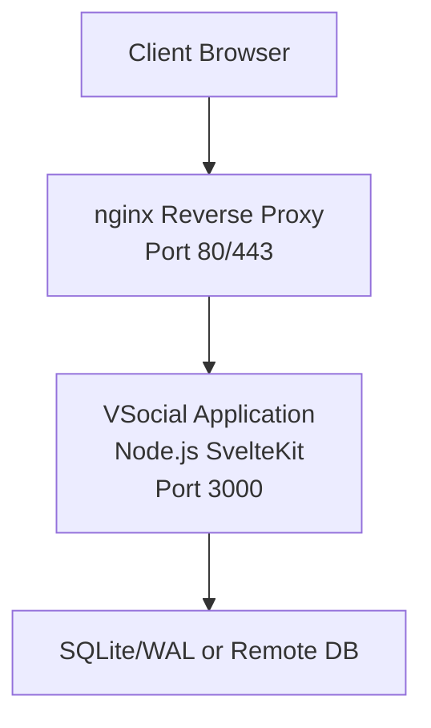
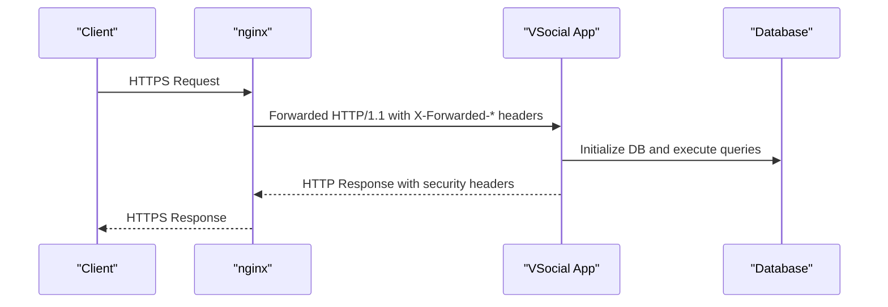
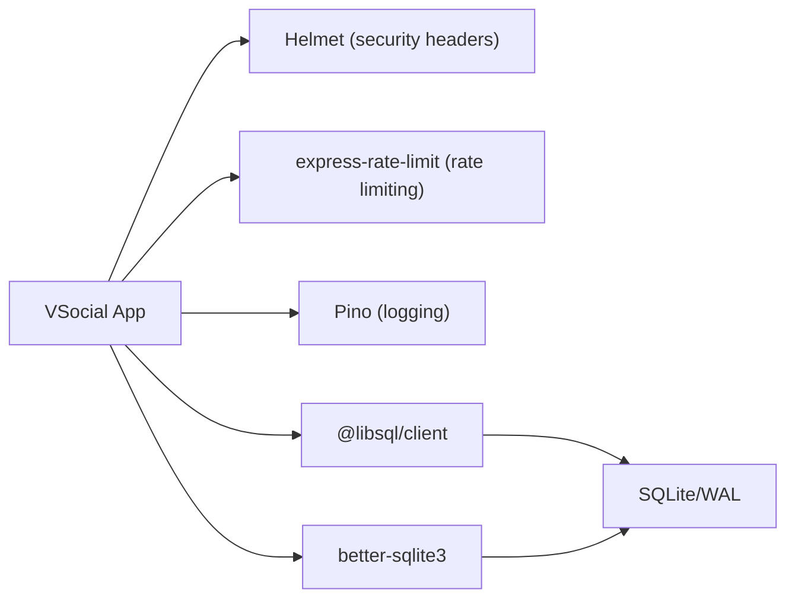

# Production Configuration

<cite>
**Referenced Files in This Document**
- [nginx.conf](file://nginx.conf)
- [docker-compose.yml](file://docker-compose.yml)
- [Dockerfile](file://Dockerfile)
- [frontend/package.json](file://frontend/package.json)
- [frontend/vite.config.js](file://frontend/vite.config.js)
- [frontend/src/hooks.server.js](file://frontend/src/hooks.server.js)
- [frontend/src/lib/server/db.js](file://frontend/src/lib/server/db.js)
- [frontend/src/lib/server/jwt.js](file://frontend/src/lib/server/jwt.js)
- [frontend/src/lib/server/logger.js](file://frontend/src/lib/server/logger.js)
- [frontend/src/routes/api/health/+server.js](file://frontend/src/routes/api/health/+server.js)
</cite>

## Table of Contents
1. [Introduction](#introduction)
2. [Project Structure](#project-structure)
3. [Core Components](#core-components)
4. [Architecture Overview](#architecture-overview)
5. [Detailed Component Analysis](#detailed-component-analysis)
6. [Dependency Analysis](#dependency-analysis)
7. [Performance Considerations](#performance-considerations)
8. [Troubleshooting Guide](#troubleshooting-guide)
9. [Conclusion](#conclusion)
10. [Appendices](#appendices)

## Introduction
This document provides comprehensive production configuration guidance for deploying VSocial behind an nginx reverse proxy. It covers SSL/TLS certificate management, HTTPS configuration, environment variable management, secret handling, security headers, rate limiting, static asset optimization, build configuration, caching strategies, CDN integration, load balancing, and performance tuning. The goal is to enable secure, scalable, and maintainable deployments suitable for production environments.

## Project Structure
The deployment stack consists of:
- A Node.js SvelteKit application packaged via a multi-stage Dockerfile.
- An nginx reverse proxy configured to forward traffic to the Node.js service.
- A docker-compose orchestration that defines environment variables, secrets, and persistent storage.

**Diagram sources**
- [nginx.conf:1-18](file://nginx.conf#L1-L18)
- [docker-compose.yml:1-27](file://docker-compose.yml#L1-L27)
- [Dockerfile:1-30](file://Dockerfile#L1-L30)

**Section sources**
- [Dockerfile:1-30](file://Dockerfile#L1-L30)
- [docker-compose.yml:1-27](file://docker-compose.yml#L1-L27)
- [nginx.conf:1-18](file://nginx.conf#L1-L18)

## Core Components
- Reverse Proxy (nginx): Handles HTTP/HTTPS termination, WebSocket upgrades, and forwards requests to the Node.js application.
- Application (Node.js/SvelteKit): Serves the frontend and exposes REST APIs, with security headers and health checks.
- Database Layer: Supports SQLite with WAL and optional remote databases via environment configuration.
- Secrets Management: JWT secret and database credentials are injected via environment variables.
- Logging: Structured logging using Pino for production logs.

Key production-relevant configurations:
- Environment variables for runtime behavior (database path, JWT secret, upload directory).
- Health endpoint for readiness/liveness probes.
- Security headers set globally in server hooks.
- Rate limiting dependency present in package manifest.

**Section sources**
- [docker-compose.yml:9-16](file://docker-compose.yml#L9-L16)
- [frontend/src/lib/server/db.js:16-22](file://frontend/src/lib/server/db.js#L16-L22)
- [frontend/src/lib/server/jwt.js:13-14](file://frontend/src/lib/server/jwt.js#L13-L14)
- [frontend/src/routes/api/health/+server.js:1-22](file://frontend/src/routes/api/health/+server.js#L1-L22)
- [frontend/src/hooks.server.js:109-116](file://frontend/src/hooks.server.js#L109-L116)
- [frontend/package.json:24-25](file://frontend/package.json#L24-L25)

## Architecture Overview
The production architecture routes client traffic through nginx to the Node.js application. Nginx terminates TLS (recommended), forwards WebSocket connections, and sets forwarded headers. The application initializes the database, applies security headers, and exposes a health endpoint.

**Diagram sources**
- [nginx.conf:8-17](file://nginx.conf#L8-L17)
- [frontend/src/hooks.server.js:109-116](file://frontend/src/hooks.server.js#L109-L116)
- [frontend/src/lib/server/db.js:117-167](file://frontend/src/lib/server/db.js#L117-L167)

## Detailed Component Analysis

### Nginx Reverse Proxy Configuration
- Listens on port 80; forwards to the Node.js app on localhost:3000.
- Enables WebSocket upgrades and forwards essential headers for proper client identification and protocol detection.
- Disables proxy buffering for streaming scenarios.

Recommended enhancements for production:
- Add HTTPS listener with TLS certificates managed by ACME automation or a certificate manager.
- Configure HTTP-to-HTTPS redirect.
- Set up gzip compression and static asset caching.
- Enable HSTS and security headers at the edge if desired, complementing application-level headers.

**Section sources**
- [nginx.conf:1-18](file://nginx.conf#L1-L18)

### SSL/TLS Certificate Management and HTTPS
- Current configuration listens on port 80 only.
- Recommended steps:
  - Obtain certificates via ACME (e.g., certbot/caddy) or a cloud provider’s certificate manager.
  - Configure nginx to listen on port 443 with TLS parameters and redirect HTTP to HTTPS.
  - Use strong ciphers and protocols; enforce modern TLS standards.
  - Consider OCSP stapling and HSTS header delivery.

[No sources needed since this section provides general guidance]

### Environment Variables and Secret Handling
- Runtime environment variables:
  - NODE_ENV=production
  - PORT=3000
  - DB_PATH=/data/database.sqlite
  - JWT_SECRET (required; injected via compose)
  - UPLOAD_DIR=/data/uploads
- Secrets:
  - JWT_SECRET must be rotated regularly and stored securely (compose secrets or external secret manager).
- Persistent storage:
  - Volume mounted at /data for database and uploads.

Best practices:
- Store secrets outside the repository; inject via environment or secret managers.
- Use distinct secrets per environment.
- Limit secret exposure in logs or error messages.

**Section sources**
- [docker-compose.yml:9-16](file://docker-compose.yml#L9-L16)
- [frontend/src/lib/server/jwt.js:13-14](file://frontend/src/lib/server/jwt.js#L13-L14)
- [frontend/src/lib/server/db.js:16-18](file://frontend/src/lib/server/db.js#L16-L18)

### Static Asset Optimization and Build Configuration
- Build pipeline:
  - Multi-stage Docker build compiles the SvelteKit app and runs the production server.
  - Frontend build artifacts are served from the compiled output directory.
- Vite configuration:
  - Frontend Vite config supports development and allows specific hosts for tunneling.
- Recommendations:
  - Enable long-term caching for immutable assets (hashing filenames).
  - Compress assets (gzip/brotli) and configure far-future cache headers.
  - Use a CDN for static assets; serve dynamic content from origin.

**Section sources**
- [Dockerfile:1-30](file://Dockerfile#L1-L30)
- [frontend/vite.config.js:1-14](file://frontend/vite.config.js#L1-L14)

### Security Headers and CORS
- Application-level headers:
  - X-Content-Type-Options: nosniff
  - X-Frame-Options: SAMEORIGIN
  - Referrer-Policy: strict-origin-when-cross-origin
  - Permissions-Policy: camera=(), microphone=(self), geolocation=(self)
- CORS:
  - Not explicitly configured in server hooks; define origin allowlists and credentials policies as needed.
- Additional hardening:
  - Add Content-Security-Policy (nonce-based for SvelteKit) and X-XSS-Protection where applicable.

**Section sources**
- [frontend/src/hooks.server.js:109-116](file://frontend/src/hooks.server.js#L109-L116)

### Rate Limiting
- Presence:
  - express-rate-limit dependency is declared in the frontend package manifest.
- Implementation:
  - Integrate rate limiter middleware in the server hooks or route handlers.
  - Use Redis-backed store for distributed rate limiting across instances.
  - Differentiate limits for public endpoints, authentication, and administrative routes.

**Section sources**
- [frontend/package.json:24-25](file://frontend/package.json#L24-L25)

### Load Balancer Configuration
- Horizontal scaling:
  - Run multiple application containers behind a load balancer or ingress controller.
  - Persist sessions or use stateless authentication (JWT) with centralized token invalidation if needed.
- Health checks:
  - Use the existing health endpoint for liveness/readiness probes.
- Sticky sessions:
  - Not required for stateless SvelteKit apps; enable only if needed for WebRTC signaling or media streaming.

**Section sources**
- [docker-compose.yml:18-23](file://docker-compose.yml#L18-L23)
- [frontend/src/routes/api/health/+server.js:1-22](file://frontend/src/routes/api/health/+server.js#L1-L22)

### Caching Strategies and CDN Integration
- Edge caching:
  - Configure cache-control headers for static assets and API responses.
  - Use CDN for global distribution of images, videos, and static resources.
- Origin caching:
  - Implement browser caching for immutable assets and short-lived caching for dynamic content.
- Cache invalidation:
  - Invalidate CDN caches after deployments using cache purging or cache-busting strategies.

[No sources needed since this section provides general guidance]

### Database Initialization and Persistence
- Automatic initialization:
  - Database is initialized on startup; SQLite is used by default with WAL enabled.
- Persistence:
  - Data volume mounted under /data ensures persistence across container restarts.
- Remote database:
  - Support for remote databases via DATABASE_URL and optional auth tokens.

**Section sources**
- [frontend/src/lib/server/db.js:117-167](file://frontend/src/lib/server/db.js#L117-L167)
- [docker-compose.yml:15-16](file://docker-compose.yml#L15-L16)

### Logging and Observability
- Structured logging:
  - Pino is configured for production-grade logs with customizable levels and pretty printing in development.
- Recommendations:
  - Ship logs to a centralized log collector (e.g., syslog, filebeat, or cloud providers).
  - Add correlation IDs and sampling for high-throughput environments.

**Section sources**
- [frontend/src/lib/server/logger.js:1-26](file://frontend/src/lib/server/logger.js#L1-L26)

## Dependency Analysis
The application depends on several production-relevant libraries and configurations:
- Database drivers: @libsql/client or better-sqlite3 with WAL and pragmas.
- Security: helmet dependency declared; security headers applied in hooks.
- Rate limiting: express-rate-limit dependency declared.
- Logging: pino with pino-pretty for development.

**Diagram sources**
- [frontend/package.json:24-25](file://frontend/package.json#L24-L25)
- [frontend/src/hooks.server.js:109-116](file://frontend/src/hooks.server.js#L109-L116)
- [frontend/src/lib/server/db.js:120-167](file://frontend/src/lib/server/db.js#L120-L167)

**Section sources**
- [frontend/package.json:24-25](file://frontend/package.json#L24-L25)
- [frontend/src/hooks.server.js:109-116](file://frontend/src/hooks.server.js#L109-L116)
- [frontend/src/lib/server/db.js:120-167](file://frontend/src/lib/server/db.js#L120-L167)

## Performance Considerations
- Database tuning:
  - SQLite WAL mode improves concurrency; pragmas for synchronous, foreign keys, busy_timeout, cache_size, and temp_store are set during initialization.
- Application:
  - Multi-stage Docker build reduces image size and improves cold start times.
  - Use production-ready Node.js runtime and keep dependencies updated.
- Network:
  - Enable compression (gzip/brotli) and HTTP/2 at the edge.
  - Offload TLS to nginx or a reverse proxy to reduce CPU overhead on the application.
- Assets:
  - Serve compressed and cached static assets via CDN; implement cache-busting strategies.
- Monitoring:
  - Track latency, error rates, and throughput; set alerts for degraded health.

**Section sources**
- [frontend/src/lib/server/db.js:124-133](file://frontend/src/lib/server/db.js#L124-L133)
- [Dockerfile:1-30](file://Dockerfile#L1-L30)

## Troubleshooting Guide
- Health checks:
  - Use the health endpoint to verify application and database connectivity.
- Logs:
  - Review Pino logs for structured error traces; adjust LOG_LEVEL as needed.
- Database:
  - Confirm DB_PATH and permissions; ensure the data volume is mounted correctly.
- Secrets:
  - Verify JWT_SECRET is set and consistent across deployments; rotate periodically.
- Reverse proxy:
  - Confirm forwarded headers are set and WebSocket upgrades are enabled.

**Section sources**
- [frontend/src/routes/api/health/+server.js:1-22](file://frontend/src/routes/api/health/+server.js#L1-L22)
- [frontend/src/lib/server/logger.js:9-26](file://frontend/src/lib/server/logger.js#L9-L26)
- [docker-compose.yml:15-16](file://docker-compose.yml#L15-L16)
- [frontend/src/lib/server/jwt.js:13-14](file://frontend/src/lib/server/jwt.js#L13-L14)
- [nginx.conf:10-16](file://nginx.conf#L10-L16)

## Conclusion
This guide outlines a production-ready deployment model for VSocial using nginx, a multi-stage Docker build, and secure runtime configuration. By adding HTTPS termination, robust secret management, rate limiting, CDN caching, and comprehensive monitoring, you can achieve a resilient and scalable platform. Regular rotation of secrets, adherence to least privilege, and continuous performance tuning will further strengthen the deployment.

## Appendices

### Practical Examples

- HTTPS with nginx:
  - Add a server block listening on 443 with TLS certificate and private key.
  - Redirect HTTP to HTTPS.
  - Enforce TLS parameters and consider OCSP stapling.

- Rate limiting:
  - Integrate express-rate-limit middleware with Redis-backed store for distributed environments.
  - Apply stricter limits to authentication endpoints and lower limits for public endpoints.

- CDN integration:
  - Serve static assets from CDN with immutable cache headers.
  - Invalidate caches after deployments using purge endpoints or cache-busting URLs.

- Load balancing:
  - Use a load balancer to distribute traffic across multiple application instances.
  - Ensure health checks target the health endpoint and that sticky sessions are unnecessary for stateless routing.

[No sources needed since this section provides general guidance]