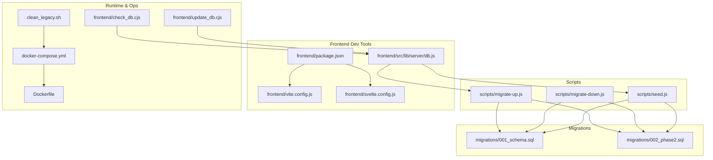
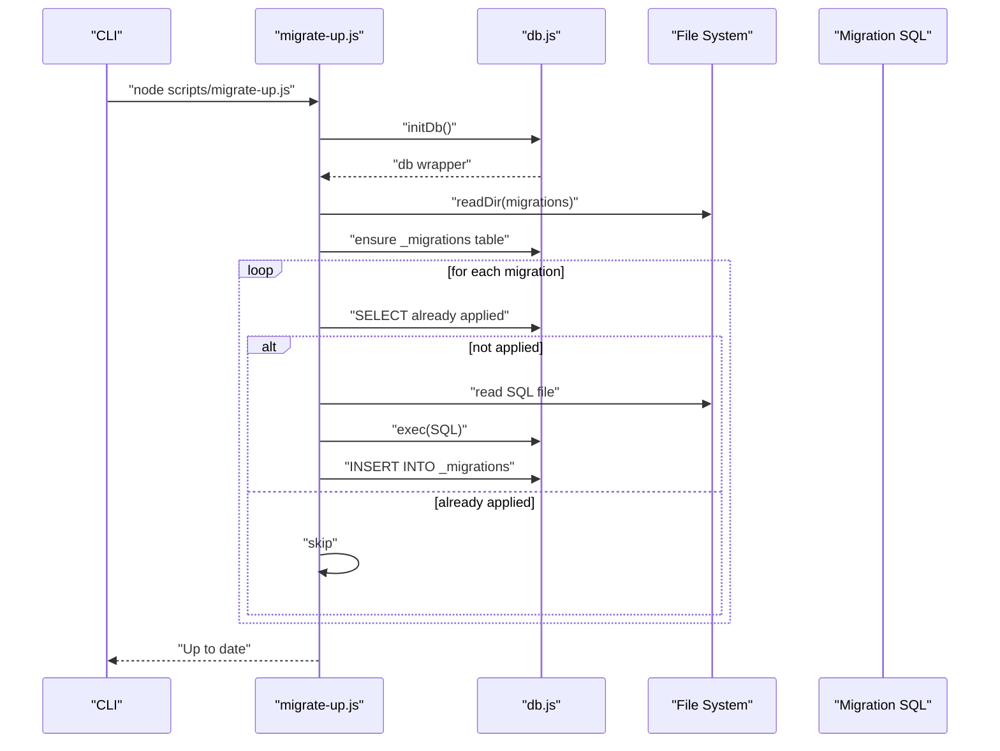
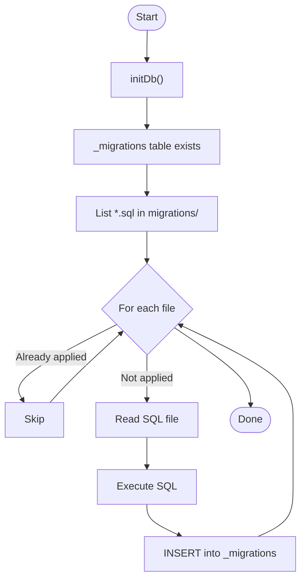
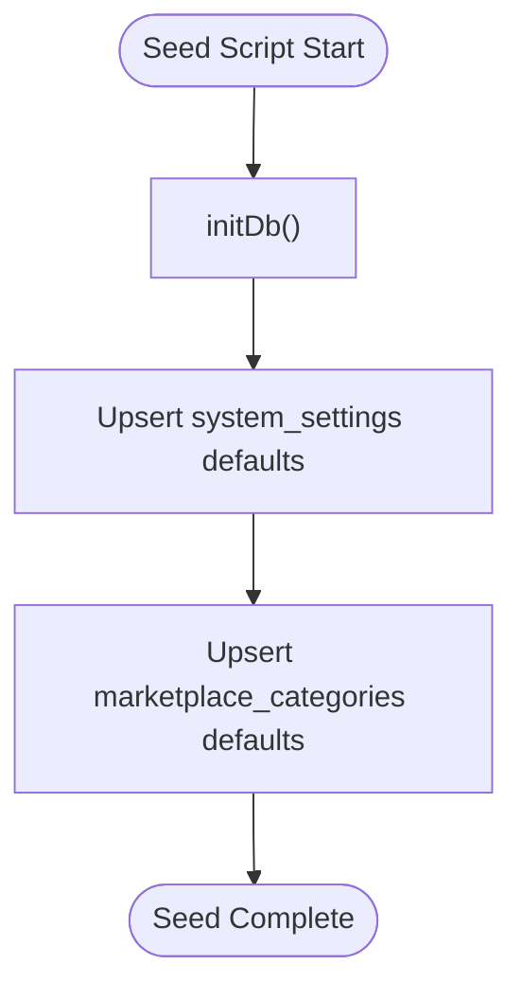
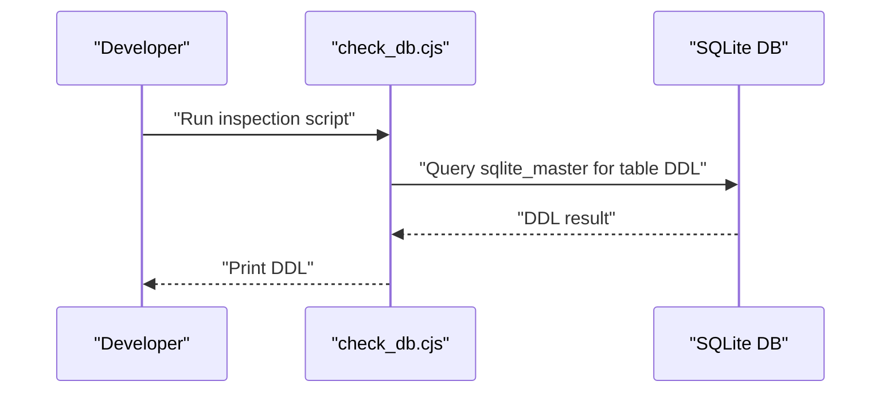
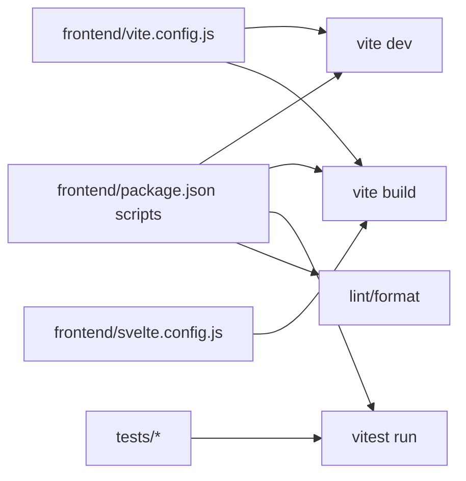
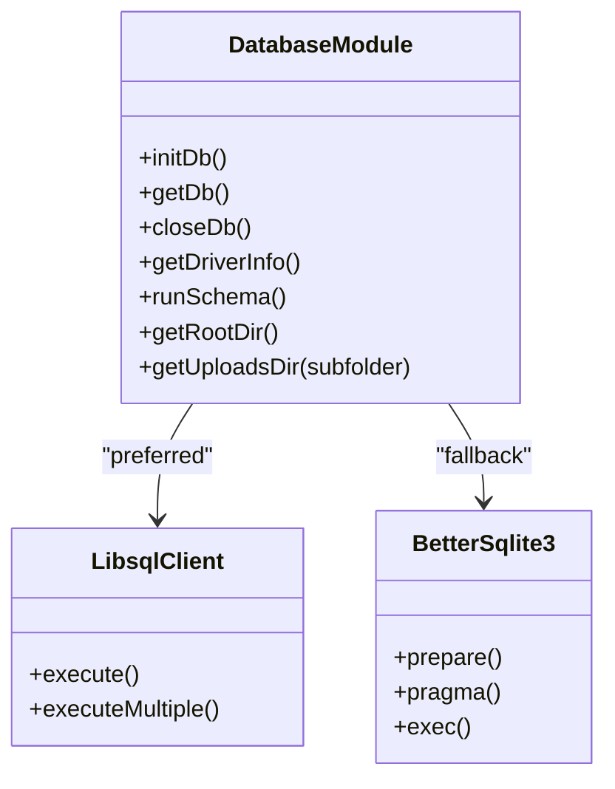
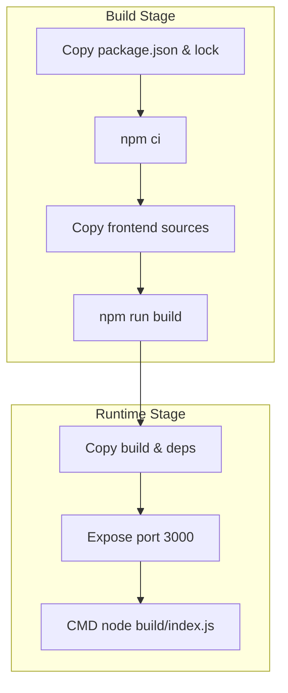
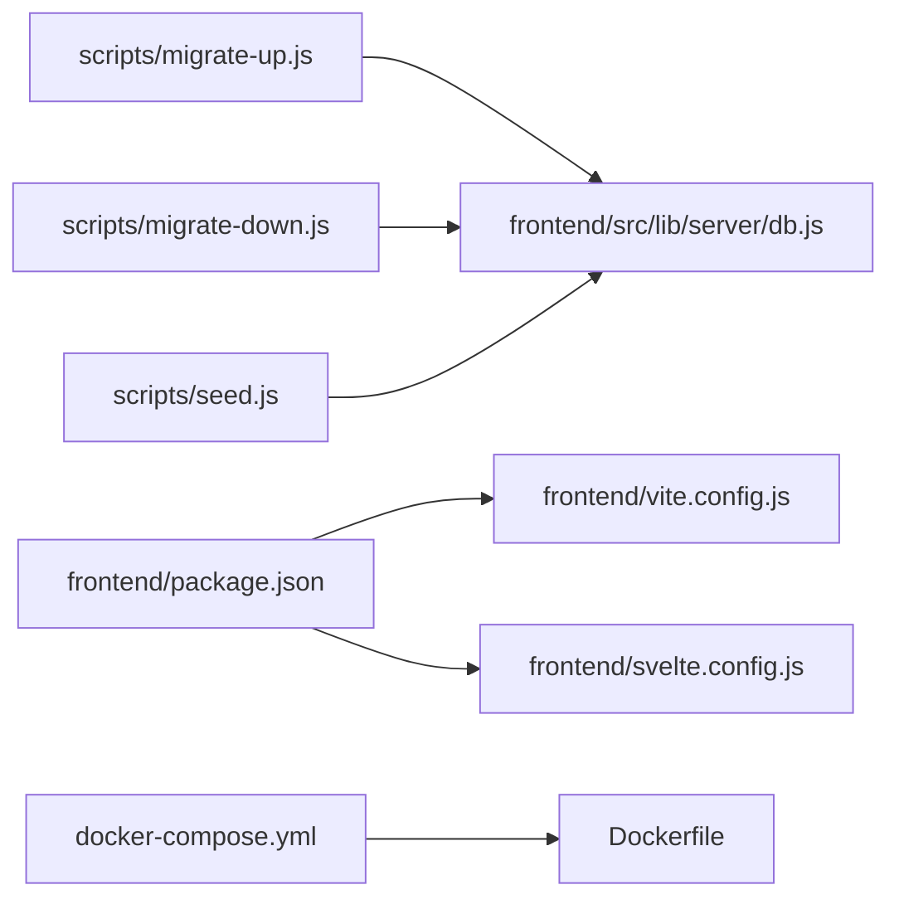

# Development Tools & Utilities

<cite>
**Referenced Files in This Document**
- [migrations/001_schema.sql](file://migrations/001_schema.sql)
- [migrations/002_phase2.sql](file://migrations/002_phase2.sql)
- [scripts/migrate-up.js](file://scripts/migrate-up.js)
- [scripts/migrate-down.js](file://scripts/migrate-down.js)
- [scripts/seed.js](file://scripts/seed.js)
- [frontend/check_db.cjs](file://frontend/check_db.cjs)
- [frontend/update_db.cjs](file://frontend/update_db.cjs)
- [clean_legacy.sh](file://clean_legacy.sh)
- [frontend/package.json](file://frontend/package.json)
- [frontend/vite.config.js](file://frontend/vite.config.js)
- [vite.config.js](file://vite.config.js)
- [frontend/svelte.config.js](file://frontend/svelte.config.js)
- [docker-compose.yml](file://docker-compose.yml)
- [Dockerfile](file://Dockerfile)
- [frontend/src/lib/server/db.js](file://frontend/src/lib/server/db.js)
</cite>

## Table of Contents
1. [Introduction](#introduction)
2. [Project Structure](#project-structure)
3. [Core Components](#core-components)
4. [Architecture Overview](#architecture-overview)
5. [Detailed Component Analysis](#detailed-component-analysis)
6. [Dependency Analysis](#dependency-analysis)
7. [Performance Considerations](#performance-considerations)
8. [Troubleshooting Guide](#troubleshooting-guide)
9. [Conclusion](#conclusion)
10. [Appendices](#appendices)

## Introduction
This document describes VSocial’s development tools and utility scripts with a focus on the database migration system, seed data management, schema evolution, and developer workflow. It also covers database maintenance utilities, legacy cleanup, local development setup, testing, and deployment via Docker. Practical examples illustrate how to run migrations, seed data, troubleshoot schema issues, and maintain the system efficiently.

## Project Structure
The repository organizes development-related utilities around three primary areas:
- Database schema and migrations under migrations/
- Migration runners and seed utilities under scripts/
- Local development tooling under frontend/ (Vite, SvelteKit, and database helpers)
- Deployment and runtime configuration under docker-compose.yml and Dockerfile
- Legacy cleanup shell script under root

**Diagram sources**
- [migrations/001_schema.sql](file://migrations/001_schema.sql)
- [migrations/002_phase2.sql](file://migrations/002_phase2.sql)
- [scripts/migrate-up.js](file://scripts/migrate-up.js)
- [scripts/migrate-down.js](file://scripts/migrate-down.js)
- [scripts/seed.js](file://scripts/seed.js)
- [frontend/package.json](file://frontend/package.json)
- [frontend/vite.config.js](file://frontend/vite.config.js)
- [frontend/svelte.config.js](file://frontend/svelte.config.js)
- [docker-compose.yml](file://docker-compose.yml)
- [Dockerfile](file://Dockerfile)
- [frontend/src/lib/server/db.js](file://frontend/src/lib/server/db.js)
- [frontend/check_db.cjs](file://frontend/check_db.cjs)
- [frontend/update_db.cjs](file://frontend/update_db.cjs)
- [clean_legacy.sh](file://clean_legacy.sh)

**Section sources**
- [migrations/001_schema.sql](file://migrations/001_schema.sql)
- [migrations/002_phase2.sql](file://migrations/002_phase2.sql)
- [scripts/migrate-up.js](file://scripts/migrate-up.js)
- [scripts/migrate-down.js](file://scripts/migrate-down.js)
- [scripts/seed.js](file://scripts/seed.js)
- [frontend/package.json](file://frontend/package.json)
- [frontend/vite.config.js](file://frontend/vite.config.js)
- [frontend/svelte.config.js](file://frontend/svelte.config.js)
- [docker-compose.yml](file://docker-compose.yml)
- [Dockerfile](file://Dockerfile)
- [frontend/src/lib/server/db.js](file://frontend/src/lib/server/db.js)
- [frontend/check_db.cjs](file://frontend/check_db.cjs)
- [frontend/update_db.cjs](file://frontend/update_db.cjs)
- [clean_legacy.sh](file://clean_legacy.sh)

## Core Components
- Database abstraction and initialization: A unified database client wrapper supports both remote and local SQLite modes with transaction and error-handling semantics.
- Migration system: A lightweight migration engine that tracks applied migrations and applies SQL files in order.
- Seed utilities: Scripts to populate initial system settings and marketplace categories.
- Local development tools: Vite and SvelteKit configuration, plus helper scripts for schema inspection and quick fixes.
- Deployment: Dockerized production build and runtime with health checks and persistent storage.

**Section sources**
- [frontend/src/lib/server/db.js](file://frontend/src/lib/server/db.js)
- [scripts/migrate-up.js](file://scripts/migrate-up.js)
- [scripts/migrate-down.js](file://scripts/migrate-down.js)
- [scripts/seed.js](file://scripts/seed.js)
- [frontend/package.json](file://frontend/package.json)
- [frontend/vite.config.js](file://frontend/vite.config.js)
- [frontend/svelte.config.js](file://frontend/svelte.config.js)
- [docker-compose.yml](file://docker-compose.yml)
- [Dockerfile](file://Dockerfile)

## Architecture Overview
The migration and database utilities integrate with the frontend server to provide a consistent development and deployment experience. The database layer auto-selects a driver, initializes pragmas for performance, and exposes a uniform async API. Migration scripts rely on this layer to apply schema changes and track progress.

**Diagram sources**
- [scripts/migrate-up.js](file://scripts/migrate-up.js)
- [frontend/src/lib/server/db.js](file://frontend/src/lib/server/db.js)

**Section sources**
- [scripts/migrate-up.js](file://scripts/migrate-up.js)
- [frontend/src/lib/server/db.js](file://frontend/src/lib/server/db.js)

## Detailed Component Analysis

### Database Migration System
- Purpose: Apply ordered schema changes and track applied migrations.
- Schema evolution: Two primary migration files define the evolving schema. The first establishes core tables and policies; the second extends domains for auth, privacy, groups, push notifications, ads, and more.
- Migration runner (up): Scans the migrations directory, ensures a migration tracking table exists, and applies SQL files in sorted order, recording each application.
- Migration runner (down): Reads the last N applied migrations and executes corresponding .down.sql files if present, removing entries from the tracking table.

**Diagram sources**
- [scripts/migrate-up.js](file://scripts/migrate-up.js)
- [migrations/001_schema.sql](file://migrations/001_schema.sql)
- [migrations/002_phase2.sql](file://migrations/002_phase2.sql)

Practical usage examples:
- Run all pending migrations: node scripts/migrate-up.js
- Rollback last N migrations: node scripts/migrate-down.js N

Notes:
- The system expects a companion .down.sql per migration file to support downgrade. If missing, the runner skips that migration.
- The migration tracker table persists in the database to prevent reapplication.

**Section sources**
- [scripts/migrate-up.js](file://scripts/migrate-up.js)
- [scripts/migrate-down.js](file://scripts/migrate-down.js)
- [migrations/001_schema.sql](file://migrations/001_schema.sql)
- [migrations/002_phase2.sql](file://migrations/002_phase2.sql)

### Seed Data Management
- Purpose: Populate essential system settings and marketplace categories for a fresh installation.
- Behavior: Inserts default keys/values into system_settings and marketplace_categories, safely ignoring conflicts.

**Diagram sources**
- [scripts/seed.js](file://scripts/seed.js)

Practical usage example:
- Seed the database: node scripts/seed.js

**Section sources**
- [scripts/seed.js](file://scripts/seed.js)

### Database Maintenance Utilities
- Schema inspection: A small script connects to the SQLite database and prints the DDL for a specific table, useful for diagnosing schema mismatches.
- Quick fixes: Another script ensures a missing table exists by applying a targeted ALTER TABLE or CREATE TABLE statement.

**Diagram sources**
- [frontend/check_db.cjs](file://frontend/check_db.cjs)

Practical usage example:
- Inspect a table definition: node frontend/check_db.cjs

Additional quick fix example:
- Ensure a table exists: node frontend/update_db.cjs

**Section sources**
- [frontend/check_db.cjs](file://frontend/check_db.cjs)
- [frontend/update_db.cjs](file://frontend/update_db.cjs)

### Legacy Cleanup
- Purpose: Remove obsolete PHP artifacts and legacy endpoints from the repository.
- Impact: Cleans public API endpoints, installer, router, and debug scripts.

Practical usage example:
- Run cleanup: bash clean_legacy.sh

**Section sources**
- [clean_legacy.sh](file://clean_legacy.sh)

### Development Workflow Tools
- Build and dev server: Vite dev and build commands configured for SvelteKit.
- Testing: Vitest configured for unit tests under tests/.
- Formatting and linting: Prettier and ESLint commands integrated into scripts.
- Environment configuration: dotenv loaded in the database module; DB_PATH and DATABASE_URL control driver selection and persistence.

**Diagram sources**
- [frontend/package.json](file://frontend/package.json)
- [frontend/vite.config.js](file://frontend/vite.config.js)
- [frontend/svelte.config.js](file://frontend/svelte.config.js)
- [vite.config.js](file://vite.config.js)

**Section sources**
- [frontend/package.json](file://frontend/package.json)
- [frontend/vite.config.js](file://frontend/vite.config.js)
- [frontend/svelte.config.js](file://frontend/svelte.config.js)
- [vite.config.js](file://vite.config.js)

### Local Development Environment Setup
- Database configuration: The database module reads DB_PATH or DATABASE_URL from environment variables and automatically selects @libsql/client (preferred) or falls back to better-sqlite3.
- Pragmas and performance: On local connections, the module sets journal_mode=WAL, foreign_keys=ON, and other performance-related pragmas.
- Uploads directory: Helper method ensures uploads folder exists under the project root.
- SvelteKit adapter: Node adapter configured with precompression and explicit env prefix.

**Diagram sources**
- [frontend/src/lib/server/db.js](file://frontend/src/lib/server/db.js)

**Section sources**
- [frontend/src/lib/server/db.js](file://frontend/src/lib/server/db.js)
- [frontend/svelte.config.js](file://frontend/svelte.config.js)

### Deployment and Runtime
- Dockerfile: Multi-stage build that installs dependencies, builds the frontend, and runs the production server.
- docker-compose.yml: Runs the service with health checks, persistent volume for data, and environment variables for DB path, uploads, and JWT secret.

**Diagram sources**
- [Dockerfile](file://Dockerfile)

**Section sources**
- [Dockerfile](file://Dockerfile)
- [docker-compose.yml](file://docker-compose.yml)

## Dependency Analysis
- Migration scripts depend on the database module for initialization and execution.
- Seed script depends on the database module for inserts.
- Frontend tooling (Vite, SvelteKit) depends on package.json scripts and configs.
- Runtime depends on Docker compose and environment variables.

**Diagram sources**
- [scripts/migrate-up.js](file://scripts/migrate-up.js)
- [scripts/migrate-down.js](file://scripts/migrate-down.js)
- [scripts/seed.js](file://scripts/seed.js)
- [frontend/src/lib/server/db.js](file://frontend/src/lib/server/db.js)
- [frontend/package.json](file://frontend/package.json)
- [frontend/vite.config.js](file://frontend/vite.config.js)
- [frontend/svelte.config.js](file://frontend/svelte.config.js)
- [docker-compose.yml](file://docker-compose.yml)
- [Dockerfile](file://Dockerfile)

**Section sources**
- [scripts/migrate-up.js](file://scripts/migrate-up.js)
- [scripts/migrate-down.js](file://scripts/migrate-down.js)
- [scripts/seed.js](file://scripts/seed.js)
- [frontend/src/lib/server/db.js](file://frontend/src/lib/server/db.js)
- [frontend/package.json](file://frontend/package.json)
- [frontend/vite.config.js](file://frontend/vite.config.js)
- [frontend/svelte.config.js](file://frontend/svelte.config.js)
- [docker-compose.yml](file://docker-compose.yml)
- [Dockerfile](file://Dockerfile)

## Performance Considerations
- WAL mode and pragmas: The database module enables WAL and tuned pragmas for local deployments to improve concurrency and durability.
- Indexes and partitions: Migrations define strategic indexes and a partitioned table for high-volume analytics.
- Remote vs local: Remote mode disables some local-only pragmas; ensure appropriate environment configuration.

[No sources needed since this section provides general guidance]

## Troubleshooting Guide
Common scenarios and remedies:
- Migration fails on a specific file: Review the error output from the migration runner and inspect the failing SQL. Fix the SQL or adjust prerequisites, then rerun the migration.
- Downgrade not possible: If a .down.sql file is missing, the downgrade runner will warn and skip that migration. Add the missing .down.sql or manually revert changes.
- Schema mismatch: Use the inspection script to print the DDL for a table and compare against expectations.
- Missing table during development: Use the quick-fix script to create or alter the table as needed.
- Driver not available: The database module logs which driver is selected and throws a clear error if neither is available. Install @libsql/client or better-sqlite3.

**Section sources**
- [scripts/migrate-up.js](file://scripts/migrate-up.js)
- [scripts/migrate-down.js](file://scripts/migrate-down.js)
- [frontend/check_db.cjs](file://frontend/check_db.cjs)
- [frontend/update_db.cjs](file://frontend/update_db.cjs)
- [frontend/src/lib/server/db.js](file://frontend/src/lib/server/db.js)

## Conclusion
VSocial’s development tools provide a robust, portable migration system, efficient seed utilities, and streamlined local development and deployment workflows. By leveraging the unified database abstraction, developers can confidently evolve the schema, manage seed data, and maintain the system across environments.

[No sources needed since this section summarizes without analyzing specific files]

## Appendices

### Practical Examples Index
- Run migrations: node scripts/migrate-up.js
- Rollback migrations: node scripts/migrate-down.js N
- Seed database: node scripts/seed.js
- Inspect schema: node frontend/check_db.cjs
- Quick fix table: node frontend/update_db.cjs
- Clean legacy PHP: bash clean_legacy.sh
- Start dev server: npm run dev (frontend)
- Build app: npm run build (frontend)
- Run tests: npm run test
- Lint/format: npm run lint / npm run format
- Docker build/run: docker-compose up --build

[No sources needed since this section lists examples without analyzing specific files]