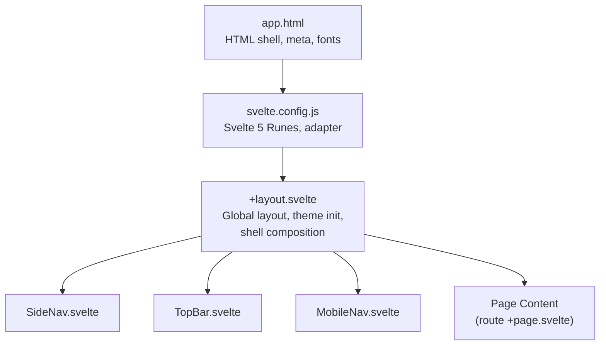
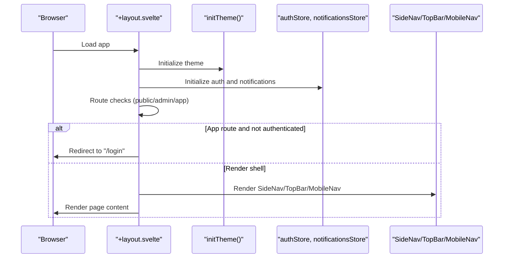
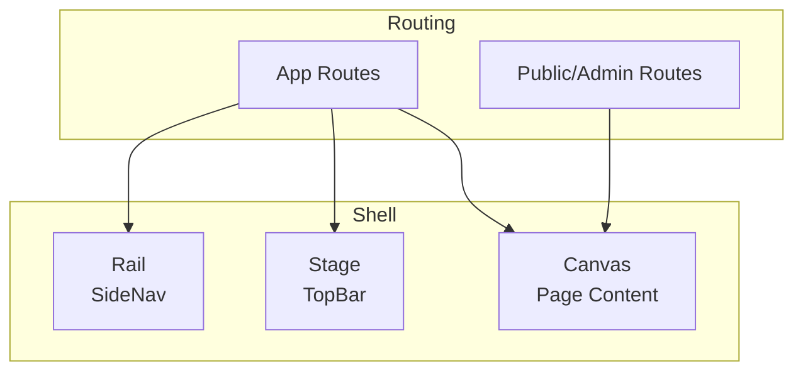
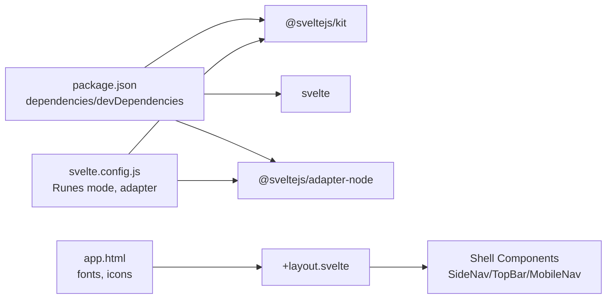

# Component System & Design Library

<cite>
**Referenced Files in This Document**
- [ARCHITECTURE.md](file://ARCHITECTURE.md)
- [Personality & SOUL.md](file://Personality & SOUL.md)
- [+layout.svelte](file://frontend/src/routes/+layout.svelte)
- [app.html](file://frontend/src/app.html)
- [svelte.config.js](file://frontend/svelte.config.js)
- [package.json](file://frontend/package.json)
</cite>

## Table of Contents
1. [Introduction](#introduction)
2. [Project Structure](#project-structure)
3. [Core Components](#core-components)
4. [Architecture Overview](#architecture-overview)
5. [Detailed Component Analysis](#detailed-component-analysis)
6. [Dependency Analysis](#dependency-analysis)
7. [Performance Considerations](#performance-considerations)
8. [Troubleshooting Guide](#troubleshooting-guide)
9. [Conclusion](#conclusion)
10. [Appendices](#appendices)

## Introduction
This document describes VSocial’s component system and design library. It explains the component architecture, reusable UI patterns, and the design system built around Glassmorphism 2.0 and Neo-Aero. It documents component composition, prop/event/slot usage, naming conventions, and folder structure. Practical guidance is included for building custom components, integrating third-party libraries, maintaining consistency, testing, accessibility, and responsive design. Global styles, theme system, and styling conventions are also covered.

## Project Structure
The frontend is a SvelteKit application configured for Svelte 5 Runes mode. The runtime layout composes top-level shell components and renders page-specific content. The design system is implemented via CSS custom properties and layered glass-like UI tokens.

**Diagram sources**
- [app.html:1-24](file://frontend/src/app.html#L1-L24)
- [svelte.config.js:1-19](file://frontend/svelte.config.js#L1-L19)
- [+layout.svelte:1-341](file://frontend/src/routes/+layout.svelte#L1-L341)

**Section sources**
- [svelte.config.js:1-19](file://frontend/svelte.config.js#L1-L19)
- [+layout.svelte:1-341](file://frontend/src/routes/+layout.svelte#L1-L341)
- [app.html:1-24](file://frontend/src/app.html#L1-L24)

## Core Components
The layout composes three primary shell components:
- SideNav: Left-rail navigation for primary app routes.
- TopBar: Desktop header with global actions and branding.
- MobileNav: Bottom/mobile navigation for smaller screens.

These components are rendered inside a shell container that separates rail, stage, and canvas areas. The layout also initializes the theme and manages routing guards and authentication redirects.

**Diagram sources**
- [+layout.svelte:1-341](file://frontend/src/routes/+layout.svelte#L1-L341)

**Section sources**
- [+layout.svelte:1-341](file://frontend/src/routes/+layout.svelte#L1-L341)

## Architecture Overview
The component architecture centers on a single-page layout that conditionally renders either a boot screen, public/admin pages, or the main app shell. Within the app shell, the layout composes three persistent UI regions:
- Rail: Left-side navigation (SideNav)
- Stage: Main area containing TopBar and content canvas
- Canvas: Page content area

Responsive behavior is handled via media queries in the layout stylesheet, switching from mobile-first to desktop layout at a breakpoint.

**Diagram sources**
- [+layout.svelte:124-142](file://frontend/src/routes/+layout.svelte#L124-L142)

**Section sources**
- [+layout.svelte:124-142](file://frontend/src/routes/+layout.svelte#L124-L142)

## Detailed Component Analysis
This section outlines the design system and component composition patterns used across the application.

### Design System Tokens and Styles
The design system relies on CSS custom properties for glass surfaces, depth layers, neon accents, animation curves, and timing. These tokens enable consistent theming and responsive behavior.

Key token categories:
- Glass layers: surface, border, highlight, shadow
- Depth system: layered shadows for elevation
- Neon accents: glow effects aligned with primary colors
- Animation curves and durations: easing and timing presets

These tokens are defined globally and consumed by components to maintain visual consistency.

**Section sources**
- [Personality & SOUL.md:94-128](file://Personality & SOUL.md#L94-L128)
- [ARCHITECTURE.md:53-70](file://ARCHITECTURE.md#L53-L70)

### Component Composition Patterns
- Persistent shell: SideNav, TopBar, MobileNav are composed within the layout and remain visible across pages.
- Conditional rendering: The layout switches between boot state, public/admin routes, and authenticated app routes.
- Responsive breakpoints: Desktop layout activates at a minimum viewport width, enabling rail navigation and optimized canvas padding.

Practical composition tips:
- Place critical navigation in the rail or top bar to ensure discoverability.
- Use the canvas area for page-specific content and avoid heavy logic in the shell.
- Apply the design tokens consistently to achieve cohesive visuals.

**Section sources**
- [+layout.svelte:124-142](file://frontend/src/routes/+layout.svelte#L124-L142)
- [+layout.svelte:331-339](file://frontend/src/routes/+layout.svelte#L331-L339)

### Prop Interfaces, Events, and Slots
- Props: The layout script declares props and reactive state for route handling and installation checks.
- Events: Navigation transitions are coordinated via lifecycle hooks and navigation callbacks.
- Slots: The layout uses a render slot to inject page content into the canvas area.

Guidelines:
- Keep props minimal and derived where possible.
- Use Svelte’s reactive statements for route-derived decisions.
- Render slots to separate shell from page concerns.

**Section sources**
- [+layout.svelte:27-99](file://frontend/src/routes/+layout.svelte#L27-L99)

### Naming Conventions and Folder Structure
- Component naming: PascalCase for Svelte components (e.g., SideNav.svelte).
- Shell components: Located under a shared components namespace and imported into the layout.
- Routing: Pages are organized per route under routes/, with dedicated folders for admin, API, and feature areas.

Recommendations:
- Group related components under a components directory and import via a consistent alias.
- Use descriptive filenames and keep component directories self-contained.

Note: The current repository snapshot indicates a placeholder for the components directory; adopt a consistent structure as described above when adding components.

**Section sources**
- [+layout.svelte:10-12](file://frontend/src/routes/+layout.svelte#L10-L12)

### Building Custom Components
- Start from existing shell components to align with the design system.
- Use CSS custom properties for colors, shadows, and spacing.
- Implement responsive variants using media queries aligned with the layout’s breakpoint.
- Keep component APIs small and leverage reactive statements for internal state.

Integration patterns:
- Import components into the layout or page routes as needed.
- Use render slots to pass content into shell regions.

**Section sources**
- [+layout.svelte:10-12](file://frontend/src/routes/+layout.svelte#L10-L12)
- [Personality & SOUL.md:94-128](file://Personality & SOUL.md#L94-L128)

### Integrating Third-Party Libraries
- Fonts: Google Fonts are loaded in the HTML shell for display and interface typography.
- Icons: Material Icons Round is included for iconography.
- Security and performance: Dependencies are managed via package.json; ensure updates follow linting and testing workflows.

Best practices:
- Load fonts and icons early in the HTML head.
- Audit third-party packages regularly for vulnerabilities and bundle size.

**Section sources**
- [app.html:13-17](file://frontend/src/app.html#L13-L17)
- [package.json:17-47](file://frontend/package.json#L17-L47)

### Maintaining Component Consistency
- Centralize design tokens in CSS custom properties and consume them in components.
- Enforce naming and composition patterns across the codebase.
- Use the layout’s render slot pattern to preserve separation of concerns.

**Section sources**
- [Personality & SOUL.md:94-128](file://Personality & SOUL.md#L94-L128)
- [+layout.svelte:124-142](file://frontend/src/routes/+layout.svelte#L124-L142)

## Dependency Analysis
The frontend depends on SvelteKit and Svelte 5 Runes, with Node adapter for SSR/production builds. The design system depends on CSS custom properties and font/icon resources loaded in the HTML shell.

**Diagram sources**
- [package.json:17-47](file://frontend/package.json#L17-L47)
- [svelte.config.js:1-19](file://frontend/svelte.config.js#L1-19)
- [app.html:13-17](file://frontend/src/app.html#L13-L17)
- [+layout.svelte:10-12](file://frontend/src/routes/+layout.svelte#L10-L12)

**Section sources**
- [package.json:17-47](file://frontend/package.json#L17-L47)
- [svelte.config.js:1-19](file://frontend/svelte.config.js#L1-L19)
- [app.html:13-17](file://frontend/src/app.html#L13-L17)
- [+layout.svelte:10-12](file://frontend/src/routes/+layout.svelte#L10-L12)

## Performance Considerations
- Rendering performance: The design emphasizes GPU-friendly transforms and layered shadows; avoid unnecessary DOM thrashing.
- Layout stability: Use explicit sizing shields for dynamic containers to prevent browser engine quirks.
- Animations: Prefer CSS custom properties and predefined easing/timing tokens for smooth transitions.
- Bundle size: Limit third-party dependencies and audit regularly.

**Section sources**
- [Personality & SOUL.md:71-76](file://Personality & SOUL.md#L71-L76)
- [Personality & SOUL.md:116-127](file://Personality & SOUL.md#L116-L127)

## Troubleshooting Guide
- Boot screen: The layout displays a branded boot screen until initialization completes; ensure theme initialization and store initialization are successful.
- Authentication redirects: If navigating to app routes while unauthenticated, the layout redirects to the login route.
- Installation and setup: The layout checks installation and setup endpoints and redirects accordingly.
- Responsive layout: Verify the media query breakpoint for desktop layout activation.

Actions:
- Confirm theme initialization and store readiness before rendering shell components.
- Inspect network requests to installation and setup endpoints.
- Validate media query behavior across devices.

**Section sources**
- [+layout.svelte:106-142](file://frontend/src/routes/+layout.svelte#L106-L142)
- [+layout.svelte:39-99](file://frontend/src/routes/+layout.svelte#L39-L99)

## Conclusion
VSocial’s component system is built around a robust layout that composes persistent shell components and renders page-specific content. The design system leverages CSS custom properties to enforce visual consistency and performance-first patterns. By following the naming conventions, composition patterns, and token usage outlined here, teams can build scalable, accessible, and responsive UI components that align with the Glassmorphism 2.0 and Neo-Aero aesthetic.

## Appendices
- Accessibility: Use semantic markup, ARIA attributes where appropriate, and ensure keyboard navigability in shell components.
- Testing: Adopt unit and integration tests for layout logic and component behavior; use the project’s test runner configuration.
- Responsive design: Align component layouts with the layout’s breakpoint and use the design tokens for consistent spacing and typography.

[No sources needed since this section provides general guidance]