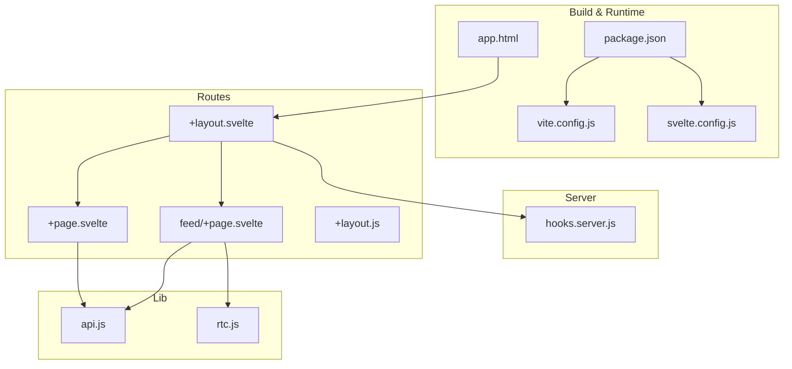
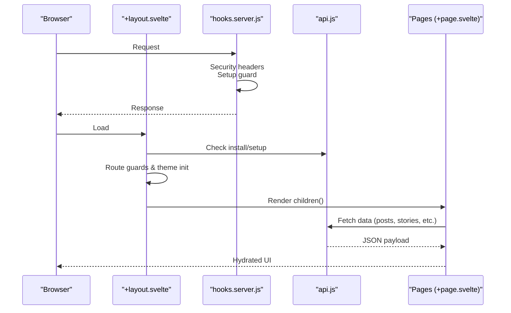
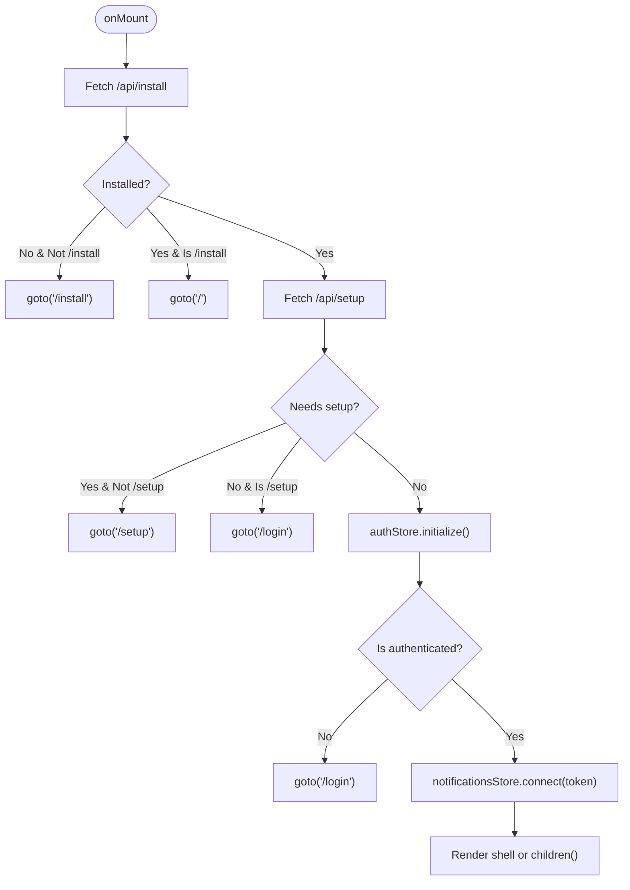
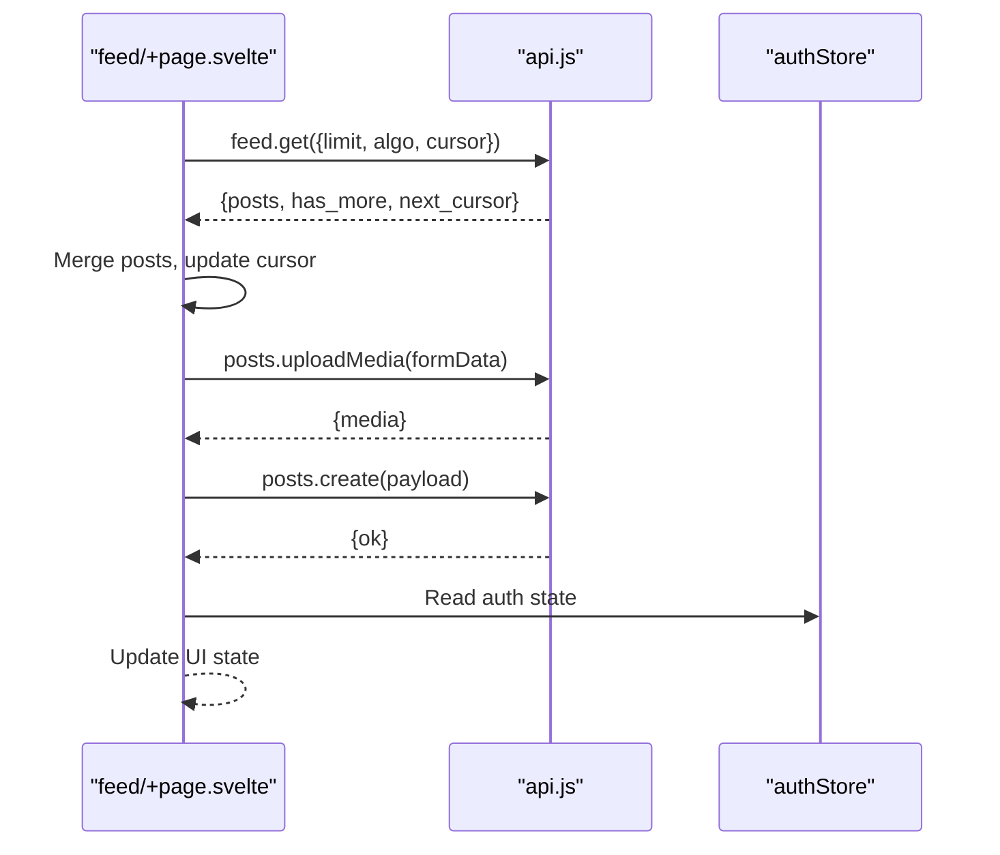
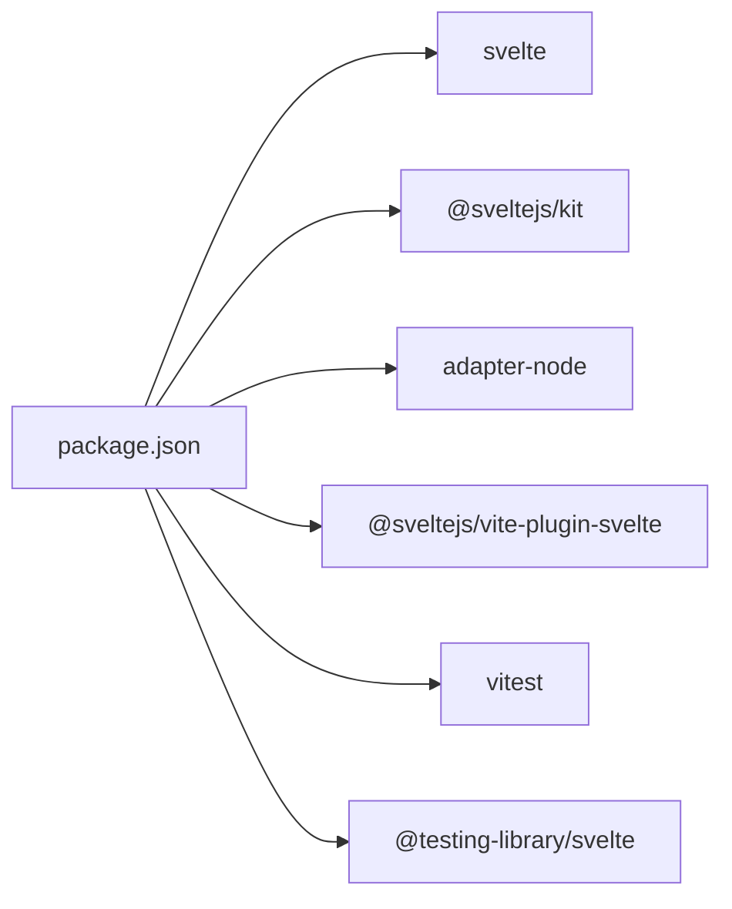
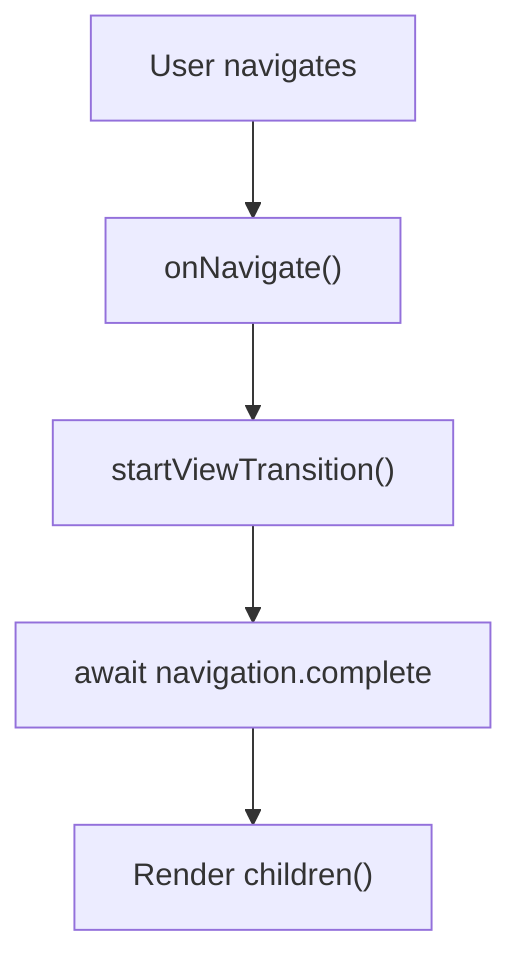

# Frontend Architecture & Components

<cite>
**Referenced Files in This Document**
- [package.json](file://frontend/package.json)
- [svelte.config.js](file://frontend/svelte.config.js)
- [vite.config.js](file://frontend/vite.config.js)
- [+layout.svelte](file://frontend/src/route/+layout.svelte)
- [+layout.js](file://frontend/src/route/+layout.js)
- [+page.svelte](file://frontend/src/route/+page.svelte)
- [feed/+page.svelte](file://frontend/src/route/feed/+page.svelte)
- [api.js](file://frontend/src/lib/api.js)
- [rtc.js](file://frontend/src/lib/rtc.js)
- [hooks.server.js](file://frontend/src/hooks.server.js)
- [app.html](file://frontend/src/app.html)
</cite>

## Table of Contents
1. [Introduction](#introduction)
2. [Project Structure](#project-structure)
3. [Core Components](#core-components)
4. [Architecture Overview](#architecture-overview)
5. [Detailed Component Analysis](#detailed-component-analysis)
6. [Dependency Analysis](#dependency-analysis)
7. [Performance Considerations](#performance-considerations)
8. [Testing Approaches](#testing-approaches)
9. [Accessibility Compliance](#accessibility-compliance)
10. [Routing, Layouts, and Transitions](#routing-layouts-and-transitions)
11. [State Management with Stores](#state-management-with-stores)
12. [Component Library and Design System](#component-library-and-design-system)
13. [Integration Patterns with Backend APIs](#integration-patterns-with-backend-apis)
14. [Troubleshooting Guide](#troubleshooting-guide)
15. [Conclusion](#conclusion)

## Introduction
This document explains VSocial’s frontend architecture and component system built with Svelte 5. It covers Svelte 5 reactivity with runes, component composition patterns, state management via stores, routing and layout management, page transitions, and the design system. It also documents performance optimization techniques, code-splitting strategies, accessibility considerations, testing approaches, and integration patterns with backend APIs.

## Project Structure
The frontend is organized under the SvelteKit convention with a clear separation of routes, shared libraries, and server hooks:
- Routes: top-level pages and nested routes under src/routes
- Shared library: src/lib containing API clients, stores, and reusable components
- Server hooks: src/hooks.server.js for SSR, security headers, and cron initialization
- Build and runtime configuration: svelte.config.js, vite.config.js, package.json, app.html

**Diagram sources**
- [vite.config.js:1-14](file://frontend/vite.config.js#L1-L14)
- [svelte.config.js:1-19](file://frontend/svelte.config.js#L1-L19)
- [+layout.svelte:1-341](file://frontend/src/route/+layout.svelte#L1-L341)
- [+layout.js:1-3](file://frontend/src/route/+layout.js#L1-L3)
- [+page.svelte:1-800](file://frontend/src/route/+page.svelte#L1-L800)
- [feed/+page.svelte:1-800](file://frontend/src/route/feed/+page.svelte#L1-L800)
- [api.js:1-350](file://frontend/src/lib/api.js#L1-L350)
- [rtc.js:1-299](file://frontend/src/lib/rtc.js#L1-L299)
- [hooks.server.js:1-179](file://frontend/src/hooks.server.js#L1-L179)
- [app.html:1-24](file://frontend/src/app.html#L1-L24)

**Section sources**
- [package.json:1-49](file://frontend/package.json#L1-L49)
- [svelte.config.js:1-19](file://frontend/svelte.config.js#L1-L19)
- [vite.config.js:1-14](file://frontend/vite.config.js#L1-L14)
- [+layout.svelte:1-341](file://frontend/src/route/+layout.svelte#L1-L341)
- [+layout.js:1-3](file://frontend/src/route/+layout.js#L1-L3)
- [+page.svelte:1-800](file://frontend/src/route/+page.svelte#L1-L800)
- [feed/+page.svelte:1-800](file://frontend/src/route/feed/+page.svelte#L1-L800)
- [api.js:1-350](file://frontend/src/lib/api.js#L1-L350)
- [rtc.js:1-299](file://frontend/src/lib/rtc.js#L1-L299)
- [hooks.server.js:1-179](file://frontend/src/hooks.server.js#L1-L179)
- [app.html:1-24](file://frontend/src/app.html#L1-L24)

## Core Components
- Root layout manages global navigation, theme initialization, route guards, and page transitions
- Feed page composes reusable UI components, integrates with API clients, and handles complex state for posts, stories, reels, and polls
- API client module encapsulates all backend interactions with centralized auth and error handling
- RTC manager orchestrates WebRTC signaling and connection lifecycle

**Section sources**
- [+layout.svelte:1-341](file://frontend/src/route/+layout.svelte#L1-L341)
- [feed/+page.svelte:1-800](file://frontend/src/route/feed/+page.svelte#L1-L800)
- [api.js:1-350](file://frontend/src/lib/api.js#L1-L350)
- [rtc.js:1-299](file://frontend/src/lib/rtc.js#L1-L299)

## Architecture Overview
The frontend uses SvelteKit’s SSR/SSR hybrid with server hooks for security and bootstrapping. The root layout initializes theme, checks installation and setup states, enforces authentication, and renders either a boot screen or the shell with side navigation and top bar. Pages consume the API client and render reusable components.

**Diagram sources**
- [+layout.svelte:1-341](file://frontend/src/route/+layout.svelte#L1-L341)
- [hooks.server.js:105-147](file://frontend/src/hooks.server.js#L105-L147)
- [api.js:1-350](file://frontend/src/lib/api.js#L1-L350)
- [+page.svelte:1-800](file://frontend/src/route/+page.svelte#L1-L800)

## Detailed Component Analysis

### Root Layout (+layout.svelte)
Responsibilities:
- Initialize theme and listen for navigation transitions
- Enforce installation and setup redirects
- Authenticate users and connect notifications when logged in
- Render boot UI until initialization completes
- Provide shell layout for authenticated users with side rail, top bar, and mobile nav

Key patterns:
- Uses Svelte 5 runes ($state, $derived, $effect, $props)
- Guards routes based on page URL and auth store
- Integrates with navigation transitions via View Transition API

**Diagram sources**
- [+layout.svelte:39-93](file://frontend/src/route/+layout.svelte#L39-L93)

**Section sources**
- [+layout.svelte:1-341](file://frontend/src/route/+layout.svelte#L1-L341)

### Feed Page (feed/+page.svelte)
Responsibilities:
- Load posts with pagination and algorithm selection
- Compose stories and suggested creators
- Provide quick creation UI for posts, stories, and reels
- Manage complex state for media, GIFs, music, and polls
- Integrate with API client and RTC manager for real-time features

Patterns:
- Svelte 5 runes for reactive state
- Composition of reusable components (PostCard, QuickChatWidget)
- Event-driven UI updates and controlled form bindings

**Diagram sources**
- [feed/+page.svelte:91-210](file://frontend/src/route/feed/+page.svelte#L91-L210)
- [api.js:90-131](file://frontend/src/lib/api.js#L90-L131)

**Section sources**
- [feed/+page.svelte:1-800](file://frontend/src/route/feed/+page.svelte#L1-L800)
- [api.js:1-350](file://frontend/src/lib/api.js#L1-L350)

### API Client (api.js)
Responsibilities:
- Centralized HTTP client with bearer token injection
- Helper methods for GET/POST/PUT/PATCH/DELETE and multipart uploads
- Feature-scoped namespaces for auth, feed, posts, users, stories, reels, messages, marketplace, notifications, admin, wallet, gigs, search, market, and health

Patterns:
- Request wrapper with unified error handling and empty-response handling
- Parameterized endpoints with URLSearchParams for query strings
- Exported namespace for easy consumption across components

**Section sources**
- [api.js:1-350](file://frontend/src/lib/api.js#L1-L350)

### RTC Manager (rtc.js)
Responsibilities:
- WebRTC mesh network orchestration for audio/video
- ICE candidate buffering and reconnection logic
- Signal transport via authenticated fetch to /api/rtc/signal
- Connection statistics and quality monitoring

Patterns:
- Class-based state machine with peer connections per remote participant
- Controlled reconnection attempts with exponential backoff
- Real-time stats collection and callback-driven UI updates

**Section sources**
- [rtc.js:1-299](file://frontend/src/lib/rtc.js#L1-L299)

## Dependency Analysis
Runtime and build dependencies:
- Svelte 5 with runes enforced via svelte.config.js compilerOptions
- SvelteKit adapter-node for SSR
- Vite plugin for Svelte
- Testing with Vitest and @testing-library/svelte

**Diagram sources**
- [package.json:1-49](file://frontend/package.json#L1-L49)
- [svelte.config.js:1-19](file://frontend/svelte.config.js#L1-L19)

**Section sources**
- [package.json:1-49](file://frontend/package.json#L1-L49)
- [svelte.config.js:1-19](file://frontend/svelte.config.js#L1-L19)

## Performance Considerations
- Runes mode enabled globally to leverage Svelte 5 reactivity primitives
- SSR enabled with pre-render disabled for dynamic pages; adapter-node configured for production
- Vite server allows external hosts and upload paths for development convenience
- Layout uses View Transition API for smooth page transitions
- Heavy computations and animations are offloaded to requestAnimationFrame loops in pages
- API client consolidates requests and avoids redundant fetches

Recommendations:
- Keep heavy computations off the UI thread; continue using requestAnimationFrame
- Use Svelte 5 $derived for derived computations and avoid unnecessary re-renders
- Split large components into smaller, focused pieces to improve caching and hydration
- Leverage SvelteKit’s automatic code splitting via route-based bundling

**Section sources**
- [svelte.config.js:5-8](file://frontend/svelte.config.js#L5-L8)
- [vite.config.js:6-12](file://frontend/vite.config.js#L6-L12)
- [+layout.svelte:14-23](file://frontend/src/route/+layout.svelte#L14-L23)
- [+page.svelte:98-165](file://frontend/src/route/+page.svelte#L98-L165)

## Testing Approaches
- Unit and integration tests use Vitest and @testing-library/svelte
- Scripts configured for single-run and watch modes
- Server hooks provide a global error handler and structured responses for robust testing

Best practices:
- Test components in isolation with minimal server dependencies
- Mock API client calls to simulate backend responses
- Verify navigation guards and layout behavior under different auth and setup states

**Section sources**
- [package.json:14-15](file://frontend/package.json#L14-L15)
- [hooks.server.js:154-178](file://frontend/src/hooks.server.js#L154-L178)

## Accessibility Compliance
- Semantic HTML and proper meta tags in app.html
- Focus management and keyboard-friendly controls in interactive components
- ARIA-compliant transitions and animations (avoid motion-sensitive effects for sensitive users)
- Color contrast and theme support for readability

Recommendations:
- Add explicit ARIA roles and labels where lists and dialogs are used
- Provide skip links and focus traps for modal-like experiences
- Ensure sufficient color contrast across themes

**Section sources**
- [app.html:1-24](file://frontend/src/app.html#L1-L24)
- [+page.svelte:168-170](file://frontend/src/route/+page.svelte#L168-L170)

## Routing, Layouts, and Transitions
- Root layout sets up SSR and prerender flags
- Navigation guards redirect based on installation, setup, and authentication
- View Transition API wraps navigations for smooth transitions
- Shell layout provides responsive rail, stage, and canvas areas

**Diagram sources**
- [+layout.svelte:14-23](file://frontend/src/route/+layout.svelte#L14-L23)

**Section sources**
- [+layout.js:1-3](file://frontend/src/route/+layout.js#L1-L3)
- [+layout.svelte:1-341](file://frontend/src/route/+layout.svelte#L1-L341)

## State Management with Stores
- Authentication and notifications are managed via dedicated stores imported in the layout
- Stores integrate with navigation and lifecycle events to maintain consistent state
- Layout reads and reacts to store state to enforce guards and render conditions

Patterns:
- Initialize stores during onMount
- React to store changes with $effect
- Pass tokens and flags to dependent services (e.g., notifications)

**Section sources**
- [+layout.svelte:7-99](file://frontend/src/route/+layout.svelte#L7-L99)

## Component Library and Design System
- Reusable components are used across pages (e.g., PostCard, QuickChatWidget)
- Design system relies on CSS variables and glass-morphism panels for UI consistency
- Theming is initialized at the root layout and propagated to components

Guidelines:
- Keep components props-driven and event-based
- Prefer composition over deep nesting
- Use CSS custom properties for theme-aware styles

**Section sources**
- [feed/+page.svelte:7-8](file://frontend/src/route/feed/+page.svelte#L7-L8)
- [+layout.svelte:10-13](file://frontend/src/route/+layout.svelte#L10-L13)

## Integration Patterns with Backend APIs
- Centralized API client with typed namespaces for domain areas
- Authenticated requests inject Bearer token from localStorage
- Error handling normalizes HTTP errors into structured exceptions
- File uploads use multipart/form-data with dedicated upload helper

Patterns:
- Declarative API calls in page scripts
- Controlled state updates after async operations
- Graceful fallbacks and user feedback on failures

**Section sources**
- [api.js:1-350](file://frontend/src/lib/api.js#L1-L350)
- [feed/+page.svelte:153-209](file://frontend/src/route/feed/+page.svelte#L153-L209)

## Troubleshooting Guide
Common issues and resolutions:
- Installation and setup redirects: verify /api/install and /api/setup endpoints and layout guards
- Authentication failures: confirm token presence and authStore initialization
- API errors: inspect thrown errors and status codes from the API client
- Server startup: hooks initialize database and start cron workers on first request

**Section sources**
- [+layout.svelte:42-81](file://frontend/src/route/+layout.svelte#L42-L81)
- [hooks.server.js:7-103](file://frontend/src/hooks.server.js#L7-L103)
- [api.js:38-46](file://frontend/src/lib/api.js#L38-L46)

## Conclusion
VSocial’s frontend leverages Svelte 5 runes, a modular API client, and a robust layout with navigation guards and transitions. The architecture supports SSR, responsive layouts, and real-time features through WebRTC. By adhering to component composition patterns, centralized state management, and disciplined integration with backend APIs, the system remains maintainable, performant, and accessible.