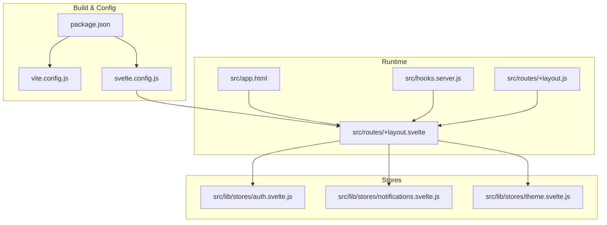
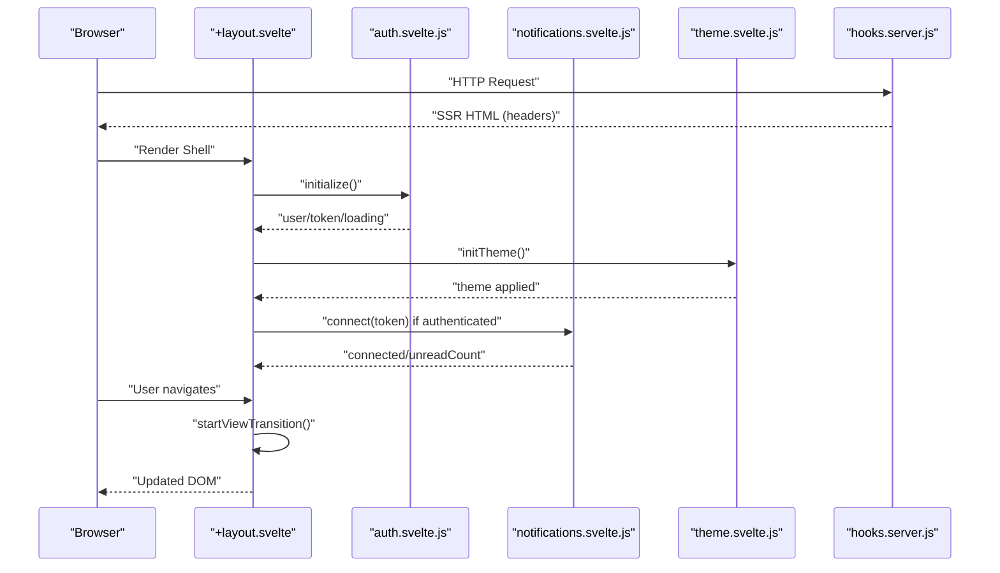
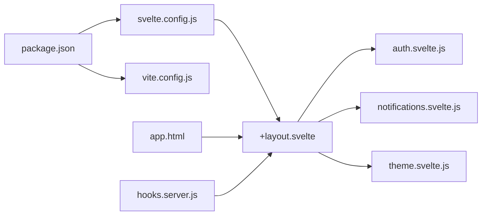

# Performance & Optimization

<cite>
**Referenced Files in This Document**
- [package.json](file://frontend/package.json)
- [vite.config.js](file://frontend/vite.config.js)
- [svelte.config.js](file://frontend/svelte.config.js)
- [app.html](file://frontend/src/app.html)
- [hooks.server.js](file://frontend/src/hooks.server.js)
- [+layout.svelte](file://frontend/src/routes/+layout.svelte)
- [+layout.js](file://frontend/src/routes/+layout.js)
- [auth.svelte.js](file://frontend/src/lib/stores/auth.svelte.js)
- [notifications.svelte.js](file://frontend/src/lib/stores/notifications.svelte.js)
- [theme.svelte.js](file://frontend/src/lib/stores/theme.svelte.js)
</cite>

## Table of Contents
1. [Introduction](#introduction)
2. [Project Structure](#project-structure)
3. [Core Components](#core-components)
4. [Architecture Overview](#architecture-overview)
5. [Detailed Component Analysis](#detailed-component-analysis)
6. [Dependency Analysis](#dependency-analysis)
7. [Performance Considerations](#performance-considerations)
8. [Troubleshooting Guide](#troubleshooting-guide)
9. [Conclusion](#conclusion)
10. [Appendices](#appendices)

## Introduction
This document provides a comprehensive guide to frontend performance optimization and best practices for VSocial. It focuses on code splitting, lazy loading, bundle optimization, component performance patterns, reactive updates, memory management, caching strategies, asset optimization, build-time optimizations, critical rendering path, hydration, SSR considerations, browser compatibility, polyfills, and progressive enhancement. The guidance is grounded in the repository’s configuration and runtime code.

## Project Structure
The frontend is built with SvelteKit and Vite. Key performance-relevant files include:
- Build and adapter configuration
- Runtime HTML template and preloading hints
- Server hooks for SSR, security, and initialization
- Application shell and navigation lifecycle
- Stores managing authentication, notifications, and theme

**Diagram sources**
- [vite.config.js:1-14](file://frontend/vite.config.js#L1-L14)
- [svelte.config.js:1-19](file://frontend/svelte.config.js#L1-L19)
- [package.json:1-49](file://frontend/package.json#L1-L49)
- [app.html:1-24](file://frontend/src/app.html#L1-L24)
- [+layout.svelte:1-341](file://frontend/src/routes/+layout.svelte#L1-L341)
- [+layout.js:1-3](file://frontend/src/routes/+layout.js#L1-L3)
- [hooks.server.js:1-179](file://frontend/src/hooks.server.js#L1-L179)
- [auth.svelte.js:1-131](file://frontend/src/lib/stores/auth.svelte.js#L1-L131)
- [notifications.svelte.js:1-232](file://frontend/src/lib/stores/notifications.svelte.js#L1-L232)
- [theme.svelte.js:1-37](file://frontend/src/lib/stores/theme.svelte.js#L1-L37)

**Section sources**
- [package.json:1-49](file://frontend/package.json#L1-L49)
- [vite.config.js:1-14](file://frontend/vite.config.js#L1-L14)
- [svelte.config.js:1-19](file://frontend/svelte.config.js#L1-L19)
- [app.html:1-24](file://frontend/src/app.html#L1-L24)
- [+layout.svelte:1-341](file://frontend/src/routes/+layout.svelte#L1-L341)
- [+layout.js:1-3](file://frontend/src/routes/+layout.js#L1-L3)
- [hooks.server.js:1-179](file://frontend/src/hooks.server.js#L1-L179)

## Core Components
- Build and adapter configuration: Controls SSR, precompression, and plugin setup.
- Runtime HTML template: Provides preload hints and font preconnections.
- Server hooks: Manage SSR, security headers, and initialization tasks.
- Application layout: Orchestrates navigation transitions, guards, and store initialization.
- Stores: Centralized state for auth, notifications (SSE), and theme.

Key performance levers:
- SSR enabled with dynamic prerender disabled.
- Precompression enabled via adapter.
- Preload data via body attribute.
- Font preconnects and icon fonts for early availability.

**Section sources**
- [svelte.config.js:1-19](file://frontend/svelte.config.js#L1-L19)
- [app.html:1-24](file://frontend/src/app.html#L1-L24)
- [hooks.server.js:105-147](file://frontend/src/hooks.server.js#L105-L147)
- [+layout.svelte:1-341](file://frontend/src/routes/+layout.svelte#L1-L341)
- [auth.svelte.js:1-131](file://frontend/src/lib/stores/auth.svelte.js#L1-L131)
- [notifications.svelte.js:1-232](file://frontend/src/lib/stores/notifications.svelte.js#L1-L232)
- [theme.svelte.js:1-37](file://frontend/src/lib/stores/theme.svelte.js#L1-L37)

## Architecture Overview
The runtime architecture integrates SSR, client-side navigation, and real-time updates. The layout coordinates authentication checks, route guards, and navigation transitions. Stores manage long-lived connections and reactive state.

**Diagram sources**
- [+layout.svelte:1-341](file://frontend/src/routes/+layout.svelte#L1-L341)
- [auth.svelte.js:1-131](file://frontend/src/lib/stores/auth.svelte.js#L1-L131)
- [notifications.svelte.js:1-232](file://frontend/src/lib/stores/notifications.svelte.js#L1-L232)
- [theme.svelte.js:1-37](file://frontend/src/lib/stores/theme.svelte.js#L1-L37)
- [hooks.server.js:105-147](file://frontend/src/hooks.server.js#L105-L147)

## Detailed Component Analysis

### Authentication Store
- Uses Svelte 5 runes for reactive state.
- Initializes from localStorage and sets cookies.
- Provides login/register/logout/update/refresh flows.
- Guards against invalid tokens by clearing persisted state.

Optimization insights:
- Avoid unnecessary re-renders by keeping state minimal and derived values computed lazily.
- Persist tokens securely and avoid storing sensitive data in memory longer than needed.
- On refresh, short-circuit if already initialized.

**Section sources**
- [auth.svelte.js:1-131](file://frontend/src/lib/stores/auth.svelte.js#L1-L131)

### Notifications Store (SSE)
- Establishes and maintains an EventSource connection.
- Implements exponential backoff with jitter and retry caps.
- Deduplicates events by ID to prevent duplication and memory bloat.
- Limits queues to bounded sizes to cap memory growth.
- Provides manual disconnection and cleanup.

Performance implications:
- Long-lived connections require careful teardown on navigation and auth changes.
- Deduplication and bounded queues prevent unbounded memory growth.
- Backoff avoids thundering herd on server under load.

**Section sources**
- [notifications.svelte.js:1-232](file://frontend/src/lib/stores/notifications.svelte.js#L1-L232)

### Theme Store
- Persists theme preference in localStorage.
- Applies theme via a data attribute on documentElement.
- Respects OS preference when unset.

Performance implications:
- Minimal DOM writes; toggles a single attribute.
- No heavy computations; negligible overhead.

**Section sources**
- [theme.svelte.js:1-37](file://frontend/src/lib/stores/theme.svelte.js#L1-L37)

### Application Layout and Navigation
- Enables View Transitions API if supported.
- Performs route guards and redirects based on installation and authentication state.
- Initializes stores on mount and connects SSE when authenticated.

Performance implications:
- View Transitions reduce jank during navigation.
- Early guard checks prevent unnecessary rendering of protected routes.
- Conditional rendering reduces DOM size for bootstrapping.

**Section sources**
- [+layout.svelte:1-341](file://frontend/src/routes/+layout.svelte#L1-L341)

### Server Hooks (SSR, Security, Cron)
- Sets security headers on responses.
- Starts periodic cron jobs on first request.
- Guards setup/install routes and redirects accordingly.
- Centralized error handler logs and sanitizes errors.

Performance implications:
- SSR improves TTFB and CLS for initial render.
- Security headers are set once per response.
- Cron tasks run server-side; keep intervals reasonable.

**Section sources**
- [hooks.server.js:1-179](file://frontend/src/hooks.server.js#L1-L179)

### Build and Adapter Configuration
- SvelteKit plugin for Vite.
- Adapter Node with precompression enabled.
- SSR enabled; prerender disabled for dynamic routes.

Performance implications:
- Precompression reduces payload sizes.
- SSR improves perceived performance for first paint.
- Disabling prerender allows dynamic content without pre-bundling.

**Section sources**
- [vite.config.js:1-14](file://frontend/vite.config.js#L1-L14)
- [svelte.config.js:1-19](file://frontend/svelte.config.js#L1-L19)

### Runtime HTML Template
- Includes meta tags for SEO and social previews.
- Preconnects Google Fonts and loads Material Icons.
- Enables data-sveltekit-preload-data="hover" for prefetching.

Performance implications:
- Preconnects improve font loading latency.
- Prefetching reduces navigation latency.

**Section sources**
- [app.html:1-24](file://frontend/src/app.html#L1-L24)

## Dependency Analysis
The frontend relies on SvelteKit/Vite for build/runtime, with Node adapter for SSR. Stores depend on API modules and browser APIs (localStorage, cookies, EventSource). Server hooks coordinate SSR and background tasks.

**Diagram sources**
- [package.json:1-49](file://frontend/package.json#L1-L49)
- [svelte.config.js:1-19](file://frontend/svelte.config.js#L1-L19)
- [vite.config.js:1-14](file://frontend/vite.config.js#L1-L14)
- [app.html:1-24](file://frontend/src/app.html#L1-L24)
- [+layout.svelte:1-341](file://frontend/src/routes/+layout.svelte#L1-L341)
- [hooks.server.js:1-179](file://frontend/src/hooks.server.js#L1-L179)
- [auth.svelte.js:1-131](file://frontend/src/lib/stores/auth.svelte.js#L1-L131)
- [notifications.svelte.js:1-232](file://frontend/src/lib/stores/notifications.svelte.js#L1-L232)
- [theme.svelte.js:1-37](file://frontend/src/lib/stores/theme.svelte.js#L1-L37)

**Section sources**
- [package.json:1-49](file://frontend/package.json#L1-L49)
- [svelte.config.js:1-19](file://frontend/svelte.config.js#L1-L19)
- [vite.config.js:1-14](file://frontend/vite.config.js#L1-L14)
- [app.html:1-24](file://frontend/src/app.html#L1-L24)
- [+layout.svelte:1-341](file://frontend/src/routes/+layout.svelte#L1-L341)
- [hooks.server.js:1-179](file://frontend/src/hooks.server.js#L1-L179)

## Performance Considerations

### Code Splitting and Lazy Loading
- Route-based code splitting is automatic with SvelteKit; split pages and nested layouts into separate bundles.
- Consider lazy-loading heavy components until needed (e.g., modals, emoji pickers) to reduce initial bundle size.
- Defer non-critical assets and images until after initial render.

### Bundle Optimization
- Keep SSR enabled for dynamic routes to improve TTFB.
- Enable precompression in the adapter to reduce transfer sizes.
- Minimize third-party dependencies; audit regularly for unused packages.

### Component Performance Patterns
- Use Svelte 5 runes for efficient reactivity; avoid excessive reactive statements.
- Prefer derived values for computed data to reduce recomputation.
- Limit deep reactive structures; prefer shallow state where possible.

### Reactive Updates Optimization
- Coalesce frequent updates (e.g., debouncing SSE-driven lists).
- Use bounded queues for real-time streams to cap memory usage.
- Disconnect SSE on navigation and auth logout to prevent leaks.

### Memory Management
- Clear timers and close EventSource connections on component unmount or route change.
- Avoid retaining references to DOM nodes unnecessarily.
- Use $state and $derived sparingly; prefer primitive state to reduce churn.

### Caching Strategies
- Leverage browser cache headers via adapter precompression.
- Cache static assets with long TTLs; use content hashing for cache busting.
- Cache API responses selectively; invalidate on mutation.

### Asset Optimization
- Preconnect to external resources (fonts) to reduce DNS/TLS overhead.
- Serve modern image formats and sizes; lazy-load offscreen images.
- Inline critical CSS for above-the-fold content; defer non-critical styles.

### Build-Time Optimizations
- Use Svelte compiler options to enforce runes mode for better performance.
- Remove unused CSS and tree-shake dead code.
- Analyze bundle composition with Vite’s built-in analyzer.

### Critical Rendering Path Optimization
- Ensure SSR renders above-the-fold content quickly.
- Defer non-critical JavaScript and CSS to reduce render-blocking.
- Optimize font loading with preconnect and font-display strategies.

### Hydration and SSR Considerations
- Keep SSR enabled for dynamic routes; disable prerender for routes requiring fresh data.
- Ensure hydration matches server-rendered markup to avoid mismatches.
- Avoid relying on client-only globals during SSR; guard with environment checks.

### Browser Compatibility, Polyfills, and Progressive Enhancement
- Use modern APIs (EventSource, View Transitions) behind feature detection.
- Provide graceful degradation for unsupported browsers (e.g., fallback navigation).
- Apply progressive enhancement: basic HTML first, then enhance with interactivity and animations.

## Troubleshooting Guide

Common performance bottlenecks and fixes:
- Slow initial load
  - Verify SSR is enabled and prerender disabled for dynamic routes.
  - Audit bundle size and remove unused dependencies.
  - Enable precompression and optimize assets.

- Janky navigation
  - Confirm View Transitions are used where supported.
  - Debounce or batch frequent UI updates.

- High memory usage
  - Ensure SSE connections are closed on navigation and logout.
  - Enforce bounded queues for notifications and messages.

- Poor font rendering
  - Confirm preconnects are present and fonts are sized appropriately.
  - Use font-display to avoid FOIT/FOFT.

- Excessive network requests
  - Implement exponential backoff with jitter for SSE reconnects.
  - Deduplicate events and avoid redundant polling.

**Section sources**
- [svelte.config.js:1-19](file://frontend/svelte.config.js#L1-L19)
- [app.html:1-24](file://frontend/src/app.html#L1-L24)
- [+layout.svelte:1-341](file://frontend/src/routes/+layout.svelte#L1-L341)
- [notifications.svelte.js:1-232](file://frontend/src/lib/stores/notifications.svelte.js#L1-L232)
- [hooks.server.js:105-147](file://frontend/src/hooks.server.js#L105-L147)

## Conclusion
VSocial’s frontend leverages SvelteKit and Vite for a modern, performant stack. By combining SSR, precompression, route-based code splitting, and efficient reactive stores, the application achieves strong initial performance and smooth interactions. Applying the recommended optimizations—lazy loading, memory-conscious SSE handling, asset optimization, and progressive enhancement—will further improve user experience across devices and networks.

## Appendices

### Practical Monitoring and Profiling
- Use browser DevTools to profile long tasks, memory, and network activity.
- Monitor CLS, FID/LCP, and INP metrics in production.
- Instrument SSE connection stability and retry behavior.

### Example Workflows

#### Lazy Load a Heavy Component
- Dynamically import the component inside a route or action.
- Render a skeleton while the module loads.

#### Optimize SSE Streams
- Deduplicate by ID and cap queue sizes.
- Implement exponential backoff with jitter.
- Close connections on navigation and auth changes.

#### Reduce Initial Bundle Size
- Split non-critical routes and components.
- Inline critical CSS and defer others.
- Audit dependencies and remove unused code.

[No sources needed since this section provides general guidance]