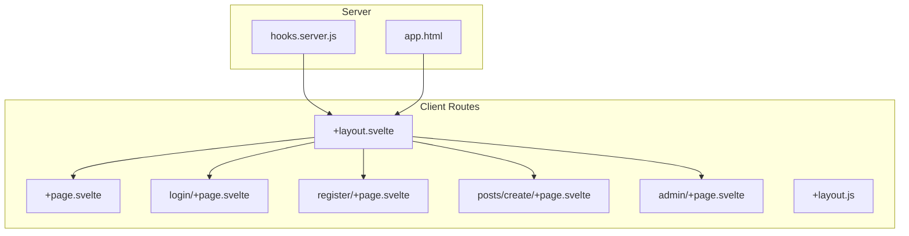
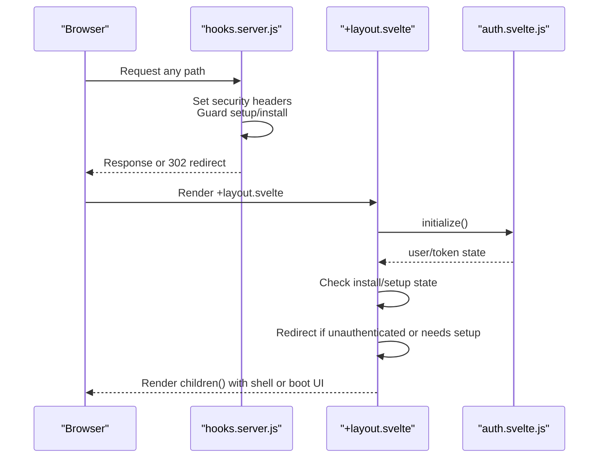
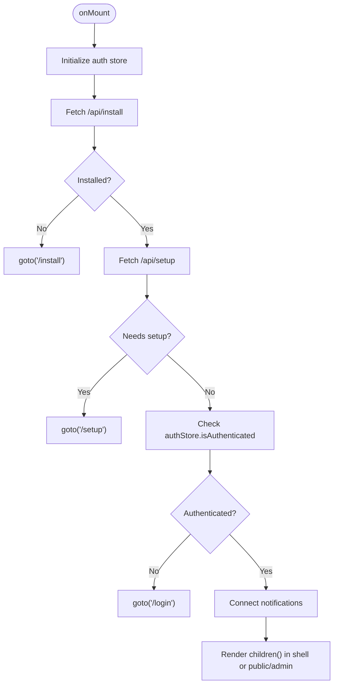
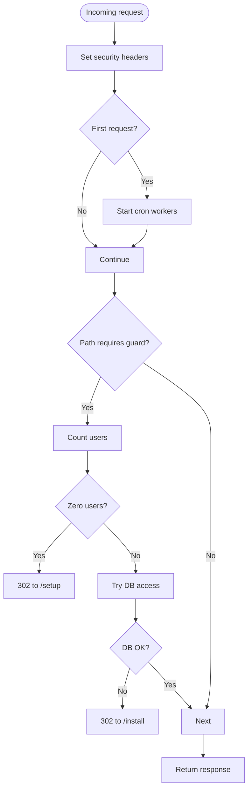
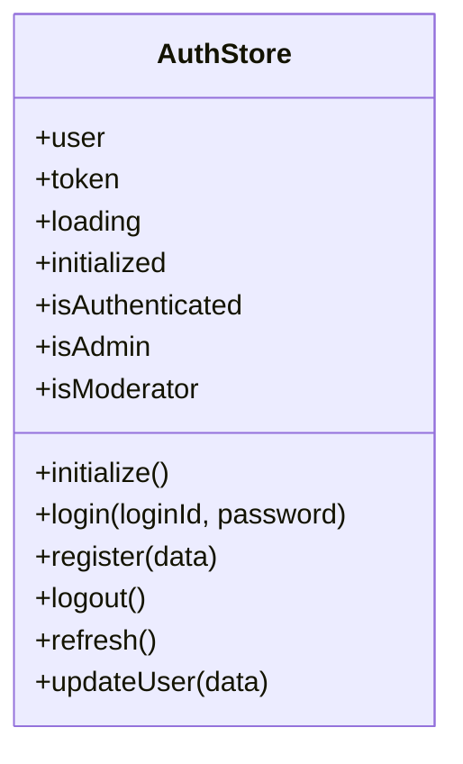
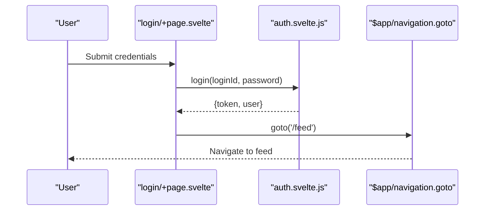
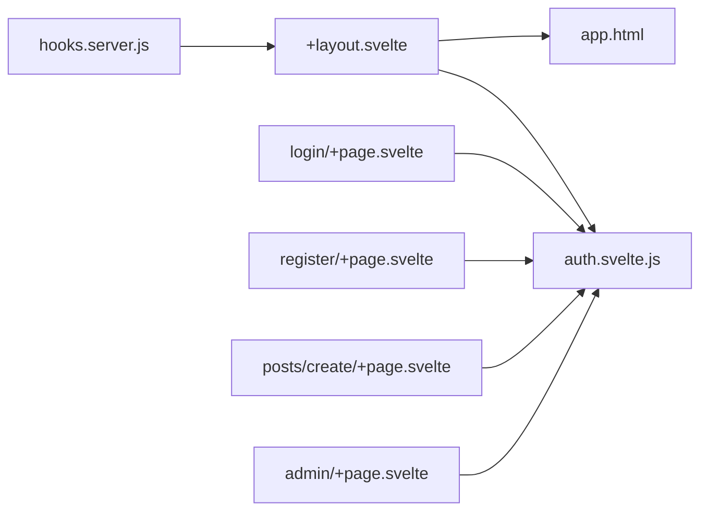

# Routing & Navigation

<cite>
**Referenced Files in This Document**
- [+layout.svelte](file://frontend/src/routes/+layout.svelte)
- [+layout.js](file://frontend/src/routes/+layout.js)
- [hooks.server.js](file://frontend/src/hooks.server.js)
- [app.html](file://frontend/src/app.html)
- [login/+page.svelte](file://frontend/src/routes/login/+page.svelte)
- [register/+page.svelte](file://frontend/src/routes/register/+page.svelte)
- [posts/create/+page.svelte](file://frontend/src/routes/posts/create/+page.svelte)
- [admin/+page.svelte](file://frontend/src/routes/admin/+page.svelte)
- [auth.svelte.js](file://frontend/src/lib/stores/auth.svelte.js)
</cite>

## Table of Contents
1. [Introduction](#introduction)
2. [Project Structure](#project-structure)
3. [Core Components](#core-components)
4. [Architecture Overview](#architecture-overview)
5. [Detailed Component Analysis](#detailed-component-analysis)
6. [Dependency Analysis](#dependency-analysis)
7. [Performance Considerations](#performance-considerations)
8. [Troubleshooting Guide](#troubleshooting-guide)
9. [Conclusion](#conclusion)

## Introduction
This document explains VSocial’s routing system and navigation patterns built with SvelteKit. It covers file-based routing, dynamic routes, nested layouts, route guards, authentication protection, redirects, programmatic navigation, route parameters handling, conditional rendering, navigation state management, SEO and meta tags, progressive enhancement, error handling, loading states, and fallback mechanisms for failed navigations.

## Project Structure
VSocial organizes routes by feature under frontend/src/routes. Pages are named with +page.svelte, server endpoints with +page.server.js or +server.js, and shared layout concerns live in +layout.svelte and +layout.js. Server hooks enforce global guards and security headers. The HTML template sets site-wide metadata and theme color.

**Diagram sources**
- [+layout.svelte:1-341](file://frontend/src/routes/+layout.svelte#L1-L341)
- [+layout.js:1-3](file://frontend/src/routes/+layout.js#L1-L3)
- [hooks.server.js:1-179](file://frontend/src/hooks.server.js#L1-L179)
- [app.html:1-24](file://frontend/src/app.html#L1-L24)

**Section sources**
- [+layout.svelte:1-341](file://frontend/src/routes/+layout.svelte#L1-L341)
- [+layout.js:1-3](file://frontend/src/routes/+layout.js#L1-L3)
- [hooks.server.js:1-179](file://frontend/src/hooks.server.js#L1-L179)
- [app.html:1-24](file://frontend/src/app.html#L1-L24)

## Core Components
- Global layout and navigation guard: +layout.svelte orchestrates theme initialization, View Transition API integration, installation and setup redirections, and authentication-based routing.
- Server hooks: hooks.server.js enforces security headers, setup wizard guard, and database-driven redirects to installation/setup flows.
- Authentication store: auth.svelte.js manages token persistence, user state, and derived roles for conditional rendering and guards.
- Page-level navigation: login, register, posts/create, and admin pages demonstrate programmatic navigation via goto and route guards.

**Section sources**
- [+layout.svelte:1-341](file://frontend/src/routes/+layout.svelte#L1-L341)
- [hooks.server.js:105-147](file://frontend/src/hooks.server.js#L105-L147)
- [auth.svelte.js:1-131](file://frontend/src/lib/stores/auth.svelte.js#L1-L131)
- [login/+page.svelte:1-390](file://frontend/src/routes/login/+page.svelte#L1-L390)
- [register/+page.svelte:1-700](file://frontend/src/routes/register/+page.svelte#L1-L700)
- [posts/create/+page.svelte:1-952](file://frontend/src/routes/posts/create/+page.svelte#L1-L952)
- [admin/+page.svelte:1-357](file://frontend/src/routes/admin/+page.svelte#L1-L357)

## Architecture Overview
The routing system combines client-side SvelteKit routing with server-side hooks. The global layout initializes theme and auth state, performs installation/setup checks, and enforces authentication. Server hooks secure responses and redirect to setup or install when needed.

**Diagram sources**
- [hooks.server.js:105-147](file://frontend/src/hooks.server.js#L105-L147)
- [+layout.svelte:32-93](file://frontend/src/routes/+layout.svelte#L32-L93)
- [auth.svelte.js:22-47](file://frontend/src/lib/stores/auth.svelte.js#L22-L47)

## Detailed Component Analysis

### Global Layout and Navigation Guards (+layout.svelte)
- Initializes theme and auth store on mount.
- Uses onNavigate to integrate View Transition API for smooth page transitions.
- Implements installation and setup checks:
  - Fetches installation status and redirects to /install if not installed.
  - Redirects to /setup if setup is required; otherwise to /login.
- Enforces authentication:
  - Redirects unauthenticated users to /login when accessing app routes.
- Conditional rendering:
  - Renders boot UI while initializing.
  - Renders public/admin routes without shell.
  - Renders authenticated app routes inside a responsive shell with side/top/mobile nav.

**Diagram sources**
- [+layout.svelte:32-93](file://frontend/src/routes/+layout.svelte#L32-L93)

**Section sources**
- [+layout.svelte:1-341](file://frontend/src/routes/+layout.svelte#L1-L341)

### Server Hooks and Route Guards (hooks.server.js)
- Sets security headers for all responses.
- Starts periodic cron workers on first request.
- Guards:
  - Redirects to /setup if no users exist and path is not /setup.
  - Redirects to /install if DB not ready and path is not install-related.
- Global error handler:
  - Logs detailed server-side errors.
  - Returns structured error responses to clients.

**Diagram sources**
- [hooks.server.js:105-147](file://frontend/src/hooks.server.js#L105-L147)

**Section sources**
- [hooks.server.js:1-179](file://frontend/src/hooks.server.js#L1-L179)

### Authentication Store (auth.svelte.js)
- Reactive state for user, token, loading, and initialization.
- Derived flags: isAuthenticated, isAdmin, isModerator.
- Methods:
  - initialize(): loads token from localStorage, sets cookie, fetches user.
  - login()/register(): stores token and user, persists token.
  - logout(): clears token and user.
  - refresh(): refreshes user; logs out on 401.
  - updateUser(): updates local user data.

**Diagram sources**
- [auth.svelte.js:1-131](file://frontend/src/lib/stores/auth.svelte.js#L1-L131)

**Section sources**
- [auth.svelte.js:1-131](file://frontend/src/lib/stores/auth.svelte.js#L1-L131)

### Programmatic Navigation and Route Guards in Pages
- Login page:
  - On mount, redirects authenticated users to /feed.
  - On submit, calls authStore.login and navigates to /feed.
  - Sets page-specific meta tags in <svelte:head>.
- Registration page:
  - Multi-step form with programmatic navigation to /feed upon completion.
  - Redirects authenticated users to /feed.
  - Sets page-specific meta tags in <svelte:head>.
- Posts creation page:
  - Guards access by redirecting unauthenticated users to /login.
  - Uploads media and posts, then navigates to /feed.
- Admin dashboard:
  - Loads metrics and recent activity; sets page-specific meta tags.

**Diagram sources**
- [login/+page.svelte:42-57](file://frontend/src/routes/login/+page.svelte#L42-L57)
- [auth.svelte.js:52-61](file://frontend/src/lib/stores/auth.svelte.js#L52-L61)

**Section sources**
- [login/+page.svelte:1-390](file://frontend/src/routes/login/+page.svelte#L1-L390)
- [register/+page.svelte:1-700](file://frontend/src/routes/register/+page.svelte#L1-L700)
- [posts/create/+page.svelte:1-952](file://frontend/src/routes/posts/create/+page.svelte#L1-L952)
- [admin/+page.svelte:1-357](file://frontend/src/routes/admin/+page.svelte#L1-L357)
- [auth.svelte.js:1-131](file://frontend/src/lib/stores/auth.svelte.js#L1-L131)

### Dynamic Routes and Nested Layouts
- Dynamic route examples:
  - User profile: u/[username] renders +page.svelte under frontend/src/routes/u/.
  - Posts edit: posts/[id]/edit renders +page.svelte under frontend/src/routes/posts/[id]/edit/.
- Nested layouts:
  - +layout.svelte wraps all routes and conditionally renders shell or boot UI.
  - +layout.js controls SSR/prerender behavior for the layout.

**Section sources**
- [+layout.svelte:1-341](file://frontend/src/routes/+layout.svelte#L1-L341)
- [+layout.js:1-3](file://frontend/src/routes/+layout.js#L1-L3)

### SEO, Meta Tags, and Progressive Enhancement
- Site-wide metadata and theme color are set in app.html.
- Page-level meta tags are set via <svelte:head> in individual pages (e.g., login, register, admin).
- Progressive enhancement:
  - Boot UI during initialization.
  - View Transitions for navigations.
  - LocalStorage-backed auth persistence with cookie sync.

**Section sources**
- [app.html:1-24](file://frontend/src/app.html#L1-L24)
- [login/+page.svelte:64-71](file://frontend/src/routes/login/+page.svelte#L64-L71)
- [register/+page.svelte:119-124](file://frontend/src/routes/register/+page.svelte#L119-L124)
- [admin/+page.svelte:44-46](file://frontend/src/routes/admin/+page.svelte#L44-L46)
- [+layout.svelte:102-142](file://frontend/src/routes/+layout.svelte#L102-L142)

### Error Handling, Loading States, and Fallbacks
- Server error handling:
  - hooks.server.js handleError logs and returns structured error responses.
- Client-side loading and fallbacks:
  - +layout.svelte shows a boot UI while initializing and loading auth.
  - Admin dashboard shows a loader until data is fetched.
  - Individual pages display error banners and disable actions during loading.

**Section sources**
- [hooks.server.js:154-178](file://frontend/src/hooks.server.js#L154-L178)
- [+layout.svelte:106-142](file://frontend/src/routes/+layout.svelte#L106-L142)
- [admin/+page.svelte:53-57](file://frontend/src/routes/admin/+page.svelte#L53-L57)

## Dependency Analysis
- +layout.svelte depends on:
  - $app/navigation for goto and onNavigate.
  - Stores for auth and notifications.
  - Local API endpoints for installation/setup checks.
- hooks.server.js depends on:
  - Database initialization and drivers.
  - Cron workers for scheduled tasks.
- Pages depend on:
  - auth.svelte.js for authentication state and actions.
  - $app/navigation for programmatic navigation.

**Diagram sources**
- [hooks.server.js:1-179](file://frontend/src/hooks.server.js#L1-L179)
- [+layout.svelte:1-341](file://frontend/src/routes/+layout.svelte#L1-L341)
- [auth.svelte.js:1-131](file://frontend/src/lib/stores/auth.svelte.js#L1-L131)
- [login/+page.svelte:1-390](file://frontend/src/routes/login/+page.svelte#L1-L390)
- [register/+page.svelte:1-700](file://frontend/src/routes/register/+page.svelte#L1-L700)
- [posts/create/+page.svelte:1-952](file://frontend/src/routes/posts/create/+page.svelte#L1-L952)
- [admin/+page.svelte:1-357](file://frontend/src/routes/admin/+page.svelte#L1-L357)

**Section sources**
- [hooks.server.js:1-179](file://frontend/src/hooks.server.js#L1-L179)
- [+layout.svelte:1-341](file://frontend/src/routes/+layout.svelte#L1-L341)
- [auth.svelte.js:1-131](file://frontend/src/lib/stores/auth.svelte.js#L1-L131)

## Performance Considerations
- Use View Transition API for perceptible navigation smoothness.
- Minimize heavy work in onMount; defer non-critical initialization.
- Persist tokens locally and sync cookies to reduce revalidation overhead.
- Lazy-load optional UI panels (e.g., GIF/poll/location/schedule) to improve perceived performance.

## Troubleshooting Guide
- Installation/Setup redirects loop:
  - Verify /api/install and /api/setup responses and +layout.svelte checks.
- Authentication redirects to login:
  - Confirm authStore initialization and token presence.
- Server errors:
  - Inspect server logs from handleError and adjust API responses accordingly.
- Boot UI stuck:
  - Ensure authStore.initialize resolves and install/setup checks complete.

**Section sources**
- [+layout.svelte:32-93](file://frontend/src/routes/+layout.svelte#L32-L93)
- [auth.svelte.js:22-47](file://frontend/src/lib/stores/auth.svelte.js#L22-L47)
- [hooks.server.js:154-178](file://frontend/src/hooks.server.js#L154-L178)

## Conclusion
VSocial’s routing system leverages SvelteKit’s file-based routing with robust client and server-side guards. The global layout coordinates theme, auth, installation, and setup flows, while server hooks enforce security and redirect policies. Pages implement programmatic navigation, guarded access, and progressive enhancements. SEO and meta tags are handled at both global and page levels, and error handling ensures resilient user experiences.