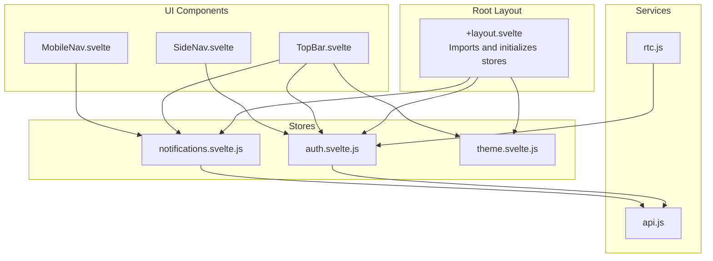
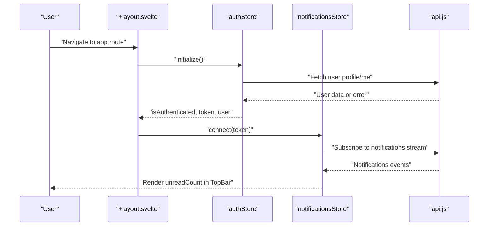
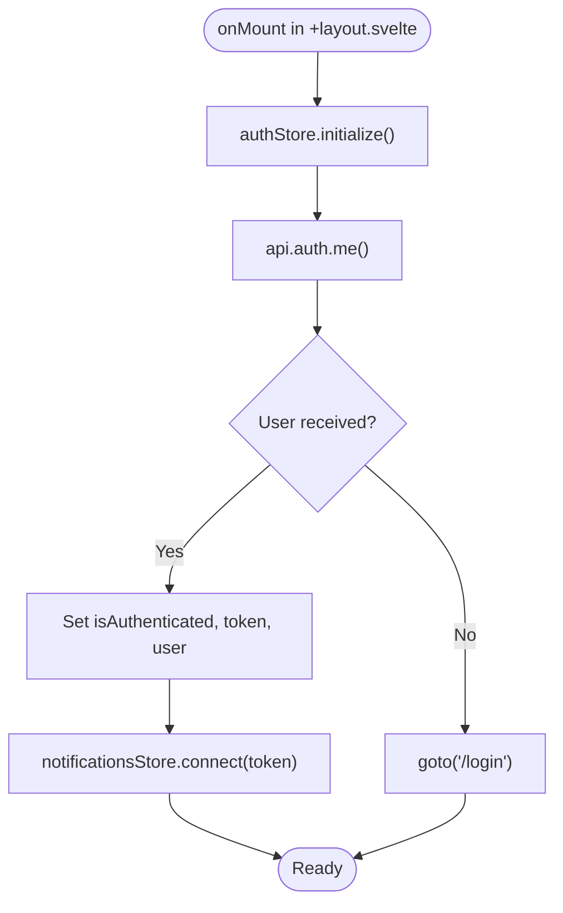
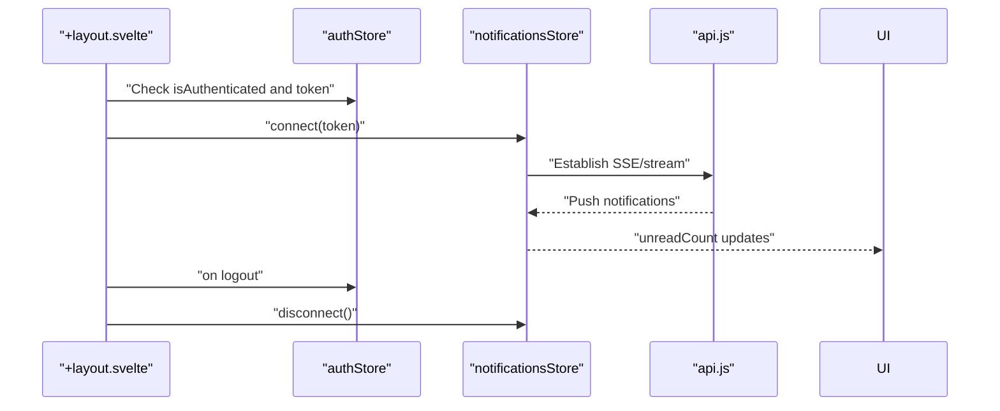
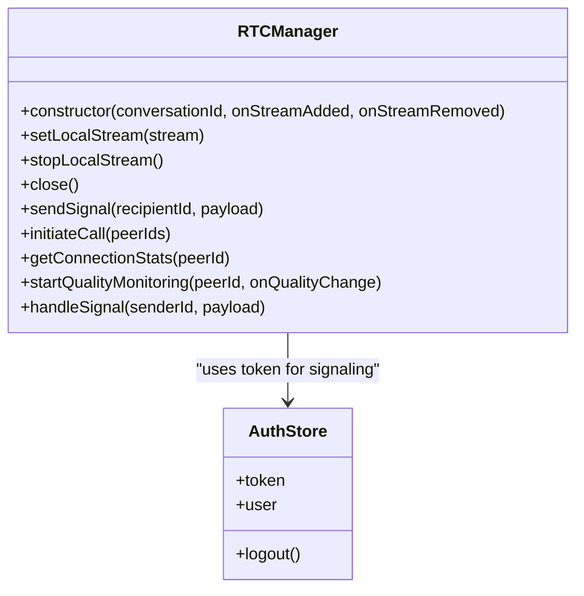
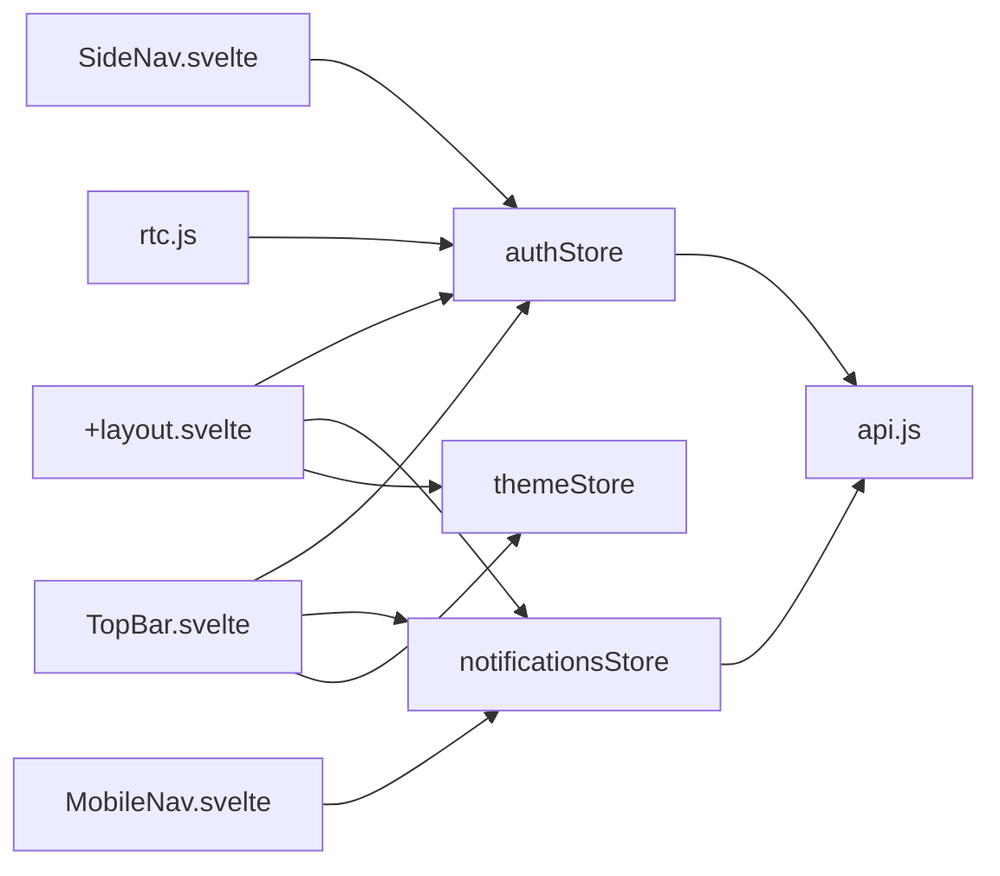

# State Management & Stores

<cite>
**Referenced Files in This Document**
- [+layout.svelte](file://frontend/src/routes/+layout.svelte)
- [TopBar.svelte](file://frontend/src/lib/components/TopBar.svelte)
- [SideNav.svelte](file://frontend/src/lib/components/SideNav.svelte)
- [MobileNav.svelte](file://frontend/src/lib/components/MobileNav.svelte)
- [api.js](file://frontend/src/lib/api.js)
- [rtc.js](file://frontend/src/lib/rtc.js)
- [hooks.server.js](file://frontend/src/hooks.server.js)
</cite>

## Table of Contents
1. [Introduction](#introduction)
2. [Project Structure](#project-structure)
3. [Core Components](#core-components)
4. [Architecture Overview](#architecture-overview)
5. [Detailed Component Analysis](#detailed-component-analysis)
6. [Dependency Analysis](#dependency-analysis)
7. [Performance Considerations](#performance-considerations)
8. [Troubleshooting Guide](#troubleshooting-guide)
9. [Conclusion](#conclusion)
10. [Appendices](#appendices)

## Introduction
This document explains VSocial’s state management system built with Svelte 5 runes and stores. It focuses on reactive state patterns, store architecture, and data flow across the application. It documents authentication and user state, application-wide state handling, store composition, persistence via local storage, and synchronization with backend APIs. Practical examples show store initialization, subscriptions, and updates. Performance, memory management, and debugging strategies are included, along with integration patterns for components and server-side rendering considerations.

## Project Structure
VSocial organizes state management around:
- Application-wide stores imported and initialized in the root layout
- Component-level stores for UI state (e.g., theme, notifications)
- A centralized API client for backend communication
- Real-time stores integrated via WebRTC manager and SSE/notifications

**Diagram sources**
- [+layout.svelte](file://frontend/src/routes/+layout.svelte)
- [TopBar.svelte](file://frontend/src/lib/components/TopBar.svelte)
- [SideNav.svelte](file://frontend/src/lib/components/SideNav.svelte)
- [MobileNav.svelte](file://frontend/src/lib/components/MobileNav.svelte)
- [api.js](file://frontend/src/lib/api.js)
- [rtc.js](file://frontend/src/lib/rtc.js)

**Section sources**
- [+layout.svelte](file://frontend/src/routes/+layout.svelte)
- [TopBar.svelte](file://frontend/src/lib/components/TopBar.svelte)
- [SideNav.svelte](file://frontend/src/lib/components/SideNav.svelte)
- [MobileNav.svelte](file://frontend/src/lib/components/MobileNav.svelte)
- [api.js](file://frontend/src/lib/api.js)
- [rtc.js](file://frontend/src/lib/rtc.js)

## Core Components
- Root layout initializes application-wide stores and enforces routing guards and theme initialization. It also connects notifications when authentication state permits.
- UI components subscribe to stores for rendering and user interactions:
  - TopBar displays notifications count and user profile actions
  - SideNav renders navigation and user card based on authentication state
  - MobileNav reflects active routes and notification badges
- API client encapsulates HTTP requests, token injection, and error handling
- RTC manager integrates real-time signaling and media streams using authentication store for secure transport

Key store integrations:
- Authentication store: user, token, loading, isAuthenticated, initialize, logout
- Notifications store: unreadCount, connect/disconnect lifecycle
- Theme store: value, toggle, initialization

**Section sources**
- [+layout.svelte](file://frontend/src/routes/+layout.svelte)
- [TopBar.svelte](file://frontend/src/lib/components/TopBar.svelte)
- [SideNav.svelte](file://frontend/src/lib/components/SideNav.svelte)
- [MobileNav.svelte](file://frontend/src/lib/components/MobileNav.svelte)
- [api.js](file://frontend/src/lib/api.js)
- [rtc.js](file://frontend/src/lib/rtc.js)

## Architecture Overview
The state architecture centers on Svelte 5 runes and store modules. Stores are singletons that manage reactive state and expose methods to mutate and observe state. Components subscribe to store state using reactive declarations and derived values. The API client centralizes network calls and attaches tokens from local storage. Real-time flows integrate with notifications and WebRTC.

**Diagram sources**
- [+layout.svelte](file://frontend/src/routes/+layout.svelte)
- [TopBar.svelte](file://frontend/src/lib/components/TopBar.svelte)
- [api.js](file://frontend/src/lib/api.js)

## Detailed Component Analysis

### Authentication Store Integration
- Initialization and guards:
  - Root layout calls authentication store initialization during mount
  - Guards enforce installation and setup steps and redirect unauthenticated users to login
- Token and user state:
  - Token is persisted in local storage and injected into API requests
  - User profile is fetched and stored in the authentication store
- Logout:
  - UI triggers logout, which clears token and navigates to home

**Diagram sources**
- [+layout.svelte](file://frontend/src/routes/+layout.svelte)
- [api.js](file://frontend/src/lib/api.js)

**Section sources**
- [+layout.svelte](file://frontend/src/routes/+layout.svelte)
- [TopBar.svelte](file://frontend/src/lib/components/TopBar.svelte)
- [api.js](file://frontend/src/lib/api.js)

### Notifications Store Integration
- Lifecycle:
  - Root layout connects notifications upon authentication
  - Disconnects when user logs out or store state changes
- UI binding:
  - TopBar and MobileNav render unread counts from notifications store
- Backend synchronization:
  - API client supports notifications endpoints for listing and marking read

**Diagram sources**
- [+layout.svelte](file://frontend/src/routes/+layout.svelte)
- [TopBar.svelte](file://frontend/src/lib/components/TopBar.svelte)
- [MobileNav.svelte](file://frontend/src/lib/components/MobileNav.svelte)
- [api.js](file://frontend/src/lib/api.js)

**Section sources**
- [+layout.svelte](file://frontend/src/routes/+layout.svelte)
- [TopBar.svelte](file://frontend/src/lib/components/TopBar.svelte)
- [MobileNav.svelte](file://frontend/src/lib/components/MobileNav.svelte)
- [api.js](file://frontend/src/lib/api.js)

### Theme Store Integration
- Initialization:
  - Root layout calls theme initialization to set initial theme preference
- UI binding:
  - TopBar toggles theme and reflects current value
- Persistence:
  - Theme value is persisted and restored across sessions

**Section sources**
- [+layout.svelte](file://frontend/src/routes/+layout.svelte)
- [TopBar.svelte](file://frontend/src/lib/components/TopBar.svelte)

### Real-Time Store Integration (WebRTC)
- RTC manager:
  - Uses authentication store token for signaling
  - Manages peer connections, ICE candidates, and media tracks
  - Provides connection quality metrics and reconnection logic
- Component integration:
  - Components trigger calls and receive remote streams via callbacks

**Diagram sources**
- [rtc.js](file://frontend/src/lib/rtc.js)

**Section sources**
- [rtc.js](file://frontend/src/lib/rtc.js)

### API Client and Persistence
- Centralized HTTP client:
  - Injects Authorization header from local storage
  - Normalizes responses and throws structured errors
- Persistence:
  - Token stored in local storage; used by API client and stores
- Endpoints:
  - Auth, feed, posts, users, stories, reels, messages, marketplace, notifications, admin, wallet, gigs, search, market, health

**Section sources**
- [api.js](file://frontend/src/lib/api.js)

## Dependency Analysis
- Root layout depends on:
  - Authentication store for guards and redirects
  - Notifications store for real-time updates
  - Theme store for UI initialization
- UI components depend on:
  - Authentication store for visibility and navigation
  - Notifications store for badges and counters
  - Theme store for UI state
- Services depend on:
  - API client for backend communication
  - Authentication store for secure signaling

**Diagram sources**
- [+layout.svelte](file://frontend/src/routes/+layout.svelte)
- [TopBar.svelte](file://frontend/src/lib/components/TopBar.svelte)
- [SideNav.svelte](file://frontend/src/lib/components/SideNav.svelte)
- [MobileNav.svelte](file://frontend/src/lib/components/MobileNav.svelte)
- [api.js](file://frontend/src/lib/api.js)
- [rtc.js](file://frontend/src/lib/rtc.js)

**Section sources**
- [+layout.svelte](file://frontend/src/routes/+layout.svelte)
- [TopBar.svelte](file://frontend/src/lib/components/TopBar.svelte)
- [SideNav.svelte](file://frontend/src/lib/components/SideNav.svelte)
- [MobileNav.svelte](file://frontend/src/lib/components/MobileNav.svelte)
- [api.js](file://frontend/src/lib/api.js)
- [rtc.js](file://frontend/src/lib/rtc.js)

## Performance Considerations
- Reactive granularity:
  - Prefer fine-grained reactive declarations ($state, $derived) to minimize unnecessary re-renders
  - Avoid large reactive objects; split state into focused stores
- Store subscriptions:
  - Subscribe only where needed; unsubscribe on destroy to prevent leaks
- API batching:
  - Batch frequent notifications polling into fewer requests or use streaming where available
- Media and real-time:
  - Close peer connections and stop tracks when leaving pages or logging out
- Memory management:
  - Clear intervals and timers in cleanup functions
  - Dispose of event listeners and observers

## Troubleshooting Guide
- Authentication loops:
  - Verify installation and setup checks before redirecting to login
  - Ensure token presence and validity before connecting notifications
- Notifications not updating:
  - Confirm notifications store connect/disconnect lifecycle matches auth state
  - Check API connectivity and SSE endpoint availability
- Theme not persisting:
  - Validate theme store initialization and persistence logic
- RTC failures:
  - Inspect ICE restart attempts and candidate buffering
  - Verify token propagation for signaling requests
- Server-side rendering:
  - Guard server hooks to avoid SSR issues with client-only APIs
  - Ensure database initialization runs before first request

**Section sources**
- [+layout.svelte](file://frontend/src/routes/+layout.svelte)
- [hooks.server.js](file://frontend/src/hooks.server.js)
- [TopBar.svelte](file://frontend/src/lib/components/TopBar.svelte)
- [MobileNav.svelte](file://frontend/src/lib/components/MobileNav.svelte)
- [api.js](file://frontend/src/lib/api.js)
- [rtc.js](file://frontend/src/lib/rtc.js)

## Conclusion
VSocial’s state management leverages Svelte 5 runes and modular stores to deliver a responsive, scalable front-end. The root layout orchestrates initialization and guards, while components subscribe to stores for UI state. The API client centralizes backend integration, and real-time flows integrate with notifications and WebRTC. Following the patterns documented here ensures maintainable, performant, and debuggable state handling across the application.

## Appendices
- Store composition patterns:
  - Compose small, focused stores and derive higher-level state from them
  - Keep mutation points centralized behind store methods
- Subscription patterns:
  - Use $effect and $effect.root for side effects and cleanup
  - Bind UI state directly to store values for declarative updates
- State updates:
  - Prefer immutable updates and batch changes to reduce reactivity churn
- Debugging:
  - Use browser devtools to inspect reactive values and subscriptions
  - Log store transitions and API responses for tracing issues