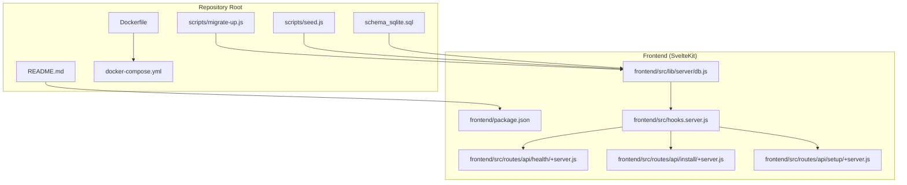
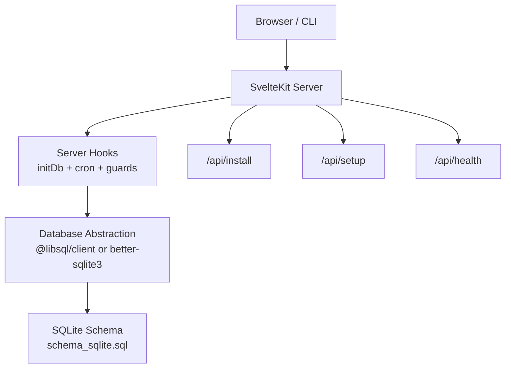
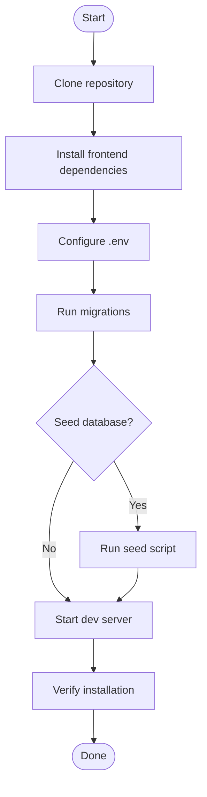
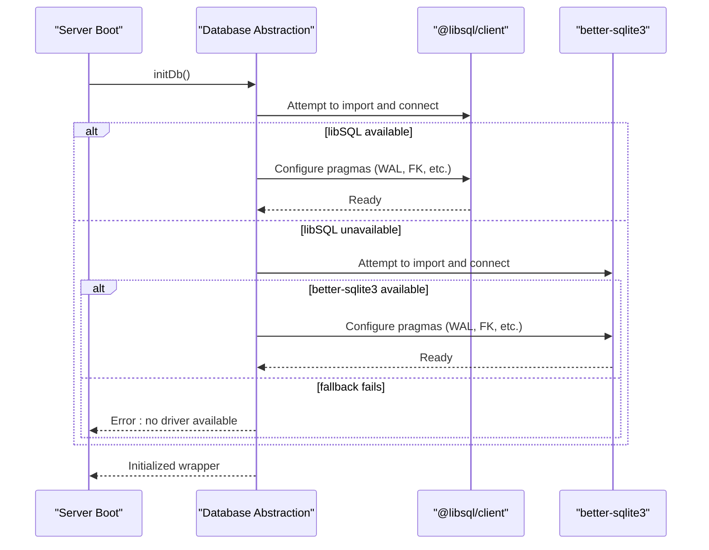
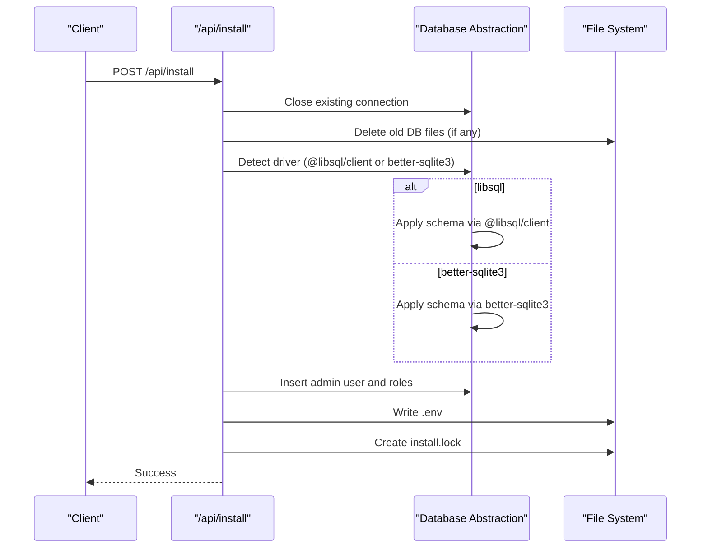
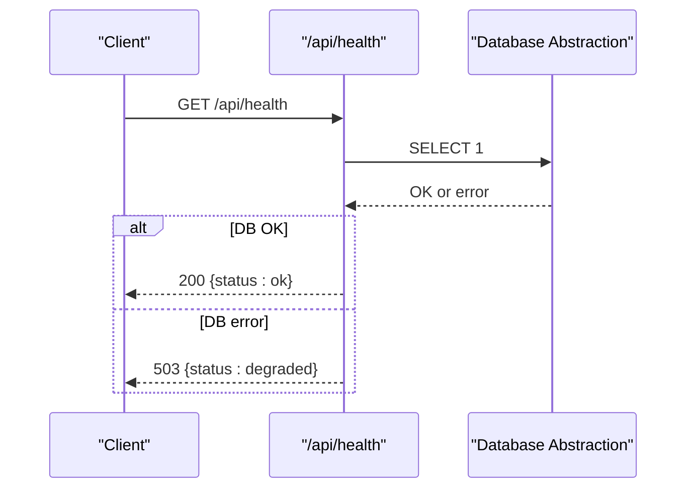
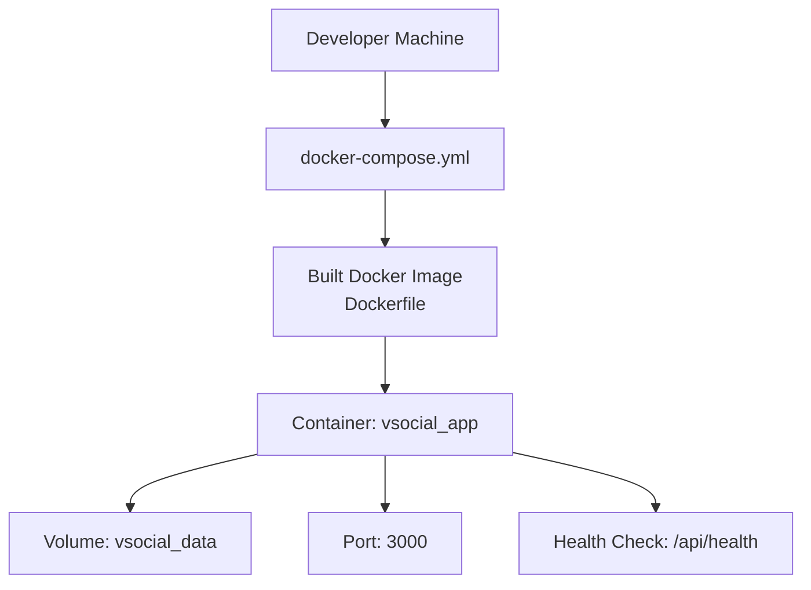
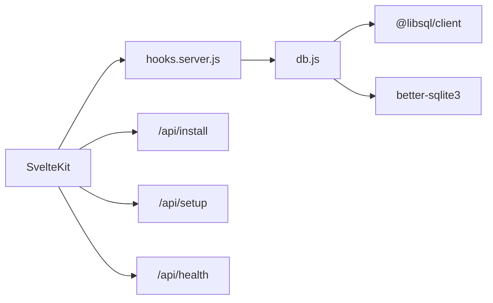

# Getting Started

<cite>
**Referenced Files in This Document**
- [README.md](file://README.md)
- [frontend/package.json](file://frontend/package.json)
- [Dockerfile](file://Dockerfile)
- [docker-compose.yml](file://docker-compose.yml)
- [scripts/migrate-up.js](file://scripts/migrate-up.js)
- [scripts/seed.js](file://scripts/seed.js)
- [frontend/src/lib/server/db.js](file://frontend/src/lib/server/db.js)
- [frontend/src/hooks.server.js](file://frontend/src/hooks.server.js)
- [frontend/src/routes/api/health/+server.js](file://frontend/src/routes/api/health/+server.js)
- [frontend/src/routes/api/install/+server.js](file://frontend/src/routes/api/install/+server.js)
- [frontend/src/routes/api/setup/+server.js](file://frontend/src/routes/api/setup/+server.js)
- [schema_sqlite.sql](file://schema_sqlite.sql)
- [test_install.mjs](file://test_install.mjs)
</cite>

## Table of Contents
1. [Introduction](#introduction)
2. [Project Structure](#project-structure)
3. [Core Components](#core-components)
4. [Architecture Overview](#architecture-overview)
5. [Detailed Component Analysis](#detailed-component-analysis)
6. [Dependency Analysis](#dependency-analysis)
7. [Performance Considerations](#performance-considerations)
8. [Troubleshooting Guide](#troubleshooting-guide)
9. [Conclusion](#conclusion)
10. [Appendices](#appendices)

## Introduction
This guide helps you install, configure, and run VSocial from scratch. It covers prerequisites, step-by-step installation, environment configuration, database migrations, optional seeding, development server startup, and Docker-based deployment. You will also find verification steps, essential commands, and troubleshooting tips to ensure a smooth setup.

## Project Structure
VSocial is a SvelteKit-based full-stack application with a SQLite-compatible backend. The repository includes:
- Frontend application under frontend/
- Database migration scripts under scripts/
- SQL schema files under root and frontend/src/lib/server/
- Docker build and compose files for production deployment
- Health check endpoint and installation/setup APIs

**Diagram sources**
- [README.md:1-112](file://README.md#L1-L112)
- [Dockerfile:1-30](file://Dockerfile#L1-L30)
- [docker-compose.yml:1-27](file://docker-compose.yml#L1-L27)
- [scripts/migrate-up.js:1-57](file://scripts/migrate-up.js#L1-L57)
- [scripts/seed.js:1-61](file://scripts/seed.js#L1-L61)
- [schema_sqlite.sql:1-702](file://schema_sqlite.sql#L1-L702)
- [frontend/package.json:1-49](file://frontend/package.json#L1-L49)
- [frontend/src/lib/server/db.js:1-209](file://frontend/src/lib/server/db.js#L1-L209)
- [frontend/src/hooks.server.js:1-179](file://frontend/src/hooks.server.js#L1-L179)
- [frontend/src/routes/api/health/+server.js:1-22](file://frontend/src/routes/api/health/+server.js#L1-L22)
- [frontend/src/routes/api/install/+server.js:1-175](file://frontend/src/routes/api/install/+server.js#L1-L175)
- [frontend/src/routes/api/setup/+server.js:1-72](file://frontend/src/routes/api/setup/+server.js#L1-L72)

**Section sources**
- [README.md:1-112](file://README.md#L1-L112)
- [frontend/package.json:1-49](file://frontend/package.json#L1-L49)

## Core Components
- Database abstraction and initialization: Selects between @libsql/client and better-sqlite3, applies SQLite pragmas, and exposes a unified async API.
- Installation and setup APIs: Provide automated installation and initial admin setup.
- Health endpoint: Confirms application and database connectivity.
- Migration and seeding scripts: Apply schema migrations and seed initial data.

Key responsibilities:
- Database driver selection and initialization
- Environment variable loading (.env)
- Application bootstrapping and cron tasks
- Installation and setup automation
- Health monitoring

**Section sources**
- [frontend/src/lib/server/db.js:1-209](file://frontend/src/lib/server/db.js#L1-L209)
- [frontend/src/hooks.server.js:1-179](file://frontend/src/hooks.server.js#L1-L179)
- [frontend/src/routes/api/install/+server.js:1-175](file://frontend/src/routes/api/install/+server.js#L1-L175)
- [frontend/src/routes/api/setup/+server.js:1-72](file://frontend/src/routes/api/setup/+server.js#L1-L72)
- [frontend/src/routes/api/health/+server.js:1-22](file://frontend/src/routes/api/health/+server.js#L1-L22)

## Architecture Overview
The runtime architecture integrates SvelteKit server-side rendering with a database abstraction layer. The server initializes the database on startup, runs periodic tasks, and exposes REST endpoints for installation, setup, and health checks.

**Diagram sources**
- [frontend/src/hooks.server.js:1-179](file://frontend/src/hooks.server.js#L1-L179)
- [frontend/src/lib/server/db.js:1-209](file://frontend/src/lib/server/db.js#L1-L209)
- [frontend/src/routes/api/install/+server.js:1-175](file://frontend/src/routes/api/install/+server.js#L1-L175)
- [frontend/src/routes/api/setup/+server.js:1-72](file://frontend/src/routes/api/setup/+server.js#L1-L72)
- [frontend/src/routes/api/health/+server.js:1-22](file://frontend/src/routes/api/health/+server.js#L1-L22)
- [schema_sqlite.sql:1-702](file://schema_sqlite.sql#L1-L702)

## Detailed Component Analysis

### Prerequisites
- Node.js >= 18.x
- npm
- Optional: either @libsql/client or better-sqlite3 installed for database operations

Verification:
- Confirm Node.js version meets the requirement.
- Ensure npm is available.

**Section sources**
- [README.md:33-36](file://README.md#L33-L36)

### Step-by-Step Installation

1) Clone the repository
- Clone the repository and navigate into the project directory.

2) Install frontend dependencies
- Change to the frontend directory and install dependencies.

3) Configure environment variables
- Copy the example environment file to .env and edit it with your settings.

4) Run database migrations
- Apply pending migrations using the provided script.

5) Seed the database (optional)
- Populate initial data (settings, marketplace categories) using the seed script.

6) Start the development server
- Launch the SvelteKit development server in the frontend directory.

**Diagram sources**
- [README.md:38-74](file://README.md#L38-L74)
- [scripts/migrate-up.js:1-57](file://scripts/migrate-up.js#L1-L57)
- [scripts/seed.js:1-61](file://scripts/seed.js#L1-L61)

**Section sources**
- [README.md:38-74](file://README.md#L38-L74)

### Environment Configuration
- The database path and URL are loaded from environment variables. Local databases are created/written to the configured path.
- The server loads .env automatically during initialization.
- For Docker deployments, environment variables are passed via docker-compose.

Key environment variables:
- DB_PATH: Path to the SQLite database file
- DATABASE_URL: libSQL-compatible URL (alternative to DB_PATH)
- DATABASE_AUTH_TOKEN: Optional auth token for remote libSQL
- JWT_SECRET: Secret for signing JWT tokens
- UPLOAD_DIR: Directory for uploaded files
- MAX_FILE_SIZE: Maximum allowed file size for uploads

Notes:
- If DB_PATH is a local file path, the server ensures the directory exists.
- The installation API writes a default .env with required keys after installation.

**Section sources**
- [frontend/src/lib/server/db.js:16-22](file://frontend/src/lib/server/db.js#L16-L22)
- [frontend/src/lib/server/db.js:117-167](file://frontend/src/lib/server/db.js#L117-L167)
- [frontend/src/routes/api/install/+server.js:146-156](file://frontend/src/routes/api/install/+server.js#L146-L156)
- [docker-compose.yml:9-16](file://docker-compose.yml#L9-L16)

### Database Initialization and Driver Selection
- On server startup, the database is initialized and configured with SQLite pragmas (WAL, foreign keys, synchronous).
- The driver selection order is:
  1) @libsql/client (preferred)
  2) better-sqlite3 (fallback)
- If neither is available, initialization fails and logs an error.

**Diagram sources**
- [frontend/src/hooks.server.js:8-14](file://frontend/src/hooks.server.js#L8-L14)
- [frontend/src/lib/server/db.js:117-167](file://frontend/src/lib/server/db.js#L117-L167)

**Section sources**
- [frontend/src/lib/server/db.js:117-167](file://frontend/src/lib/server/db.js#L117-L167)
- [frontend/src/hooks.server.js:8-14](file://frontend/src/hooks.server.js#L8-L14)

### Migrations and Seeding
- Migrations:
  - The migration runner creates a migration tracking table and applies SQL files in order.
  - Skips already-applied migrations and exits on failure.
- Seeding:
  - Seeds system settings and marketplace categories.
  - Uses INSERT ... ON CONFLICT to avoid duplicates.

```mermaid
flowchart TD
MStart["migrate-up.js"] --> Init["initDb()"]
Init --> CreateTbl["Ensure _migrations table"]
CreateTbl --> Scan["Scan migrations dir"]
Scan --> ForEach["For each .sql file"]
ForEach --> Check["Check if applied"]
Check --> |Yes| Skip["Skip file"]
Check --> |No| Read["Read SQL file"]
Read --> Exec["Execute SQL and record migration"]
Exec --> Next["Next file"]
Skip --> Next
Next --> MEnd["Up to date"]
SStart["seed.js"] --> Init2["initDb()"]
Init2 --> Settings["Seed system_settings"]
Settings --> Categories["Seed marketplace_categories"]
Categories --> SEnd["Done"]
```

**Diagram sources**
- [scripts/migrate-up.js:9-54](file://scripts/migrate-up.js#L9-L54)
- [scripts/seed.js:7-55](file://scripts/seed.js#L7-L55)

**Section sources**
- [scripts/migrate-up.js:1-57](file://scripts/migrate-up.js#L1-L57)
- [scripts/seed.js:1-61](file://scripts/seed.js#L1-L61)

### Installation and Setup APIs
- Installation API (/api/install):
  - Checks installation status and requirements.
  - Installs the database schema using the detected driver, seeds admin user, writes .env, and creates an install lock.
- Setup API (/api/setup):
  - Creates the first super admin user, sets basic system settings, and initializes marketplace categories if missing.

**Diagram sources**
- [frontend/src/routes/api/install/+server.js:60-174](file://frontend/src/routes/api/install/+server.js#L60-L174)

**Section sources**
- [frontend/src/routes/api/install/+server.js:1-175](file://frontend/src/routes/api/install/+server.js#L1-L175)
- [frontend/src/routes/api/setup/+server.js:1-72](file://frontend/src/routes/api/setup/+server.js#L1-L72)

### Health Endpoint
- The health endpoint queries the database to confirm connectivity and returns a status code accordingly.

**Diagram sources**
- [frontend/src/routes/api/health/+server.js:4-21](file://frontend/src/routes/api/health/+server.js#L4-L21)

**Section sources**
- [frontend/src/routes/api/health/+server.js:1-22](file://frontend/src/routes/api/health/+server.js#L1-L22)

### Development Server Startup
- Start the SvelteKit development server in the frontend directory.
- The server initializes the database on startup and guards routes to enforce installation and setup.

Essential commands:
- npm run dev: Start development server
- npm run build: Create production build
- npm run preview: Preview production build
- npm run lint: Run ESLint and Prettier checks
- npm run format: Format code with Prettier and ESLint
- npm run test: Run unit tests with Vitest

**Section sources**
- [README.md:75-87](file://README.md#L75-L87)
- [frontend/package.json:6-16](file://frontend/package.json#L6-L16)

### Docker Deployment
- Build and run the application using Docker Compose.
- The Dockerfile builds the frontend and runs the production server.
- docker-compose defines environment variables, port mapping, volume mounts, and a health check.

**Diagram sources**
- [Dockerfile:1-30](file://Dockerfile#L1-L30)
- [docker-compose.yml:1-27](file://docker-compose.yml#L1-L27)

**Section sources**
- [README.md:89-96](file://README.md#L89-L96)
- [Dockerfile:1-30](file://Dockerfile#L1-L30)
- [docker-compose.yml:1-27](file://docker-compose.yml#L1-L27)

## Dependency Analysis
- Runtime dependencies include SvelteKit, adapters, database clients, and utilities.
- The database abstraction layer depends on either @libsql/client or better-sqlite3 being present.
- The server hooks depend on the database initialization and expose the installation, setup, and health endpoints.

**Diagram sources**
- [frontend/package.json:17-47](file://frontend/package.json#L17-L47)
- [frontend/src/lib/server/db.js:1-209](file://frontend/src/lib/server/db.js#L1-L209)
- [frontend/src/hooks.server.js:1-179](file://frontend/src/hooks.server.js#L1-L179)
- [frontend/src/routes/api/install/+server.js:1-175](file://frontend/src/routes/api/install/+server.js#L1-L175)
- [frontend/src/routes/api/setup/+server.js:1-72](file://frontend/src/routes/api/setup/+server.js#L1-L72)
- [frontend/src/routes/api/health/+server.js:1-22](file://frontend/src/routes/api/health/+server.js#L1-L22)

**Section sources**
- [frontend/package.json:17-47](file://frontend/package.json#L17-L47)
- [frontend/src/lib/server/db.js:1-209](file://frontend/src/lib/server/db.js#L1-L209)

## Performance Considerations
- WAL mode is enabled for SQLite to improve concurrency and durability.
- Foreign keys and busy timeouts are configured to reduce deadlocks and improve reliability.
- Indexes are defined in the schema to optimize common queries.
- Consider enabling remote libSQL for distributed deployments when appropriate.

[No sources needed since this section provides general guidance]

## Troubleshooting Guide
Common issues and resolutions:
- Node.js version mismatch
  - Ensure Node.js >= 18.x is installed.
- Missing database drivers
  - Install @libsql/client or better-sqlite3 to enable database operations.
- Database file locked (Windows)
  - The installation API closes the existing connection and removes stale SQLite files before recreating the database.
- Health check failing
  - Verify database connectivity and that the database is initialized.
- Port conflicts
  - Change the mapped port in docker-compose if 3000 is in use.
- Environment variables not applied
  - Confirm .env exists and contains required keys (DB_PATH, JWT_SECRET, UPLOAD_DIR, etc.).

Verification steps:
- Access the health endpoint to confirm database connectivity.
- Use the installation API to verify requirements and run installation.
- Start the development server and browse to the home page.

**Section sources**
- [frontend/src/lib/server/db.js:163-167](file://frontend/src/lib/server/db.js#L163-L167)
- [frontend/src/routes/api/install/+server.js:84-94](file://frontend/src/routes/api/install/+server.js#L84-L94)
- [frontend/src/routes/api/health/+server.js:11-18](file://frontend/src/routes/api/health/+server.js#L11-L18)
- [docker-compose.yml:7-8](file://docker-compose.yml#L7-L8)
- [README.md:33-36](file://README.md#L33-L36)

## Conclusion
You now have the essentials to install, configure, and run VSocial locally or in Docker. Use the provided scripts and APIs to initialize the database, seed data, and start the development server. For production, rely on the Docker images and compose configuration. If issues arise, consult the troubleshooting section and verify the health endpoint.

[No sources needed since this section summarizes without analyzing specific files]

## Appendices

### Essential Commands and Purposes
- npm run dev: Start development server
- npm run build: Create production build
- npm run preview: Preview production build
- npm run lint: Run ESLint and Prettier checks
- npm run format: Format code with Prettier and ESLint
- npm run test: Run unit tests with Vitest
- node scripts/migrate-up.js: Apply pending database migrations
- node scripts/migrate-down.js: Revert last database migration
- node scripts/seed.js: Seed database with initial data

**Section sources**
- [README.md:75-87](file://README.md#L75-L87)

### Verification Checklist
- Node.js version verified
- Dependencies installed
- .env configured
- Migrations applied
- Optional seeding completed
- Development server running
- Health endpoint returns 200
- Installation and setup APIs reachable

**Section sources**
- [frontend/src/routes/api/health/+server.js:4-21](file://frontend/src/routes/api/health/+server.js#L4-L21)
- [frontend/src/routes/api/install/+server.js:45-58](file://frontend/src/routes/api/install/+server.js#L45-L58)
- [frontend/src/routes/api/setup/+server.js:10-14](file://frontend/src/routes/api/setup/+server.js#L10-L14)